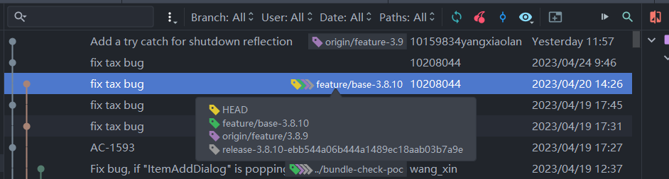

# 一、问题整理

## 1、2023/04/26

1. 购物车屏幕大小：1280 * 800
2. 构建：`D:/Idea/save/android/2_SSC_raicart/raicart/gradlew.bat clean assembleStaging`

### ①、入力弹窗弹出时间

1. 代码位置：`jp/retailai/raicart/ui/common/AddItemAnimationDialog.kt`
2. xml 位置：`layout/fragment_dialog_success.xml`
3. `jp/retailai/raicart/ui/shopping/ShoppingFragment.kt` 中变量：`itemAddCartDialog`
4. `jp/retailai/raicart/ui/shopping/ShoppingFragment.kt` 中方法：`showCartAddDialog`
5. 现在：在购物页面，当用户扫描商品时弹出；然后 3 秒后缩小消失


6. 修改：修改时间

```Kotlin
// 添加商品后，3000 毫秒后关闭该弹窗
TimerUtil().delayExecute(3000, {}, {
	if (!haveClick && dialog.isShowing) {
		dismissDialog(true)
	}
})
```

### ②、结帐后投放广告的页面

1. 代码位置：`java/jp/retailai/raicart/ui/end/OutsideLimitedFragment.kt`
2. xml 位置：`res/layout/fragment_score_screen.xml`
3. `java/jp/retailai/raicart/ui/end/EndFragment.kt` 中更改跳转到的页面

```Kotlin
/**
 * `TimerUtil().delayExecute()`是一个自定义的函数，它的作用是延迟执行一个函数。
 * 第一个参数是延迟的时间，第二个参数是每秒要执行的函数，第三个参数是计时结束时要执行的函数
 */
TimerUtil().delayExecute(config_thanks_page_delay.toInt(), {}, {
	// 点数获得画面 -> 评分画面
	findNavController().navigate(R.id.action_endFragment_to_ScoreScreenFragment)
})
```

4. 用户付款后，软件自动跳转到广告的页面：カートのご利用はいかがですか？
5. 要关注的关键指标：
	1. 平均关闭模式的时间
	2. 总体平均关闭时间
	3. 优惠券使用情况
	4. 建议使用情况
6. 感谢


7. 广告


8. 推车


9. 首页

### ③、修改基于的版本

1. 3.8.10
2. 开发新的PoC功能的时候，都是选择从指定版本的 release 的 tag 创建新的分支，比如这次的版本是 3.8.10，就使用 release-3.8.10-xxxxxx 名字的标签进行创建



### ④、项目结构

```
java/jp/retailai/raicart
├── base
├── bean
│	└── operationLog
│	└── scale
├── deployer
│	└── battery
│	└── camera
│	└── installation
│	└── logger
├── event
├── guide
├── network
├── room
├── ui
│	└── bag
│	└── base
│	└── cancel
│	└── common
│	└── couponlist
│	└── employee
│	└── end
│	└── login
│	└── management
│	└── nobarcode
│	└── payment
│	└── pin
│	└── pop
│	└── register
│	└── scanreminder
│	└── shopping
│	└── standby
├── utils
├── view
	
res
├── anim
├── drawable
├── drawable-v24
├── layout
├── mipmap-anydpi-v26
├── mipmap-hdpi
├── mipmap-mdpi
├── mipmap-xhdpi
├── mipmap-xxhdpi
├── mipmap-xxxhdpi
├── navigation
├── raw
├── values
├── values-en-rUS
```

### ⑤、如何找到指定页面

1. 先看看项目结构
2. 进入 `res/navigation/nav_graph.xml` 导航碎片页面
3. 根据相应碎片名称可知其场景，各场景中有其使用的 `action`
4. `action` 的 `app:destination` 属性对应 `fragment` 的 `id`
5.  `fragment` 的 `android:name` 对应其本身的代码逻辑页面
6. 代码逻辑页面的 `layoutId` 方法对应了 `xml` 布局文件

```Kotlin
override fun layoutId(): Int {
	return R.layout.fragment_end
}
```

7. 若是 `res/navigation/nav_graph.xml` 导航碎片页面中没有，可根据页面出现的时机，和代码逻辑、项目结构，去指定的代码文件中查找
8. 比如新增商品弹窗应该是在 `java/jp/retailai/raicart/ui/shopping/ShoppingFragment.kt` 中定义的，根据代码逻辑可知是这个属性

```Kotlin
/**
 * 新增商品弹窗
 */
private var itemAddCartDialog: AddItemAnimationDialog? = null
```

9. 这样就从这里进入 `AddItemAnimationDialog` 类，然后根据 `getLayout` 方法进入 `fragment_dialog_success` 布局文件

### ⑥、代码注释

### ⑦、流程

> 关掉 adb 进程：taskkill /F /IM adb.exe
> 
> 强制结束程序：adb shell am force-stop jp.retailai.raicart
> 
> 在日本的购物车：10.105.12.193
> 
> 在烟台的购物车：172.18.7.22

1. 连接：`adb connect 10.105.12.193:5555`
2. 查看已连接设备： `adb devices`
3. 远程显示：`scrcpy`
4. gitbash：
5. 唤醒，输入从业员号，模拟扫描从业员：`i-emp`
6. 设定购物车静音模式：`silent`
7. 模拟用户登录：`i-user`，登录密码为 id 的倒数第二位，四个数都是
8. 模拟扫描商品：`i-jan`
9. 结账，输入从业员号，模拟扫描从业员：`i-emp`
10. 卸载应用：`adb uninstall jp.retailai.raicart`
11. 安装应用：
	1. `adb install -r -d --user 0 /d/Idea/save/android/2_SSC_raicart/raicart/app/build/outputs/apk/debug/app-debug.apk`
	2. `install-app`

### ⑧、关于构建和 gradle 版本

1. 截至 3.10，该项目使用的 gradle 版本为 6.7.1
2. 设置 -> 构建工具 -> gradle


3. 项目结构 -> Project


### ⑨、昨天做的事、问题

1. 连接购物车、软件安装调试；安装时间太长：16：28 -> 45，as 无法安装调试
2. 项目方法结构研究：
3. 评价页面逻辑编写、测试；
	1. 页面画完了，我在写逻辑，我让这个页面再倒数第二个页面显示出来
	2. 但是会报错，有问题
	3. 但是因为不能调试，这几个方法我还不太清楚具体
4. 


5. 1
6. 1

## 2、2023/05/04

### ①、弹窗时间记录

1. 添加物品弹窗：`java/jp/retailai/raicart/ui/common/AddItemAnimationDialog.kt`
2. 修改数量弹窗：`java/jp/retailai/raicart/ui/common/ItemQuantityDialog.kt`
3. 新增属性：

```Kotlin
// 该弹窗页面的显示时间
private var showTime : Long = 0
```

4. 添加修改商品时：

```Kotlin
// 添加商品
fun setData(
	data: ItemInformation?,
): AddItemAnimationDialog {
	this.data = data
	// 每次添加新商品，给显示时间赋值当前时间戳
	this.showTime = System.currentTimeMillis()
	return this
}
```

5. 弹窗关闭时，调用方法：

```Kotlin
// 记录页面关闭时间
private fun writePoCLog(){
	// 使用当前时间戳减去保存在页面的显示时间中的时间戳，再 / 1000，得到当前页面显示的秒数
	val durationTime = kotlin.math.ceil((System.currentTimeMillis() - this.showTime) / 1000.0).toInt()
	/**
	 * 记录用户操作日志
	 */
	OperationLogWriter.writeOperationLog(
		"PoCChangeTime",
		"PoCChangeTime",
		itemInfo = OperationLog.ItemInfo("","",durationTime,false)
	)
	/**
	 * Debug 日志
	 */
	LogWriter.writeDebugLog("AddItemAnimationDialog", "writePoCLog()", "popup time set $add_item_popup_time and durationTime is $durationTime")
}
```

### ②、melopan 配置导入

1. 配置项在 melopan 上进行配置
2. 配置导入代码文件：`java/jp/retailai/raicart/MainViewModel.kt`
3. 其中方法：`getCartConfig`
4. 通过属性名，如 `add_item_popup_time` 进行属性的赋值

```Kotlin
/**
 * 通过远程获取数据，此处获取的的是新增物品的弹窗关闭时间
 * 这些时间是在别处配置的，启动时会通过网络获取这些时间并赋值给相应变量
 */
"add_item_popup_time" -> {
	Constant.add_item_popup_time = element.value
}
```

### ③、日志的查看

1. 凌晨 1点~5点 之间随机时间点进行上传。关机则不会进行上传；访问 [ダッシュボード | Retail AI, inc (raicart.io)](https://sandbox-console.raicart.io/ja/admin/dashboard) 进行下载
2. 连接设备后在本地查看，路径：`/sdcard/DebugLog/xxx.log`


### ④、昨天做的事、问题

1. 添加物品弹窗时间记录
2. 修改数量弹窗时间记录
3. 配置导入，导入远程配置的弹窗默认关闭时间

## 3、2023/05/08


## 4、

# 二、项目整理

## 1、项目结构

```
java/jp/retailai/raicart
├── base
├── bean
│	└── operationLog
│	└── scale
├── deployer
│	└── battery
│	└── camera
│	└── installation
│	└── logger
├── event
├── guide
├── network
├── room
├── ui
│	└── bag
│	└── base
│	└── cancel
│	└── common
│	└── couponlist
│	└── employee
│	└── end
│	└── login
│	└── management
│	└── nobarcode
│	└── payment
│	└── pin
│	└── pop
│	└── register
│	└── scanreminder
│	└── shopping
│	└── standby
├── utils
├── view
	
res
├── anim
├── drawable
├── drawable-v24
├── layout
├── mipmap-anydpi-v26
├── mipmap-hdpi
├── mipmap-mdpi
├── mipmap-xhdpi
├── mipmap-xxhdpi
├── mipmap-xxxhdpi
├── navigation
├── raw
├── values
├── values-en-rUS
```

## 2、流程

> 关掉 adb 进程：taskkill /F /IM adb.exe
> 
> 强制结束程序：adb shell am force-stop jp.retailai.raicart
> 
> 在日本的购物车：10.105.12.193
> 
> 在烟台的购物车：172.18.7.22

1. 连接：`adb connect 10.105.12.193:5555`
2. 查看已连接设备： `adb devices`
3. 远程显示：`scrcpy`
4. gitbash：
5. 唤醒，输入从业员号，模拟扫描从业员：`i-emp`
6. 设定购物车静音模式：`silent`
7. 模拟用户登录：`i-user`，登录密码为 id 的倒数第二位，四个数都是
8. 模拟扫描商品：`i-jan`
9. 结账，输入从业员号，模拟扫描从业员：`i-emp`
10. 卸载应用：`adb uninstall jp.retailai.raicart`
11. 安装应用：
	1. `adb install -r -d --user 0 /d/Idea/save/android/2_SSC_raicart/raicart/app/build/outputs/apk/debug/app-debug.apk`
	2. `install-app`

## 3、adb 常用命令

1. 多设备时要在adb后加-s 指定设备
2. 官网：
	1. https://android-doc.github.io/tools/help/adb.html
	2. https://android-doc.github.io/tools/help/shell.html#shellcommands
3. 关于ADB更多的用法可以参考：https://github.com/mzlogin/awesome-adb

| 命令 | 描述 |
| ---- | ---- |
|adb shell svc wifi disable/enable|关闭wifi/开启wifi|
|adb devices|查看当前连接的设备|
|adb shell media volume --show --stream 3 --get|获取当前多媒体音量大小|
|adb disconnect xxx.xxx.xxx.xxx|断开指定的wifi设备连接|
|adb shell media volume --show --stream 3 --set 1|设定当前多媒体音量大小|
|adb disconnect|断开所有wifi连接设备|
|adb shell setprop service.adb.tcp.port 5555|设置adb服务端口为5555， 打开adb网络调试功能|
|adb connect device_ip_address[:5555]|利用ip连接新的android设备，需要在同一网络环境下|
|adb get-state|获取连接状态，有3种：device，offline，unknown|
|adb start-server|启动adb服务|
|adb kill-server|关闭adb服务|
|adb uninstall package|卸载程序，package是包名|
|adb install xxx.apk|安装程序|
|adb shell am start -n package/package.MainActivity|启动程序，package是包名|
|adb shell am force-stop package|强制结束程序，package是包名|
|adb pull /sdcard/DebugLog/20220805.log C:\Users\10153702\Desktop|将设备里的文件拉取到本地|
|adb push C:\Users\10153702\Desktop\20220805.log /sdcard/DebugLog/20220805.log|将本地文件上传到设备里|
|adb shell dumpsys package jp.retailai.raicart|查看应用相关信息|
|adb shell dumpsys meminfo jp.retailai.raicart|查看应用占用内存情况|
|adb shell dumpsys cpuinfo | findstr jp.retailai.raicart|查看应用cpu占用情况|
|adb shell input keyevent 66|模拟按回车键|
|adb shell input keyevent 3|模拟按HOME键|
|adb shell input text 2960000000012|输入字符串|
|adb shell input keyevent 26|灭/亮屏|
|adb shell input keyevent 82|解锁屏幕|
|adb shell input tap x y|按照(x,y)位置模拟点击|
|adb shell input swipe x1 y1 x2 y2|从(x1,y1)位置到(x2,y2)位置模拟滑动|
|adb shell monkey -p jp.retailai.raicart 100>C:\Users\10153702\Desktop\\monkey_log.txt|执行 monkey100 次随意点击测试，并记录日志到本地|

## 4、

# 三、一些问题

## 1、如何找到指定页面

1. 先看看项目结构
2. 进入 `res/navigation/nav_graph.xml` 导航碎片页面
3. 根据相应碎片名称可知其场景，各场景中有其使用的 `action`
4. `action` 的 `app:destination` 属性对应 `fragment` 的 `id`
5.  `fragment` 的 `android:name` 对应其本身的代码逻辑页面
6. 代码逻辑页面的 `layoutId` 方法对应了 `xml` 布局文件

```Kotlin
override fun layoutId(): Int {
	return R.layout.fragment_end
}
```

7. 若是 `res/navigation/nav_graph.xml` 导航碎片页面中没有，可根据页面出现的时机，和代码逻辑、项目结构，去指定的代码文件中查找
8. 比如新增商品弹窗应该是在 `java/jp/retailai/raicart/ui/shopping/ShoppingFragment.kt` 中定义的，根据代码逻辑可知是这个属性

```Kotlin
/**
 * 新增商品弹窗
 */
private var itemAddCartDialog: AddItemAnimationDialog? = null
```

9. 这样就从这里进入 `AddItemAnimationDialog` 类，然后根据 `getLayout` 方法进入 `fragment_dialog_success` 布局文件


## 2、关于构建和 gradle 版本

1. 截至 3.10，该项目使用的 gradle 版本为 6.7.1
2. 设置 -> 构建工具 -> gradle


3. 项目结构 -> Project


## 3、melopan 配置导入

1. 配置项在 melopan 上进行配置
2. 配置导入代码文件：`java/jp/retailai/raicart/MainViewModel.kt`
3. 其中方法：`getCartConfig`
4. 通过属性名，如 `add_item_popup_time` 进行属性的赋值

```Kotlin
/**
 * 通过远程获取数据，此处获取的的是新增物品的弹窗关闭时间
 * 这些时间是在别处配置的，启动时会通过网络获取这些时间并赋值给相应变量
 */
"add_item_popup_time" -> {
	Constant.add_item_popup_time = element.value
}
```


## 4、日志的查看

1. staging 或者 release 那种 signed 的包，必须得第二天在服务器上取 log，本地的没有权限取到
	1. 凌晨 1点~5点 之间随机时间点进行上传。关机则不会进行上传；
	2. 访问 [ダッシュボード | Retail AI, inc (raicart.io)](https://sandbox-console.raicart.io/ja/admin/dashboard) 进行下载
2. 连接设备后在本地查看 debug 日志，路径：`/sdcard/DebugLog/xxx.log`


## 5、

## 6、

# 四、

# 五、

# 六、

# 七、

# 八、

# 九、

# 十、

# 十一、

# 十二、

# 十三、

# 十四

# 十五、

# 十六、

# 十七、

# 十八、

# 十九、

# 二十、

## 1、

## 2、

## 3、

## 4、

## 5、

## 6、

## 7、

## 8、

## 9、

---

### ①、

### ②、

### ③、

### ④、

### ⑤、

### ⑥、

### ⑦、

### ⑧、

### ⑨、

### ⑩、

### ⑪、⑫、⑬、⑭、⑮、⑯、⑰、⑱、⑲、⑳

### ㉑、㉒、㉓、㉔、㉕、㉖、㉗、㉘、㉙、㉚

### ㉛、㉜、㉝、㉞、㉟、㊱、㊲、㊳、㊴、㊵

### ㊶、㊷、㊸、㊹、㊺、㊻、㊼、㊽、㊾、㊿

#### Ⅰ、

#### Ⅱ、

#### Ⅲ、

#### Ⅳ、

#### Ⅴ、

#### Ⅵ、

#### Ⅶ、

#### Ⅷ、

#### Ⅸ、

#### Ⅹ、


