> 官方教程：https://flutter.cn/docs
> 
> 文档参考：https://book.flutterchina.club/
> 
> 文档参考 github：https://github.com/flutterchina/flutter_in_action_2nd

# 一、环境准备

## 1、配置环境变量

1. 进入官网，下载 SDK：https://flutter.cn/docs/get-started/install/windows


2. 将下载下来的文件解压，并将 `bin` 目录配置到系统变量中


3. 打开命令行窗口，执行：`flutter --version`、`dart --version`，出现如下信息则配置成功


4. 如是提示网络问题，则看下面的将下载源改为国内源

## 2、将下载源改为国内源

1. 打开环境变量，新建两条用户变量
	1. `PUB_HOSTED_URL`、`https://pub.flutter-io.cn`
	2. `FLUTTER_STORAGE_BASE_URL`、`https://storage.flutter-io.cn`


## 3、使用 idea 创建 flutter 项目

1. idea 安装两个插件 `Flutter`、`Dart`


2. 点击新建，创建一个 `flutter` 项目


3. 项目创建完成，结构说明：


## 4、连接手机或模拟器安卓测试

1. 某个模拟器


2. idea 会自动连接到模拟器，点击运行安装软件


3. 安装完成


4. 进入软件


5. 热重载与开发者工具


## 5、使用命令启动并安装项目

1. 在连接到机器的情况下


2. 进入终端，执行：
	1. `flutter run`，它将默认使用第一个设备进行安装和运行
	2. `flutter run -d all`：它会将应用程序安装在所有连接的设备上


4. 安装完成：


5. 在使用命令安装项目的情况下，在此终端窗口中，按下以下按键，将会执行不同操作：

  | 按键 | 功能                                                 |
  | ---- | ---------------------------------------------------- |
  | r | 热重载                   |
  | R（shift + r） | 热重启项目。                                         |
  | p | 显示网格，这个可以很好的掌握布局情况，工作中很有用。 |
  | o | 切换 android 和 ios 的预览模式                                 |

## 6、Dart SDK 在 Flutter SDK 中的存储路径

- `flutterSDK路径\bin\cache\dart-sdk`


## 7、

## 8、

# 二、flutter 基础知识

## 1、数器应用示例

1. 用 Android Studio 和 VS Code 创建的 Flutter 应用模板默认是一个简单的计数器示例。
2. 本节先仔细讲解一下这个计数器 Demo 的源码，以对 Flutter 应用程序结构有个基本了解，然后在随后的小节中将会基于此示例，一步一步添加一些新的功能来介绍 Flutter 应用的其他概念与技术。

### ①、创建 Flutter 应用模板

1. 通过 Android Studio 或 VS Code 创建一个新的 Flutter 工程，创建好后，就会得到一个默认的计数器应用示例。
2. 注意，默认计数器示例可能随着编辑器 Flutter 插件的版本变化而变化，本例中会介绍计数器示例的全部代码，所以不会对本示例产生影响。
3. 我们先运行创建的工程，效果如图所示：


4. 该计数器示例中，每点击一次右下角带 `+` 号的悬浮按钮，屏幕中央的数字就会加1。
5. 在这个示例中，主要 Dart 代码是在 `lib/main.dart` 文件中，下面是它的源码：

```dart
import 'package:flutter/material.dart';

void main() => runApp(MyApp());

class MyApp extends StatelessWidget {
  @override
  Widget build(BuildContext context) {
    return MaterialApp(
      title: 'Flutter Demo',
      theme: ThemeData(
        primarySwatch: Colors.blue,
      ),
      home: MyHomePage(title: 'Flutter Demo Home Page'),
    );
  }
}

class MyHomePage extends StatefulWidget {
  MyHomePage({Key? key, required this.title}) : super(key: key);
  final String title;

  @override
  _MyHomePageState createState() => _MyHomePageState();
}

class _MyHomePageState extends State<MyHomePage> {
  int _counter = 0;

  void _incrementCounter() {
    setState(() {
      _counter++;
    });
  }

  @override
  Widget build(BuildContext context) {
    return Scaffold(
      appBar: AppBar(
        title: Text(widget.title),
      ),
      body: Center(
        child: Column(
          mainAxisAlignment: MainAxisAlignment.center,
          children: <Widget>[
            Text('You have pushed the button this many times:'),
            Text(
              '$_counter',
              style: Theme.of(context).textTheme.headline4,
            ),
          ],
        ),
      ),
      floatingActionButton: FloatingActionButton(
        onPressed: _incrementCounter,
        tooltip: 'Increment',
        child: Icon(Icons.add),
      ), // This trailing comma makes auto-formatting nicer for build methods.
    );
  }
}
```

### ②、模板代码分析

#### Ⅰ、导入包

```dart
import 'package:flutter/material.dart';
```

1. 此行代码作用是导入了 Material UI 组件库。Material 是一种标准的移动端和 web 端的视觉设计语言，
2. Flutter 默认提供了一套丰富的 Material 风格的UI组件

#### Ⅱ、应用入口

```dart
void main() => runApp(MyApp());
```

1. 与 C/C++、Java 类似，Flutter 应用中 main 函数为应用程序的入口。
2. main 函数中调用了 `runApp` 方法，它的功能是启动 Flutter 应用。
3. runApp 它接受一个 Widget 参数，在本示例中它是一个 MyApp 对象，`MyApp()` 是 Flutter 应用的根组件。
4. main函数使用了 `=>` 符号，这是 Dart 中单行函数或方法的简写

#### Ⅲ、应用结构

```dart
class MyApp extends StatelessWidget {
  @override
  Widget build(BuildContext context) {
    return MaterialApp(
      //应用名称  
      title: 'Flutter Demo', 
      theme: ThemeData(
        //蓝色主题  
        primarySwatch: Colors.blue,
      ),
      //应用首页路由  
      home: MyHomePage(title: 'Flutter Demo Home Page'),
    );
  }
}
```

1. `MyApp` 类代表 Flutter 应用，它继承了 `StatelessWidget` 类，这也就意味着应用本身也是一个 widget。
2. 在 Flutter 中，大多数东西都是 widget（后同“组件”或“部件”），包括对齐（Align）、填充（Padding）、手势处理（GestureDetector）等，它们都是以 widget 的形式提供。
3. Flutter 在构建页面时，会调用组件的 `build` 方法，widget 的主要工作是提供一个 `build()` 方法来描述如何构建 UI 界面（通常是通过组合、拼装其他基础 widget ）。
4. `MaterialApp` 是 Material 库中提供的 Flutter APP 框架，通过它可以设置应用的名称、主题、语言、首页及路由列表等。`MaterialApp` 也是一个 widget。
5. `home` 为 Flutter 应用的首页，它也是一个 widget

### ③、初识 Widget

```dart
class MyHomePage extends StatefulWidget {
  MyHomePage({Key? key, required this.title}) : super(key: key);
  final String title;
  
  @override
  _MyHomePageState createState() => _MyHomePageState();
}

class _MyHomePageState extends State<MyHomePage> {
 ...
}
```

1. `MyHomePage` 是应用的首页，它继承自 `StatefulWidget` 类，表示它是一个有状态的组件（Stateful widget）。关于 Stateful widget 我们将在 “2.2Widget简介” 一节仔细介绍，现在我们只需简单认为有状态的组件（Stateful widget） 和无状态的组件（Stateless widget）有两点不同：
	1. Stateful widget 可以拥有状态，这些状态在 widget 生命周期中是可以变的，而 Stateless widget 是不可变的。
	2. Stateful widget 至少由两个类组成：
		1. 一个 `StatefulWidget` 类。
		2. 一个 `State` 类； `StatefulWidget` 类本身是不变的，但是State类中持有的状态在 widget 生命周期中可能会发生变化。
2. `_MyHomePageState` 类是 `MyHomePage` 类对应的状态类。看到这里，我们已经发现：和 `MyApp` 类不同， `MyHomePage` 类中并没有 `build` 方法，取而代之的是，`build` 方法被挪到了`_MyHomePageState` 方法中，至于为什么这么做，先留个疑问，在分析完完整代码后再来解答

### ④、State 类

1. 接下来，我们看看 `_MyHomePageState` 中都包含哪些东西：
2. 组件的状态：由于我们只需要维护一个点击次数计数器，所以定义一个 `_counter` 状态，`_counter` 为保存屏幕右下角带 `+` 号按钮点击次数的状态。

```dart
int _counter = 0; //用于记录按钮点击的总次数
```

3. 设置状态的自增函数：当按钮点击时，会调用此函数，该函数的作用是先自增 `_counter`，然后调用 `setState` 方法。`setState` 方法的作用是通知 Flutter 框架，有状态发生了改变，Flutter 框架收到通知后，会执行 `build` 方法来根据新的状态重新构建界面， `Flutter` 对此方法做了优化，使重新执行变的很快，所以你可以重新构建任何需要更新的东西，而无需分别去修改各个 widget

```dart
void _incrementCounter() {
  setState(() {
     _counter++;
  });
}
```

4. 构建 UI 界面的 build 方法：构建 UI 界面的逻辑在 `build` 方法中，当 `MyHomePage` 第一次创建时， `_MyHomePageState` 类会被创建，当初始化完成后，Flutter 框架会调用 widget 的 `build` 方法来构建 widget 树，最终将 widget 树渲染到设备屏幕上。所以，我们看看 `_MyHomePageState` 的 `build` 方法中都干了什么事：
	1. `Scaffold` 是 Material 库中提供的页面脚手架，它提供了默认的导航栏、标题和包含主屏幕 widget 树（后同“组件树”或“部件树”）的 `body` 属性，组件树可以很复杂。本书后面示例中，路由默认都是通过 `Scaffold` 创建。
	2. `body` 的组件树中包含了一个 `Center` 组件，`Center` 可以将其子组件树对齐到屏幕中心。
	3. 此例中， `Center` 子组件是一个 `Column` 组件，`Column` 的作用是将其所有子组件沿屏幕垂直方向依次排列； 
	4. 此例中 `Column` 子组件是两个 `Text`，第一个 `Text` 显示固定文本 `You have pushed the button this many times:` ，第二个Text 显示 `_counter` 状态的数值。
	5. `floatingActionButton` 是页面右下角的带 `+` 的悬浮按钮，它的 `onPressed` 属性接受一个回调函数，代表它被点击后的处理器，本例中直接将 `_incrementCounter` 方法作为其处理函数。

```dart
Widget build(BuildContext context) {
  return Scaffold(
    appBar: AppBar(
      title: Text(widget.title),
    ),
    body: Center(
      child: Column(
        mainAxisAlignment: MainAxisAlignment.center,
        children: <Widget>[
          Text('You have pushed the button this many times:'),
          Text(
            '$_counter',
            style: Theme.of(context).textTheme.headline4,
          ),
        ],
      ),
    ),
    floatingActionButton: FloatingActionButton(
      onPressed: _incrementCounter,
      tooltip: 'Increment',
      child: Icon(Icons.add),
    ), 
  );
}
```

5. 现在，我们将整个计数器执行流程串起来：当右下角的 `floatingActionButton` 按钮被点击之后，会调用`_incrementCounter` 方法。在 `_incrementCounter` 方法中，首先会自增 `_counter` 计数器（状态），然后 `setState` 会通知 Flutter 框架状态发生变化，接着，Flutter 框架会调用 `build` 方法以新的状态重新构建 UI，最终显示在设备屏幕上

### ⑤、为什么要将 build 方法放在 State 中，而不是放在 StatefulWidget 中？

1. 现在，我们回答之前提出的问题，为什么 `build()` 方法放在 `State` 而不是 `StatefulWidget` 中 ？
2. 这主要是为了提高开发的灵活性。
3. 如果将 `build()` 方法放在 `StatefulWidget` 中则会有两个问题：

#### Ⅰ、状态访问不便

1. 试想一下，如果我们的 `StatefulWidget` 有很多状态，而每次状态改变都要调用 `build` 方法，由于状态是保存在  `State` 中的，如果 `build` 方法在 `StatefulWidget` 中，那么 `build` 方法和状态分别在两个类中，那么构建时读取状态将会很不方便！
2. 试想一下，如果真的将 `build` 方法放在 `StatefulWidget` 中的话，由于构建用户界面过程需要依赖 `State`，所以 `build` 方法将必须加一个 `State` 参数，大概是下面这样：

```dart
Widget build(BuildContext context, State state){
  //state.counter
  ...
}
```

3. 这样的话就只能将 `State` 的所有状态声明为公开的状态，这样才能在 `State` 类外部访问状态！但是，将状态设置为公开后，状态将不再具有私密性，这就会导致对状态的修改将会变的不可控。
4. 但如果将 `build()` 方法放在 `State` 中的话，构建过程不仅可以直接访问状态，而且也无需公开私有状态，这会非常方便。

#### Ⅱ、继承 `StatefulWidget` 不便

1. 例如，Flutter 中有一个动画 widget 的基类 `AnimatedWidget`，它继承自 `StatefulWidget` 类。
2. `AnimatedWidget` 中引入了一个抽象方法 `build(BuildContext context)`，继承自 `AnimatedWidget` 的动画 widget 都要实现这个 `build` 方法。现在设想一下，如果 `StatefulWidget` 类中已经有了一个 `build` 方法，正如上面所述，此时 `build` 方法需要接收一个 `State` 对象，这就意味着 `AnimatedWidget` 必须将自己的 `State` 对象(`记为_animatedWidgetState`) 提供给其子类，因为子类需要在其 `build` 方法中调用父类的 `build` 方法，代码可能如下：

```dart
class MyAnimationWidget extends AnimatedWidget{
    @override
    Widget build(BuildContext context, State state){
      //由于子类要用到AnimatedWidget的状态对象_animatedWidgetState，
      //所以AnimatedWidget必须通过某种方式将其状态对象_animatedWidgetState
      //暴露给其子类   
      super.build(context, _animatedWidgetState)
    }
}
```

3. 这样很显然是不合理的，因为：
	1. `AnimatedWidget` 的状态对象是 `AnimatedWidget` 内部实现细节，不应该暴露给外部。
	2. 如果要将父类状态暴露给子类，那么必须得有一种传递机制，而做这一套传递机制是无意义的，因为父子类之间状态的传递和子类本身逻辑是无关的。
4. 综上所述，可以发现，对于 `StatefulWidget`，将 `build` 方法放在 `State` 中，可以给开发带来很大的灵活性。

## 2、Widget 简介

### ①、Widget 概念

1. 在 Flutter 中几乎所有的对象都是一个 `widget` 。
2. 与原生开发中“控件”不同的是，Flutter 中的 `widget` 的概念更广泛，它不仅可以表示 UI 元素，也可以表示一些功能性的组件如：用于手势检测的 `GestureDetector` 、用于 APP 主题数据传递的 `Theme` 等等。而原生开发中的控件通常只是指 UI 元素。
3. 在后面的内容中，我们在描述 UI 元素时可能会用到“控件”、“组件”这样的概念，我们心里需要知道他们就是 <font color="#ff0000">widget</font> ，只是在不同场景的不同表述而已。
4. 由于 Flutter 主要就是用于构建用户界面的，所以，在大多数时候，可以认为 `widget` 就是一个控件，不必纠结于概念。
5. Flutter 中是通过 Widget 嵌套 Widget 的方式来构建 UI 和进行事件处理的，所以记住，<font color="#ff0000">Flutter 中万物皆为Widget。</font>

### ②、Widget 接口

1. 在 Flutter 中， `widget` 的功能是：描述一个 UI 元素的配置信息
2. 它就是说， `Widget` 其实并不是表示最终绘制在设备屏幕上的显示元素，所谓的配置信息就是 Widget 接收的参数，比如对于 `Text` 来讲，文本的内容、对齐方式、文本样式都是它的配置信息。
3. 下面我们先来看一下 `Widget` 类的声明：

```dart
@immutable // 不可变的
abstract class Widget extends DiagnosticableTree {
  const Widget({ this.key });

  final Key? key;

  @protected
  @factory
  Element createElement();

  @override
  String toStringShort() {
    final String type = objectRuntimeType(this, 'Widget');
    return key == null ? type : '$type-$key';
  }

  @override
  void debugFillProperties(DiagnosticPropertiesBuilder properties) {
    super.debugFillProperties(properties);
    properties.defaultDiagnosticsTreeStyle = DiagnosticsTreeStyle.dense;
  }

  @override
  @nonVirtual
  bool operator ==(Object other) => super == other;

  @override
  @nonVirtual
  int get hashCode => super.hashCode;

  static bool canUpdate(Widget oldWidget, Widget newWidget) {
    return oldWidget.runtimeType == newWidget.runtimeType
        && oldWidget.key == newWidget.key;
  }
  ...
}
```

4. `@immutable`：代表 `Widget` 是不可变的，这会限制 `Widget` 中定义的属性（即配置信息）必须是不可变的（`final`），为什么不允许 `Widget` 中定义的属性变化呢？这是因为，Flutter 中如果属性发生变化则会重新构建 `Widget` 树，即重新创建新的 `Widget` 实例来替换旧的 `Widget` 实例，所以允许 `Widget` 的属性变化是没有意义的，因为一旦 `Widget` 自己的属性变了自己就会被替换。这也是为什么 `Widget` 中定义的属性必须是 final 的原因。
5. `DiagnosticableTree`：`widget` 类继承自 `DiagnosticableTree`，`DiagnosticableTree` 即“诊断树”，主要作用是提供调试信息。
6. `Key`：这个 key 属性类似于 `React/Vue` 中的 `key`，主要的作用是决定是否在下一次 `build` 时复用旧的 `widget` ，决定的条件在 `canUpdate()` 方法中。
7. `createElement()`：一个 `widget` 可以对应多个 Elemen；Flutter 框架在构建 UI 树时，会先调用此方法生成对应节点的 Element 对象。此方法是 Flutter 框架隐式调用的，在我们开发过程中基本不会调用到。
8. `debugFillProperties(...)`：复写父类的方法，主要是设置诊断树的一些特性。
9. `canUpdate(...)`：是一个静态方法，它主要用于在 `widget` 树重新 build 时复用旧的 `widget` ，其实具体来说，应该是：是否用新的 `widget` 对象去更新旧 UI 树上所对应的 Element 对象的配置；通过其源码我们可以看到，只要 `newWidget` 与 `oldWidget` 的 `runtimeType` 和 `key` 同时相等时就会用 `new widget` 去更新Element 对象的配置，否则就会创建新的 Element。
10. 有关 `Key` 和 `widget` 复用的细节将会在后面高级部分深入讨论，现在只需知道，为 `widget` 显式添加 `key` 的话可能（但不一定）会使 UI 在重新构建时变的高效，目前可以先忽略此参数，后面在用到时会详细解释 。
11. 另外 `Widget` 类本身是一个抽象类，其中最核心的就是定义了 `createElement()` 接口，在 Flutter 开发中，我们一般都不用直接继承 `Widget` 类来实现一个新组件，相反，我们通常会通过继承 `StatelessWidget` 或 `StatefulWidget` 来间接继承 `widget` 类来实现。
12. `StatelessWidget` 和 `StatefulWidget` 都是直接继承自 `Widget` 类，而这两个类也正是 Flutter 中非常重要的两个抽象类，它们引入了两种 widget 模型，接下来我们将重点介绍一下这两个类。

### ③、Flutter中的四棵树

1. 既然 `Widget` 只是描述一个 UI 元素的配置信息，那么真正的布局、绘制是由谁来完成的呢？Flutter 框架的处理流程是这样的：
	1. 根据 Widget 树生成一个 Element 树，Element 树中的节点都继承自 Element 类。
	2. 根据 Element 树生成 Render 树（渲染树），渲染树中的节点都继承自RenderObject 类。
	3. 根据渲染树生成 Layer 树，然后上屏显示，Layer 树中的节点都继承自 Layer 类。
2. 真正的布局和渲染逻辑在 Render 树中，Element 是 Widget 和 RenderObject 的粘合剂，可以理解为一个中间代理。我们通过一个例子来说明，假设有如下 Widget 树：

```dart
Container( // 一个容器 widget
  color: Colors.blue, // 设置容器背景色
  child: Row( // 可以将子widget沿水平方向排列
    children: [
      Image.network('https://www.example.com/1.png'), // 显示图片的 widget
      const Text('A'),
    ],
  ),
);
```

3. 注意，如果 Container 设置了背景色，Container 内部会创建一个新的 ColoredBox 来填充背景，相关逻辑如下

```dart
if (color != null)
  current = ColoredBox(color: color!, child: current);
```

4. 而 Image 内部会通过 RawImage 来渲染图片、Text 内部会通过 RichText 来渲染文本，所以最终的 Widget 树、Element 树、渲染树结构如图下所示：


5. 这里需要注意：
	1. 三棵树中，Widget 和 Element 是一一对应的，但并不和 RenderObject 一一对应。比如 `StatelessWidget` 和 `StatefulWidget` 都没有对应的 `RenderObject`。
	2. 渲染树在上屏前会生成一棵 Layer 树，这个我们将在后面原理篇介绍，在前面的章节中只需要记住以上三棵树就行。

### ④、StatelessWidget 无状态组件
#### Ⅰ、简介

1. `StatelessWidget` 相对比较简单，它继承自 `widget` 类，重写了 `createElement()` 方法

```dart
@override
StatelessElement createElement() => StatelessElement(this);
```

2. `StatelessElement` 间接继承自 `Element` 类，与 `StatelessWidget` 相对应（作为其配置数据）。
3. `StatelessWidget` 用于不需要维护状态的场景，它通常在 build 方法中通过嵌套其他 `widget` 来构建 UI，在构建过程中会递归的构建其嵌套的 `widget` 。我们看一个简单的例子：

```dart
class Echo extends StatelessWidget  {
  const Echo({
    Key? key,  
    required this.text,
    this.backgroundColor = Colors.grey, //默认为灰色
  }):super(key:key);
    
  final String text;
  final Color backgroundColor;

  @override
  Widget build(BuildContext context) {
    return Center(
      child: Container(
        color: backgroundColor,
        child: Text(text),
      ),
    );
  }
}
```

4. 上面的代码，实现了一个回显字符串的 Echo widget 。
	1. 按照惯例，`widget` 的构造函数参数应使用命名参数，命名参数中的必需要传的参数要添加 `required` 关键字，这样有利于静态代码分析器进行检查；
	2. 在继承 `widget` 时，第一个参数通常应该是 `Key`。另外，如果 `widget` 需要接收子 `widget` ，那么 `child` 或 `children` 参数通常应被放在参数列表的最后。
	3. 同样是按照惯例， `widget` 的属性应尽可能的被声明为 `final`，防止被意外改变。
5. 然后我们可以通过如下方式使用它

```dart
 Widget build(BuildContext context) {
  return Echo(text: "hello world");
}
```

6. 运行后效果：


#### Ⅱ、Context

1. `build` 方法有一个 `context` 参数，它是 `BuildContext` 类的一个实例，表示当前 `widget` 在 `widget` 树中的上下文，每一个 `widget` 都会对应一个 `context` 对象（因为每一个 `widget` 都是 `widget` 树上的一个节点）。
2. 实际上，`context` 是当前 `widget` 在 `widget` 树中位置中执行”相关操作“的一个句柄(handle)，比如它提供了从当前 `widget` 开始向上遍历 `widget` 树以及按照 `widget` 类型查找父级 `widget` 的方法。下面是在子树中获取父级 widget 的一个示例：

```dart
class ContextRoute extends StatelessWidget  {
  @override
  Widget build(BuildContext context) {
    return Scaffold(
      appBar: AppBar(
        title: Text("Context测试"),
      ),
      /**
	   * body: 用于定义页面的主要内容区域
	   * Center 是一个用于将子小部件放置在水平和垂直方向上的中心位置的小部件。
	   * 它将其子小部件居中显示，并根据需要调整大小；此处 Center 小部件用于将 Column 小部件放置在屏幕的中心位置
	   */
      body: Container(
        child: Builder(builder: (context) {
          // 在 widget 树中向上查找最近的父级`Scaffold`  widget 
          Scaffold scaffold = context.findAncestorWidgetOfExactType<Scaffold>();
          // 直接返回 AppBar的title， 此处实际上是Text("Context测试")
          return (scaffold.appBar as AppBar).title;
        }),
      ),
    );
  }
}
```

3. 运行后效果如图：


### ⑤、StatefulWidget 有状态组件

1. 和 `StatelessWidget` 一样，`StatefulWidget` 也是继承自 `widget` 类，并重写了 `createElement()` 方法，不同的是返回的 `Element` 对象并不相同；另外 `StatefulWidget类` 中添加了一个新的接口 `createState()`。
2. 下面我们看看StatefulWidget的类定义：

```dart
abstract class StatefulWidget extends Widget {
  const StatefulWidget({ Key key }) : super(key: key);
    
  @override
  StatefulElement createElement() => StatefulElement(this);
    
  @protected
  State createState();
}
```

3. `StatefulElement` 间接继承自 Element 类，与 `StatefulWidget` 相对应（作为其配置数据）。`StatefulElement` 中可能会多次调用 `createState()` 来创建状态（State）对象。
4. `createState()` 用于创建和 `StatefulWidget` 相关的状态，它在 `StatefulWidget` 的生命周期中可能会被多次调用。
5. 例如，当一个 `StatefulWidget` 同时插入到 `widget` 树的多个位置时，Flutter 框架就会调用该方法为每一个位置生成一个独立的 `State` 实例，其实，本质上就是一个 `StatefulElement` 对应一个 `State` 实例。
6. 而在 `StatefulWidget` 中，`State` 对象和 `StatefulElement` 具有一一对应的关系，所以在 Flutter 的 SDK 文档中，可以经常看到“从树中移除 `State` 对象”或“插入 `State` 对象到树中”这样的描述，此时的树指通过 widget 树生成的 Element 树。
7. Flutter 的 SDK 文档中经常会提到“树” ，我们可以根据语境来判断到底指的是哪棵树。其实，无论是哪棵树，最终的目标都是为了描述 UI 的结构和绘制信息，所以在 Flutter 中遇到“树”的概念时，若无特别说明，我们都可以理解为 “一棵构成用户界面的节点树”

### ⑥、State 状态

#### Ⅰ、简介

1. 一个 `StatefulWidget` 类会对应一个 `State` 类，`State` 表示与其对应的 `StatefulWidget` 要维护的状态，`State` 中的保存的状态信息可以：
	1. 在 `widget` 构建时可以被同步读取。
	2. 在 `widget` 生命周期中可以被改变，当 `State` 被改变时，可以手动调用其 `setState()` 方法通知 Flutter 框架状态发生改变，Flutter 框架在收到消息后，会重新调用其 build 方法重新构建 `widget` 树，从而达到更新 UI 的目的。
2. `State` 中有两个常用属性：
	1. `widget`，它表示与该 `State` 实例关联的 `widget` 实例，由 Flutter 框架动态设置。注意，这种关联并非永久的，因为在应用生命周期中，UI 树上的某一个节点的 widget 实例在重新构建时可能会变化，但 State 实例只会在第一次插入到树中时被创建，当在重新构建时，如果 widget 被修改了，Flutter 框架会动态设置 `State. widget` 为新的 `widget` 实例。
	2. `context`：`StatefulWidget` 对应的 `BuildContext`，作用同 `StatelessWidget` 的 `BuildContext`。

#### Ⅱ、State 生命周期

1. 理解 `State` 的生命周期对 flutter 开发非常重要，为了加深印象，本节通过一个实例来演示一下 `State` 的生命周期。在接下来的示例中，以计数器功能为例，实现一个计数器 CounterWidget 组件 ，点击它可以使计数器加 1，由于要保存计数器的数值状态，所以我们应继承 `StatefulWidget`，代码如下

```dart
class CounterWidget extends StatefulWidget {
  const CounterWidget({Key? key, this.initValue = 0});

  final int initValue;

  @override
  _CounterWidgetState createState() => _CounterWidgetState();
}
```

2. `CounterWidget` 接收一个 `initValue` 整型参数，它表示计数器的初始值。下面我们看一下 `State` 的代码：

```dart
class _CounterWidgetState extends State<CounterWidget> {
  int _counter = 0;

  @override
  void initState() {
    super.initState();
    //初始化状态
    _counter = widget.initValue;
    print("initState");
  }

  @override
  Widget build(BuildContext context) {
    print("build");
    return Scaffold(
      /**
	   * body: 用于定义页面的主要内容区域
	   * Center 是一个用于将子小部件放置在水平和垂直方向上的中心位置的小部件。
	   * 它将其子小部件居中显示，并根据需要调整大小；此处 Center 小部件用于将 Column 小部件放置在屏幕的中心位置
	   */
      body: Center(
        child: TextButton(
          child: Text('$_counter'),
          //点击后计数器自增
          onPressed: () => setState(
            () => ++_counter,
          ),
        ),
      ),
    );
  }

  @override
  void didUpdateWidget(CounterWidget oldWidget) {
    super.didUpdateWidget(oldWidget);
    print("didUpdateWidget ");
  }

  @override
  void deactivate() {
    super.deactivate();
    print("deactivate");
  }

  @override
  void dispose() {
    super.dispose();
    print("dispose");
  }

  @override
  void reassemble() {
    super.reassemble();
    print("reassemble");
  }

  @override
  void didChangeDependencies() {
    super.didChangeDependencies();
    print("didChangeDependencies");
  }
}
```

3. 接下来，我们创建一个新路由，在新路由中，我们只显示一个 `CounterWidget`

```dart
class StateLifecycleTest extends StatelessWidget {
  const StateLifecycleTest({Key? key}) : super(key: key);

  @override
  Widget build(BuildContext context) {
    return CounterWidget();
  }
}
```

4. 我们运行应用并打开该路由页面，在新路由页打开后，屏幕中央就会出现一个数字 0，然后控制台日志输出：

```dart
I/flutter ( 5436): initState
I/flutter ( 5436): didChangeDependencies
I/flutter ( 5436): build
```

5. 可以看到，在 `StatefulWidget` 插入到 `widget` 树时首先 `initState` 方法会被调用。然后我们点击⚡️按钮热重载，控制台输出日志如下：

```dart
I/flutter ( 5436): reassemble
I/flutter ( 5436): didUpdateWidget 
I/flutter ( 5436): build
```

6. 可以看到此时 `initState` 和 `didChangeDependencies` 都没有被调用，而此时 `didUpdateWidget` 被调用。接下来，我们在 `widget` 树中移除 `CounterWidget`，将 `StateLifecycleTest` 的 build 方法改为：

```dart
 Widget build(BuildContext context) {
  //移除计数器 
  //return CounterWidget ();
  //随便返回一个Text()
  return Text("xxx");
}
```

7. 然后热重载，日志如下：

```dart
I/flutter ( 5436): reassemble
I/flutter ( 5436): deactive
I/flutter ( 5436): dispose
```

8. 我们可以看到，在 `CounterWidget` 从 `widget` 树中移除时，`deactive` 和 `dispose` 会依次被调用。
9. 下面我们来看看各个回调函数：
	1. `initState`：当 `widget` 第一次插入到 `widget` 树时会被调用，对于每一个 `State` 对象，Flutter 框架只会调用一次该回调，所以，通常在该回调中做一些一次性的操作，如状态初始化、订阅子树的事件通知等。不能在该回调中调用 `BuildContext.dependOnInheritedWidgetOfExactType`（该方法用于在 `widget` 树上获取离当前 `widget` 最近的一个父级 `InheritedWidget`，关于 `InheritedWidget` 我们将在后面章节介绍），原因是在初始化完成后，`widget` 树中的 `InheritFrom widget` 也可能会发生变化，所以正确的做法应该在在 `build()` 方法或 `didChangeDependencies()` 中调用它。
	2. `didChangeDependencies()`：当 `State` 对象的依赖发生变化时会被调用；例如：在之前 `build()` 中包含了一个 `InheritedWidget` ，然后在之后的 `build()` 中 `Inherited widget` 发生了变化，`那么此时InheritedWidget` 的子 `widget` 的 `didChangeDependencies()` 回调都会被调用。典型的场景是当系统语言 Locale 或应用主题改变时，Flutter 框架会通知 `widget` 调用此回调。需要注意，组件第一次被创建后挂载的时候（包括重创建）对应的 `didChangeDependencies` 也会被调用。
	3. `build()`：它主要是用于构建 `widget` 子树的，会在如下场景被调用：
		1. 在调用 `initState()` 之后。
		2. 在调用 `didUpdateWidget()` 之后。
		3. 在调用 `setState()` 之后。
		4. 在调用 `didChangeDependencies()` 之后。
		5. 在 `State` 对象从树中一个位置移除后（会调用 `deactivate`）又重新插入到树的其他位置之后。
	4. `reassemble()`：此回调是专门为了开发调试而提供的，在热重载(hot reload)时会被调用，此回调在 `Release` 模式下永远不会被调用。
	5. `didUpdateWidget()`：在 `widget` 重新构建时，Flutter 框架会调用 `widget.canUpdate` 来检测 `widget` 树中同一位置的新旧节点，然后决定是否需要更新，如果 `widget.canUpdate` 返回 true 则会调用此回调。正如之前所述，`widget.canUpdate` 会在新旧 `widget` 的 `key` 和 `runtimeType` 同时相等时会返回 `true`，也就是说在在新旧 `widget` 的 `key` 和 `runtimeType` 同时相等时 `didUpdateWidget()` 就会被调用。
	6. `deactivate()`：当 `State` 对象从树中被移除时，会调用此回调。在一些场景下，Flutter 框架会将 `State` 对象重新插到树中，如包含此 `State` 对象的子树在树的一个位置移动到另一个位置时（可以通过GlobalKey 来实现）。如果移除后没有重新插入到树中则紧接着会调用 `dispose()` 方法。
	7. `dispose()`：当 `State` 对象从树中被永久移除时调用；通常在此回调中释放资源。
10. `StatefulWidget` 生命周期如图所示：


### ⑦、在 widget 树中获取State对象

1. 由于 `StatefulWidget` 的具体逻辑都在其 `State` 中，所以很多时候，我们需要获取 `StatefulWidget` 对应的 `State` 对象来调用一些方法，比如 `Scaffold` 组件对应的状态类 `ScaffoldState` 中就定义了打开 `SnackBar`（路由页底部提示条）的方法。
2. 我们有两种方法在子 `widget` 树中获取父级 `StatefulWidget` 的 `State` 对象

#### Ⅰ、通过 Context 获取

1. `context` 对象有一个 `findAncestorStateOfType()` 方法，该方法可以从当前节点沿着 `widget` 树向上查找指定类型的 `StatefulWidget` 对应的 `State` 对象。下面是实现打开 SnackBar 的示例：

```dart
class GetStateObjectRoute extends StatefulWidget {
  const GetStateObjectRoute({Key? key}) : super(key: key);

  @override
  State<GetStateObjectRoute> createState() => _GetStateObjectRouteState();
}

class _GetStateObjectRouteState extends State<GetStateObjectRoute> {
  @override
  Widget build(BuildContext context) {
    return Scaffold(
      appBar: AppBar(
        title: Text("子树中获取State对象"),
      ),
      /**
	   * body: 用于定义页面的主要内容区域
	   * Center 是一个用于将子小部件放置在水平和垂直方向上的中心位置的小部件。
	   * 它将其子小部件居中显示，并根据需要调整大小；此处 Center 小部件用于将 Column 小部件放置在屏幕的中心位置
	   */
      body: Center(
        child: Column(
          children: [
            Builder(builder: (context) {
              return ElevatedButton(
                onPressed: () {
                  // 查找父级最近的Scaffold对应的ScaffoldState对象
                  ScaffoldState _state = context.findAncestorStateOfType<ScaffoldState>()!;
                  // 打开抽屉菜单
                  _state.openDrawer();
                },
                child: Text('打开抽屉菜单1'),
              );
            }),
          ],
        ),
      ),
      drawer: Drawer(),
    );
  }
}
```

2. 一般来说，如果 `StatefulWidget` 的状态是私有的（不应该向外部暴露），那么我们代码中就不应该去直接获取其 `State` 对象；如果 `StatefulWidget` 的状态是希望暴露出的（通常还有一些组件的操作方法），我们则可以去直接获取其 `State` 对象。
3. 但是通过 `context.findAncestorStateOfType` 获取 `StatefulWidget` 的状态的方法是通用的，我们并不能在语法层面指定 `StatefulWidget` 的状态是否私有，所以在 Flutter 开发中便有了一个默认的约定：如果 `StatefulWidget` 的状态是希望暴露出的，应当在 `StatefulWidget` 中提供一个 `of` 静态方法来获取其 `State` 对象，开发者便可直接通过该方法来获取；
4. 如果 `State` 不希望暴露，则不提供 `of` 方法。这个约定在 Flutter SDK 里随处可见。
5. 所以，上面示例中的 `Scaffold` 也提供了一个 `of` 方法，我们其实是可以直接调用它的：

```dart
Builder(builder: (context) {
  return ElevatedButton(
    onPressed: () {
      // 直接通过of静态方法来获取ScaffoldState
      ScaffoldState _state=Scaffold.of(context);
      // 打开抽屉菜单
      _state.openDrawer();
    },
    child: Text('打开抽屉菜单2'),
  );
}),
```

6. 又比如我们想显示 snack bar 的话可以通过下面代码调用：

```dart
Builder(builder: (context) {
  return ElevatedButton(
    onPressed: () {
      ScaffoldMessenger.of(context).showSnackBar(
        SnackBar(content: Text("我是SnackBar")),
      );
    },
    child: Text('显示SnackBar'),
  );
}),
```

7. 上面示例运行后，点击”显示SnackBar“，效果如图所示：


#### Ⅱ、通过 GlobalKey

Flutter 还有一种通用的获取 `State` 对象的方法：通过 `GlobalKey` 来获取；步骤分两步：

1. 给目标 `StatefulWidget` 添加 GlobalKey。

```dart
//定义一个globalKey, 由于GlobalKey要保持全局唯一性，我们使用静态变量存储
static GlobalKey<ScaffoldState> _globalKey= GlobalKey();
...
Scaffold(
    key: _globalKey , //设置key
    ...  
)
```

2. 通过 `GlobalKey` 来获取 `State` 对象

```dart
_globalKey.currentState.openDrawer()
```

3. `GlobalKey` 是 Flutter 提供的一种在整个 App 中引用 element 的机制。如果一个 `widget` 设置了 `GlobalKey`，那么我们便可以通过 `globalKey.currentWidget` 获得该 `widget` 对象、`globalKey.currentElement` 来获得 `widget` 对应的 `element` 对象，如果当前 `widget` 是 `StatefulWidget`，则可以通过 `globalKey.currentState` 来获得该 `widget` 对应的 `state` 对象。
4. 注意：使用 `GlobalKey` 开销较大，如果有其他可选方案，应尽量避免使用它。另外，同一个 `GlobalKey` 在整个 `widget` 树中必须是唯一的，不能重复。

### ⑧、通过 RenderObject 自定义 Widget

1. `StatelessWidget` 和 `StatefulWidget` 都是用于组合其他组件的，它们本身没有对应的 `RenderObject`。
2. Flutter 组件库中的很多基础组件都不是通过 `StatelessWidget` 和 `StatefulWidget` 来实现的，比如 `Text` 、`Column`、`Align` 等，就好比搭积木，`StatelessWidget` 和 `StatefulWidget` 可以将积木搭成不同的样子，但前提是得有积木，而这些积木都是通过自定义 `RenderObject` 来实现的。
3. 实际上 Flutter 最原始的定义组件的方式就是通过定义 `RenderObject` 来实现，而 `StatelessWidget` 和 `StatefulWidget` 只是提供的两个帮助类。
4. 下面我们简单演示一下通过 `RenderObject` 定义组件的方式：

```dart
class CustomWidget extends LeafRenderObjectWidget{
  @override
  RenderObject createRenderObject(BuildContext context) {
    // 创建 RenderObject
    return RenderCustomObject();
  }
  @override
  void updateRenderObject(BuildContext context, RenderCustomObject  renderObject) {
    // 更新 RenderObject
    super.updateRenderObject(context, renderObject);
  }
}

class RenderCustomObject extends RenderBox{

  @override
  void performLayout() {
    // 实现布局逻辑
  }

  @override
  void paint(PaintingContext context, Offset offset) {
    // 实现绘制
  }
}
```

5. 如果组件不会包含子组件，则我们可以直接继承自 `LeafRenderObjectWidget` ，它是 `RenderObjectWidget` 的子类，而 `RenderObjectWidget` 继承自 `Widget` ，我们可以看一下它的实现：

```dart
abstract class LeafRenderObjectWidget extends RenderObjectWidget {
  const LeafRenderObjectWidget({ Key? key }) : super(key: key);

  @override
  LeafRenderObjectElement createElement() => LeafRenderObjectElement(this);
}
```

6. 很简单，就是帮 `widget` 实现了 `createElement` 方法，它会为组件创建一个类型为 `LeafRenderObjectElement` 的 `Element` 对象。
7. 如果自定义的 `widget` 可以包含子组件，则可以根据子组件的数量来选择继承 `SingleChildRenderObjectWidget` 或 `MultiChildRenderObjectWidget`，它们也实现了 `createElement()` 方法，返回不同类型的 `Element` 对象。
8. 然后我们重写了 `createRenderObject` 方法，它是 `RenderObjectWidget` 中定义方法，该方法被组件对应的 `Element` 调用（构建渲染树时）用于生成渲染对象。我们的主要任务就是来实现 `createRenderObject` 返回的渲染对象类，本例中是 `RenderCustomObject` 。
9. `updateRenderObject` 方法是用于在组件树状态发生变化但不需要重新创建 `RenderObject` 时用于更新组件渲染对象的回调。
10. `RenderCustomObject` 类是继承自 `RenderBox`，而 `RenderBox` 继承自 `RenderObject`，我们需要在 `RenderCustomObject` 中实现布局、绘制、事件响应等逻辑，关于如何实现这些逻辑，涉及到的知识点会贯穿全文

### ⑨、Flutter SDK 内置组件库介绍

Flutter 提供了一套丰富、强大的基础组件，在基础组件库之上 Flutter 又提供了一套 Material 风格（ Android 默认的视觉风格）和一套 Cupertino 风格（iOS 视觉风格）的组件库。要使用基础组件库，需要先导入：

```dart
import 'package:flutter/widgets.dart';
```

#### Ⅰ、基础组件

1. `Text`：该组件可以创建一个带格式的文本。
2. `Row`、 `Column`： 
	1. 这些具有弹性空间的布局类 `widget` 可以在水平（Row）和垂直（Column）方向上创建灵活的布局。
	2. 其设计是基于 Web 开发中的 Flexbox 布局模型。
3. `Stack`： 
	1. 取代线性布局 (译者语：和 Android 中的 FrameLayout 相似)
	2. [Stack](https://docs.flutter.dev/flutter/ widgets/Stack-class.html) 允许子 `widget` 堆叠， 可以使用 `Positioned` 来定位他们相对于 `Stack` 的上下左右四条边的位置。
	3. `Stacks` 是基于 Web 开发中的绝对定位（absolute positioning )布局模型设计的。
4. `Container ： 
	1. 可以创建矩形视觉元素。
	2. `Container` 可以装饰一个 `BoxDecoration` ，如 `background`、一个边框、或者一个阴影。 
	3. `Container` 也可以具有边距（margins）、填充(padding) 和应用于其大小的约束(constraints)。
	4. 另外， `Container` 可以使用矩阵在三维空间中对其进行变换。

#### Ⅱ、Material 组件

1. Flutter 提供了一套丰富的 `Material` 组件，它可以帮助我们构建遵循 Material Design 设计规范的应用程序。
2. Material 应用程序以 MaterialApp 组件开始，该组件在应用程序的根部创建了一些必要的组件，比如 `Theme` 组件，它用于配置应用的主题。 
3. 是否使用 MaterialApp 完全是可选的，但是使用它是一个很好的做法。
4. 在之前的示例中，我们已经使用过多个 Material 组件了，如：`Scaffold`、`AppBar`、`TextButton` 等。
5. 要使用 Material 组件，需要先引入它：

```dart
import 'package:flutter/material.dart';
```

#### Ⅲ、Cupertino 组件

1. Flutter 也提供了一套丰富的 Cupertino 风格的组件，尽管目前还没有 Material 组件那么丰富，但是它仍在不断的完善中。
2. 值得一提的是在 Material 组件库中有一些组件可以根据实际运行平台来切换表现风格，比如 `MaterialPageRoute`
	1. 在路由切换时，如果是 Android 系统，它将会使用 Android 系统默认的页面切换动画(从底向上)；
	2. 如果是 iOS 系统，它会使用 iOS 系统默认的页面切换动画（从右向左）。
3. 由于在前面的示例中还没有 Cupertino 组件的示例，下面我们实现一个简单的 Cupertino 组件风格的页面：

```dart
//导入cupertino  widget 库
import 'package:flutter/cupertino.dart';

class CupertinoTestRoute extends StatelessWidget  {
  const CupertinoTestRoute({Key? key}) : super(key: key);

  @override
  Widget build(BuildContext context) {
    return CupertinoPageScaffold(
      navigationBar: const CupertinoNavigationBar(
        middle: Text("Cupertino Demo"),
      ),
      child: Center(
        child: CupertinoButton(
            color: CupertinoColors.activeBlue,
            child: const Text("Press"),
            onPressed: () {}
        ),
      ),
    );
  }
}
```

4. 下面是在 iPhoneX 上页面效果截图：


### ⑩、总结

1. Flutter 的 `widget` 类型分为 `StatefulWidget` 和 `StatelessWidget` 两种，需要深入理解它们的区别，`widget` 将是我们构建 Flutter 应用的基石。
2. Flutter 提供了丰富的组件，在实际的开发中我们可以根据需要随意使用它们，而不必担心引入过多组件库会让你的应用安装包变大，这不是 web 开发，dart 在编译时只会编译你使用了的代码。
3. 由于 Material 和 Cupertino 都是在基础组件库之上的，所以如果我们的应用中引入了这两者之一，则不需要再引入 `flutter/widgets.dart` 了，因为它们内部已经引入过了。
4. 另外需要说明一点，本章后面章节的示例中会使用一些布局类组件，如 `Scaffold`、`Row`、`Column` 等，这些组件将在后面“布局类组件”一章中详细介绍，可以先不用关注。

## 3、状态管理

### ①、简介

1. 响应式的编程框架中都会有一个永恒的主题：状态(State)管理，无论是在 `React/Vue`（两者都是支持响应式编程的 Web 开发框架）还是 Flutter 中，他们讨论的问题和解决的思想都是一致的。
2. 言归正传，我们想一个问题，`StatefulWidget` 的状态应该被谁管理？Widget 本身？父 Widget ？都会？还是另一个对象？答案是取决于实际情况！以下是管理状态的最常见的方法：
	1. Widget 管理自己的状态。
	2. Widget 管理子 Widget 状态。
	3. 混合管理（父 Widget 和子 Widget 都管理状态）。
3. 如何决定使用哪种管理方法？下面是官方给出的一些原则可以帮助你做决定：
	1. 如果状态是有关界面外观效果的，例如颜色、动画，那么状态最好由 Widget 本身来管理。
	2. 如果状态是用户数据，如复选框的选中状态、滑块的位置，则该状态最好由父 Widget 管理。
	3. 如果某一个状态是不同 Widget 共享的则最好由它们共同的父 Widget 管理。
4. 在 Widget 内部管理状态封装性会好一些，而在父 Widget 中管理会比较灵活。有些时候，如果不确定到底该怎么管理状态，那么推荐的首选是在父 Widget 中管理（灵活会显得更重要一些）。
5. 接下来，我们将通过创建三个简单示例 TapboxA、TapboxB 和 TapboxC 来说明管理状态的不同方式。 
6. 这些例子功能是相似的：创建一个盒子，当点击它时，盒子背景会在绿色与灰色之间切换。状态 `_active` 确定颜色：绿色为 true ，灰色为 false，如图所示：


7. 下面的例子将使用 `GestureDetector` 来识别点击事件，关于该 `GestureDetector` 的详细内容我们将在后面“事件处理”一章中介绍

### ②、Widget 管理自身状态

1. 我们实现一个 `TapboxA`，在它对应的 `_TapboxAState` 类：
2. 管理 `TapboxA` 的状态。
3. 定义 `_active`：确定盒子的当前颜色的布尔值。
4. 定义 `_handleTap()` 函数，该函数在点击该盒子时更新 `_active`，并调用 `setState()` 更新 UI。
5. 实现 widget 的所有交互式行为。

```dart
import 'package:flutter/material.dart';

import '00_基础知识/02_状态管理/01_TapboxA.dart';


// 入口方法
void main() => runApp(const MyApp());

class MyApp extends StatelessWidget {
  const MyApp({Key? key}) : super(key: key);

  @override
  Widget build(BuildContext context) {
    /**
     * MaterialApp 是 Flutter 提供的一个小部件，用于创建一个包含 Material Design 样式和功能的应用程序。
     * 它是一个顶层小部件，用于为整个应用程序提供一致的主题和样式。
     * 在 MaterialApp 中，你可以设置应用程序的标题、主题、路由和其他全局属性
     */
    return const MaterialApp(
      /**
       * home 是 MaterialApp 的一个属性，用于指定应用程序的主页。它接受一个 Widget 作为参数，用于定义主页的内容
       * Scaffold 是一个用于创建基本页面布局的小部件。
       * Scaffold 小部件提供了一个应用程序的基本布局结构，包括顶部的应用栏、底部的导航栏、抽屉菜单等。
       * 它是一个非常常用的小部件，常用于创建具有标准 Material Design 布局的页面
       */
      home: Scaffold(
        // 设置背景颜色为白色
        backgroundColor: Colors.white,
        /**
         * body: 用于定义页面的主要内容区域
         */
        body: TapboxA(),
      )
    );
  }
}
```

```dart
import 'package:flutter/material.dart';

// 创建一个 StatefulWidget 类
class TapboxA extends StatefulWidget {
  const TapboxA({super.key});

  @override
  _TapboxAState createState() => _TapboxAState();
}

// 创建与上述 StatefulWidget 相关的状态类
class _TapboxAState extends State<TapboxA> {
  // 定义一个布尔类型的变量，用于保存当前按钮是否被点击
  bool _active = false;

  @override
  Widget build(BuildContext context) {
    // GestureDetector 是一个用于手势识别的小部件
    return GestureDetector(
      // 当用户点击 Container 时，会调用 _handleTap() 方法
      onTap: _handleTap,
      // Center 是一个用于将子小部件放置在水平和垂直方向上的中心位置的小部件。
      child: Center(
        // Container 是一个组合类小部件，它本身不对应具体的渲染器，它是 DecoratedBox、ConstrainedBox、Transform、Padding、Align 等小部件组合的一个多功能容器。
        child: Container(
          width: 200,
          height: 200,
          // 设置背景颜色，当 _active 为 true 时为绿色，为 false 时为灰色
          color: _active ? Colors.lightGreen[700] : Colors.grey[600],
          // 当 _active 为 true 时，显示 Active，为 false 时，显示 Inactive
          child: Center(child: Text(_active ? 'Active' : 'Inactive',))
        ),
      )
    );
  }

  // 定义一个私有方法，用于处理点击事件，点击时将 _active 取反，然后调用 setState() 方法更新 UI
  void _handleTap() {
    setState(() {
      _active = !_active;
    });
  }

}
```

6. 效果：


### ③、父 Widget 管理子 Widget 的状态

1. 对于父 Widget 来说，管理状态并告诉其子 Widget 何时更新通常是比较好的方式。 
2. 例如，`IconButton` 是一个图标按钮，但它是一个无状态的 Widget，因为我们认为父 Widget 需要知道该按钮是否被点击来采取相应的处理。
3. 在以下示例中，`TapboxB` 通过回调将其状态导出到其父组件，状态由父组件管理，因此它的父组件为 `StatefulWidget`。但是由于 `TapboxB` 不管理任何状态，所以 `TapboxB` 为 `StatelessWidget`。
4. `ParentBWidgetState` 类:
	1. 为 `TapboxB` 管理 `_active` 状态。
	2. 实现 `_handleTapboxChanged()`，当盒子被点击时调用的方法。
	3. 当状态改变时，调用 `setState()` 更新 UI。

```dart
import 'package:flutter/material.dart';

import '02_2_TapboxB.dart';

// 创建一个 StatefulWidget 类
class ParentBWidget extends StatefulWidget {
  const ParentBWidget({super.key});

  @override
  _ParentBWidgetState createState() => _ParentBWidgetState();
}

// 创建与上述 StatefulWidget 相关的状态类
class _ParentBWidgetState extends State<ParentBWidget> {
  // 定义一个布尔类型的变量，用于保存当前按钮是否被点击
  bool _active = false;

  @override
  Widget build(BuildContext context) {
    // Center 是一个用于将子小部件放置在水平和垂直方向上的中心位置的小部件。
    return Center(
      /**
       * TapboxB 是一个自定义的小部件，它继承自 StatefulWidget，实现了一个点击时会变色的按钮，它的状态由父组件管理
       * 两个参数 active 和 onChanged 由父组件管理，当点击时，会调用父组件的 _handleTapboxChanged() 方法，更新 _active 的值，从而更新 UI
       */
      child: TapboxB(
        active: _active,
        onChanged: _handleTapboxChanged,
      ),
    );
  }

  // 定义一个私有方法，用于处理点击事件，点击时将 _active 取反，然后调用 setState() 方法更新 UI
  void _handleTapboxChanged(bool newValue) {
    setState(() {
      _active = newValue;
    });
  }

}
```

5. TapboxB 类：
	1. 继承 `StatelessWidget` 类，因为所有状态都由其父组件处理。
	2. 当检测到点击时，它会通知父组件。

```dart
import 'package:flutter/material.dart';

// 创建一个 StatelessWidget 类
class TapboxB extends StatelessWidget {
  const TapboxB({super.key, required this.active, required this.onChanged});

  // 定义一个布尔类型的变量，用于保存当前按钮是否被点击，由父组件传递
  final bool active;
  // 定义一个 ValueChanged<bool> 类型的变量，用于保存点击事件的回调，由父组件传递
  final ValueChanged<bool> onChanged;

  @override
  Widget build(BuildContext context) {
    // GestureDetector 是一个用于手势识别的小部件
    return GestureDetector(
      // 当用户点击 Container 时，会调用 _handleTap() 方法
      onTap: _handleTap,
      // Container 是一个组合类小部件，它本身不对应具体的渲染器，它是 DecoratedBox、ConstrainedBox、Transform、Padding、Align 等小部件组合的一个多功能容器。
      child: Container(
        width: 200,
        height: 200,
        // 设置背景颜色，当 _active 为 true 时为绿色，为 false 时为灰色
        color: active ? Colors.lightGreen[700] : Colors.grey[600],
        // 当 _active 为 true 时，显示 Active，为 false 时，显示 Inactive
        child: Center(child: Text(active ? 'Active 2' : 'Inactive 2',))
      ),
    );
  }

  // 调用 onChanged() 方法，将 _active 的值传递给父组件，从而更新 UI
  void _handleTap() {
    // 调用 onChanged() 方法，将 _active 的值传递给父组件，从而更新 UI
    onChanged(!active);
  }

}
```

6. `main` 入口方法

```dart
import 'package:flutter/material.dart';

import '00_基础知识/02_状态管理/02_1_ParentBWidget.dart';


// 入口方法
void main() => runApp(const MyApp());

class MyApp extends StatelessWidget {
  const MyApp({Key? key}) : super(key: key);

  @override
  Widget build(BuildContext context) {
    /**
     * MaterialApp 是 Flutter 提供的一个小部件，用于创建一个包含 Material Design 样式和功能的应用程序。
     * 它是一个顶层小部件，用于为整个应用程序提供一致的主题和样式。
     * 在 MaterialApp 中，你可以设置应用程序的标题、主题、路由和其他全局属性
     */
    return const MaterialApp(
      /**
       * home 是 MaterialApp 的一个属性，用于指定应用程序的主页。它接受一个 Widget 作为参数，用于定义主页的内容
       * Scaffold 是一个用于创建基本页面布局的小部件。
       * Scaffold 小部件提供了一个应用程序的基本布局结构，包括顶部的应用栏、底部的导航栏、抽屉菜单等。
       * 它是一个非常常用的小部件，常用于创建具有标准 Material Design 布局的页面
       */
      home: Scaffold(
        // 设置背景颜色为白色
        backgroundColor: Colors.white,
        /**
         * body: 用于定义页面的主要内容区域
         */
        body: ParentBWidget(),
      )
    );
  }
}
```

7. 效果：

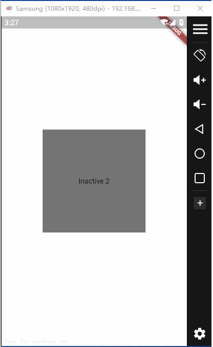

### ④、混合状态管理

1. 对于一些组件来说，混合管理的方式会非常有用。在这种情况下，组件自身管理一些内部状态，而父组件管理一些其他外部状态。
2. 在下面 `TapboxC` 示例中，手指按下时，盒子的周围会出现一个深绿色的边框，抬起时，边框消失。点击完成后，盒子的颜色改变。 `TapboxC` 将其 `_active` 状态导出到其父组件中，但在内部管理其 `_highlight` 状态。这个例子有两个状态对象 `_ParentCWidgetState` 和 `_TapboxCState`。
3. `_ParentCWidgetStateC`类：
	1. 管理 `_active` 状态。
	2. 实现 `_handleTapboxChanged()` ，当盒子被点击时调用。
	3. 当点击盒子并且 `_active` 状态改变时调用 `setState()` 更新 UI。

```dart
import 'package:flutter/material.dart';

import '03_2_TapboxC.dart';


// 创建一个 StatefulWidget 类
class ParentCWidget extends StatefulWidget {
  const ParentCWidget({super.key});

  @override
  _ParentCWidgetState createState() => _ParentCWidgetState();
}

// 创建与上述 StatefulWidget 相关的状态类
class _ParentCWidgetState extends State<ParentCWidget> {
  // 定义一个布尔类型的变量，用于保存当前按钮是否被点击
  bool _active = false;

  @override
  Widget build(BuildContext context) {
    // Center 是一个用于将子小部件放置在水平和垂直方向上的中心位置的小部件。
    return Center(
      /**
       * TapboxB 是一个自定义的小部件，它继承自 StatefulWidget，实现了一个点击时会变色的按钮，它的状态由父组件管理
       * 两个参数 active 和 onChanged 由父组件管理，当点击时，会调用父组件的 _handleTapboxChanged() 方法，更新 _active 的值，从而更新 UI
       */
      child: TapboxC(
        active: _active,
        onChanged: _handleTapboxChanged,
      ),
    );
  }

  // 定义一个私有方法，用于处理点击事件，点击时将 _active 取反，然后调用 setState() 方法更新 UI
  void _handleTapboxChanged(bool newValue) {
    setState(() {
      _active = newValue;
    });
  }

}
```

4. `_TapboxCState` 对象:
	1. 管理 `_highlight` 状态。
	2. `GestureDetector` 监听所有 `tap` 事件。当用户点下时，它添加高亮（深绿色边框）；当用户释放时，会移除高亮。
	3. 当按下、抬起、或者取消点击时更新  `_highlight` 状态，调用 `setState()`更新 UI。
	4. 当点击时，将状态的改变传递给父组件。

```dart
import 'package:flutter/material.dart';

// 创建一个 StatefulWidget 类
class TapboxC extends StatefulWidget {
  const TapboxC({super.key, required this.active, required this.onChanged});

  @override
  _TapboxCState createState() => _TapboxCState();

  // 定义一个布尔类型的变量，用于保存当前按钮是否被点击，由父组件传递
  final bool active;
  // 定义一个 ValueChanged<bool> 类型的变量，用于保存点击事件的回调，由父组件传递
  final ValueChanged<bool> onChanged;
}

// 创建与上述 StatefulWidget 相关的状态类
class _TapboxCState extends State<TapboxC> {
  // 定义一个布尔类型的变量，用于保存当前按钮是否被点击
  bool _highlight = false;

  @override
  Widget build(BuildContext context) {
    // GestureDetector 是一个用于手势识别的小部件
    return GestureDetector(
      // 处理按下事件
      onTapDown: _handleTapDown,
      // 处理抬起事件
      onTapUp: _handleTapUp,
      // 处理点击事件，比如说，用户按下按钮，然后抬起手指，此时就会触发点击事件
      onTap: _handleTap,
      // 处理取消事件，比如说，用户按下按钮，但是没有抬起手指，而是移动了手指，此时就会触发取消事件
      onTapCancel: _handleTapCancel,
      // Container 是一个组合类小部件，它本身不对应具体的渲染器，它是 DecoratedBox、ConstrainedBox、Transform、Padding、Align 等小部件组合的一个多功能容器。
      child: Container(
        width: 200,
        height: 200,
        // BoxDecoration 是一个装饰类小部件，它可以在其子小部件之上绘制一个装饰，如背景、边框、渐变等。
        decoration: BoxDecoration(
          // 设置背景颜色，当 _active 为 true 时为绿色，为 false 时为灰色
          color: widget.active ? Colors.lightGreen[700] : Colors.grey[600],
          // 设置边框，当 _highlight 为 true 时，边框宽度为 10，颜色为深绿色，否则边框宽度为 0，颜色为透明
          border: _highlight ? Border.all(color: Colors.teal[700]!, width: 10.0) : null,
        ),
        // 当 _active 为 true 时，显示 Active，为 false 时，显示 Inactive
        child: Center(child: Text(widget.active ? 'Active 3' : 'Inactive 3',)),
      ),
    );
  }

  // 定义一个私有方法，用于处理按下事件，当按下时，将 _highlight 设置为 true，表示显示深绿色边框
  void _handleTapDown(TapDownDetails details) {
    setState(() {
      _highlight = true;
    });
  }

  // 定义一个私有方法，用于处理抬起事件，当抬起时，将 _highlight 设置为 false，表示隐藏深绿色边框
  void _handleTapUp(TapUpDetails details) {
    setState(() {
      _highlight = false;
    });
  }

  // 定义一个私有方法，用于处理取消事件，当取消时，将 _highlight 设置为 false，表示隐藏深绿色边框
  void _handleTapCancel() {
    setState(() {
      _highlight = false;
    });
  }

  /// 定义一个私有方法，用于处理点击事件，当点击时，调用 widget.onChanged() 方法
  /// 将盒子的状态取反，使其在点击时可以切换状态，使背景在灰色和绿色之间切换，内容文本在 Inactive 和 Active 之间切换
  void _handleTap() {
    widget.onChanged(!widget.active);
  }

}
```

5. `main` 入口方法

```dart
import 'package:flutter/material.dart';

import '00_基础知识/02_状态管理/03_1_ParentCWidget.dart';


// 入口方法
void main() => runApp(const MyApp());

class MyApp extends StatelessWidget {
  const MyApp({Key? key}) : super(key: key);

  @override
  Widget build(BuildContext context) {
    /**
     * MaterialApp 是 Flutter 提供的一个小部件，用于创建一个包含 Material Design 样式和功能的应用程序。
     * 它是一个顶层小部件，用于为整个应用程序提供一致的主题和样式。
     * 在 MaterialApp 中，你可以设置应用程序的标题、主题、路由和其他全局属性
     */
    return const MaterialApp(
      /**
       * home 是 MaterialApp 的一个属性，用于指定应用程序的主页。它接受一个 Widget 作为参数，用于定义主页的内容
       * Scaffold 是一个用于创建基本页面布局的小部件。
       * Scaffold 小部件提供了一个应用程序的基本布局结构，包括顶部的应用栏、底部的导航栏、抽屉菜单等。
       * 它是一个非常常用的小部件，常用于创建具有标准 Material Design 布局的页面
       */
      home: Scaffold(
        // 设置背景颜色为白色
        backgroundColor: Colors.white,
        /**
         * body: 用于定义页面的主要内容区域
         */
        body: ParentCWidget(),
      )
    );
  }
}
```

6. 效果：

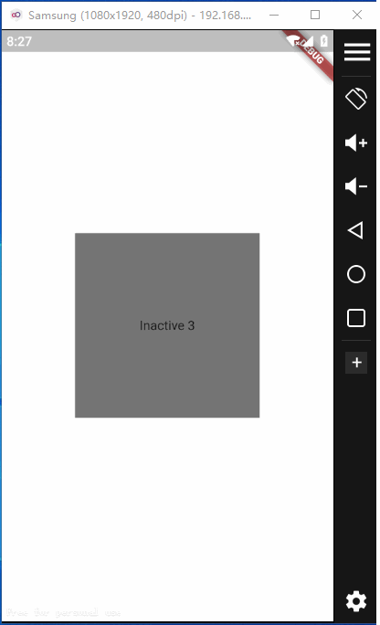

7. 另一种实现可能会将高亮状态导出到父组件，但同时保持 `_active` 状态为内部状态，但如果你要将该 `TapBox` 给其他人使用，可能没有什么意义。 开发人员只会关心该框是否处于 Active 状态，而不在乎高亮显示是如何管理的，所以应该让 TapBox 内部处理这些细节。

### ⑤、全局状态管理

1. 当应用中需要一些跨组件（包括跨路由）的状态需要同步时，上面介绍的方法便很难胜任了。
2. 比如，我们有一个设置页，里面可以设置应用的语言，我们为了让设置实时生效，我们期望在语言状态发生改变时，App 中依赖应用语言的组件能够重新 `build` 一下，但这些依赖应用语言的组件和设置页并不在一起，所以这种情况用上面的方法很难管理。
3. 这时，正确的做法是通过一个全局状态管理器来处理这种相距较远的组件之间的通信。目前主要有两种办法：
	1. 实现一个全局的事件总线，将语言状态改变对应为一个事件，然后在 APP 中依赖应用语言的组件的 `initState` 方法中订阅语言改变的事件。当用户在设置页切换语言后，我们发布语言改变事件，而订阅了此事件的组件就会收到通知，收到通知后调用 `setState(...)` 方法重新 build 一下自身即可。
	2. 使用一些专门用于状态管理的包，如 `Provider`、`Redux`，可以在 pub 上查看其详细信息。
4. 下面将在"功能型组件"一章中介绍 `Provider` 包的实现原理及用法，同时也将会在"事件处理与通知"一章中实现一个全局事件总线，有需要可以直接翻看。

## 4、路由管理 Route

1. 路由（Route）在移动开发中通常指页面（Page），这跟 Web 开发中单页应用的 Route 概念意义是相同的
2. Route 在 Android 中 通常指一个 Activity，在 iOS 中指一个 ViewController。
3. 所谓路由管理，就是管理页面之间如何跳转，通常也可被称为导航管理。
4. Flutter 中的路由管理和原生开发类似，无论是 Android 还是 iOS，导航管理都会维护一个路由栈，路由入栈（push）操作对应打开一个新页面，路由出栈（pop）操作对应页面关闭操作，而路由管理主要是指如何来管理路由栈

### ①、一个简单示例

1. main 主方法，配置路由

```dart
import 'package:flutter/material.dart';

import '00_基础知识/01_路由/HomeRoute.dart';
import '00_基础知识/01_路由/SettingRoute.dart';

// 入口方法
void main() => runApp(const MyApp());

class MyApp extends StatelessWidget {
  const MyApp({Key? key}) : super(key: key);

  @override
  Widget build(BuildContext context) {
    /**
     * MaterialApp 是 Flutter 提供的一个小部件，用于创建一个包含 Material Design 样式和功能的应用程序。
     * 它是一个顶层小部件，用于为整个应用程序提供一致的主题和样式。
     * 在 MaterialApp 中，你可以设置应用程序的标题、主题、路由和其他全局属性
     */
    return MaterialApp(
      // 设置应用的主页为 HomeRoute 小部件
      home: const HomeRoute(),
      // 路由设置
      routes: {
        // 定义名为 /setting 的路由，对应着 SettingRoute 小部件
        '/setting': (context) => const SettingRoute(),
      },
    );
  }
}
```

2. HomeRoute 页面

```dart
import 'package:flutter/material.dart';

class HomeRoute extends StatelessWidget {
  const HomeRoute({super.key});

  @override
  Widget build(BuildContext context) {

    // Container 是一个多功能的小部件，可以用于设置子部件的大小、位置、装饰、填充等
    return Container(
      // 宽度尽可能的大
      width: double.infinity,
      // 高度尽可能的大
      height: double.infinity,
      // 颜色
      color: Colors.amberAccent,
      // 垂直线性布局
      child: Column(
        // Row 在主轴(垂直)方向占用的空间
        mainAxisSize: MainAxisSize.max,
        children: [
          const SizedBox(height: 50),
          ElevatedButton(
            // 当按钮被点击时，跳转到 /setting 路由
            onPressed: (){
              // 使用 SettingRoute 类作为路由导航
              // Navigator.push(context, MaterialPageRoute(builder: (context) => const SettingRoute()),);
              // 使用路由名称作为导航，在 main.dart 的 routes 中进行的配置
              Navigator.pushNamed(context, '/setting');
            },
            child: const Text("点击进入设置", textDirection: TextDirection.ltr,),
          )
        ],
      ),
    );
  }
}
```

3. SettingRoute 页面

```dart
import 'package:flutter/material.dart';

class SettingRoute extends StatelessWidget {
  const SettingRoute({super.key});

  @override
  Widget build(BuildContext context) {
    // Container 是一个多功能的小部件，可以用于设置子部件的大小、位置、装饰、填充等
    return Container(
      // 宽度尽可能的大
      width: double.infinity,
      // 高度尽可能的大
      height: double.infinity,
      // 颜色
      color: Colors.red,
      // 垂直线性布局
      child: Column(
        // Row 在主轴(垂直)方向占用的空间
        mainAxisSize: MainAxisSize.max,
        children: [
          const SizedBox(height: 50),
          ElevatedButton(
            // 当按钮被点击时，返回上一个路由
            onPressed: (){
              // 返回上一个路由
              Navigator.pop(context);
            },
            child: const Text("点击返回主页", textDirection: TextDirection.ltr,),
          )
        ],
      )
    );
  }
}
```

4. `Navigator.push()` 和 `Navigator.pushNamed()` 都是用于在导航器中切换页面的方法，但它们有一些区别：
5. `Navigator.push()` 方法需要传递一个 `Route` 对象，该对象描述了要推送到导航器的新页面。通常使用 `MaterialPageRoute` 作为 `Route` 对象，它接受一个 `builder` 函数来构建新页面的小部件。
6. `Navigator.pushNamed()` 方法使用路由名称来推送新页面到导航器。在 `MaterialApp` 的 `routes` 属性中定义了一个路由名称与小部件的映射关系后，可以使用 `Navigator.pushNamed()` 方法来推送对应的小部件。
7.  `MaterialApp` 的 `routes` 属性是可选的。如果不需要使用命名路由，可以省略 `routes` 属性。在这种情况下，可以使用 `Navigator.push()` 方法来推送任何小部件到导航器，而不需要通过路由名称来引用它们。
8. 下面是使用 `Navigator.push()` 的代码：
9. main 主方法

```dart
import 'package:flutter/material.dart';

import '00_基础知识/01_路由/HomeRoute.dart';

// 入口方法
void main() => runApp(const MyApp());

class MyApp extends StatelessWidget {
  const MyApp({Key? key}) : super(key: key);

  @override
  Widget build(BuildContext context) {
    /**
     * MaterialApp 是 Flutter 提供的一个小部件，用于创建一个包含 Material Design 样式和功能的应用程序。
     * 它是一个顶层小部件，用于为整个应用程序提供一致的主题和样式。
     * 在 MaterialApp 中，你可以设置应用程序的标题、主题、路由和其他全局属性
     */
    return const MaterialApp(
      // 设置应用的主页为 HomeRoute 小部件
      home: HomeRoute()
    );
  }
}
```

10. HomeRoute 页面

```dart
import 'package:flutter/material.dart';

import 'SettingRoute.dart';

class HomeRoute extends StatelessWidget {
  const HomeRoute({super.key});

  @override
  Widget build(BuildContext context) {

    // Container 是一个多功能的小部件，可以用于设置子部件的大小、位置、装饰、填充等
    return Container(
      // 宽度尽可能的大
      width: double.infinity,
      // 高度尽可能的大
      height: double.infinity,
      // 颜色
      color: Colors.amberAccent,
      // 垂直线性布局
      child: Column(
        // Row 在主轴(垂直)方向占用的空间
        mainAxisSize: MainAxisSize.max,
        children: [
          const SizedBox(height: 50),
          ElevatedButton(
            // 当按钮被点击时，跳转到 /setting 路由
            onPressed: (){
              // 使用 SettingRoute 类作为路由导航
              Navigator.push(context, MaterialPageRoute(builder: (context) => const SettingRoute()),);
            },
            child: const Text("点击进入设置", textDirection: TextDirection.ltr,),
          )
        ],
      ),
    );
  }
}

```

11. SettingRoute 页面

```dart
import 'package:flutter/material.dart';

class SettingRoute extends StatelessWidget {
  const SettingRoute({super.key});

  @override
  Widget build(BuildContext context) {
    // Container 是一个多功能的小部件，可以用于设置子部件的大小、位置、装饰、填充等
    return Container(
      // 宽度尽可能的大
      width: double.infinity,
      // 高度尽可能的大
      height: double.infinity,
      // 颜色
      color: Colors.red,
      // 垂直线性布局
      child: Column(
        // Row 在主轴(垂直)方向占用的空间
        mainAxisSize: MainAxisSize.max,
        children: [
          const SizedBox(height: 50),
          ElevatedButton(
            // 当按钮被点击时，返回上一个路由
            onPressed: (){
              // 返回上一个路由
              Navigator.pop(context);
            },
            child: const Text("点击返回主页", textDirection: TextDirection.ltr,),
          )
        ],
      )
    );
  }
}
```

12. 效果：


### ②、MaterialPageRoute

1. `MaterialPageRoute` 继承自 `PageRoute` 类
2. `PageRoute` 类是一个抽象类，表示占有整个屏幕空间的一个模态路由页面，它还定义了路由构建及切换时过渡动画的相关接口及属性。
3. `MaterialPageRoute` 是 `Material` 组件库提供的组件，它可以针对不同平台，实现与平台页面切换动画风格一致的路由切换动画：
	1. 对于 Android，当打开新页面时，新的页面会从屏幕底部滑动到屏幕顶部；当关闭页面时，当前页面会从屏幕顶部滑动到屏幕底部后消失，同时上一个页面会显示到屏幕上。
	2. 对于 iOS，当打开页面时，新的页面会从屏幕右侧边缘一直滑动到屏幕左边，直到新页面全部显示到屏幕上，而上一个页面则会从当前屏幕滑动到屏幕左侧而消失；当关闭页面时，正好相反，当前页面会从屏幕右侧滑出，同时上一个页面会从屏幕左侧滑入。
4. 下面我们介绍一下 `MaterialPageRoute` 构造函数的各个参数的意义：

```dart
MaterialPageRoute({
  /**
   * builder 是一个 WidgetBuilder 类型的回调函数，它的作用是构建路由页面的具体内容，
   * 返回值是一个 widget。我们通常要实现此回调，返回新路由的实例
   */
  WidgetBuilder builder,
  /**
   * settings 包含路由的配置信息，如路由名称、是否初始路由（首页）
   */
  RouteSettings settings,
  /**
   * maintainState：默认情况下，当入栈一个新路由时，原来的路由仍然会被保存在内存中，
   * 如果想在路由没用的时候释放其所占用的所有资源，可以设置 maintainState 为 false
   */
  bool maintainState = true,
  /**
   * fullscreenDialog 表示新的路由页面是否是一个全屏的模态对话框，
   * 在 iOS 中，如果 fullscreenDialog 为 true，新页面将会从屏幕底部滑入（而不是水平方向）
   */
  bool fullscreenDialog = false,
})
```

5. 如果想自定义路由切换动画，可以自己继承 PageRoute 来实现

### ③、Navigator 路由管理

1. `Navigator` 是一个路由管理的组件，它提供了打开和退出路由页方法。
2. `Navigator` 通过一个栈来管理活动路由集合。通常当前屏幕显示的页面就是栈顶的路由。Navigator 提供了一系列方法来管理路由栈，在此我们只介绍其最常用的两个方法：
3. `Future push(BuildContext context, Route route)`：将给定的路由入栈（即打开新的页面），返回值是一个 Future 对象，用以接收新路由出栈（即关闭）时的返回数据。
4. `bool pop(BuildContext context, [ result ])`：将栈顶路由出栈，result 为页面关闭时返回给上一个页面的数据。
5. Navigator 还有很多其他方法，如 `Navigator.replace`、`Navigator.popUntil` 等，详情请参考API文档或SDK 源码注释，在此不再赘述。

### ④、路由传值

1. 使用路由进入新页面，或返回之前的页面时，都可以传递参数
2. mian 主方法

```dart
import 'package:flutter/material.dart';

import '00_基础知识/01_路由/HomeRoute.dart';

// 入口方法
void main() => runApp(const MyApp());

class MyApp extends StatelessWidget {
  const MyApp({Key? key}) : super(key: key);

  @override
  Widget build(BuildContext context) {
    /**
     * MaterialApp 是 Flutter 提供的一个小部件，用于创建一个包含 Material Design 样式和功能的应用程序。
     * 它是一个顶层小部件，用于为整个应用程序提供一致的主题和样式。
     * 在 MaterialApp 中，你可以设置应用程序的标题、主题、路由和其他全局属性
     */
    return const MaterialApp(
      // 设置应用的主页为 HomeRoute 小部件
      home: HomeRoute()
    );
  }
}
```

3. HomeRoute 页面

```dart
import 'package:flutter/material.dart';

import 'SettingRoute.dart';

// 创建一个 StatefulWidget 类
class HomeRoute extends StatefulWidget {
  const HomeRoute({super.key});

  @override
  _HomeRouteState createState() => _HomeRouteState();
}

// 创建与上述 StatefulWidget 相关的状态类
class _HomeRouteState extends State<HomeRoute> {
  // 用于接收路由传递的参数
  String text = "";

  @override
  Widget build(BuildContext context) {
    // Container 是一个多功能的小部件，可以用于设置子部件的大小、位置、装饰、填充等
    return Container(
      // 宽度尽可能的大
      width: double.infinity,
      // 高度尽可能的大
      height: double.infinity,
      // 颜色
      color: Colors.amberAccent,
      // 垂直线性布局
      child: Column(
        // Row 在主轴(垂直)方向占用的空间
        mainAxisSize: MainAxisSize.max,
        children: [
          const SizedBox(height: 50),
          ElevatedButton(
            /**
             * 使用 Navigator 导航到 SettingRoute 页面，并等待返回结果
             * async：在 Dart 语言中，async 用于标记一个函数是异步函数，即该函数可能会执行耗时操作而不会阻塞其他代码的执行。
             * 异步函数可以使用 await 关键字来等待其他异步操作的完成
             */
            onPressed: () async {
              /**
               * await：await 关键字只能在异步函数中使用，用于等待一个异步操作的完成。
               * 当遇到 await 关键字时，函数会暂停执行，直到等待的异步操作完成并返回结果。
               * 在等待期间，函数会让出主线程，允许其他代码继续执行
               */
              final result = await Navigator.push(
                context,
                MaterialPageRoute(builder: (context) => const SettingRoute(text: 'HomeRoute 传递的参数',)),
              );
              /**
               * setState：setState 是 Flutter 框架中的一个方法，用于更新小部件的状态并触发重建。
               * 当小部件的状态发生变化时，调用 setState 方法可以通知框架重新构建小部件，并在新的状态下重新渲染。
               * 通常，setState 方法会在异步操作完成后被调用，以更新 UI 并显示异步操作的结果
               */
              setState((){
                // 如果返回值为空，则将 text 设置为空字符串
                text = result ?? "";
              });
            },
            child: const Text("点击进入设置", textDirection: TextDirection.ltr,),
          ),
          // 显示从 SettingRoute 页面返回的参数
          Text("SettingRoute 返回的参数：$text", style: const TextStyle(color: Colors.white),)
        ],
      ),
    );
  }
}
```

4. SettingRoute 页面

```dart
import 'package:flutter/material.dart';

class SettingRoute extends StatelessWidget {
  const SettingRoute({super.key, required this.text});

  // 用于接收路由传递的参数
  final String text;

  @override
  Widget build(BuildContext context) {
    // Container 是一个多功能的小部件，可以用于设置子部件的大小、位置、装饰、填充等
    return Container(
      // 宽度尽可能的大
      width: double.infinity,
      // 高度尽可能的大
      height: double.infinity,
      // 颜色
      color: Colors.red,
      // 垂直线性布局
      child: Column(
        // Row 在主轴(垂直)方向占用的空间
        mainAxisSize: MainAxisSize.max,
        children: [
          const SizedBox(height: 50),
          ElevatedButton(
            // 当按钮被点击时，返回上一个路由
            onPressed: (){
              // 返回上一个路由，并返回消息
              Navigator.pop(context, "SettingRoute 的返回值");
            },
            child: const Text("点击返回主页", textDirection: TextDirection.ltr,),
          ),
          // 显示从 HomeRoute 页面传递的参数
          Text("HomeRoute 传递的参数：$text", style: const TextStyle(color: Colors.white),)
        ],
      )
    );
  }
}
```

5. 效果：刚打开 HomeRoute 主页面


6. 进入 SettingRoute 页面


7. 点击按钮返回 HomeRoute 页面


### ⑤、命名路由

1. 所谓“命名路由”（Named Route）即有名字的路由
2. 我们可以先给路由起一个名字，然后就可以通过路由名字直接打开新的路由了，这为路由管理带来了一种直观、简单的方式

#### Ⅰ、路由表

1. 要想使用命名路由，我们必须先提供并注册一个路由表（routing table），这样应用程序才知道哪个名字与哪个路由组件相对应。
2. 其实注册路由表就是给路由起名字，路由表的定义如下：

```dart
Map<String, WidgetBuilder> routes;
```

3. 它是一个 Map，`key` 为路由的名字，是个字符串；`value` 是个 `builder` 回调函数，用于生成相应的路由 `widget`。
4. 我们在通过路由名字打开新路由时，应用会根据路由名字在路由表中查找到对应的 `WidgetBuilder` 回调函数，然后调用该回调函数生成路由 `widget` 并返回

#### Ⅱ、注册路由表

1. 路由表的注册方式很简单，在 `MyApp` 类的 `build` 方法中找到 `MaterialApp`，添加 `routes` 属性，代码如下

```dart
import 'package:flutter/material.dart';

import '00_基础知识/01_路由/HomeRoute.dart';
import '00_基础知识/01_路由/SettingRoute.dart';

// 入口方法
void main() => runApp(const MyApp());

class MyApp extends StatelessWidget {
  const MyApp({Key? key}) : super(key: key);

  @override
  Widget build(BuildContext context) {
    /**
     * MaterialApp 是 Flutter 提供的一个小部件，用于创建一个包含 Material Design 样式和功能的应用程序。
     * 它是一个顶层小部件，用于为整个应用程序提供一致的主题和样式。
     * 在 MaterialApp 中，你可以设置应用程序的标题、主题、路由和其他全局属性
     */
    return MaterialApp(
      // 设置应用的主页为 HomeRoute 小部件
      home: const HomeRoute(),
      // 路由设置
      routes: {
        // 定义名为 /setting 的路由，对应着 SettingRoute 小部件
        '/setting': (context) => const SettingRoute(),
      },
    );
  }
}
```

2. 然后在页面中通过 `Navigator.pushNamed` 方法传入路由名，进行路由跳转

```dart
import 'package:flutter/material.dart';

import 'SettingRoute.dart';

// 创建一个 StatefulWidget 类
class HomeRoute extends StatefulWidget {
  const HomeRoute({super.key});

  @override
  _HomeRouteState createState() => _HomeRouteState();
}

// 创建与上述 StatefulWidget 相关的状态类
class _HomeRouteState extends State<HomeRoute> {

  @override
  Widget build(BuildContext context) {
    // Container 是一个多功能的小部件，可以用于设置子部件的大小、位置、装饰、填充等
    return Container(
      // 宽度尽可能的大
      width: double.infinity,
      // 高度尽可能的大
      height: double.infinity,
      // 颜色
      color: Colors.amberAccent,
      // 垂直线性布局
      child: Column(
        // Row 在主轴(垂直)方向占用的空间
        mainAxisSize: MainAxisSize.max,
        children: [
          const SizedBox(height: 50),
          ElevatedButton(
            onPressed: () { 
              // 跳转到名为 /setting 的路由
              Navigator.pushNamed(context, "/setting"); 
            },
            child: const Text("点击进入设置", textDirection: TextDirection.ltr,),
          )
        ],
      ),
    );
  }
}
```

3. 依然是通过 `Navigator.pop` 方法返回到上一个页面

```dart
import 'package:flutter/material.dart';

class SettingRoute extends StatelessWidget {
  const SettingRoute({super.key});

  @override
  Widget build(BuildContext context) {
    // Container 是一个多功能的小部件，可以用于设置子部件的大小、位置、装饰、填充等
    return Container(
      // 宽度尽可能的大
      width: double.infinity,
      // 高度尽可能的大
      height: double.infinity,
      // 颜色
      color: Colors.red,
      // 垂直线性布局
      child: Column(
        // Row 在主轴(垂直)方向占用的空间
        mainAxisSize: MainAxisSize.max,
        children: [
          const SizedBox(height: 50),
          ElevatedButton(
            // 当按钮被点击时，返回上一个路由
            onPressed: (){
              // 返回上一个路由
              Navigator.pop(context);
            },
            child: const Text("点击返回主页", textDirection: TextDirection.ltr,),
          ),
        ],
      )
    );
  }
}
```

#### Ⅲ、命名路由参数传递

1. 在 Flutter 最初的版本中，命名路由是不能传递参数的，后来才支持了参数；下面展示命名路由如何传递并获取路由参数：
2. 我们先注册一个路由：

```dart
import 'package:flutter/material.dart';

import '00_基础知识/01_路由/HomeRoute.dart';
import '00_基础知识/01_路由/SettingRoute.dart';

// 入口方法
void main() => runApp(const MyApp());

class MyApp extends StatelessWidget {
  const MyApp({Key? key}) : super(key: key);

  @override
  Widget build(BuildContext context) {
    /**
     * MaterialApp 是 Flutter 提供的一个小部件，用于创建一个包含 Material Design 样式和功能的应用程序。
     * 它是一个顶层小部件，用于为整个应用程序提供一致的主题和样式。
     * 在 MaterialApp 中，你可以设置应用程序的标题、主题、路由和其他全局属性
     */
    return MaterialApp(
      // 设置应用的主页为 HomeRoute 小部件
      home: const HomeRoute(),
      // 路由设置
      routes: {
        // 定义名为 /setting 的路由，对应着 SettingRoute 小部件
        '/setting': (context) => const SettingRoute(),
      },
    );
  }
}
```

3. 在打开路由时传递参数

```dart
import 'package:flutter/material.dart';

// 创建一个 StatefulWidget 类
class HomeRoute extends StatefulWidget {
  const HomeRoute({super.key});

  @override
  _HomeRouteState createState() => _HomeRouteState();
}

// 创建与上述 StatefulWidget 相关的状态类
class _HomeRouteState extends State<HomeRoute> {
  // 用于接收路由传递的参数
  String text = "";

  @override
  Widget build(BuildContext context) {
    // Container 是一个多功能的小部件，可以用于设置子部件的大小、位置、装饰、填充等
    return Container(
      // 宽度尽可能的大
      width: double.infinity,
      // 高度尽可能的大
      height: double.infinity,
      // 颜色
      color: Colors.amberAccent,
      // 垂直线性布局
      child: Column(
        // Row 在主轴(垂直)方向占用的空间
        mainAxisSize: MainAxisSize.max,
        children: [
          const SizedBox(height: 50),
          ElevatedButton(
            /**
             * 使用 Navigator 导航到 SettingRoute 页面，并等待返回结果
             * async：在 Dart 语言中，async 用于标记一个函数是异步函数，即该函数可能会执行耗时操作而不会阻塞其他代码的执行。
             * 异步函数可以使用 await 关键字来等待其他异步操作的完成
             */
            onPressed: () async {
              /**
               * 跳转到名为 /setting 的路由，并传递参数 arguments
               * await：await 关键字只能在异步函数中使用，用于等待一个异步操作的完成。
               * 当遇到 await 关键字时，函数会暂停执行，直到等待的异步操作完成并返回结果。
               * 在等待期间，函数会让出主线程，允许其他代码继续执行
               */
              final result = await Navigator.pushNamed(context, "/setting", arguments: "HomeRoute 传递的参数");
              /**
               * setState：setState 是 Flutter 框架中的一个方法，用于更新小部件的状态并触发重建。
               * 当小部件的状态发生变化时，调用 setState 方法可以通知框架重新构建小部件，并在新的状态下重新渲染。
               * 通常，setState 方法会在异步操作完成后被调用，以更新 UI 并显示异步操作的结果
               */
              setState((){
                // 将返回值赋值被 text
                text = result.toString();
              });
            },
            child: const Text("点击进入设置", textDirection: TextDirection.ltr,),
          ),
          // 显示从 SettingRoute 页面返回的参数
          Text("SettingRoute 返回的参数：$text", style: const TextStyle(color: Colors.white),)
        ],
      ),
    );
  }
}
```

4. 在 SettingRoute 页面接收并返回参数

```dart
import 'package:flutter/material.dart';

class SettingRoute extends StatelessWidget {
  const SettingRoute({super.key});

  @override
  Widget build(BuildContext context) {
    // 获取传递过来的路由参数
    var args = ModalRoute.of(context)?.settings.arguments;

    // Container 是一个多功能的小部件，可以用于设置子部件的大小、位置、装饰、填充等
    return Container(
      // 宽度尽可能的大
      width: double.infinity,
      // 高度尽可能的大
      height: double.infinity,
      // 颜色
      color: Colors.red,
      // 垂直线性布局
      child: Column(
        // Row 在主轴(垂直)方向占用的空间
        mainAxisSize: MainAxisSize.max,
        children: [
          const SizedBox(height: 50),
          ElevatedButton(
            // 当按钮被点击时，返回上一个路由
            onPressed: (){
              // 返回上一个路由，并返回消息
              Navigator.pop(context, "SettingRoute 的返回值");
            },
            child: const Text("点击返回主页", textDirection: TextDirection.ltr,),
          ),
          // 显示从 HomeRoute 页面传递的参数
          Text("HomeRoute 传递的参数：$args", style: const TextStyle(color: Colors.white),)
        ],
      )
    );
  }
}
```

5. 刚进入主页时


6. 进入 SettingRoute 页面


7. 返回 HomeRoute 页面


#### Ⅳ、路由生成钩子

1. 假设我们要开发一个电商 App，当用户没有登录时可以看店铺、商品等信息，但交易记录、购物车、用户个人信息等页面需要登录后才能看。
2. 为了实现上述功能，我们需要在打开每一个路由页前判断用户登录状态！如果每次打开路由前我们都需要去判断一下将会非常麻烦，那有什么更好的办法吗？
3. `MaterialApp` 有一个 `onGenerateRoute` 属性，它在打开命名路由时可能会被调用，之所以说可能，是因为当调用 `Navigator.pushNamed(...)` 打开命名路由时，如果指定的路由名在路由表中已注册，则会调用路由表中的 `builder` 函数来生成路由组件；如果路由表中没有注册，才会调用 `onGenerateRoute` 来生成路由。
4. `onGenerateRoute` 回调签名如下：

```dart
Route<dynamic> Function(RouteSettings settings)
```

5. 有了 `onGenerateRoute` 回调，要实现上面控制页面权限的功能就非常容易：
6. 我们放弃使用路由表，取而代之的是提供一个 `onGenerateRoute` 回调，然后在该回调中进行统一的权限控制，如：

```dart
MaterialApp(
  ... //省略无关代码
  onGenerateRoute:(RouteSettings settings){
	  return MaterialPageRoute(builder: (context){
		   String routeName = settings.name;
       // 如果访问的路由页需要登录，但当前未登录，则直接返回登录页路由，
       // 引导用户登录；其他情况则正常打开路由。
     }
   );
  }
);
```

7. 注意，`onGenerateRoute` 只会对命名路由生效

## 5、包管理

## 6、资源管理

1. Flutter APP 安装包中会包含代码和 assets（资源）两部分。
2. Assets 是会打包到程序安装包中的，可在运行时访问。
3. 常见类型的 assets 包括静态数据（例如JSON文件）、配置文件、图标和图片等

### ①、指定 assets

1. 和包管理一样，Flutter 也使用 `pubspec.yaml` 文件来管理应用程序所需的资源，举个例子:

```yaml
flutter:
  assets:
    - assets/my_icon.png
    - assets/background.png
```

2. `assets` 指定应包含在应用程序中的文件， 每个 `asset` 都通过相对于 `pubspec.yaml` 文件所在的文件系统路径来标识自身的路径。`asset` 的声明顺序是无关紧要的，asset 的实际目录可以是任意文件夹（在本示例中是assets 文件夹）。
3. 在构建期间，Flutter 将 asset 放置到称为 asset bundle 的特殊存档中，应用程序可以在运行时读取它们（但不能修改）

### ②、Asset 变体（variant）

1. 构建过程支持 asset 变体 的概念：不同版本的 asset 可能会显示在不同的上下文中。 
2. 在 `pubspec.yaml` 的 `assets` 部分中指定 asset 路径时，构建过程中，会在相邻子目录中查找具有相同名称的任何文件。这些文件随后会与指定的 asset 一起被包含在 asset bundle 中。
3. 例如，如果应用程序目录中有以下文件:

```dart
…/pubspec.yaml
…/graphics/my_icon.png
…/graphics/background.png
…/graphics/dark/background.png
….
```

4. 然后 `pubspec.yaml` 文件中只需包含:

```yaml
flutter:
  assets:
    - graphics/background.png
```

5. 那么这两个 `graphics/background.png` 和 `graphics/dark/background.png` 都将包含在 asset bundle 中。
6. 前者被认为是_main asset_ （主资源），后者被认为是一种变体（variant）。
7. 在选择匹配当前设备分辨率的图片时，Flutter 会使用到 asset 变体（见下文）

### ③、加载 assets

#### Ⅰ、加载文本 assets

1. 通过 `rootBundle` 对象加载：每个 Flutter 应用程序都有一个 `rootBundle` 对象， 通过它可以轻松访问主资源包，直接使用 `package:flutter/services.dart` 中全局静态的 `rootBundle` 对象来加载 asset 即可。
2. 通过 `DefaultAssetBundle` 加载：建议使用 `DefaultAssetBundle` 来获取当前 BuildContext 的 AssetBundle。 这种方法不是使用应用程序构建的默认 asset bundle，而是使父级 widget 在运行时动态替换的不同的 AssetBundle，这对于本地化或测试场景很有用。
3. 通常，可以使用 `DefaultAssetBundle.of()` 在应用运行时来间接加载 asset（例如 JSON 文件），而在 widget 上下文之外，或其他 AssetBundle 句柄不可用时，可以使用 rootBundle 直接加载这些 asset，例如：

```dart
import 'dart:async' show Future;
import 'package:flutter/services.dart' show rootBundle;

Future<String> loadAsset() async {
  return await rootBundle.loadString('assets/config.json');
}
```

#### Ⅱ、加载图片

##### （1）、声明分辨率相关的图片 assets

1. `AssetImage` 可以将 asset 的请求逻辑映射到最接近当前设备像素比例（dpi）的 asset。为了使这种映射起作用，必须根据特定的目录结构来保存 asset：

```dart
…/image.png
…/Mx/image.png
…/Nx/image.png
…
```

2. 其中 M 和 N 是数字标识符，对应于其中包含的图像的分辨率，也就是说，它们指定不同设备像素比例的图片。
3. 主资源默认对应于 1.0 倍的分辨率图片。看一个例子：

```dart
…/my_icon.png
…/2.0x/my_icon.png
…/3.0x/my_icon.png
```

4. 在设备像素比率为 1.8 的设备上，`.../2.0x/my_icon.png` 将被选择。对于 2.7 的设备像素比率，`.../3.0x/my_icon.png` 将被选择。
5. 如果未在 Image widget 上指定渲染图像的宽度和高度，那么 Image widget 将占用与主资源相同的屏幕空间大小。 也就是说，如果 `.../my_icon.png` 是 72px 乘 72px，那么 `.../3.0x/my_icon.png` 应该是 216px 乘 216px; 但如果未指定宽度和高度，它们都将渲染为 72 像素 × 72 像素（以逻辑像素为单位）。
6. `pubspec.yaml` 中 asset 部分中的每一项都应与实际文件相对应，但主资源项除外。当主资源缺少某个资源时，会按分辨率从低到高的顺序去选择 ，也就是说 1x 中没有的话会在 2x 中找，2x 中还没有的话就在 3x 中找。

##### （2）、加载图片

1. 要加载图片，可以使用 `AssetImage` 类。例如，我们可以从上面的 asset 声明中加载背景图片：

```dart
Widget build(BuildContext context) {
  return DecoratedBox(
    decoration: BoxDecoration(
      image: DecorationImage(
        image: AssetImage('graphics/background.png'),
      ),
    ),
  );
}
```

2. 注意，`AssetImage` 并非是一个 widget， 它实际上是一个 `ImageProvider`，有些时候你可能期望直接得到一个显示图片的 widget，那么你可以使用 `Image.asset()` 方法，如：

```dart
Widget build(BuildContext context) {
  return Image.asset('graphics/background.png');
}
```

3. 使用默认的 asset bundle 加载资源时，内部会自动处理分辨率等，这些处理对开发者来说是无感知的。 (如果使用一些更低级别的类，如 `ImageStream` 或 `ImageCache` 时你会注意到有与缩放相关的参数)

##### （3）、依赖包中的资源图片

1. 加载依赖包中的图像，必须给 AssetImage 提供 package 参数。
2. 例如，假设您的应用程序依赖于一个名为 `my_icons` 的包，它具有如下目录结构：

```dart
…/pubspec.yaml
…/icons/heart.png
…/icons/1.5x/heart.png
…/icons/2.0x/heart.png
…
```

3. 然后加载图像，使用：

```dart
AssetImage('icons/heart.png', package: 'my_icons')

或

Image.asset('icons/heart.png', package: 'my_icons')
```

4. 注意：包在使用本身的资源时也应该加上 package 参数来获取。

##### （4）、打包包中的 assets

1. 如果在 `pubspec.yaml` 文件中声明了期望的资源，它将会打包到相应的 package 中。特别是，包本身使用的资源必须在 `pubspec.yaml` 中指定。
2. 包也可以选择在其 `lib/` 文件夹中包含未在其 `pubspec.yaml` 文件中声明的资源。在这种情况下，对于要打包的图片，应用程序必须在 `pubspec.yaml` 中指定包含哪些图像。 例如，一个名为 `fancy_backgrounds` 的包，可能包含以下文件：

```dart
…/lib/backgrounds/background1.png
…/lib/backgrounds/background2.png
…/lib/backgrounds/background3.png
```

3. 要包含第一张图像，必须在 `pubspec.yaml` 的 assets 部分中声明它：

```yaml
flutter:
  assets:
    - packages/fancy_backgrounds/backgrounds/background1.png
```

4. `lib/` 是隐含的，所以它不应该包含在资产路径中。

#### Ⅲ、特定平台 assets

1. 上面的资源都是 flutter 应用中的，这些资源只有在 Flutter 框架运行之后才能使用，如果要给我们的应用设置 APP 图标或者添加启动图，那我们必须使用特定平台的 assets

##### （1）、设置 Android APP 图标

1. 在 Flutter 项目的根目录中，导航到 `.../android/app/src/main/res` 目录，里面包含了各种资源文件夹
2. 如 `mipmap-hdpi` 已包含占位符图像 ic_launcher.png，见下图：


3. 只需按照 Android 开发人员指南中的说明， 将其替换为所需的资源，并遵守每种屏幕密度（dpi）的建议图标大小标准。
4. 注意：如果重命名 `.png` 文件，则还必须在 `AndroidManifest.xml` 的 `<application>` 标签的 `android:icon` 属性中更新名称

##### （2）、设置 iOS APP 图标

1. 在 Flutter 项目的根目录中，导航到 `.../ios/Runner`。
2. 该目录中 `Assets.xcassets/AppIcon.appiconset` 已经包含占位符图片，见下图， 只需将它们替换为适当大小的图片，保留原始文件名称


##### （3）、更新启动页

1. 在 Flutter 框架加载时，Flutter 会使用本地平台机制绘制启动页。
2. 此启动页将持续到 Flutter 渲染应用程序的第一帧时。
3. 注意：这意味着如果不在应用程序的 `main()` 方法中调用 `runApp` 函数 （或者更具体地说，如果不调用`window.render` 去响应 `window.onDrawFrame` ）的话， 启动屏幕将永远持续显示。


##### （4）、Android 更新启动页

1. 要将启动屏幕（splash screen）添加到 Flutter 应用程序， 请导航至 `.../android/app/src/main`。
2. 在 `res/drawable/launch_background.xml`，通过自定义 drawable 来实现自定义启动界面
3. 也可以直接换一张图片

##### （5）、iOS 更新启动页

1. 要将图片添加到启动屏幕（splash screen）的中心，请导航至 `.../ios/Runner`。
2. 在 `Assets.xcassets/LaunchImage.imageset`， 拖入图片，并命名为 `LaunchImage.png`、`LaunchImage@2x.png`、`LaunchImage@3x.png`。
3. 如果使用不同的文件名，那还必须更新同一目录中的 `Contents.json` 文件，图片的具体尺寸可以查看苹果官方的标准。
4. 也可以通过打开 Xcode 完全自定义 storyboard。在 Project Navigator 中导航到 `Runner/Runner` 然后通过打开 Assets.xcassets 拖入图片，或者通过在 LaunchScreen.storyboard 中使用 Interface Builder 进行自定义，如下图所示。


### ④、平台共享 assets

1. 如果我们采用的是 Flutter + 原生 的开发模式，那么可能会存 Flutter 和原生需要共享资源的情况
2. 比如 Flutter 项目中已经有了一张图片 A，如果原生代码中也要使用 A，我们可以将 A 拷贝一份到原生项目的特定目录，这样的话虽然功能可以实现，但是最终的应用程序包会变大，因为包含了重复的资源
3. 为了解决这个问题，Flutter 提供了一种 Flutter 和原生之间共享资源的方式
4. 由于实现上需要涉及平台相关的原生代码，故本书不做展开，有需要可以自行查阅：[官方文档](https://flutter.cn/docs/development/ui/assets-and-images#sharing-assets-with-the-underlying-platform)

## 7、

## 8、

# 三、基本组件

## 0、Center 居中布局

1. Flutter 中的 Center 组件是一个用于在其子组件周围居中对齐它们的布局组件。
2. 它将其子组件放置在水平和垂直方向上的中心位置。
3. 这意味着无论子组件的大小如何，它们都将在屏幕的中央或父组件的中央对齐。

```dart
import 'package:flutter/material.dart';

// 入口方法
void main() {
  /**
   * const：定义常量，多个相同的实例会共享存储空间，且重新构建时不会重新构建该组件
   * 实例化 Center 类（布局组件），它将其子组件放置在水平和垂直方向上的中心位置
   */
  runApp(const Center(
    /**
     * 创建一个 Text 文本对象，指定其对象名为 child
     * 参数 1：显示文本
     */
    child: Text("月海"),
  ));
}
```

## 1、Text 文本组件

- 用于显示简单样式文本，它包含一些控制文本显示样式的一些属性

### ①、基础属性

```dart
import 'package:flutter/material.dart';

import '01_基本组件/01_Text文本组件/01_基础属性.dart';

// 入口方法
void main() {
  /**
   * const：定义常量，多个相同的实例会共享存储空间，且重新构建时不会重新构建该组件
   * 实例化 Center 类（布局组件），它将其子组件放置在水平和垂直方向上的中心位置
   */
  runApp(const Center(
    child: TextComponent(),
  ));
}
```

```dart
import 'package:flutter/material.dart';

class TextComponent extends StatelessWidget {
  const TextComponent({Key? key}) : super(key: key);

  @override
  Widget build(BuildContext context) {
    /**
     * 创建一个 Text 文本对象，指定其对象名为 child
     * 参数 1：显示文本；
     * textAlign：文本的对齐方式；可以选择左对齐、右对齐还是居中等
     * style：设置文本样式
     * textDirection：文本显示方向，默认从左向右排列
     *    TextDirection.ltr：从左向右排列
     *    TextDirection.rtl：从右向左排列
     */
    return const Text(
      "月海",
      textAlign: TextAlign.start,
      style: TextStyle(
        color: Colors.blue,
        fontSize: 30,
      ),
      textDirection: TextDirection.ltr,
    );
  }
}
```


| 属性 | 介绍 |
| ---- | ---- |
|data (String)|这是要显示的文本内容，通常是一个字符串。|
|style (TextStyle)|用于定义文本的样式，例如字体、字号、颜色等。|
|strutStyle (StrutStyle)|用于设置基线网格，可用于自定义文本的垂直布局。|
|textAlign (TextAlign)|用于指定文本的水平对齐方式，如左对齐、居中对齐或右对齐。|
|textDirection (TextDirection)|用于指定文本的文本方向，如从左到右（TextDirection.ltr）或从右到左（TextDirection.rtl）。|
|locale (Locale)|用于定义文本的语言环境，以支持本地化。|
|softWrap (bool)|一个布尔值，指示文本是否应在文本框之内自动换行。|
|overflow (TextOverflow)|当文本超出可用空间时，指定如何处理溢出文本，例如省略号（ellipsis）或截断（clip）。|
|textScaleFactor (double)|用于缩放文本的比例因子，可以改变文本的大小。|
|maxLines (int)|用于指定文本的最大行数，超过这个行数时将截断文本。|
|semanticsLabel (String)|用于设置文本的语义标签，以帮助可访问性工具理解文本的含义。|
|textWidthBasis (TextWidthBasis)|用于确定文本行的宽度，可以是 parent、longestLine 或 layout。|
|textHeightBehavior (TextHeightBehavior)|用于自定义文本行高的行为，包括最小行高、最大行高和领先（leading）。|
|selectionColor (Color)|用于指定文本的选择背景颜色，当用户选择文本时会用到。|

### ②、TextSpan 富文本

1. 在上面的例子中，Text 的所有文本内容只能按同一种样式，如果我们需要对一个 Text 内容的不同部分按照不同的样式显示，这时就可以使用 `TextSpan`，它代表文本的一个“片段”。
2. TextSpan 的定义中，`style` 和 `text` 属性代表该文本片段的样式和内容； `children` 是一个 `TextSpan` 的数组，也就是说 `TextSpan` 可以包括其他 `TextSpan`。而 `recognizer` 用于对该文本片段上用于手势进行识别处理：

```dart
const TextSpan({
  TextStyle style, 
  String text,
  List<TextSpan> children,
  GestureRecognizer recognizer,
});
```

2. 下面的代码中通过 `TextSpan` 实现了一个基础文本片段和一个链接片段，然后通过 `Text.rich` 方法将 `TextSpan` 添加到 `Text` 中，之所以可以这样做，是因为 `Text` 其实就是 `RichText` 的一个包装，而 `RichText` 是可以显示多种样式(富文本)的 `widget`。

```dart
import 'package:flutter/material.dart';

import '01_基本组件/01_Text文本组件/02_TextSpan富文本.dart';

// 入口方法
void main() {
  /**
   * const：定义常量，多个相同的实例会共享存储空间，且重新构建时不会重新构建该组件
   * 实例化 Center 类（布局组件），它将其子组件放置在水平和垂直方向上的中心位置
   */
  runApp(const Center(
    child: TextComponent(),
  ));
}
```

```dart
// 引入Flutter的material包，包含Flutter应用程序的核心功能。
import 'package:flutter/material.dart';

class TextComponent extends StatelessWidget {
  // 创建一个名为 TextComponent 的自定义小部件，继承自 StatelessWidget，接受一个可选的 Key 参数。
  const TextComponent({Key? key}) : super(key: key);

  @override
  Widget build(BuildContext context) {
    return const Directionality(
      // 设置文本方向为从左到右（Left To Right）
      textDirection: TextDirection.ltr,
      /**
       * 通过 TextSpan 实现了一个基础文本片段和一个链接片段，
       * 然后通过 Text.rich 方法将 TextSpan 添加到 Text 中，
       * 之所以可以这样做，是因为 Text 其实就是 RichText 的一个包装，
       * 而 RichText 是可以显示多种样式(富文本)的 widget。
       */
      child: Text.rich(TextSpan(
        children: [
          // 第一个 TextSpan 显示白色文本
          TextSpan(
            text: "白色",
            style: TextStyle(color: Colors.white),
          ),
          // 第二个TextSpan显示蓝色文本
          TextSpan(
            text: "蓝色",
            style: TextStyle(color: Colors.blue)
          ),
        ],
      ))
    );
  }
}
```


### ③、DefaultTextStyle 默认样式

1. 在 `Widget` 树中，文本的样式默认是可以被继承的（子类文本类组件未指定具体样式时可以使用 Widget 树中父级设置的默认样式）
2. 因此，如果在 `Widget` 树的某一个节点处设置一个默认的文本样式，那么该节点的子树中所有文本都会默认使用这个样式
3. 而 `DefaultTextStyle` 正是用于设置默认文本样式的。

```dart
import 'package:flutter/material.dart';

import '01_基本组件/01_Text文本组件/03_DefaultTextStyle默认样式.dart';

// 入口方法
void main() {
  /**
   * const：定义常量，多个相同的实例会共享存储空间，且重新构建时不会重新构建该组件
   * 实例化 Center 类（布局组件），它将其子组件放置在水平和垂直方向上的中心位置
   */
  runApp(const Center(
    child: TextComponent(),
  ));
}
```

```dart
// 引入Flutter的material包，包含Flutter应用程序的核心功能。
import 'package:flutter/material.dart';

class TextComponent extends StatelessWidget {
  // 创建一个名为 TextComponent 的自定义小部件，继承自 StatelessWidget，接受一个可选的 Key 参数。
  const TextComponent({Key? key}) : super(key: key);

  @override
  Widget build(BuildContext context) {
    return const Directionality(
      // 指定文本方向为从左到右
      textDirection: TextDirection.ltr,
      // 设置 Directionality 组件中的子项，即真正显示的组件：设置默认文本
      child: DefaultTextStyle(
        // 设置默认文本样式
        style: TextStyle(
            color: Colors.red,
            fontSize: 20
        ),
        // 设置子文本
        child: Column(
          children: [
            Text("月海"),
            Text("言"),
            Text("白色", style: TextStyle(color: Colors.white),),
            Text(
              "NotoSansCJKjp 正常字体",
              style: TextStyle(
                color: Colors.white,
                fontFamily: "NotoSansCJKjp"
              ),
            ),
            Text(
              "NotoSansCJKjp 加粗字体",
              style: TextStyle(
                color: Colors.white,
                fontFamily: "NotoSansCJKjp",
                fontWeight: FontWeight.bold
              ),
            ),
          ],
        )
      )
    );
  }
}
```

### ④、字体

#### Ⅰ、简介

1. 可以在 Flutter 应用程序中使用不同的字体。
2. 例如，我们可能会使用设计人员创建的自定义字体，或者其他第三方的字体，如 Google Fonts 中的字体。
3. 在 Flutter 中使用字体分三步完成。
	1. 首先将字体文件复制到项目根目录的 `asset/fonts` 目录下，没有目录可自己创建一个
	2. 然后在 `pubspec.yaml` 中声明它们，以确保它们会打包到应用程序中。
	3. 最后通过 `TextStyle` 属性使用字体。

#### Ⅱ、在 asset 中声明

1. 要将字体文件打包到应用中，和使用其他资源一样
2. 要先将字体文件复制到目录中，如：


3. 然后在 `pubspec.yaml` 中声明它：

```yaml
flutter:
  # 下面的行确保 Material Icons 字体
  # 包含在您的应用程序中，以便您可以在
  # material Icons 类中使用这些图标。
  uses-material-design: true

  # 字体配置
  fonts:
    # 这表示定义了一个名为 NotoSansCJKjp 的字体系列（font family）。这个系列包含了不同样式和权重的字体
    - family: NotoSansCJKjp
      # 指定了与 NotoSansCJKjp 字体系列相关的字体文件
      fonts:
        # 是 NotoSansCJKjp 字体系列的正常（Regular）字体。它的资源文件位于应用程序的 assets/fonts 目录下
        - asset: asset/fonts/NotoSansCJKjp-Regular.ttf
        # 是 NotoSansCJKjp 字体系列的粗体（Bold）字体。它的资源文件位于应用程序的 assets/fonts 目录下
        - asset: asset/fonts/NotoSansCJKjp-Bold.ttf
```

#### Ⅲ、使用字体

```dart
import 'package:flutter/material.dart';

import '01_基本组件/01_Text文本组件/03_DefaultTextStyle默认样式.dart';

// 入口方法
void main() {
  /**
   * const：定义常量，多个相同的实例会共享存储空间，且重新构建时不会重新构建该组件
   * 实例化 Center 类（布局组件），它将其子组件放置在水平和垂直方向上的中心位置
   */
  runApp(const Center(
    child: TextComponent(),
  ));
}
```

```dart
// 引入Flutter的material包，包含Flutter应用程序的核心功能。
import 'package:flutter/material.dart';

class TextComponent extends StatelessWidget {
  // 创建一个名为 TextComponent 的自定义小部件，继承自 StatelessWidget，接受一个可选的 Key 参数。
  const TextComponent({Key? key}) : super(key: key);

  @override
  Widget build(BuildContext context) {
    return const Directionality(
        // 指定文本方向为从左到右
        textDirection: TextDirection.ltr,
        // 设置默认文本
        child: DefaultTextStyle(
          // 设置默认文本样式
          style: TextStyle(
              color: Colors.red,
              fontSize: 20
          ),
          // 设置子文本
          child: Column(
            children: [
              Text("月海"),
              Text("言"),
              Text("白色", style: TextStyle(color: Colors.white),),
              Text(
                "NotoSansCJKjp 正常字体",
                style: TextStyle(
                  color: Colors.white,
                  fontFamily: "NotoSansCJKjp"
                ),
              ),
              Text(
                "NotoSansCJKjp 加粗字体",
                style: TextStyle(
                  color: Colors.white,
                  fontFamily: "NotoSansCJKjp",
                  fontWeight: FontWeight.bold
                ),
              ),
            ],
          )
        )
    );
  }
}
```


## 2、Button 按钮

1. Material 组件库中提供了多种按钮组件如 `ElevatedButton`、`TextButton`、`OutlinedButton` 等，它们都是直接或间接对 `RawMaterialButton` 组件的包装定制，所以他们大多数属性都和 `RawMaterialButton` 一样。
2. 在介绍各个按钮时我们先介绍其默认外观，而按钮的外观大都可以通过属性来自定义，我们在后面统一介绍这些属性。
3. 另外，所有 Material 库中的按钮都有如下相同点：
	1. 按下时都会有“水波动画”（又称“涟漪动画”，就是点击时按钮上会出现水波扩散的动画）。
	2. 有一个 `onPressed` 属性来设置点击回调，当按钮按下时会执行该回调，如果不提供该回调则按钮会处于禁用状态，禁用状态不响应用户点击

### ①、ElevatedButton 漂浮按钮

1. `ElevatedButton` 即"漂浮"按钮
2. 它默认带有阴影和灰色背景。按下后，阴影会变大


```dart
import 'package:flutter/material.dart';

import '01_基本组件/02_button按钮/01_ElevatedButton漂浮按钮.dart';

// 入口方法
void main() => runApp(const WhiteBackgroundComponent());

// 定义白色背景
class WhiteBackgroundComponent extends StatelessWidget {
  // 创建一个名为 WhiteBackgroundComponent 的自定义小部件，继承自 StatelessWidget，接受一个可选的 Key 参数。
  const WhiteBackgroundComponent({Key? key}) : super(key: key);

  @override
  Widget build(BuildContext context) {
    // 创建一个 MaterialApp 小部件，这是 Flutter 应用程序的根小部件。
    return MaterialApp(
      /**
       * home 是 MaterialApp 的一个属性，用于指定应用程序的主页。它接受一个 Widget 作为参数，用于定义主页的内容
       * Scaffold 是一个用于创建基本页面布局的小部件。
       * Scaffold 小部件提供了一个应用程序的基本布局结构，包括顶部的应用栏、底部的导航栏、抽屉菜单等。
       * 它是一个非常常用的小部件，常用于创建具有标准 Material Design 布局的页面
       */
      home: Scaffold(
        // 设置背景颜色为白色
        backgroundColor: Colors.white,
        // 设置顶部应用栏
        appBar: AppBar(
          // 设置顶部应用栏的标题文本
          title: const Text('White Background'),
        ),
        /**
	     * body: 用于定义页面的主要内容区域
	     * Center 是一个用于将子小部件放置在水平和垂直方向上的中心位置的小部件。
	     * 它将其子小部件居中显示，并根据需要调整大小；此处 Center 小部件用于将 Column 小部件放置在屏幕的中心位置
	     */
        body: const Center(
          // Column：用于在垂直方向上排列子组件；它允许多个小部件垂直堆叠在一起，以构建垂直布局
          child: Column(
            // 控制子组件在主轴方向上的对齐方式。在 Column 中，主轴通常是垂直方向
            mainAxisAlignment: MainAxisAlignment.center,
              // 指定要放置在容器内的子组件列表
              children: [
                // ElevatedButton 漂浮按钮
                ElevatedButtonComponent(),
              ]
          )
        ),
      ),
    );
  }
}
```

```dart
// 引入Flutter的material包，包含Flutter应用程序的核心功能。
import 'package:flutter/material.dart';

// ElevatedButton 漂浮按钮
class ElevatedButtonComponent extends StatelessWidget {
  // 创建一个名为 ButtonComponent 的自定义小部件，继承自 StatelessWidget，接受一个可选的 Key 参数。
  const ElevatedButtonComponent({Key? key}) : super(key: key);

  @override
  Widget build(BuildContext context) {
    // Directionality：用于确定文本的显示方向。
    return Directionality(
      // 设置文本方向为从左到右（Left To Right）
      textDirection: TextDirection.ltr,
      // 设置 Directionality 组件中的子项，即真正显示的组件
      child: ElevatedButton(
        onPressed: () {
          print('点击 ElevatedButton 漂浮按钮');
        },
        child: const Text("ElevatedButton 漂浮按钮")
      )
    );
  }
}
}
```


### ②、TextButton 文本按钮

- `TextButton` 即文本按钮，默认背景透明并不带阴影。按下后，会有背景色

```dart
import 'package:flutter/material.dart';

import '01_基本组件/02_button按钮/01_ElevatedButton漂浮按钮.dart';
import '01_基本组件/02_button按钮/02_TextButton文本按钮.dart';

// 入口方法
void main() => runApp(const WhiteBackgroundComponent());

// 定义白色背景
class WhiteBackgroundComponent extends StatelessWidget {
  // 创建一个名为 WhiteBackgroundComponent 的自定义小部件，继承自 StatelessWidget，接受一个可选的 Key 参数。
  const WhiteBackgroundComponent({Key? key}) : super(key: key);

  @override
  Widget build(BuildContext context) {
    // 创建一个 MaterialApp 小部件，这是 Flutter 应用程序的根小部件。
    return MaterialApp(
      /**
       * home 是 MaterialApp 的一个属性，用于指定应用程序的主页。它接受一个 Widget 作为参数，用于定义主页的内容
       * Scaffold 是一个用于创建基本页面布局的小部件。
       * Scaffold 小部件提供了一个应用程序的基本布局结构，包括顶部的应用栏、底部的导航栏、抽屉菜单等。
       * 它是一个非常常用的小部件，常用于创建具有标准 Material Design 布局的页面
       */
      home: Scaffold(
        // 设置背景颜色为白色
        backgroundColor: Colors.white,
        // 设置顶部应用栏
        appBar: AppBar(
          // 设置顶部应用栏的标题文本
          title: const Text('White Background'),
        ),
        /**
	     * body: 用于定义页面的主要内容区域
	     * Center 是一个用于将子小部件放置在水平和垂直方向上的中心位置的小部件。
	     * 它将其子小部件居中显示，并根据需要调整大小；此处 Center 小部件用于将 Column 小部件放置在屏幕的中心位置
	     */
        body: const Center(
          // Column：用于在垂直方向上排列子组件；它允许多个小部件垂直堆叠在一起，以构建垂直布局
          child: Column(
            // 控制子组件在主轴方向上的对齐方式。在 Column 中，主轴通常是垂直方向
            mainAxisAlignment: MainAxisAlignment.center,
              // 指定要放置在容器内的子组件列表
              children: [
                // ElevatedButton 漂浮按钮
                ElevatedButtonComponent(),
                // TextButton 文本按钮
                TextButtonComponent(),
              ]
          )
        ),
      ),
    );
  }
}
```

```dart
// 引入Flutter的material包，包含Flutter应用程序的核心功能。
import 'package:flutter/material.dart';

// TextButton 文本按钮
class TextButtonComponent extends StatelessWidget {
  // 创建一个名为 TextButtonComponent 的自定义小部件，继承自 StatelessWidget，接受一个可选的 Key 参数。
  const TextButtonComponent({Key? key}) : super(key: key);

  @override
  Widget build(BuildContext context) {
    // Directionality：用于确定文本的显示方向。
    return Directionality(
      // 设置文本方向为从左到右（Left To Right）
      textDirection: TextDirection.ltr,
      // 设置 Directionality 组件中的子项，即真正显示的组件
      child: TextButton(
        onPressed: () {
          print('点击 TextButton 文本按钮');
        },
        child: const Text("TextButton 文本按钮")
      )
    );
  }
}
```


### ③、OutlinedButton 轮廓按钮

1. `OutlinedButton` 默认有一个边框，不带阴影且背景透明。
2. 按下后，边框颜色会变亮、同时出现背景和阴影(较弱)

```dart
import 'package:flutter/material.dart';

import '01_基本组件/02_button按钮/01_ElevatedButton漂浮按钮.dart';
import '01_基本组件/02_button按钮/02_TextButton文本按钮.dart';
import '01_基本组件/02_button按钮/03_OutlinedButton轮廓按钮.dart';

// 入口方法
void main() => runApp(const WhiteBackgroundComponent());

// 定义白色背景
class WhiteBackgroundComponent extends StatelessWidget {
  // 创建一个名为 WhiteBackgroundComponent 的自定义小部件，继承自 StatelessWidget，接受一个可选的 Key 参数。
  const WhiteBackgroundComponent({Key? key}) : super(key: key);

  @override
  Widget build(BuildContext context) {
    // 创建一个 MaterialApp 小部件，这是 Flutter 应用程序的根小部件。
    return MaterialApp(
      /**
       * home 是 MaterialApp 的一个属性，用于指定应用程序的主页。它接受一个 Widget 作为参数，用于定义主页的内容
       * Scaffold 是一个用于创建基本页面布局的小部件。
       * Scaffold 小部件提供了一个应用程序的基本布局结构，包括顶部的应用栏、底部的导航栏、抽屉菜单等。
       * 它是一个非常常用的小部件，常用于创建具有标准 Material Design 布局的页面
       */
      home: Scaffold(
        // 设置背景颜色为白色
        backgroundColor: Colors.white,
        // 设置顶部应用栏
        appBar: AppBar(
          // 设置顶部应用栏的标题文本
          title: const Text('White Background'),
        ),
        /**
	     * body: 用于定义页面的主要内容区域
	     * Center 是一个用于将子小部件放置在水平和垂直方向上的中心位置的小部件。
	     * 它将其子小部件居中显示，并根据需要调整大小；此处 Center 小部件用于将 Column 小部件放置在屏幕的中心位置
	     */
        body: const Center(
          // Column：用于在垂直方向上排列子组件；它允许多个小部件垂直堆叠在一起，以构建垂直布局
          child: Column(
            // 控制子组件在主轴方向上的对齐方式。在 Column 中，主轴通常是垂直方向
            mainAxisAlignment: MainAxisAlignment.center,
              // 指定要放置在容器内的子组件列表
              children: [
                // ElevatedButton 漂浮按钮
                ElevatedButtonComponent(),
                // TextButton 文本按钮
                TextButtonComponent(),
                // OutlinedButton 轮廓按钮
                OutlinedButtonComponent()
              ]
          )
        ),
      ),
    );
  }
}
```

```dart
// 引入Flutter的material包，包含Flutter应用程序的核心功能。
import 'package:flutter/material.dart';

// OutlinedButton 轮廓按钮
class OutlinedButtonComponent extends StatelessWidget {
  // 创建一个名为 OutlinedButtonComponent 的自定义小部件，继承自 StatelessWidget，接受一个可选的 Key 参数。
  const OutlinedButtonComponent({Key? key}) : super(key: key);

  @override
  Widget build(BuildContext context) {
    // Directionality：用于确定文本的显示方向。
    return Directionality(
      // 设置文本方向为从左到右（Left To Right）
      textDirection: TextDirection.ltr,
      // 设置 Directionality 组件中的子项，即真正显示的组件
      child: OutlinedButton(
        onPressed: () {
          print('点击 OutlinedButton 轮廓按钮');
        },
        child: const Text("OutlinedButton 轮廓按钮")
      )
    );
  }
}
```


### ④、IconButton 图标按钮

1. `IconButton` 是一个可点击的 Icon 图标
2. 不包括文字，默认没有背景，点击后会出现背景

```dart
import 'package:flutter/material.dart';

import '01_基本组件/02_button按钮/01_ElevatedButton漂浮按钮.dart';
import '01_基本组件/02_button按钮/02_TextButton文本按钮.dart';
import '01_基本组件/02_button按钮/03_OutlinedButton轮廓按钮.dart';
import '01_基本组件/02_button按钮/04_IconButton图标按钮.dart';

// 入口方法
void main() => runApp(const WhiteBackgroundComponent());

// 定义白色背景
class WhiteBackgroundComponent extends StatelessWidget {
  // 创建一个名为 WhiteBackgroundComponent 的自定义小部件，继承自 StatelessWidget，接受一个可选的 Key 参数。
  const WhiteBackgroundComponent({Key? key}) : super(key: key);

  @override
  Widget build(BuildContext context) {
    // 创建一个 MaterialApp 小部件，这是 Flutter 应用程序的根小部件。
    return MaterialApp(
      /**
       * home 是 MaterialApp 的一个属性，用于指定应用程序的主页。它接受一个 Widget 作为参数，用于定义主页的内容
       * Scaffold 是一个用于创建基本页面布局的小部件。
       * Scaffold 小部件提供了一个应用程序的基本布局结构，包括顶部的应用栏、底部的导航栏、抽屉菜单等。
       * 它是一个非常常用的小部件，常用于创建具有标准 Material Design 布局的页面
       */
      home: Scaffold(
        // 设置背景颜色为白色
        backgroundColor: Colors.white,
        // 设置顶部应用栏
        appBar: AppBar(
          // 设置顶部应用栏的标题文本
          title: const Text('White Background'),
        ),
        /**
	     * body: 用于定义页面的主要内容区域
	     * Center 是一个用于将子小部件放置在水平和垂直方向上的中心位置的小部件。
	     * 它将其子小部件居中显示，并根据需要调整大小；此处 Center 小部件用于将 Column 小部件放置在屏幕的中心位置
	     */
        body: const Center(
          // Column：用于在垂直方向上排列子组件；它允许多个小部件垂直堆叠在一起，以构建垂直布局
          child: Column(
            // 控制子组件在主轴方向上的对齐方式。在 Column 中，主轴通常是垂直方向
            mainAxisAlignment: MainAxisAlignment.center,
              // 指定要放置在容器内的子组件列表
              children: [
                // ElevatedButton 漂浮按钮
                ElevatedButtonComponent(),
                // TextButton 文本按钮
                TextButtonComponent(),
                // OutlinedButton 轮廓按钮
                OutlinedButtonComponent(),
                // IconButton 图标按钮
                IconButtonComponent(),
              ]
          )
        ),
      ),
    );
  }
}
```

```dart
// 引入Flutter的material包，包含Flutter应用程序的核心功能。
import 'package:flutter/material.dart';

// IconButton 图标按钮
class IconButtonComponent extends StatelessWidget {
  // 创建一个名为 IconButtonComponent 的自定义小部件，继承自 StatelessWidget，接受一个可选的 Key 参数。
  const IconButtonComponent({Key? key}) : super(key: key);

  @override
  Widget build(BuildContext context) {
    // Directionality：用于确定文本的显示方向。
    return Directionality(
      // 设置文本方向为从左到右（Left To Right）
      textDirection: TextDirection.ltr,
      // 设置 Directionality 组件中的子项，即真正显示的组件
      child: IconButton(
        onPressed: () {
          print('点击 OutlinedButton 轮廓按钮');
        },
        // 加载 flutter 自带图标
        icon: const Icon(Icons.add_a_photo_rounded),
      )
    );
  }
}
```


### ⑤、带图标的按钮

- `ElevatedButton`、`TextButton`、`OutlinedButton` 都有一个 `icon` 构造函数，通过它可以轻松创建带图标的按钮

```dart
import 'package:flutter/material.dart';

import '01_基本组件/02_button按钮/01_ElevatedButton漂浮按钮.dart';
import '01_基本组件/02_button按钮/02_TextButton文本按钮.dart';
import '01_基本组件/02_button按钮/03_OutlinedButton轮廓按钮.dart';
import '01_基本组件/02_button按钮/04_IconButton图标按钮.dart';
import '01_基本组件/02_button按钮/05_带图标的按钮.dart';

// 入口方法
void main() => runApp(const WhiteBackgroundComponent());

// 定义白色背景
class WhiteBackgroundComponent extends StatelessWidget {
  // 创建一个名为 WhiteBackgroundComponent 的自定义小部件，继承自 StatelessWidget，接受一个可选的 Key 参数。
  const WhiteBackgroundComponent({Key? key}) : super(key: key);

  @override
  Widget build(BuildContext context) {
    // 创建一个 MaterialApp 小部件，这是 Flutter 应用程序的根小部件。
    return MaterialApp(
      /**
       * home 是 MaterialApp 的一个属性，用于指定应用程序的主页。它接受一个 Widget 作为参数，用于定义主页的内容
       * Scaffold 是一个用于创建基本页面布局的小部件。
       * Scaffold 小部件提供了一个应用程序的基本布局结构，包括顶部的应用栏、底部的导航栏、抽屉菜单等。
       * 它是一个非常常用的小部件，常用于创建具有标准 Material Design 布局的页面
       */
      home: Scaffold(
        // 设置背景颜色为白色
        backgroundColor: Colors.white,
        // 设置顶部应用栏
        appBar: AppBar(
          // 设置顶部应用栏的标题文本
          title: const Text('White Background'),
        ),
        /**
	     * body: 用于定义页面的主要内容区域
	     * Center 是一个用于将子小部件放置在水平和垂直方向上的中心位置的小部件。
	     * 它将其子小部件居中显示，并根据需要调整大小；此处 Center 小部件用于将 Column 小部件放置在屏幕的中心位置
	     */
        body: const Center(
          // Column：用于在垂直方向上排列子组件；它允许多个小部件垂直堆叠在一起，以构建垂直布局
          child: Column(
            // 控制子组件在主轴方向上的对齐方式。在 Column 中，主轴通常是垂直方向
            mainAxisAlignment: MainAxisAlignment.center,
              // 指定要放置在容器内的子组件列表
              children: [
                // ElevatedButton 漂浮按钮
                ElevatedButtonComponent(),
                // TextButton 文本按钮
                TextButtonComponent(),
                // OutlinedButton 轮廓按钮
                OutlinedButtonComponent(),
                // IconButton 图标按钮
                IconButtonComponent(),
                // ButtonWithIconComponent 带图标的按钮
                ButtonWithIconComponent()
              ]
          )
        ),
      ),
    );
  }
}
```

```dart
// 引入Flutter的material包，包含Flutter应用程序的核心功能。
import 'package:flutter/material.dart';

// ButtonWithIconComponent 带图标的按钮
class ButtonWithIconComponent extends StatelessWidget {
  // 创建一个名为 ButtonWithIconComponent 的自定义小部件，继承自 StatelessWidget，接受一个可选的 Key 参数。
  const ButtonWithIconComponent({Key? key}) : super(key: key);

  @override
  Widget build(BuildContext context) {
    // Directionality：用于确定文本的显示方向。
    return Directionality(
      // 设置文本方向为从左到右（Left To Right）
      textDirection: TextDirection.ltr,
      // 设置 Directionality 组件中的子项，即真正显示的组件
      child: ElevatedButton.icon(
        onPressed: () {
          print('点击 ElevatedButton 漂浮按钮');
        },
        label: const Text("ElevatedButton 漂浮按钮 带图标"),
        icon: const Icon(Icons.account_balance_wallet_outlined),
      )
    );
  }
}
```


## 3、图片及 ICON

### ①、图片

- Flutter 中，我们可以通过 Image 组件来加载并显示图片，Image 的数据源可以是 asset、文件、内存以及网络。

#### Ⅰ、ImageProvider

1. `ImageProvider` 是一个抽象类，主要定义了图片数据获取的接口 `load()`
2. 从不同的数据源获取图片需要实现不同的 `ImageProvider` 
3. 如 `AssetImage` 是实现了从 `Asset` 中加载图片的 `ImageProvider`，而 `NetworkImage` 实现了从网络加载图片的 `ImageProvider`

#### Ⅱ、Image

1. `Image widget` 有一个必选的 `image` 参数，它对应一个 `ImageProvider`。
2. 下面我们分别演示一下如何从 asset 和网络加载图片

##### （1）、从 asset 中加载图片

1. 将图片复制到目录中


2. 然后在 `pubspec.yaml` 中的 flutter 部分声明图片

```yaml
flutter:
  
  # 下面的行确保 Material Icons 字体
  # 包含在您的应用程序中，以便您可以在
  # material Icons 类中使用这些图标。
  uses-material-design: true

  # 图片配置
  assets:
    - asset/images/QQ图片20220920105928.jpg

  # 字体配置
  fonts:
    # 这表示定义了一个名为 NotoSansCJKjp 的字体系列（font family）。这个系列包含了不同样式和权重的字体
    - family: NotoSansCJKjp
      # 指定了与 NotoSansCJKjp 字体系列相关的字体文件
      fonts:
        # 是 NotoSansCJKjp 字体系列的正常（Regular）字体。它的资源文件位于应用程序的 assets/fonts 目录下
        - asset: asset/fonts/NotoSansCJKjp-Regular.ttf
        # 是 NotoSansCJKjp 字体系列的粗体（Bold）字体。它的资源文件位于应用程序的 assets/fonts 目录下
        - asset: asset/fonts/NotoSansCJKjp-Bold.ttf
```

3. 最后在代码中使用

```dart
import 'package:flutter/material.dart';

import '01_基本组件/03_图片及ICON/01_从asset中加载图片.dart';

// 入口方法
void main() => runApp(const WhiteBackgroundComponent());

// 定义白色背景
class WhiteBackgroundComponent extends StatelessWidget {
  // 创建一个名为 WhiteBackgroundComponent 的自定义小部件，继承自 StatelessWidget，接受一个可选的 Key 参数。
  const WhiteBackgroundComponent({Key? key}) : super(key: key);

  @override
  Widget build(BuildContext context) {
    // 创建一个 MaterialApp 小部件，这是 Flutter 应用程序的根小部件。
    return MaterialApp(
      /**
       * home 是 MaterialApp 的一个属性，用于指定应用程序的主页。它接受一个 Widget 作为参数，用于定义主页的内容
       * Scaffold 是一个用于创建基本页面布局的小部件。
       * Scaffold 小部件提供了一个应用程序的基本布局结构，包括顶部的应用栏、底部的导航栏、抽屉菜单等。
       * 它是一个非常常用的小部件，常用于创建具有标准 Material Design 布局的页面
       */
      home: Scaffold(
        // 设置背景颜色为白色
        backgroundColor: Colors.white,
        // 设置顶部应用栏
        appBar: AppBar(
          // 设置顶部应用栏的标题文本
          title: const Text('White Background'),
        ),
        /**
	     * body: 用于定义页面的主要内容区域
	     * Center 是一个用于将子小部件放置在水平和垂直方向上的中心位置的小部件。
	     * 它将其子小部件居中显示，并根据需要调整大小；此处 Center 小部件用于将 Column 小部件放置在屏幕的中心位置
	     */
        body: const Center(
          // Column：用于在垂直方向上排列子组件；它允许多个小部件垂直堆叠在一起，以构建垂直布局
          child: Column(
            // 控制子组件在主轴方向上的对齐方式。在 Column 中，主轴通常是垂直方向
            mainAxisAlignment: MainAxisAlignment.center,
              // 指定要放置在容器内的子组件列表
              children: [
                // 从 asset 中加载图片
                LoadImagesFromAssetComponent()
              ]
          )
        ),
      ),
    );
  }
}
```

```dart
// 引入Flutter的material包，包含Flutter应用程序的核心功能。
import 'package:flutter/material.dart';

// 从 asset 中加载图片
class LoadImagesFromAssetComponent extends StatelessWidget {
  // 创建一个名为 LoadImagesFromAssetComponent 的自定义小部件，继承自 StatelessWidget，接受一个可选的 Key 参数。
  const LoadImagesFromAssetComponent({Key? key}) : super(key: key);

  @override
  Widget build(BuildContext context) {
    // Directionality：用于确定文本的显示方向。
    return const Directionality(
      // 设置文本方向为从左到右（Left To Right）
      textDirection: TextDirection.ltr,
      // 设置 Directionality 组件中的子项，即真正显示的组件
      child: Image(
        image: AssetImage("asset/images/QQ图片20220920105928.jpg"),
        width: 100,
      ),
    );
  }
}
```


##### （2）、从网络加载图片

```dart
import 'package:flutter/material.dart';

import '01_基本组件/03_图片及ICON/01_从asset中加载图片.dart';
import '01_基本组件/03_图片及ICON/02_从网络加载图片.dart';

// 入口方法
void main() => runApp(const WhiteBackgroundComponent());

// 定义白色背景
class WhiteBackgroundComponent extends StatelessWidget {
  // 创建一个名为 WhiteBackgroundComponent 的自定义小部件，继承自 StatelessWidget，接受一个可选的 Key 参数。
  const WhiteBackgroundComponent({Key? key}) : super(key: key);

  @override
  Widget build(BuildContext context) {
    // 创建一个 MaterialApp 小部件，这是 Flutter 应用程序的根小部件。
    return MaterialApp(
      /**
       * home 是 MaterialApp 的一个属性，用于指定应用程序的主页。它接受一个 Widget 作为参数，用于定义主页的内容
       * Scaffold 是一个用于创建基本页面布局的小部件。
       * Scaffold 小部件提供了一个应用程序的基本布局结构，包括顶部的应用栏、底部的导航栏、抽屉菜单等。
       * 它是一个非常常用的小部件，常用于创建具有标准 Material Design 布局的页面
       */
      home: Scaffold(
        // 设置背景颜色为白色
        backgroundColor: Colors.white,
        // 设置顶部应用栏
        appBar: AppBar(
          // 设置顶部应用栏的标题文本
          title: const Text('White Background'),
        ),
        /**
	     * body: 用于定义页面的主要内容区域
	     * Center 是一个用于将子小部件放置在水平和垂直方向上的中心位置的小部件。
	     * 它将其子小部件居中显示，并根据需要调整大小；此处 Center 小部件用于将 Column 小部件放置在屏幕的中心位置
	     */
        body: const Center(
          // Column：用于在垂直方向上排列子组件；它允许多个小部件垂直堆叠在一起，以构建垂直布局
          child: Column(
            // 控制子组件在主轴方向上的对齐方式。在 Column 中，主轴通常是垂直方向
            mainAxisAlignment: MainAxisAlignment.center,
              // 指定要放置在容器内的子组件列表
              children: [
                // 从 asset 中加载图片
                LoadImagesFromAssetComponent(),
                // 从网络中加载图片
                LoadImagesFromNetworkComponent(),
              ]
          )
        ),
      ),
    );
  }
}
```

```dart
// 引入Flutter的material包，包含Flutter应用程序的核心功能。
import 'package:flutter/material.dart';

// 从网络中加载图片
class LoadImagesFromNetworkComponent extends StatelessWidget {
  // 创建一个名为 LoadImagesFromNetworkComponent 的自定义小部件，继承自 StatelessWidget，接受一个可选的 Key 参数。
  const LoadImagesFromNetworkComponent({Key? key}) : super(key: key);

  @override
  Widget build(BuildContext context) {
    // Directionality：用于确定文本的显示方向。
    return const Directionality(
      // 设置文本方向为从左到右（Left To Right）
      textDirection: TextDirection.ltr,
      // 设置 Directionality 组件中的子项，即真正显示的组件
      child: Image(
        image: NetworkImage("https://img1.baidu.com/it/u=69888158,2774794857&fm=253&fmt=auto&app=120&f=JPEG?w=800&h=500"),
        width: 100,
      ),
    );
  }
}
```


#### Ⅲ、参数

1. Image 在显示图片时定义了一系列参数，通过这些参数我们可以控制图片的显示外观、大小、混合效果等。我们看一下 Image 的主要参数：

```dart
const Image({
  ...
  this.width, //图片的宽
  this.height, //图片高度
  this.color, //图片的混合色值
  this.colorBlendMode, //混合模式
  this.fit,//缩放模式
  this.alignment = Alignment.center, //对齐方式
  this.repeat = ImageRepeat.noRepeat, //重复方式
  ...
})
```

2. `width`、`height`：用于设置图片的宽、高，当不指定宽高时，图片会根据当前父容器的限制，尽可能的显示其原始大小，如果只设置 `width`、`height` 的其中一个，那么另一个属性默认会按比例缩放，`但可以通过下面介绍的fit` 属性来指定适应规则。
3. `fit`：该属性用于在图片的显示空间和图片本身大小不同时指定图片的适应模式。适应模式是在 `BoxFit` 中定义，它是一个枚举类型，有如下值：
	1. `fill`：会拉伸填充满显示空间，图片本身长宽比会发生变化，图片会变形。
	2. `cover`：会按图片的长宽比放大后居中填满显示空间，图片不会变形，超出显示空间部分会被剪裁。
	3. `contain`：这是图片的默认适应规则，图片会在保证图片本身长宽比不变的情况下缩放以适应当前显示空间，图片不会变形。
	4. `fitWidth`：图片的宽度会缩放到显示空间的宽度，高度会按比例缩放，然后居中显示，图片不会变形，超出显示空间部分会被剪裁。
	5. `fitHeight`：图片的高度会缩放到显示空间的高度，宽度会按比例缩放，然后居中显示，图片不会变形，超出显示空间部分会被剪裁。
	6. `none`：图片没有适应策略，会在显示空间内显示图片，如果图片比显示空间大，则显示空间只会显示图片中间部分。
4. 对一个宽高相同的头像图片应用不同的 `fit` 值：


11. `color` 和 `colorBlendMode`：在图片绘制时可以对每一个像素进行颜色混合处理，`color` 指定混合色，而 `colorBlendMode` 指定混合模式，下面是一个简单的示例：

```dart
Image(
  image: AssetImage("images/avatar.png"),
  width: 100.0,
  color: Colors.blue,
  colorBlendMode: BlendMode.difference,
);
```


12. `repeat`：当图片本身大小小于显示空间时，指定图片的重复规则。简单示例如下


#### Ⅳ、Image 缓存

- Flutter 框架对加载过的图片是有缓存的（内存），关于 Image 的详细内容及原理我们将会在后面进阶部分深入介绍

### ②、ICON

#### Ⅰ、介绍

1. Flutter 中，可以像 Web 开发一样使用 `iconfont`，`iconfont` 即“字体图标”，它是将图标做成字体文件，然后通过指定不同的字符而显示不同的图片。
2. 在字体文件中，每一个字符都对应一个位码，而每一个位码对应一个显示字形，不同的字体就是指字形不同，即字符对应的字形是不同的。而在 `iconfont` 中，只是将位码对应的字形做成了图标，所以不同的字符最终就会渲染成不同的图标。
3. 在 Flutter 开发中，`iconfont` 和图片相比有如下优势：
	1. 体积小：可以减小安装包大小。
	2. 矢量的：`iconfont` 都是矢量图标，放大不会影响其清晰度。
	3. 可以应用文本样式：可以像文本一样改变字体图标的颜色、大小对齐等。
	4. 可以通过 `TextSpan` 和文本混用。

#### Ⅱ、使用 Material Design 字体图标

1. Flutter 默认包含了一套 Material Design 的字体图标，在 pubspec.yaml 文件中配置为 `true` 即可启用

```yaml
flutter:
  # 下面的行确保 Material Icons 字体
  # 包含在您的应用程序中，以便您可以在
  # material Icons 类中使用这些图标。
  uses-material-design: true
```

2. Material Design 所有图标可以在其官网查看：https://material.io/tools/icons/
3. 我们看一个简单的例子：

```dart
import 'package:flutter/material.dart';

import '01_基本组件/03_图片及ICON/01_从asset中加载图片.dart';
import '01_基本组件/03_图片及ICON/02_从网络加载图片.dart';
import '01_基本组件/03_图片及ICON/03_使用Material Design字体图标 1.dart';

// 入口方法
void main() => runApp(const WhiteBackgroundComponent());

// 定义白色背景
class WhiteBackgroundComponent extends StatelessWidget {
  // 创建一个名为 WhiteBackgroundComponent 的自定义小部件，继承自 StatelessWidget，接受一个可选的 Key 参数。
  const WhiteBackgroundComponent({Key? key}) : super(key: key);

  @override
  Widget build(BuildContext context) {
    // 创建一个 MaterialApp 小部件，这是 Flutter 应用程序的根小部件。
    return MaterialApp(
      /**
       * home 是 MaterialApp 的一个属性，用于指定应用程序的主页。它接受一个 Widget 作为参数，用于定义主页的内容
       * Scaffold 是一个用于创建基本页面布局的小部件。
       * Scaffold 小部件提供了一个应用程序的基本布局结构，包括顶部的应用栏、底部的导航栏、抽屉菜单等。
       * 它是一个非常常用的小部件，常用于创建具有标准 Material Design 布局的页面
       */
      home: Scaffold(
        // 设置背景颜色为白色
        backgroundColor: Colors.white,
        // 设置顶部应用栏
        appBar: AppBar(
          // 设置顶部应用栏的标题文本
          title: const Text('White Background'),
        ),
        /**
	     * body: 用于定义页面的主要内容区域
	     * Center 是一个用于将子小部件放置在水平和垂直方向上的中心位置的小部件。
	     * 它将其子小部件居中显示，并根据需要调整大小；此处 Center 小部件用于将 Column 小部件放置在屏幕的中心位置
	     */
        body: const Center(
          // Column：用于在垂直方向上排列子组件；它允许多个小部件垂直堆叠在一起，以构建垂直布局
          child: Column(
            // 控制子组件在主轴方向上的对齐方式。在 Column 中，主轴通常是垂直方向
            mainAxisAlignment: MainAxisAlignment.center,
              // 指定要放置在容器内的子组件列表
              children: [
                // 从 asset 中加载图片
                LoadImagesFromAssetComponent(),
                // 从网络中加载图片
                LoadImagesFromNetworkComponent(),
                // 使用 Material Design 字体图标 1
                MaterialDesignIconFont1Component(),
              ]
          )
        ),
      ),
    );
  }
}
```

```dart
// 引入Flutter的material包，包含Flutter应用程序的核心功能。
import 'package:flutter/material.dart';

// 使用 Material Design 字体图标
class MaterialDesignIconFont1Component extends StatelessWidget {
  // 创建一个名为 MaterialDesignIconFont1Component 的自定义小部件，继承自 StatelessWidget，接受一个可选的 Key 参数。
  const MaterialDesignIconFont1Component({Key? key}) : super(key: key);

  @override
  Widget build(BuildContext context) {
    // Directionality：用于确定文本的显示方向。
    return const Directionality(
      // 设置文本方向为从左到右（Left To Right）
      textDirection: TextDirection.ltr,
      // 设置 Directionality 组件中的子项，即真正显示的组件
      child: Text(
        // 这里定义了三个字体图标
        "\uE03e \uE237 \uE287",
        style: TextStyle(
          fontFamily: "MaterialIcons",
          fontSize: 24.0,
          color: Colors.green,
        ),
      )
    );
  }
}
```


4. 通过这个示例可以看到，使用图标就像使用文本一样，但是这种方式需要我们提供每个图标的码点，这对开发者并不友好，所以，Flutter 封装了 IconData 和 Icon 来专门显示字体图标，上面的例子也可以用如下方式实现：
5. Icons 类中包含了所有 Material Design 图标的 IconData 静态变量定义

```dart
import 'package:flutter/material.dart';

import '01_基本组件/03_图片及ICON/01_从asset中加载图片.dart';
import '01_基本组件/03_图片及ICON/02_从网络加载图片.dart';
import '01_基本组件/03_图片及ICON/03_使用Material Design字体图标 1.dart';
import '01_基本组件/03_图片及ICON/03_使用Material Design字体图标 2.dart';

// 入口方法
void main() => runApp(const WhiteBackgroundComponent());

// 定义白色背景
class WhiteBackgroundComponent extends StatelessWidget {
  // 创建一个名为 WhiteBackgroundComponent 的自定义小部件，继承自 StatelessWidget，接受一个可选的 Key 参数。
  const WhiteBackgroundComponent({Key? key}) : super(key: key);

  @override
  Widget build(BuildContext context) {
    // 创建一个 MaterialApp 小部件，这是 Flutter 应用程序的根小部件。
    return MaterialApp(
      /**
       * home 是 MaterialApp 的一个属性，用于指定应用程序的主页。它接受一个 Widget 作为参数，用于定义主页的内容
       * Scaffold 是一个用于创建基本页面布局的小部件。
       * Scaffold 小部件提供了一个应用程序的基本布局结构，包括顶部的应用栏、底部的导航栏、抽屉菜单等。
       * 它是一个非常常用的小部件，常用于创建具有标准 Material Design 布局的页面
       */
      home: Scaffold(
        // 设置背景颜色为白色
        backgroundColor: Colors.white,
        // 设置顶部应用栏
        appBar: AppBar(
          // 设置顶部应用栏的标题文本
          title: const Text('White Background'),
        ),
        /**
	     * body: 用于定义页面的主要内容区域
	     * Center 是一个用于将子小部件放置在水平和垂直方向上的中心位置的小部件。
	     * 它将其子小部件居中显示，并根据需要调整大小；此处 Center 小部件用于将 Column 小部件放置在屏幕的中心位置
	     */
        body: const Center(
          // Column：用于在垂直方向上排列子组件；它允许多个小部件垂直堆叠在一起，以构建垂直布局
          child: Column(
            // 控制子组件在主轴方向上的对齐方式。在 Column 中，主轴通常是垂直方向
            mainAxisAlignment: MainAxisAlignment.center,
              // 指定要放置在容器内的子组件列表
              children: [
                // 从 asset 中加载图片
                LoadImagesFromAssetComponent(),
                // 从网络中加载图片
                LoadImagesFromNetworkComponent(),
                // 使用 Material Design 字体图标 1
                MaterialDesignIconFont1Component(),
                // 使用 Material Design 字体图标 2
                MaterialDesignIconFont2Component(),
              ]
          )
        ),
      ),
    );
  }
}
```

```dart
// 引入Flutter的material包，包含Flutter应用程序的核心功能。
import 'package:flutter/material.dart';

// 使用 Material Design 字体图标 2
class MaterialDesignIconFont2Component extends StatelessWidget {
  // 创建一个名为 MaterialDesignIconFont2Component 的自定义小部件，继承自 StatelessWidget，接受一个可选的 Key 参数。
  const MaterialDesignIconFont2Component({Key? key}) : super(key: key);

  @override
  Widget build(BuildContext context) {
    // Directionality：用于确定文本的显示方向。
    return const Directionality(
      // 设置文本方向为从左到右（Left To Right）
      textDirection: TextDirection.ltr,
      // 设置 Directionality 组件中的子项；Row 是 Flutter 中的一个小部件，用于在水平方向排列其子小部件
      child: Row(
        mainAxisAlignment: MainAxisAlignment.center,
        // 设置 Row 组件中的子项；即真正显示的组件
        children: <Widget>[
          Icon(Icons.accessible, color: Colors.green),
          Icon(Icons.error, color: Colors.green),
          Icon(Icons.fingerprint, color: Colors.green),
        ],
      ),
    );
  }
}
```

## 4、单选开关和复选框

### ①、简介

1. Material 组件库中提供了 Material 风格的单选开关 `Switch` 和复选框 `Checkbox`
2. 虽然它们都是继承自 `StatefulWidget`，但它们本身不会保存当前选中状态，选中状态都是由父组件来管理的。
3. 当 `Switch` 或 `Checkbox` 被点击时，会触发它们的 onChanged 回调，我们可以在此回调中处理选中状态改变逻辑。下面看一个简单的例子：


```dart
import 'package:flutter/material.dart';

import '01_基本组件/04_单选开关和复选框/SwitchAndCheckBoxTestRoute.dart';

// 入口方法
void main() => runApp(const WhiteBackgroundComponent());

// 定义白色背景
class WhiteBackgroundComponent extends StatelessWidget {
  // 创建一个名为 WhiteBackgroundComponent 的自定义小部件，继承自 StatelessWidget，接受一个可选的 Key 参数。
  const WhiteBackgroundComponent({Key? key}) : super(key: key);

  @override
  Widget build(BuildContext context) {
    // 创建一个 MaterialApp 小部件，这是 Flutter 应用程序的根小部件。
    return MaterialApp(
      /**
       * home 是 MaterialApp 的一个属性，用于指定应用程序的主页。它接受一个 Widget 作为参数，用于定义主页的内容
       * Scaffold 是一个用于创建基本页面布局的小部件。
       * Scaffold 小部件提供了一个应用程序的基本布局结构，包括顶部的应用栏、底部的导航栏、抽屉菜单等。
       * 它是一个非常常用的小部件，常用于创建具有标准 Material Design 布局的页面
       */
      home: Scaffold(
        // 设置背景颜色为白色
        backgroundColor: Colors.white,
        // 设置顶部应用栏
        appBar: AppBar(
          // 设置顶部应用栏的标题文本
          title: const Text('White Background'),
        ),
        /**
	     * body: 用于定义页面的主要内容区域
	     * Center 是一个用于将子小部件放置在水平和垂直方向上的中心位置的小部件。
	     * 它将其子小部件居中显示，并根据需要调整大小；此处 Center 小部件用于将 Column 小部件放置在屏幕的中心位置
	     */
        body: const Center(
          // Column：用于在垂直方向上排列子组件；它允许多个小部件垂直堆叠在一起，以构建垂直布局
          child: Column(
            // 控制子组件在主轴方向上的对齐方式。在 Column 中，主轴通常是垂直方向
            mainAxisAlignment: MainAxisAlignment.center,
              // 指定要放置在容器内的子组件列表
              children: [
                SwitchAndCheckBoxTestRoute()
              ]
          )
        ),
      ),
    );
  }
}
```

```dart
import 'package:flutter/material.dart';

// 创建一个 StatefulWidget 类，用于显示开关按钮和复选框
class SwitchAndCheckBoxTestRoute extends StatefulWidget {
  const SwitchAndCheckBoxTestRoute({super.key});

  // 用于在 StatefulWidget 和其对应的 State 之间建立关联，以便管理界面的状态
  @override
  SwitchAndCheckBoxTestRouteState createState() => SwitchAndCheckBoxTestRouteState();
}

/*
  创建与上述 StatefulWidget 相关的状态类
  SwitchAndCheckBoxTestRoute 类是一个 StatefulWidget，它通常用于表示整个 Widget。在这种情况下，它表示包含开关按钮和复选框的整个部分。
  SwitchAndCheckBoxTestRoute 类的主要职责是创建 SwitchAndCheckBoxTestRouteState 类的实例，它通过 createState 方法与其状态关联。
  SwitchAndCheckBoxTestRouteState 类是 SwitchAndCheckBoxTestRoute 的状态类。
  它包含了应用程序的状态信息，例如开关按钮和复选框的状态，以及构建用户界面的逻辑。
  通过 createState 方法，SwitchAndCheckBoxTestRoute 在需要时创建了一个 SwitchAndCheckBoxTestRouteState 实例，这个状态类用于管理界面的状态和行为
  总之，SwitchAndCheckBoxTestRoute 是 SwitchAndCheckBoxTestRouteState 的父类，负责创建和管理状态类的实例，
  而 SwitchAndCheckBoxTestRouteState 则包含了实际的界面状态和构建逻辑。这是 Flutter 中使用 StatefulWidget 和其对应的 State 的常见模式。
 */
class SwitchAndCheckBoxTestRouteState extends State<SwitchAndCheckBoxTestRoute> {
  // 维护单选开关状态，默认关闭
  bool _switchSelected = false;
  // 维护复选框状态，默认不选中
  bool _checkboxSelected = false;

  @override
  Widget build(BuildContext context) {
    // 构建界面的主体部分，包括开关和复选框；Column：用于在垂直方向上排列子组件
    return Column(
      children: <Widget>[
        // 创建一个开关组件
        Switch(
          // 当前开关状态
          value: _switchSelected,
          // 状态改变回调
          onChanged:(value){
            print('点击开关组件，点击后状态为：$value');
            // 当用户改变开关状态时触发的回调函数，重新构建页面
            setState(() {
              // 更新开关状态
              _switchSelected = value;
            });
          },
        ),
        // 创建一个复选框组件
        Checkbox(
          // 当前复选框状态
          value: _checkboxSelected,
          //选中时的颜色
          activeColor: Colors.red,
          // 状态改变回调
          onChanged:(value){
            print('点击复选框组件，点击后状态为：$value');
            // 当用户改变复选框状态时触发的回调函数
            setState(() {
              // 更新复选框状态
              _checkboxSelected = value!;
            });
          } ,
        )
      ],
    );
  }
}
```


### ②、属性及外观

1. `Switch` 和 `Checkbox` 属性比较简单，它们都有一个 `activeColor` 属性，用于设置激活态的颜色。
2. 至于大小，到目前为止，`Checkbox` 的大小是固定的，无法自定义
3. 而 `Switch` 只能定义宽度，高度也是固定的。
4. 值得一提的是 `Checkbox` 有一个属性 `tristate` ，表示是否为三态，
	1. 其默认值为 `false` ，这时 `Checkbox` 有两种状态即“选中”和“不选中”，对应的 value 值为 true 和 false
	2. 如果 `tristate` 值为 `true` 时，`value` 的值会增加一个状态 `null`

### ③、注意

1. 通过 `Switch` 和 `Checkbox` 我们可以看到，虽然它们本身是与状态（是否选中）关联的，但它们却不是自己来维护状态，而是需要父组件来管理状态，然后当用户点击时，再通过事件通知给父组件
2. 这样是合理的，因为 `Switch` 和 `Checkbox` 是否选中本就和用户数据关联，而这些用户数据也不可能是它们的私有状态。
3. 我们在自定义组件时也应该思考一下哪种状态的管理方式最为合理。

## 5、输入框及表单

### ①、TextField 文本输入

#### Ⅰ、主要属性介绍

```dart
const TextField({
  ...
  /**
   * 编辑框的控制器，通过它可以设置/获取编辑框的内容、选择编辑内容、监听编辑文本改变事件。
   * 大多数情况下我们都需要显式提供一个 controller 来与文本框交互。如果没有提供 controller，则 TextField 内部会自动创建一个
   */
  TextEditingController controller,
  // 用于控制 TextField 是否占有当前键盘的输入焦点。它是我们和键盘交互的一个句柄（handle）
  FocusNode focusNode,
  // 用于控制 TextField 的外观显示，如提示文本、背景颜色、边框等。
  InputDecoration decoration = const InputDecoration(),
  /**
   * 用于设置该输入框默认的键盘输入类型，取值如下：
   *    text：文本输入键盘
   *    multiline：多行文本，需和maxLines配合使用(设为null或大于1)
   *    number：数字；会弹出数字键盘
   *    phone：优化后的电话号码输入键盘；会弹出数字键盘并显示 “* #”
   *    datetime：优化后的日期输入键盘；Android 上会显示 “: -”
   *    emailAddress：优化后的电子邮件地址；会显示 “@ .”
   *    url：优化后的 url 输入键盘； 会显示 “/ .”
   */
  TextInputType keyboardType,
  // 键盘动作按钮图标(即回车键位图标)，它是一个枚举值，有多个可选值
  TextInputAction textInputAction,
  // 正在编辑的文本样式
  TextStyle style,
  // 输入框内编辑文本在水平方向的对齐方式
  TextAlign textAlign = TextAlign.start,
  // 是否自动获取焦点
  bool autofocus = false,
  // 是否隐藏正在编辑的文本，如用于输入密码的场景等，文本内容会用“•”替换
  bool obscureText = false,
  // 输入框的最大行数，默认为1；如果为null，则无行数限制
  int maxLines = 1,
  // 代表输入框文本的最大长度，设置后输入框右下角会显示输入的文本计数
  int maxLength,
  // 决定当输入文本长度超过 maxLength 时如何处理，如截断、超出等
  this.maxLengthEnforcement,
  // 长按或鼠标右击时出现的菜单，包括 copy、cut、paste 以及 selectAll
  ToolbarOptions? toolbarOptions,
  // 输入框内容改变时的回调函数；注：内容改变事件也可以通过 controller 来监听
  ValueChanged<String> onChanged,
  /**
   * onEditingComplete 和 onSubmitted：这两个回调都是在输入框输入完成时触发
   * 比如按了键盘的完成键（对号图标）或搜索键（🔍图标）。不同的是两个回调签名不同
   * onSubmitted 回调是 ValueChanged<String> 类型，它接收当前输入内容做为参数
   * 而 onEditingComplete 不接收参数
   */
  VoidCallback onEditingComplete,
  ValueChanged<String> onSubmitted,
  // 用于指定输入格式；当用户输入内容改变时，会根据指定的格式来校验
  List<TextInputFormatter> inputFormatters,
  // 如果为 false，则输入框会被禁用，禁用状态不能响应输入和事件，同时显示禁用态样式（在其 decoration 中定义）
  bool enabled,
  // 自定义输入框光标宽度
  this.cursorWidth = 2.0,
  // 自定义输入框圆角
  this.cursorRadius,
  // 自定义输入框颜色
  this.cursorColor,
  this.onTap,
  ...
})
```

#### Ⅱ、登录输入框示例布局

```dart
import 'package:flutter/material.dart';

import '01_基本组件/05_输入框及表单/01_TextField 文本输入.dart';

// 入口方法
void main() => runApp(const WhiteBackgroundComponent());

// 定义白色背景
class WhiteBackgroundComponent extends StatelessWidget {
  // 创建一个名为 WhiteBackgroundComponent 的自定义小部件，继承自 StatelessWidget，接受一个可选的 Key 参数。
  const WhiteBackgroundComponent({Key? key}) : super(key: key);

  @override
  Widget build(BuildContext context) {
    // 创建一个 MaterialApp 小部件，这是 Flutter 应用程序的根小部件。
    return MaterialApp(
      /**
       * home 是 MaterialApp 的一个属性，用于指定应用程序的主页。它接受一个 Widget 作为参数，用于定义主页的内容
       * Scaffold 是一个用于创建基本页面布局的小部件。
       * Scaffold 小部件提供了一个应用程序的基本布局结构，包括顶部的应用栏、底部的导航栏、抽屉菜单等。
       * 它是一个非常常用的小部件，常用于创建具有标准 Material Design 布局的页面
       */
      home: Scaffold(
        // 设置背景颜色为白色
        backgroundColor: Colors.white,
        // 设置顶部应用栏
        appBar: AppBar(
          // 设置顶部应用栏的标题文本
          title: const Text('White Background'),
        ),
        /**
	     * body: 用于定义页面的主要内容区域
	     * Center 是一个用于将子小部件放置在水平和垂直方向上的中心位置的小部件。
	     * 它将其子小部件居中显示，并根据需要调整大小；此处 Center 小部件用于将 Column 小部件放置在屏幕的中心位置
	     */
        body: const Center(
          // Column：用于在垂直方向上排列子组件；它允许多个小部件垂直堆叠在一起，以构建垂直布局
          child: Column(
            // 控制子组件在主轴方向上的对齐方式。在 Column 中，主轴通常是垂直方向
            mainAxisAlignment: MainAxisAlignment.center,
              // 指定要放置在容器内的子组件列表
              children: [
                TextFieldComponent()
              ]
          )
        ),
      ),
    );
  }
}
```

```dart
// 引入 Flutter 的 material 包，包含 Flutter 应用程序的核心功能。
import 'package:flutter/material.dart';

class TextFieldComponent extends StatelessWidget {
  const TextFieldComponent({Key? key}) : super(key: key);

  @override
  Widget build(BuildContext context) {
    // Column：用于在垂直方向上排列子组件；它允许多个小部件垂直堆叠在一起，以构建垂直布局
    return const Column(
      children: <Widget>[
        TextField(
          // 是否自动获取焦点
          autofocus: false,
          // 用于控制 TextField 的外观显示，如提示文本、背景颜色、边框等。
          decoration: InputDecoration(
            labelText: "用户名",
            hintText: "用户名或邮箱",
            prefixIcon: Icon(Icons.person)
          ),
        ),
        TextField(
          // 是否自动获取焦点
          autofocus: false,
          // 用于控制 TextField 的外观显示，如提示文本、背景颜色、边框等。
          decoration: InputDecoration(
              labelText: "密码",
              hintText: "用户名登录密码",
              prefixIcon: Icon(Icons.person)
          ),
        ),
      ],
    );
  }
}
```


#### Ⅲ、获取输入内容

1. 获取输入内容有两种方式：
	1. 定义两个变量，用于保存用户名和密码，然后在 onChange 触发时，各自保存一下输入内容。
	2. 通过 controller 直接获取。

```dart
import 'package:flutter/material.dart';

import '01_基本组件/05_输入框及表单/01_TextField 文本输入_获取输入内容.dart';

// 入口方法
void main() => runApp(const WhiteBackgroundComponent());

// 定义白色背景
class WhiteBackgroundComponent extends StatelessWidget {
  // 创建一个名为 WhiteBackgroundComponent 的自定义小部件，继承自 StatelessWidget，接受一个可选的 Key 参数。
  const WhiteBackgroundComponent({Key? key}) : super(key: key);

  @override
  Widget build(BuildContext context) {
    // 实例化 TextFieldComponent 类
    TextField1Component textField1Component = TextField1Component();

    // 创建一个 MaterialApp 小部件，这是 Flutter 应用程序的根小部件。
    return MaterialApp(
      /**
       * home 是 MaterialApp 的一个属性，用于指定应用程序的主页。它接受一个 Widget 作为参数，用于定义主页的内容
       * Scaffold 是一个用于创建基本页面布局的小部件。
       * Scaffold 小部件提供了一个应用程序的基本布局结构，包括顶部的应用栏、底部的导航栏、抽屉菜单等。
       * 它是一个非常常用的小部件，常用于创建具有标准 Material Design 布局的页面
       */
      home: Scaffold(
        // 设置背景颜色为白色
        backgroundColor: Colors.white,
        // 设置顶部应用栏
        appBar: AppBar(
          // 设置顶部应用栏的标题文本
          title: const Text('White Background'),
        ),
        /**
	     * body: 用于定义页面的主要内容区域
	     * Center 是一个用于将子小部件放置在水平和垂直方向上的中心位置的小部件。
	     * 它将其子小部件居中显示，并根据需要调整大小；此处 Center 小部件用于将 Column 小部件放置在屏幕的中心位置
	     */
        body: Center(
          // Column：用于在垂直方向上排列子组件；它允许多个小部件垂直堆叠在一起，以构建垂直布局
          child: Column(
            // 控制子组件在主轴方向上的对齐方式。在 Column 中，主轴通常是垂直方向
            mainAxisAlignment: MainAxisAlignment.center,
              // 指定要放置在容器内的子组件列表
              children: [
                // TextFieldComponent 类实例化的对象
                textField1Component,
                // 按钮组件
                ElevatedButton(
                  // 点击事件
                  onPressed: (){
                    print('密码：${textFieldComponent.pwdController.text}');
                  },
                  child: const Text("点击打印密码")
                )
              ]
          )
        ),
      ),
    );
  }
}
```

```dart
// 引入 Flutter 的 material 包，包含 Flutter 应用程序的核心功能。
import 'package:flutter/material.dart';

class TextField1Component extends StatelessWidget {
  TextField1Component({Key? key}) : super(key: key);

  // 定义一个 controller
  final TextEditingController pwdController = TextEditingController();

  @override
  Widget build(BuildContext context) {
    // 创建一个变量，用户名输入框每次变化时都对其赋值
    String userName = "";

    // Column：用于在垂直方向上排列子组件；它允许多个小部件垂直堆叠在一起，以构建垂直布局
    return Column(
      children: <Widget>[
        TextField(
          // 是否自动获取焦点
          autofocus: false,
          // 用于控制 TextField 的外观显示，如提示文本、背景颜色、边框等。
          decoration: const InputDecoration(
            labelText: "用户名",
            hintText: "用户名或邮箱",
            prefixIcon: Icon(Icons.person)
          ),
          // 输入框内容改变时的回调函数
          onChanged: (value){
            // 用户名输入框每次变化时都对 userName 赋值
            userName = value;
          },
        ),
        ElevatedButton(
            onPressed: (){
              print('用户名：$userName');
            },
            child: const Text("点击打印用户名")
        ),
        TextField(
          // 是否自动获取焦点
          autofocus: false,
          // 用于控制 TextField 的外观显示，如提示文本、背景颜色、边框等。
          decoration: const InputDecoration(
              labelText: "密码",
              hintText: "用户名登录密码",
              prefixIcon: Icon(Icons.person)
          ),
          controller: pwdController
        ),
      ],
    );
  }
}
```

#### Ⅳ、监听文本变化

1. 监听文本变化也有两种方式：
	1. 设置 `onChange` 回调，上面用户名以展示，此处不再详写
	2. 通过 `controller` 监听
2. 两种方式相比，`onChanged` 是专门用于监听文本变化，而 `controller` 的功能却多一些，除了能监听文本变化外，它还可以设置默认值、选择文本等

```dart
import 'package:flutter/material.dart';

import '01_基本组件/05_输入框及表单/01_TextField 文本输入_获取输入内容.dart';
import '01_基本组件/05_输入框及表单/02_TextField 文本输入_监听文本变化.dart';

// 入口方法
void main() => runApp(const WhiteBackgroundComponent());

// 定义白色背景
class WhiteBackgroundComponent extends StatelessWidget {
  // 创建一个名为 WhiteBackgroundComponent 的自定义小部件，继承自 StatelessWidget，接受一个可选的 Key 参数。
  const WhiteBackgroundComponent({Key? key}) : super(key: key);

  @override
  Widget build(BuildContext context) {
    // 创建一个 MaterialApp 小部件，这是 Flutter 应用程序的根小部件。
    return MaterialApp(
      /**
       * home 是 MaterialApp 的一个属性，用于指定应用程序的主页。它接受一个 Widget 作为参数，用于定义主页的内容
       * Scaffold 是一个用于创建基本页面布局的小部件。
       * Scaffold 小部件提供了一个应用程序的基本布局结构，包括顶部的应用栏、底部的导航栏、抽屉菜单等。
       * 它是一个非常常用的小部件，常用于创建具有标准 Material Design 布局的页面
       */
      home: Scaffold(
        // 设置背景颜色为白色
        backgroundColor: Colors.white,
        // 设置顶部应用栏
        appBar: AppBar(
          // 设置顶部应用栏的标题文本
          title: const Text('White Background'),
        ),
        /**
	     * body: 用于定义页面的主要内容区域
	     * Center 是一个用于将子小部件放置在水平和垂直方向上的中心位置的小部件。
	     * 它将其子小部件居中显示，并根据需要调整大小；此处 Center 小部件用于将 Column 小部件放置在屏幕的中心位置
	     */
        body: const Center(
          // Column：用于在垂直方向上排列子组件；它允许多个小部件垂直堆叠在一起，以构建垂直布局
          child: Column(
            // 控制子组件在主轴方向上的对齐方式。在 Column 中，主轴通常是垂直方向
            mainAxisAlignment: MainAxisAlignment.center,
              // 指定要放置在容器内的子组件列表
              children: [
                // TextFieldComponent 类实例化的对象
                TextField2Component(),
              ]
          )
        ),
      ),
    );
  }
}
```

```dart
// 引入 Flutter 的 material 包，包含 Flutter 应用程序的核心功能。
import 'package:flutter/material.dart';

// 创建一个 StatefulWidget 类
class TextField2Component extends StatefulWidget {
  const TextField2Component({Key? key}) : super(key: key);

  @override
  TextFieldComponentState createState() => TextFieldComponentState();
}

/*
  创建与上述 StatefulWidget 相关的状态类
  SwitchAndCheckBoxTestRoute 类是一个 StatefulWidget，它通常用于表示整个 Widget。在这种情况下，它表示包含开关按钮和复选框的整个部分。
  SwitchAndCheckBoxTestRoute 类的主要职责是创建 SwitchAndCheckBoxTestRouteState 类的实例，它通过 createState 方法与其状态关联。
  SwitchAndCheckBoxTestRouteState 类是 SwitchAndCheckBoxTestRoute 的状态类。
  它包含了应用程序的状态信息，例如开关按钮和复选框的状态，以及构建用户界面的逻辑。
  通过 createState 方法，SwitchAndCheckBoxTestRoute 在需要时创建了一个 SwitchAndCheckBoxTestRouteState 实例，这个状态类用于管理界面的状态和行为
  总之，SwitchAndCheckBoxTestRoute 是 SwitchAndCheckBoxTestRouteState 的父类，负责创建和管理状态类的实例，
  而 SwitchAndCheckBoxTestRouteState 则包含了实际的界面状态和构建逻辑。这是 Flutter 中使用 StatefulWidget 和其对应的 State 的常见模式。
 */
class TextFieldComponentState extends State<TextField2Component> {
  // 定义一个 controller
  final TextEditingController pwdController = TextEditingController();

  @override
  void initState() {
    super.initState();
    // 设置默认值
    pwdController.text="hello world!";
    // 监听输入改变
    pwdController.addListener(() {
      print("密码改变了：${pwdController.text}");
    });
  }

  @override
  Widget build(BuildContext context) {
    // Column：用于在垂直方向上排列子组件；它允许多个小部件垂直堆叠在一起，以构建垂直布局
    return Column(
      children: <Widget>[
        const TextField(
          // 是否自动获取焦点
          autofocus: false,
          // 用于控制 TextField 的外观显示，如提示文本、背景颜色、边框等。
          decoration: InputDecoration(
              labelText: "用户名",
              hintText: "用户名或邮箱",
              prefixIcon: Icon(Icons.person)
          ),
        ),
        TextField(
          // 是否自动获取焦点
            autofocus: false,
            // 用于控制 TextField 的外观显示，如提示文本、背景颜色、边框等。
            decoration: const InputDecoration(
                labelText: "密码",
                hintText: "用户名登录密码",
                prefixIcon: Icon(Icons.person)
            ),
            controller: pwdController
        ),
      ],
    );
  }
}
```

#### Ⅴ、控制焦点

1. 焦点可以通过 `FocusNode` 和 `FocusScopeNode` 来控制
2. 默认情况下，焦点由 `FocusScope` 来管理，它代表焦点控制范围，可以在这个范围内可以通过 `FocusScopeNode` 在输入框之间移动焦点、设置默认焦点等。
3. 我们可以通过 `FocusScope.of(context)` 来获取 `Widget` 树中默认的 `FocusScopeNode`。
4. 下面看一个示例，在此示例中创建两个 `TextField`，第一个自动获取焦点，然后创建两个按钮：
	1. 点击第一个按钮可以将焦点从第一个 `TextField` 挪到第二个 `TextField`。
	2. 点击第二个按钮可以关闭键盘。

```dart
import 'package:flutter/material.dart';

import '01_基本组件/05_输入框及表单/01_TextField 文本输入_获取输入内容.dart';
import '01_基本组件/05_输入框及表单/02_TextField 文本输入_监听文本变化.dart';
import '01_基本组件/05_输入框及表单/03_TextField 文本输入_控制焦点.dart';

// 入口方法
void main() => runApp(const WhiteBackgroundComponent());

// 定义白色背景
class WhiteBackgroundComponent extends StatelessWidget {
  // 创建一个名为 WhiteBackgroundComponent 的自定义小部件，继承自 StatelessWidget，接受一个可选的 Key 参数。
  const WhiteBackgroundComponent({Key? key}) : super(key: key);

  @override
  Widget build(BuildContext context) {
    // 创建一个 MaterialApp 小部件，这是 Flutter 应用程序的根小部件。
    return MaterialApp(
      /**
       * home 是 MaterialApp 的一个属性，用于指定应用程序的主页。它接受一个 Widget 作为参数，用于定义主页的内容
       * Scaffold 是一个用于创建基本页面布局的小部件。
       * Scaffold 小部件提供了一个应用程序的基本布局结构，包括顶部的应用栏、底部的导航栏、抽屉菜单等。
       * 它是一个非常常用的小部件，常用于创建具有标准 Material Design 布局的页面
       */
      home: Scaffold(
        // 设置背景颜色为白色
        backgroundColor: Colors.white,
        // 设置顶部应用栏
        appBar: AppBar(
          // 设置顶部应用栏的标题文本
          title: const Text('White Background'),
        ),
        /**
	     * body: 用于定义页面的主要内容区域
	     * Center 是一个用于将子小部件放置在水平和垂直方向上的中心位置的小部件。
	     * 它将其子小部件居中显示，并根据需要调整大小；此处 Center 小部件用于将 Column 小部件放置在屏幕的中心位置
	     */
        body: const Center(
          // Column：用于在垂直方向上排列子组件；它允许多个小部件垂直堆叠在一起，以构建垂直布局
          child: Column(
            // 控制子组件在主轴方向上的对齐方式。在 Column 中，主轴通常是垂直方向
            mainAxisAlignment: MainAxisAlignment.center,
              // 指定要放置在容器内的子组件列表
              children: [
                // TextFieldComponent 类实例化的对象
                TextField3Component(),
              ]
          )
        ),
      ),
    );
  }
}
```

```dart
// 引入 Flutter 的 material 包，包含 Flutter 应用程序的核心功能。
import 'package:flutter/material.dart';

// 创建一个 StatefulWidget 类
class TextField3Component extends StatefulWidget {
  const TextField3Component({Key? key}) : super(key: key);

  @override
  TextFieldComponentState createState() => TextFieldComponentState();
}

/*
  创建与上述 StatefulWidget 相关的状态类
  SwitchAndCheckBoxTestRoute 类是一个 StatefulWidget，它通常用于表示整个 Widget。在这种情况下，它表示包含开关按钮和复选框的整个部分。
  SwitchAndCheckBoxTestRoute 类的主要职责是创建 SwitchAndCheckBoxTestRouteState 类的实例，它通过 createState 方法与其状态关联。
  SwitchAndCheckBoxTestRouteState 类是 SwitchAndCheckBoxTestRoute 的状态类。
  它包含了应用程序的状态信息，例如开关按钮和复选框的状态，以及构建用户界面的逻辑。
  通过 createState 方法，SwitchAndCheckBoxTestRoute 在需要时创建了一个 SwitchAndCheckBoxTestRouteState 实例，这个状态类用于管理界面的状态和行为
  总之，SwitchAndCheckBoxTestRoute 是 SwitchAndCheckBoxTestRouteState 的父类，负责创建和管理状态类的实例，
  而 SwitchAndCheckBoxTestRouteState 则包含了实际的界面状态和构建逻辑。这是 Flutter 中使用 StatefulWidget 和其对应的 State 的常见模式。
 */
class TextFieldComponentState extends State<TextField3Component> {
  FocusNode focusNode1 = FocusNode();
  FocusNode focusNode2 = FocusNode();
  FocusScopeNode? focusScopeNode;

  @override
  Widget build(BuildContext context) {
    // Column：用于在垂直方向上排列子组件；它允许多个小部件垂直堆叠在一起，以构建垂直布局
    return Column(
      children: <Widget>[
        TextField(
          // 是否自动获取焦点
          autofocus: false,
          // 用于控制 TextField 的外观显示，如提示文本、背景颜色、边框等。
          decoration: const InputDecoration(
            labelText: "用户名",
            hintText: "用户名或邮箱",
            prefixIcon: Icon(Icons.person),
          ),
          // 关联 focusNode1
          focusNode: focusNode1
        ),
        TextField(
          // 是否自动获取焦点
          autofocus: false,
          // 用于控制 TextField 的外观显示，如提示文本、背景颜色、边框等。
          decoration: const InputDecoration(
            labelText: "密码",
            hintText: "用户名登录密码",
            prefixIcon: Icon(Icons.person)
          ),
          // 关联 focusNode2
          focusNode: focusNode2
        ),
        ElevatedButton(
          onPressed: (){
            // 如果 focusScopeNode 为空，则执行后面的逻辑；给 focusScopeNode 赋值
            focusScopeNode ??= FocusScope.of(context);
            // 如果 focusScopeNode 不为空，则执行后面的逻辑；使 focusNode2 获取焦点
            focusScopeNode?.requestFocus(focusNode2);
          },
          child: const Text("移动焦点")
        ),
        ElevatedButton(
          onPressed: (){
            // 当所有编辑框都失去焦点时键盘就会收起
            focusNode1.unfocus();
            focusNode2.unfocus();
          },
          child: const Text("隐藏键盘")
        )
      ],
    );
  }
}
```

#### Ⅵ、监听焦点状态改变事件

- `FocusNode` 继承自 `ChangeNotifier`，通过 `FocusNode` 可以监听焦点的改变事件

```dart
import 'package:flutter/material.dart';

import '01_基本组件/05_输入框及表单/01_TextField 文本输入_获取输入内容.dart';
import '01_基本组件/05_输入框及表单/02_TextField 文本输入_监听文本变化.dart';
import '01_基本组件/05_输入框及表单/03_TextField 文本输入_控制焦点.dart';

// 入口方法
void main() => runApp(const WhiteBackgroundComponent());

// 定义白色背景
class WhiteBackgroundComponent extends StatelessWidget {
  // 创建一个名为 WhiteBackgroundComponent 的自定义小部件，继承自 StatelessWidget，接受一个可选的 Key 参数。
  const WhiteBackgroundComponent({Key? key}) : super(key: key);

  @override
  Widget build(BuildContext context) {
    // 创建一个 MaterialApp 小部件，这是 Flutter 应用程序的根小部件。
    return MaterialApp(
      /**
       * home 是 MaterialApp 的一个属性，用于指定应用程序的主页。它接受一个 Widget 作为参数，用于定义主页的内容
       * Scaffold 是一个用于创建基本页面布局的小部件。
       * Scaffold 小部件提供了一个应用程序的基本布局结构，包括顶部的应用栏、底部的导航栏、抽屉菜单等。
       * 它是一个非常常用的小部件，常用于创建具有标准 Material Design 布局的页面
       */
      home: Scaffold(
        // 设置背景颜色为白色
        backgroundColor: Colors.white,
        // 设置顶部应用栏
        appBar: AppBar(
          // 设置顶部应用栏的标题文本
          title: const Text('White Background'),
        ),
        /**
	     * body: 用于定义页面的主要内容区域
	     * Center 是一个用于将子小部件放置在水平和垂直方向上的中心位置的小部件。
	     * 它将其子小部件居中显示，并根据需要调整大小；此处 Center 小部件用于将 Column 小部件放置在屏幕的中心位置
	     */
        body: const Center(
          // Column：用于在垂直方向上排列子组件；它允许多个小部件垂直堆叠在一起，以构建垂直布局
          child: Column(
            // 控制子组件在主轴方向上的对齐方式。在 Column 中，主轴通常是垂直方向
            mainAxisAlignment: MainAxisAlignment.center,
              // 指定要放置在容器内的子组件列表
              children: [
                // TextFieldComponent 类实例化的对象
                TextField3Component(),
              ]
          )
        ),
      ),
    );
  }
}
```

```dart
// 引入 Flutter 的 material 包，包含 Flutter 应用程序的核心功能。
import 'package:flutter/material.dart';

// 创建一个 StatefulWidget 类
class TextField3Component extends StatefulWidget {
  const TextField3Component({Key? key}) : super(key: key);

  @override
  TextFieldComponentState createState() => TextFieldComponentState();
}

/*
  创建与上述 StatefulWidget 相关的状态类
  SwitchAndCheckBoxTestRoute 类是一个 StatefulWidget，它通常用于表示整个 Widget。在这种情况下，它表示包含开关按钮和复选框的整个部分。
  SwitchAndCheckBoxTestRoute 类的主要职责是创建 SwitchAndCheckBoxTestRouteState 类的实例，它通过 createState 方法与其状态关联。
  SwitchAndCheckBoxTestRouteState 类是 SwitchAndCheckBoxTestRoute 的状态类。
  它包含了应用程序的状态信息，例如开关按钮和复选框的状态，以及构建用户界面的逻辑。
  通过 createState 方法，SwitchAndCheckBoxTestRoute 在需要时创建了一个 SwitchAndCheckBoxTestRouteState 实例，这个状态类用于管理界面的状态和行为
  总之，SwitchAndCheckBoxTestRoute 是 SwitchAndCheckBoxTestRouteState 的父类，负责创建和管理状态类的实例，
  而 SwitchAndCheckBoxTestRouteState 则包含了实际的界面状态和构建逻辑。这是 Flutter 中使用 StatefulWidget 和其对应的 State 的常见模式。
 */
class TextFieldComponentState extends State<TextField3Component> {
  FocusNode focusNode1 = FocusNode();
  FocusNode focusNode2 = FocusNode();
  FocusScopeNode? focusScopeNode;

  @override
  Widget build(BuildContext context) {
    focusNode1.addListener(() {
      print('用户名 输入框的焦点改变了');
    });
    
    // Column：用于在垂直方向上排列子组件；它允许多个小部件垂直堆叠在一起，以构建垂直布局
    return Column(
      children: <Widget>[
        TextField(
          // 是否自动获取焦点
          autofocus: false,
          // 用于控制 TextField 的外观显示，如提示文本、背景颜色、边框等。
          decoration: const InputDecoration(
            labelText: "用户名",
            hintText: "用户名或邮箱",
            prefixIcon: Icon(Icons.person),
          ),
          // 关联 focusNode1
          focusNode: focusNode1
        ),
        TextField(
          // 是否自动获取焦点
          autofocus: false,
          // 用于控制 TextField 的外观显示，如提示文本、背景颜色、边框等。
          decoration: const InputDecoration(
            labelText: "密码",
            hintText: "用户名登录密码",
            prefixIcon: Icon(Icons.person)
          ),
          // 关联 focusNode2
          focusNode: focusNode2
        ),
        ElevatedButton(
          onPressed: (){
            // 如果 focusScopeNode 为空，则执行后面的逻辑；给 focusScopeNode 赋值
            focusScopeNode ??= FocusScope.of(context);
            // 如果 focusScopeNode 不为空，则执行后面的逻辑；使 focusNode2 获取焦点
            focusScopeNode?.requestFocus(focusNode2);
          },
          child: const Text("移动焦点")
        ),
        ElevatedButton(
          onPressed: (){
            // 当所有编辑框都失去焦点时键盘就会收起
            focusNode1.unfocus();
            focusNode2.unfocus();
          },
          child: const Text("隐藏键盘")
        )
      ],
    );
  }
}
```

#### Ⅶ、自定义样式

- 一般来说，优先通过 `decoration` 来自定义样式，如果 `decoration` 实现不了，再用 `widget` 组合的方式


```dart
import 'package:flutter/material.dart';

import '01_基本组件/05_输入框及表单/01_TextField 文本输入_获取输入内容.dart';
import '01_基本组件/05_输入框及表单/02_TextField 文本输入_监听文本变化.dart';
import '01_基本组件/05_输入框及表单/03_TextField 文本输入_控制焦点.dart';
import '01_基本组件/05_输入框及表单/04_TextField 文本输入_自定义样式.dart';

// 入口方法
void main() => runApp(const WhiteBackgroundComponent());

// 定义白色背景
class WhiteBackgroundComponent extends StatelessWidget {
  // 创建一个名为 WhiteBackgroundComponent 的自定义小部件，继承自 StatelessWidget，接受一个可选的 Key 参数。
  const WhiteBackgroundComponent({Key? key}) : super(key: key);

  @override
  Widget build(BuildContext context) {
    // 创建一个 MaterialApp 小部件，这是 Flutter 应用程序的根小部件。
    return MaterialApp(
      /**
       * home 是 MaterialApp 的一个属性，用于指定应用程序的主页。它接受一个 Widget 作为参数，用于定义主页的内容
       * Scaffold 是一个用于创建基本页面布局的小部件。
       * Scaffold 小部件提供了一个应用程序的基本布局结构，包括顶部的应用栏、底部的导航栏、抽屉菜单等。
       * 它是一个非常常用的小部件，常用于创建具有标准 Material Design 布局的页面
       */
      home: Scaffold(
        // 设置背景颜色为白色
        backgroundColor: Colors.white,
        // 设置顶部应用栏
        appBar: AppBar(
          // 设置顶部应用栏的标题文本
          title: const Text('White Background'),
        ),
        /**
	     * body: 用于定义页面的主要内容区域
	     * Center 是一个用于将子小部件放置在水平和垂直方向上的中心位置的小部件。
	     * 它将其子小部件居中显示，并根据需要调整大小；此处 Center 小部件用于将 Column 小部件放置在屏幕的中心位置
	     */
        body: const Center(
          // Column：用于在垂直方向上排列子组件；它允许多个小部件垂直堆叠在一起，以构建垂直布局
          child: Column(
            // 控制子组件在主轴方向上的对齐方式。在 Column 中，主轴通常是垂直方向
            mainAxisAlignment: MainAxisAlignment.center,
              // 指定要放置在容器内的子组件列表
              children: [
                // TextFieldComponent 类实例化的对象
                TextFieldStyleComponent(),
              ]
          )
        ),
      ),
    );
  }
}
```

```dart
// 引入 Flutter 的 material 包，包含 Flutter 应用程序的核心功能。
import 'package:flutter/material.dart';

// 创建一个 StatefulWidget 类
class TextFieldStyleComponent extends StatefulWidget {
  const TextFieldStyleComponent({Key? key}) : super(key: key);

  @override
  TextFieldComponentState createState() => TextFieldComponentState();
}

/*
  创建与上述 StatefulWidget 相关的状态类
  SwitchAndCheckBoxTestRoute 类是一个 StatefulWidget，它通常用于表示整个 Widget。在这种情况下，它表示包含开关按钮和复选框的整个部分。
  SwitchAndCheckBoxTestRoute 类的主要职责是创建 SwitchAndCheckBoxTestRouteState 类的实例，它通过 createState 方法与其状态关联。
  SwitchAndCheckBoxTestRouteState 类是 SwitchAndCheckBoxTestRoute 的状态类。
  它包含了应用程序的状态信息，例如开关按钮和复选框的状态，以及构建用户界面的逻辑。
  通过 createState 方法，SwitchAndCheckBoxTestRoute 在需要时创建了一个 SwitchAndCheckBoxTestRouteState 实例，这个状态类用于管理界面的状态和行为
  总之，SwitchAndCheckBoxTestRoute 是 SwitchAndCheckBoxTestRouteState 的父类，负责创建和管理状态类的实例，
  而 SwitchAndCheckBoxTestRouteState 则包含了实际的界面状态和构建逻辑。这是 Flutter 中使用 StatefulWidget 和其对应的 State 的常见模式。
 */
class TextFieldComponentState extends State<TextFieldStyleComponent> {
  @override
  Widget build(BuildContext context) {
    // Column：用于在垂直方向上排列子组件；它允许多个小部件垂直堆叠在一起，以构建垂直布局
    return Column(
      children: <Widget>[
        const TextField(
          // 是否自动获取焦点
          autofocus: false,
          // 用于控制 TextField 的外观显示，如提示文本、背景颜色、边框等。
          decoration: InputDecoration(
            labelText: "用户名",
            hintText: "用户名或邮箱",
            prefixIcon: Icon(Icons.person),
            // 未获得焦点下划线设为红色
            enabledBorder: UnderlineInputBorder(
              borderSide: BorderSide(color: Colors.red)
            ),
            // 未获得焦点下划线设为黄色
            focusedBorder: UnderlineInputBorder(
                borderSide: BorderSide(color: Colors.amberAccent)
            ),
          ),
        ),
        TextField(
          // 是否自动获取焦点
          autofocus: false,
          // 用于控制 TextField 的外观显示，如提示文本、背景颜色、边框等。
          decoration: InputDecoration(
            labelText: "密码",
            hintText: "用户名登录密码",
            prefixIcon: const Icon(Icons.person),
            // 文本框的边框样式
            border: OutlineInputBorder(
              borderRadius: BorderRadius.circular(10.0),
            ),
            // 文本框在非焦点状态下的边框样式
            enabledBorder: OutlineInputBorder(
              borderRadius: BorderRadius.circular(10.0),
              borderSide: BorderSide(color: Colors.grey),
            ),
            // 文本框在焦点状态下的边框样式
            focusedBorder: OutlineInputBorder(
              borderRadius: BorderRadius.circular(10.0),
              borderSide: BorderSide(color: Colors.blue),
            ),
            // 文本框在有错误时的边框样式
            errorBorder: OutlineInputBorder(
              borderRadius: BorderRadius.circular(10.0),
              borderSide: BorderSide(color: Colors.red),
            ),
            // 文本框在焦点状态下有错误时的边框样式
            focusedErrorBorder: OutlineInputBorder(
              borderRadius: BorderRadius.circular(10.0),
              borderSide: BorderSide(color: Colors.red),
            ),
          )
        ),
      ],
    );
  }
}
```

### ②、Form 表单

#### Ⅰ、简介

1. 实际业务中，在正式向服务器提交数据前，都会对各个输入框数据进行合法性校验，但是对每一个 `TextField` 都分别进行校验将会是一件很麻烦的事。
2. 还有，如果用户想清除一组 `TextField` 的内容，除了一个一个清除有没有什么更好的办法呢？
3. 为此，`Flutter` 提供了一个 `Form` 组件，它可以对输入框进行分组，然后进行一些统一操作，如输入内容校验、输入框重置以及输入内容保存

#### Ⅱ、Form

1. Form 继承自StatefulWidget对象，它对应的状态类为 `FormState`。
2. `Form` 类的定义：

```dart
Form({
  required Widget child,
  /**
   * 是否自动校验输入内容；当为 true 时，每一个子 FormField 内容发生变化时都会自动校验合法性，并直接显示错误信息。
   * 否则，需要通过调用 FormState.validate()来手动校验
   */
  bool autovalidate = false,
  /**
   * 决定 Form 所在的路由是否可以直接返回（如点击返回按钮）
   * 该回调返回一个 Future 对象，如果 Future 的最终结果是 false，则当前路由不会返回；
   * 如果为 true，则会返回到上一个路由。此属性通常用于拦截返回按钮
   */
  WillPopCallback onWillPop,
  /**
   * Form 的任意一个子 FormField 内容发生变化时会触发此回调
   */
  VoidCallback onChanged,
})
```

#### Ⅲ、FormField

1. `Form` 的子孙元素必须是 `FormField` 类型，`FormField` 是一个抽象类，定义几个属性，`FormState` 内部通过它们来完成操作，`FormField` 部分定义如下：
2. 为了方便使用，`Flutter` 提供了一个 `TextFormField` 组件，它继承自 `FormField` 类，也是 `TextField` 的一个包装类，所以除了 `FormField` 定义的属性之外，它还包括 `TextField` 的属性

```dart
const FormField({
  ...
  FormFieldSetter<T> onSaved, // 保存回调
  FormFieldValidator<T>  validator, // 验证回调
  T initialValue, // 初始值
  bool autovalidate = false, // 是否自动校验。
})
```

#### Ⅳ、FormState

1. `FormState` 为 `Form` 的 `State` 类，可以通过 `Form.of()` 或 `GlobalKey` 获得。我们可以通过它来对 `Form` 的子孙 `FormField` 进行统一操作。我们看看其常用的三个方法：
2. `FormState.validate()`：调用此方法后，会调用 `Form` 子孙 `FormField` 的 `validate` 回调，如果有一个校验失败，则返回 `false`，所有校验失败项都会返回用户返回的错误提示。
3. `FormState.save()`：调用此方法后，会调用 `Form` 子孙 `FormField` 的 `save` 回调，用于保存表单内容
4. `FormState.reset()`：调用此方法后，会将子孙 `FormField` 的内容清空

## 6、进度指示器

### ①、简介

1. Material 组件库中提供了两种进度指示器：`LinearProgressIndicator` 和 `CircularProgressIndicator`，它们都可以同时用于精确的进度指示和模糊的进度指示。
2. 精确进度通常用于任务进度可以计算和预估的情况，比如文件下载；
3. 而模糊进度则用户任务进度无法准确获得的情况，如下拉刷新，数据提交等

### ②、LinearProgressIndicator 线性进度条

1. LinearProgressIndicator 是一个线性、条状的进度条，定义如下：

```dart
LinearProgressIndicator({
  /**
   * value 表示当前的进度，取值范围为 [0,1]；
   * 如果 value 为 null 时则指示器会执行一个循环动画（模糊进度）；
   * 当 value 不为 null 时，指示器为一个具体进度的进度条
   */
  double value,
  /**
   * 指示器的背景色
   */
  Color backgroundColor,
  /**
   * 指示器的进度条颜色；
   * 值得注意的是，该值类型是 Animation<Color>，这允许我们指定进度条的颜色和动画。
   * 换言之，我们想对进度条应用一种固定的颜色，此时我们可以通过 AlwaysStoppedAnimation 来指定
   */
  Animation<Color> valueColor,
  ...
})
```

2. 例子：

```dart
import 'package:flutter/material.dart';

import '01_基本组件/ 06_进度指示器/01_LinearProgressIndicator 线性进度条.dart';

// 入口方法
void main() => runApp(const LinearProgressIndicatorComponent());
```

```dart
// 引入 Flutter 的 material 包，包含 Flutter 应用程序的核心功能。
import 'dart:async';

import 'package:flutter/material.dart';

// 创建一个 StatefulWidget 类
class LinearProgressIndicatorComponent extends StatefulWidget  {
  const LinearProgressIndicatorComponent({Key? key}) : super(key: key);

  @override
  State<LinearProgressIndicatorComponent> createState() => _LinearProgressIndicatorComponentState();
}

// 创建与上述 StatefulWidget 相关的状态类
class _LinearProgressIndicatorComponentState extends State<LinearProgressIndicatorComponent>{
  // 表示进度条的当前进度
  double progress = 0.0;

  /// 这是一个重写的方法，它在小部件被插入到小部件树中时被调用。
  /// 在这个方法中，调用了父类的 initState 方法，并且调用了 startTimer 方法
  @override
  void initState() {
    super.initState();
    startTimer();
  }

  // 定时增加进度条进度
  void startTimer() {
    // 启动一个定时器，每秒触发一次
    Timer.periodic(const Duration(seconds: 1), (timer) {
      // 调用 setState 方法，告诉 Flutter 框架 progress 的值已经改变，需要重新构建界面
      setState(() {
        progress += 0.05;
        if (progress > 1.0) {
          progress = 0.0;
        }
      });
    });
  }

  @override
  Widget build(BuildContext context) {
    /**
     * MaterialApp 是 Flutter 提供的一个小部件，用于创建一个包含 Material Design 样式和功能的应用程序。
     * 它是一个顶层小部件，用于为整个应用程序提供一致的主题和样式。
     * 在 MaterialApp 中，你可以设置应用程序的标题、主题、路由和其他全局属性
     */
    return MaterialApp(
      /**
       * home 是 MaterialApp 的一个属性，用于指定应用程序的主页。它接受一个 Widget 作为参数，用于定义主页的内容
       * Scaffold 是一个用于创建基本页面布局的小部件。
       * Scaffold 小部件提供了一个应用程序的基本布局结构，包括顶部的应用栏、底部的导航栏、抽屉菜单等。
       * 它是一个非常常用的小部件，常用于创建具有标准 Material Design 布局的页面
       */
      home: Scaffold(
        // 设置背景颜色为白色
        backgroundColor: Colors.white,
        /**
         * body: Center 是一个用于将子小部件放置在水平和垂直方向上的中心位置的小部件。
         * 它将其子小部件居中显示，并根据需要调整大小；此处 Center 小部件用于将 Column 小部件放置在屏幕的中心位置
         */
        body: Center(
            // Column：用于在垂直方向上排列子组件；它允许多个小部件垂直堆叠在一起，以构建垂直布局
            child: Column(
              // 垂直居中
              mainAxisAlignment: MainAxisAlignment.center,
              children: <Widget>[
                // 模糊进度条(会执行一个动画)
                LinearProgressIndicator(
                  backgroundColor: Colors.grey[200],
                  valueColor: const AlwaysStoppedAnimation(Colors.blue),
                ),
                // 两个进度条之间的距离
                const SizedBox(height: 50.0),
                // 进度条显示50%
                LinearProgressIndicator(
                  backgroundColor: Colors.grey[200],
                  valueColor: const AlwaysStoppedAnimation(Colors.blue),
                  value: progress,
                )
              ],
            )
        ),
      ),
    );
  }
}
```


### ③、CircularProgressIndicator 圆形进度条

1. `CircularProgressIndicator` 是一个圆形进度条，定义如下

```dart
CircularProgressIndicator({
  /**
   * value 表示当前的进度，取值范围为 [0,1]；
   * 如果 value 为 null 时则指示器会执行一个循环动画（模糊进度）；
   * 当 value 不为 null 时，指示器为一个具体进度的进度条
   */
  double value,
  /**
   * 指示器的背景色
   */
  Color backgroundColor,
  /**
   * 指示器的进度条颜色；
   * 值得注意的是，该值类型是 Animation<Color>，这允许我们指定进度条的颜色和动画。
   * 换言之，我们想对进度条应用一种固定的颜色，此时我们可以通过 AlwaysStoppedAnimation 来指定
   */
  Animation<Color> valueColor,
  // strokeWidth 表示圆形进度条的粗细
  this.strokeWidth = 4.0,
  ...
})
```

2. 例子：

```dart
import 'package:flutter/material.dart';

import '01_基本组件/ 06_进度指示器/01_LinearProgressIndicator 线性进度条.dart';
import '01_基本组件/ 06_进度指示器/02_CircularProgressIndicator 圆形进度条.dart';

// 入口方法
void main() => runApp(const CircularProgressIndicatorComponent());
```

```dart
// 引入 Flutter 的 material 包，包含 Flutter 应用程序的核心功能。
import 'dart:async';

import 'package:flutter/material.dart';

// 创建一个 StatefulWidget 类
class CircularProgressIndicatorComponent extends StatefulWidget  {
  const CircularProgressIndicatorComponent({Key? key}) : super(key: key);

  @override
  State<CircularProgressIndicatorComponent> createState() => _CircularProgressIndicatorComponentState();
}

// 创建与上述 StatefulWidget 相关的状态类
class _CircularProgressIndicatorComponentState extends State<CircularProgressIndicatorComponent>{
  // 表示进度条的当前进度
  double progress = 0.0;

  /// 这是一个重写的方法，它在小部件被插入到小部件树中时被调用。
  /// 在这个方法中，调用了父类的 initState 方法，并且调用了 startTimer 方法
  @override
  void initState() {
    super.initState();
    startTimer();
  }

  // 定时增加进度条进度
  void startTimer() {
    // 启动一个定时器，每秒触发一次
    Timer.periodic(const Duration(seconds: 1), (timer) {
      // 调用 setState 方法，告诉 Flutter 框架 progress 的值已经改变，需要重新构建界面
      setState(() {
        progress += 0.05;
        if (progress > 1.0) {
          progress = 0.0;
        }
      });
    });
  }

  @override
  Widget build(BuildContext context) {
    /**
     * MaterialApp 是 Flutter 提供的一个小部件，用于创建一个包含 Material Design 样式和功能的应用程序。
     * 它是一个顶层小部件，用于为整个应用程序提供一致的主题和样式。
     * 在 MaterialApp 中，你可以设置应用程序的标题、主题、路由和其他全局属性
     */
    return MaterialApp(
      /**
       * home 是 MaterialApp 的一个属性，用于指定应用程序的主页。它接受一个 Widget 作为参数，用于定义主页的内容
       * Scaffold 是一个用于创建基本页面布局的小部件。
       * Scaffold 小部件提供了一个应用程序的基本布局结构，包括顶部的应用栏、底部的导航栏、抽屉菜单等。
       * 它是一个非常常用的小部件，常用于创建具有标准 Material Design 布局的页面
       */
      home: Scaffold(
        // 设置背景颜色为白色
        backgroundColor: Colors.white,
        /**
         * body: Center 是一个用于将子小部件放置在水平和垂直方向上的中心位置的小部件。
         * 它将其子小部件居中显示，并根据需要调整大小；此处 Center 小部件用于将 Column 小部件放置在屏幕的中心位置
         */
        body: Center(
            // Column：用于在垂直方向上排列子组件；它允许多个小部件垂直堆叠在一起，以构建垂直布局
            child: Column(
              // 垂直居中
              mainAxisAlignment: MainAxisAlignment.center,
              children: <Widget>[
                // 模糊进度条(会执行一个动画)
                CircularProgressIndicator(
                  backgroundColor: Colors.grey[200],
                  valueColor: const AlwaysStoppedAnimation(Colors.blue),
                  strokeWidth: 5,
                ),
                // 两个进度条之间的距离
                const SizedBox(height: 50.0),
                // 进度条显示50%
                CircularProgressIndicator(
                  backgroundColor: Colors.grey[200],
                  valueColor: const AlwaysStoppedAnimation(Colors.green),
                  value: progress,
                  strokeWidth: 10,
                )
              ],
            )
        ),
      ),
    );
  }
}
```


### ④、自定义尺寸

1. 我们可以发现 `LinearProgressIndicator` 和 `CircularProgressIndicator`，并没有提供设置圆形进度条尺寸的参数；如果我们希望 `LinearProgressIndicator` 的线细一些，或者希望 `CircularProgressIndicator` 的圆大一些该怎么做？
2. 其实 `LinearProgressIndicator` 和 `CircularProgressIndicator` 都是取父容器的尺寸作为绘制的边界的。知道了这点，我们便可以通过尺寸限制类 `Widget`，如 `ConstrainedBox`、`SizedBox`：

```dart
import 'package:flutter/material.dart';

import '01_基本组件/ 06_进度指示器/03_自定义尺寸.dart.dart';

// 入口方法
void main() => runApp(const ProgressIndicatorSizeComponent());
```

```dart
// 引入 Flutter 的 material 包，包含 Flutter 应用程序的核心功能。
import 'dart:async';

import 'package:flutter/material.dart';

// 创建一个 StatefulWidget 类
class ProgressIndicatorSizeComponent extends StatefulWidget  {
  const ProgressIndicatorSizeComponent({Key? key}) : super(key: key);

  @override
  State<ProgressIndicatorSizeComponent> createState() => _ProgressIndicatorSizeComponentState();
}

// 创建与上述 StatefulWidget 相关的状态类
class _ProgressIndicatorSizeComponentState extends State<ProgressIndicatorSizeComponent>{
  // 表示进度条的当前进度
  double progress = 0.0;

  /// 这是一个重写的方法，它在小部件被插入到小部件树中时被调用。
  /// 在这个方法中，调用了父类的 initState 方法，并且调用了 startTimer 方法
  @override
  void initState() {
    super.initState();
    startTimer();
  }

  // 定时增加进度条进度
  void startTimer() {
    // 启动一个定时器，每秒触发一次
    Timer.periodic(const Duration(seconds: 1), (timer) {
      // 调用 setState 方法，告诉 Flutter 框架 progress 的值已经改变，需要重新构建界面
      setState(() {
        progress += 0.05;
        if (progress > 1.0) {
          progress = 0.0;
        }
      });
    });
  }

  @override
  Widget build(BuildContext context) {
    /**
     * MaterialApp 是 Flutter 提供的一个小部件，用于创建一个包含 Material Design 样式和功能的应用程序。
     * 它是一个顶层小部件，用于为整个应用程序提供一致的主题和样式。
     * 在 MaterialApp 中，你可以设置应用程序的标题、主题、路由和其他全局属性
     */
    return MaterialApp(
      /**
       * home 是 MaterialApp 的一个属性，用于指定应用程序的主页。它接受一个 Widget 作为参数，用于定义主页的内容
       * Scaffold 是一个用于创建基本页面布局的小部件。
       * Scaffold 小部件提供了一个应用程序的基本布局结构，包括顶部的应用栏、底部的导航栏、抽屉菜单等。
       * 它是一个非常常用的小部件，常用于创建具有标准 Material Design 布局的页面
       */
      home: Scaffold(
        // 设置背景颜色为白色
        backgroundColor: Colors.white,
        /**
         * body: Center 是一个用于将子小部件放置在水平和垂直方向上的中心位置的小部件。
         * 它将其子小部件居中显示，并根据需要调整大小；此处 Center 小部件用于将 Column 小部件放置在屏幕的中心位置
         */
        body: Center(
          // Column：用于在垂直方向上排列子组件；它允许多个小部件垂直堆叠在一起，以构建垂直布局
          child: Column(
            // 垂直居中
            mainAxisAlignment: MainAxisAlignment.center,
            children: <Widget>[
              SizedBox(
                height: 20,
                // 线性模糊进度条(会执行一个动画)
                child: LinearProgressIndicator(
                  backgroundColor: Colors.grey[200],
                  valueColor: const AlwaysStoppedAnimation(Colors.blue),
                ),
              ),
              // 两个进度条之间的距离
              const SizedBox(height: 50.0),
              SizedBox(
                width: 100,
                height: 100,
                // 圆形进度条
                child: CircularProgressIndicator(
                  backgroundColor: Colors.grey[200],
                  valueColor: const AlwaysStoppedAnimation(Colors.green),
                  value: progress,
                  strokeWidth: 10,
                )
              )
            ],
          )
        ),
      ),
    );
  }
}
```


# 四、布局类组件

## 1、简介

1. 布局类组件都会包含一个或多个子组件，不同的布局类组件对子组件排列（layout）方式不同

| Widget                        | 说明             | 用途                                                                                   |
| ----------------------------- | ---------------- | -------------------------------------------------------------------------------------- |
| LeafRenderObjectWidget        | 非容器类组件基类 | Widget 树的叶子节点，用于没有子节点的 widget，通常基础组件都属于这一类，如 Image。        |
| SingleChildRenderObjectWidget | 单子组件基类     | 包含一个子 Widget，如：ConstrainedBox、DecoratedBox 等                                   |
| MultiChildRenderObjectWidget  | 多子组件基类     | 包含多个子 Widget，一般都有一个 children 参数，接受一个 Widget 数组。<br>如 Row、Column、Stack 等 |

2. 布局类组件就是指直接或间接继承(包含) `SingleChildRenderObjectWidget` 和 `MultiChildRenderObjectWidget` 的 `Widget`，它们一般都会有一个 `child` 或 `children` 属性用于接收子 `Widget`。
3. 我们看一下继承关系 `Widget > RenderObjectWidget > (Leaf/SingleChild/MultiChild)RenderObjectWidget` 。
4. `RenderObjectWidget` 类中定义了创建、更新 `RenderObject` 的方法，子类必须实现他们，关于 `RenderObject` 我们现在只需要知道它是最终布局、渲染 UI 界面的对象即可，也就是说，对于布局类组件来说，其布局算法都是通过对应的 `RenderObject` 对象来实现的
5. 所以如果对接下来介绍的某个布局类组件的原理感兴趣，可以查看其对应的 `RenderObject` 的实现，比如 `Stack` （层叠布局）对应的 `RenderObject` 对象就是 `RenderStack`，而层叠布局的实现就在 `RenderStack` 中

## 2、布局原理与约束（constraints）

- 尺寸限制类容器用于限制容器大小，`Flutter` 中提供了多种这样的容器，如 `ConstrainedBox`、`SizedBox`、`UnconstrainedBox`、`AspectRatio` 等，本节将介绍一些常用的

### ①、Flutter 布局模型

1. Flutter 中有两种布局模型：
	1. 基于 `RenderBox` 的盒模型布局。
	2. 基于 `Sliver` ( RenderSliver ) 按需加载列表布局。
2. 两种布局方式在细节上略有差异，但大体流程相同，布局流程如下：
	1. 上层组件向下层组件传递约束（constraints）条件。
	2. 下层组件确定自己的大小，然后告诉上层组件。注意下层组件的大小必须符合父组件的约束。
	3. 上层组件确定下层组件相对于自身的偏移和确定自身的大小（大多数情况下会根据子组件的大小来确定自身的大小）。
3. 比如，父组件传递给子组件的约束是“最大宽高不能超过 100，最小宽高为 0”，如果我们给子组件设置宽高都为200，则子组件最终的大小是 `100*100`，因为任何时候子组件都必须先遵守父组件的约束，在此基础上再应用子组件约束（相当于父组件的约束和自身的大小求一个交集）。
4. 本节我们主要看一下盒模型布局，然后会在可滚动组件一章中介绍 `Sliver` 布局模型。盒模型布局组件有两个特点：
5. 组件对应的渲染对象都继承自 `RenderBox` 类。在后面如果提到某个组件是 `RenderBox`，则指它是基于盒模型布局的，而不是说组件是 `RenderBox` 类的实例。
6. 在布局过程中父级传递给子级的约束信息由 BoxConstraints 描述

### ②、BoxConstraints 约束信息

1. `BoxConstraints` 是盒模型布局过程中父渲染对象传递给子渲染对象的约束信息，包含最大宽高信息，子组件大小需要在约束的范围内，`BoxConstraints` 默认的构造函数如下：

```dart
const BoxConstraints({
  this.minWidth = 0.0, //最小宽度
  this.maxWidth = double.infinity, //最大宽度
  this.minHeight = 0.0, //最小高度
  this.maxHeight = double.infinity //最大高度
})
```

2. 它包含 4 个属性，`BoxConstraints` 还定义了一些便捷的构造函数，`用于快速生成特定限制规则的BoxConstraints`，
	1. 如 `BoxConstraints.tight(Size size)`，它可以生成固定宽高的限制；
	2. `BoxConstraints.expand()` 可以生成一个尽可能大的用以填充另一个容器的 `BoxConstraints`。
	3. 除此之外还有一些其他的便捷函数，可以查看类定义。
	4. 另外我们会在后面深入介绍布局原理时还会讨论 `Constraints`，在这里，读者只需知道父级组件是通过 `BoxConstraints` 来描述对子组件可用的空间范围即可。
3. 约定：为了描述方便，如果我们说一个组件不约束其子组件或者取消对子组件约束时是指对子组件约束的最大宽高为无限大，而最小宽高为0，相当于子组件完全可以自己根据需要的空间来确定自己的大小。

### ③、`ConstrainedBox` 额外约束

1. `ConstrainedBox` 用于对子组件添加额外的约束。例如，如果你想让子组件的最小高度是 80 像素，你可以使用`const BoxConstraints(minHeight: 80.0)` 作为子组件的约束
2. 我们先定义一个 `redBox`，它是一个背景颜色为红色的盒子，不指定它的宽度和高度
3. 我们实现一个最小高度为 50，宽度尽可能大的红色容器

```dart
import 'package:flutter/material.dart';

import '02_布局类组件/01_布局原理与约束（constraints）/01_ConstrainedBox 额外约束.dart';

// 入口方法
void main() => runApp(const ConstrainedBoxComponent());
```

```dart
// 引入 Flutter 的 material 包，包含 Flutter 应用程序的核心功能。
import 'dart:async';

import 'package:flutter/material.dart';

class ConstrainedBoxComponent extends StatelessWidget {
  const ConstrainedBoxComponent({Key? key}) : super(key: key);

  @override
  Widget build(BuildContext context) {

    // 定义一个 DecoratedBox 的对象 redBox
    Widget redBox = const DecoratedBox(
      decoration: BoxDecoration(color: Colors.red),
    );

    /**
     * MaterialApp 是 Flutter 提供的一个小部件，用于创建一个包含 Material Design 样式和功能的应用程序。
     * 它是一个顶层小部件，用于为整个应用程序提供一致的主题和样式。
     * 在 MaterialApp 中，你可以设置应用程序的标题、主题、路由和其他全局属性
     */
    return MaterialApp(
      /**
       * home 是 MaterialApp 的一个属性，用于指定应用程序的主页。它接受一个 Widget 作为参数，用于定义主页的内容
       * Scaffold 是一个用于创建基本页面布局的小部件。
       * Scaffold 小部件提供了一个应用程序的基本布局结构，包括顶部的应用栏、底部的导航栏、抽屉菜单等。
       * 它是一个非常常用的小部件，常用于创建具有标准 Material Design 布局的页面
       */
      home: Scaffold(
        // 设置背景颜色为白色
        backgroundColor: Colors.white,
        /**
         * body:用于定义页面的主要内容区域
         * ConstrainedBox：用于对子组件添加额外的约束
         */
        body: ConstrainedBox(
          constraints: const BoxConstraints(
            // 宽度尽可能大
            minWidth: double.infinity,
            // 最小高度为 50 像素
            minHeight: 50
          ),
          /**
           * Container 是一个多功能的小部件，可以用于设置子部件的大小、位置、装饰、填充等。
           * 它可以根据需要自动调整大小，并且可以根据子部件的大小自动调整自身大小。
           * 可以使用 Container 来包装其他小部件，并对其进行布局和装饰
           */
          child: Container(
            child: redBox,
          ),
        )
      )
    );
  }
}
```


### ④、SizedBox 给子元素指定固定的宽高

1. `SizedBox` 用于给子元素指定固定的宽高，如：

```dart
SizedBox(
  width: 80.0,
  height: 80.0,
  child: redBox
)
```

2. 实际上 `SizedBox` 只是 `ConstrainedBox` 的一个定制，上面代码等价于：

```dart
ConstrainedBox(
  constraints: BoxConstraints.tightFor(width: 80.0,height: 80.0),
  child: redBox, 
)
```

3. 而 `BoxConstraints.tightFor(width: 80.0,height: 80.0)` 等价于：

```dart
BoxConstraints(minHeight: 80.0,maxHeight: 80.0,minWidth: 80.0,maxWidth: 80.0)
```

4. 而实际上 `ConstrainedBox` 和 `SizedBox` 都是通过 `RenderConstrainedBox` 来渲染的，我们可以看到 `ConstrainedBox` 和 `SizedBox` 的 `createRenderObject()` 方法都返回的是一个 `RenderConstrainedBox` 对象：

```dart
@override
RenderConstrainedBox createRenderObject(BuildContext context) {
  return RenderConstrainedBox(
    additionalConstraints: ...,
  );
}
```

### ⑤、多重限制

1. 如果某一个组件有多个父级 `ConstrainedBox` 限制，那么最终会是哪个生效？我们看一个例子：

```dart
ConstrainedBox(
  constraints: BoxConstraints(minWidth: 60.0, minHeight: 60.0), //父
  child: ConstrainedBox(
    constraints: BoxConstraints(minWidth: 90.0, minHeight: 20.0),//子
    child: redBox,
  ),
)
```

2. 上面我们有父子两个 `ConstrainedBox`，他们的约束条件不同，运行后效果如图所示：


3. 最终显示效果是宽 90，高 60，也就是说是子 `ConstrainedBox` 的 `minWidth` 生效，而 `minHeight` 是父 `ConstrainedBox` 生效。单凭这个例子，我们还总结不出什么规律，我们将上例中父子约束条件换一下：

```dart
ConstrainedBox(
  constraints: BoxConstraints(minWidth: 90.0, minHeight: 20.0),
  child: ConstrainedBox(
    constraints: BoxConstraints(minWidth: 60.0, minHeight: 60.0),
    child: redBox,
  )
)
```

4. 运行效果如图所示：


5. 最终的显示效果仍然是 90，高 60，效果相同，但意义不同，因为此时 `minWidth` 生效的是父 `ConstrainedBox` ，而 `minHeight` 是子 `ConstrainedBox` 生效。
6. 通过上面示例，我们发现有多重限制时，对于 `minWidth` 和 `minHeight` 来说，是取父子中相应数值较大的。
7. 实际上，只有这样才能保证父限制与子限制不冲突

### ⑥、UnconstrainedBox 无约束

1. 虽然任何时候子组件都必须遵守其父组件的约束，但前提条件是它们必须是父子关系，假如有一个组件 A，它的子组件是 B，B 的子组件是 C，则 C 必须遵守 B 的约束，同时 B 必须遵守 A 的约束，但是 A 的约束不会直接约束到 C，除非B将A对它自己的约束透传给了C。 利用这个原理，就可以实现一个这样的 B 组件：
	1. B 组件中在布局 C 时不约束C（可以为无限大）。
	2. C 根据自身真实的空间占用来确定自身的大小。
	3. B 在遵守 A 的约束前提下结合子组件的大小确定自身大小。
2. 而这个 B 组件就是 `UnconstrainedBox` 组件，也就是说 `UnconstrainedBox` 的子组件将不再受到约束，大小完全取决于自己。一般情况下，我们会很少直接使用此组件，但在"去除"多重限制的时候也许会有帮助，我们看下下面的代码：

```dart
ConstrainedBox(
  constraints: BoxConstraints(minWidth: 60.0, minHeight: 100.0),  // 父
  child: UnconstrainedBox( // “去除”父级限制
    child: ConstrainedBox(
      constraints: BoxConstraints(minWidth: 90.0, minHeight: 20.0),// 子
      child: redBox,
    ),
  )
)
```

3. 上面代码中，如果没有中间的 `UnconstrainedBox`，那么根据上面所述的多重限制规则，那么最终将显示一个 90×100 的红色框。但是由于 `UnconstrainedBox` 去除了父 `ConstrainedBox` 的限制，则最终会按照子 `ConstrainedBox` 的限制来绘制 `redBox`，即 90×20，如图所示：


4. 但是，请注意 `UnconstrainedBox` 对父组件限制的“去除”并非是真正的去除：上面例子中虽然红色区域大小是 90×20，但上方仍然有 80 的空白空间。也就是说父限制的 `minHeight(100.0)` 仍然是生效的，只不过它不影响最终子元素 `redBox` 的大小，但仍然还是占有相应的空间，可以认为此时的父 `ConstrainedBox` 是作用于子 `UnconstrainedBox` 上，而 `redBox` 只受子 `ConstrainedBox` 限制，这一点请务必注意。
5. 那么有什么方法可以彻底去除父 `ConstrainedBox` 的限制吗？答案是否定的！请牢记，任何时候子组件都必须遵守其父组件的约束，所以在此提示，在定义一个通用的组件时，如果要对子组件指定约束，那么一定要注意，因为一旦指定约束条件，子组件自身就不能违反约束。
6. 在实际开发中，当我们发现已经使用 `SizedBox` 或 `ConstrainedBox` 给子元素指定了固定宽高，但是仍然没有效果时，几乎可以断定：已经有父组件指定了约束！
7. 举个例子，如 `Material` 组件库中的 `AppBar`（导航栏）的右侧菜单中，我们使用 `SizedBox` 指定了 `loading` 按钮的大小，代码如下：

```dart
 AppBar(
   title: Text(title),
   actions: <Widget>[
     SizedBox(
       width: 20, 
       height: 20,
       child: CircularProgressIndicator(
         strokeWidth: 3,
         valueColor: AlwaysStoppedAnimation(Colors.white70),
       ),
     )
   ],
)
```

8. 上面代码运行后，效果如图所示：


9. 我们会发现右侧 `loading` 按钮大小并没有发生变化！这正是因为 `AppBar` 中已经指定了 `actions` 按钮的约束条件，所以我们要自定义 `loading` 按钮大小，就必须通过 `UnconstrainedBox` 来 “去除” 父元素的限制，代码如下：

```dart
AppBar(
  title: Text(title),
  actions: <Widget>[
    UnconstrainedBox(
      child: SizedBox(
        width: 20,
        height: 20,
        child: CircularProgressIndicator(
          strokeWidth: 3,
          valueColor: AlwaysStoppedAnimation(Colors.white70),
        ),
      ),
    )
  ],
)
```

10. 运行后效果如图所示：


11. 生效了！实际上将 `UnconstrainedBox` 换成 `Center` 或者 `Align` 也是可以的，至于为什么，我们会在后面布局原理相关的章节中解释。
12. 另外，需要注意，`UnconstrainedBox` 虽然在其子组件布局时可以取消约束（子组件可以为无限大），但是 `UnconstrainedBox` 自身是受其父组件约束的，所以当 `UnconstrainedBox` 随着其子组件变大后，`如果UnconstrainedBox` 的大小超过它父组件约束时，也会导致溢出报错，比如：

```dart
Column(
  children: <Widget>[
    UnconstrainedBox(
      alignment: Alignment.topLeft,
      child: Padding(
        padding: const EdgeInsets.all(16),
        child: Row(children: [Text('xx' * 30)]),
      ),
    ),
 ]
```

13. 文本已经超过屏幕宽度，溢出了


## 3、线性布局（Row和Column）

1. 所谓线性布局，即指沿水平或垂直方向排列子组件。
2. `Flutter` 中通过 `Row` 和 `Column` 来实现线性布局，类似于 Android 中的 `LinearLayout` 控件。
3. `Row` 和 `Column` 都继承自 `Flex`，我们将在弹性布局一节中详细介绍 `Flex`。

### ①、主轴和纵轴

1. 对于线性布局，有主轴和纵轴之分，如果布局是沿水平方向，那么主轴就是指水平方向，而纵轴即垂直方向；如果布局沿垂直方向，那么主轴就是指垂直方向，而纵轴就是水平方向。
2. 在线性布局中，有两个定义对齐方式的枚举类 `MainAxisAlignment` 和 `CrossAxisAlignment`，分别代表主轴对齐和纵轴对齐。

### ②、Row 水平线性布局

1. `Row` 可以沿水平方向排列其子 `widget`。定义如下

```dart
Row({
  ...
  /**
   * textDirection：表示水平方向子组件的布局顺序(是从左往右还是从右往左)
   * 默认为系统当前 Locale 环境的文本方向(如中文、英语都是从左往右，而阿拉伯语是从右往左)。
   */
  TextDirection textDirection,
  /**
   * mainAxisSize：表示 Row 在主轴(水平)方向占用的空间
   * 默认是 MainAxisSize.max，表示尽可能多的占用水平方向的空间，此时无论子 widgets 实际占用多少水平空间，Row 的宽度始终等于水平方向的最大宽度；
   * 而 MainAxisSize.min 表示尽可能少的占用水平空间，当子组件没有占满水平剩余空间，则 Row 的实际宽度等于所有子组件占用的水平空间；
   */
  MainAxisSize mainAxisSize = MainAxisSize.max,
  /**
   * mainAxisAlignment：表示子组件在 Row 所占用的水平空间内对齐方式，
   * 如果 mainAxisSize 值为 ainAxisSize.min，则此属性无意义，因为子组件的宽度等于Row的宽度。
   * 只有当 mainAxisSize 的值为 MainAxisSize.max 时，此属性才有意义，
   * MainAxisAlignment.start 表示沿 textDirection 的初始方向对齐，
   *    如 textDirection 取值为 TextDirection.ltr 时，则 MainAxisAlignment.start 表示左对齐，
   *    textDirection 取值为 TextDirection.rtl 时表示从右对齐。
   * 而 MainAxisAlignment.end 和 MainAxisAlignment.start 正好相反；
   * MainAxisAlignment.center 表示居中对齐。读者可以这么理解：textDirection 是 mainAxisAlignment 的参考系。
   */
  MainAxisAlignment mainAxisAlignment = MainAxisAlignment.start,
  /**
   * verticalDirection：表示 Row 纵轴（垂直）的对齐方向，默认是 VerticalDirection.down，表示从上到下。
   */
  VerticalDirection verticalDirection = VerticalDirection.down,
  /**
   * crossAxisAlignment：表示子组件在纵轴方向的对齐方式，Row 的高度等于子组件中最高的子元素高度，
   * 它的取值和 MainAxisAlignment 一样(包含 start、end、 center 三个值)，
   * 不同的是 crossAxisAlignment 的参考系是 verticalDirection，
   * 即 verticalDirection 值为 VerticalDirection.dow n时 crossAxisAlignment.start 指顶部对齐，
   * verticalDirection 值为 VerticalDirection.up 时，crossAxisAlignment.start 指底部对齐；
   * 而 crossAxisAlignment.end 和 crossAxisAlignment.start 正好相反；
   */
  CrossAxisAlignment crossAxisAlignment = CrossAxisAlignment.center,
  // children ：子组件数组。
  List<Widget> children = const <Widget>[],
})
```

2. 请阅读下面代码，先想象一下运行的结果：

```dart
Column(
  //测试Row对齐方式，排除Column默认居中对齐的干扰
  crossAxisAlignment: CrossAxisAlignment.start,
  children: <Widget>[
    Row(
      mainAxisAlignment: MainAxisAlignment.center,
      children: <Widget>[
        Text(" hello world "),
        Text(" I am Jack "),
      ],
    ),
    Row(
      mainAxisSize: MainAxisSize.min,
      mainAxisAlignment: MainAxisAlignment.center,
      children: <Widget>[
        Text(" hello world "),
        Text(" I am Jack "),
      ],
    ),
    Row(
      mainAxisAlignment: MainAxisAlignment.end,
      textDirection: TextDirection.rtl,
      children: <Widget>[
        Text(" hello world "),
        Text(" I am Jack "),
      ],
    ),
    Row(
      crossAxisAlignment: CrossAxisAlignment.start,  
      verticalDirection: VerticalDirection.up,
      children: <Widget>[
        Text(" hello world ", style: TextStyle(fontSize: 30.0),),
        Text(" I am Jack "),
      ],
    ),
  ],
);
```

3. 实际运行结果


4. 解释：
	1. 第一个 `Row` 很简单，默认为居中对齐；
	2. 第二个 `Row`，由于 `mainAxisSize` 值为 `MainAxisSize.min`，`Row` 的宽度等于两个 `Text` 的宽度和，所以对齐是无意义的，所以会从左往右显示；
	3. 第三个 `Row` 设置 `textDirection` 值为 `TextDirection.rtl`，所以子组件会从右向左的顺序排列，而此时 `MainAxisAlignment.end` 表示左对齐，所以最终显示结果就是图中第三行的样子；
	4. 第四个 `Row` 测试的是纵轴的对齐方式，由于两个子 `Text` 字体不一样，所以其高度也不同，`我们指定了verticalDirection` 值为 `VerticalDirection.up`，即从低向顶排列，而此时 `crossAxisAlignment` 值为 `CrossAxisAlignment.start` 表示底对齐

### ③、Column 垂直线性布局

1. `Column` 可以在垂直方向排列其子组件。
2. 参数和 `Row` 一样，不同的是布局方向为垂直，主轴纵轴正好相反，可类比 `Row` 来理解
3. 实际上，`Row` 和 `Column` 都只会在主轴方向占用尽可能大的空间，而纵轴的长度则取决于他们最大子元素的长度

## 4、弹性布局（Flex）

1. 弹性布局允许子组件按照一定比例来分配父容器空间。
2. 弹性布局的概念在其他 UI 系统中也都存在，如 H5 中的弹性盒子布局，Android 中 的 `FlexboxLayout` 等。
3. Flutter 中的弹性布局主要通过 `Flex` 和 `Expanded` 来配合实现

### ①、Flex

1. `Flex` 组件可以沿着水平或垂直方向排列子组件，如果你知道主轴方向，使用 `Row` 或 `Column` 会方便一些，因为 `Row` 和 `Column` 都继承自 `Flex`，参数基本相同，所以能使用 `Flex` 的地方基本上都可以使用 `Row` 或 `Column`。
2. `Flex` 本身功能是很强大的，它也可以和 `Expanded` 组件配合实现弹性布局。
3. 接下来我们只讨论 `Flex` 和弹性布局相关的属性(其他属性已经在介绍 `Row` 和 `Column` 时介绍过了)。

```dart
Flex({
  ...
  required this.direction, // 弹性布局的方向, Row 默认为水平方向，Column 默认为垂直方向
  List<Widget> children = const <Widget>[],
})
```

4. `Flex` 继承自 `MultiChildRenderObjectWidget`，对应的 `RenderObject` 为 `RenderFlex`，`RenderFlex` 中实现了其布局算法

### ②、Expanded

1. `Expanded` 只能作为 `Flex` 的孩子（否则会报错），它可以按比例“扩伸” `Flex` 子组件所占用的空间。因为 `Row` 和 `Column` 都继承自 `Flex`，所以 `Expanded` 也可以作为它们的孩子。

```dart
const Expanded({
  int flex = 1, 
  required Widget child,
})
```

2. `flex` 参数为弹性系数，如果为 0 或 null，则 child 是没有弹性的，即不会被扩伸占用的空间。如果大于 0，所有的 `Expanded` 按照其 flex 的比例来分割主轴的全部空闲空间。下面我们看一个例子

```dart
class FlexLayoutTestRoute extends StatelessWidget {
  @override
  Widget build(BuildContext context) {
    return Column(
      children: <Widget>[
        //Flex的两个子widget按1：2来占据水平空间  
        Flex(
          direction: Axis.horizontal,
          children: <Widget>[
            Expanded(
              flex: 1,
              child: Container(
                height: 30.0,
                color: Colors.red,
              ),
            ),
            Expanded(
              flex: 2,
              child: Container(
                height: 30.0,
                color: Colors.green,
              ),
            ),
          ],
        ),
        Padding(
          padding: const EdgeInsets.only(top: 20.0),
          child: SizedBox(
            height: 100.0,
            //Flex的三个子widget，在垂直方向按2：1：1来占用100像素的空间  
            child: Flex(
              direction: Axis.vertical,
              children: <Widget>[
                Expanded(
                  flex: 2,
                  child: Container(
                    height: 30.0,
                    color: Colors.red,
                  ),
                ),
                Spacer(
                  flex: 1,
                ),
                Expanded(
                  flex: 1,
                  child: Container(
                    height: 30.0,
                    color: Colors.green,
                  ),
                ),
              ],
            ),
          ),
        ),
      ],
    );
  }
}
```

3. 运行效果如图：


## 5、流式布局（Wrap、Flow）

1. 在介绍 `Row` 和 `Column` 时，如果子 `widget` 超出屏幕范围，则会报溢出错误，如

```dart
Row(
  children: <Widget>[
    Text("xxx"*100)
  ],
);
```

2. 运行效果如图所示


3. 可以看到，右边溢出部分报错。这是因为 `Row` 默认只有一行，如果超出屏幕不会折行。
4. 我们把超出屏幕显示范围会自动折行的布局称为流式布局。
5. Flutter 中通过 `Wrap` 和 `Flow` 来支持流式布局，将上例中的 `Row` 换成 `Wrap` 后溢出部分则会自动折行，下面我们分别介绍 `Wrap` 和 `Flow`

### ①、Wrap

1. 下面是Wrap的定义:

```dart
Wrap({
  ...
  this.direction = Axis.horizontal,
  this.alignment = WrapAlignment.start,
  // 主轴方向子 widget 的间距
  this.spacing = 0.0,
  // 纵轴方向的对齐方式
  this.runAlignment = WrapAlignment.start,
  // 纵轴方向的间距
  this.runSpacing = 0.0,
  this.crossAxisAlignment = WrapCrossAlignment.start,
  this.textDirection,
  this.verticalDirection = VerticalDirection.down,
  List<Widget> children = const <Widget>[],
})
```

2. 可以看到 `Wrap` 的很多属性在 `Row`（包括 `Flex` 和 `Column`）中也有，如 `direction`、`crossAxisAlignment`、`textDirection`、`verticalDirection` 等，这些参数意义是相同的，不再重复介绍
3. 可以认为 `Wrap` 和 `Flex`（包括 `Row` 和 `Column`）除了超出显示范围后 `Wrap` 会折行外，其他行为基本相同。
4. 下面看一个示例：

```dart
Wrap(
   spacing: 8.0, // 主轴(水平)方向间距
   runSpacing: 4.0, // 纵轴（垂直）方向间距
   alignment: WrapAlignment.center, //沿主轴方向居中
   children: <Widget>[
     Chip(
       avatar: CircleAvatar(backgroundColor: Colors.blue, child: Text('A')),
       label: Text('Hamilton'),
     ),
     Chip(
       avatar: CircleAvatar(backgroundColor: Colors.blue, child: Text('M')),
       label: Text('Lafayette'),
     ),
     Chip(
       avatar: CircleAvatar(backgroundColor: Colors.blue, child: Text('H')),
       label: Text('Mulligan'),
     ),
     Chip(
       avatar: CircleAvatar(backgroundColor: Colors.blue, child: Text('J')),
       label: Text('Laurens'),
     ),
   ],
)
```

5. 运行效果如图所示：


### ②、Flow

1. 我们一般很少会使用 `Flow`，因为其过于复杂，需要自己实现子 `widget` 的位置转换，在很多场景下首先要考虑的是 `Wrap` 是否满足需求。`Flow` 主要用于一些需要自定义布局策略或性能要求较高(如动画中)的场景。
2. `Flow` 有如下优点：
	1. 性能好：`Flow` 是一个对子组件尺寸以及位置调整非常高效的控件，`Flow` 用转换矩阵在对子组件进行位置调整的时候进行了优化：在 `Flow` 定位过后，如果子组件的尺寸或者位置发生了变化，在 `FlowDelegate` 中的`paintChildren()` 方法中调用 `context.paintChild` 进行重绘，而 `context.paintChild` 在重绘时使用了转换矩阵，并没有实际调整组件位置。
	2. 灵活：由于我们需要自己实现 `FlowDelegate` 的 `paintChildren()` 方法，所以我们需要自己计算每一个组件的位置，因此，可以自定义布局策略。
3. 缺点：
	1. 使用复杂。
	2. `Flow` 不能自适应子组件大小，必须通过指定父容器大小或实现 `TestFlowDelegate` 的 `getSize` 返回固定大小。
4. 我们对六个色块进行自定义流式布局：

```dart
Flow(
  delegate: TestFlowDelegate(margin: EdgeInsets.all(10.0)),
  children: <Widget>[
    Container(width: 80.0, height:80.0, color: Colors.red,),
    Container(width: 80.0, height:80.0, color: Colors.green,),
    Container(width: 80.0, height:80.0, color: Colors.blue,),
    Container(width: 80.0, height:80.0,  color: Colors.yellow,),
    Container(width: 80.0, height:80.0, color: Colors.brown,),
    Container(width: 80.0, height:80.0,  color: Colors.purple,),
  ],
)
```

5. 实现 `TestFlowDelegate`

```dart
class TestFlowDelegate extends FlowDelegate {
  EdgeInsets margin;

  TestFlowDelegate({this.margin = EdgeInsets.zero});

  double width = 0;
  double height = 0;

  @override
  void paintChildren(FlowPaintingContext context) {
    var x = margin.left;
    var y = margin.top;
    //计算每一个子widget的位置
    for (int i = 0; i < context.childCount; i++) {
      var w = context.getChildSize(i)!.width + x + margin.right;
      if (w < context.size.width) {
        context.paintChild(i, transform: Matrix4.translationValues(x, y, 0.0));
        x = w + margin.left;
      } else {
        x = margin.left;
        y += context.getChildSize(i)!.height + margin.top + margin.bottom;
        //绘制子widget(有优化)
        context.paintChild(i, transform: Matrix4.translationValues(x, y, 0.0));
        x += context.getChildSize(i)!.width + margin.left + margin.right;
      }
    }
  }

  @override
  Size getSize(BoxConstraints constraints) {
    // 指定Flow的大小，简单起见我们让宽度尽可能大，但高度指定为200，
    // 实际开发中我们需要根据子元素所占用的具体宽高来设置Flow大小
    return Size(double.infinity, 200.0);
  }

  @override
  bool shouldRepaint(FlowDelegate oldDelegate) {
    return oldDelegate != this;
  }
}
```

6. 运行效果


7. 可以看到我们主要的任务就是实现 `paintChildren`，它的主要任务是确定每个子 `widget` 位置。
8. 由于 `Flow` 不能自适应子 `widget` 的大小，我们通过在 `getSize` 返回一个固定大小来指定 `Flow` 的大小。
9. 注意，如果我们需要自定义布局策略，一般首选的方式是通过直接继承 `RenderObject`，然后通过重写 `performLayout` 的方式实现

## 6、层叠布局（Stack、Positioned）

1. 层叠布局和 Web 中的绝对定位、Android 中的 `Frame` 布局是相似的，子组件可以根据距父容器四个角的位置来确定自身的位置。
2. 层叠布局允许子组件按照代码中声明的顺序堆叠起来。
3. Flutter 中使用 `Stack` 和 `Positioned` 这两个组件来配合实现绝对定位。
4. `Stack` 允许子部件堆叠，可使用 `Positioned` 根据 `Stack` 的四个角来定位子部件。

### ①、Stack

1. `Stack` 是一个用于堆叠子组件的容器。它将子组件按照添加的顺序依次叠放在一起。默认情况下，子组件会居中对齐。可以使用 `alignment` 属性来调整子组件的对齐方式
2. `Stack` 组件定义如下：

```dart
Stack({
  /**
   * alignment：此参数决定如何去对齐没有定位（没有使用 Positioned）或部分定位的子组件。
   * 所谓部分定位，在这里特指没有在某一个轴上定位：left、right 为横轴，top、bottom 为纵轴，
   * 只要包含某个轴上的一个定位属性就算在该轴上有定位。
   */
  this.alignment = AlignmentDirectional.topStart,
  /**
   * textDirection：和 Row、Wrap 的 textDirection 功能一样，都用于确定 alignment 对齐的参考系，
   * 即：textDirection 的值为 TextDirection.ltr，则 alignment 的 start 代表左，end 代表右，即从左往右的顺序；
   * textDirection 的值为 TextDirection.rtl，则 alignment 的 start 代表右，end 代表左，即从右往左的顺序。
   */
  this.textDirection,
  /**
   * fit：此参数用于确定没有定位的子组件如何去适应 Stack 的大小。
   * StackFit.loose 表示使用子组件的大小，StackFit.expand 表示扩伸到 Stack 的大小。
   */
  this.fit = StackFit.loose,
  /**
   * clipBehavior：此属性决定对超出 Stack 显示空间的部分如何剪裁，
   * Clip 枚举类中定义了剪裁的方式，
   * Clip.hardEdge 表示直接剪裁，不应用抗锯齿
   */
  this.clipBehavior = Clip.hardEdge,
  List<Widget> children = const <Widget>[],
})
```

### ②、Positioned

1. `Positioned` 组件用于指定子组件在 `Stack` 中的位置和尺寸。通过 `top`、`right`、`bottom`、`left` 属性可以设置子组件的边距。`Positioned` 组件需要作为 `Stack` 的子组件使用
2. `Positioned` 组件定义如下：

```dart
const Positioned({
  Key? key,
  // 离 Stack 左 四边的距离
  this.left,
  // 离 Stack 上 边的距离
  this.top,
  // 离 Stack 右 边的距离
  this.right,
  // 离 Stack 底 四边的距离
  this.bottom,
  // 需要定位元素的宽度
  this.width,
  // 需要定位元素的高度
  this.height,
  required Widget child,
})
```

2. 注意，`Positioned` 的 `width`、`height` 和其他地方的意义稍微有点区别，此处用于配合 `left`、`top` 、`right`、 `bottom` 来定位组件
3. 举个例子，在水平方向时，只能指定 `left`、`right`、`width` 三个属性中的两个，如指定 `left` 和 `width` 后，`right` 会自动算出(`left+width`)，如果同时指定三个属性则会报错，垂直方向同理

### ③、示例

1. 示例代码：

```dart
import 'package:flutter/material.dart';

import '02_布局类组件/05_层叠布局（Stack、Positioned）/01_层叠布局（Stack、Positioned）.dart';

// 入口方法
void main() => runApp(const StackPositionedComponent());
```

```dart
// 引入 Flutter 的 material 包，包含 Flutter 应用程序的核心功能。
import 'dart:async';

import 'package:flutter/material.dart';

class StackPositionedComponent extends StatelessWidget {
  const StackPositionedComponent({Key? key}) : super(key: key);

  @override
  Widget build(BuildContext context) {

    /**
     * MaterialApp 是 Flutter 提供的一个小部件，用于创建一个包含 Material Design 样式和功能的应用程序。
     * 它是一个顶层小部件，用于为整个应用程序提供一致的主题和样式。
     * 在 MaterialApp 中，你可以设置应用程序的标题、主题、路由和其他全局属性
     */
    return MaterialApp(
      /**
       * home 是 MaterialApp 的一个属性，用于指定应用程序的主页。它接受一个 Widget 作为参数，用于定义主页的内容
       * Scaffold 是一个用于创建基本页面布局的小部件。
       * Scaffold 小部件提供了一个应用程序的基本布局结构，包括顶部的应用栏、底部的导航栏、抽屉菜单等。
       * 它是一个非常常用的小部件，常用于创建具有标准 Material Design 布局的页面
       */
      home: Scaffold(
        // 设置背景颜色为白色
        backgroundColor: Colors.white,
        /**
         * body:用于定义页面的主要内容区域
         * ConstrainedBox：用于对子组件添加额外的约束
         */
        body: ConstrainedBox(
          constraints: const BoxConstraints(
            // 宽度尽可能大
            minWidth: double.infinity,
            // 高度尽可能大
            minHeight: double.infinity,
          ),
          child: Stack(
            // 指定未定位或部分定位 widget 的对齐方式
            alignment:Alignment.center,
            children: [
              Container(
                color: Colors.red,
                child: const Text("Hello world",style: TextStyle(color: Colors.white)),
              ),
              const Positioned(
                left: 18.0,
                child: Text("左侧"),
              ),
              const Positioned(
                top: 18.0,
                child: Text("上方"),
              ),
              const Positioned(
                bottom: 18.0,
                right: 18.0,
                child: Text("右下"),
              )
            ],
          ),
        )
      )
    );
  }
}
```

2. 结果：


## 7、对齐与相对定位（Align）

1. 在上一节中我们讲过通过 `Stack` 和 `Positioned`，我们可以指定一个或多个子元素相对于父元素各个边的精确偏移，并且可以重叠。
2. 但如果我们只想简单的调整一个子元素在父元素中的位置的话，使用 `Align` 组件会更简单一些

### ①、Align 对齐

1. Align 组件可以调整子组件的位置，定义如下：

```dart
Align({
  Key key,
  /**
   * alignment: 需要一个 AlignmentGeometry 类型的值，表示子组件在父组件中的起始位置。
   * AlignmentGeometry 是一个抽象类，它有两个常用的子类：Alignment和 FractionalOffset
   */
  this.alignment = Alignment.center,
  /**
   * widthFactor 和 heightFactor 是用于确定 Align 组件本身宽高的属性；
   * 它们是两个缩放因子，会分别乘以子元素的宽、高，最终的结果就是 Align 组件的宽高。
   * 如果值为 null，则组件的宽高将会占用尽可能多的空间。
   */
  this.widthFactor,
  this.heightFactor,
  Widget child,
})
```

2. 例子：


```dart
import 'package:flutter/material.dart';

import '02_布局类组件/06_对齐与相对定位（Align）/01_Align 对齐.dart';

// 入口方法
void main() => runApp(const AlignComponent());
```

```dart
// 引入 Flutter 的 material 包，包含 Flutter 应用程序的核心功能。
import 'dart:async';

import 'package:flutter/material.dart';

class AlignComponent extends StatelessWidget {
  const AlignComponent({Key? key}) : super(key: key);

  @override
  Widget build(BuildContext context) {

    /**
     * MaterialApp 是 Flutter 提供的一个小部件，用于创建一个包含 Material Design 样式和功能的应用程序。
     * 它是一个顶层小部件，用于为整个应用程序提供一致的主题和样式。
     * 在 MaterialApp 中，你可以设置应用程序的标题、主题、路由和其他全局属性
     */
    return MaterialApp(
      /**
       * home 是 MaterialApp 的一个属性，用于指定应用程序的主页。它接受一个 Widget 作为参数，用于定义主页的内容
       * Scaffold 是一个用于创建基本页面布局的小部件。
       * Scaffold 小部件提供了一个应用程序的基本布局结构，包括顶部的应用栏、底部的导航栏、抽屉菜单等。
       * 它是一个非常常用的小部件，常用于创建具有标准 Material Design 布局的页面
       */
      home: Scaffold(
        // 设置背景颜色为白色
        backgroundColor: Colors.white,
        /**
         * body:用于定义页面的主要内容区域
         * ConstrainedBox：用于对子组件添加额外的约束
         */
        body: ConstrainedBox(
          constraints: const BoxConstraints(
            // 宽度尽可能大
            minWidth: double.infinity,
            // 高度尽可能大
            minHeight: double.infinity,
          ),
          child: const Align(
            // 指定对齐方式，右上角
            alignment: Alignment.topRight,
            child: Text("月海", style: TextStyle(fontSize: 50),)
          ),
        )
      )
    );
  }
}
```

3. 效果：


4. 我们通过 `Alignment.topRight` 将控件定位在 `Container` 的右上角。那 `Alignment.topRight` 是什么呢？通过源码我们可以看到其定义如下

```dart
//右上角
static const Alignment topRight = Alignment(1.0, -1.0);
```

5. 可以看到它只是 `Alignment` 的一个实例，下面我们介绍一下 `Alignment`

### ②、Alignment

1. `Alignment` 继承自 `AlignmentGeometry`，表示矩形内的一个点，他有两个属性 `x、y`，分别表示在水平和垂直方向的偏移，`Alignment` 定义如下：

```dart
Alignment(this.x, this.y)
```

2. `Alignment Widget` 会以矩形的中心点作为坐标原点，即 `Alignment(0.0, 0.0)` 。`x、y` 的值从 `-1` 到 `1` 分别代表矩形左边到右边的距离和顶部到底边的距离
3. 因此 2 个水平（或垂直）单位则等于矩形的宽（或高），如 `Alignment(-1.0, -1.0)` 代表矩形的左侧顶点，而 `Alignment(1.0, 1.0)` 代表右侧底部终点，而 `Alignment(1.0, -1.0)` 则正是右侧顶点，即 `Alignment.topRight`。
4. 为了使用方便，矩形的原点、四个顶点，以及四条边的终点在 `Alignment` 类中都已经定义为了静态常量。
5. `Alignment` 可以通过其坐标转换公式将其坐标转为子元素的具体偏移坐标：

```dart
实际偏移 = (Alignment.x * (parentWidth - childWidth) / 2 + (parentWidth - childWidth) / 2,
        Alignment.y * (parentHeight - childHeight) / 2 + (parentHeight - childHeight) / 2)
```

6. 其中 `childWidth` 为子元素的宽度，`childHeight` 为子元素高度。
7. 现在我们再看看上面的示例，我们将 `Alignment(1.0, -1.0)` 带入上面公式，可得 FlutterLogo 的实际偏移坐标正是`（60，0）`。下面再看一个例子：

```dart
Align(
  widthFactor: 2,
  heightFactor: 2,
  alignment: Alignment(2,0.0),
  child: FlutterLogo(
    size: 60,
  ),
)
```

8. 我们可以先想象一下运行效果：将 `Alignment(2,0.0)` 带入上述坐标转换公式，可以得到 FlutterLogo 的实际偏移坐标为`（90，30）`。实际运行如图所示


### ③、FractionalOffset

1. `FractionalOffset` 继承自 `Alignment`，它和 `Alignment` 唯一的区别就是坐标原点不同！
2. `FractionalOffset` 的坐标原点为矩形的左侧顶点，这和布局系统的一致，所以理解起来会比较容易。
3. `FractionalOffset` 的坐标转换公式为：

```dart
实际偏移 = (FractionalOffse.x * (parentWidth - childWidth), FractionalOffse.y * (parentHeight - childHeight))
```

4. 下面看一个例子：

```dart
Container(
  height: 120.0,
  width: 120.0,
  color: Colors.blue[50],
  child: Align(
    alignment: FractionalOffset(0.2, 0.6),
    child: FlutterLogo(
      size: 60,
    ),
  ),
)
```

5. 实际运行效果如图所示：


6. 我们将 `FractionalOffset(0.2, 0.6)` 带入坐标转换公式得 FlutterLogo 实际偏移为`（12，36）`，和实际运行效果吻合。

### ④、Align 和 Stack 对比

1. 可以看到，`Align` 和 `Stack/Positioned` 都可以用于指定子元素相对于父元素的偏移，但它们还是有两个主要区别：
2. 定位参考系统不同；`Stack/Positioned` 定位的参考系可以是父容器矩形的四个顶点；而 `Align` 则需要先通过 `alignment` 参数来确定坐标原点，不同的 `alignment` 会对应不同原点，最终的偏移是需要通过 `alignment` 的转换公式来计算出。
3. `Stack` 可以有多个子元素，并且子元素可以堆叠，而 `Align` 只能有一个子元素，不存在堆叠

### ⑤、Center 组件

1. 们在前面的例子中已经使用过 `Center` 组件来居中子元素了，现在我们正式来介绍一下它。通过查找 SDK 源码，我们看到 `Center` 组件定义如下：

```dart
class Center extends Align {
  const Center({ Key? key, double widthFactor, double heightFactor, Widget? child })
    : super(key: key, widthFactor: widthFactor, heightFactor: heightFactor, child: child);
}
```

2. 可以看到 `Center` 继承自 `Align`，它比 `Align` 只少了一个 `alignment` 参数；由于 `Align` 的构造函数中 `alignment` 值为 `Alignment.center`，所以，我们可以认为 `Center` 组件其实是对齐方式确定 （`Alignment.center`）了的 `Align`。
3. 上面我们讲过当 `widthFactor` 或 `heightFactor` 为 `null` 时组件的宽高将会占用尽可能多的空间，这一点需要特别注意，我们通过一个示例说明：

```dart
...//省略无关代码
DecoratedBox(
  decoration: BoxDecoration(color: Colors.red),
  child: Center(
    child: Text("xxx"),
  ),
),
DecoratedBox(
  decoration: BoxDecoration(color: Colors.red),
  child: Center(
    widthFactor: 1,
    heightFactor: 1,
    child: Text("xxx"),
  ),
)
```

4. 运行效果如图所示：


## 8、LayoutBuilder

1. 通过 `LayoutBuilder`，我们可以在布局过程中拿到父组件传递的约束信息，然后我们可以根据约束信息动态的构建不同的布局。
2. 比如我们实现一个响应式的 `Column` 组件 `ResponsiveColumn`，它的功能是当当前可用的宽度小于 200 时，将子组件显示为一列，否则显示为两列。简单来实现一下
3. 示例：

```dart
import 'package:flutter/material.dart';

import '02_布局类组件/06_对齐与相对定位（Align）/02_LayoutBuilder.dart';

// 入口方法
void main() => runApp(const LayoutBuilderRoute());
```

```dart
// 引入 Flutter 的 material 包，包含 Flutter 应用程序的核心功能。
import 'package:flutter/material.dart';

class LayoutBuilderRoute extends StatelessWidget {
  const LayoutBuilderRoute({Key? key}) : super(key: key);

  @override
  Widget build(BuildContext context) {

    var children = List.filled(6, const Text("A", style: TextStyle(fontSize: 50),));

    return Directionality(
      textDirection: TextDirection.ltr,
      // Column 在本示例中在水平方向的最大宽度为屏幕的宽度
      child: Column(
        children: [
          // 限制宽度为 190，小于 200
          SizedBox(width: 190, child: ResponsiveColumn(children: children)),
          ResponsiveColumn(children: children)
        ],
      )
    );
  }
}

class ResponsiveColumn extends StatelessWidget {
  const ResponsiveColumn({Key? key, required this.children}) : super(key: key);

  final List<Widget> children;

  @override
  Widget build(BuildContext context) {
    /**
     * 通过 LayoutBuilder，我们可以在布局过程中拿到父组件传递的约束信息
     * 然后我们可以根据约束信息动态的构建不同的布局
     */
    return LayoutBuilder(builder: (BuildContext context, BoxConstraints constraints){
      // 判断约束信息中的 最大宽度
      if (constraints.maxWidth < 200) {
        // 最大宽度小于 200，显示单列
        return Column(mainAxisSize: MainAxisSize.min, children: children);
      } else {
        // 大于 200，显示双列
        var children = <Widget>[];
        for (var i = 0; i < children.length; i += 2) {
          if (i + 1 < children.length) {
            children.add(Row(
              mainAxisSize: MainAxisSize.min,
              children: [children[i], children[i + 1]],
            ));
          } else {
            children.add(children[i]);
          }
        }
        return Column(mainAxisSize: MainAxisSize.min, children: children);
      }
    });
  }
}
```

4. 效果：


## 9、获取组件大小和坐标

### ①、获取组件大小和相对于屏幕的坐标

1. Flutter 是响应式 UI 框架，和命令式 UI 框架最大的不同就是：大多数情况下开发者只需要关注数据的变化，数据变化后框架会自动重新构建 UI 而不需要开发者手动去操作每一个组件，所以我们会发现 `Widget` 会被定义为不可变的（immutable），并且没有提供任何操作组件的 API，因此如果我们想在 Flutter 中获取某个组件的大小和位置就会很困难，当然大多数情况下不会有这个需求，但总有一些场景会需要，而在命令式 UI 框架中是不会存在这个问题的。
2. 我们知道，只有当布局完成时，每个组件的大小和位置才能确定，所以获取的时机肯定是布局完成后，那布局完成的时机如何获取呢？至少事件分发肯定是在布局完成之后的，比如

```dart
Builder(
  builder: (context) {
    return GestureDetector(
      child: Text('flutter@wendux'),
      onTap: () => print(context.size), //打印 text 的大小
    );
  },
),
```

3. `context.size` 可以获取当前上下文 `RenderObject` 的大小，对于 `Builder`、`StatelessWidget` 以及 `StatefulWidget` 这样没有对应 `RenderObject` 的组件（这些组件只是用于组合和代理组件，本身并没有布局和绘制逻辑），获取的是子代中第一个拥有 `RenderObject` 组件的 `RenderObject` 对象。

### ②、获取组件相对于某个父组件的坐标

1. `RenderAfterLayout` 类继承自 `RenderBox`，`RenderBox` 有一个 `localToGlobal` 方法，它可以将坐标转化为相对与指定的祖先节点的坐标，比如下面代码可以打印出 `Text('A')` 在 父 `Container` 中的坐标

```dart
Builder(builder: (context) {
  return Container(
    color: Colors.grey.shade200,
    alignment: Alignment.center,
    width: 100,
    height: 100,
    child: AfterLayout(
      callback: (RenderAfterLayout ral) {
        Offset offset = ral.localToGlobal(
          Offset.zero,
          // 传一个父级元素
          ancestor: context.findRenderObject(),
        );
        print('A 在 Container 中占用的空间范围为：${offset & ral.size}');
      },
      child: Text('A'),
    ),
  );
}),
```

# 五、容器类组件

1. 容器类 `Widget` 和布局类 `Widget` 都作用于其子 `Widget`，不同的是：
2. 布局类 `Widget` 一般都需要接收一个 `widget` 数组（`children`），他们直接或间接继承自（或包含） `MultiChildRenderObjectWidget` ；
3. 而容器类 `Widget` 一般只需要接收一个子 `Widget`（`child`），他们直接或间接继承自（或包含） `SingleChildRenderObjectWidget`。
4. 布局类 `Widget` 是按照一定的排列方式来对其子 `Widget` 进行排列；
5. 而容器类 `Widget` 一般只是包装其子 `Widget`，对其添加一些修饰（补白或背景色等）、变换(旋转或剪裁等)、或限制(大小等)。

## 1、填充（Padding）

### ①、Padding

1. `Padding` 可以给其子节点添加填充（留白），和边距效果类似。我们在前面很多示例中都已经使用过它了，现在来看看它的定义：

```dart
Padding({
  ...
  /**
   * EdgeInsetsGeometry 是一个抽象类，开发中，我们一般都使用 EdgeInsets 类
   * 它是EdgeInsetsGeometry的一个子类，定义了一些设置填充的便捷方法
   */
  EdgeInsetsGeometry padding,
  Widget child,
})
```

### ②、EdgeInsets

1. 我们看看 `EdgeInsets` 提供的便捷方法：
2. `fromLTRB(double left, double top, double right, double bottom)`：分别指定四个方向的填充。
3. `all(double value)` : 所有方向均使用相同数值的填充。
4. `only({left, top, right ,bottom })`：可以设置具体某个方向的填充(可以同时指定多个方向)。
5. `symmetric({ vertical, horizontal })`：用于设置对称方向的填充，`vertical` 指 `top` 和 `bottom`，`horizontal` 指 `left` 和 `right`

### ③、示例

1. 示例：

```dart
import 'package:flutter/material.dart';

import '03_容器类组件/01_填充（Padding）/01_填充（Padding）.dart';

// 入口方法
void main() => runApp(const PaddingComponent());
```

```dart
// 引入 Flutter 的 material 包，包含 Flutter 应用程序的核心功能。
import 'package:flutter/material.dart';

class PaddingComponent extends StatelessWidget {
  const PaddingComponent({Key? key}) : super(key: key);

  @override
  Widget build(BuildContext context) {

    /**
     * MaterialApp 是 Flutter 提供的一个小部件，用于创建一个包含 Material Design 样式和功能的应用程序。
     * 它是一个顶层小部件，用于为整个应用程序提供一致的主题和样式。
     * 在 MaterialApp 中，你可以设置应用程序的标题、主题、路由和其他全局属性
     */
    return MaterialApp(
      /**
       * home 是 MaterialApp 的一个属性，用于指定应用程序的主页。它接受一个 Widget 作为参数，用于定义主页的内容
       * Scaffold 是一个用于创建基本页面布局的小部件。
       * Scaffold 小部件提供了一个应用程序的基本布局结构，包括顶部的应用栏、底部的导航栏、抽屉菜单等。
       * 它是一个非常常用的小部件，常用于创建具有标准 Material Design 布局的页面
       */
      home: Scaffold(
        // 设置背景颜色为白色
        backgroundColor: Colors.white,
        /**
         * body:用于定义页面的主要内容区域
         * Column：垂直线性布局
         */
        body: Column(
          mainAxisSize: MainAxisSize.max,
          mainAxisAlignment: MainAxisAlignment.start,
          children: [
            Container(
              constraints: const BoxConstraints.tightFor(width: 200, height: 200),
              color: Colors.red,
              child: const Padding(
                padding: EdgeInsets.only(left: 50),
                child: Text("月海", style: TextStyle(fontSize: 50),),
              ),
            ),

            const SizedBox(height: 10),

            Container(
              constraints: const BoxConstraints.tightFor(width: 200, height: 200),
              color: Colors.red,
              child: const Padding(
                  padding: EdgeInsets.symmetric(horizontal: 100),
                  child: Text("月海", style: TextStyle(fontSize: 50), textAlign: TextAlign.end,)),
            ),

            const SizedBox(height: 10),

            Container(
              constraints: const BoxConstraints.tightFor(width: 200, height: 200),
              color: Colors.red,
              child: const Padding(
                padding: EdgeInsets.all(50),
                child: Text("月海", style: TextStyle(fontSize: 50), textAlign: TextAlign.end,)),
            ),
          ],
        )
      )
    );
  }
}
```

2. 效果：


## 2、装饰容器（DecoratedBox）

### ①、DecoratedBox

1. `DecoratedBox` 可以在其子组件绘制前(或后)绘制一些装饰（`Decoration`），如背景、边框、渐变等。 `DecoratedBox` 定义如下：

```dart
const DecoratedBox({
  /**
   * decoration：代表将要绘制的装饰，它的类型为 Decoration。
   * Decoration 是一个抽象类，它定义了一个接口 createBoxPainter()，
   * 子类的主要职责是需要通过实现它来创建一个画笔，该画笔用于绘制装饰
   */
  Decoration decoration,
  /**
   * position：此属性决定在哪里绘制 Decoration，它接收 DecorationPosition 的枚举类型，该枚举类有两个值：
   * background：在子组件之后绘制，即背景装饰。
   * foreground：在子组件之上绘制，即前景
   */
  DecorationPosition position = DecorationPosition.background,
  Widget? child
})
```

### ②、BoxDecoration

1. 我们通常会直接使用 BoxDecoration 类，它是一个 Decoration 的子类，实现了常用的装饰元素的绘制

```dart
BoxDecoration({
  Color color, //颜色
  DecorationImage image,//图片
  BoxBorder border, //边框
  BorderRadiusGeometry borderRadius, //圆角
  List<BoxShadow> boxShadow, //阴影,可以指定多个
  Gradient gradient, //渐变
  BlendMode backgroundBlendMode, //背景混合模式
  BoxShape shape = BoxShape.rectangle, //形状
})
```

### ③、示例

1. 示例

```dart
import 'package:flutter/material.dart';

import '03_容器类组件/01_填充（Padding）.dart';
import '03_容器类组件/02_装饰容器（DecoratedBox）.dart';

// 入口方法
void main() => runApp(const DecoratedBoxComponent());
```

```dart
// 引入 Flutter 的 material 包，包含 Flutter 应用程序的核心功能。
import 'package:flutter/material.dart';

class DecoratedBoxComponent extends StatelessWidget {
  const DecoratedBoxComponent({Key? key}) : super(key: key);

  @override
  Widget build(BuildContext context) {

    /**
     * MaterialApp 是 Flutter 提供的一个小部件，用于创建一个包含 Material Design 样式和功能的应用程序。
     * 它是一个顶层小部件，用于为整个应用程序提供一致的主题和样式。
     * 在 MaterialApp 中，你可以设置应用程序的标题、主题、路由和其他全局属性
     */
    return MaterialApp(
       /**
       * home 是 MaterialApp 的一个属性，用于指定应用程序的主页。它接受一个 Widget 作为参数，用于定义主页的内容
       * Scaffold 是一个用于创建基本页面布局的小部件。
       * Scaffold 小部件提供了一个应用程序的基本布局结构，包括顶部的应用栏、底部的导航栏、抽屉菜单等。
       * 它是一个非常常用的小部件，常用于创建具有标准 Material Design 布局的页面
       */
        home: Scaffold(
          // 设置背景颜色为白色
          backgroundColor: Colors.white,
          /**
           * body:用于定义页面的主要内容区域
           * Column：垂直线性布局
           */
          body: Column(
            mainAxisSize: MainAxisSize.max,
            mainAxisAlignment: MainAxisAlignment.start,
            children: [
              const SizedBox(height: 50),

              DecoratedBox(
                decoration: BoxDecoration(
                  // 背景渐变
                  gradient: LinearGradient(colors:[Colors.red,Colors.orange.shade700]),
                  // 3像素圆角
                  borderRadius: BorderRadius.circular(3.0),
                  // 阴影
                  boxShadow: const [
                    BoxShadow(
                        color:Colors.black54,
                        offset: Offset(2.0,2.0),
                        blurRadius: 4.0
                    )
                  ]
                ),
                child: const Padding(
                  padding: EdgeInsets.symmetric(horizontal: 80.0, vertical: 18.0),
                  child: Text("Login", style: TextStyle(color: Colors.white),),
                )
              ),

              const SizedBox(height: 10),

            ],
          )
        )
    );
  }
}
```

2. 效果


## 3、变换（Transform）

### ①、简介

1. `Transform` 可以在其子组件绘制时对其应用一些矩阵变换来实现一些特效。
2. `Matrix4` 是一个 4D 矩阵，通过它我们可以实现各种矩阵操作，下面是一个例子：

```dart
import 'package:flutter/material.dart';

import '03_容器类组件/01_填充（Padding）.dart';
import '03_容器类组件/02_装饰容器（DecoratedBox）.dart';
import '03_容器类组件/03_变换（Transform）.dart';

// 入口方法
void main() => runApp(const TransformComponent());
```

```dart
// 引入 Flutter 的 material 包，包含 Flutter 应用程序的核心功能。
import 'package:flutter/material.dart';

class TransformComponent extends StatelessWidget {
  const TransformComponent({Key? key}) : super(key: key);

  @override
  Widget build(BuildContext context) {

    /**
     * MaterialApp 是 Flutter 提供的一个小部件，用于创建一个包含 Material Design 样式和功能的应用程序。
     * 它是一个顶层小部件，用于为整个应用程序提供一致的主题和样式。
     * 在 MaterialApp 中，你可以设置应用程序的标题、主题、路由和其他全局属性
     */
    return MaterialApp(
      /**
       * home 是 MaterialApp 的一个属性，用于指定应用程序的主页。它接受一个 Widget 作为参数，用于定义主页的内容
       * Scaffold 是一个用于创建基本页面布局的小部件。
       * Scaffold 小部件提供了一个应用程序的基本布局结构，包括顶部的应用栏、底部的导航栏、抽屉菜单等。
       * 它是一个非常常用的小部件，常用于创建具有标准 Material Design 布局的页面
       */
        home: Scaffold(
          // 设置背景颜色为白色
          backgroundColor: Colors.white,
          /**
           * body:用于定义页面的主要内容区域
           * Column：垂直线性布局
           */
          body: Column(
            mainAxisSize: MainAxisSize.max,
            mainAxisAlignment: MainAxisAlignment.start,
            children: [
              const SizedBox(height: 50),

              Container(
                color: Colors.black,
                child: Transform(
                  alignment: Alignment.topRight, //相对于坐标系原点的对齐方式
                  transform: Matrix4.skewY(0.3), //沿Y轴倾斜0.3弧度
                  child: Container(
                    padding: const EdgeInsets.all(8.0),
                    color: Colors.deepOrange,
                    child: const Text('Apartment for rent!'),
                  ),
                ),
              )

            ],
          )
        )
    );
  }
}
```

3. 运行效果如图所示：


4. 关于矩阵变换的相关内容属于线性代数范畴，此处不做讨论；由于矩阵变化时发生在绘制时，而无需重新布局和构建等过程，所以性能很好

### ②、平移

1. `Transform.translate` 接收一个 `offset` 参数，可以在绘制时沿 x、y 轴对子组件平移指定的距离

```dart
import 'package:flutter/material.dart';

import '03_容器类组件/01_填充（Padding）.dart';
import '03_容器类组件/02_装饰容器（DecoratedBox）.dart';
import '03_容器类组件/03_变换（Transform）.dart';

// 入口方法
void main() => runApp(const TransformComponent());
```

```dart
// 引入 Flutter 的 material 包，包含 Flutter 应用程序的核心功能。
import 'package:flutter/material.dart';

class TransformComponent extends StatelessWidget {
  const TransformComponent({Key? key}) : super(key: key);

  @override
  Widget build(BuildContext context) {

    /**
     * MaterialApp 是 Flutter 提供的一个小部件，用于创建一个包含 Material Design 样式和功能的应用程序。
     * 它是一个顶层小部件，用于为整个应用程序提供一致的主题和样式。
     * 在 MaterialApp 中，你可以设置应用程序的标题、主题、路由和其他全局属性
     */
    return MaterialApp(
      /**
       * home 是 MaterialApp 的一个属性，用于指定应用程序的主页。它接受一个 Widget 作为参数，用于定义主页的内容
       * Scaffold 是一个用于创建基本页面布局的小部件。
       * Scaffold 小部件提供了一个应用程序的基本布局结构，包括顶部的应用栏、底部的导航栏、抽屉菜单等。
       * 它是一个非常常用的小部件，常用于创建具有标准 Material Design 布局的页面
       */
        home: Scaffold(
          // 设置背景颜色为白色
          backgroundColor: Colors.white,
          /**
           * body:用于定义页面的主要内容区域
           * Column：垂直线性布局
           */
          body: Column(
            mainAxisSize: MainAxisSize.max,
            mainAxisAlignment: MainAxisAlignment.start,
            children: [
              const SizedBox(height: 50),

              Container(
                color: Colors.black,
                child: Transform(
                  alignment: Alignment.topRight, //相对于坐标系原点的对齐方式
                  transform: Matrix4.skewY(0.3), //沿Y轴倾斜0.3弧度
                  child: Container(
                    padding: const EdgeInsets.all(8.0),
                    color: Colors.deepOrange,
                    child: const Text('Apartment for rent!'),
                  ),
                ),
              ),

              const SizedBox(height: 50),

              DecoratedBox(
                decoration:const BoxDecoration(color: Colors.red),
                //默认原点为左上角，左移20像素，向上平移5像素
                child: Transform.translate(
                  offset: const Offset(-20.0, -5.0),
                  child: const Text("Hello world"),
                ),
              )

            ],
          )
        )
    );
  }
}
```

2. 效果：


### ③、旋转

1. `Transform.rotate` 可以对子组件进行旋转变换，
2. 注意：要使用 `math.pi` 需先进行如下导包：

```dart
import 'dart:math' as math;
```

3. ，如：

```dart
import 'package:flutter/material.dart';

import '03_容器类组件/01_填充（Padding）.dart';
import '03_容器类组件/02_装饰容器（DecoratedBox）.dart';
import '03_容器类组件/03_变换（Transform）.dart';

// 入口方法
void main() => runApp(const TransformComponent());
```

```dart
// 引入 Flutter 的 material 包，包含 Flutter 应用程序的核心功能。
import 'package:flutter/material.dart';
import 'dart:math' as math;

class TransformComponent extends StatelessWidget {
  const TransformComponent({Key? key}) : super(key: key);

  @override
  Widget build(BuildContext context) {

    /**
     * MaterialApp 是 Flutter 提供的一个小部件，用于创建一个包含 Material Design 样式和功能的应用程序。
     * 它是一个顶层小部件，用于为整个应用程序提供一致的主题和样式。
     * 在 MaterialApp 中，你可以设置应用程序的标题、主题、路由和其他全局属性
     */
    return MaterialApp(
      /**
       * home 是 MaterialApp 的一个属性，用于指定应用程序的主页。它接受一个 Widget 作为参数，用于定义主页的内容
       * Scaffold 是一个用于创建基本页面布局的小部件。
       * Scaffold 小部件提供了一个应用程序的基本布局结构，包括顶部的应用栏、底部的导航栏、抽屉菜单等。
       * 它是一个非常常用的小部件，常用于创建具有标准 Material Design 布局的页面
       */
        home: Scaffold(
          // 设置背景颜色为白色
          backgroundColor: Colors.white,
          /**
           * body:用于定义页面的主要内容区域
           * Column：垂直线性布局
           */
          body: Column(
            mainAxisSize: MainAxisSize.max,
            mainAxisAlignment: MainAxisAlignment.start,
            children: [
              const SizedBox(height: 50),
              Container(
                color: Colors.black,
                child: Transform(
                  alignment: Alignment.topRight, //相对于坐标系原点的对齐方式
                  transform: Matrix4.skewY(0.3), //沿Y轴倾斜0.3弧度
                  child: Container(
                    padding: const EdgeInsets.all(8.0),
                    color: Colors.deepOrange,
                    child: const Text('Apartment for rent!'),
                  ),
                ),
              ),

              const SizedBox(height: 50),
              // 平移
              DecoratedBox(
                decoration:const BoxDecoration(color: Colors.red),
                //默认原点为左上角，左移20像素，向上平移5像素
                child: Transform.translate(
                  offset: const Offset(-20.0, -5.0),
                  child: const Text("Hello world"),
                ),
              ),

              const SizedBox(height: 50),
              // 旋转
              DecoratedBox(
                decoration:BoxDecoration(color: Colors.red),
                child: Transform.rotate(
                  //旋转90度
                  angle:math.pi/2 ,
                  child: Text("Hello world"),
                ),
              ),

            ],
          )
        )
    );
  }
}
```

2. 效果：


### ④、缩放

1. Transform.scale 可以对子组件进行缩小或放大，如：

```dart
import 'package:flutter/material.dart';

import '03_容器类组件/01_填充（Padding）.dart';
import '03_容器类组件/02_装饰容器（DecoratedBox）.dart';
import '03_容器类组件/03_变换（Transform）.dart';

// 入口方法
void main() => runApp(const TransformComponent());
```

```dart
// 引入 Flutter 的 material 包，包含 Flutter 应用程序的核心功能。
import 'package:flutter/material.dart';
import 'dart:math' as math;

class TransformComponent extends StatelessWidget {
  const TransformComponent({Key? key}) : super(key: key);

  @override
  Widget build(BuildContext context) {

    /**
     * MaterialApp 是 Flutter 提供的一个小部件，用于创建一个包含 Material Design 样式和功能的应用程序。
     * 它是一个顶层小部件，用于为整个应用程序提供一致的主题和样式。
     * 在 MaterialApp 中，你可以设置应用程序的标题、主题、路由和其他全局属性
     */
    return MaterialApp(
      /**
       * home 是 MaterialApp 的一个属性，用于指定应用程序的主页。它接受一个 Widget 作为参数，用于定义主页的内容
       * Scaffold 是一个用于创建基本页面布局的小部件。
       * Scaffold 小部件提供了一个应用程序的基本布局结构，包括顶部的应用栏、底部的导航栏、抽屉菜单等。
       * 它是一个非常常用的小部件，常用于创建具有标准 Material Design 布局的页面
       */
        home: Scaffold(
          // 设置背景颜色为白色
          backgroundColor: Colors.white,
          /**
           * body:用于定义页面的主要内容区域
           * Column：垂直线性布局
           */
          body: Column(
            mainAxisSize: MainAxisSize.max,
            mainAxisAlignment: MainAxisAlignment.start,
            children: [
              const SizedBox(height: 50),
              Container(
                color: Colors.black,
                child: Transform(
                  alignment: Alignment.topRight, //相对于坐标系原点的对齐方式
                  transform: Matrix4.skewY(0.3), //沿Y轴倾斜0.3弧度
                  child: Container(
                    padding: const EdgeInsets.all(8.0),
                    color: Colors.deepOrange,
                    child: const Text('Apartment for rent!'),
                  ),
                ),
              ),

              const SizedBox(height: 50),
              // 平移
              DecoratedBox(
                decoration:const BoxDecoration(color: Colors.red),
                //默认原点为左上角，左移20像素，向上平移5像素
                child: Transform.translate(
                  offset: const Offset(-20.0, -5.0),
                  child: const Text("Hello world"),
                ),
              ),

              const SizedBox(height: 50),
              // 旋转
              DecoratedBox(
                decoration:const BoxDecoration(color: Colors.red),
                child: Transform.rotate(
                  //旋转90度
                  angle:math.pi/2 ,
                  child: const Text("Hello world"),
                ),
              ),

              const SizedBox(height: 50),
              // 缩放
              DecoratedBox(
                  decoration:const BoxDecoration(color: Colors.red),
                  child: Transform.scale(
                      scale: 1.5, //放大到1.5倍
                      child: const Text("Hello world")
                  )
              )

            ],
          )
        )
    );
  }
}
```

2. 效果：


### ⑤、Transform 注意事项

1. `Transform` 的变换是应用在绘制阶段，而并不是应用在布局(`layout`)阶段，所以无论对子组件应用何种变化，其占用空间的大小和在屏幕上的位置都是固定不变的，因为这些是在布局阶段就确定的。下面我们具体说明：


```dart
import 'package:flutter/material.dart';

import '03_容器类组件/04_变换（Transform）2.dart';

// 入口方法
void main() => runApp(const Transform2Component());
```

```dart
// 引入 Flutter 的 material 包，包含 Flutter 应用程序的核心功能。
import 'package:flutter/material.dart';
import 'dart:math' as math;

class Transform2Component extends StatelessWidget {
  const Transform2Component({Key? key}) : super(key: key);

  @override
  Widget build(BuildContext context) {

    /**
     * MaterialApp 是 Flutter 提供的一个小部件，用于创建一个包含 Material Design 样式和功能的应用程序。
     * 它是一个顶层小部件，用于为整个应用程序提供一致的主题和样式。
     * 在 MaterialApp 中，你可以设置应用程序的标题、主题、路由和其他全局属性
     */
    return MaterialApp(
      /**
       * home 是 MaterialApp 的一个属性，用于指定应用程序的主页。它接受一个 Widget 作为参数，用于定义主页的内容
       * Scaffold 是一个用于创建基本页面布局的小部件。
       * Scaffold 小部件提供了一个应用程序的基本布局结构，包括顶部的应用栏、底部的导航栏、抽屉菜单等。
       * 它是一个非常常用的小部件，常用于创建具有标准 Material Design 布局的页面
       */
        home: Scaffold(
          // 设置背景颜色为白色
          backgroundColor: Colors.white,
          /**
           * body:用于定义页面的主要内容区域
           * Column：垂直线性布局
           */
          body: Column(
            mainAxisSize: MainAxisSize.max,
            mainAxisAlignment: MainAxisAlignment.start,
            children: [
              const SizedBox(height: 50),
              Row(
                mainAxisAlignment: MainAxisAlignment.center,
                children: <Widget>[
                  DecoratedBox(
                      decoration:const BoxDecoration(color: Colors.red),
                      child: Transform.scale(scale: 1.5,
                          child: const Text("Hello world")
                      )
                  ),
                  const Text("你好", style: TextStyle(color: Colors.green, fontSize: 18.0),)
                ],
              )

            ],
          )
        )
    );
  }
}
```

2. 效果：


3. 由于第一个 `Text` 应用变换(放大)后，其在绘制时会放大，但其占用的空间依然为红色部分，所以第二个 `Text` 会紧挨着红色部分，最终就会出现文字重合。
4. 由于矩阵变化只会作用在绘制阶段，所以在某些场景下，在 UI 需要变化时，可以直接通过矩阵变化来达到视觉上的 UI 改变，而不需要去重新触发 build 流程，这样会节省 layout 的开销，所以性能会比较好。
5. 如之前介绍的 Flow 组件，它内部就是用矩阵变换来更新 UI，除此之外，Flutter 的动画组件中也大量使用了 Transform 以提高性能

### ⑥、RotatedBox

1. `RotatedBox` 和 `Transform.rotate` 功能相似，它们都可以对子组件进行旋转变换，但是有一点不同：
2. `RotatedBox` 的变换是在 `layout` 阶段，会影响在子组件的位置和大小。
3. 我们将上面介绍 `Transform.rotate` 时的示例改一下：

```dart
Row(
  mainAxisAlignment: MainAxisAlignment.center,
  children: <Widget>[
    DecoratedBox(
      decoration: BoxDecoration(color: Colors.red),
      //将Transform.rotate换成RotatedBox  
      child: RotatedBox(
        quarterTurns: 1, //旋转90度(1/4圈)
        child: Text("Hello world"),
      ),
    ),
    Text("你好", style: TextStyle(color: Colors.green, fontSize: 18.0),)
  ],
),
```

4. 效果如图所示：


5. 由于 `RotatedBox` 是作用于 `layout` 阶段，所以子组件会旋转 90 度（而不只是绘制的内容），`decoration` 会作用到子组件所占用的实际空间上，所以最终就是上图的效果，可以和前面 `Transform.rotat`e 示例对比理解

## 4、容器组件（Container）

### ①、Container

1. `Container` 是一个组合类容器，它本身不对应具体的 `RenderObject`，它是 `DecoratedBox`、`ConstrainedBox`、`Transform`、`Padding`、`Align` 等组件组合的一个多功能容器，所以我们只需通过一个 Container 组件可以实现同时需要装饰、变换、限制的场景。
2. 下面是 `Container` 的定义

```dart
Container({
  this.alignment,
  this.padding, //容器内补白，属于decoration的装饰范围
  Color color, // 背景色
  Decoration decoration, // 背景装饰
  Decoration foregroundDecoration, //前景装饰
  double width,//容器的宽度
  double height, //容器的高度
  BoxConstraints constraints, //容器大小的限制条件
  this.margin,//容器外补白，不属于decoration的装饰范围
  this.transform, //变换
  this.child,
  ...
})
```

3. 容器的大小可以通过 `width`、`height` 属性来指定，也可以通过 `constraints` 来指定；如果它们同时存在时，`width`、`height` 优先。
4. 实际上 `Container` 内部会根据 `width`、`height` 来生成一个 `constraints`。
5. `color` 和 `decoration` 是互斥的，如果同时设置它们则会报错！
6. 实际上，当指定 `color` 时，`Container` 内会自动创建一个 `decoration`

### ②、示例

1. 示例：


```dart
import 'package:flutter/material.dart';

import '03_容器类组件/05_容器组件（Container）.dart';

// 入口方法
void main() => runApp(const ContainerComponent());
```

```dart
// 引入 Flutter 的 material 包，包含 Flutter 应用程序的核心功能。
import 'package:flutter/material.dart';
import 'dart:math' as math;

class ContainerComponent extends StatelessWidget {
  const ContainerComponent({Key? key}) : super(key: key);

  @override
  Widget build(BuildContext context) {

    /**
     * MaterialApp 是 Flutter 提供的一个小部件，用于创建一个包含 Material Design 样式和功能的应用程序。
     * 它是一个顶层小部件，用于为整个应用程序提供一致的主题和样式。
     * 在 MaterialApp 中，你可以设置应用程序的标题、主题、路由和其他全局属性
     */
    return MaterialApp(
      /**
       * home 是 MaterialApp 的一个属性，用于指定应用程序的主页。它接受一个 Widget 作为参数，用于定义主页的内容
       * Scaffold 是一个用于创建基本页面布局的小部件。
       * Scaffold 小部件提供了一个应用程序的基本布局结构，包括顶部的应用栏、底部的导航栏、抽屉菜单等。
       * 它是一个非常常用的小部件，常用于创建具有标准 Material Design 布局的页面
       */
        home: Scaffold(
          // 设置背景颜色为白色
          backgroundColor: Colors.white,
          /**
           * body:用于定义页面的主要内容区域
           * Column：垂直线性布局
           */
          body: Container(
            width: 200,
            height: 150,
            margin: const EdgeInsets.only(top: 50.0, left: 120.0),
            // 卡片内文字居中
            alignment: Alignment.center,
            // 卡片倾斜变换
            transform: Matrix4.rotationZ(.2),
            // 背景装饰
            decoration: const BoxDecoration(
              // 背景径向渐变
              gradient: RadialGradient(
                colors: [Colors.red, Colors.orange],
                center: Alignment.topLeft,
                radius: .98,
              ),
              boxShadow: [
                // 卡片阴影
                BoxShadow(
                  color: Colors.black54,
                  offset: Offset(2.0, 2.0),
                  blurRadius: 4.0,
                )
              ],
            ),
            child: const Text(
              //卡片文字
              "5.20", style: TextStyle(color: Colors.white, fontSize: 40.0),
            ),
          )
        )
    );
  }
}
```

2. 效果：


3. 可以看到 `Container` 具备多种组件的功能，通过查看 `Container` 源码，我们会很容易发现它正是前面我们介绍过的多种组件组合而成。在 Flutter 中，Container 组件也正是组合优先于继承的实例

## 5、剪裁（Clip）

### ①、剪裁类组件

1. Flutter 中提供了一些剪裁组件，用于对组件进行剪裁

| 剪裁 Widget | 默认行为                                                 |
| ---------- | -------------------------------------------------------- |
| ClipOval   | 子组件为正方形时剪裁成内贴圆形；为矩形时，剪裁成内贴椭圆 |
| ClipRRect  | 将子组件剪裁为圆角矩形                                   |
| ClipRect   | 默认剪裁掉子组件布局空间之外的绘制内容（溢出部分剪裁）   |
| ClipPath   | 按照自定义的路径剪裁                                     |

2. 下面看一个例子：

```dart
import 'package:flutter/material.dart';

import '03_容器类组件/05_容器组件（Container）.dart';
import '03_容器类组件/06_剪裁（Clip）.dart';

// 入口方法
void main() => runApp(const ClipComponent());
```

```dart
// 引入 Flutter 的 material 包，包含 Flutter 应用程序的核心功能。
import 'package:flutter/material.dart';
import 'dart:math' as math;

class ClipComponent extends StatelessWidget {
  const ClipComponent({Key? key}) : super(key: key);

  @override
  Widget build(BuildContext context) {

    Widget redBox = Container(
      constraints: const BoxConstraints.tightFor(width: 100, height: 100),
      color: Colors.red
    );

    /**
     * MaterialApp 是 Flutter 提供的一个小部件，用于创建一个包含 Material Design 样式和功能的应用程序。
     * 它是一个顶层小部件，用于为整个应用程序提供一致的主题和样式。
     * 在 MaterialApp 中，你可以设置应用程序的标题、主题、路由和其他全局属性
     */
    return MaterialApp(
      /**
       * home 是 MaterialApp 的一个属性，用于指定应用程序的主页。它接受一个 Widget 作为参数，用于定义主页的内容
       * Scaffold 是一个用于创建基本页面布局的小部件。
       * Scaffold 小部件提供了一个应用程序的基本布局结构，包括顶部的应用栏、底部的导航栏、抽屉菜单等。
       * 它是一个非常常用的小部件，常用于创建具有标准 Material Design 布局的页面
       */
        home: Scaffold(
          // 设置背景颜色为白色
          backgroundColor: Colors.white,
          /**
           * body:用于定义页面的主要内容区域
           * Center：居中布局
           */
          body:Column(
            children: [
              const SizedBox(height: 50),

              // 原本的样子
              redBox,
              const SizedBox(height: 10),

              // 子组件为正方形时剪裁成内贴圆形；为矩形时，剪裁成内贴椭圆
              ClipOval(child: redBox,),
              const SizedBox(height: 10),

              // 圆角矩形
              ClipRRect(
                // 设置圆角弧度
                borderRadius: BorderRadius.circular(10),
                child: redBox,
              ),
              const SizedBox(height: 10),

              // 剪裁掉一半图形，被剪裁的会溢出
              Row(
                mainAxisAlignment: MainAxisAlignment.center,
                children: [
                  // 剪裁掉一部分
                  Align(
                    alignment: Alignment.topLeft,
                    // 宽度设为原来宽度一半
                    widthFactor: .5,
                    child: redBox,
                  ),
                  const Text("剪裁掉一部分")
                ],
              ),
              const SizedBox(height: 10),

              // 剪裁掉一半图形，使用 ClipRect，被剪裁的不会溢出
              Row(
                mainAxisAlignment: MainAxisAlignment.center,
                children: [
                  // 剪裁掉一部分
                  ClipRect(
                    child: Align(
                      alignment: Alignment.topLeft,
                      // 宽度设为原来宽度一半
                      widthFactor: .5,
                      child: redBox,
                    ),
                  ),
                  const Text("剪裁掉一部分")
                ],
              )

            ],
          )

      )
    );
  }
}
```

3. 运行效果如图所示


### ②、自定义裁剪（CustomClipper）

1. 如果我们想剪裁子组件的特定区域，比如，在上面示例的图片中，如果我们只想截取图片中部 40×30 像素的范围应该怎么做？这时我们可以使用 `CustomClipper` 来自定义剪裁区域，实现代码如下：
2. 首先，自定义一个 `CustomClipper`：

```dart
class MyClipper extends CustomClipper<Rect> {
  /**
   * getClip() 是用于获取剪裁区域的接口，由于图片大小是 60×60，
   * 我们返回剪裁区域为 Rect.fromLTWH(10.0, 15.0, 40.0, 30.0)，即图片中部 40×30 像素的范围
   */
  @override
  Rect getClip(Size size) => Rect.fromLTWH(10.0, 15.0, 40.0, 30.0);
  /**
   * houldReclip() 接口决定是否重新剪裁。
   * 如果在应用中，剪裁区域始终不会发生变化时应该返回 false，这样就不会触发重新剪裁，避免不必要的性能开销。
   * 如果剪裁区域会发生变化（比如在对剪裁区域执行一个动画），那么变化后应该返回 true 来重新执行剪裁
   */
  @override
  bool shouldReclip(CustomClipper<Rect> oldClipper) => false;
}
```

3. 然后，我们通过 `ClipRect` 来执行剪裁，为了看清图片实际所占用的位置，我们设置一个红色背景：

```dart
DecoratedBox(
  decoration: BoxDecoration(
    color: Colors.red
  ),
  child: ClipRect(
    clipper: MyClipper(), //使用自定义的clipper
    child: avatar
  ),
)
```

4. 运行效果如图所示：


5. 可以看到我们的剪裁成功了，但是图片所占用的空间大小仍然是 60×60（红色区域），这是因为组件大小是是在 layout 阶段确定的，而剪裁是在之后的绘制阶段进行的，所以不会影响组件的大小，这和 `Transform` 原理是相似的。
6. `ClipPath` 可以按照自定义的路径实现剪裁，它需要自定义一个 `CustomClipper<Path>` 类型的 `Clipper`，定义方式和 `MyClipper` 类似，只不过 `getClip` 需要返回一个 `Path`，不再赘述。

## 6、空间适配（FittedBox）

### ①、FittedBox

1. 子组件大小超出了父组件大小时，如果不经过处理的话 Flutter 中就会显示一个溢出警告并在控制台打印错误日志，比如下面代码会导致溢出

```dart
Padding(
  padding: const EdgeInsets.symmetric(vertical: 30.0),
  child: Row(children: [Text('xx'*30)]), //文本长度超出 Row 的最大宽度会溢出
)
```

2. 运行效果如图所示：


3. 可以看到右边溢出了 45 像素。
4. 上面只是一个例子，理论上我们经常会遇到子元素的大小超过他父容器的大小的情况，比如一张很大图片要在一个较小的空间显示，根据 Flutter 的布局协议，父组件会将自身的最大显示空间作为约束传递给子组件，子组件应该遵守父组件的约束，如果子组件原始大小超过了父组件的约束区域，则需要进行一些缩小、裁剪或其他处理，而不同的组件的处理方式是特定的，比如 `Text` 组件，如果它的父组件宽度固定，高度不限的话，则默认情况下 `Text` 会在文本到达父组件宽度的时候换行。
5. 那如果我们想让 Text 文本在超过父组件的宽度时不要换行而是字体缩小呢？
6. 还有一种情况，比如父组件的宽高固定，而 Text 文本较少，这时候我们想让文本放大以填充整个父组件空间该怎么做呢？
7. 实际上，上面这两个问题的本质就是：子组件如何适配父组件空间。而根据 Flutter 布局协议适配算法应该在容器或布局组件的 layout 中实现，为了方便开发者自定义适配规则，Flutter 提供了一个 `FittedBox` 组件，定义如下：

```dart
const FittedBox({
  Key? key,
  this.fit = BoxFit.contain, // 适配方式
  this.alignment = Alignment.center, //对齐方式
  this.clipBehavior = Clip.none, //是否剪裁
  Widget? child,
})
```

### ②、适配原理

1. `FittedBox` 在布局子组件时会忽略其父组件传递的约束，可以允许子组件无限大，即 `FittedBox` 传递给子组件的约束为：`0<=width<=double.infinity, 0<= height <=double.infinity`
2. `FittedBox` 对子组件布局结束后就可以获得子组件真实的大小。
3. `FittedBox` 知道子组件的真实大小也知道他父组件的约束，那么 `FittedBox` 就可以通过指定的适配方式（BoxFit 枚举中指定），让起子组件在 `FittedBox` 父组件的约束范围内按照指定的方式显示。
4. 我们通过一个简单的例子说明：

```dart
Widget build(BuildContext context) {
  return Center(
    child: Column(
      children: [
        wContainer(BoxFit.none),
        Text('Wendux'),
        wContainer(BoxFit.contain),
        Text('Flutter中国'),
      ],
    ),
  );
}

Widget wContainer(BoxFit boxFit) {
  return Container(
    width: 50,
    height: 50,
    color: Colors.red,
    child: FittedBox(
      fit: boxFit,
      // 子容器超过父容器大小
      child: Container(width: 60, height: 70, color: Colors.blue),
    ),
  );
```

5. 运行后效果如图所示：


6. 因为父 `Container` 要比子 `Container` 小，所以当没有指定任何适配方式时，子组件会按照其真实大小进行绘制，所以第一个蓝色区域会超出父组件的空间，因而看不到红色区域。
7. 第二个我们指定了适配方式为 `BoxFit.contain`，含义是按照子组件的比例缩放，尽可能多的占据父组件空间，因为子组件的长宽并不相同，所以按照比例缩放适配父组件后，父组件能显示一部分。
8. 要注意一点，在未指定适配方式时，虽然 `FittedBox` 子组件的大小超过了 `FittedBox` 父 `Container` 的空间，但 `FittedBox` 自身还是要遵守其父组件传递的约束，所以最终 `FittedBox` 的本身的大小是 50×50，这也是为什么蓝色会和下面文本重叠的原因，因为在布局空间内，父 `Container` 只占 50×50 的大小，接下来文本会紧挨着 `Container` 进行布局，而此时 `Container` 中有子组件的大小超过了自己，所以最终的效果就是绘制范围超出了 `Container`，但布局位置是正常的，所以就重叠了。如果我们不想让蓝色超出父组件布局范围，那么可以可以使用 `ClipRect` 对超出的部分剪裁掉即可：

```dart
 ClipRect( // 将超出子组件布局范围的绘制内容剪裁掉
  child: Container(
    width: 50,
    height: 50,
    color: Colors.red,
    child: FittedBox(
      fit: boxFit,
      child: Container(width: 60, height: 70, color: Colors.blue),
    ),
  ),
);
```

8. 关于 `BoxFit` 的各种适配规则和 `Image` 的 `fix` 属性指定是一样的，可以查看我们在介绍 `Image` 组件时关于各种适配规则对应的效果

## 7、页面骨架（Scaffold）

1. `Material` 组件库提供了丰富多样的组件，本节介绍一下最常用的 `Scaffold` 组件，其余的可以自行查看文档或 Flutter Gallery 中 Material 组件部分的示例。
2. 注意：Flutter Gallery 是 Flutter 官方提供的 Flutter Demo，源码位于 flutter 源码中的 examples 目录下，强烈建议用户将 Flutter Gallery 示例跑起来，它是一个很全面的 Flutter 示例应用，是非常好的参考 Demo，也是学习 Flutter 的第一手资料

### ①、Scaffold

1. 一个完整的路由页可能会包含导航栏、抽屉菜单 (`Drawer`) 以及底部 `Tab` 导航菜单等。
2. 如果每个路由页面都需要开发者自己手动去实现这些，这会是一件非常麻烦且无聊的事。
3. 幸运的是，Flutter Material 组件库提供了一些现成的组件来减少我们的开发任务。
4. `Scaffold` 是一个路由页的骨架，我们使用它可以很容易地拼装出一个完整的页面。
5. 我们实现一个页面，它包含：
	1. 一个导航栏
	2. 导航栏右边有一个分享按钮
	3. 有一个抽屉菜单
	4. 有一个底部导航
	5. 右下角有一个悬浮的动作按钮
6. 实现代码如下：

```dart
import 'package:flutter/material.dart';

import '03_容器类组件/07_页面骨架（Scaffold）.dart';

// 入口方法
void main() => runApp(const ScaffoldComponent());
```

```dart
// 引入 Flutter 的 material 包，包含 Flutter 应用程序的核心功能。
import 'dart:developer';

import 'package:flutter/material.dart';

import '08_页面骨架（Scaffold）抽屉.dart';

class ScaffoldComponent extends StatelessWidget {
  const ScaffoldComponent({Key? key}) : super(key: key);

  @override
  Widget build(BuildContext context) {
    /**
     * MaterialApp 是 Flutter 提供的一个小部件，用于创建一个包含 Material Design 样式和功能的应用程序。
     * 它是一个顶层小部件，用于为整个应用程序提供一致的主题和样式。
     * 在 MaterialApp 中，你可以设置应用程序的标题、主题、路由和其他全局属性
     */
    return MaterialApp(
      /**
       * home 是 MaterialApp 的一个属性，用于指定应用程序的主页。它接受一个 Widget 作为参数，用于定义主页的内容
       * Scaffold 是一个用于创建基本页面布局的小部件。
       * Scaffold 小部件提供了一个应用程序的基本布局结构，包括顶部的应用栏、底部的导航栏、抽屉菜单等。
       * 它是一个非常常用的小部件，常用于创建具有标准 Material Design 布局的页面
       */
        home: Scaffold(
          // 设置背景颜色为白色
          backgroundColor: Colors.white,
          /**
           * 导航栏
           */
          appBar: AppBar(
            // 导航栏标题
            title: const Text("月海"),
            // 导航栏右侧按钮
            actions: <Widget>[
              IconButton(icon: const Icon(Icons.share), onPressed: () {}),
            ],
          ),
          /**
           * 侧边栏抽屉
           * FractionallySizedBox 是一个小部件，用于根据父级容器的尺寸调整其子部件的大小。
           * FractionallySizedBox 的 widthFactor 和 heightFactor 属性用于指定子部件相对于父级容器的宽度和高度比例。
           * 这两个属性接受一个 0.0 到 1.0 之间的值，其中 0.0 表示子部件的大小为 0%，1.0 表示子部件的大小为父级容器的 100%。
           */
          drawer: const FractionallySizedBox(
            // 宽度为父组件的 0.6
            widthFactor: 0.6,
            child: ScaffoldDrawerComponent(),
          ),
          /**
           * 底部导航栏
           */
          bottomNavigationBar: BottomNavigationBar(
            /**
             * items：一个包含 BottomNavigationBarItem 的列表，用于定义每个导航项的图标和标签。
             * 每个 BottomNavigationBarItem 都包含一个 icon 参数用于指定图标，以及一个 label 参数用于指定标签文本
             */
            items: const <BottomNavigationBarItem>[
              BottomNavigationBarItem(icon: Icon(Icons.home), label: 'Home'),
              BottomNavigationBarItem(icon: Icon(Icons.business), label: 'Business'),
              BottomNavigationBarItem(icon: Icon(Icons.school), label: 'School'),
            ],
            // currentIndex：一个整数，用于指定当前选中的导航项的索引。默认为 0，表示第一个导航项
            currentIndex: 0,
            // fixedColor：一个颜色值，用于指定选中导航项的颜色。当用户点击导航项时，选中的导航项将使用此颜色进行高亮显示
            fixedColor: Colors.blue,
            // onTap：一个回调函数，用于处理用户点击导航项的事件。当用户点击导航项时，将调用此回调函数，并传递被点击项的索引作为参数。
            onTap: _onItemTapped,
          ),
          /**
           * 悬浮按钮
           */
          floatingActionButton: FloatingActionButton(
            // 悬浮按钮点击事件
            onPressed:_onAdd,
            child: const Icon(Icons.add)
          ),
        )
    );
  }

  void _onItemTapped(int index) {
    log("点击了第 $index 个导航按钮");
  }

  void _onAdd(){
    log("点击了悬浮按钮");
  }
}
```

```dart
// 引入 Flutter 的 material 包，包含 Flutter 应用程序的核心功能。
import 'package:flutter/material.dart';

class ScaffoldDrawerComponent extends StatelessWidget {
  const ScaffoldDrawerComponent({Key? key}) : super(key: key);

  @override
  Widget build(BuildContext context) {
    // Container 是一个多功能的小部件，可以用于设置子部件的大小、位置、装饰、填充等
    return Container(
      // 宽度尽可能的大
      width: double.infinity,
      // 高度尽可能的大
      height: double.infinity,
      // 颜色
      color: Colors.red,
      // 垂直线性布局
      child: const Column(
        // Row 在主轴(垂直)方向占用的空间
        mainAxisSize: MainAxisSize.max,
        children: [
          Text("抽屉", style: TextStyle(color: Colors.white),)
        ],
      )
    );
  }
}
```

7. 最终效果所示：


8. 上面代码中我们用到了如下组件：

| 组件名称             | 解释           |
| -------------------- | -------------- |
| AppBar               | 一个导航栏骨架 |
| MyDrawer             | 抽屉菜单       |
| BottomNavigationBar  | 底部导航栏     |
| FloatingActionButton | 漂浮按钮       |

### ②、AppBar 导航栏骨架

1. AppBar 是一个 Material 风格的导航栏，通过它可以设置导航栏标题、导航栏菜单、导航栏底部的 Tab 标题等。下面我们看看 AppBar 的定义：

```dart
AppBar({
  Key? key,
  this.leading, //导航栏最左侧 Widget，常见为抽屉菜单按钮或返回按钮。
  this.automaticallyImplyLeading = true, //如果 leading 为 null，是否自动实现默认的 leading 按钮
  this.title,// 页面标题
  this.actions, // 导航栏右侧菜单
  this.bottom, // 导航栏底部菜单，通常为 Tab 按钮组
  this.elevation = 4.0, // 导航栏阴影
  this.centerTitle, //标题是否居中 
  this.backgroundColor,
  ...   //其他属性见源码注释
})
```

2. 如果给 `Scaffold` 添加了抽屉菜单，默认情况下 `Scaffold` 会自动将 `AppBar` 的 `leading` 设置为菜单按钮，点击它便可打开抽屉菜单。如果我们想自定义菜单图标，可以手动来设置 `leading`，如：

```dart
Scaffold(
  appBar: AppBar(
    title: Text("App Name"),
    leading: Builder(builder: (context) {
      return IconButton(
        icon: Icon(Icons.dashboard, color: Colors.white), //自定义图标
        onPressed: () {
          // 打开抽屉菜单  
          Scaffold.of(context).openDrawer(); 
        },
      );
    }),
    ...  
  )  
```

3. 代码运行效果如图所示：


4. 代码中打开抽屉菜单的方法在 `ScaffoldState` 中，通过 `Scaffold.of(context)` 可以获取父级最近的 `Scaffold` 组件的 `State` 对象

### ③、Drawer 抽屉菜单

1. `Scaffold` 的 `drawer` 和 `endDrawer` 属性可以分别接受一个 `Widget` 来作为页面的左、右抽屉菜单。
2. 如果开发者提供了抽屉菜单，那么当用户手指从屏幕左（或右）侧向里滑动时便可打开抽屉菜单。
3. 抽屉菜单通常将 `Drawer` 组件作为根节点，它实现了 `Material` 风格的菜单面板，`MediaQuery.removePadding` 可以移除 `Drawer` 默认的一些留白（比如 `Drawer` 默认顶部会留和手机状态栏等高的留白）

### ④、底部 Tab 导航栏

1. 我们可以通过 `Scaffold` 的 `bottomNavigationBar` 属性来设置底部导航，如本节开始示例所示，我们通过 `Material` 组件库提供的 `BottomNavigationBar` 和 `BottomNavigationBarItem` 两种组件来实现 `Material` 风格的底部导航栏。
2. 可以看到上面的实现代码非常简单，所以不再赘述，但是如果我们想实现如下图所示效果的底部导航栏应该怎么做呢？


3. `Material` 组件库中提供了一个 `BottomAppBar` 组件，它可以和 `FloatingActionButton` 配合实现这种“打洞”效果，源码如下：

```dart
bottomNavigationBar: BottomAppBar(
  color: Colors.white,
  shape: CircularNotchedRectangle(), // 底部导航栏打一个圆形的洞
  child: Row(
    children: [
      IconButton(icon: Icon(Icons.home)),
      SizedBox(), //中间位置空出
      IconButton(icon: Icon(Icons.business)),
    ],
    mainAxisAlignment: MainAxisAlignment.spaceAround, //均分底部导航栏横向空间
  ),
)
```

4. 可以看到，上面代码中没有控制打洞位置的属性，实际上，打洞的位置取决于 `FloatingActionButton` 的位置，上面 `FloatingActionButton` 的位置为：

```dart
floatingActionButtonLocation: FloatingActionButtonLocation.centerDocked,
```

5. 所以打洞位置在底部导航栏的正中间。
6. `BottomAppBar` 的 `shape` 属性决定洞的外形，`CircularNotchedRectangle` 实现了一个圆形的外形，我们也可以自定义外形，比如，Flutter Gallery 示例中就有一个“钻石”形状的示例，感兴趣可以自行查看

### ⑤、FloatingActionButton 漂浮按钮

1. `FloatingActionButton` 是 `Material` 设计规范中的一种特殊 `Button`，通常悬浮在页面的某一个位置作为某种常用动作的快捷入口
2. 我们可以通过 `Scaffold` 的 `floatingActionButton` 属性来设置一个 `FloatingActionButton`，同时通过 `floatingActionButtonLocation` 属性来指定其在页面中悬浮的位置，这个比较简单，不再赘述

### ⑥、页面 body

1. 最后就是页面的 `Body` 部分了
2. `Scaffold` 有一个 `body` 属性，接收一个 `Widget`，我们可以传任意的 `Widget` 
3. 在下一章中，我们会介绍 `TabBarView`，它是一个可以进行页面切换的组件，在多 Tab 的 App 中，一般都会将 `TabBarView` 作为 `Scaffold` 的 `Body`

# 六、可滚动组件

## 1、可滚动组件简介

### ①、`Sliver` 布局模型

1. 通常可滚动组件的子组件可能会非常多、占用的总高度也会非常大；如果要一次性将子组件全部构建出将会非常昂贵！
2. 为此，Flutter 中提出一个 `Sliver`（中文为“薄片”的意思）概念，`Sliver` 可以包含一个或多个子组件。
3. `Sliver` 的主要作用是配合：加载子组件并确定每一个子组件的布局和绘制信息，如果 `Sliver` 可以包含多个子组件时，通常会实现按需加载模型。
4. 只有当 `Sliver` 出现在视口中时才会去构建它，这种模型也称为“基于 `Sliver` 的列表按需加载模型”。
5. 可滚动组件中有很多都支持基于 `Sliver` 的按需加载模型，如 `ListView`、`GridView`，但是也有不支持该模型的，如 `SingleChildScrollView`。
6. 约定：后面如果我们说一个组件是 `Sliver` 则表示它是基于 `Sliver` 布局的组件；同理，说一个组件是 `RenderBox`，则代表它是基于盒模型布局的组件，并不是说它就是 `RenderBox` 类的实例。
7. Flutter 中的可滚动组件主要由三个角色组成：`Scrollable`、`Viewport` 和 `Sliver`：
	1. `Scrollable` ：用于处理滑动手势，确定滑动偏移，滑动偏移变化时构建 `Viewport` 。
	2. `Viewport`：显示的视窗，即列表的可视区域；
	3. `Sliver`：视窗里显示的元素。
8. 具体布局过程：
	1. `Scrollable` 监听到用户滑动行为后，根据最新的滑动偏移构建 `Viewport` 。
	2. `Viewport` 将当前视口信息和配置信息通过 `SliverConstraints` 传递给 `Sliver`。
	3. `Sliver` 中对子组件（`RenderBox`）按需进行构建和布局，然后确认自身的位置、绘制等信息，保存在 `geometry` 中（一个 `SliverGeometry` 类型的对象）。
9. 比如有一个 `ListView`，大小撑满屏幕，假设它有 100 个列表项（都是 `RenderBox`）且每个列表项高度相同，结构如图所示：


10. 图中白色区域为设备屏幕，也是 `Scrollable` 、 `Viewport` 和 `Sliver` 所占用的空间，三者所占用的空间重合
11. 父子关系为：`Sliver` 父组件为 `Viewport`，`Viewport` 的 父组件为 `Scrollable` 。
12. 注意 `ListView` 中只有一个 `Sliver`，在 `Sliver` 中实现了子组件（列表项）的按需加载和布局。
13. 其中顶部和底部灰色的区域为 `cacheExtent`，它表示预渲染的高度，需要注意这是在可视区域之外，如果 `RenderBox` 进入这个区域内，即使它还未显示在屏幕上，也是要先进行构建的，预渲染是为了后面进入 `Viewport` 的时候更丝滑。
14. `cacheExtent` 的默认值是 `250`，在构建可滚动列表时我们可以指定这个值，这个值最终会传给 `Viewport`。

### ②、Scrollable

1. `Scrollable` 用于处理滑动手势，确定滑动偏移，滑动偏移变化时构建 `Viewport`，我们看一下其关键的属性：

```dart
Scrollable({
  ...
  /**
   * axisDirection 滚动方向
   */
  this.axisDirection = AxisDirection.down,
  /**
   * controller：此属性接受一个 ScrollController 对象。
   * ScrollController 的主要作用是控制滚动位置和监听滚动事件。
   * 默认情况下，Widget 树中会有一个默认的 PrimaryScrollController，如果子树中的可滚动组件没有显式的指定controller，
   * 并且 primary 属性值为 true 时（默认就为 true），可滚动组件会使用这个默认的 PrimaryScrollController。
   * 这种机制带来的好处是父组件可以控制子树中可滚动组件的滚动行为，
   * 例如，Scaffold 正是使用这种机制在 iOS 中实现了点击导航栏回到顶部的功能
   */
  this.controller,
  /**
   * physics：此属性接受一个 ScrollPhysics 类型的对象，它决定可滚动组件如何响应用户操作，
   * 比如用户滑动完抬起手指后，继续执行动画；或者滑动到边界时，如何显示。
   * 默认情况下，Flutter 会根据具体平台分别使用不同的 ScrollPhysics 对象，应用不同的显示效果，
   * 如当滑动到边界时，继续拖动的话，在 iOS 上会出现弹性效果，而在 Android 上会出现微光效果。
   * 如果你想在所有平台下使用同一种效果，可以显式指定一个固定的 ScrollPhysics，
   * Flutter SDK 中包含了两个 ScrollPhysics 的子类，他们可以直接使用：
   *     ClampingScrollPhysics：列表滑动到边界时将不能继续滑动，通常在 Android 中 配合 GlowingOverscrollIndicator（实现微光效果的组件） 使用。
   *     BouncingScrollPhysics：iOS 下弹性效果。
   */
  this.physics,
  /**
   * viewportBuilder：构建 Viewport 的回调。
   * 当用户滑动时，Scrollable 会调用此回调构建新的 Viewport，同时传递一个 ViewportOffset 类型的 offset 参数，该参数描述 Viewport 应该显示哪一部分内容。
   * 注意重新构建 Viewport 并不是一个昂贵的操作，因为 Viewport 本身也是 Widget，只是配置信息，
   * Viewport 变化时对应的 RenderViewport 会更新信息，并不会随着 Widget 进行重新构建
   */
  required this.viewportBuilder,
})
```

2. 主轴和纵轴：在可滚动组件的坐标描述中，通常将滚动方向称为主轴，非滚动方向称为纵轴。由于可滚动组件的默认方向一般都是沿垂直方向，所以默认情况下主轴就是指垂直方向，水平方向同理

### ③、Viewport

1. `Viewport` 比较简单，用于渲染当前视口中需要显示 `Sliver`：

```dart
Viewport({
  Key? key,
  this.axisDirection = AxisDirection.down,
  this.crossAxisDirection,
  this.anchor = 0.0,
  required ViewportOffset offset, // 用户的滚动偏移
  // 类型为Key，表示从什么地方开始绘制，默认是第一个元素
  this.center,
  this.cacheExtent, // 预渲染区域
  //该参数用于配合解释cacheExtent的含义，也可以为主轴长度的乘数
  this.cacheExtentStyle = CacheExtentStyle.pixel, 
  this.clipBehavior = Clip.hardEdge,
  List<Widget> slivers = const <Widget>[], // 需要显示的 Sliver 列表
})
```

2. 需要注意的是：
3. `offset`：该参数为 `Scrollabel` 构建 `Viewport` 时传入，它描述了 `Viewport` 应该显示哪一部分内容。
4. `cacheExtent` 和 `cacheExtentStyle`：`CacheExtentStyle` 是一个枚举，有 `pixel` 和 `viewport` 两个取值。当 `cacheExtentStyle` 值为 `pixel` 时，`cacheExtent` 的值为预渲染区域的具体像素长度；当值为 `viewport` 时，`cacheExtent` 的值是一个乘数，表示有几个 `viewport` 的长度，最终的预渲染区域的像素长度为：`cacheExtent * viewport` 的积， 这在每一个列表项都占满整个 `Viewport` 时比较实用，这时 `cacheExtent` 的值就表示前后各缓存几个页面

### ④、Sliver

1. `Sliver` 主要作用是对子组件进行构建和布局，比如 `ListView` 的 `Sliver` 需要实现子组件（列表项）按需加载功能，只有当列表项进入预渲染区域时才会去对它进行构建和布局、渲染。
2. `Sliver` 对应的渲染对象类型是 `RenderSliver`，`RenderSliver` 和 `RenderBox` 的相同点是都继承自 `RenderObject` 类，不同点是在布局的时候约束信息不同。
3. `RenderBox` 在布局时父组件传递给它的约束信息对应的是 `BoxConstraints`，只包含最大宽高的约束；而 `RenderSliver` 在布局时父组件（列表）传递给它的约束是对应的是 `SliverConstraints`

### ⑤、可滚动组件的通用配置

1. 几乎所有的可滚动组件在构造时都能指定 `scrollDirection`（滑动的主轴）、`reverse`（滑动方向是否反向）、`controller`、`physics` 、`cacheExtent` ，这些属性最终会透传给对应的 `Scrollable` 和 `Viewport`，这些属性我们可以认为是可滚动组件的通用属性，后续再介绍具体的可滚动组件时将不再赘述。
2. `reverse` 表示是否按照阅读方向相反的方向滑动，如：`scrollDirection` 值为 `Axis.horizontal` 时，即滑动方向为水平，如果阅读方向是从左到右（取决于语言环境，阿拉伯语就是从右到左）。`reverse` 为 `true` 时，那么滑动方向就是从右往左。

### ⑥、ScrollController

1. 可滚动组件都有一个 `controller` 属性，通过该属性我们可以指定一个 `ScrollController` 来控制可滚动组件的滚动比如可以通过 `ScrollController` 来同步多个组件的滑动联动。
2. 由于 `ScrollController` 是需要结合可滚动组件一起工作，所以本章中，我们会在介绍完 `ListView` 后详细介绍 `ScrollController`

### ⑦、子节点缓存

1. 按需加载子组件在大多数场景中都能有正收益，但是有些时候也会有副作用。
2. 比如有一个页面，它由一个 `ListView` 组成，我们希望在页面顶部显示一块内容， 这部分内容的数据需要在每次页面打开时通过网络来获取，为此我们通一个 `Header` 组件来实现，它是一个 `StatefulWidget` ，会在 `initState` 中请求网络数据，然后将它作为 `ListView` 的第一个孩子。
3. 现在问题来了，因为 `ListView` 是按需加载子节点的，这意味着如果 `Header` 滑出 `Viewport` 的预渲染区域之外时就会被销毁，重新滑入后又会被重新构建，这样就会发起多次网络请求，不符合我们期望，我们预期是 `Header` 能够缓存不销毁。
4. 综上，为了方便控制子组件在滑出可视区域后是否缓存，可滚动组件提供了一种缓存子节点的通用解决方案，它允许开发者对特定的子界限进行缓存，这个我们将在后面小节中详细介绍

### ⑧、Scrollbar

1. `Scrollbar` 是一个 `Material` 风格的滚动指示器（滚动条），如果要给可滚动组件添加滚动条，只需将 `Scrollbar` 作为可滚动组件的任意一个父级组件即可，如

```dart
Scrollbar(
  child: SingleChildScrollView(
    ...
  ),
);
```

2. `Scrollbar` 和 `CupertinoScrollbar` 都是通过监听滚动通知来确定滚动条位置的。
3. 关于的滚动通知的详细内容我们将在本章最后一节中专门介绍

## 2、SingleChildScrollView 可滚动组件

### ①、简介

1. `SingleChildScrollView` 类似于 Android 中的 `ScrollView`，它只能接收一个子组件，定义如下：

```dart
SingleChildScrollView({
  this.scrollDirection = Axis.vertical, //滚动方向，默认是垂直方向
  this.reverse = false, 
  this.padding, 
  bool primary, 
  this.physics, 
  this.controller,
  this.child,
})
```

2. 除了上一节我们介绍过的可滚动组件的通用属性外，我们重点看 `primary` 属性：它表示是否使用 `widget` 树中默认的 `PrimaryScrollController`（`MaterialApp` 组件树中已经默认包含一个 `PrimaryScrollController` 了）
3. 当滑动方向为垂直方向（`scrollDirection` 值为 `Axis.vertical`）并且没有指定 `controller` 时，`primary` 默认为 `true`。
4. 需要注意的是，通常 `SingleChildScrollView` 只应在期望的内容不会超过屏幕太多时使用，这是因为 `SingleChildScrollView` 不支持基于 `Sliver` 的延迟加载模型，所以如果预计视口可能包含超出屏幕尺寸太多的内容时，那么使用 `SingleChildScrollView` 将会非常昂贵（性能差），此时应该使用一些支持 `Sliver` 延迟加载的可滚动组件，如 `ListView`。

### ②、实例

1. 下面是一个将大写字母 A-Z 沿垂直方向显示的例子，由于垂直方向空间会超过屏幕视口高度，所以我们使用 `SingleChildScrollView`

```dart
import 'package:flutter/material.dart';

import '04_可滚动组件/01_SingleChildScrollView.dart';

// 入口方法
void main() => runApp(const MyApp());

class MyApp extends StatelessWidget {
  const MyApp({Key? key}) : super(key: key);

  @override
  Widget build(BuildContext context) {
    /**
     * MaterialApp 是 Flutter 提供的一个小部件，用于创建一个包含 Material Design 样式和功能的应用程序。
     * 它是一个顶层小部件，用于为整个应用程序提供一致的主题和样式。
     * 在 MaterialApp 中，你可以设置应用程序的标题、主题、路由和其他全局属性
     */
    return const MaterialApp(
      /**
       * home 是 MaterialApp 的一个属性，用于指定应用程序的主页。它接受一个 Widget 作为参数，用于定义主页的内容
       * Scaffold 是一个用于创建基本页面布局的小部件。
       * Scaffold 小部件提供了一个应用程序的基本布局结构，包括顶部的应用栏、底部的导航栏、抽屉菜单等。
       * 它是一个非常常用的小部件，常用于创建具有标准 Material Design 布局的页面
       */
      home: Scaffold(
        // 设置背景颜色为白色
        backgroundColor: Colors.white,
        /**
         * body: 用于定义页面的主要内容区域
         */
        body: SingleChildScrollViewComponent(),
      )
    );
  }
}
```

```dart
// 引入 Flutter 的 material 包，包含 Flutter 应用程序的核心功能。
import 'package:flutter/material.dart';

class SingleChildScrollViewComponent extends StatelessWidget {
  const SingleChildScrollViewComponent({Key? key}) : super(key: key);

  @override
  Widget build(BuildContext context) {
    String str = "ABCDEFGHIJKLMNOPQRSTUVWXYZ";

    // Scrollbar：显示滚动条
    return Scrollbar(
      // SingleChildScrollView 可滚动组件
      child: SingleChildScrollView(
        // 内边距
        padding: const EdgeInsets.all(16.0),
        // Center 是一个用于将子小部件放置在水平和垂直方向上的中心位置的小部件。
        child: Center(
          // Column：用于在垂直方向上排列子组件；它允许多个小部件垂直堆叠在一起，以构建垂直布局
          child: Column(
            // 将字符串 str 拆分成单个字符
            children: str.split("")
              /**
               * 对拆分后的每个字符执行映射操作。使用 map 方法将每个字符 c 转换为一个 Text 小部件。
               * textScaleFactor: 2.0 用于将字体大小设置为原来的两倍
               */
              .map((c) => Text(c, textScaleFactor: 2.0,))
              // 将映射操作后的结果转换为一个小部件列表
              .toList(),
          ),
        ),
      ),
    );
  }
}
```

2. 效果：


## 3、ListView 列表组件

1. `ListView` 是最常用的可滚动组件之一，它可以沿一个方向线性排布所有子组件，
2. 并且它也支持列表项懒加载（在需要时才会创建）

### ①、默认构造函数

1. 我们看看 ListView 的默认构造函数定义：

```dart
ListView({
  ...  
  //可滚动 widget 公共参数
  Axis scrollDirection = Axis.vertical,
  bool reverse = false,
  ScrollController? controller,
  bool? primary,
  ScrollPhysics? physics,
  EdgeInsetsGeometry? padding,
  
  // ListView 各个构造函数的共同参数
  /**
   * temExtent：该参数如果不为 null，则会强制 children 的“长度”为 itemExtent 的值；
   * 这里的“长度”是指滚动方向上子组件的长度，也就是说如果滚动方向是垂直方向，则 itemExtent 代表子组件的高度；
   * 如果滚动方向为水平方向，则 itemExtent 就代表子组件的宽度。
   * 在 ListView 中，指定 itemExtent 比让子组件自己决定自身长度会有更好的性能，
   * 这是因为指定 itemExtent 后，滚动系统可以提前知道列表的长度，而无需每次构建子组件时都去再计算一下，
   * 尤其是在滚动位置频繁变化时（滚动系统需要频繁去计算列表高度）。
   */
  double? itemExtent,
  /**
   * prototypeItem：如果我们知道列表中的所有列表项长度都相同但不知道具体是多少，
   * 这时我们可以指定一个列表项，该列表项被称为 prototypeItem（列表项原型）。
   * 指定 prototypeItem 后，可滚动组件会在 layout 时计算一次它延主轴方向的长度，
   * 这样也就预先知道了所有列表项的延主轴方向的长度，所以和指定 itemExtent 一样，
   * 指定 prototypeItem 会有更好的性能。
   * 注意，itemExtent 和prototypeItem 互斥，不能同时指定它们
   */
  Widget? prototypeItem,
  /**
   * shrinkWrap：该属性表示是否根据子组件的总长度来设置 ListView 的长度，默认值为false 。
   * 默认情况下，ListView 会在滚动方向尽可能多的占用空间。
   * 当 ListView 在一个无边界(滚动方向上)的容器中时，shrinkWrap 必须为 true
   */
  bool shrinkWrap = false,
  /**
   * addAutomaticKeepAlives：该属性我们将在介绍 PageView 组件时详细解释
   */
  bool addAutomaticKeepAlives = true,
  /**
   * addRepaintBoundaries：该属性表示是否将列表项（子组件）包裹在 RepaintBoundary 组件中。
   * RepaintBoundary 可以先简单理解为它是一个“绘制边界”，将列表项包裹在 RepaintBoundary 中可以避免列表项不必要的重绘，
   * 但是当列表项重绘的开销非常小（如一个颜色块，或者一个较短的文本）时，
   * 不添加 RepaintBoundary反而会更高效（具体原因会在后面 Flutter 绘制原理相关章节中介绍）。
   * 如果列表项自身来维护是否需要添加绘制边界组件，则此参数应该指定为 false
   */
  bool addRepaintBoundaries = true,
  // 预渲染区域长度
  double? cacheExtent,
    
  //子 widget 列表
  List<Widget> children = const <Widget>[],
})
```

2. 上面参数分为两组：第一组是可滚动组件的公共参数，之前已经介绍过，不再赘述；第二组是 `ListView` 各个构造函数（`ListView` 有多个构造函数）的共同参数
3. 注意：上面这些参数并非 `ListView` 特有，在后面介绍的其他可滚动组件也可能会拥有这些参数，它们的含义是相同的。
4. 默认构造函数有一个 `children` 参数，它接受一个 `Widget` 列表（`List<Widget>`）。
5. 这种方式适合只有少量的子组件数量已知且比较少的情况，反之则应该使用 `ListView.builder` 按需动态构建列表项。
6. 注意：虽然这种方式将所有 `children` 一次性传递给 `ListView`，但子组件仍然是在需要时才会加载（build（如有）、布局、绘制），也就是说通过默认构造函数构建的 `ListView` 也是基于 `Sliver` 的列表懒加载模型
7. 下面是一个例子：

```dart
ListView(
  shrinkWrap: true, 
  padding: const EdgeInsets.all(20.0),
  children: <Widget>[
    const Text('I\'m dedicating every day to you'),
    const Text('Domestic life was never quite my style'),
    const Text('When you smile, you knock me out, I fall apart'),
    const Text('And I thought I was so smart'),
  ],
);
```

8. 可以看到，虽然使用默认构造函数创建的列表也是懒加载的，但我们还是需要提前将 `Widget` 创建好，等到真正需要加载的时候才会对 `Widget` 进行布局和绘制

### ②、ListView.builder 

1. `ListView.builder` 适合列表项比较多或者列表项不确定的情况，下面看一下 `ListView.builder` 的核心参数列表：

```dart
ListView.builder({
  // ListView公共参数已省略  
  ...
  /**
   * itemBuilder：它是列表项的构建器，类型为 IndexedWidgetBuilder，返回值为一个 widget。
   * 当列表滚动到具体的 index 位置时，会调用该构建器构建列表项
   */
  required IndexedWidgetBuilder itemBuilder,
  /**
   * itemCount：列表项的数量，如果为 null，则为无限列表
   */
  int itemCount,
  ...
})
```

2. 下面看一个例子：

```dart
import 'package:flutter/material.dart';

import '04_可滚动组件/01_SingleChildScrollView/01_SingleChildScrollView.dart';

// 入口方法
void main() => runApp(const MyApp());

class MyApp extends StatelessWidget {
  const MyApp({Key? key}) : super(key: key);

  @override
  Widget build(BuildContext context) {
    /**
     * MaterialApp 是 Flutter 提供的一个小部件，用于创建一个包含 Material Design 样式和功能的应用程序。
     * 它是一个顶层小部件，用于为整个应用程序提供一致的主题和样式。
     * 在 MaterialApp 中，你可以设置应用程序的标题、主题、路由和其他全局属性
     */
    return const MaterialApp(
      /**
       * home 是 MaterialApp 的一个属性，用于指定应用程序的主页。它接受一个 Widget 作为参数，用于定义主页的内容
       * Scaffold 是一个用于创建基本页面布局的小部件。
       * Scaffold 小部件提供了一个应用程序的基本布局结构，包括顶部的应用栏、底部的导航栏、抽屉菜单等。
       * 它是一个非常常用的小部件，常用于创建具有标准 Material Design 布局的页面
       */
      home: Scaffold(
        // 设置背景颜色为白色
        backgroundColor: Colors.white,
        /**
         * body: 用于定义页面的主要内容区域
         */
        body: ListViewBuilderComponent(),
      )
    );
  }
}
```

```dart
// 引入 Flutter 的 material 包，包含 Flutter 应用程序的核心功能。
import 'package:flutter/material.dart';

class ListViewBuilderComponent extends StatelessWidget {
  const ListViewBuilderComponent({Key? key}) : super(key: key);

  @override
  Widget build(BuildContext context) {
    // Scrollbar：显示滚动条
    return Scrollbar(
      // ListView 列表组件
      child: ListView.builder(
        // itemCount：列表项的数量，如果为 null，则为无限列表
        itemCount: 100,
        // 强制高度为 50.0
        itemExtent: 50.0,
        /**
         * itemBuilder：它是列表项的构建器，类型为 IndexedWidgetBuilder，返回值为一个 widget。
         * 当列表滚动到具体的 index 位置时，会调用该构建器构建列表项
         */
        itemBuilder: (BuildContext context, int index) {
          return ListTile(title: Text("$index"));
        }
      )
    );
  }
}
```

3. 运行效果如图所示：


### ③、ListView.separated 分割组件

1. `ListView.separated` 可以在生成的列表项之间添加一个分割组件，它比 `ListView.builder` 多了一个 `separatorBuilder` 参数，该参数是一个分割组件生成器。
2. 下面我们看一个例子：奇数行添加一条蓝色下划线，偶数行添加一条红色下划线

```dart
import 'package:flutter/material.dart';

import '04_可滚动组件/01_SingleChildScrollView/01_SingleChildScrollView.dart';

// 入口方法
void main() => runApp(const MyApp());

class MyApp extends StatelessWidget {
  const MyApp({Key? key}) : super(key: key);

  @override
  Widget build(BuildContext context) {
    /**
     * MaterialApp 是 Flutter 提供的一个小部件，用于创建一个包含 Material Design 样式和功能的应用程序。
     * 它是一个顶层小部件，用于为整个应用程序提供一致的主题和样式。
     * 在 MaterialApp 中，你可以设置应用程序的标题、主题、路由和其他全局属性
     */
    return const MaterialApp(
      /**
       * home 是 MaterialApp 的一个属性，用于指定应用程序的主页。它接受一个 Widget 作为参数，用于定义主页的内容
       * Scaffold 是一个用于创建基本页面布局的小部件。
       * Scaffold 小部件提供了一个应用程序的基本布局结构，包括顶部的应用栏、底部的导航栏、抽屉菜单等。
       * 它是一个非常常用的小部件，常用于创建具有标准 Material Design 布局的页面
       */
      home: Scaffold(
        // 设置背景颜色为白色
        backgroundColor: Colors.white,
        /**
         * body: 用于定义页面的主要内容区域
         */
        body: ListViewBuilderComponent(),
      )
    );
  }
}
```

```dart
// 引入 Flutter 的 material 包，包含 Flutter 应用程序的核心功能。
import 'package:flutter/material.dart';

class ListViewBuilderComponent extends StatelessWidget {
  const ListViewBuilderComponent({Key? key}) : super(key: key);

  @override
  Widget build(BuildContext context) {
    // 创建下划线 widget 预定义以供复用。
    Widget dividerBlue = const Divider(color: Colors.blue,);
    Widget dividerRed = const Divider(color: Colors.red);

    // Scrollbar：显示滚动条
    return Scrollbar(
      // ListView 列表组件
      child: ListView.separated(
        // itemCount：列表项的数量，如果为 null，则为无限列表
        itemCount: 100,
        /**
         * itemBuilder：它是列表项的构建器，类型为 IndexedWidgetBuilder，返回值为一个 widget。
         * 当列表滚动到具体的 index 位置时，会调用该构建器构建列表项
         */
        itemBuilder: (BuildContext context, int index) {
          return ListTile(title: Text("$index"));
        },
        // 分割器构造器
        separatorBuilder: (BuildContext context, int index) {
          return index % 2 == 0 ? dividerBlue: dividerRed;
        },
      )
    );
  }
}
```

3. 运行效果如图所示：


### ④、ListView 原理

1. `ListView` 内部组合了 `Scrollable`、`Viewport` 和 `Sliver`，需要注意：
2. `ListView` 中的列表项组件都是 `RenderBox`，并不是 `Sliver`， 这个一定要注意。
3. 一个 `ListView` 中只有一个 `Sliver`，对列表项进行按需加载的逻辑是 `Sliver` 中实现的。
4. `ListView` 的 `Sliver` 默认是 `SliverList`，如果指定了 `itemExtent` ，则会使用 `SliverFixedExtentList`；
5. 如果 `prototypeItem` 属性不为空，则会使用 `SliverPrototypeExtentList`，无论是是哪个，都实现了子组件的按需加载模型。

### ⑤、固定高度列表

1. 前面说过，给列表指定 `itemExtent` 或 `prototypeItem` 会有更高的性能，所以当我们知道列表项的高度都相同时，强烈建议指定 `itemExtent` 或 `prototypeItem` 。下面看一个示例

```dart
class FixedExtentList extends StatelessWidget {
  const FixedExtentList({Key? key}) : super(key: key);

  @override
  Widget build(BuildContext context) {
    return ListView.builder(
   		prototypeItem: ListTile(title: Text("1")),
      //itemExtent: 56,
      itemBuilder: (context, index) {
        //LayoutLogPrint是一个自定义组件，在布局时可以打印当前上下文中父组件给子组件的约束信息
        return LayoutLogPrint(
          tag: index, 
          child: ListTile(title: Text("$index")),
        );
      },
    );
  }
}
```

2. 因为列表项都是一个 `ListTile`，高度相同，但是我们不知道 `ListTile` 的高度是多少，所以指定了 `prototypeItem` ，运行后，控制台打印：

```cmd
flutter: 0: BoxConstraints(w=428.0, h=56.0)
flutter: 1: BoxConstraints(w=428.0, h=56.0)
flutter: 2: BoxConstraints(w=428.0, h=56.0)
...
```

3. 可见 `ListTile` 的高度是 56 ，所以我们指定 `itemExtent` 为 56也是可以的。但是还是建议优先指定原型，这样的话在列表项布局修改后，仍然可以正常工作（前提是每个列表项的高度相同）。
4. 如果本例中不指定 `itemExtent` 或 `prototypeItem` ，我们看看控制台日志信息：

```cmd
flutter: 0: BoxConstraints(w=428.0, 0.0<=h<=Infinity)
flutter: 1: BoxConstraints(w=428.0, 0.0<=h<=Infinity)
flutter: 2: BoxConstraints(w=428.0, 0.0<=h<=Infinity)
...
```

5. 可以发现，列表不知道列表项的具体高度，高度约束变为 0.0 到 Infinity。

### ⑥、实例：无限加载列表

1. 假设我们要从数据源异步分批拉取一些数据，然后用 `ListView` 展示
2. 当我们滑动到列表的某一个位置（倒数第五个）时，去拉取数据，拉取成功后将数据插入列表，代码如下：

```dart
import 'package:flutter/material.dart';

class InfiniteListViewComponent extends StatefulWidget {
  const InfiniteListViewComponent({Key? key}) : super(key: key);

  @override
  _InfiniteListViewComponentState createState() => _InfiniteListViewComponentState();
}

class _InfiniteListViewComponentState extends State<InfiniteListViewComponent> {
  // 刷新次数
  int _num = 0;
  // 数据，用于显示 ListView 列表，初始值为 20 条数据，每次刷新增加 20 条数据
  final List<String> _data = List.generate(20, (index) => "第 0 次刷新、第 ${index + 1} 条数据");

  // 构建 UI, context：构建上下文，即当前 Widget 的位置
  @override
  Widget build(BuildContext context) {
    // Scrollbar 是一个小部件，用于为可滚动的子部件添加滚动条
    return Scrollbar(
      // ListView 列表组件
      child: ListView.separated(
        // itemCount：列表项的数量：_data 的长度
        itemCount: _data.length,
        /**
         * itemBuilder：它是列表项的构建器，类型为 IndexedWidgetBuilder，返回值为一个 widget。
         * 当列表滚动到具体的 index 位置时，会调用该构建器构建列表项
         */
        itemBuilder: (BuildContext context, int index) {
          // 如果到了末尾
          if(index == _data.length - 1 -5){
            // 刷新次数 + 1
            _num++;
            // 获取数据，添加到 _data 中，刷新列表
            _retrieveData();
          }
          return ListTile(title: Text(_data[index]));
        },
        // 分割器构造器
        separatorBuilder: (context, index) => const Divider(color: Colors.red),
      )
    );
  }

  void _retrieveData(){
    // 等待模拟的网络请求完成
    Future.delayed(const Duration(milliseconds: 5)).then((value) => {
      setState(() {
        _data.addAll(List.generate(20, (index) => "第 $_num 次刷新、第 ${index + 1 + _data.length} 条数据"));
      })
    });
  }

}
```

3. 运行后效果如图所示：


### ⑦、表头

1. ListView 并没有表头这个属性，但是可以使用其他方式来实现，如 `Column` 配合 `ListView` 等
2. 此处使用 Scaffold 和 CustomScrollView 实现

```dart
import 'package:flutter/material.dart';

import '04_可滚动组件/02_ListView/04_表头.dart';


// 入口方法
void main() => runApp(const MyApp());

class MyApp extends StatelessWidget {
  const MyApp({Key? key}) : super(key: key);

  @override
  Widget build(BuildContext context) {
    /**
     * MaterialApp 是 Flutter 提供的一个小部件，用于创建一个包含 Material Design 样式和功能的应用程序。
     * 它是一个顶层小部件，用于为整个应用程序提供一致的主题和样式。
     * 在 MaterialApp 中，你可以设置应用程序的标题、主题、路由和其他全局属性
     */
    return const MaterialApp(
      /**
       * home 是 MaterialApp 的一个属性，用于指定应用程序的主页。它接受一个 Widget 作为参数，用于定义主页的内容
       * Scaffold 是一个用于创建基本页面布局的小部件。
       * Scaffold 小部件提供了一个应用程序的基本布局结构，包括顶部的应用栏、底部的导航栏、抽屉菜单等。
       * 它是一个非常常用的小部件，常用于创建具有标准 Material Design 布局的页面
       */
      home: Scaffold(
        // 设置背景颜色为白色
        backgroundColor: Colors.white,
        /**
         * body: 用于定义页面的主要内容区域
         */
        body: HeaderListViewComponent(),
      )
    );
  }
}
```

```dart
import 'package:flutter/material.dart';

class HeaderListViewComponent extends StatefulWidget {
  const HeaderListViewComponent({Key? key}) : super(key: key);

  @override
  _HeaderListViewComponentState createState() => _HeaderListViewComponentState();
}

class _HeaderListViewComponentState extends State<HeaderListViewComponent> {
  // 刷新次数
  int _num = 0;
  // 数据，用于显示 ListView 列表，初始值为 20 条数据，每次刷新增加 20 条数据
  final List<String> _data = List.generate(20, (index) => "第 0 次刷新、第 ${index + 1} 条数据");

  // 构建 UI, context：构建上下文，即当前 Widget 的位置
  @override
  Widget build(BuildContext context) {
    // Scaffold 是一个用于创建基本页面布局的小部件。
    return Scaffold(
      /**
       * body: 用于定义页面的主要内容区域
       * CustomScrollView 可以包含多个 Sliver 类型的小部件，如 SliverAppBar、SliverList、SliverGrid 等。
       * 每个 Sliver 类型的小部件都可以根据需要进行配置，以实现不同的滚动效果和布局。
       * 通过使用 CustomScrollView，可以创建具有复杂滚动行为的界面，如具有固定表头和可滚动内容的列表、具有多个不同类型滚动小部件的复合滚动效果等
       */
      body: CustomScrollView(
        /**
         * slivers 是一个 CustomScrollView 的参数，它是一个包含多个 Sliver 类型小部件的列表。Sliver 是一种特殊类型的小部件，用于创建可滚动的内容。
         * Sliver 类型的小部件与普通的小部件不同，它们是在可滚动视图中使用的，可以根据需要进行配置，以实现不同的滚动效果和布局。
         * Sliver 小部件通常用于构建具有特定滚动行为的界面，如固定表头、悬停效果、可扩展的列表项等。
         * 常见的 Sliver 类型小部件有：
         *    SliverAppBar：创建一个带有可折叠效果的应用栏，可以固定在顶部或底部。
         *    SliverList：创建一个垂直滚动的列表，可以包含多个列表项。
         *    SliverGrid：创建一个网格布局的列表，可以包含多个网格项。
         *    SliverToBoxAdapter：将一个普通的小部件包装为 Sliver 类型的小部件，用于在滚动视图中显示任意内容。
         */
        slivers: [
          // SliverAppBar：创建一个带有可折叠效果的应用栏，可以固定在顶部或底部
          const SliverAppBar(
            /**
             * pinned 是 SliverAppBar 的一个属性，用于控制应用栏是否固定在顶部。
             * 如果设置为 true，则应用栏将一直保持在顶部，不会随着滚动而消失。
             * 如果设置为 false，则应用栏会在滚动时自动隐藏，并在滚动到顶部时重新出现
             */
            pinned: true,
            title: Text('表头'),
          ),
          // SliverList：创建一个垂直滚动的列表，可以包含多个列表项
          SliverList(
            /**
             * delegate 是 SliverList 和 SliverGrid 的一个属性，用于指定子部件的构建方式。
             * 在 SliverChildBuilderDelegate 中，可以通过提供一个构建器函数来生成子部件。
             * SliverChildBuilderDelegate 的构造函数有两个参数：
             *    childCount：一个整数，指定子部件的数量。如果设置为 null，则表示子部件的数量不确定。
             *    builder：一个函数，用于构建每个子部件。它接收两个参数：上下文 BuildContext 和索引 int，并返回一个小部件。
             */
            delegate: SliverChildBuilderDelegate(
              childCount: _data.length,
              (BuildContext context, int index) {
                if (index == _data.length - 1 - 5) {
                  _num++;
                  _retrieveData();
                }
                return ListTile(title: Text(_data[index]));
              },
            ),
          ),
        ],
      ),
    );
  }

  void _retrieveData() {
    Future.delayed(const Duration(milliseconds: 5)).then((value) => {
      setState(() {
        _data.addAll(List.generate(20, (index) => "第 $_num 次刷新、第 ${index + 1 + _data.length} 条数据"));
      })
    });
  }
}

```

3. 效果：


## 4、滚动监听及控制

### ①、ScrollController 滚动监听

1. `ScrollController` 构造函数如下：

```dart
ScrollController({
  double initialScrollOffset = 0.0, //初始滚动位置
  this.keepScrollOffset = true,//是否保存滚动位置
  ...
})
```

2. `ScrollController` 常用的属性和方法：
3. `offset`：可滚动组件当前的滚动位置。
4. `jumpTo(double offset)、animateTo(double offset,...)`：这两个方法用于跳转到指定的位置，它们不同之处在于，后者在跳转时会执行一个动画，而前者不会。
5. `ScrollController` 还有一些属性和方法，我们将在后面原理部分解释。

#### Ⅰ、滚动监听

- `ScrollController` 间接继承自 `Listenable`，我们可以根据 `ScrollController` 来监听滚动事件，如：

```dart
controller.addListener(()=>print(controller.offset))
```

#### Ⅱ、实例

1. 我们创建一个 ListView，当滚动位置发生变化时，我们先打印出当前滚动位置
2. 然后判断当前位置是否超过屏幕像素，如果超过则在屏幕右下角显示一个“返回顶部”的按钮，该按钮点击后可以使 ListView 恢复到初始位置；
3. 如果没有超过像素，则隐藏“返回顶部”按钮。代码如下：

```dart
import 'package:flutter/material.dart';

import '04_可滚动组件/03_滚动监听及控制/01_ScrollController 滚动监听.dart';


// 入口方法
void main() => runApp(const MyApp());

class MyApp extends StatelessWidget {
  const MyApp({Key? key}) : super(key: key);

  @override
  Widget build(BuildContext context) {
    /**
     * MaterialApp 是 Flutter 提供的一个小部件，用于创建一个包含 Material Design 样式和功能的应用程序。
     * 它是一个顶层小部件，用于为整个应用程序提供一致的主题和样式。
     * 在 MaterialApp 中，你可以设置应用程序的标题、主题、路由和其他全局属性
     */
    return const MaterialApp(
      /**
       * home 是 MaterialApp 的一个属性，用于指定应用程序的主页。它接受一个 Widget 作为参数，用于定义主页的内容
       * Scaffold 是一个用于创建基本页面布局的小部件。
       * Scaffold 小部件提供了一个应用程序的基本布局结构，包括顶部的应用栏、底部的导航栏、抽屉菜单等。
       * 它是一个非常常用的小部件，常用于创建具有标准 Material Design 布局的页面
       */
      home: Scaffold(
        // 设置背景颜色为白色
        backgroundColor: Colors.white,
        /**
         * body: 用于定义页面的主要内容区域
         */
        body: ScrollControllerComponent(),
      )
    );
  }
}
```

```dart
import 'package:flutter/material.dart';

class ScrollControllerComponent extends StatefulWidget {
  const ScrollControllerComponent({Key? key}) : super(key: key);

  @override
  _ScrollControllerComponentState createState() => _ScrollControllerComponentState();
}

class _ScrollControllerComponentState extends State<ScrollControllerComponent> {
  // ScrollController 是一个用于控制可滚动组件（如 ListView、GridView、SingleChildScrollView 等）的控制器。
  ScrollController _controller = ScrollController();

  // 刷新次数
  int _num = 0;
  // 数据，用于显示 ListView 列表，初始值为 20 条数据，每次刷新增加 20 条数据
  final List<String> _data = List.generate(20, (index) => "第 0 次刷新、第 ${index + 1} 条数据");
  // 是否显示 返回到顶部 按钮
  bool showToTopBtn = false;
  // 添加一个变量用于保存屏幕的纵向尺寸（纵向像素）
  double screenHeight = 0;

  @override
  void initState() {
    super.initState();
    // 监听滚动事件，打印滚动位置
    _controller.addListener(() {
      /**
       * 打印滚动位置
       * offset 的值表示可滚动组件内容顶部相对于可滚动区域顶部的偏移量。
       * 初始情况下，offset 的值通常为 0，表示内容顶部与可滚动区域顶部对齐，没有发生滚动。
       * 向下滚动列表时，offset 的值会逐渐增加；向上滚动列表时，offset 的值会逐渐减小
       */
      print("月海：${_controller.offset}");
      // 如果当前列表的偏移量小于屏幕的纵向尺寸，且 返回到顶部 按钮已经显示，则隐藏按钮
      if (_controller.offset < screenHeight && showToTopBtn) {
        setState(() {
          showToTopBtn = false;
        });
        // 如果当前列表的偏移量大于屏幕的纵向尺寸，且 返回到顶部 按钮没有显示，则显示按钮
      } else if (_controller.offset >= screenHeight && !showToTopBtn) {
        setState(() {
          showToTopBtn = true;
        });
      }
    });
  }

  /// dispose 方法是一个生命周期方法，它在 State 对象被永久地从内存中移除之前被调用。
  @override
  void dispose() {
    // 为了避免内存泄露，需要调用 _controller.dispose 释放资源
    _controller.dispose();
    super.dispose();
  }

  // 构建 UI, context：构建上下文，即当前 Widget 的位置
  @override
  Widget build(BuildContext context) {
    // 获取屏幕的尺寸
    Size screenSize = MediaQuery.of(context).size;
    // 获取屏幕的纵向尺寸（纵向像素）
    screenHeight = screenSize.height;

    /**
     * Scaffold 小部件提供了一个应用程序的基本布局结构，包括顶部的应用栏、底部的导航栏、抽屉菜单等。
     * 它是一个非常常用的小部件，常用于创建具有标准 Material Design 布局的页面
     */
    return Scaffold(
      /**
       * body: 用于定义页面的主要内容区域
       * Scrollbar 是一个小部件，用于为可滚动的子部件添加滚动条
       */
      body: Scrollbar(
        // ListView 列表组件
        child: ListView.separated(
          // controller：控制器，用于控制 ListView 的滚动位置
          controller: _controller,
          // itemCount：列表项的数量：_data 的长度
          itemCount: _data.length,
          /**
           * itemBuilder：它是列表项的构建器，类型为 IndexedWidgetBuilder，返回值为一个 widget。
           * 当列表滚动到具体的 index 位置时，会调用该构建器构建列表项
           */
          itemBuilder: (BuildContext context, int index) {
          // 如果到了末尾
          if(index == _data.length - 1 - 5){
            // 刷新次数 + 1
            _num++;
            // 获取数据，添加到 _data 中，刷新列表
            _retrieveData();
          }
          return ListTile(title: Text(_data[index]));
        },
        // 分割器构造器
        separatorBuilder: (context, index) => const Divider(color: Colors.red),
        ),
      ),
      /**
       * 悬浮按钮
       * showToTopBtn 为 true 时显示，为 false 时隐藏
       */
      floatingActionButton: !showToTopBtn ? null : FloatingActionButton(
        // child 属性用于设置悬浮按钮的内容，通常是一个 Icon 小部件
        child: const Icon(Icons.arrow_upward),
        // onPressed 点击事件
        onPressed: () {
          /**
           * animateTo 方法可以滚动列表到指定的位置
           * 参数 1：指定滚动的偏移量，0 表示滚动到列表的起始位置
           * 参数 2：滚动动画执行的时间，这里设置为 200 毫秒
           * 参数 3：滚动动画曲线，这里设置为 Curves.ease，表示动画曲线为匀速曲线
           */
          _controller.animateTo(0, duration: const Duration(milliseconds: 200), curve: Curves.ease);
        },
      )
    );
  }

  void _retrieveData(){
    // 等待模拟的网络请求完成
    Future.delayed(const Duration(milliseconds: 5)).then((value) => {
      setState(() {
        _data.addAll(List.generate(20, (index) => "第 $_num 次刷新、第 ${index + 1 + _data.length} 条数据"));
      })
    });
  }

}
```

4. 结果


#### Ⅲ、滚动位置恢复

1. `PageStorage` 是一个用于保存页面(路由)相关数据的组件，它并不会影响子树的 UI 外观，其实，`PageStorage` 是一个功能型组件，它拥有一个存储桶（bucket），子树中的 `Widget` 可以通过指定不同的 `PageStorageKey` 来存储各自的数据或状态。
2. 每次滚动结束，可滚动组件都会将滚动位置 `offset` 存储到 `PageStorage` 中，当可滚动组件重新创建时再恢复。
3. 如果 `ScrollController.keepScrollOffset` 为 `false`，则滚动位置将不会被存储，可滚动组件重新创建时会使用 `ScrollController.initialScrollOffset`
4. `ScrollController.keepScrollOffset` 为 `true` 时，可滚动组件在第一次创建时，会滚动到 `initialScrollOffset` 处，因为这时还没有存储过滚动位置。在接下来的滚动中就会存储、恢复滚动位置，而 `initialScrollOffset` 会被忽略。
5. 当一个路由中包含多个可滚动组件时，如果你发现在进行一些跳转或切换操作后，滚动位置不能正确恢复，这时你可以通过显式指定 `PageStorageKey` 来分别跟踪不同的可滚动组件的位置，如：

```dart
ListView(key: PageStorageKey(1), ... );
...
ListView(key: PageStorageKey(2), ... );
```

6. 不同的 `PageStorageKey`，需要不同的值，这样才可以为不同可滚动组件保存其滚动位置
7. 注意：一个路由中包含多个可滚动组件时，如果要分别跟踪它们的滚动位置，并非一定就得给他们分别提供PageStorageKey。这是因为Scrollable本身是一个StatefulWidget，它的状态中也会保存当前滚动位置，所以，只要可滚动组件本身没有被从树上移除（detach），那么其State就不会销毁(dispose)，滚动位置就不会丢失。只有当Widget发生结构变化，导致可滚动组件的State销毁或重新构建时才会丢失状态，这种情况就需要显式指定PageStorageKey，通过PageStorage来存储滚动位置，一个典型的场景是在使用TabBarView时，在Tab发生切换时，Tab页中的可滚动组件的State就会销毁，这时如果想恢复滚动位置就需要指定PageStorageKey。

#### Ⅳ、ScrollPosition

1. `ScrollPosition` 是用来保存可滚动组件的滚动位置的。
2. 一个 `ScrollController` 对象可以同时被多个可滚动组件使用，`ScrollController` 会为每一个可滚动组件创建一个 `ScrollPosition` 对象，这些 `ScrollPosition` 保存在 `ScrollController` 的 `positions` 属性中`List<ScrollPosition>`。
3. `ScrollPosition` 是真正保存滑动位置信息的对象，`offset` 只是一个便捷属性：

```dart
double get offset => position.pixels;
```

4. 一个 `ScrollController` 虽然可以对应多个可滚动组件，但是有一些操作，如读取滚动位置 `offset`，则需要一对一！但是我们仍然可以在一对多的情况下，通过其他方法读取滚动位置，举个例子，假设一个 `ScrollController` 同时被两个可滚动组件使用，那么我们可以通过如下方式分别读取他们的滚动位置：

```dart
...
controller.positions.elementAt(0).pixels
controller.positions.elementAt(1).pixels
...    
```

5. 我们可以通过 `controller.positions.length` 来确定 `controller` 被几个可滚动组件使用
6. `ScrollPosition` 有两个常用方法：`animateTo()` 和 `jumpTo()`，它们是真正来控制跳转滚动位置的方法， `ScrollController` 的这两个同名方法，内部最终都会调用 `ScrollPositio` 的

#### Ⅴ、ScrollController 控制原理

1. 我们来介绍一下 ScrollController 的另外三个方法：

```dart
ScrollPosition createScrollPosition(
    ScrollPhysics physics,
    ScrollContext context,
    ScrollPosition oldPosition);
	void attach(ScrollPosition position) ;
	void detach(ScrollPosition position) ;
)
```

2. 当 `ScrollController` 和可滚动组件关联时，可滚动组件首先会调用 `ScrollController` 的 `createScrollPosition()` 方法创建一个 `ScrollPosition` 来存储滚动位置信息
3. 接着，可滚动组件会调用 `attach()` 方法，将创建的 `ScrollPosition` 添加到 `ScrollController` 的 `positions` 属性中，这一步称为“注册位置”，只有注册后 a`nimateTo()` 和 `jumpTo()` 才可以被调用。
4. 当可滚动组件销毁时，会调用 `ScrollController` 的 `detach()` 方法，将其 `ScrollPosition` 对象从 `ScrollController` 的 `positions` 属性中移除，这一步称为“注销位置”，注销后 `animateTo()` 和 `jumpTo()` 将不能再被调用。
5. 需要注意的是，`ScrollController` 的 `animateTo()` 和 `jumpTo()` 内部会调用所有 `ScrollPosition` 的 `animateTo()` 和  `jumpTo()`，以实现所有和该 `ScrollController` 关联的可滚动组件都滚动到指定的位置

### ②、滚动通知

#### Ⅰ、滚动通知

1. Flutter `Widget` 树中子 `Widget` 可以通过发送通知（`Notification`）与父(包括祖先) `Widget` 通信。
2. 父级组件可以通过 `NotificationListener` 组件来监听自己关注的通知，这种通信方式类似于 Web 开发中浏览器的事件冒泡，我们在 Flutter 中沿用“冒泡”这个术语，关于通知冒泡我们将在后面“事件处理与通知”一章中详细介绍。
3. 可滚动组件在滚动时会发送 `ScrollNotification` 类型的通知，`ScrollBar` 正是通过监听滚动通知来实现的。
4. 通过 `NotificationListener` 监听滚动事件和通过 `ScrollController` 有两个主要的不同：
	1. `NotificationListener` 可以在可滚动组件到 `widget` 树根之间任意位置监听。而 `ScrollController` 只能和具体的可滚动组件关联后才可以。
	2. 收到滚动事件后获得的信息不同；`NotificationListener` 在收到滚动事件时，通知中会携带当前滚动位置和 `ViewPort` 的一些信息，而 `ScrollController` 只能获取当前滚动位置

#### Ⅱ、实例

1. 下面，我们监听 ListView 的滚动通知，然后显示当前列表的参数：

```dart
import 'package:flutter/material.dart';

import '04_可滚动组件/03_滚动监听及控制/02_滚动通知.dart';


// 入口方法
void main() => runApp(const MyApp());

class MyApp extends StatelessWidget {
  const MyApp({Key? key}) : super(key: key);

  @override
  Widget build(BuildContext context) {
    /**
     * MaterialApp 是 Flutter 提供的一个小部件，用于创建一个包含 Material Design 样式和功能的应用程序。
     * 它是一个顶层小部件，用于为整个应用程序提供一致的主题和样式。
     * 在 MaterialApp 中，你可以设置应用程序的标题、主题、路由和其他全局属性
     */
    return const MaterialApp(
      /**
       * home 是 MaterialApp 的一个属性，用于指定应用程序的主页。它接受一个 Widget 作为参数，用于定义主页的内容
       * Scaffold 是一个用于创建基本页面布局的小部件。
       * Scaffold 小部件提供了一个应用程序的基本布局结构，包括顶部的应用栏、底部的导航栏、抽屉菜单等。
       * 它是一个非常常用的小部件，常用于创建具有标准 Material Design 布局的页面
       */
      home: Scaffold(
        // 设置背景颜色为白色
        backgroundColor: Colors.white,
        /**
         * body: 用于定义页面的主要内容区域
         */
        body: ScrollNotificationComponent(),
      )
    );
  }
}
```

```dart
import 'package:flutter/material.dart';

class ScrollNotificationComponent extends StatefulWidget {
  const ScrollNotificationComponent({Key? key}) : super(key: key);

  @override
  _ScrollNotificationComponentState createState() => _ScrollNotificationComponentState();
}

class _ScrollNotificationComponentState extends State<ScrollNotificationComponent> {
  // ScrollController 是一个用于控制可滚动组件（如 ListView、GridView、SingleChildScrollView 等）的控制器。
  ScrollController _controller = ScrollController();

  // 刷新次数
  int _num = 0;
  // 数据，用于显示 ListView 列表，初始值为 20 条数据，每次刷新增加 20 条数据
  final List<String> _data = List.generate(20, (index) => "第 0 次刷新、第 ${index + 1} 条数据");
  // 是否显示 返回到顶部 按钮
  bool showToTopBtn = false;
  // 添加一个变量用于保存屏幕的纵向尺寸（纵向像素）
  double screenHeight = 0;
  // 保存当前所在位置（提示刷新次数）
  String _progress = """
    当前滚动位置：
    最大可滚动长度：
    滑出ViewPort顶部的长度：
    ViewPort内部长度：
    列表中未滑入ViewPort部分的长度：
    是否滑到了可滚动组件的边界：
  """.split("\n").map((line) => line.trimLeft()).join('\n');

  @override
  void initState() {
    super.initState();
    // 监听滚动事件，打印滚动位置
    _controller.addListener(() {
      /**
       * 打印滚动位置
       * offset 的值表示可滚动组件内容顶部相对于可滚动区域顶部的偏移量。
       * 初始情况下，offset 的值通常为 0，表示内容顶部与可滚动区域顶部对齐，没有发生滚动。
       * 向下滚动列表时，offset 的值会逐渐增加；向上滚动列表时，offset 的值会逐渐减小
       */
      print("月海：${_controller.offset}");
      // 如果当前列表的偏移量小于屏幕的纵向尺寸，且 返回到顶部 按钮已经显示，则隐藏按钮
      if (_controller.offset < screenHeight && showToTopBtn) {
        setState(() {
          showToTopBtn = false;
        });
        // 如果当前列表的偏移量大于屏幕的纵向尺寸，且 返回到顶部 按钮没有显示，则显示按钮
      } else if (_controller.offset >= screenHeight && !showToTopBtn) {
        setState(() {
          showToTopBtn = true;
        });
      }
    });
  }

  /// dispose 方法是一个生命周期方法，它在 State 对象被永久地从内存中移除之前被调用。
  @override
  void dispose() {
    // 为了避免内存泄露，需要调用 _controller.dispose 释放资源
    _controller.dispose();
    super.dispose();
  }

  // 构建 UI, context：构建上下文，即当前 Widget 的位置
  @override
  Widget build(BuildContext context) {
    // 获取屏幕的尺寸
    Size screenSize = MediaQuery.of(context).size;
    // 获取屏幕的纵向尺寸（纵向像素）
    screenHeight = screenSize.height;

    /**
     * Scaffold 小部件提供了一个应用程序的基本布局结构，包括顶部的应用栏、底部的导航栏、抽屉菜单等。
     * 它是一个非常常用的小部件，常用于创建具有标准 Material Design 布局的页面
     */
    return Scaffold(
      /**
       * body: 用于定义页面的主要内容区域
       * Stack 是一个小部件，它可以将子部件叠加排列。
       * Stack 允许子部件堆叠，可使用 Positioned 根据 Stack 的四个角来定位子部件。
       */
      body: Stack(
        // children是 Stack 的一个属性，用于设置 Stack 的子部件。
        children: [
          // Scrollbar 是一个小部件，用于为可滚动的子部件添加滚动条
          Scrollbar(
            // ListView 列表组件
            child: NotificationListener(
              onNotification: (ScrollNotification notification){
                setState(() {
                  _progress = """
                    当前滚动位置：${notification.metrics.pixels}
                    最大可滚动长度：${notification.metrics.maxScrollExtent}
                    滑出ViewPort顶部的长度：${notification.metrics.extentBefore}
                    ViewPort内部长度：${notification.metrics.extentInside}
                    列表中未滑入ViewPort部分的长度：${notification.metrics.extentAfter}
                    是否滑到了可滚动组件的边界：${notification.metrics.atEdge}
                  """.split("\n").map((line) => line.trimLeft()).join('\n');
                });
                return false;
              },
              child: ListView.separated(
                // controller：控制器，用于控制 ListView 的滚动位置
                controller: _controller,
                // itemCount：列表项的数量：_data 的长度
                itemCount: _data.length,
                /**
                 * itemBuilder：它是列表项的构建器，类型为 IndexedWidgetBuilder，返回值为一个 widget。
                 * 当列表滚动到具体的 index 位置时，会调用该构建器构建列表项
                 */
                itemBuilder: (BuildContext context, int index) {
                  // 如果到了末尾
                  if(index == _data.length - 1 - 5){
                    // 刷新次数 + 1
                    _num++;
                    // 获取数据，添加到 _data 中，刷新列表
                    _retrieveData();
                  }
                  return ListTile(title: Text(_data[index]));
                },
                // 分割器构造器
                separatorBuilder: (context, index) => const Divider(color: Colors.red),
              ),
            )
          ),
          /**
           * Align 是相对（父布局）定位
           */
          Align(
            // 居中
            alignment: Alignment.center,
            // Container 是一个多功能的小部件，可以用于设置子部件的大小、位置、装饰、填充等
            child: Container(
              color: Colors.cyan,
              child: Text(_progress),
            ),
          )
        ]
      ),
      /**
       * 悬浮按钮
       * showToTopBtn 为 true 时显示，为 false 时隐藏
       */
      floatingActionButton: !showToTopBtn ? null : FloatingActionButton(
        // child 属性用于设置悬浮按钮的内容，通常是一个 Icon 小部件
        child: const Icon(Icons.arrow_upward),
        // onPressed 点击事件
        onPressed: () {
          /**
           * animateTo 方法可以滚动列表到指定的位置
           * 参数 1：指定滚动的偏移量，0 表示滚动到列表的起始位置
           * 参数 2：滚动动画执行的时间，这里设置为 200 毫秒
           * 参数 3：滚动动画曲线，这里设置为 Curves.ease，表示动画曲线为匀速曲线
           */
          _controller.animateTo(0, duration: const Duration(milliseconds: 200), curve: Curves.ease);
        },
      )
    );
  }

  void _retrieveData(){
    // 等待模拟的网络请求完成
    Future.delayed(const Duration(milliseconds: 5)).then((value) => {
      setState(() {
        _data.addAll(List.generate(20, (index) => "第 $_num 次刷新、第 ${index + 1 + _data.length} 条数据"));
      })
    });
  }

}
```

2. 效果：


## 5、AnimatedList 动画列表组件

### ①、介绍

1. `AnimatedList` 和 `ListView` 的功能大体相似
2. 不同的是， `AnimatedList` 可以在列表中插入或删除节点时执行一个动画，在需要添加或删除列表项的场景中会提高用户体验。
3. `AnimatedList` 是一个 `StatefulWidget`，它对应的 `State` 类型为 `AnimatedListState`，添加和删除元素的方法位于 `AnimatedListState` 中：

```dart
void insertItem(int index, { Duration duration = _kDuration });

void removeItem(int index, AnimatedListRemovedItemBuilder builder, { Duration duration = _kDuration }) ;
```

### ②、例子

1. 初始的时候有5个列表项，点击 + 号按钮，会添加一个，添加过程执行渐显动画。
2. 点击列表项后面的删除按钮，会删除该项，删除的时候执行一个渐隐 + 收缩的合成动画。

```dart
import 'package:flutter/material.dart';

import '04_可滚动组件/04_AnimatedList 动画列表组件/01_AnimatedList 动画列表组件.dart';


// 入口方法
void main() => runApp(const MyApp());

class MyApp extends StatelessWidget {
  const MyApp({Key? key}) : super(key: key);

  @override
  Widget build(BuildContext context) {
    /**
     * MaterialApp 是 Flutter 提供的一个小部件，用于创建一个包含 Material Design 样式和功能的应用程序。
     * 它是一个顶层小部件，用于为整个应用程序提供一致的主题和样式。
     * 在 MaterialApp 中，你可以设置应用程序的标题、主题、路由和其他全局属性
     */
    return const MaterialApp(
      /**
       * home 是 MaterialApp 的一个属性，用于指定应用程序的主页。它接受一个 Widget 作为参数，用于定义主页的内容
       * Scaffold 是一个用于创建基本页面布局的小部件。
       * Scaffold 小部件提供了一个应用程序的基本布局结构，包括顶部的应用栏、底部的导航栏、抽屉菜单等。
       * 它是一个非常常用的小部件，常用于创建具有标准 Material Design 布局的页面
       */
      home: Scaffold(
        // 设置背景颜色为白色
        backgroundColor: Colors.white,
        /**
         * body: 用于定义页面的主要内容区域
         */
        body: AnimatedListComponent(),
      )
    );
  }
}
```

```dart
import 'package:flutter/material.dart';

class AnimatedListComponent extends StatefulWidget {
  const AnimatedListComponent({Key? key}) : super(key: key);

  @override
  _AnimatedListComponentState createState() => _AnimatedListComponentState();
}

class _AnimatedListComponentState extends State<AnimatedListComponent> {
  // 列表数据源，初始值为 0-4
  final List<int> _data = List.generate(5, (index) => index);
  /// globalKey 是一个 GlobalKey 对象，它是一个全局的唯一标识符，用于在 Flutter 中标识和操作特定的组件或部件状态
  /// 具体来说，globalKey 是一个 GlobalKey<AnimatedListState> 对象，
  /// 它可以通过 currentState 属性来获取 AnimatedList 的当前状态。
  /// 通过 currentState，我们可以调用 AnimatedListState 中定义的方法，比如 insertItem 和 removeItem，来操作列表项并且触发相应的动画效果
  final globalKey = GlobalKey<AnimatedListState>();

  // 构建 UI, context：构建上下文，即当前 Widget 的位置
  @override
  Widget build(BuildContext context) {
    // Stack 允许子部件堆叠，可使用 Positioned 根据 Stack 的四个角来定位子部件。
    return Stack(
      children: [
        // AnimatedList 动画列表组件
        buildAnimatedList(),
        // Align 是相对（父布局）定位，alignment: Alignment.center：居中
        Align(alignment: Alignment.center, child: buildAddBtn())
      ],
    );
  }

  /// AnimatedList 动画列表组件
  Widget buildAnimatedList(){
    // Scrollbar 是一个小部件，用于为可滚动的子部件添加滚动条
    return Scrollbar(
      // AnimatedList 动画列表组件
      child: AnimatedList(
        // 属性 key 的作用是为部件在整个应用程序中提供一个唯一的标识，以便在需要对其进行操作时能够准确定位到该部件
        key: globalKey,
        // initialItemCount：列表项的数量：_data 的长度
        initialItemCount: _data.length,
        /**
         * itemBuilder：它是列表项的构建器，类型为 IndexedWidgetBuilder，返回值为一个 widget。
         * 当列表滚动到具体的 index 位置时，会调用该构建器构建列表项
         */
        itemBuilder: (BuildContext context, int index, Animation<double> animation) {
          // 添加列表项时会执行渐显动画
          return FadeTransition(
            opacity: animation,
            // 调用 buildItem 方法构建列表项，并将其作为渐变动画的子部件
            child: buildItem(context, index),
          );
        },
      ),
    );
  }

  // 构建列表项
  Widget buildItem(context, index) {
    // ListTile 是一个 Material Design 风格的列表项，它是一个常用的列表项小部件
    return ListTile(
      // 为列表项添加一个 key，用于在删除列表项时定位到该列表项
      key: ValueKey(_data[index]),
      // 设置列表项的标题
      title: Text("第 ${_data[index] + 1} 条数据"),
      // trailing 是 ListTile 的一个属性，用于设置列表项的尾部内容
      trailing: IconButton(
        icon: const Icon(Icons.delete),
        // 点击时删除
        onPressed: () => { onDelete(context, index) },
      ),
    );
  }

  // 创建一个 + 按钮，点击后会向列表中插入一项
  Widget buildAddBtn() {
    // FloatingActionButton 是一个浮动按钮，它通常用于在页面上做一个快捷操作按钮
    return FloatingActionButton(
      child: const Icon(Icons.add),
      onPressed: () {
        // 如果列表为空，则向列表中添加一个 0，否则在最后一个列表项的值上加 1
        if(_data.isEmpty){
          _data.add(0);
        }else{
          _data.add(_data[_data.length - 1] + 1);
        }
        // 告诉列表项有新添加的列表项
        globalKey.currentState!.insertItem(_data.length - 1);
      },
    );
  }

  /// 处理删除列表项的操作
  onDelete(context, index) {
    // 使用 globalKey 获取当前 AnimatedList 的状态，并调用 removeItem 方法来移除列表中的项
    globalKey.currentState?.removeItem(
      // 要移除的列表项的索引
      index,
      // 动画时间为 200 ms
      duration: const Duration(milliseconds: 200),
      // 这是一个回调函数，它接收两个参数，context 表示当前上下文，animation 是用于执行删除动画的动画对象
      (context, animation){
        // 创建要删除的列表项的副本，以便在动画中使用
        var item = buildItem(context, index);
        // 从数据源 _data 中删除指定索引的项
        _data.removeAt(index);
        // 返回一个 FadeTransition，它包裹了一个 SizeTransition，实现了渐隐和收缩列表项的合成动画
        return FadeTransition(
          // 设置渐隐动画的曲线，让透明度变化更快一些
          opacity: CurvedAnimation(
            parent: animation,
            curve: const Interval(0.5, 1.0),
          ),
          // 实现列表项高度的缩小动画
          child: SizeTransition(
            sizeFactor: animation,
            axisAlignment: 0.0,
            child: item,
          ),
        );
      }
    );
  }

}
```

## 6、GridView 网格布局

### ①、默认构造函数

1. GridView可以构建一个二维网格列表，其默认构造函数定义如下：

```dart
GridView({
  Key? key,
  Axis scrollDirection = Axis.vertical,
  bool reverse = false,
  ScrollController? controller,
  bool? primary,
  ScrollPhysics? physics,
  bool shrinkWrap = false,
  EdgeInsetsGeometry? padding,
  /**
   * gridDelegate 参数，类型是 SliverGridDelegate，它的作用是控制 GridView 子组件如何排列(layout)
   * SliverGridDelegate 是一个抽象类，定义了 GridView Layout 相关接口，子类需要通过实现它们来实现具体的布局算法。
   * Flutter 中提供了两个 SliverGridDelegate 的子类
   *    SliverGridDelegateWithFixedCrossAxisCount：实现了一个横轴为固定数量子元素的 layout 算法
   *    SliverGridDelegateWithMaxCrossAxisExtent：实现了一个横轴子元素为固定最大长度的 layout 算法
   */
  required this.gridDelegate,  //下面解释
  bool addAutomaticKeepAlives = true,
  bool addRepaintBoundaries = true,
  double? cacheExtent,
  List<Widget> children = const <Widget>[],
  ...
})
```

2. `GridView` 和 `ListView` 的大多数参数都是相同的，它们的含义也都相同的，在此不再赘述。
3. 唯一需要关注的是 `gridDelegate` 参数，类型是 `SliverGridDelegate`，它的作用是控制 `GridView` 子组件如何排列(layout)。

### ②、SliverGridDelegateWithFixedCrossAxisCount

1. 该子类实现了一个横轴为固定数量子元素的layout算法，其构造函数为：

```dart
SliverGridDelegateWithFixedCrossAxisCount({
  /**
   * crossAxisCount：横轴子元素的数量。
   * 此属性值确定后子元素在横轴的长度就确定了，即 ViewPort 横轴长度除以 crossAxisCount 的商
   */
  @required double crossAxisCount,
  /**
   * mainAxisSpacing：主轴方向的间距。
   */
  double mainAxisSpacing = 0.0,
  /**
   * crossAxisSpacing：横轴方向子元素的间距。
   */
  double crossAxisSpacing = 0.0,
  /**
   * childAspectRatio：子元素在横轴长度和主轴长度的比例。
   * 由于 crossAxisCount 指定后，子元素横轴长度就确定了，然后通过此参数值就可以确定子元素在主轴的长度。
   */
  double childAspectRatio = 1.0,
})
```

2. 可以发现，子元素的大小是通过 `crossAxisCount` 和 `childAspectRatio` 两个参数共同决定的。
3. 注意，这里的子元素指的是子组件的最大显示空间，注意确保子组件的实际大小不要超出子元素的空间
4. 示例：

```dart
import 'package:flutter/material.dart';

import '04_可滚动组件/05_GridView 网格布局/01_SliverGridDelegateWithFixedCrossAxis.dart';


// 入口方法
void main() => runApp(const MyApp());

class MyApp extends StatelessWidget {
  const MyApp({Key? key}) : super(key: key);

  @override
  Widget build(BuildContext context) {
    /**
     * MaterialApp 是 Flutter 提供的一个小部件，用于创建一个包含 Material Design 样式和功能的应用程序。
     * 它是一个顶层小部件，用于为整个应用程序提供一致的主题和样式。
     * 在 MaterialApp 中，你可以设置应用程序的标题、主题、路由和其他全局属性
     */
    return const MaterialApp(
      /**
       * home 是 MaterialApp 的一个属性，用于指定应用程序的主页。它接受一个 Widget 作为参数，用于定义主页的内容
       * Scaffold 是一个用于创建基本页面布局的小部件。
       * Scaffold 小部件提供了一个应用程序的基本布局结构，包括顶部的应用栏、底部的导航栏、抽屉菜单等。
       * 它是一个非常常用的小部件，常用于创建具有标准 Material Design 布局的页面
       */
      home: Scaffold(
        // 设置背景颜色为白色
        backgroundColor: Colors.white,
        /**
         * body: 用于定义页面的主要内容区域
         */
        body: SliverGridDelegateWithFixedCrossAxisCountComponent(),
      )
    );
  }
}
```

```dart
// 引入 Flutter 的 material 包，包含 Flutter 应用程序的核心功能。
import 'package:flutter/material.dart';

class SliverGridDelegateWithFixedCrossAxisCountComponent extends StatelessWidget {
  const SliverGridDelegateWithFixedCrossAxisCountComponent({Key? key}) : super(key: key);

  @override
  Widget build(BuildContext context) {
    // GridView 是一个常用的网格列表小部件，它可以沿着两个方向排列子元素，类似于网格布局。
    return GridView(
      // SliverGridDelegateWithFixedCrossAxisCount 是 GridView 的一个构造方法，用于创建一个横轴固定数量子元素的网格列表。
      gridDelegate: const SliverGridDelegateWithFixedCrossAxisCount(
        // 横轴三个子 widget
        crossAxisCount: 3,
        // 宽高比为 1 时，子 widget 的宽度和高度相等；即子 widget 为正方形
        childAspectRatio: 1.0
      ),
      // 子 widget 列表
      children: const [
        Icon(Icons.ac_unit),
        Icon(Icons.airport_shuttle),
        Icon(Icons.all_inclusive),
        Icon(Icons.beach_access),
        Icon(Icons.cake),
        Icon(Icons.free_breakfast)
      ]
    );
  }
}
```
5. 效果：


### ③、SliverGridDelegateWithMaxCrossAxisExtent

1. 该子类实现了一个横轴子元素为固定最大长度的 layout 算法，其构造函数为：

```dart
SliverGridDelegateWithMaxCrossAxisExtent({
  /**
   * maxCrossAxisExtent 为子元素在横轴上的最大长度，
   * 之所以是“最大”长度，是因为横轴方向每个子元素的长度仍然是等分的，
   * 举个例子，如果 ViewPort 的横轴长度是 450，那么当 maxCrossAxisExtent 的值在区间 [450/4，450/3) 内的话，
   * 子元素最终实际长度都为112.5，而 childAspectRatio 所指的子元素横轴和主轴的长度比为最终的长度比
   */
  double maxCrossAxisExtent,
  /**
   * mainAxisSpacing：主轴方向的间距。
   */
  double mainAxisSpacing = 0.0,
  /**
   * crossAxisSpacing：横轴方向子元素的间距。
   */
  double crossAxisSpacing = 0.0,
  /**
   * childAspectRatio：子元素在横轴长度和主轴长度的比例。
   * 由于 crossAxisCount 指定后，子元素横轴长度就确定了，然后通过此参数值就可以确定子元素在主轴的长度。
   */
  double childAspectRatio = 1.0,
})
```

2. 示例

```dart
import 'package:flutter/material.dart';

import '04_可滚动组件/05_GridView 网格布局/01_SliverGridDelegateWithFixedCrossAxis.dart';
import '04_可滚动组件/05_GridView 网格布局/02_SliverGridDelegateWithMaxCrossAxisExtent.dart';


// 入口方法
void main() => runApp(const MyApp());

class MyApp extends StatelessWidget {
  const MyApp({Key? key}) : super(key: key);

  @override
  Widget build(BuildContext context) {
    /**
     * MaterialApp 是 Flutter 提供的一个小部件，用于创建一个包含 Material Design 样式和功能的应用程序。
     * 它是一个顶层小部件，用于为整个应用程序提供一致的主题和样式。
     * 在 MaterialApp 中，你可以设置应用程序的标题、主题、路由和其他全局属性
     */
    return const MaterialApp(
      /**
       * home 是 MaterialApp 的一个属性，用于指定应用程序的主页。它接受一个 Widget 作为参数，用于定义主页的内容
       * Scaffold 是一个用于创建基本页面布局的小部件。
       * Scaffold 小部件提供了一个应用程序的基本布局结构，包括顶部的应用栏、底部的导航栏、抽屉菜单等。
       * 它是一个非常常用的小部件，常用于创建具有标准 Material Design 布局的页面
       */
      home: Scaffold(
        // 设置背景颜色为白色
        backgroundColor: Colors.white,
        /**
         * body: 用于定义页面的主要内容区域
         */
        body: SliverGridDelegateWithMaxCrossAxisExtentComponent(),
      )
    );
  }
}
```

```dart
// 引入 Flutter 的 material 包，包含 Flutter 应用程序的核心功能。
import 'package:flutter/material.dart';

class SliverGridDelegateWithMaxCrossAxisExtentComponent extends StatelessWidget {
  const SliverGridDelegateWithMaxCrossAxisExtentComponent({Key? key}) : super(key: key);

  @override
  Widget build(BuildContext context) {
    // GridView 是一个常用的网格列表小部件，它可以沿着两个方向排列子元素，类似于网格布局。
    return GridView(
      // SliverGridDelegateWithFixedCrossAxisCount 是 GridView 的一个构造方法，用于创建一个横轴固定数量子元素的网格列表。
      gridDelegate: const SliverGridDelegateWithMaxCrossAxisExtent(
        // maxCrossAxisExtent 是一个横轴子元素的最大长度，
        maxCrossAxisExtent: 120.0,
        // 宽高比为 2 时，子 widget 的宽度是高度的两倍
        childAspectRatio: 2.0
      ),
      // 子 widget 列表
      children: const [
        Icon(Icons.ac_unit),
        Icon(Icons.airport_shuttle),
        Icon(Icons.all_inclusive),
        Icon(Icons.beach_access),
        Icon(Icons.cake),
        Icon(Icons.free_breakfast)
      ]
    );
  }
}
```

3. 效果


### ④、GridView.count

1. `GridView.count` 构造函数内部使用了 `SliverGridDelegateWithFixedCrossAxisCount`，我们通过它可以快速的创建横轴固定数量子元素的 `GridView`，我们可以通过以下代码实现和上面例子相同的效果等：

```dart
GridView.count( 
  crossAxisCount: 3,
  childAspectRatio: 1.0,
  children: <Widget>[
    Icon(Icons.ac_unit),
    Icon(Icons.airport_shuttle),
    Icon(Icons.all_inclusive),
    Icon(Icons.beach_access),
    Icon(Icons.cake),
    Icon(Icons.free_breakfast),
  ],
);
```

### ⑤、GridView.extent

1. `GridView.extent` `构造函数内部使用了SliverGridDelegateWithMaxCrossAxisExtent`，我们通过它可以快速的创建横轴子元素为固定最大长度的 `GridView`，上面的示例代码等价于：

```dart
GridView.extent(
   maxCrossAxisExtent: 120.0,
   childAspectRatio: 2.0,
   children: <Widget>[
     Icon(Icons.ac_unit),
     Icon(Icons.airport_shuttle),
     Icon(Icons.all_inclusive),
     Icon(Icons.beach_access),
     Icon(Icons.cake),
     Icon(Icons.free_breakfast),
   ],
 );
```

### ⑥、GridView.builder

1. 上面我们介绍的 `GridView` 都需要一个 `widget` 数组作为其子元素，这些方式都会提前将所有子 `widget` 都构建好，所以只适用于子 `widget` 数量比较少时
2. 当子 `widget` 比较多时，我们可以通过 `GridView.builder` 来动态创建子 `widget`。
3. `GridView.builder` 必须指定的参数有两个：

```dart
GridView.builder(
 ...
 required SliverGridDelegate gridDelegate, 
 required IndexedWidgetBuilder itemBuilder,
)
```

4. 其中 `itemBuilder` 为子 `widget` 构建器
5. 假设我们需要从一个异步数据源（如网络）分批获取一些 `Icon`，然后用 `GridView` 来展示：


```dart
import 'package:flutter/material.dart';

import '04_可滚动组件/05_GridView 网格布局/01_SliverGridDelegateWithFixedCrossAxis.dart';
import '04_可滚动组件/05_GridView 网格布局/02_SliverGridDelegateWithMaxCrossAxisExtent.dart';
import '04_可滚动组件/05_GridView 网格布局/03_GridViewBuilder.dart';


// 入口方法
void main() => runApp(const MyApp());

class MyApp extends StatelessWidget {
  const MyApp({Key? key}) : super(key: key);

  @override
  Widget build(BuildContext context) {
    /**
     * MaterialApp 是 Flutter 提供的一个小部件，用于创建一个包含 Material Design 样式和功能的应用程序。
     * 它是一个顶层小部件，用于为整个应用程序提供一致的主题和样式。
     * 在 MaterialApp 中，你可以设置应用程序的标题、主题、路由和其他全局属性
     */
    return const MaterialApp(
      /**
       * home 是 MaterialApp 的一个属性，用于指定应用程序的主页。它接受一个 Widget 作为参数，用于定义主页的内容
       * Scaffold 是一个用于创建基本页面布局的小部件。
       * Scaffold 小部件提供了一个应用程序的基本布局结构，包括顶部的应用栏、底部的导航栏、抽屉菜单等。
       * 它是一个非常常用的小部件，常用于创建具有标准 Material Design 布局的页面
       */
      home: Scaffold(
        // 设置背景颜色为白色
        backgroundColor: Colors.white,
        /**
         * body: 用于定义页面的主要内容区域
         */
        body: GridViewBuilderComponent(),
      )
    );
  }
}
```

```dart
import 'package:flutter/material.dart';

class GridViewBuilderComponent extends StatefulWidget {
  const GridViewBuilderComponent({Key? key}) : super(key: key);

  @override
  _GridViewBuilderComponentState createState() => _GridViewBuilderComponentState();
}

class _GridViewBuilderComponentState extends State<GridViewBuilderComponent> {
  // 数据
  final List<IconData> _data = [];

  // initState 方法是 StatefulWidget 的一个方法，当 StatefulWidget 第一次插入到 Widget 树时会被调用
  @override
  void initState() {
    super.initState();
    // 初始化数据
    _retrieveData();
  }

  // 构建 UI, context：构建上下文，即当前 Widget 的位置
  @override
  Widget build(BuildContext context) {
    // Scrollbar 是一个小部件，用于为可滚动的子部件添加滚动条
    return Scrollbar(
      // GridView.builder 是 GridView 的一个构造方法，用于创建一个横轴固定数量子元素的网格列表。
      child: GridView.builder(
        gridDelegate: const SliverGridDelegateWithFixedCrossAxisCount(
          // 每行三列
          crossAxisCount: 3,
          // 宽高比为 1 时，子 widget 的宽度和高度相等；即子 widget 为正方形
          childAspectRatio: 1.0,
        ),
        // itemCount：列表项的数量：_data 的长度
        itemCount: _data.length,
        /**
         * itemBuilder：它是列表项的构建器，类型为 IndexedWidgetBuilder，返回值为一个 widget。
         * 当列表滚动到具体的 index 位置时，会调用该构建器构建列表项
         */
        itemBuilder: (BuildContext context, int index) {
          // 如果到了末尾
          if(index == _data.length - 1){
            // 获取数据，添加到 _data 中，刷新列表
            _retrieveData();
          }
          return Icon(_data[index]);
        },
      )
    );
  }

  void _retrieveData(){
    // 等待模拟的网络请求完成
    Future.delayed(const Duration(milliseconds: 5)).then((value) => {
      setState(() {
        _data.addAll([
          Icons.ac_unit,
          Icons.airport_shuttle,
          Icons.all_inclusive,
          Icons.beach_access,
          Icons.cake,
          Icons.free_breakfast,
        ]);
      })
    });
  }

}
```

6. 效果：


## 7、PageView 与页面缓存

### ①、PageView 构造函数

1. 如果要实现页面切换和 `Tab` 布局，我们可以使用 `PageView` 组件。
2. 需要注意，`PageView` 是一个非常重要的组件，因为在移动端开发中很常用，比如大多数 App 都包含 Tab 换页效果、图片轮动以及抖音上下滑页切换视频功能等等，这些都可以通过 `PageView` 轻松实现。

```dart
PageView({
  Key? key,
  this.scrollDirection = Axis.horizontal, // 滑动方向
  this.reverse = false,
  PageController? controller,
  this.physics,
  List<Widget> children = const <Widget>[],
  this.onPageChanged,
  
  // 每次滑动是否强制切换整个页面，如果为false，则会根据实际的滑动距离显示页面
  this.pageSnapping = true,
  // 主要是配合辅助功能用的，后面解释
  this.allowImplicitScrolling = false,
  // 后面解释
  this.padEnds = true,
})
```

### ②、示例

1. 示例

```dart
import 'package:flutter/material.dart';

import '04_可滚动组件/06_PageView 与页面缓存/01_Page.dart';


// 入口方法
void main() => runApp(const MyApp());

class MyApp extends StatelessWidget {
  const MyApp({Key? key}) : super(key: key);

  @override
  Widget build(BuildContext context) {
    /**
     * MaterialApp 是 Flutter 提供的一个小部件，用于创建一个包含 Material Design 样式和功能的应用程序。
     * 它是一个顶层小部件，用于为整个应用程序提供一致的主题和样式。
     * 在 MaterialApp 中，你可以设置应用程序的标题、主题、路由和其他全局属性
     */
    return MaterialApp(
      /**
       * home 是 MaterialApp 的一个属性，用于指定应用程序的主页。它接受一个 Widget 作为参数，用于定义主页的内容
       * Scaffold 是一个用于创建基本页面布局的小部件。
       * Scaffold 小部件提供了一个应用程序的基本布局结构，包括顶部的应用栏、底部的导航栏、抽屉菜单等。
       * 它是一个非常常用的小部件，常用于创建具有标准 Material Design 布局的页面
       */
      home: Scaffold(
        // 设置背景颜色为白色
        backgroundColor: Colors.white,
        /**
         * body: 用于定义页面的主要内容区域
         */
        body: PageView(
          children: const [
            PageComponent(text: "Page 1"),
            PageComponent(text: "Page 2"),
            PageComponent(text: "Page 3"),
            PageComponent(text: "Page 4"),
            PageComponent(text: "Page 5"),
            PageComponent(text: "Page 6"),
          ],
        ),
      )
    );
  }
}
```

```dart
import 'package:flutter/material.dart';

class PageComponent extends StatefulWidget {
  const PageComponent({Key? key, required this.text}) : super(key: key);

  final String text;

  @override
  _PageComponentState createState() => _PageComponentState();
}

class _PageComponentState extends State<PageComponent> {

  // 构建 UI, context：构建上下文，即当前 Widget 的位置
  @override
  Widget build(BuildContext context) {
	// 页面构建时打印数据
	print("build ${widget.text}");
    // Center 是一个小部件，用于将其子部件居中显示在屏幕上
    return Center(child: Text("${widget.text}", textScaleFactor: 5));
  }
  
}
```

2. 效果

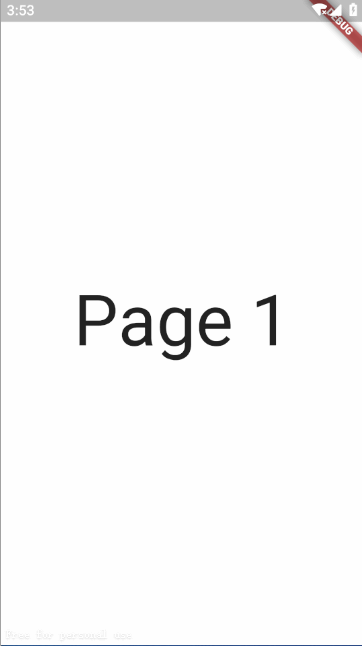

### ③、页面缓存

1. 我们在运行上面示例时，每当页面切换时都会触发新 `Page` 页的 `build`，比如我们从第一页滑到第二页，然后再滑回第一页时，控制台打印如下：

```dart
flutter: build 0
flutter: build 1
flutter: build 0
```

2. 可见 `PageView` 默认并没有缓存功能，一旦页面滑出屏幕它就会被销毁，这和我们前面讲过的 `ListView/GridView` 不一样，在创建 `ListView/GridView` 时我们可以手动指定 `ViewPort` 之外多大范围内的组件需要预渲染和缓存（通过 `cacheExtent` 指定），只有当组件滑出屏幕后又滑出预渲染区域，组件才会被销毁，但是不幸的是 `PageView`  并没有 `cacheExtent` 参数！
3. 但是在真实的业务场景中，对页面进行缓存是很常见的一个需求，比如一个新闻 App，下面有很多频道页，如果不支持页面缓存，则一旦滑到新的频道旧的频道页就会销毁，滑回去时又得重新请求数据和构建页面，这谁扛得住！
4. 按道理 `cacheExtent` 是 `Viewport` 的一个配置属性，且 `PageView` 也是要构建 `Viewport` 的，那么为什么就不能透传一下这个参数呢？于是看了一下 PageView 的源码，发现在 PageView 创建Viewport 的代码中是这样的：

```dart
child: Scrollable(
  ...
  viewportBuilder: (BuildContext context, ViewportOffset position) {
    return Viewport(
      // TODO(dnfield): we should provide a way to set cacheExtent
      // independent of implicit scrolling:
      // https://github.com/flutter/flutter/issues/45632
      cacheExtent: widget.allowImplicitScrolling ? 1.0 : 0.0,
      cacheExtentStyle: CacheExtentStyle.viewport,
      ...
    );
  },
)
```

5. 我们发现，虽然 `PageView` 没有透传 `cacheExtent`，但是却在 `allowImplicitScrolling` 为 `true` 时设置了预渲染区域；
6. 注意，此时的缓存类型为 `CacheExtentStyle.viewport`，则 `cacheExtent` 则表示缓存的长度是几个 `Viewport` 的宽度，`cacheExtent` 为 `1.0`，则代表前后各缓存一个页面宽度，即前后各一页。既然如此，那我们将 `PageView` 的 `allowImplicitScrolling` 置为 `true` 则不就可以缓存前后两页了？我们修改代码，然后运行示例，此时就可以缓存上下各一页了；
7. 能缓存前后各一页也貌似比不能缓存好一点，但还是不能彻底解决不了我们的问题。为什么明明就是顺手的事， flutter 就不让开发者指定缓存策略呢？然后我们翻译一下源码中的注释：

>    Todo：我们应该提供一种独立于隐式滚动（implicit scrolling）的设置 cacheExtent 的机制。

8. 放开 cacheExtent 透传是很简单的事情，为什么还要以后再做？是有什么难题么？要理解这个我们就需要看看 `allowImplicitScrolling` 到底是什么了，根据文档以及注释中 issue 的链接，发现 PageView 中设置  `cacheExtent` 会和 iOS 中 辅助功能有冲突（读者可以先不用关注），所以暂时还没有什么好的办法。
9. 看到这可能国内的很多开发者要说我们的 App 不用考虑辅助功能，既然如此，那问题很好解决，将 PageView 的源码拷贝一份，然后透传 cacheExtent 即可。
10. 拷源码的方式虽然很简单，但毕竟不是正统做法，那有没有更通用的方法吗？有！还记得我们在本章第一节中说过“可滚动组件提供了一种通用的缓存子项的解决方案” 吗，我们将在下一节重点介绍

## 8、AutomaticKeepAlive 可滚动组件子项缓存

### ①、简介

1. 本节将介绍可滚动组件中缓存指定子项的通用方案。
2. 在介绍 `ListView` 时，有一个 `addAutomaticKeepAlives` 属性我们并没有介绍，如果 `addAutomaticKeepAlives` 为 `true`，则 `ListView` 会为每一个列表项添加一个 `AutomaticKeepAlive` 父组件。
3. 虽然 `PageView` 的默认构造函数和 `PageView.builder` 构造函数中没有该参数，但它们最终都会生成一个 `SliverChildDelegate` 来负责列表项的按需加载，而在 `SliverChildDelegate` 中每当列表项构建完成后，`SliverChildDelegate` 都会为其添加一个 `AutomaticKeepAlive` 父组件。
4. `AutomaticKeepAlive` 的组件的主要作用是将列表项的根 `RenderObject` 的 `keepAlive` 按需自动标记 为 `true` 或 `false`。为了方便叙述，我们可以认为根 `RenderObject` 对应的组件就是列表项的根 `Widget`，代表整个列表项组件，同时我们将列表组件的 `Viewport 区域 + cacheExtent（预渲染区域）` 称为加载区域 ：
	1. 当 `keepAlive` 标记为 `false` 时，如果列表项滑出加载区域时，列表组件将会被销毁。
	2. 当 `keepAlive` 标记为 `true` 时，当列表项滑出加载区域后，`Viewport` 会将列表组件缓存起来；当列表项进入加载区域时，`Viewport` 从先从缓存中查找是否已经缓存，如果有则直接复用，如果没有则重新创建列表项。
5. 那么 `AutomaticKeepAlive` 什么时候会将列表项的 `keepAlive` 标记为 `true` 或 `false` 呢？答案是开发者说了算！
6. Flutter 中实现了一套类似 `C/S` 的机制，`AutomaticKeepAlive` 就类似一个 `Server`，它的子组件可以是 `Client`，这样子组件想改变是否需要缓存的状态时就向 `AutomaticKeepAlive` 发一个通知消息`（KeepAliveNotification）`，`AutomaticKeepAlive` 收到消息后会去更改 `keepAlive` 的状态，如果有必要同时做一些资源清理的工作（比如 `keepAlive` 从 `true` 变为 `false` 时，要释放缓存）。
7. 我们基于上一节 `PageView` 示例，实现页面缓存，根据上面的描述实现思路就很简单了：让 `Page` 页变成一个 `AutomaticKeepAlive Client` 即可。为了便于开发者实现，Flutter 提供了一个 `AutomaticKeepAliveClientMixin` ，我们只需要让 `PageState` 混入这个 mixin，且同时添加一些必要操作即可

### ②、实例

1. 让 `PageState` 混入 `AutomaticKeepAliveClientMixin`，在 `build` 中调用父类的 `build` 方法，并指定是否需要缓存

```dart
import 'package:flutter/material.dart';

import '04_可滚动组件/07_可滚动组件子项缓存/01_AutomaticKeepAlive.dart';


// 入口方法
void main() => runApp(const MyApp());

class MyApp extends StatelessWidget {
  const MyApp({Key? key}) : super(key: key);

  @override
  Widget build(BuildContext context) {
    /**
     * MaterialApp 是 Flutter 提供的一个小部件，用于创建一个包含 Material Design 样式和功能的应用程序。
     * 它是一个顶层小部件，用于为整个应用程序提供一致的主题和样式。
     * 在 MaterialApp 中，你可以设置应用程序的标题、主题、路由和其他全局属性
     */
    return MaterialApp(
      /**
       * home 是 MaterialApp 的一个属性，用于指定应用程序的主页。它接受一个 Widget 作为参数，用于定义主页的内容
       * Scaffold 是一个用于创建基本页面布局的小部件。
       * Scaffold 小部件提供了一个应用程序的基本布局结构，包括顶部的应用栏、底部的导航栏、抽屉菜单等。
       * 它是一个非常常用的小部件，常用于创建具有标准 Material Design 布局的页面
       */
      home: Scaffold(
        // 设置背景颜色为白色
        backgroundColor: Colors.white,
        /**
         * body: 用于定义页面的主要内容区域
         */
        body: PageView(
          children: const [
            AutomaticKeepAliveComponent(text: "Page 1"),
            AutomaticKeepAliveComponent(text: "Page 2"),
            AutomaticKeepAliveComponent(text: "Page 3"),
            AutomaticKeepAliveComponent(text: "Page 4"),
            AutomaticKeepAliveComponent(text: "Page 5"),
            AutomaticKeepAliveComponent(text: "Page 6"),
          ],
        ),
      )
    );
  }
}
```

```dart
import 'package:flutter/material.dart';

class AutomaticKeepAliveComponent extends StatefulWidget {
  const AutomaticKeepAliveComponent({Key? key, required this.text}) : super(key: key);

  final String text;

  @override
  _AutomaticKeepAliveComponentState createState() => _AutomaticKeepAliveComponentState();
}

// 混入 AutomaticKeepAliveClientMixin，这是保持状态的关键
class _AutomaticKeepAliveComponentState extends State<AutomaticKeepAliveComponent> with AutomaticKeepAliveClientMixin {

  // wantKeepAlive 为 true 表示使用 AutomaticKeepAliveClientMixin 保持状态
  @override
  // 是否需要缓存，如果为 false，则不缓存，每次都会重新构建
  bool get wantKeepAlive => true;

  // 构建 UI, context：构建上下文，即当前 Widget 的位置
  @override
  Widget build(BuildContext context) {
    // 必须调用父类的 build 方法
    super.build(context);
    // 页面构建时打印数据
    print("build ${widget.text}");
    // Center 是一个小部件，用于将其子部件居中显示在屏幕上
    return Center(child: Text("${widget.text}", textScaleFactor: 5));
  }

}
```

2. 效果：


3. 代码很简单，我们只需要提供一个 `wantKeepAlive`，它会表示 `AutomaticKeepAlive` 是否需要缓存当前列表项；另外我们必须在 `build` 方法中调用一下 `super.build(context)`，该方法实现在 `AutomaticKeepAliveClientMixin` 中，功能就是根据当前 `wantKeepAlive` 的值给 `AutomaticKeepAlive` 发送消息，`AutomaticKeepAlive` 收到消息后就会开始工作，如图所示：


4. 需要注意，如果我们采用 `PageView.custom` 构建页面时没有给列表项包装 `AutomaticKeepAlive` 父组件，则上述方案不能正常工作，因为此时 `Client` 发出消息后，找不到 `Server`，404 了

## 9、TabBarView 标签栏

### ①、TabBarView

1. `TabBarView` 封装了 `PageView`，它的构造方法很简单

```dart
TabBarView({
  Key? key,
  required this.children, // tab 页
  this.controller, // TabController
  this.physics,
  this.dragStartBehavior = DragStartBehavior.start,
}) 
```

2. `TabController` 用于监听和控制 `TabBarView` 的页面切换，通常和 `TabBar` 联动。
3. 如果没有指定，则会在组件树中向上查找并使用最近的一个 `DefaultTabController` 。

### ②、TabBar

1. `TabBar` 为 `TabBarView` 的导航标题，如图所示：


2. `TabBar` 有很多配置参数，通过这些参数我们可以定义 `TabBar` 的样式，很多属性都是在配置 `indicator` 和 `label`，拿上图来举例，`Label` `是每个Tab` 的文本，`indicator` 指 “历史” 下面的白色下划线。

```dart
const TabBar({
  Key? key,
  required this.tabs, // 具体的 Tabs，需要我们创建
  this.controller,
  this.isScrollable = false, // 是否可以滑动
  this.padding,
  this.indicatorColor,// 指示器颜色，默认是高度为2的一条下划线
  this.automaticIndicatorColorAdjustment = true,
  this.indicatorWeight = 2.0,// 指示器高度
  this.indicatorPadding = EdgeInsets.zero, //指示器padding
  this.indicator, // 指示器
  this.indicatorSize, // 指示器长度，有两个可选值，一个tab的长度，一个是label长度
  this.labelColor, 
  this.labelStyle,
  this.labelPadding,
  this.unselectedLabelColor,
  this.unselectedLabelStyle,
  this.mouseCursor,
  this.onTap,
  ...
}) 
```

3. `TabBar` 通常位于 `AppBar` 的底部，它也可以接收一个 `TabController` ，如果需要和 `TabBarView` 联动， `TabBar` 和 `TabBarView` 使用同一个 `TabController` 即可
4. 注意，联动时 `TabBar` 和 `TabBarView` 的孩子数量需要一致。
5. 如果没有指定 `controller`，则会在组件树中向上查找并使用最近的一个 `DefaultTabController` 。
6. 另外我们需要创建需要的 `tab` 并通过 `tabs` 传给 `TabBar`， `tab` 可以是任何 `Widget`，不过 `Material` 组件库中已经实现了一个 `Tab` 组件，我们一般都会直接使用它：

```dart
const Tab({
  Key? key,
  this.text, //文本
  this.icon, // 图标
  this.iconMargin = const EdgeInsets.only(bottom: 10.0),
  this.height,
  this.child, // 自定义 widget
})
```

7. 注意，`text` 和 `child` 是互斥的，不能同时制定。

### ③、实例

1. 实例

```dart
import 'package:flutter/material.dart';

import '04_可滚动组件/08_TabBarView 标签栏/01_TabBarView.dart';


// 入口方法
void main() => runApp(const MyApp());

class MyApp extends StatelessWidget {
  const MyApp({Key? key}) : super(key: key);

  @override
  Widget build(BuildContext context) {
    /**
     * MaterialApp 是 Flutter 提供的一个小部件，用于创建一个包含 Material Design 样式和功能的应用程序。
     * 它是一个顶层小部件，用于为整个应用程序提供一致的主题和样式。
     * 在 MaterialApp 中，你可以设置应用程序的标题、主题、路由和其他全局属性
     */
    return const MaterialApp(
      /**
       * home 是 MaterialApp 的一个属性，用于指定应用程序的主页。它接受一个 Widget 作为参数，用于定义主页的内容
       * Scaffold 是一个用于创建基本页面布局的小部件。
       * Scaffold 小部件提供了一个应用程序的基本布局结构，包括顶部的应用栏、底部的导航栏、抽屉菜单等。
       * 它是一个非常常用的小部件，常用于创建具有标准 Material Design 布局的页面
       */
      home: Scaffold(
        // 设置背景颜色为白色
        backgroundColor: Colors.white,
        /**
         * body: 用于定义页面的主要内容区域
         */
        body: TabBarViewComponent(),
      )
    );
  }
}
```

```dart
import 'package:flutter/material.dart';

import '../07_可滚动组件子项缓存/01_AutomaticKeepAlive.dart';

class TabBarViewComponent extends StatefulWidget {
  const TabBarViewComponent({Key? key}) : super(key: key);

  @override
  _TabBarViewComponentState createState() => _TabBarViewComponentState();
}

// 混入 AutomaticKeepAliveClientMixin，这是保持状态的关键
class _TabBarViewComponentState extends State<TabBarViewComponent> with SingleTickerProviderStateMixin {
  // late 关键字，表示这个变量会延迟初始化
  late TabController _tabController;
  List tabs = ["新闻", "历史", "图片"];

  @override
  void initState() {
    super.initState();
    _tabController = TabController(length: tabs.length, vsync: this);
  }

  // 构建 UI, context：构建上下文，即当前 Widget 的位置
  @override
  Widget build(BuildContext context) {
    /**
     * Scaffold 是一个用于创建基本页面布局的小部件。
     * Scaffold 小部件提供了一个应用程序的基本布局结构，包括顶部的应用栏、底部的导航栏、抽屉菜单等。
     * 它是一个非常常用的小部件，常用于创建具有标准 Material Design 布局的页面
     */
    return Scaffold(
      // appBar 属性用于设置应用程序顶部的导航栏。
      appBar: AppBar(
        /**
         * toolbarHeight 属性用于设置 AppBar 的高度, 默认高度为 kToolbarHeight = 56.0
         * 如果设置为 0，则 AppBar 的高度将会变为 0，即不再给 title 留出空间
         */
        toolbarHeight: 0,
        /**
         * bottom 属性用于设置 AppBar 的底部区域，通常用于设置 TabBar
         * TabBar 是一个 Material Design 样式的选项卡，通常放置在 AppBar 的底部
         */
        bottom: TabBar(
          controller: _tabController,
          tabs: tabs.map((e) => Tab(text: e)).toList(),
        ),
      ),
      /**
       * body: 用于定义页面的主要内容区域
       * TabBarView 是一个用于在 TabBar 和 TabBarView 之间同步切换的小部件。
       */
      body: TabBarView(
        controller: _tabController,
        children: tabs.map((e) {
          // 创建一个 TabBarView，它包含了三个 Tab 页
          return AutomaticKeepAliveComponent(text: e,);
        }).toList(),
      ),
    );
  }
  
  @override
  void dispose() {
    // 释放资源
    _tabController.dispose();
    super.dispose();
  }

}
```

2. 效果

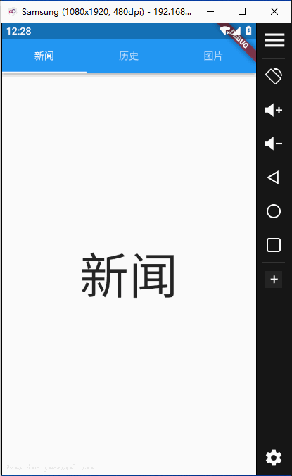

### ④、使用默认控制器

1. 上面的例子中，滑动页面时顶部的 Tab 也会跟着动，点击顶部 Tab 时页面也会跟着切换。
2. 为了实现 `TabBar` 和 `TabBarView` 的联动，我们显式创建了一个 `TabController`，由于 `TabController` 又需要一个 `TickerProvider` （vsync 参数）， 我们又混入了 `SingleTickerProviderStateMixin`；
3. 由于 `TabController` 中会执行动画，持有一些资源，所以我们在页面销毁时必须得释放资源（dispose）。
4. 综上，我们发现创建 `TabController` 的过程还是比较复杂，实战中，如果需要 TabBar 和 TabBarView 联动，通常会创建一个 `DefaultTabController` 作为它们共同的父级组件，这样它们在执行时就会从组件树向上查找，都会使用我们指定的这个 `DefaultTabController`。
5. 我们修改后的实现如下：

```dart
import 'package:flutter/material.dart';

import '../07_可滚动组件子项缓存/01_AutomaticKeepAlive.dart';

class TabBarViewComponent extends StatefulWidget {
  const TabBarViewComponent({Key? key}) : super(key: key);

  @override
  _TabBarViewComponentState createState() => _TabBarViewComponentState();
}

class _TabBarViewComponentState extends State<TabBarViewComponent>{
  List tabs = ["新闻", "历史", "图片"];

  // 构建 UI, context：构建上下文，即当前 Widget 的位置
  @override
  Widget build(BuildContext context) {
    /**
     * DefaultTabController 是默认的 TabController 实现，它接受一个 length 参数来指定 TabBar 中 Tab 页的个数，
     * 然后通过 Scaffold.of(context) 来获取父级最近的 Scaffold 组件，然后再调用 ScaffoldState 的方法来设置底部的 TabBar。
     */
    return DefaultTabController(
      // 设置 TabBar 中 Tab 页的个数
      length: tabs.length,
      /**
       * Scaffold 是一个用于创建基本页面布局的小部件。
       * Scaffold 小部件提供了一个应用程序的基本布局结构，包括顶部的应用栏、底部的导航栏、抽屉菜单等。
       * 它是一个非常常用的小部件，常用于创建具有标准 Material Design 布局的页面
       */
      child: Scaffold(
        // appBar 属性用于设置应用程序顶部的导航栏。
        appBar: AppBar(
          /**
           * toolbarHeight 属性用于设置 AppBar 的高度, 默认高度为 kToolbarHeight = 56.0
           * 如果设置为 0，则 AppBar 的高度将会变为 0，即不再给 title 留出空间
           */
          toolbarHeight: 0,
          /**
           * bottom 属性用于设置 AppBar 的底部区域，通常用于设置 TabBar
           * TabBar 是一个 Material Design 样式的选项卡，通常放置在 AppBar 的底部
           */
          bottom: TabBar(
            tabs: tabs.map((e) => Tab(text: e)).toList(),
          ),
        ),
        /**
         * body: 用于定义页面的主要内容区域
         * TabBarView 是一个用于在 TabBar 和 TabBarView 之间同步切换的小部件。
         */
        body: TabBarView(
          children: tabs.map((e) {
            // 创建一个 TabBarView，它包含了三个 Tab 页
            return AutomaticKeepAliveComponent(text: e,);
          }).toList(),
        ),
      )
    );
  }

}
```

6. 可以看到我们无需去手动管理 `Controller` 的生命周期，也不需要提供 `SingleTickerProviderStateMixin`，同时也没有其他的状态需要管理，也就不需要用 `StatefulWidget` 了，这样简单很多。

## 10、CustomScrollView 和 Slivers

### ①、CustomScrollView

1. 前面介绍的 `ListView`、`GridView`、`PageView` 都是一个完整的可滚动组件，所谓完整是指它们都包括 `Scrollable` 、 `Viewport` 和 `Sliver`。
2. 假如我们想要在一个页面中，同时包含多个可滚动组件，且使它们的滑动效果能统一起来，比如：我们想将已有的两个沿垂直方向滚动的 `ListView` 拼接成一个 `ListView` ，这样在第一个 `ListView` 滑动到底部时能自动接上第二 `ListView`，如果尝试写一个 demo：

```dart
import 'package:flutter/material.dart';

import '04_可滚动组件/09_CustomScrollView 和 Slivers/01_CustomScrollView_1.dart';


// 入口方法
void main() => runApp(const MyApp());

class MyApp extends StatelessWidget {
  const MyApp({Key? key}) : super(key: key);

  @override
  Widget build(BuildContext context) {
    /**
     * MaterialApp 是 Flutter 提供的一个小部件，用于创建一个包含 Material Design 样式和功能的应用程序。
     * 它是一个顶层小部件，用于为整个应用程序提供一致的主题和样式。
     * 在 MaterialApp 中，你可以设置应用程序的标题、主题、路由和其他全局属性
     */
    return const MaterialApp(
      /**
       * home 是 MaterialApp 的一个属性，用于指定应用程序的主页。它接受一个 Widget 作为参数，用于定义主页的内容
       * Scaffold 是一个用于创建基本页面布局的小部件。
       * Scaffold 小部件提供了一个应用程序的基本布局结构，包括顶部的应用栏、底部的导航栏、抽屉菜单等。
       * 它是一个非常常用的小部件，常用于创建具有标准 Material Design 布局的页面
       */
      home: Scaffold(
        // 设置背景颜色为白色
        backgroundColor: Colors.white,
        /**
         * body: 用于定义页面的主要内容区域
         */
        body: CustomScrollView1Component(),
      )
    );
  }
}
```

```dart
import 'package:flutter/material.dart';

class CustomScrollView1Component extends StatefulWidget {
  const CustomScrollView1Component({Key? key}) : super(key: key);

  @override
  _CustomScrollView1ComponentState createState() => _CustomScrollView1ComponentState();
}

class _CustomScrollView1ComponentState extends State<CustomScrollView1Component>{

  // 构建 UI, context：构建上下文，即当前 Widget 的位置
  @override
  Widget build(BuildContext context) {
    // 创建 ListView，其中包含 20 个 ListTile，用于显示列表项
    var listView = ListView.builder(
      itemCount: 20,
      itemBuilder: (_, index) => ListTile(title: Text('$index')),
    );

    // Column 是一个将子 Widget 垂直排列的小部件，它的高度默认为子 Widget 的高度之和
    return Column(
      children: [
        // Expanded 是一个可以用来包裹子 Widget 的小部件，它会将子 Widget 沿着父部件的垂直方向拉伸并填充满父部件
        Expanded(child: listView),
        // Divider 是一个分割线小部件，它可以在任何两个 Widget 之间添加一个分割线
        const Divider(color: Colors.grey),
        Expanded(child: listView),
      ],
    );
  }

}
```

3. 运行效果如图所示：

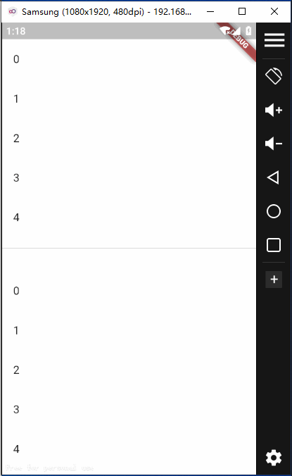

4. 页面中有两个 `ListView`，各占可视区域一半高度，虽然能够显式出来，但每一个 `ListView` 只会响应自己可视区域中滑动，实现不了我们想要的效果。
5. 之所以会这样的原因是两个 `ListView` 都有自己独立的 `Scrollable` 、 `Viewport` 和 `Sliver`，既然如此，我们自己创建一个共用的 `Scrollable` 和 `Viewport` 对象，然后再将两个 `ListView` 对应的 `Sliver` 添加到这个共用的 `Viewport` 对象中就可以实现我们想要的效果了。
6. 如果这个工作让开发者自己来做无疑是比较麻烦的，因此 Flutter 提供了一个 `CustomScrollView` 组件来帮助我们创建一个公共的 `Scrollable` 和 `Viewport` ，然后它的 `slivers` 参数接受一个 `Sliver` 数组，这样我们就可以使用 `CustomScrollView` 方面的实现我们期望的功能了：

```dart
import 'package:flutter/material.dart';

import '04_可滚动组件/09_CustomScrollView 和 Slivers/02_CustomScrollView_2.dart';


// 入口方法
void main() => runApp(const MyApp());

class MyApp extends StatelessWidget {
  const MyApp({Key? key}) : super(key: key);

  @override
  Widget build(BuildContext context) {
    /**
     * MaterialApp 是 Flutter 提供的一个小部件，用于创建一个包含 Material Design 样式和功能的应用程序。
     * 它是一个顶层小部件，用于为整个应用程序提供一致的主题和样式。
     * 在 MaterialApp 中，你可以设置应用程序的标题、主题、路由和其他全局属性
     */
    return const MaterialApp(
      /**
       * home 是 MaterialApp 的一个属性，用于指定应用程序的主页。它接受一个 Widget 作为参数，用于定义主页的内容
       * Scaffold 是一个用于创建基本页面布局的小部件。
       * Scaffold 小部件提供了一个应用程序的基本布局结构，包括顶部的应用栏、底部的导航栏、抽屉菜单等。
       * 它是一个非常常用的小部件，常用于创建具有标准 Material Design 布局的页面
       */
      home: Scaffold(
        // 设置背景颜色为白色
        backgroundColor: Colors.white,
        /**
         * body: 用于定义页面的主要内容区域
         */
        body: CustomScrollView2Component(),
      )
    );
  }
}
```

```dart
import 'package:flutter/material.dart';

class CustomScrollView2Component extends StatefulWidget {
  const CustomScrollView2Component({Key? key}) : super(key: key);

  @override
  _CustomScrollView2ComponentState createState() => _CustomScrollView2ComponentState();
}

class _CustomScrollView2ComponentState extends State<CustomScrollView2Component>{

  // 构建 UI, context：构建上下文，即当前 Widget 的位置
  @override
  Widget build(BuildContext context) {
    /**
     * SliverFixedExtentList 是一个 Sliver，它可以生成高度相同的列表项。
     * 再次提醒，如果列表项高度相同，我们应该优先使用SliverFixedExtentList 和 SliverPrototypeExtentList，
     * 如果不同，使用 SliverList.
     */
    var listView1 = SliverFixedExtentList(
      // 列表项高度固定
      itemExtent: 56,
      delegate: SliverChildBuilderDelegate(
        (_, index) => ListTile(title: Text('第一个列表 $index')),
        childCount: 20,
      ),
    );

    var listView2 = SliverFixedExtentList(
      // 列表项高度固定
      itemExtent: 56,
      delegate: SliverChildBuilderDelegate(
            (_, index) => ListTile(title: Text('第二个列表 ${index + 20}')),
        childCount: 20,
      ),
    );

    // CustomScrollView 是一个可以自定义滚动模型的组件，它可以包含多种滚动模型。
    return CustomScrollView(
      // slivers 是 CustomScrollView 的一个参数，它接受一个 SliverList 集合。
      slivers: [
        listView1,
        // 插入一个分割线
        SliverToBoxAdapter(
          child: Container(
            height: 1.0,
            color: Colors.grey,
          ),
        ),
        listView2,
      ],
    );
  }

}
```

7. 效果：

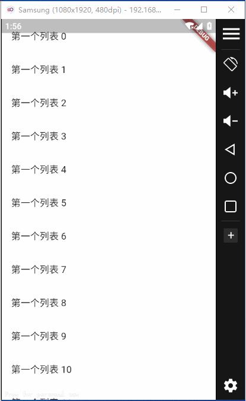

8. 综上，`CustomScrollView` 的主要功能是提供一个公共的 `Scrollable` 和 `Viewport`，来组合多个 `Sliver`，`CustomScrollView` 的结构如图所示：


### ②、Flutter 中常用的 Sliver

1. 之前小节介绍过的可滚动组件都有对应的 `Sliver`：

| Sliver名称                | 功能                               | 对应的可滚动组件               |
| ------------------------- | ---------------------------------- | ------------------------------ |
| SliverList                | 列表                               | ListView                       |
| SliverFixedExtentList     | 高度固定的列表                     | ListView，指定itemExtent时     |
| SliverAnimatedList        | 添加/删除列表项可以执行动画        | AnimatedList                   |
| SliverGrid                | 网格                               | GridView                       |
| SliverPrototypeExtentList | 根据原型生成高度固定的列表         | ListView，指定prototypeItem 时 |
| SliverFillViewport        | 包含多个子组件，每个都可以填满屏幕 | PageView                       |

2. 除了和列表对应的 `Sliver` 之外还有一些用于对 `Sliver` 进行布局、装饰的组件，它们的子组件必须是 `Sliver`，我们列举几个常用的：

| Sliver名称                      | 对应 RenderBox      |
| ------------------------------- | ------------------- |
| SliverPadding                   | Padding             |
| SliverVisibility、SliverOpacity | Visibility、Opacity |
| SliverFadeTransition            | FadeTransition      |
| SliverLayoutBuilder             | LayoutBuilder       |

3. 还有一些其他常用的 `Sliver`：

| Sliver名称             | 说明                                                   |
| ---------------------- | ------------------------------------------------------ |
| SliverAppBar           | 对应 AppBar，主要是为了在 CustomScrollView 中使用。    |
| SliverToBoxAdapter     | 一个适配器，可以将 RenderBox 适配为 Sliver，后面介绍。 |
| SliverPersistentHeader | 滑动到顶部时可以固定住，后面介绍。                     |

4. `Sliver` 系列 `Widget` 比较多，我们不会一一介绍，只需记住它的特点，需要时再去查看文档即可。
5. 上面之所以说“大多数”Sliver都和可滚动组件对应，是由于还有一些如 `SliverPadding`、`SliverAppBar` 等是和可滚动组件无关的，它们主要是为了结合 `CustomScrollView` 一起使用，这是因为 `CustomScrollView` 的子组件必须都是 `Sliver`

### ③、Flutter 中常用的 Sliver 示例

1. 代码分为三部分：
2. 头部 `SliverAppBar`：`SliverAppBar` 对应 `AppBar`，两者不同之处在于 `SliverAppBar` 可以集成到 `CustomScrollView`。`SliverAppBar` 可以结合 `FlexibleSpaceBar` 实现 `Material Design` 中头部伸缩的模型，具体效果，可以运行该示例查看。
3. 中间的 `SliverGrid`：它用 `SliverPadding` 包裹以给 `SliverGrid` 添加补白。`SliverGrid` 是一个两列，宽高比为 4 的网格，它有 20 个子组件。
4. 底部 `SliverFixedExtentList`：它是一个所有子元素高度都为 50 像素的列表。

```dart
// 因为本路由没有使用 Scaffold，为了让子级Widget(如Text)使用
// Material Design 默认的样式风格,我们使用 Material 作为本路由的根。
Material(
  child: CustomScrollView(
    slivers: <Widget>[
      // AppBar，包含一个导航栏.
      SliverAppBar(
        pinned: true, // 滑动到顶端时会固定住
        expandedHeight: 250.0,
        flexibleSpace: FlexibleSpaceBar(
          title: const Text('Demo'),
          background: Image.asset(
            "./imgs/sea.png",
            fit: BoxFit.cover,
          ),
        ),
      ),
      SliverPadding(
        padding: const EdgeInsets.all(8.0),
        sliver: SliverGrid(
          //Grid
          gridDelegate: SliverGridDelegateWithFixedCrossAxisCount(
            crossAxisCount: 2, //Grid按两列显示
            mainAxisSpacing: 10.0,
            crossAxisSpacing: 10.0,
            childAspectRatio: 4.0,
          ),
          delegate: SliverChildBuilderDelegate(
            (BuildContext context, int index) {
              //创建子widget
              return Container(
                alignment: Alignment.center,
                color: Colors.cyan[100 * (index % 9)],
                child: Text('grid item $index'),
              );
            },
            childCount: 20,
          ),
        ),
      ),
      SliverFixedExtentList(
        itemExtent: 50.0,
        delegate: SliverChildBuilderDelegate(
          (BuildContext context, int index) {
            //创建列表项
            return Container(
              alignment: Alignment.center,
              color: Colors.lightBlue[100 * (index % 9)],
              child: Text('list item $index'),
            );
          },
          childCount: 20,
        ),
      ),
    ],
  ),
);
```

5. 运行效果如图所示：


### ④、SliverToBoxAdapter

1. 在实际布局中，我们通常需要往 `CustomScrollView` 中添加一些自定义的组件，而这些组件并非都有 `Sliver` 版本，为此 Flutter 提供了一个 `SliverToBoxAdapter` 组件，它是一个适配器：可以将 `RenderBox` 适配为 `Sliver`。比如我们想在列表顶部添加一个可以横向滑动的 `PageView`，可以使用 `SliverToBoxAdapter` 来配置：

```dart
import 'package:flutter/material.dart';

class SliverToBoxAdapterComponent extends StatefulWidget {
  const SliverToBoxAdapterComponent({Key? key}) : super(key: key);

  @override
  _SliverToBoxAdapterComponentState createState() => _SliverToBoxAdapterComponentState();
}

class _SliverToBoxAdapterComponentState extends State<SliverToBoxAdapterComponent>{

  // 构建 UI, context：构建上下文，即当前 Widget 的位置
  @override
  Widget build(BuildContext context) {
    /**
     * SliverFixedExtentList 是一个 Sliver，它可以生成高度相同的列表项。
     * 再次提醒，如果列表项高度相同，我们应该优先使用SliverFixedExtentList 和 SliverPrototypeExtentList，
     * 如果不同，使用 SliverList.
     */
    var listView1 = SliverFixedExtentList(
      // 列表项高度固定
      itemExtent: 56,
      delegate: SliverChildBuilderDelegate(
        (_, index) => ListTile(title: Text('第一个列表 $index')),
        childCount: 20,
      ),
    );

    var listView2 = SliverFixedExtentList(
      // 列表项高度固定
      itemExtent: 56,
      delegate: SliverChildBuilderDelegate(
            (_, index) => ListTile(title: Text('第二个列表 ${index + 20}')),
        childCount: 20,
      ),
    );

    // CustomScrollView 是一个可以自定义滚动模型的组件，它可以包含多种滚动模型。
    return CustomScrollView(
      // slivers 是 CustomScrollView 的一个参数，它接受一个 SliverList 集合。
      slivers: [
        SliverToBoxAdapter(
          child: SizedBox(
            height: 300,
            child: PageView(
              children: const [Text("1", textScaleFactor: 20), Text("2", textScaleFactor: 20)],
            ),
          ),
        ),
        listView1,
        // 插入一个分割线
        SliverToBoxAdapter(
          child: Container(
            height: 1.0,
            color: Colors.grey,
          ),
        ),
        listView2,
      ],
    );
  }

}
```

2. 效果：

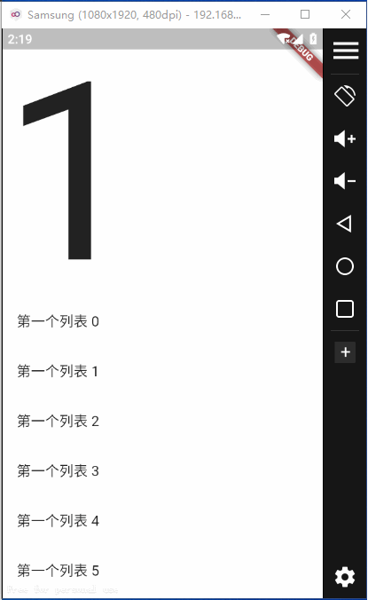

3. 注意，上面的代码是可以正常运行的，但是如果将 `PageView` 换成一个滑动方向和 `CustomScrollView` 一致的 `ListView` 则不会正常工作！
4. 原因是：`CustomScrollView` 组合 `Sliver` 的原理是为所有子 `Sliver` 提供一个共享的 `Scrollable`，然后统一处理指定滑动方向的滑动事件，如果 `Sliver` 中引入了其他的 `Scrollable`，则滑动事件便会冲突。
5. 上例中 `PageView` 之所以能正常工作，是因为 `PageView` 的 `Scrollable` 只处理水平方向的滑动，而 `CustomScrollView` 是处理垂直方向的，两者并未冲突，所以不会有问题，但是换一个也是垂直方向的 `ListView` 时则不能正常工作，最终的效果是，在 `ListView` 内滑动时只会对 `ListView` 起作用，原因是滑动事件被 `ListView` 的 `Scrollable` 优先消费，`CustomScrollView` 的 `Scrollable` 便接收不到滑动事件了。
6. Flutter 中手势的冲突时，默认的策略是子元素生效，这个我们将在后面事件处理相关章节介绍。
7. 所以我们可以得出一个结论：如果 `CustomScrollView` 有孩子也是一个完整的可滚动组件且它们的滑动方向一致，则 `CustomScrollView` 不能正常工作。要解决这个问题，可以使用 `NestedScrollView`，这个我们将在下一节介绍

### ⑤、SliverPersistentHeader

1. SliverPersistentHeader 的功能是当滑动到 CustomScrollView 的顶部时，可以将组件固定在顶部。
2. 需要注意， Flutter 中设计 `SliverPersistentHeader` 组件的初衷是为了实现 `SliverAppBar`，所以它的一些属性和回调在 `SliverAppBar` 中才会用到。
3. 因此，如果我们要直接使用 `SliverPersistentHeader`，看到它的一些配置和参数会感到疑惑，使用起来会感觉有心智成本，为此，会在下面介绍中指出哪些是需要我们重点关注的，哪些是可以忽略的
4. 我们先看看 `SliverPersistentHeader` 的定义：

```dart
const SliverPersistentHeader({
  Key? key,
  /**
   * delegate 是用于生成 header 的委托，类型为 SliverPersistentHeaderDelegate，它是一个抽象类，需要我们自己实现
   */
  required SliverPersistentHeaderDelegate delegate,
  /**
   * header 滑动到可视区域顶部时是否固定在顶部
   */
  this.pinned = false, 
  /**
   * floating 的作用是：pinned 为 false 时 ，则 header 可以滑出可视区域（CustomScrollView 的 Viewport）（不会固定到顶部），
   * 当用户再次向下滑动时，此时不管 header 已经被滑出了多远，它都会立即出现在可视区域顶部并固定住，
   * 直到继续下滑到 header 在列表中原来的位置时，header 才会重新回到原来的位置（不再固定在顶部）
   */
  this.floating = false,
})
```

5. delegate 的定义如下：

```dart
abstract class SliverPersistentHeaderDelegate {

  /**
   * header 最大高度；pined为 true 时，当 header 刚刚固定到顶部时高度为最大高度。
   */
  double get maxExtent;

  /**
   * header 的最小高度；pined 为 true 时，当 header 固定到顶部，用户继续往上滑动时，
   * header 的高度会随着用户继续上滑从 maxExtent 逐渐减小到 minExtent
   */
  double get minExtent;

  /**
   * 构建 header。
   * shrinkOffset 取值范围 [0,maxExtent]，当 header 刚刚到达顶部时，shrinkOffset 值为 0，
   * 如果用户继续向上滑动列表，shrinkOffset 的值会随着用户滑动的偏移减小，直到减到 0 时。
   * overlapsContent：一般不建议使用，在使用时一定要小心，后面会解释。
   */
  Widget build(BuildContext context, double shrinkOffset, bool overlapsContent);

  /**
   * header 是否需要重新构建；通常当父级的 StatefulWidget 更新状态时会触发。
   * 一般来说只有当 Delegate 的配置发生变化时，应该返回false，比如新旧的 minExtent、maxExtent
   * 等其他配置不同时需要返回 true，其余情况返回 false 即可。
   */
  bool shouldRebuild(covariant SliverPersistentHeaderDelegate oldDelegate);

  /**
   * 下面这几个属性是 SliverPersistentHeader 在 SliverAppBar 中时实现 floating、snap 效果时会用到，
   * 平时开发过程很少使用到，可以先不用理会。
   */
  TickerProvider? get vsync => null;
  FloatingHeaderSnapConfiguration? get snapConfiguration => null;
  OverScrollHeaderStretchConfiguration? get stretchConfiguration => null;
  PersistentHeaderShowOnScreenConfiguration? get showOnScreenConfiguration => null;

}
```

6. 可以看到，我们最需要关注的就是 `maxExtent` 和 `minExtent`；`pined` 为 `true` 时，当 `header` 刚刚固定到顶部，此时会对它应用 `maxExtent` （最大高度）；当用户继续往上滑动时，`header` 的高度会随着用户继续上滑从 `maxExtent` 逐渐减小到 `minExtent`。如果我们想让 `header` 高度固定，则将 `maxExtent` 和 `minExtent` 指定为同样的值即可。

#### Ⅰ、实例

1. 主方法 `main.dart`

```dart
import 'package:flutter/material.dart';

import '04_可滚动组件/09_CustomScrollView 和 Slivers/04_1_SliverPersistentHeaderComponent.dart';


// 入口方法
void main() => runApp(const MyApp());

class MyApp extends StatelessWidget {
  const MyApp({Key? key}) : super(key: key);

  @override
  Widget build(BuildContext context) {
    /**
     * MaterialApp 是 Flutter 提供的一个小部件，用于创建一个包含 Material Design 样式和功能的应用程序。
     * 它是一个顶层小部件，用于为整个应用程序提供一致的主题和样式。
     * 在 MaterialApp 中，你可以设置应用程序的标题、主题、路由和其他全局属性
     */
    return const MaterialApp(
      /**
       * home 是 MaterialApp 的一个属性，用于指定应用程序的主页。它接受一个 Widget 作为参数，用于定义主页的内容
       * Scaffold 是一个用于创建基本页面布局的小部件。
       * Scaffold 小部件提供了一个应用程序的基本布局结构，包括顶部的应用栏、底部的导航栏、抽屉菜单等。
       * 它是一个非常常用的小部件，常用于创建具有标准 Material Design 布局的页面
       */
      home: Scaffold(
        // 设置背景颜色为白色
        backgroundColor: Colors.white,
        /**
         * body: 用于定义页面的主要内容区域
         */
        body: SliverPersistentHeaderComponent(),
      )
    );
  }
}
```

2. 继承了 `SliverPersistentHeaderDelegate` 的 `SliverPersistentHeaderBuilder` 类，它用于定义 SliverPersistentHeader 的行为和外观

```dart
import 'dart:math';

import 'package:flutter/material.dart';

// 继承 SliverPersistentHeaderDelegate，它用于定义 SliverPersistentHeader 的行为和外观
class SliverPersistentHeaderBuilder extends SliverPersistentHeaderDelegate {
  // 构造函数，接收最小高度、最大高度和子 Widget 作为参数。
  SliverPersistentHeaderBuilder({
    required this.minHeight,
    required this.maxHeight,
    required this.child,
  });

  // 最小高度
  final double minHeight;
  // 最大高度
  final double maxHeight;
  // 子 Widget
  final Widget child;

  // 重写 minExtent，返回最小高度
  @override
  double get minExtent => minHeight;

  // 重写 maxExtent，返回最大高度。如果最大高度小于最小高度，返回最小高度
  @override
  double get maxExtent => max(maxHeight, minHeight);

  // 重写 build 方法，返回一个填充父 Widget 的 SizedBox，包含 child
  @override
  Widget build(BuildContext context, double shrinkOffset, bool overlapsContent) {
    return SizedBox.expand(child: child);
  }

  // 重写 shouldRebuild 方法，当最大高度、最小高度或子 Widget 改变时，重新构建
  @override
  bool shouldRebuild(SliverPersistentHeaderBuilder oldDelegate) {
    return maxHeight != oldDelegate.maxHeight ||
        minHeight != oldDelegate.minHeight ||
        child != oldDelegate.child;
  }

}
```

3. `SliverPersistentHeaderComponent` 类使用 `SliverPersistentHeaderBuilder`

```dart
import 'package:flutter/material.dart';

import '04_2_SliverPersistentHeader.dart';

class SliverPersistentHeaderComponent extends StatefulWidget {
  const SliverPersistentHeaderComponent({Key? key}) : super(key: key);

  @override
  _SliverPersistentHeaderComponentState createState() => _SliverPersistentHeaderComponentState();
}

class _SliverPersistentHeaderComponentState extends State<SliverPersistentHeaderComponent>{

  // 构建 UI, context：构建上下文，即当前 Widget 的位置
  @override
  Widget build(BuildContext context) {
    /**
     * SliverFixedExtentList 是一个 Sliver，它可以生成高度相同的列表项。
     * 再次提醒，如果列表项高度相同，我们应该优先使用SliverFixedExtentList 和 SliverPrototypeExtentList，
     * 如果不同，使用 SliverList.
     */
    var listView1 = SliverFixedExtentList(
      // 列表项高度固定
      itemExtent: 56,
      delegate: SliverChildBuilderDelegate(
        (_, index) => ListTile(title: Text('第一个列表 $index')),
        childCount: 20,
      ),
    );

    // CustomScrollView 是一个可以自定义滚动模型的组件，它可以包含多种滚动模型。
    return CustomScrollView(
      // slivers 是 CustomScrollView 的一个参数，它接受一个 SliverList 集合。
      slivers: [
        // 调用方法，返回一个 SliverPersistentHeader
        _SliverPersistentHeaderBuilder(),
        listView1,
        // 插入一个分割线
        SliverToBoxAdapter(
          child: Container(
            height: 1.0,
            color: Colors.grey,
          ),
        ),
        // 调用方法，返回一个 SliverPersistentHeader
        _SliverPersistentHeaderBuilder(),
        listView1,
      ],
    );
  }

  // 构建 SliverPersistentHeader，它是一个固定高度的 Sliver，它可以在滚动时固定在顶部或底部，实现吸顶或吸底效果
  Widget _SliverPersistentHeaderBuilder(){
    return SliverPersistentHeader(
      // pinned 为 true 时，代表 SliverPersistentHeader 向上滚动时会固定在顶部
      pinned: true,
      delegate: SliverPersistentHeaderBuilder(
        // minHeight 最小高度
        minHeight: 60.0,
        // maxHeight 最大高度
        maxHeight: 200.0,
        // child 子 Widget；Container 是一个常用的容器类 Widget，它可以装饰、布局、限制子 Widget，相当于 Android 中的 FrameLayout
        child: Container(
          color: Colors.green,
          child: const Center(
            child: Text('Persistent Header'),
          ),
        ),
      ),
    );
  }

}
```

#### Ⅱ、效果

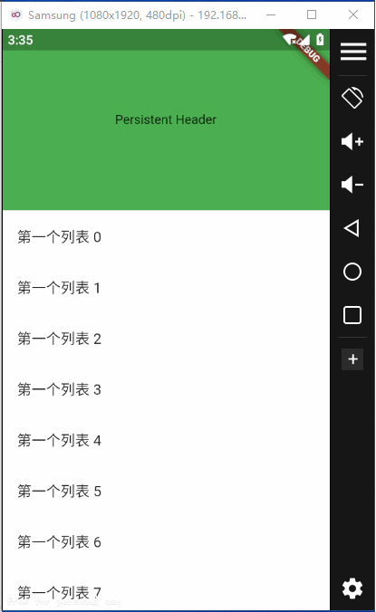

#### Ⅲ、一些注意点

1. `SliverPersistentHeader` 的 `builder` 参数 `overlapsContent` 一般不建议使用，使用时要当心。
2. 因为按照 `overlapsContent` 变量名的字面意思，只要有内容和 `Sliver` 重叠时就应该为 `true`，但是如果我们在上面示例的 `builder` 中打印一下 `overlapsContent` 的值就会发现第一个 PersistentHeader 1 的 `overlapsContent` 值一直都是 `false`，而 PersistentHeader 2 则是正常的，如果我们再添加几个 `SliverPersistentHeader` ，发现新添加的也都正常。总结一下：当有多个 `SliverPersistentHeader` 时，需要注意第一个 `SliverPersistentHeader` 的 `overlapsContent` 值会一直为 `false`。
3. 这可能是一个 bug，也可能就是这么设计的，因为 `SliverPersistentHeader` 的设计初衷主要是为了实现 `SliverAppBar`，可能并没有考虑到通用的场景，但是不管怎样，当前的 flutter 版本（2.5）中表现就是如此。
4. 为此，我们可以定一条约定：如果我们在使用 `SliverPersistentHeader` 构建子组件时需要依赖 `overlapsContent` 参数，则必须保证之前至少还有一个 `SliverPersistentHeader` 或 `SliverAppBar`（SliverAppBar 在当前 Flutter 版本的实现中内部包含了SliverPersistentHeader）。

## 11、自定义 Sliver

## 12、嵌套可滚动组件 NestedScrollView

# 七、功能型组件

## 1、导航返回拦截（WillPopScope）

1. 为了避免用户误触返回按钮而导致 App 退出，在很多 App 中都拦截了用户点击返回键的按钮，然后进行一些防误触判断，比如当用户在某一个时间段内点击两次时，才会认为用户是要退出（而非误触）。
2. Flutter 中可以通过 `WillPopScope` 来实现返回按钮拦截，我们看看 `WillPopScope` 的默认构造函数：

```dart
const WillPopScope({
  ...
  /**
   * onWillPop 是一个回调函数，当用户点击返回按钮时被调用（包括导航返回按钮及 Android 物理返回按钮）。
   * 该回调需要返回一个 Future 对象，如果返回的 Future 最终值为 false 时，则当前路由不出栈(不会返回)；
   * 最终值为 true 时，当前路由出栈退出。我们需要提供这个回调来决定是否退出
   */
  required WillPopCallback onWillPop,
  required Widget child
})
```

3. 实例：

```dart
import 'package:flutter/material.dart';

import '05_功能型组件/01_导航返回拦截（WillPopScope）.dart';


// 入口方法
void main() => runApp(const MyApp());

class MyApp extends StatelessWidget {
  const MyApp({Key? key}) : super(key: key);

  @override
  Widget build(BuildContext context) {
    /**
     * MaterialApp 是 Flutter 提供的一个小部件，用于创建一个包含 Material Design 样式和功能的应用程序。
     * 它是一个顶层小部件，用于为整个应用程序提供一致的主题和样式。
     * 在 MaterialApp 中，你可以设置应用程序的标题、主题、路由和其他全局属性
     */
    return const MaterialApp(
      /**
       * home 是 MaterialApp 的一个属性，用于指定应用程序的主页。它接受一个 Widget 作为参数，用于定义主页的内容
       * Scaffold 是一个用于创建基本页面布局的小部件。
       * Scaffold 小部件提供了一个应用程序的基本布局结构，包括顶部的应用栏、底部的导航栏、抽屉菜单等。
       * 它是一个非常常用的小部件，常用于创建具有标准 Material Design 布局的页面
       */
      home: Scaffold(
        // 设置背景颜色为白色
        backgroundColor: Colors.white,
        /**
         * body: 用于定义页面的主要内容区域
         */
        body: WillPopScopeComponent(),
      )
    );
  }
}
```

```dart
import 'package:flutter/material.dart';

class WillPopScopeComponent extends StatefulWidget {
  const WillPopScopeComponent({Key? key}) : super(key: key);

  @override
  _WillPopScopeComponentState createState() => _WillPopScopeComponentState();
}

class _WillPopScopeComponentState extends State<WillPopScopeComponent> {

  // 记录上次点击时间
  DateTime? _lastPressedAt;

  // 构建 UI, context：构建上下文，即当前 Widget 的位置
  @override
  Widget build(BuildContext context) {
    // WillPopScope 是一个小部件，用于检测 Android 返回按钮和导航栏返回按钮的点击事件。
    return WillPopScope(
      // onWillPop 是 WillPopScope 的一个属性，它接受一个 Future<bool> 类型的回调函数；async 表示该函数是一个异步函数
      onWillPop: () async {
        /**
         * 如果 _lastPressedAt 为 null 或者 当前时间与上次点击时间间隔超过 1 秒，则将当前时间赋值给 _lastPressedAt，并返回 false
         * 返回 false 表示不退出；返回 true 表示退出
         */
        if (_lastPressedAt == null || DateTime.now().difference(_lastPressedAt!) > const Duration(seconds: 1)) {
          // 两次点击间隔超过 1 秒则重新计时
          _lastPressedAt = DateTime.now();
          return false;
        }
        return true;
      },
      child: Container(
        alignment: Alignment.center,
        child: const Text("1秒内连续按两次返回键退出"),
      )
    );
  }

}
```

4. 效果：

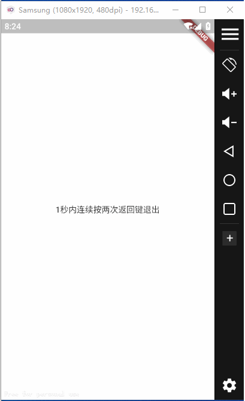

## 2、数据共享（InheritedWidget）

### ①、简介

1. `InheritedWidget` 是 Flutter 中非常重要的一个功能型组件，它提供了一种在 `widget` 树中从上到下共享数据的方式，比如我们在应用的根 `widget` 中通过 `InheritedWidget` 共享了一个数据，那么我们便可以在任意子 `widget` 中来获取该共享的数据！
2. 这个特性在一些需要在整个 `widget` 树中共享数据的场景中非常方便！如 Flutter SDK 中正是通过 `InheritedWidget` 来共享应用主题（Theme）和 Locale (当前语言环境)信息的。
3. `InheritedWidget` 和 `React` 中的 `context` 功能类似，和逐级传递数据相比，它们能实现组件跨级传递数据。
4. `InheritedWidget` 在 `widget` 树中数据传递方向是从上到下的，这和通知 Notification（将在下一章中介绍）的传递方向正好相反。
5. 下面我们看一下之前“计数器”示例应用程序的 `InheritedWidget` 版本。
6. 需要说明的是，本示例主要是为了演示 `InheritedWidget` 的功能特性，并不是计数器的推荐实现方式。
7. 首先，我们通过继承 `InheritedWidget`，将当前计数器点击次数保存在 `ShareDataWidget` 的 `data` 属性中：

```dart
import 'package:flutter/material.dart';

class ShareDataWidget extends InheritedWidget {
  const ShareDataWidget({
    Key? key,
    required this.data,
    required Widget child,
  }) : super(key: key, child: child);

  // 需要在子树中共享的数据，保存点击次数
  final int data;

  /// 该回调决定当 data 发生变化时，是否通知子树中依赖 data 的 Widget 重新 build
  /// 如果返回 true，则子树中依赖 data 的 Widget 的 `state.didChangeDependencies` 会被调用
  @override
  bool updateShouldNotify(covariant ShareDataWidget oldWidget) {
    return oldWidget.data != data;
  }

  // 定义一个便捷方法，方便子树中的 widget 获取共享数据
  static ShareDataWidget? of(BuildContext context) {
    return context.dependOnInheritedWidgetOfExactType<ShareDataWidget>();
  }

}
```

8. 然后我们实现一个子组件 `ShowShareDataWidgetComponent`，在其 `build` 方法中引用 `ShareDataWidget` 中的数据。同时，在其 `didChangeDependencies()` 回调中打印日志：

```dart
import 'package:flutter/material.dart';

import '02_1_ShareDataWidget.dart';

class ShowShareDataWidgetComponent extends StatefulWidget {
  const ShowShareDataWidgetComponent({Key? key}) : super(key: key);

  @override
  _ShowShareDataWidgetComponentState createState() => _ShowShareDataWidgetComponentState();
}

class _ShowShareDataWidgetComponentState extends State<ShowShareDataWidgetComponent> {

  // 构建 UI, context：构建上下文，即当前 Widget 的位置
  @override
  Widget build(BuildContext context) {
    // 使用 InheritedWidget 中的共享数据
    return Text(ShareDataWidget.of(context)!.data.toString());
  }

  /// 下面会详细介绍
  /// didChangeDependencies 是一个 State 的方法，当依赖的 State 发生变化时会被调用
  @override
  void didChangeDependencies() {
    super.didChangeDependencies();
    // 父或祖先 widget 中的 InheritedWidget 改变(updateShouldNotify 返回 true)时会被调用。
    // 如果 build 中没有依赖 InheritedWidget，则此回调不会被调用。
    print("Dependencies change ${ShareDataWidget.of(context)!.data.toString()}");
  }

}
```

### ②、didChangeDependencies 依赖改变回调

1. 在之前介绍 `StatefulWidget` 时，我们提到 `State` 对象有一个 `didChangeDependencies` 回调，它会在“依赖”发生变化时被 Flutter 框架调用。而这个“依赖”指的就是子 widget 是否使用了父 widget 中 `InheritedWidget` 的数据！
2. 如果使用了，则代表子 widget 有依赖；如果没有使用则代表没有依赖。
3. 这种机制可以使子组件在所依赖的 `InheritedWidget` 变化时来更新自身。比如当主题、locale(语言)等发生变化时，依赖其的子 widget 的 `didChangeDependencies` 方法将会被调用。
4. 最后，我们创建一个按钮，每点击一次，就将 `ShareDataWidget` 的值自增：

```dart
import 'package:flutter/material.dart';

import '02_1_ShareDataWidget.dart';
import '02_2_ShowShareDataWidgetComponent.dart';

class InheritedWidgetTestRoute extends StatefulWidget {
  const InheritedWidgetTestRoute({Key? key}) : super(key: key);

  @override
  _InheritedWidgetTestRouteState createState() => _InheritedWidgetTestRouteState();
}

class _InheritedWidgetTestRouteState extends State<InheritedWidgetTestRoute> {
  int count = 0;

  // 构建 UI, context：构建上下文，即当前 Widget 的位置
  @override
  Widget build(BuildContext context) {
    // Center 是一个用于将子小部件放置在水平和垂直方向上的中心位置的小部件。
    return Center(
      // ShareDataWidget 是一个小部件，用于在子树中保存共享数据。
      child: ShareDataWidget(
        data: count,
        child: Column(
          mainAxisAlignment: MainAxisAlignment.center,
          children: [
            const Padding(padding: EdgeInsets.only(bottom: 20.0), child: ShowShareDataWidgetComponent()),
            ElevatedButton(
              child: const Text("Increment"),
              onPressed: () => setState(() => ++count),
            )
          ],
        ),
      ),
    );
  }

}
```

5. `main.dart` 入口文件

```dart
import 'package:flutter/material.dart';

import '05_功能型组件/02_3_InheritedWidgetTestRoute.dart';


// 入口方法
void main() => runApp(const MyApp());

class MyApp extends StatelessWidget {
  const MyApp({Key? key}) : super(key: key);

  @override
  Widget build(BuildContext context) {
    /**
     * MaterialApp 是 Flutter 提供的一个小部件，用于创建一个包含 Material Design 样式和功能的应用程序。
     * 它是一个顶层小部件，用于为整个应用程序提供一致的主题和样式。
     * 在 MaterialApp 中，你可以设置应用程序的标题、主题、路由和其他全局属性
     */
    return const MaterialApp(
      /**
       * home 是 MaterialApp 的一个属性，用于指定应用程序的主页。它接受一个 Widget 作为参数，用于定义主页的内容
       * Scaffold 是一个用于创建基本页面布局的小部件。
       * Scaffold 小部件提供了一个应用程序的基本布局结构，包括顶部的应用栏、底部的导航栏、抽屉菜单等。
       * 它是一个非常常用的小部件，常用于创建具有标准 Material Design 布局的页面
       */
      home: Scaffold(
        // 设置背景颜色为白色
        backgroundColor: Colors.white,
        /**
         * body: 用于定义页面的主要内容区域
         */
        body: InheritedWidgetTestRoute(),
      )
    );
  }
}
```

6. 效果：

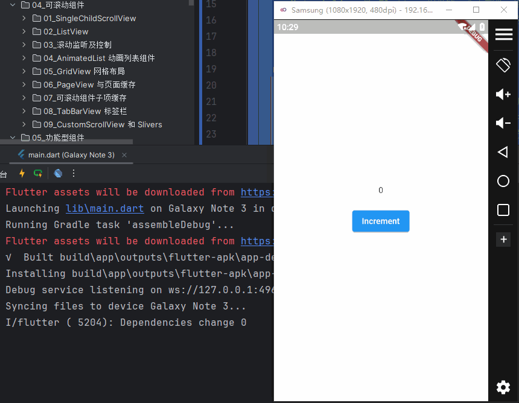

### ③、didChangeDependencies 注意事项

1. 依赖发生变化后，其 `didChangeDependencies()` 会被调用。但是要注意，如果 `ShowShareDataWidgetComponent` 的 build 方法中没有使用 `ShareDataWidget` 的数据，那么它的 `didChangeDependencies()` 将不会被调用，因为它并没有依赖 `ShareDataWidget`
2. 应该在 `didChangeDependencies()` 中做什么？一般来说，子 widget 很少会重写此方法，因为在依赖改变后 Flutter 框架也都会调用 `build()` 方法重新构建组件树。但是，如果你需要在依赖改变后执行一些昂贵的操作，比如网络请求，这时最好的方式就是在此方法中执行，这样可以避免每次 `build(`) 都执行这些昂贵操作

### ④、深入了解 InheritedWidget

1. 现在来思考一下，在上面的例子中，如果我们只想在 `_ShowShareDataWidgetComponentState` 中引用 `ShareDataWidget` 数据，但却不希望在 `ShareDataWidget` 发生变化时调用 `_ShowShareDataWidgetComponentState` 的 `didChangeDependencies()` 方法应该怎么办？其实答案很简单，我们只需要将 `ShareDataWidget.of()` 的实现改一下即可：

```dart
// 定义一个便捷方法，方便子树中的 widget 获取共享数据
static ShareDataWidget of(BuildContext context) {
  // return context.dependOnInheritedWidgetOfExactType<ShareDataWidget>();
 return context.getElementForInheritedWidgetOfExactType<ShareDataWidget>()!.widget as ShareDataWidget;
}
```

2. 唯一的改动就是获取 `ShareDataWidget` 对象的方式，把 `dependOnInheritedWidgetOfExactType()` 方法换成了 `context.getElementForInheritedWidgetOfExactType<ShareDataWidget>().widget`，那么他们到底有什么区别呢，我们看一下这两个方法的源码（实现代码在 Element 类中，Context 和 Element 的关系我们将在后面专门介绍）：

```dart
@override
InheritedWidget dependOnInheritedElement(InheritedElement ancestor, { Object aspect }) {
	assert(ancestor != null);
	_dependencies ??= HashSet<InheritedElement>();
	_dependencies.add(ancestor);
	ancestor.updateDependencies(this, aspect);
	return ancestor.widget;
}
```

3. 可以看到 `dependOnInheritedElement` 方法中主要是注册了依赖关系！
4. 看到这里也就清晰了，调用 `dependOnInheritedWidgetOfExactType()` 和 `getElementForInheritedWidgetOfExactType()` 的区别就是前者会注册依赖关系，而后者不会，所以在调用 `dependOnInheritedWidgetOfExactType()` 时，`InheritedWidget` 和依赖它的子孙组件关系便完成了注册，之后当 `InheritedWidget` 发生变化时，就会更新依赖它的子孙组件，也就是会调这些子孙组件的 `didChangeDependencies()` 方法和 `build()` 方法。而当调用的是 `getElementForInheritedWidgetOfExactType()`时，由于没有注册依赖关系，所以之后当 `InheritedWidget` 发生变化时，就不会更新相应的子孙 Widget。
5. 注意，如果将上面示例中 `ShareDataWidget.of()` 方法实现改成调用 `getElementForInheritedWidgetOfExactType()`，运行示例后，点击`Increment`按钮，会发现 `_ShowShareDataWidgetComponentState` 的 `didChangeDependencies()` 方法确实不会再被调用，但是其 `build()` 仍然会被调用！造成这个的原因其实是，点击 `Increment` 按钮后，会调用 `_InheritedWidgetTestRouteState` 的 `setState()` 方法，此时会重新构建整个页面，由于示例中，`_ShowShareDataWidgetComponentState` 并没有任何缓存，所以它也都会被重新构建，所以也会调用 `build()` 方法。
6. 那么，现在就带来了一个问题：实际上，我们只想更新子树中依赖了 `ShareDataWidget` 的组件，而现在只要调用 `_InheritedWidgetTestRouteState` 的 `setState(`) 方法，所有子节点都会被重新 build，这很没必要，那么有什么办法可以避免呢？答案是缓存！一个简单的做法就是通过封装一个 `StatefulWidget`，将子 Widget 树缓存起来，具体做法下一节我们将通过实现一个 Provider Widget 来演示如何缓存，以及如何利用 `InheritedWidget` 来实现 Flutter 全局状态共享。

## 3、跨组件状态共享

### ①、通过事件同步状态

1. 在 Flutter 开发中，状态管理是一个永恒的话题。
2. 一般的原则是：
	1. 如果状态是组件私有的，则应该由组件自己管理；
	2. 如果状态要跨组件共享，则该状态应该由各个组件共同的父元素来管理。
3. 对于组件私有的状态管理很好理解，但对于跨组件共享的状态，管理的方式就比较多了
4. 如使用全局事件总线EventBus（将在下一章中介绍），它是一个观察者模式的实现，通过它就可以实现跨组件状态同步：状态持有方（发布者）负责更新、发布状态，状态使用方（观察者）监听状态改变事件来执行一些操作。下面我们看一个登录状态同步的简单示例：
5. 定义事件：

```dart
enum Event{
  login,
  ... //省略其他事件
}
```

6. 登录页代码大致如下：

```dart
// 登录状态改变后发布状态改变事件
bus.emit(Event.login);
```

7. 依赖登录状态的页面：

```dart
void onLoginChanged(e){
  //登录状态变化处理逻辑
}

@override
void initState() {
  //订阅登录状态改变事件
  bus.on(Event.login,onLogin);
  super.initState();
}

@override
void dispose() {
  //取消订阅
  bus.off(Event.login,onLogin);
  super.dispose();
}
```

8. 我们可以发现，通过观察者模式来实现跨组件状态共享有一些明显的缺点：
	1. 必须显式定义各种事件，不好管理。
	2. 订阅者必须需显式注册状态改变回调，也必须在组件销毁时手动去解绑回调以避免内存泄露。
9. 在 Flutter 当中有没有更好的跨组件状态管理方式了呢？答案是肯定的，那怎么做的？我们想想前面介绍的 `InheritedWidget`，它的天生特性就是能绑定 `InheritedWidget` 与依赖它的子孙组件的依赖关系，并且当 `InheritedWidget` 数据发生变化时，可以自动更新依赖的子孙组件
10. 利用这个特性，我们可以将需要跨组件共享的状态保存在 `InheritedWidget` 中，然后在子组件中引用 `InheritedWidget` 即可
11. Flutter 社区著名的 `Provider` 包正是基于这个思想实现的一套跨组件状态共享解决方案，接下来我们便详细介绍一下 `Provider` 的用法及原理

### ②、Provider

#### Ⅰ、自实现 Provider

1. 首先，我们需要一个能够保存共享数据的 `InheritedWidget`，由于具体业务数据类型不可预期，为了通用性，我们使用泛型，定义一个通用的 `InheritedProvider` 类，它继承自 `InheritedWidget`：

```dart
import 'package:flutter/material.dart';

// 一个通用的 InheritedWidget，保存需要跨组件共享的状态
class InheritedProvider<T> extends InheritedWidget {
  const InheritedProvider({Key? key, required this.data, required Widget child,}): super(key: key, child: child);

  // 需要在子树中共享的数据，保存点击次数
  final T data;

  /// 该回调决定当 data 发生变化时，是否通知子树中依赖 data 的 Widget 重新 build
  /// 如果返回 true，则子树中依赖 data 的 Widget 的 `state.didChangeDependencies` 会被调用
  @override
  bool updateShouldNotify(covariant InheritedProvider oldWidget) {
    // 在此简单返回 true，则每次更新都会调用依赖其的子孙节点的 `didChangeDependencies`。
    return true;
  }

}
```

2. 数据保存的地方有了，那么接下来我们需要做的就是在数据发生变化的时候来重新构建 `InheritedProvider`，那么现在就面临两个问题：
	1. 数据发生变化怎么通知？
	2. 谁来重新构建 `InheritedProvider`？
3. 第一个问题其实很好解决，我们当然可以使用之前介绍的 `eventBus` 来进行事件通知，但是为了更贴近 Flutter 开发，我们使用 Flutter SDK 中提供的 `ChangeNotifier` 类 ，它继承自 `Listenable`，也实现了一个 Flutter 风格的发布者 - 订阅者模式，`ChangeNotifier` 定义大致如下：

```dart
class ChangeNotifier implements Listenable {
  List listeners=[];
  @override
  void addListener(VoidCallback listener) {
     //添加监听器
     listeners.add(listener);
  }
  @override
  void removeListener(VoidCallback listener) {
    //移除监听器
    listeners.remove(listener);
  }
  
  void notifyListeners() {
    //通知所有监听器，触发监听器回调 
    listeners.forEach((item)=>item());
  }
   
  ... //省略无关代码
}
```

4. 我们可以通过调用 `addListener()` 和 `removeListener()` 来添加、移除监听器（订阅者）；通过调用`notifyListeners()` 可以触发所有监听器回调。
5. 现在，我们将要共享的状态放到一个 Model 类中，然后让它继承自 `ChangeNotifier`，这样当共享的状态改变时，我们只需要调用 `notifyListeners()` 来通知订阅者，然后由订阅者来重新构建 `InheritedProvider`，这也是第二个问题的答案！接下来我们便实现这个订阅者类：

```dart
import 'package:flutter/material.dart';

import '01_1_InheritedProvider.dart';

// 该类负责将 model 放入到 Widget 树中，实现共享，同时负责更新 Widget 树
class ChangeNotifierProvider<T extends ChangeNotifier> extends StatefulWidget {
  const ChangeNotifierProvider({Key? key, required this.data, required this.child,}) : super(key: key);

  // 需要共享的数据，通过泛型 T 传入
  final T data;
  // 子组件
  final Widget child;

  // 定义一个便捷方法，方便子树中的 widget 获取共享数据
  static T of<T>(BuildContext context) {
    // 获取当前上下文中的 InheritedProvider<T> 实例
    final provider = context.dependOnInheritedWidgetOfExactType<InheritedProvider<T>>();
    if (provider == null) {
      // 如果未找到对应的 InheritedProvider，则抛出错误
      throw FlutterError('ChangeNotifierProvider.of() called with a context that does not contain an InheritedProvider<$T> of type $T.');
    }
    // 返回获取到的共享数据
    return provider.data;
  }

  @override
  _ChangeNotifierProviderState<T> createState() => _ChangeNotifierProviderState<T>();
}
```

6. 该类继承 `StatefulWidget`，然后定义了一个 `of()` 静态方法供子类方便获取 Widget 树中的 `InheritedProvider` 中保存的共享状态(model)，下面我们实现该类对应的 `_ChangeNotifierProviderState` 类：

```dart
class _ChangeNotifierProviderState<T extends ChangeNotifier> extends State<ChangeNotifierProvider<T>> {
  void update() {
    // 如果数据发生变化（model 类调用了 notifyListeners），重新构建 InheritedProvider
    setState(() => {});
  }

  @override
  void didUpdateWidget(ChangeNotifierProvider<T> oldWidget) {
    // 当 Provider 更新时，如果新旧数据不相等，则解绑旧数据监听，同时添加新数据监听
    if (widget.data != oldWidget.data) {
      // 解绑旧数据监听
      oldWidget.data.removeListener(update);
      // 添加新数据监听
      widget.data.addListener(update);
    }
    super.didUpdateWidget(oldWidget);
  }

  @override
  void initState() {
    // 给 model 添加监听器
    widget.data.addListener(update);
    super.initState();
  }

  @override
  void dispose() {
    // 移除 model 的监听器
    widget.data.removeListener(update);
    super.dispose();
  }

  @override
  Widget build(BuildContext context) {
    return InheritedProvider<T>(
      // 将共享数据传递给 InheritedProvider
      data: widget.data,
      // 将子组件传递给 InheritedProvider
      child: widget.child,
    );
  }
}
```

7. 可以看到 `_ChangeNotifierProviderState` 类的主要作用就是监听到共享状态（model）改变时重新构建 Widget 树。
8. 注意，在 `_ChangeNotifierProviderState` 类中调用 `setState()` 方法，`widget.child` 始终是同一个，所以执行 build 时，`InheritedProvider` 的 `child` 引用的始终是同一个子 widget，所以 `widget.child` 并不会重新 build，这也就相当于对 child 进行了缓存！当然如果 `ChangeNotifierProvider` 父级 Widget 重新 build 时，则其传入的 child 便有可能会发生变化。
9. 现在我们所需要的各个工具类都已完成，下面我们通过一个购物车的例子来看看怎么使用上面的这些类。

#### Ⅱ、购物车示例

1. 我们需要实现一个显示购物车中所有商品总价的功能：向购物车中添加新商品时总价更新
2. 定义一个 `Item` 类，用于表示商品信息：

```dart
class Item {
  // 商品单价
  double price;
  // 商品数量
  int count;

  Item(this.price, this.count);
}
```

3. 定义一个保存购物车内商品数据的 `CartModel` 类，`CartModel` 即要跨组件共享的 model 类。：

```dart
import 'dart:collection';

import 'package:flutter/cupertino.dart';

import '01_3_Item.dart';

class CartModel extends ChangeNotifier {
  // 用于保存购物车中商品列表
  final List<Item> _items = [];

  // 禁止改变购物车里的商品信息
  UnmodifiableListView<Item> get items => UnmodifiableListView(_items);

  // 购物车中商品的总价
  double get totalPrice => _items.fold(0, (value, item) => value + item.count * item.price);

  // 将 [item] 添加到购物车。这是唯一一种能从外部改变购物车的方法。
  void add(Item item) {
    _items.add(item);
    // 通知监听器（订阅者），重新构建InheritedProvider， 更新状态。
    notifyListeners();
  }
}
```

4. 最后我们构建示例页面：

```dart
import 'package:flutter/cupertino.dart';
import 'package:flutter/material.dart';

import '01_2_ChangeNotifierProvider.dart';
import '01_3_Item.dart';
import '01_4_CartModel.dart';

class ProviderRoute extends StatefulWidget {
  const ProviderRoute({Key? key}) : super(key: key);

  @override
  _ProviderRouteState createState() => _ProviderRouteState();
}

class _ProviderRouteState extends State<ProviderRoute> {
  @override
  Widget build(BuildContext context) {
    // Center 组件可以将其子组件树对齐到屏幕中心
    return Center(
      // ChangeNotifierProvider 是一个通用的通知器，它接受一个数据对象，然后将该数据对象放入到 Widget 树中，子树中的任意节点都可以获取该数据对象。
      child: ChangeNotifierProvider<CartModel>(
        // CartModel 是一个 ChangeNotifier，它保存了购物车中商品的状态（比如商品列表、总价等）。
        data: CartModel(),
        /**
         * Builder 是一个回调函数，它接受一个 BuildContext 和一个子 Widget，然后返回一个 Widget。
         * 此处的作用是为了引入作用域，让后面的 RaisedButton 能够获取到该数据对象。
         */
        child: Builder(builder: (context) {
          // Column 可以将其子组件在垂直方向线性排列
          return Column(
            // MainAxisAlignment.center 表示将子组件在垂直方向居中排列
            mainAxisAlignment: MainAxisAlignment.center,
            children: <Widget>[
              // 显示商品数量文本框
              buildQuantityTextField(context),
              // 添加商品按钮
              buildAddProductButton(context),
            ],
          );
        }),
      ),
    );
  }

  // 显示商品数量文本框
  Widget buildQuantityTextField(BuildContext context){
    return Builder(builder: (context){
      // 通过 ChangeNotifierProvider.of 获取到 CartModel 实例，然后获取到商品总价
      var cart = ChangeNotifierProvider.of<CartModel>(context);
      return Text("总价: ${cart.totalPrice}");
    });
  }

  // 添加商品按钮
  Widget buildAddProductButton(BuildContext context){
    return Builder(builder: (context){
      // 构建时输出日志，在后面优化部分会用到
      print("ElevatedButton build");
      return ElevatedButton(
        child: const Text("添加商品"),
        onPressed: () {
          // 给购物车中添加商品，添加后总价会更新
          ChangeNotifierProvider.of<CartModel>(context).add(Item(20.0, 1));
        },
      );
    });

  }

}
```

5. 运行示例后效果如图所示：

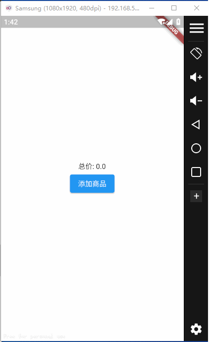

#### Ⅲ、说明

1. 每次点击”添加商品“按钮，总价就会增加 20，我们期望的功能实现了！
2. 可能有些人会疑惑，我们饶了一大圈实现这么简单的功能有意义么？其实，就这个例子来看，只是更新同一个路由页中的一个状态，我们使用 `ChangeNotifierProvider` 的优势并不明显，但是如果我们是做一个购物 APP 呢？
3. 由于购物车数据是通常是会在整个 APP 中共享的，比如会跨路由共享。如果我们将 `ChangeNotifierProvider` 放在整个应用的 Widget 树的根上，那么整个 APP 就可以共享购物车的数据了，这时 `ChangeNotifierProvider` 的优势将会非常明显。
4. 虽然上面的例子比较简单，但它却将 Provider 的原理和流程体现的很清楚，下图是 Provider 的原理图：


5. Model 变化后会自动通知 `ChangeNotifierProvider`（订阅者），`ChangeNotifierProvider` 内部会重新构建 `InheritedWidget`，而依赖该 `InheritedWidget` 的子孙 Widget 就会更新。
6. 我们可以发现使用 Provider，将会带来如下收益：
	1. 我们的业务代码更关注数据了，只要更新 Model，则 UI 会自动更新，而不用在状态改变后再去手动调用 `setState()` 来显式更新页面。
	2. 数据改变的消息传递被屏蔽了，我们无需手动去处理状态改变事件的发布和订阅了，这一切都被封装在 Provider 中了。
	3. 在大型复杂应用中，尤其是需要全局共享的状态非常多时，使用 Provider 将会大大简化我们的代码逻辑，降低出错的概率，提高开发效率

### ③、优化

- 我们上面实现的 `ChangeNotifierProvider` 有两个明显缺点：代码组织问题和性能问题，下面我们一一讨论

#### Ⅰ、代码组织问题

1. 我们先看一下构建显示总价 `Text` 的代码：

```dart
// 显示商品数量文本框
Widget buildQuantityTextField(BuildContext context){
return Builder(builder: (context){
  // 通过 ChangeNotifierProvider.of 获取到 CartModel 实例，然后获取到商品总价
  var cart = ChangeNotifierProvider.of<CartModel>(context);
  return Text("总价: ${cart.totalPrice}");
});
}
```

2. 这段代码有两点可以优化：
	1. 需要显式调用 `ChangeNotifierProvider.of`，当 APP 内部依赖 CartModel 很多时，这样的代码将很冗余。
	2. 语义不明确；由于 `ChangeNotifierProvider` 是订阅者，那么依赖 CartModel 的 Widget 自然就是订阅者，其实也就是状态的消费者，如果我们用 Builder 来构建，语义就不是很明确；如果我们能使用一个具有明确语义的 Widget，比如就叫 `Consumer`，这样最终的代码语义将会很明确，只要看到 `Consumer`，我们就知道它是依赖某个跨组件或全局的状态。
3. 为了优化这两个问题，我们可以封装一个 `Consumer` Widget，实现如下：

```dart
import 'package:flutter/cupertino.dart';

import '01_2_ChangeNotifierProvider.dart';

// 这是一个便捷类，会获得当前 context 和指定数据类型的 Provider
class Consumer<T> extends StatelessWidget {
  Consumer({
    Key? key,
    required this.builder,
  }) : super(key: key);

  final Widget Function(BuildContext context, T? value) builder;

  @override
  Widget build(BuildContext context) {
    return builder(
      // 将当前的 BuildContext 传递给 builder 函数
      context,
      // 获取指定数据类型 T 的 Provider，并将其传递给 builder 函数
      ChangeNotifierProvider.of<T>(context),
    );
  }
}
```

4. `Consumer` 实现非常简单，它通过指定模板参数，然后再内部自动调用 `ChangeNotifierProvider.of` 获取相应的 Model，并且 `Consumer` 这个名字本身也是具有确切语义（消费者）。现在上面的代码块可以优化为如下这样：

```dart
  // 显示商品数量文本框
  Widget buildQuantityTextField(BuildContext context){
    return Consumer<CartModel>(
      builder: (context, cart) => Text("总价: ${cart?.totalPrice}")
    );
  }
```

#### Ⅱ、性能问题

1. 上面的代码还有一个性能问题，就在构建”添加按钮“的代码处：

```dart
// 添加商品按钮
Widget buildAddProductButton(BuildContext context){
return Builder(builder: (context){
  // 构建时输出日志，在后面优化部分会用到
  print("ElevatedButton build");
  return ElevatedButton(
	child: const Text("添加商品"),
	onPressed: () {
	  // 给购物车中添加商品，添加后总价会更新
	  ChangeNotifierProvider.of<CartModel>(context).add(Item(20.0, 1));
	},
  );
});

}
```

2. 我们点击”添加商品“按钮后，由于购物车商品总价会变化，所以显示总价的 Text 更新是符合预期的，但是”添加商品“按钮本身没有变化，是不应该被重新 build 的。
3. 但是我们运行示例，每次点击”添加商品“按钮，控制台都会输出 `ElevatedButton build` 日志，也就是说”添加商品“按钮在每次点击时其自身都会重新 build
4. 这是为什么呢？如果你已经理解了 `InheritedWidget` 的更新机制，那么答案一眼就能看出：这是因为构建 `ElevatedButton` 的 `Builder` 中调用了 `ChangeNotifierProvider.of`，也就是说依赖了 Widget 树上面的 `InheritedWidget`（即 `InheritedProvider` ）Widget，所以当添加完商品后，`CartModel` 发生变化，会通知 `ChangeNotifierProvider`, 而 `ChangeNotifierProvider` 则会重新构建子树，所以 `InheritedProvider` 将会更新，此时依赖它的子孙 Widget 就会被重新构建。
5. 问题的原因搞清楚了，那么我们如何避免这不必要重构呢？既然按钮重新被 build 是因为按钮和 `InheritedWidget` 建立了依赖关系，那么我们只要打破或解除这种依赖关系就可以了。那么如何解除按钮和 `InheritedWidget` 的依赖关系呢？
6. 我们上一节介绍 `InheritedWidget` 时已经讲过了：调用 `dependOnInheritedWidgetOfExactType()` 和  `getElementForInheritedWidgetOfExactType()` 的区别就是前者会注册依赖关系，而后者不会。
7. 所以我们只需要将 `ChangeNotifierProvider.of` 的实现改为下面这样即可：

```dart
/// 定义一个便捷方法，方便子树中的 widget 获取共享数据
/// listen 表示是否建立依赖关系，如果为 true，则会建立依赖关系，否则不会建立依赖关系
static T of<T>(BuildContext context, {bool listen = true}) {
    // 如果 listen 为 true，则会建立依赖关系，否则不会建立依赖关系
    final provider = listen
        ? context.dependOnInheritedWidgetOfExactType<InheritedProvider<T>>()
        : context.getElementForInheritedWidgetOfExactType<InheritedProvider<T>>()?.widget
    as InheritedProvider<T>;

    if (provider == null) {
      // 如果未找到对应的 InheritedProvider，则抛出错误
      throw FlutterError('ChangeNotifierProvider.of() called with a context that does not contain an InheritedProvider<$T> of type $T.');
    }

    // 返回获取到的共享数据
    return provider.data;
}
```

8. 然后我们将调用部分代码改为：

```dart
import 'package:flutter/cupertino.dart';
import 'package:flutter/material.dart';

import '01_2_ChangeNotifierProvider.dart';
import '01_3_Item.dart';
import '01_4_CartModel.dart';
import '01_6_Consumer.dart';

class ProviderRoute extends StatefulWidget {
  const ProviderRoute({Key? key}) : super(key: key);

  @override
  _ProviderRouteState createState() => _ProviderRouteState();
}

class _ProviderRouteState extends State<ProviderRoute> {
  @override
  Widget build(BuildContext context) {
    // Center 组件可以将其子组件树对齐到屏幕中心
    return Center(
      // ChangeNotifierProvider 是一个通用的通知器，它接受一个数据对象，然后将该数据对象放入到 Widget 树中，子树中的任意节点都可以获取该数据对象。
      child: ChangeNotifierProvider<CartModel>(
        // CartModel 是一个 ChangeNotifier，它保存了购物车中商品的状态（比如商品列表、总价等）。
        data: CartModel(),
        /**
         * Builder 是一个回调函数，它接受一个 BuildContext 和一个子 Widget，然后返回一个 Widget。
         * 此处的作用是为了引入作用域，让后面的 RaisedButton 能够获取到该数据对象。
         */
        child: Builder(builder: (context) {
          // Column 可以将其子组件在垂直方向线性排列
          return Column(
            // MainAxisAlignment.center 表示将子组件在垂直方向居中排列
            mainAxisAlignment: MainAxisAlignment.center,
            children: <Widget>[
              // 显示商品数量文本框
              buildQuantityTextField(context),
              // 添加商品按钮
              buildAddProductButton(context),
            ],
          );
        }),
      ),
    );
  }

  // 显示商品数量文本框
  Widget buildQuantityTextField(BuildContext context){
    return Consumer<CartModel>(
      builder: (context, cart) => Text("总价: ${cart?.totalPrice}")
    );
  }

  // 添加商品按钮
  Widget buildAddProductButton(BuildContext context){
    return Builder(builder: (context){
      // 构建时输出日志，在后面优化部分会用到
      print("ElevatedButton build");
      return ElevatedButton(
        child: const Text("添加商品"),
        onPressed: () {
          // 给购物车中添加商品，添加后总价会更新
          ChangeNotifierProvider.of<CartModel>(context, listen: false).add(Item(20.0, 1));
        },
      );
    });
  }

}
```

9. 修改后再次运行上面的示例，我们会发现点击”添加商品“按钮后，控制台不会再输出 `ElevatedButton build` 了，即按钮不会被重新构建了。而总价仍然会更新，这是因为 `Consumer` 中调用 `ChangeNotifierProvider.of` 时 `listen` 值为默认值 `true`，所以还是会建立依赖关系。
10. 至此我们便实现了一个迷你的 `Provider`，它具备 Pub 上 Provider Package 中的核心功能；
11. 但是我们的迷你版功能并不全面，如只实现了一个可监听的 `ChangeNotifierProvider`，并没有实现只用于数据共享的 Provider；
12. 另外，我们的实现有些边界也没有考虑的到，比如如何保证在 Widget 树重新 build 时 Model 始终是单例等。

### ④、其他状态管理包

- 现在 Flutter 社区已经有很多专门用于状态管理的包了，在此我们列出几个相对评分比较高的：

| 包名 | 介绍 |
| ---- | ---- |
|[Provider](https://pub.flutter-io.cn/packages/provider) & [Scoped Model](https://pub.flutter-io.cn/packages/scoped_model) |这两个包都是基于 InheritedWidget 的，原理相似|
|[Redux](https://pub.flutter-io.cn/packages/flutter_redux)|是 Web 开发中 React 生态链中 Redux 包的 Flutter 实现|
|[MobX](https://pub.dev/packages/flutter_mobx)|是 Web 开发中 React 生态链中 MobX 包的 Flutter 实现|
|[BLoC](https://pub.dev/packages/flutter_bloc)|是 BLoC 模式的 Flutter 实现|

## 4、颜色和主题

### ①、颜色

#### Ⅰ、简介

1. 在介绍主题前我们先了解一些 Flutter 中的 Color 类。
2. Color 类中颜色以一个 int 值保存，我们知道显示器颜色是由红、绿、蓝三基色组成，每种颜色占 8 比特，存储结构如下：

| Bit（位） | 颜色            |
| --------- | --------------- |
| 0-7       | 蓝色            |
| 8-15      | 绿色            |
| 16-23     | 红色            |
| 24-31     | Alpha(不透明度) |

3. 上面表格中的字段在 Color 类中都有对应的属性，而 Color 中的众多方法也就是操作这些属性的
4. 此我们主要讨论一下色值如何转换为 Color 对象、颜色亮度以及 MaterialColor。

#### Ⅱ、如何将颜色字符串转成 Color 对象

- 如 Web 开发中的色值通常是一个字符串如 `#dc380d`，它是一个 RGB 值，我们可以通过下面这些方法将其转为 Color 类：

```dart
// 如果颜色固定可以直接使用整数值
Color(0xffdc380d);

// 颜色是一个字符串变量
var c = "dc380d";
// 通过位运算符将 Alpha 设置为 FF
Color(int.parse(c,radix:16)|0xFF000000)
// 通过方法将 Alpha 设置为 FF
Color(int.parse(c,radix:16)).withAlpha(255)
```

#### Ⅲ、颜色亮度

1. 假如，我们要实现一个背景颜色和 Title 可以自定义的导航栏，
	1. 并且背景色为深色时我们应该让 Title 显示为浅色；
	2. 背景色为浅色时，Title 显示为深色。
2. 要实现这个功能，我们就需要来计算背景色的亮度，然后动态来确定 Title 的颜色。
3. Color 类中提供了一个 `computeLuminance()` 方法，它可以返回一个 `0-1` 的一个值，数字越大颜色就越浅，我们可以根据它来动态确定 Title 的颜色，下面是导航栏 NavBar 的简单实现：

```dart
import 'package:flutter/material.dart';

import '05_功能型组件/03_跨组件状态共享/05_ProviderRoute.dart';
import '05_功能型组件/04_颜色和主题/01_NavBar.dart';


// 入口方法
void main() => runApp(const MyApp());

class MyApp extends StatelessWidget {
  const MyApp({Key? key}) : super(key: key);

  @override
  Widget build(BuildContext context) {
    /**
     * MaterialApp 是 Flutter 提供的一个小部件，用于创建一个包含 Material Design 样式和功能的应用程序。
     * 它是一个顶层小部件，用于为整个应用程序提供一致的主题和样式。
     * 在 MaterialApp 中，你可以设置应用程序的标题、主题、路由和其他全局属性
     */
    return const MaterialApp(
      /**
       * home 是 MaterialApp 的一个属性，用于指定应用程序的主页。它接受一个 Widget 作为参数，用于定义主页的内容
       * Scaffold 是一个用于创建基本页面布局的小部件。
       * Scaffold 小部件提供了一个应用程序的基本布局结构，包括顶部的应用栏、底部的导航栏、抽屉菜单等。
       * 它是一个非常常用的小部件，常用于创建具有标准 Material Design 布局的页面
       */
      home: Scaffold(
        // 设置背景颜色为白色
        backgroundColor: Colors.white,
        /**
         * body: 用于定义页面的主要内容区域
         * SafeArea 是一个小部件，作用是为其子部件提供一个安全的区域，来避免遮挡了屏幕的物理部件（如刘海屏或下方的 Home 键）
         */
        body: SafeArea(
          child: Column(
            children: <Widget>[
              // 背景为蓝色，则 title 自动为白色
              NavBar(color: Colors.blue, title: "标题"),
              // 背景为白色，则 title 自动为黑色
              NavBar(color: Colors.white, title: "标题"),
            ],
          )
        )
      )
    );
  }
}
```

```dart
import 'package:flutter/cupertino.dart';
import 'package:flutter/material.dart';

class NavBar extends StatelessWidget {
  // 显示文本
  final String title;
  // 背景颜色
  final Color color;

  const NavBar({Key? key, required this.color, required this.title,}): super(key: key);

  @override
  Widget build(BuildContext context) {
    // Container 是一个多功能的小部件，可以用于设置子部件的大小、位置、装饰、填充等
    return Container(
      /**
       * constraints 是 Container 的一个属性，用于设置 Container 的大小。
       * BoxConstraints 是一个用于设置限制条件的类，它可以给子部件设置最大宽度、最小宽度、最大高度、最小高度等限制条件。
       */
      constraints: const BoxConstraints(
        // 宽度尽可能大
        minWidth: double.infinity,
        minHeight: 52,
      ),
      /**
       * decoration 是 Container 的一个属性，用于设置 Container 的装饰，如背景色、边框、阴影等。
       * // BoxDecoration 是一个装饰类小部件，它可以在其子小部件之上绘制一个装饰，如背景、边框、渐变等。
       */
      decoration: BoxDecoration(
        // 背景色
        color: color,
        boxShadow: const [
          // 阴影
          BoxShadow(
            color: Colors.black26,
            offset: Offset(0, 3),
            blurRadius: 3,
          ),
        ],
      ),
      // 居中
      alignment: Alignment.center,
      child: Text(
        title,
        style: TextStyle(
          fontWeight: FontWeight.bold,
          // 根据背景色亮度来确定 Title 颜色；亮度 < 0.5 则为白色，否则为黑色
          color: color.computeLuminance() < 0.5 ? Colors.white : Colors.black,
        ),
      ),
    );
  }
}
```

### ②、MaterialColor

1. `MaterialColor` 是实现 Material Design 中的颜色的类，它包含一种颜色的 10 个级别的渐变色。
2. `MaterialColor` 通过 `[]` 运算符的索引值来代表颜色的深度，有效的索引有：`50、100、200、…、900`，数字越大，颜色越深。
3. `MaterialColor` 的默认值为索引等于 500 的颜色。举个例子，`Colors.blue` 是预定义的一个 `MaterialColor` 类对象，定义如下：

```dart
static const MaterialColor blue = MaterialColor(
  _bluePrimaryValue,
  <int, Color>{
     50: Color(0xFFE3F2FD),
    100: Color(0xFFBBDEFB),
    200: Color(0xFF90CAF9),
    300: Color(0xFF64B5F6),
    400: Color(0xFF42A5F5),
    500: Color(_bluePrimaryValue),
    600: Color(0xFF1E88E5),
    700: Color(0xFF1976D2),
    800: Color(0xFF1565C0),
    900: Color(0xFF0D47A1),
  },
);
static const int _bluePrimaryValue = 0xFF2196F3;
```

4. 我们可以根据 shadeXX 来获取具体索引的颜色。`Colors.blue.shade50` 到 `Colors.blue.shade900` 的色值从浅蓝到深蓝渐变，效果如图所示：


### ③、主题（Theme）

1. `Theme` 组件可以为 Material APP 定义主题数据（ThemeData）。
2. Material 组件库里很多组件都使用了主题数据，如导航栏颜色、标题字体、Icon 样式等。
3. `Theme` 内会使用 `InheritedWidget` 来为其子树共享样式数据。

#### Ⅰ、ThemeData

1. `ThemeData` 用于保存是 Material 组件库的主题数据，Material 组件需要遵守相应的设计规范，而这些规范可自定义部分都定义在 `ThemeData` 中了，所以我们可以通过 `ThemeData` 来自定义应用主题。在子组件中，我们可以通过 `Theme.of` 方法来获取当前的 ThemeData。
2. 注意：Material Design 设计规范中有些是不能自定义的，如导航栏高度，`ThemeData` 只包含了可自定义部分。
3. 我们看看 `ThemeData` 部分数据定义：

```dart
ThemeData({
  Brightness? brightness, //深色还是浅色
  MaterialColor? primarySwatch, //主题颜色样本，见下面介绍
  Color? primaryColor, //主色，决定导航栏颜色
  Color? cardColor, //卡片颜色
  Color? dividerColor, //分割线颜色
  ButtonThemeData buttonTheme, //按钮主题
  Color dialogBackgroundColor,//对话框背景颜色
  String fontFamily, //文字字体
  TextTheme textTheme,// 字体主题，包括标题、body等文字样式
  IconThemeData iconTheme, // Icon的默认样式
  TargetPlatform platform, //指定平台，应用特定平台控件风格
  ColorScheme? colorScheme,
  ...
})
```

4. 上面只是 `ThemeData` 的一小部分属性，完整的数据定义可以查看SDK。
5. 上面属性中需要说明的是 `primarySwatch`，它是主题颜色的一个"样本色"，通过这个样本色可以在一些条件下生成一些其他的属性
6. 例如，如果没有指定 `primaryColor`，并且当前主题不是深色主题，那么 `primaryColor` 就会默认为 `primarySwatch` 指定的颜色，还有一些相似的属性如 `indicatorColor` 也会受 `primarySwatch` 影响

#### Ⅱ、实例

1. 我们实现一个路由换肤功能：

```dart
import 'package:flutter/cupertino.dart';
import 'package:flutter/material.dart';

class ThemeTestRoute extends StatefulWidget {
  const ThemeTestRoute({super.key});

  @override
  _ThemeTestRouteState createState() => _ThemeTestRouteState();
}

class _ThemeTestRouteState extends State<ThemeTestRoute> {
  // 当前路由主题色
  var _themeColor = Colors.teal;

  @override
  Widget build(BuildContext context) {
    // 获取主题
    ThemeData themeData = Theme.of(context);

    // Theme 是 Flutter 提供的一个小部件，用于设置应用程序主题。
    return Theme(
      // data 属性用于设置当前路由主题色，如果不设置，则使用上层主题；ThemeData 是一个主题数据类，它包含了应用程序主题的所有属性。
      data: ThemeData(
        // 用于导航栏、FloatingActionButton 的背景色等
        primarySwatch: _themeColor,
        // 用于 Icon 颜色
        iconTheme: IconThemeData(color: _themeColor)
      ),
      /**
       * Scaffold 是一个用于创建基本页面布局的小部件。
       * Scaffold 小部件提供了一个应用程序的基本布局结构，包括顶部的应用栏、底部的导航栏、抽屉菜单等。
       * 它是一个非常常用的小部件，常用于创建具有标准 Material Design 布局的页面
       */
      child: Scaffold(
        // appBar 是 Scaffold 的一个属性，用于设置应用程序顶部的导航栏。
        appBar: AppBar(title: const Text("主题测试")),
        /**
         * body 是 Scaffold 的一个属性，用于定义页面的主要内容区域
         * Column 是一个小部件，它可以在垂直方向上排列其子部件。
         */
        body: Column(
          // 用于指定子部件在垂直方向上的对齐方式
          mainAxisAlignment: MainAxisAlignment.center,
          children: <Widget>[
            // 第一行 Icon 使用主题中的 iconTheme；不设置则使用默认主题
            const Row(
                mainAxisAlignment: MainAxisAlignment.center,
                children: <Widget>[
                  Icon(Icons.favorite),
                  Icon(Icons.airport_shuttle),
                  Text("  颜色跟随主题")
                ]
            ),
            // 为第二行 Icon 自定义颜色（固定为黑色)；设置后，颜色不会跟随主题
            Theme(
              // themeData.copyWith 用于复制当前主题并设置新的值
              data: themeData.copyWith(
                // iconTheme 用于设置 Icon 的主题
                iconTheme: themeData.iconTheme.copyWith(
                  color: Colors.black
                ),
              ),
              child: const Row(
                  mainAxisAlignment: MainAxisAlignment.center,
                  children: <Widget>[
                    Icon(Icons.favorite),
                    Icon(Icons.airport_shuttle),
                    Text("  颜色固定黑色")
                  ]
              ),
            ),
          ],
        ),
        // 点击按钮，切换主题，主题色在蓝色和青色之间切换
        floatingActionButton: FloatingActionButton(
            onPressed: (){
              setState(() =>
                _themeColor = _themeColor == Colors.teal ? Colors.blue : Colors.teal
              );
            },
            child: const Icon(Icons.palette)
        ),
      ),
    );
  }
}
```

2. 运行后点击右下角悬浮按钮则可以切换主题，如图所示：

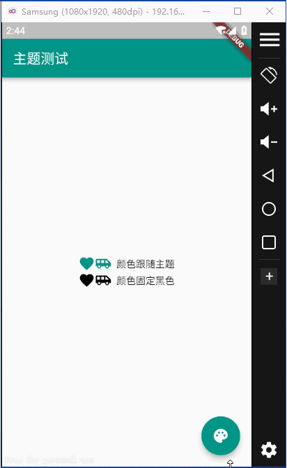

3. 可以通过局部主题覆盖全局主题，正如代码中通过 `Theme` 为第二行图标指定固定颜色（黑色）一样，这是一种常用的技巧，Flutter 中会经常使用这种方法来自定义子树主题。那么为什么局部主题可以覆盖全局主题？这主要是因为 widget 中使用主题样式时是通过 `Theme.of(BuildContext context)` 来获取的，我们看看其简化后的代码：

```dart
static ThemeData of(BuildContext context, { bool shadowThemeOnly = false }) {
   // 简化代码，并非源码  
   return context.dependOnInheritedWidgetOfExactType<_InheritedTheme>().theme.data
}
```

4. `context.dependOnInheritedWidgetOfExactType` 会在 widget 树中从当前位置向上查找第一个类型为 `_InheritedTheme` 的 widget。所以当局部指定 Theme 后，其子树中通过 `Theme.of()` 向上查找到的第一个 `_InheritedTheme` 便是我们指定的 Theme。
5. 本示例是对单个路由换肤，如果想要对整个应用换肤，则可以去修改 MaterialApp 的 `theme` 属性。

## 5、按需rebuild（ValueListenableBuilder）

### ①、ValueListenableBuilder

1. `InheritedWidget` 提供一种在 widget 树中从上到下共享数据的方式，但是也有很多场景数据流向并非从上到下，比如从下到上或者横向等。
2. 为了解决这个问题，Flutter 提供了一个 `ValueListenableBuilder` 组件，它的功能是监听一个数据源，如果数据源发生变化，则会重新执行其 builder，定义如下：

```dart
const ValueListenableBuilder({
  Key? key,
  /**
   * valueListenable：类型为 ValueListenable<T>，表示一个可监听的数据源。
   */
  required this.valueListenable,
  /**
   * builder：数据源发生变化通知时，会重新调用 builder 重新 build 子组件树。
   */
  required this.builder,
  /**
   * child: builder 中每次都会重新构建整个子组件树，
   * 如果子组件树中有一些不变的部分，可以传递给child，child 会作为 builder 的第三个参数传递给 builder，
   * 通过这种方式就可以实现组件缓存，原理和 AnimatedBuilder 第三个 child 相同。
   */
  this.child,
}
```

3. 可以发现 `ValueListenableBuilder` 和数据流向是无关的，只要数据源发生变化它就会重新构建子组件树，因此可以实现任意流向的数据共享。

### ②、实例

1. 我们依然实现一个计数器，记录点击次数：

```dart
import 'package:flutter/material.dart';

import '05_功能型组件/05_按需rebuild（ValueListenableBuilder）/01_ValueListenableBuilder.dart';


// 入口方法
void main() => runApp(const MyApp());

class MyApp extends StatelessWidget {
  const MyApp({Key? key}) : super(key: key);

  @override
  Widget build(BuildContext context) {
    /**
     * MaterialApp 是 Flutter 提供的一个小部件，用于创建一个包含 Material Design 样式和功能的应用程序。
     * 它是一个顶层小部件，用于为整个应用程序提供一致的主题和样式。
     * 在 MaterialApp 中，你可以设置应用程序的标题、主题、路由和其他全局属性
     */
    return const MaterialApp(
      /**
       * home 是 MaterialApp 的一个属性，用于指定应用程序的主页。它接受一个 Widget 作为参数，用于定义主页的内容
       * Scaffold 是一个用于创建基本页面布局的小部件。
       * Scaffold 小部件提供了一个应用程序的基本布局结构，包括顶部的应用栏、底部的导航栏、抽屉菜单等。
       * 它是一个非常常用的小部件，常用于创建具有标准 Material Design 布局的页面
       */
      home: Scaffold(
        // 设置背景颜色为白色
        backgroundColor: Colors.white,
        /**
         * body: 用于定义页面的主要内容区域
         * SafeArea 是一个小部件，作用是为其子部件提供一个安全的区域，来避免遮挡了屏幕的物理部件（如刘海屏或下方的 Home 键）
         */
        body: SafeArea(
          child: ValueListenableRoute()
        )
      )
    );
  }
}
```

```dart
import 'package:flutter/cupertino.dart';
import 'package:flutter/material.dart';

class ValueListenableRoute extends StatefulWidget {
  const ValueListenableRoute({Key? key}) : super(key: key);

  @override
  State<ValueListenableRoute> createState() => _ValueListenableState();
}

class _ValueListenableState extends State<ValueListenableRoute> {
  // 定义一个 ValueNotifier，当数字变化时会通知 ValueListenableBuilder
  final ValueNotifier<int> _counter = ValueNotifier<int>(0);
  // 定义一个缩放比例，用于调整字体大小
  static const double textScaleFactor = 1.5;

  @override
  Widget build(BuildContext context) {
    // 添加 + 按钮不会触发整个 ValueListenableRoute 组件的 build
    print('build');

    /**
     * Scaffold 是一个用于创建基本页面布局的小部件。
     * Scaffold 小部件提供了一个应用程序的基本布局结构，包括顶部的应用栏、底部的导航栏、抽屉菜单等。
     * 它是一个非常常用的小部件，常用于创建具有标准 Material Design 布局的页面
     */
    return Scaffold(
      // appBar 是 Scaffold 的一个属性，用于设置应用程序顶部的导航栏。
      appBar: AppBar(title: const Text('ValueListenableBuilder 测试')),
      /**
       * body: 用于定义页面的主要内容区域
       * Center 是一个小部件，用于将其子部件树对齐到屏幕中心
       */
      body: Center(
        // ValueListenableBuilder 是一个小部件，用于监听 ValueListenable 的变化，并根据变化来构建子部件树。
        child: ValueListenableBuilder<int>(
          builder: (BuildContext context, int value, Widget? child) {
            // builder 方法只会在 _counter 变化时被调用
            return Row(
              mainAxisAlignment: MainAxisAlignment.center,
              children: <Widget>[
                child!,
                Text('$value 次', textScaleFactor: textScaleFactor),
              ],
            );
          },
          // valueListenable 用于指定监听的 ValueListenable, 当 ValueListenable 变化时，builder 方法会被调用
          valueListenable: _counter,
          // 当子组件不依赖变化的数据，且子组件收件开销比较大时，指定 child 属性来缓存子组件非常有用
          child: const Text('点击了 ', textScaleFactor: textScaleFactor),
        ),
      ),
      floatingActionButton: FloatingActionButton(
        child: const Icon(Icons.add),
        // 点击后值 +1，触发 ValueListenableBuilder 重新构建
        onPressed: () => _counter.value += 1,
      ),
    );
  }
}
```

2. 效果：

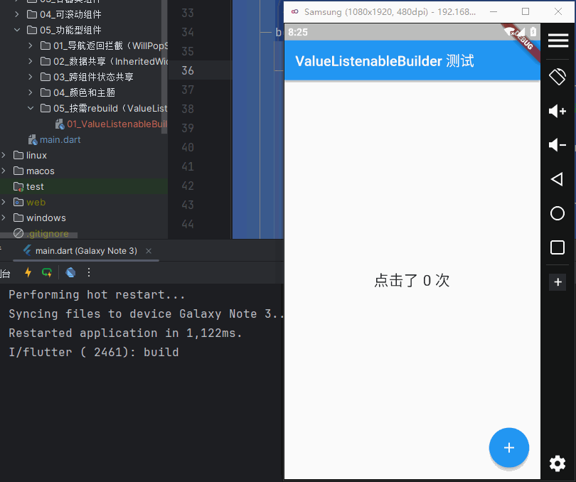

3. 可以看见，功能正常实现了，同时控制台只在页面打开时 build 了一次，点击 + 按钮的时候只是`ValueListenableBuilder` 重新构建了子组件树，而整个页面并没有重新 build ，因此日志面板只打印了一次  build  。
4. 因此尽可能让 `ValueListenableBuilder` 只构建依赖数据源的 `widget`，这样的话可以缩小重新构建的范围，也就是说 `ValueListenableBuilder` 的拆分粒度应该尽可能细。

## 6、异步 UI 更新（FutureBuilder、StreamBuilder）

1. 很多时候我们会依赖一些异步数据来动态更新 UI，比如在打开一个页面时我们需要先从互联网上获取数据，在获取数据的过程中我们显示一个加载框，等获取到数据时我们再渲染页面；
2. 又比如我们想展示 Stream（比如文件流、互联网数据接收流）的进度。
3. 当然，通过 `StatefulWidget` 我们完全可以实现上述这些功能。但由于在实际开发中依赖异步数据更新 UI 的这种场景非常常见，因此 Flutter 专门提供了 `FutureBuilder` 和 `StreamBuilder` 两个组件来快速实现这种功能

### ①、FutureBuilder

#### Ⅰ、介绍

1. `FutureBuilder` 会依赖一个 Future，它会根据所依赖的 Future 的状态来动态构建自身。
2. 我们看一下 FutureBuilder 构造函数：

```dart
FutureBuilder({
  /**
   * future：FutureBuilder 依赖的 Future，通常是一个异步耗时任务。
   */
  this.future,
  /**
   * initialData：初始数据，用户设置默认数据。
   */
  this.initialData,
  /**
   * builder：Widget 构建器；该构建器会在 Future 执行的不同阶段被多次调用，构建器签名如下：
   *    Function (BuildContext context, AsyncSnapshot snapshot)
   * snapshot 会包含当前异步任务的状态信息及结果信息，
   *    比如我们可以通过 snapshot.connectionState 获取异步任务的状态信息、
   *    通过 snapshot.hasError 判断异步任务是否有错误等等，完整的定义可以查看 AsyncSnapshot 类定义。
   */
  required this.builder,
})
```

3. 另外，`FutureBuilder` 的 `builder` 函数签名和 `StreamBuilder` 的 `builder` 是相同的

#### Ⅱ、示例

1. 我们实现一个路由，当该路由打开时我们从网上获取数据，获取数据时弹一个加载框；
2. 获取结束时，如果成功则显示获取到的数据，如果失败则显示错误。
3. 由于我们还没有介绍在 flutter 中如何发起网络请求，所以在这里我们不真正去网络请求数据，而是模拟一下这个过程，隔 2 秒后返回一个字符串：

```dart
import 'package:flutter/material.dart';

import '05_功能型组件/06_异步 UI 更新（FutureBuilder、StreamBuilder）/01_FutureBuilder.dart';


// 入口方法
void main() => runApp(const MyApp());

class MyApp extends StatelessWidget {
  const MyApp({Key? key}) : super(key: key);

  @override
  Widget build(BuildContext context) {
    /**
     * MaterialApp 是 Flutter 提供的一个小部件，用于创建一个包含 Material Design 样式和功能的应用程序。
     * 它是一个顶层小部件，用于为整个应用程序提供一致的主题和样式。
     * 在 MaterialApp 中，你可以设置应用程序的标题、主题、路由和其他全局属性
     */
    return const MaterialApp(
      /**
       * home 是 MaterialApp 的一个属性，用于指定应用程序的主页。它接受一个 Widget 作为参数，用于定义主页的内容
       * Scaffold 是一个用于创建基本页面布局的小部件。
       * Scaffold 小部件提供了一个应用程序的基本布局结构，包括顶部的应用栏、底部的导航栏、抽屉菜单等。
       * 它是一个非常常用的小部件，常用于创建具有标准 Material Design 布局的页面
       */
      home: Scaffold(
        // 设置背景颜色为白色
        backgroundColor: Colors.white,
        /**
         * body: 用于定义页面的主要内容区域
         * SafeArea 是一个小部件，作用是为其子部件提供一个安全的区域，来避免遮挡了屏幕的物理部件（如刘海屏或下方的 Home 键）
         */
        body: SafeArea(
          child: FutureBuilderComponent()
        )
      )
    );
  }
}
```

```dart
import 'package:flutter/material.dart';

class FutureBuilderComponent extends StatefulWidget {
  const FutureBuilderComponent({Key? key}) : super(key: key);

  @override
  _FutureBuilderComponentState createState() => _FutureBuilderComponentState();
}

class _FutureBuilderComponentState extends State<FutureBuilderComponent> {
  // 刷新次数
  int _num = 1;

  // 构建 UI, context：构建上下文，即当前 Widget 的位置
  @override
  Widget build(BuildContext context) {
    /**
     * Scaffold 是一个用于创建基本页面布局的小部件。
     * Scaffold 小部件提供了一个应用程序的基本布局结构，包括顶部的应用栏、底部的导航栏、抽屉菜单等。
     * 它是一个非常常用的小部件，常用于创建具有标准 Material Design 布局的页面
     */
    return Scaffold(
      /**
       * body: 用于定义页面的主要内容区域
       * Center 是一个小部件，用于将其子部件树对齐到屏幕中心
       */
      body: Center(
        // FutureBuilder 是一个小部件，用于根据异步请求的状态来动态构建 UI
        child: FutureBuilder<List<String>>(
          // future：用于接收一个 Future 对象，表示需要等待的异步任务
          future: _retrieveData(),
          // builder：用于接收一个 AsyncSnapshot 对象，表示对 future 的异步请求的状态快照
          builder: (BuildContext context, AsyncSnapshot<List<String>> snapshot) {
            // 请求已结束
            if (snapshot.connectionState == ConnectionState.done) {
              if (snapshot.hasError) {
                // 请求失败，显示错误
                return Text("Error: ${snapshot.error}");
              } else {
                // 请求成功，显示数据
                return ListView.builder(
                  // itemCount：列表项的数量，如果为 null，则为无限列表
                  itemCount: snapshot.data!.length,
                  // 强制高度为 50.0
                  itemExtent: 50.0,
                  /**
                   * itemBuilder：它是列表项的构建器，类型为 IndexedWidgetBuilder，返回值为一个 widget。
                   * 当列表滚动到具体的 index 位置时，会调用该构建器构建列表项
                   */
                  itemBuilder: (BuildContext context, int index) {
                    return Text(snapshot.data![index]);
                  }
                );
              }
            } else {
              // 请求未结束，显示 loading
              return const CircularProgressIndicator();
            }
          },
        ),
      ),
      /**
       * floatingActionButton：用于定义页面的浮动按钮
       */
      floatingActionButton: FloatingActionButton(
        child: const Icon(Icons.add),
        // 点击按钮后，次数加 1，然后重新构建 UI
        onPressed: () => setState(() {
          _num++;
        }),
      ),
    );
  }

  Future<List<String>> _retrieveData() async {
    // 等待模拟的网络请求完成
    return Future.delayed(const Duration(seconds: 2), (){
      return List.generate(5, (index) => "第 $_num 次刷新、第 ${index + 1} 条数据");
    });
  }

}
```

4. 效果：

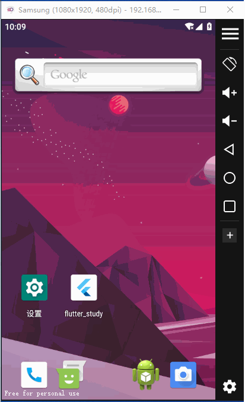

5. 注意：示例的代码中，每次组件重新 build 都会重新发起请求，因为每次的 `future` 都是新的，实践中我们通常会有一些缓存策略，常见的处理方式是在 `future` 成功后将 `future` 缓存，这样下次 build 时，就不会再重新发起异步任务。
6. 上面代码中我们在 builder 中根据当前异步任务状态 `ConnectionState` 来返回不同的 widget。`ConnectionState` 是一个枚举类，定义如下：

```dart
enum ConnectionState {
  /// 当前没有异步任务，比如[FutureBuilder]的[future]为null时
  none,

  /// 异步任务处于等待状态
  waiting,

  /// Stream处于激活状态（流上已经有数据传递了），对于FutureBuilder没有该状态。
  active,

  /// 异步任务已经终止.
  done,
}
```

7. 注意，`ConnectionState.active` 只在 `StreamBuilder` 中才会出现。

### ②、StreamBuilder

#### Ⅰ、介绍

1. 我们知道，在 `Dart` 中 `Stream` 也是用于接收异步事件数据，和 `Future` 不同的是，它可以接收多个异步操作的结果，它常用于会多次读取数据的异步任务场景，如网络内容下载、文件读写等。
2. `StreamBuilder` 正是用于配合 `Stream` 来展示流上事件（数据）变化的 UI 组件。
3. 下面看一下 `StreamBuilder` 的默认构造函数：

```dart
StreamBuilder({
  this.initialData,
  Stream<T> stream,
  required this.builder,
}) 
```

4. 可以看到和 `FutureBuilder` 的构造函数只有一点不同：前者需要一个 `future`，而后者需要一个 `stream`。

#### Ⅱ、示例

1. 我们创建一个计时器的示例：每隔 1 秒，计数加 1。
2. 这里，我们使用 `Stream` 来实现每隔一秒生成一个数字：

```dart
import 'package:flutter/material.dart';

import '05_功能型组件/06_异步 UI 更新（FutureBuilder、StreamBuilder）/02_StreamBuilder.dart';


// 入口方法
void main() => runApp(const MyApp());

class MyApp extends StatelessWidget {
  const MyApp({Key? key}) : super(key: key);

  @override
  Widget build(BuildContext context) {
    /**
     * MaterialApp 是 Flutter 提供的一个小部件，用于创建一个包含 Material Design 样式和功能的应用程序。
     * 它是一个顶层小部件，用于为整个应用程序提供一致的主题和样式。
     * 在 MaterialApp 中，你可以设置应用程序的标题、主题、路由和其他全局属性
     */
    return const MaterialApp(
      /**
       * home 是 MaterialApp 的一个属性，用于指定应用程序的主页。它接受一个 Widget 作为参数，用于定义主页的内容
       * Scaffold 是一个用于创建基本页面布局的小部件。
       * Scaffold 小部件提供了一个应用程序的基本布局结构，包括顶部的应用栏、底部的导航栏、抽屉菜单等。
       * 它是一个非常常用的小部件，常用于创建具有标准 Material Design 布局的页面
       */
      home: Scaffold(
        // 设置背景颜色为白色
        backgroundColor: Colors.white,
        /**
         * body: 用于定义页面的主要内容区域
         * SafeArea 是一个小部件，作用是为其子部件提供一个安全的区域，来避免遮挡了屏幕的物理部件（如刘海屏或下方的 Home 键）
         */
        body: SafeArea(
          child: StreamBuilderComponent()
        )
      )
    );
  }
}
```

```dart
import 'package:flutter/material.dart';

class StreamBuilderComponent extends StatefulWidget {
  const StreamBuilderComponent({Key? key}) : super(key: key);

  @override
  _StreamBuilderComponentState createState() => _StreamBuilderComponentState();
}

class _StreamBuilderComponentState extends State<StreamBuilderComponent> {
  // 构建 UI, context：构建上下文，即当前 Widget 的位置
  @override
  Widget build(BuildContext context) {
    /**
     * StreamBuilder 是一个用于构建异步数据流的小部件。
     * 它提供了一个小部件来订阅数据流，并根据数据流中的数据来构建 UI。
     */
    return StreamBuilder<int>(
      // stream 参数用于接收一个 Stream 对象，用于订阅数据流
      stream: counter(),
      // builder 用于接收一个回调函数，snapshot 参数用于接收数据流中的数据
      builder: (BuildContext context, AsyncSnapshot<int> snapshot){
        // snapshot.hasError 用于判断数据流中是否有错误
        if (snapshot.hasError){
          return Text('Error: ${snapshot.error}');
        }

        switch (snapshot.connectionState) {
          // ConnectionState.none 表示没有 Stream
          case ConnectionState.none:
            return const Text('没有Stream');
          // ConnectionState.waiting 表示正在等待数据
          case ConnectionState.waiting:
            return const Text('等待数据...');
          // ConnectionState.active 表示正在接收数据
          case ConnectionState.active:
            return Text('active: ${snapshot.data}');
          // ConnectionState.done 表示 Stream 已关闭
          case ConnectionState.done:
            return const Text('Stream 已关闭');
        }
      },
    );
  }

  Stream<int> counter() {
    return Stream.periodic(const Duration(seconds: 1), (i) {
      return i;
    });
  }

}
```

3. 效果：


## 7、对话框详解

### ①、使用对话框

1. 对话框本质上也是 UI 布局，通常一个对话框会包含标题、内容，以及一些操作按钮，
2. 为此，Material 库中提供了一些现成的对话框组件来用于快速的构建出一个完整的对话框。

#### Ⅰ、AlertDialog

1. 下面我们主要介绍一下 Material 库中的 `AlertDialog` 组件，它的构造函数定义如下：

```dart
const AlertDialog({
  Key? key,
  this.title, //对话框标题组件
  this.titlePadding, // 标题填充
  this.titleTextStyle, //标题文本样式
  this.content, // 对话框内容组件
  this.contentPadding = const EdgeInsets.fromLTRB(24.0, 20.0, 24.0, 24.0), //内容的填充
  this.contentTextStyle,// 内容文本样式
  this.actions, // 对话框操作按钮组
  this.backgroundColor, // 对话框背景色
  this.elevation,// 对话框的阴影
  this.semanticLabel, //对话框语义化标签(用于读屏软件)
  this.shape, // 对话框外形
})
```

2. 下面我们看一个例子，点击按钮后弹出一个对话框：

```dart
import 'package:flutter/material.dart';

import '05_功能型组件/07_对话框详解/01_使用对话框/01_AlertDialog.dart';


// 入口方法
void main() => runApp(const MyApp());

class MyApp extends StatelessWidget {
  const MyApp({Key? key}) : super(key: key);

  @override
  Widget build(BuildContext context) {
    /**
     * MaterialApp 是 Flutter 提供的一个小部件，用于创建一个包含 Material Design 样式和功能的应用程序。
     * 它是一个顶层小部件，用于为整个应用程序提供一致的主题和样式。
     * 在 MaterialApp 中，你可以设置应用程序的标题、主题、路由和其他全局属性
     */
    return const MaterialApp(
      /**
       * home 是 MaterialApp 的一个属性，用于指定应用程序的主页。它接受一个 Widget 作为参数，用于定义主页的内容
       * Scaffold 是一个用于创建基本页面布局的小部件。
       * Scaffold 小部件提供了一个应用程序的基本布局结构，包括顶部的应用栏、底部的导航栏、抽屉菜单等。
       * 它是一个非常常用的小部件，常用于创建具有标准 Material Design 布局的页面
       */
      home: Scaffold(
        // 设置背景颜色为白色
        backgroundColor: Colors.white,
        /**
         * body: 用于定义页面的主要内容区域
         * SafeArea 是一个小部件，作用是为其子部件提供一个安全的区域，来避免遮挡了屏幕的物理部件（如刘海屏或下方的 Home 键）
         */
        body: SafeArea(
          child: AlertDialogComponent()
        )
      )
    );
  }
}
```

```dart
import 'package:flutter/material.dart';

class AlertDialogComponent extends StatefulWidget {
  const AlertDialogComponent({Key? key}) : super(key: key);

  @override
  _AlertDialogComponentState createState() => _AlertDialogComponentState();
}

class _AlertDialogComponentState extends State<AlertDialogComponent> {
  // 构建 UI, context：构建上下文，即当前 Widget 的位置
  @override
  Widget build(BuildContext context) {
    // Center 是一个用于将其子部件树对齐到屏幕中心的小部件
    return Center(
      // Column 是一个用于在垂直方向上排列其子部件的小部件
      child: Column(
        // mainAxisAlignment: MainAxisAlignment.center：将子部件树在垂直方向上对齐到屏幕中心
        mainAxisAlignment: MainAxisAlignment.center,
        children: [
          // 调用方法，构建 ElevatedButton；dialog：弹出对话框的方法
          buildElevatedButton(showConfirmDialog),
        ],
      ),
    );
  }

  // 构建 ElevatedButton；dialog：弹出对话框的方法
  Widget buildElevatedButton(Future<bool?> Function() dialog){
    return ElevatedButton(
      child: const Text("显示 AlertDialog 对话框"),
      onPressed: () async {
        // 弹出对话框并等待其关闭，接收对话框关闭时的返回数据
        bool? result = await dialog();
        if (result == null) {
          print("点击了取消");
        } else {
          print("点击了确定");
        }
      },
    );
  }

  // 弹出对话框
  Future<bool?> showConfirmDialog() {
    // showDialog 是一个用于显示对话框的方法
    return showDialog<bool>(
      // context：构建上下文，即当前 Widget 的位置
      context: context,
      // builder 是一个回调函数，返回一个 Widget
      builder: (context) {
        // AlertDialog 是一个用于显示对话框的小部件
        return AlertDialog(
          title: const Text("提示"),
          content: const Text("请点击确认按钮进行确认\n请点击取消按钮进行取消"),
          // actions 是一个 Widget 列表，用于显示对话框的按钮；通常用于放置“取消”和“确认”按钮
          actions: <Widget>[
            TextButton(
              child: const Text("取消"),
              // 关闭对话框并返回 null
              onPressed: () => Navigator.of(context).pop(),
            ),
            TextButton(
              child: const Text("确认"),
              // 关闭对话框并返回 true
              onPressed: () => Navigator.of(context).pop(true)
            ),
          ],
        );
      },
    );
  }

}
```

3. 效果：

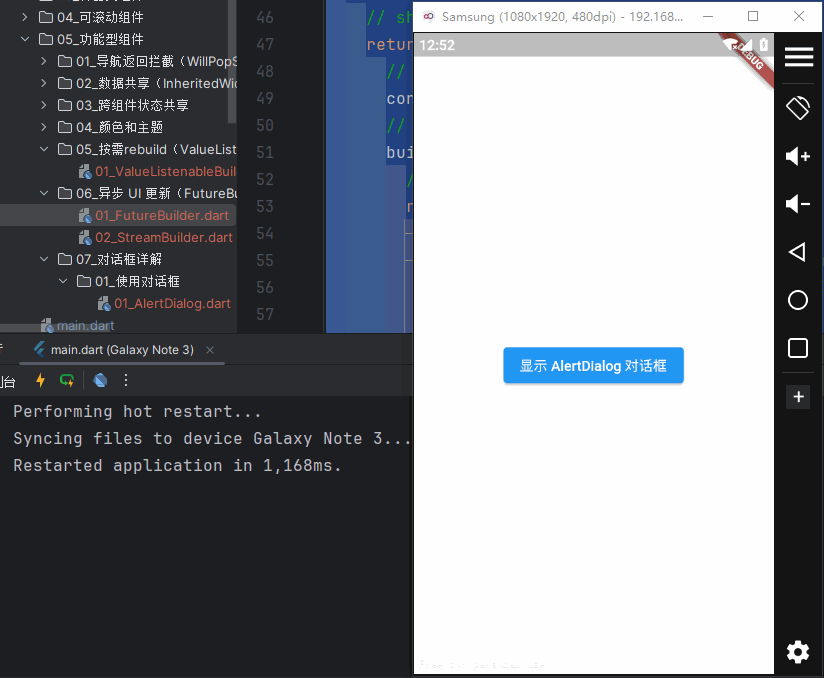

4. 示例运行后，我们点击对话框“取消”按钮或遮罩，控制台就会输出"点击了取消"，如果点击“确定”按钮，控制台就会输出"点击了确定"。
5. 注意：如果 `AlertDialog` 的内容过长，内容将会溢出，这在很多时候可能不是我们期望的，所以如果对话框内容过长时，可以用 `SingleChildScrollView` 将内容包裹起来。

#### Ⅱ、SimpleDialog

1. `SimpleDialog` 也是 Material 组件库提供的对话框，它会展示一个列表，用于列表选择的场景。
2. 下面是一个示例：

```dart
import 'package:flutter/material.dart';

import '05_功能型组件/07_对话框详解/01_使用对话框/01_AlertDialog.dart';
import '05_功能型组件/07_对话框详解/01_使用对话框/02_SimpleDialog.dart';


// 入口方法
void main() => runApp(const MyApp());

class MyApp extends StatelessWidget {
  const MyApp({Key? key}) : super(key: key);

  @override
  Widget build(BuildContext context) {
    /**
     * MaterialApp 是 Flutter 提供的一个小部件，用于创建一个包含 Material Design 样式和功能的应用程序。
     * 它是一个顶层小部件，用于为整个应用程序提供一致的主题和样式。
     * 在 MaterialApp 中，你可以设置应用程序的标题、主题、路由和其他全局属性
     */
    return const MaterialApp(
      /**
       * home 是 MaterialApp 的一个属性，用于指定应用程序的主页。它接受一个 Widget 作为参数，用于定义主页的内容
       * Scaffold 是一个用于创建基本页面布局的小部件。
       * Scaffold 小部件提供了一个应用程序的基本布局结构，包括顶部的应用栏、底部的导航栏、抽屉菜单等。
       * 它是一个非常常用的小部件，常用于创建具有标准 Material Design 布局的页面
       */
      home: Scaffold(
        // 设置背景颜色为白色
        backgroundColor: Colors.white,
        /**
         * body: 用于定义页面的主要内容区域
         * SafeArea 是一个小部件，作用是为其子部件提供一个安全的区域，来避免遮挡了屏幕的物理部件（如刘海屏或下方的 Home 键）
         */
        body: SafeArea(
          child: SimpleDialogComponent()
        )
      )
    );
  }
}
```

```dart
import 'package:flutter/material.dart';

class SimpleDialogComponent extends StatefulWidget {
  const SimpleDialogComponent({Key? key}) : super(key: key);

  @override
  _SimpleDialogComponentState createState() => _SimpleDialogComponentState();
}

class _SimpleDialogComponentState extends State<SimpleDialogComponent> {
  // 构建 UI, context：构建上下文，即当前 Widget 的位置
  @override
  Widget build(BuildContext context) {
    // Center 是一个用于将其子部件树对齐到屏幕中心的小部件
    return Center(
      // Column 是一个用于在垂直方向上排列其子部件的小部件
      child: Column(
        // mainAxisAlignment: MainAxisAlignment.center：将子部件树在垂直方向上对齐到屏幕中心
        mainAxisAlignment: MainAxisAlignment.center,
        children: [
          // 调用方法，构建 ElevatedButton；dialog：弹出对话框的方法
          buildElevatedButton(showSimpleDialog),
        ],
      ),
    );
  }

  // 构建 ElevatedButton；dialog：弹出对话框的方法
  Widget buildElevatedButton(Future<int?> Function() dialog){
    return ElevatedButton(
      child: const Text("显示 SimpleDialog 对话框"),
      onPressed: () async {
        // 弹出对话框并等待其关闭，接收对话框关闭时的返回数据
        int? result = await dialog();
        switch(result){
          case 1:
            print("选择了中文");
            break;
          case 2:
            print("选择了英语");
            break;
          case 3:
            print("选择了日语");
            break;
        }
      },
    );
  }

  // 弹出对话框
  Future<int?> showSimpleDialog() {
    // showDialog 是一个用于显示对话框的方法
    return showDialog<int>(
      // context：构建上下文，即当前 Widget 的位置
      context: context,
      // builder 是一个回调函数，返回一个 Widget
      builder: (context) {
        // AlertDialog 是一个用于显示对话框的小部件
        return SimpleDialog(
          title: const Text("请选择语言"),
          children: [
            SimpleDialogOption(
              child: const Text("中文"),
              // 关闭对话框并返回 1
              onPressed: () => Navigator.of(context).pop(1)
            ),
            SimpleDialogOption(
              child: const Text("英语"),
              // 关闭对话框并返回 2
              onPressed: () => Navigator.of(context).pop(2)
            ),
            SimpleDialogOption(
              child: const Text("日语"),
              // 关闭对话框并返回 3
              onPressed: () => Navigator.of(context).pop(3)
            ),
          ],
        );
      },
    );
  }

}
```

3. 效果：

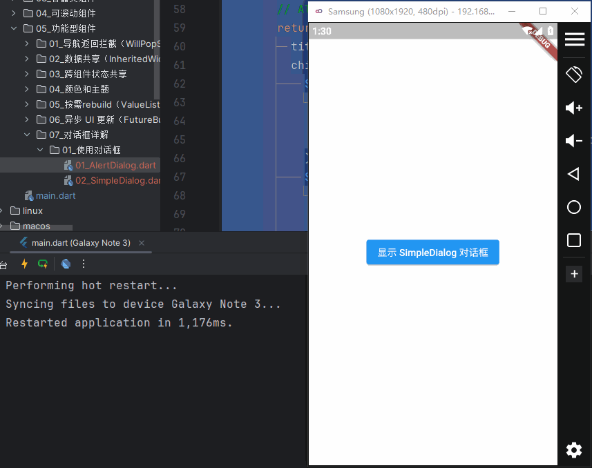

4. 列表项组件我们使用了 `SimpleDialogOption` 组件来包装了一下，它相当于一个 `TextButton`，只不过按钮文案是左对齐的，并且 `padding` 较小

#### Ⅲ、Dialog

1. 实际上 `AlertDialog` 和 `SimpleDialog` 都使用了 `Dialog` 类。
2. 由于 `AlertDialog` 和 `SimpleDialog` 中使用了 `IntrinsicWidth` 来尝试通过子组件的实际尺寸来调整自身尺寸，这就导致他们的子组件不能是延迟加载模型的组件（如 `ListView`、`GridView` 、 `CustomScrollView` 等），如下面的代码运行后会报错。

```dart
AlertDialog(
  content: ListView(
    children: ... //省略
  ),
);
```

3. 如果我们就是需要嵌套一个 `ListView` 应该怎么做？这时，我们可以直接使用 `Dialog` 类，如：

```dart
Dialog(
  child: ListView(
    children: ... //省略
  ),
);
```

4. 下面我们看一个弹出一个有 30 个列表项的对话框示例：

```dart
import 'package:flutter/material.dart';

import '05_功能型组件/07_对话框详解/01_使用对话框/03_Dialog.dart';


// 入口方法
void main() => runApp(const MyApp());

class MyApp extends StatelessWidget {
  const MyApp({Key? key}) : super(key: key);

  @override
  Widget build(BuildContext context) {
    /**
     * MaterialApp 是 Flutter 提供的一个小部件，用于创建一个包含 Material Design 样式和功能的应用程序。
     * 它是一个顶层小部件，用于为整个应用程序提供一致的主题和样式。
     * 在 MaterialApp 中，你可以设置应用程序的标题、主题、路由和其他全局属性
     */
    return const MaterialApp(
      /**
       * home 是 MaterialApp 的一个属性，用于指定应用程序的主页。它接受一个 Widget 作为参数，用于定义主页的内容
       * Scaffold 是一个用于创建基本页面布局的小部件。
       * Scaffold 小部件提供了一个应用程序的基本布局结构，包括顶部的应用栏、底部的导航栏、抽屉菜单等。
       * 它是一个非常常用的小部件，常用于创建具有标准 Material Design 布局的页面
       */
      home: Scaffold(
        // 设置背景颜色为白色
        backgroundColor: Colors.white,
        /**
         * body: 用于定义页面的主要内容区域
         * SafeArea 是一个小部件，作用是为其子部件提供一个安全的区域，来避免遮挡了屏幕的物理部件（如刘海屏或下方的 Home 键）
         */
        body: SafeArea(
          child: DialogComponent()
        )
      )
    );
  }
}
```

```dart
import 'package:flutter/material.dart';

class DialogComponent extends StatefulWidget {
  const DialogComponent({Key? key}) : super(key: key);

  @override
  _DialogComponentState createState() => _DialogComponentState();
}

class _DialogComponentState extends State<DialogComponent> {
  // 构建 UI, context：构建上下文，即当前 Widget 的位置
  @override
  Widget build(BuildContext context) {
    // Center 是一个用于将其子部件树对齐到屏幕中心的小部件
    return Center(
      child: buildElevatedButton(showListDialog),
    );
  }

  // 构建 ElevatedButton；dialog：弹出对话框的方法
  Widget buildElevatedButton(Future<int?> Function() dialog){
    return ElevatedButton(
      child: const Text("显示 List Dialog 对话框"),
      onPressed: () async {
        // 弹出对话框并等待其关闭，接收对话框关闭时的返回数据
        int? result = await dialog();
        if(result == null){
          print('未选择选项');
        }else {
          print('点击了对话框列表的第 $result 个选项');
        }
      },
    );
  }

  // 弹出对话框
  Future<int?> showListDialog() {
    // showDialog 是一个用于显示对话框的方法
    return showDialog<int>(
      // context：构建上下文，即当前 Widget 的位置
      context: context,
      // builder 是一个回调函数，返回一个 Widget
      builder: (context) {
        return Dialog(
          child: buildListDialog(),
        );
      },
    );
  }

  Widget buildListDialog(){
    // Column 是一个用于在垂直方向上排列其子部件的小部件
    return Column(
        children: [
          // ListTile 是一个用于在列表中显示一个固定样式的行的小部件
          const ListTile(title: Text("请选择")),
          // Expanded 是一个可以用来包裹子 Widget 的小部件，它会将子 Widget 沿着父部件的垂直方向拉伸并填充满父部件
          Expanded(
            // Scrollbar 是一个小部件，用于为可滚动的子部件添加滚动条
            child: Scrollbar(
              // ListView 是一个用于显示列表的小部件
              child: ListView.builder(
                // itemCount：列表项的数量
                itemCount: 30,
                /**
                 * itemBuilder 是一个回调函数，它用于构建 ListView.builder 中的每个列表项。
                 * 当 ListView.builder 需要构建一个新的列表项时，它会调用 itemBuilder 函数，并传入当前的 BuildContext 和列表项的索引 index
                 */
                itemBuilder: (BuildContext context, int index) {
                  return ListTile(
                    title: Text("$index"),
                    // onTap：点击事件，点击后关闭对话框并返回当前列表项的索引 index
                    onTap: () => Navigator.of(context).pop(index),
                  );
                },
              ),
            )

          ),
        ],
      );
  }

}
```

5. 运行效果如图所示：

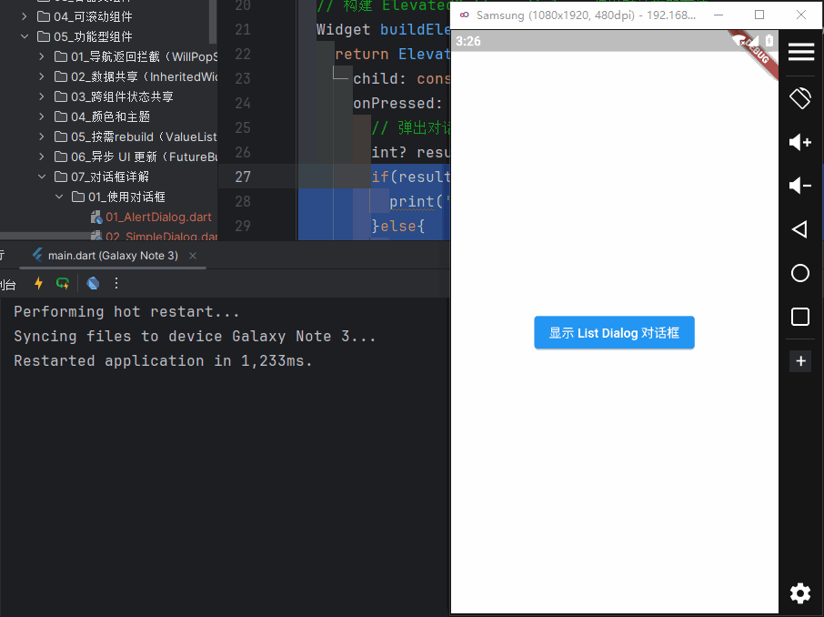

### ②、对话框打开动画及遮罩

1. 我们可以把对话框分为内部样式和外部样式两部分。
2. 内部样式指对话框中显示的具体内容，这部分内容我们已经在上面介绍过了；外部样式包含对话框遮罩样式、打开动画等，本节主要介绍如何自定义这些外部样式。
3. 关于动画相关内容我们将在本书第九章中详细介绍，下面内容可以先了解一下（不必深究），可以在学习完动画相关内容后再回头来看。
4. 我们已经介绍过了 `showDialog` 方法，它是 Material 组件库中提供的一个打开 Material 风格对话框的方法。那如何打开一个普通风格的对话框呢（非 Material 风格）？ Flutter 提供了一个 `showGeneralDialog` 方法，签名如下：

```dart
Future<T?> showGeneralDialog<T>({
  required BuildContext context,
  required RoutePageBuilder pageBuilder, //构建对话框内部UI
  bool barrierDismissible = false, //点击遮罩是否关闭对话框
  String? barrierLabel, // 语义化标签(用于读屏软件)
  Color barrierColor = const Color(0x80000000), // 遮罩颜色
  Duration transitionDuration = const Duration(milliseconds: 200), // 对话框打开/关闭的动画时长
  RouteTransitionsBuilder? transitionBuilder, // 对话框打开/关闭的动画
  ...
})
```

5. 实际上，`showDialog` 方法正是 `showGeneralDialog` 的一个封装，定制了 Material 风格对话框的遮罩颜色和动画。Material 风格对话框打开/关闭动画是一个 Fade（渐隐渐显）动画，如果我们想使用一个缩放动画就可以通过 `transitionBuilder` 来自定义。
6. 下面我们自己封装一个 `showCustomDialog` 方法，它定制的对话框动画为缩放动画，并同时制定遮罩颜色为 `Colors.black87`：
7. `mian` 主方法

```dart
import 'package:flutter/material.dart';

import '05_功能型组件/07_对话框详解/02_对话框打开动画及遮罩/02_CustomDialogView.dart';


// 入口方法
void main() => runApp(const MyApp());

class MyApp extends StatelessWidget {
  const MyApp({Key? key}) : super(key: key);

  @override
  Widget build(BuildContext context) {
    /**
     * MaterialApp 是 Flutter 提供的一个小部件，用于创建一个包含 Material Design 样式和功能的应用程序。
     * 它是一个顶层小部件，用于为整个应用程序提供一致的主题和样式。
     * 在 MaterialApp 中，你可以设置应用程序的标题、主题、路由和其他全局属性
     */
    return const MaterialApp(
      /**
       * home 是 MaterialApp 的一个属性，用于指定应用程序的主页。它接受一个 Widget 作为参数，用于定义主页的内容
       * Scaffold 是一个用于创建基本页面布局的小部件。
       * Scaffold 小部件提供了一个应用程序的基本布局结构，包括顶部的应用栏、底部的导航栏、抽屉菜单等。
       * 它是一个非常常用的小部件，常用于创建具有标准 Material Design 布局的页面
       */
      home: Scaffold(
        // 设置背景颜色为白色
        backgroundColor: Colors.white,
        /**
         * body: 用于定义页面的主要内容区域
         * SafeArea 是一个小部件，作用是为其子部件提供一个安全的区域，来避免遮挡了屏幕的物理部件（如刘海屏或下方的 Home 键）
         */
        body: SafeArea(
          child: CustomDialogViewComponent()
        )
      )
    );
  }
}
```

8. `01_CustomDialog.dart` 自定义对话框打开动画及遮罩类

```dart
import 'package:flutter/material.dart';

// 自定义对话框打开动画及遮罩类
class CustomDialog {

  // 自定义对话框打开动画及遮罩方法
  Future<T?> showCustomDialog<T>({
    // context 是一个 BuildContext，表示当前 Widget 的位置
    required BuildContext context,
    // barrierDismissible：点击遮罩是否关闭对话框
    bool barrierDismissible = true,
    // builder 是一个回调函数，返回一个 Widget
    required WidgetBuilder builder,
    // theme：对话框使用的主题
    ThemeData? theme,
  }) {
    // 如果没有传入 theme，则使用默认的主题
    theme = theme ?? Theme.of(context);
    // showGeneralDialog 是一个用于显示对话框的方法
    return showGeneralDialog(
      // context：构建上下文，即当前 Widget 的位置
      context: context,
      /**
       * pageBuilder 是一个回调函数，返回一个 Widget
       * 该回调函数接收三个参数：
       * 1、BuildContext：构建上下文，即当前 Widget 的位置
       * 2、Animation<double>：动画对象，用于控制对话框的动画
       * 3、Animation<double>：动画对象，用于控制对话框打开时遮罩的动画
       */
      pageBuilder: (BuildContext buildContext, Animation<double> animation, Animation<double> secondaryAnimation) {
        final Widget pageChild = Builder(builder: builder);
        // SafeArea 是一个小部件，作用是为其子部件提供一个安全的区域，来避免遮挡了屏幕的物理部件（如刘海屏或下方的 Home 键）
        return SafeArea(
          child: Builder(builder: (BuildContext context) {
            return theme != null ? Theme(data: theme, child: pageChild): pageChild;
          }),
        );
      },
      // barrierDismissible 表示点击遮罩是否关闭对话框
      barrierDismissible: barrierDismissible,
      // barrierLabel：遮罩的语义化标签，用于向屏幕阅读器传递语义信息
      barrierLabel: MaterialLocalizations.of(context).modalBarrierDismissLabel,
      // barrierColor：遮罩的颜色
      barrierColor: Colors.black87,
      // transitionDuration：对话框打开/关闭的动画时长
      transitionDuration: const Duration(milliseconds: 150),
      // transitionBuilder：对话框打开/关闭的动画
      transitionBuilder: _buildMaterialDialogTransitions,
    );
  }

  // 对话框打开/关闭的动画
  Widget _buildMaterialDialogTransitions(
    // context：构建上下文，即当前 Widget 的位置
    BuildContext context,
    // animation：动画对象，用于控制对话框的动画
    Animation<double> animation,
    // secondaryAnimation：动画对象，用于控制对话框打开时遮罩的动画
    Animation<double> secondaryAnimation,
    Widget child
  ) {
    // 使用缩放动画
    return ScaleTransition(
      // 动画对象，用于控制对话框的动画；CurvedAnimation：动画曲线，用于控制动画的执行速度
      scale: CurvedAnimation(
        // 父动画，即对话框打开/关闭的动画
        parent: animation,
        // 动画曲线，用于控制动画的执行速度；Curves.easeOut：快出慢进，动画结束时减速
        curve: Curves.easeOut,
      ),
      child: child,
    );
  }
}
```

9. `02_CustomDialogView.dart` 使用自定义对话框打开动画及遮罩类

```dart
import 'package:flutter/material.dart';

import '01_CustomDialog.dart';

class CustomDialogViewComponent extends StatefulWidget {
  const CustomDialogViewComponent({Key? key}) : super(key: key);

  @override
  _CustomDialogViewComponentState createState() => _CustomDialogViewComponentState();
}

class _CustomDialogViewComponentState extends State<CustomDialogViewComponent> {
  // 构建 UI, context：构建上下文，即当前 Widget 的位置
  @override
  Widget build(BuildContext context) {
    // Center 是一个用于将其子部件树对齐到屏幕中心的小部件
    return Center(
      // Column 是一个用于在垂直方向上排列其子部件的小部件
      child: Column(
        // mainAxisAlignment: MainAxisAlignment.center：将子部件树在垂直方向上对齐到屏幕中心
        mainAxisAlignment: MainAxisAlignment.center,
        children: [
          // 调用方法，构建 ElevatedButton；dialog：弹出对话框的方法
          buildElevatedButton(showConfirmDialog),
        ],
      ),
    );
  }

  // 构建 ElevatedButton；dialog：弹出对话框的方法
  Widget buildElevatedButton(Future<bool?> Function() dialog){
    return ElevatedButton(
      child: const Text("显示 自定义 对话框"),
      onPressed: () async {
        // 弹出对话框并等待其关闭，接收对话框关闭时的返回数据
        bool? result = await dialog();
        if (result == null) {
          print("点击了取消");
        } else {
          print("点击了确定");
        }
      },
    );
  }

  // 弹出对话框
  Future<bool?> showConfirmDialog() {
    // showDialog 是一个用于显示对话框的方法
    return CustomDialog().showCustomDialog<bool>(
      // context：构建上下文，即当前 Widget 的位置
      context: context,
      // builder 是一个回调函数，返回一个 Widget
      builder: (context) {
        // AlertDialog 是一个用于显示对话框的小部件
        return AlertDialog(
          title: const Text("提示"),
          content: const Text("请点击确认按钮进行确认\n请点击取消按钮进行取消"),
          // actions 是一个 Widget 列表，用于显示对话框的按钮；通常用于放置“取消”和“确认”按钮
          actions: <Widget>[
            TextButton(
              child: const Text("取消"),
              // 关闭对话框并返回 null
              onPressed: () => Navigator.of(context).pop(),
            ),
            TextButton(
                child: const Text("确认"),
                // 关闭对话框并返回 true
                onPressed: () => Navigator.of(context).pop(true)
            ),
          ],
        );
      },
    );
  }

}
```

10. 效果：

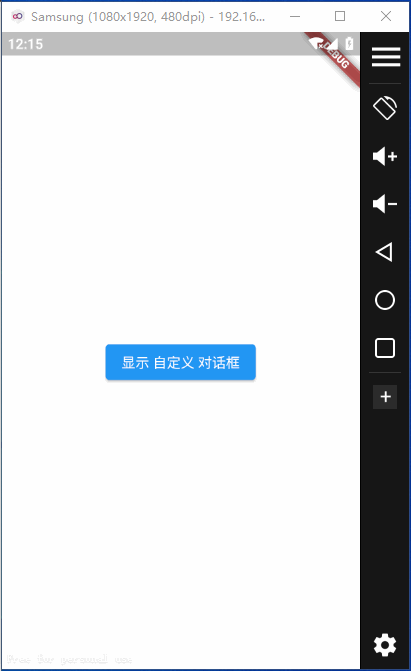

### ③、对话框实现原理

1. 我们以 `showGeneralDialog` 方法为例来看看它的具体实现：

```dart
Future<T?> showGeneralDialog<T extends Object?>({
  required BuildContext context,
  required RoutePageBuilder pageBuilder,
  bool barrierDismissible = false,
  String? barrierLabel,
  Color barrierColor = const Color(0x80000000),
  Duration transitionDuration = const Duration(milliseconds: 200),
  RouteTransitionsBuilder? transitionBuilder,
  bool useRootNavigator = true,
  RouteSettings? routeSettings,
}) {
  return Navigator.of(context, rootNavigator: useRootNavigator).push<T>(RawDialogRoute<T>(
    pageBuilder: pageBuilder,
    barrierDismissible: barrierDismissible,
    barrierLabel: barrierLabel,
    barrierColor: barrierColor,
    transitionDuration: transitionDuration,
    transitionBuilder: transitionBuilder,
    settings: routeSettings,
  ));
}
```

2. 实现很简单，直接调用 `Navigator` 的 `push` 方法打开了一个新的对话框路由 `RawDialogRoute`，然后返回了 `push` 的返回值。
3. 可见对话框实际上正是通过路由的形式实现的，这也是为什么我们可以使用 `Navigator` 的 `pop` 方法来退出对话框的原因。

### ④、对话框状态管理

#### Ⅰ、问题引出

1. 我们在用户选择删除一个文件时，会询问是否删除此文件；在用户选择一个文件夹是，应该再让用户确认是否删除子文件夹。
2. 为了在用户选择了文件夹时避免二次弹窗确认是否删除子目录，我们在确认对话框底部添加一个“同时删除子目录？”的复选框，如图所示：


3. 现在就有一个问题：如何管理复选框的选中状态？习惯上，我们会在路由页的 `State` 中来管理选中状态，我们可能会写出如下这样的代码：

```dart
class _DialogRouteState extends State<DialogRoute> {
  bool withTree = false; // 复选框选中状态

  @override
  Widget build(BuildContext context) {
    return Column(
      children: <Widget>[
        ElevatedButton(
          child: Text("对话框2"),
          onPressed: () async {
            bool? delete = await showDeleteConfirmDialog2();
            if (delete == null) {
              print("取消删除");
            } else {
              print("同时删除子目录: $delete");
            }
          },
        ),
      ],
    );
  }

  Future<bool?> showDeleteConfirmDialog2() {
    withTree = false; // 默认复选框不选中
    return showDialog<bool>(
      context: context,
      builder: (context) {
        return AlertDialog(
          title: Text("提示"),
          content: Column(
            crossAxisAlignment: CrossAxisAlignment.start,
            mainAxisSize: MainAxisSize.min,
            children: <Widget>[
              Text("您确定要删除当前文件吗?"),
              Row(
                children: <Widget>[
                  Text("同时删除子目录？"),
                  Checkbox(
                    value: withTree,
                    onChanged: (bool value) {
                      //复选框选中状态发生变化时重新构建UI
                      setState(() {
                        //更新复选框状态
                        withTree = !withTree;
                      });
                    },
                  ),
                ],
              ),
            ],
          ),
          actions: <Widget>[
            TextButton(
              child: Text("取消"),
              onPressed: () => Navigator.of(context).pop(),
            ),
            TextButton(
              child: Text("删除"),
              onPressed: () {
                //执行删除操作
                Navigator.of(context).pop(withTree);
              },
            ),
          ],
        );
      },
    );
  }
}
```

4. 然后，当我们运行上面的代码时我们会发现复选框根本选不中！为什么会这样呢？其实原因很简单，我们知道 `setState` 方法只会针对当前 `context` 的子树重新 build，但是我们的对话框并不是在 `_DialogRouteState` 的 `build` 方法中构建的，而是通过 `showDialog` 单独构建的，所以在 `_DialogRouteState` 的 `context` 中调用 `setState` 是无法影响通过 `showDialog` 构建的 UI 的。
5. 另外，我们可以从另外一个角度来理解这个现象，前面说过对话框也是通过路由的方式来实现的，那么上面的代码实际上就等同于企图在父路由中调用 `setState` 来让子路由更新，这显然是不行的！
6. 简尔言之，根本原因就是 `context` 不对。那如何让复选框可点击呢？通常有如下三种方法：

#### Ⅱ、单独抽离出 StatefulWidget

1. 既然是 context 不对，那么直接的思路就是将复选框的选中逻辑单独封装成一个 `StatefulWidget`，然后在其内部管理复选状态。
2. 我们先来看看这种方法，下面是实现代码：
3. `main` 主方法：

```dart
import 'package:flutter/material.dart';

import '05_功能型组件/07_对话框详解/04_对话框状态管理/01_2_AlertDialogCheckbox.dart';


// 入口方法
void main() => runApp(const MyApp());

class MyApp extends StatelessWidget {
  const MyApp({Key? key}) : super(key: key);

  @override
  Widget build(BuildContext context) {
    /**
     * MaterialApp 是 Flutter 提供的一个小部件，用于创建一个包含 Material Design 样式和功能的应用程序。
     * 它是一个顶层小部件，用于为整个应用程序提供一致的主题和样式。
     * 在 MaterialApp 中，你可以设置应用程序的标题、主题、路由和其他全局属性
     */
    return const MaterialApp(
      /**
       * home 是 MaterialApp 的一个属性，用于指定应用程序的主页。它接受一个 Widget 作为参数，用于定义主页的内容
       * Scaffold 是一个用于创建基本页面布局的小部件。
       * Scaffold 小部件提供了一个应用程序的基本布局结构，包括顶部的应用栏、底部的导航栏、抽屉菜单等。
       * 它是一个非常常用的小部件，常用于创建具有标准 Material Design 布局的页面
       */
      home: Scaffold(
        // 设置背景颜色为白色
        backgroundColor: Colors.white,
        /**
         * body: 用于定义页面的主要内容区域
         * SafeArea 是一个小部件，作用是为其子部件提供一个安全的区域，来避免遮挡了屏幕的物理部件（如刘海屏或下方的 Home 键）
         */
        body: SafeArea(
          child: AlertDialogCheckboxComponent()
        )
      )
    );
  }
}
```

4. `01_1_DialogCheckbox.dart` 抽取的复选框：

```dart
import 'package:flutter/material.dart';

// 单独封装一个内部管理选中状态的复选框组件
class DialogCheckbox extends StatefulWidget {
  const DialogCheckbox({Key? key, this.value, required this.onChanged}): super(key: key);

  /// 选中状态改变事件
  final ValueChanged<bool?> onChanged;
  /// 选中状态
  final bool? value;

  @override
  _DialogCheckboxState createState() => _DialogCheckboxState();
}

class _DialogCheckboxState extends State<DialogCheckbox> {
  /// _DialogCheckboxState 中的 value 是一个私有的布尔值，表示内部管理的复选框的选中状态
  /// _DialogCheckboxState 中的 value 变量在 initState 中初始化为 DialogCheckbox 组件传递的 value 值，
  /// 然后在复选框状态改变时更新，并通过 onChanged 事件回传给 DialogCheckbox 组件
  bool? value;

  @override
  void initState() {
    // 初始化选中状态
    value = widget.value;
    super.initState();
  }

  @override
  Widget build(BuildContext context) {
    // 返回一个复选框组件
    return Checkbox(
      // 复选框的选中状态；true：选中，false：未选中
      value: value,
      // 复选框选中状态改变事件
      onChanged: (v) {
        // 将选中状态通过事件的形式抛出
        widget.onChanged(v);
        setState(() {
          // 更新自身选中状态
          value = v;
          print('复选框选中状态：$value');
        });
      },
    );
  }
}
```

5. `01_2_AlertDialogCheckbox.dart` 弹窗方法：

```dart
import 'package:flutter/material.dart';

import '01_1_DialogCheckbox.dart';

class AlertDialogCheckboxComponent extends StatefulWidget {
  const AlertDialogCheckboxComponent({Key? key}) : super(key: key);

  @override
  _AlertDialogCheckboxComponentState createState() => _AlertDialogCheckboxComponentState();
}

class _AlertDialogCheckboxComponentState extends State<AlertDialogCheckboxComponent> {
  // 记录复选框是否选中
  bool _withTree = false;

  // 构建 UI, context：构建上下文，即当前 Widget 的位置
  @override
  Widget build(BuildContext context) {
    // Center 是一个用于将其子部件树对齐到屏幕中心的小部件
    return Center(
      // Column 是一个用于在垂直方向上排列其子部件的小部件
      child: Column(
        // mainAxisAlignment: MainAxisAlignment.center：将子部件树在垂直方向上对齐到屏幕中心
        mainAxisAlignment: MainAxisAlignment.center,
        children: [
          // 调用方法，构建 ElevatedButton；dialog：弹出对话框的方法
          buildElevatedButton(showConfirmDialog),
        ],
      ),
    );
  }

  // 构建 ElevatedButton；dialog：弹出对话框的方法
  Widget buildElevatedButton(Future<bool?> Function() dialog){
    return ElevatedButton(
      child: const Text("显示 带有复选框的对话框"),
      onPressed: () async {
        // 弹出对话框并等待其关闭，接收对话框关闭时的返回数据
        bool? result = await dialog();
        if (result == null) {
          print("点击了取消");
        } else {
          print("点击了确定");
        }
      },
    );
  }

  // 弹出对话框
  Future<bool?> showConfirmDialog() {
    // showDialog 是一个用于显示对话框的方法
    return showDialog<bool>(
      // context：构建上下文，即当前 Widget 的位置
      context: context,
      // builder 是一个回调函数，返回一个 Widget
      builder: (context) {
        // AlertDialog 是一个用于显示对话框的小部件
        return AlertDialog(
          title: const Text("提示"),
          // content 通常显示对话框的主要内容；Column 是一个用于在垂直方向上排列其子部件的小部件
          content: buildConfirmDialogContent(),
          // actions 是一个 Widget 列表，用于显示对话框的按钮；通常用于放置“取消”和“确认”按钮
          actions: <Widget>[
            TextButton(
              child: const Text("取消"),
              // 关闭对话框并返回 null
              onPressed: () => Navigator.of(context).pop(),
            ),
            TextButton(
              child: const Text("确认"),
              // 关闭对话框并返回 true
              onPressed: () => Navigator.of(context).pop(true)
            ),
          ],
        );
      },
    );
  }

  Widget buildConfirmDialogContent() {
    // Column 是一个用于在垂直方向上排列其子部件的小部件
    return Column(
      // mainAxisSize：主轴尺寸；MainAxisSize.min：尽可能小，即尽可能缩小垂直方向上的高度
      mainAxisSize: MainAxisSize.min,
      // 表示子部件在水平方向上如何排列；CrossAxisAlignment.start：子部件在水平方向上从左到右排列
      crossAxisAlignment:  CrossAxisAlignment.start,
      children: [
        const Text("您确定要删除当前文件吗？"),
        // Row 是一个用于在水平方向上排列其子部件的小部件
        Row(
          // mainAxisSize：主轴尺寸；MainAxisSize.min：尽可能小，即尽可能缩小水平方向上的宽度
          mainAxisSize: MainAxisSize.min,
          children: [
            const Text("是否确认："),
            DialogCheckbox(
              value: _withTree,
              onChanged: (v) {
                setState(() {
                  _withTree = !_withTree;
                });
              },
            )
          ],
        )
      ],
    );
  }

}
```

6. 效果：

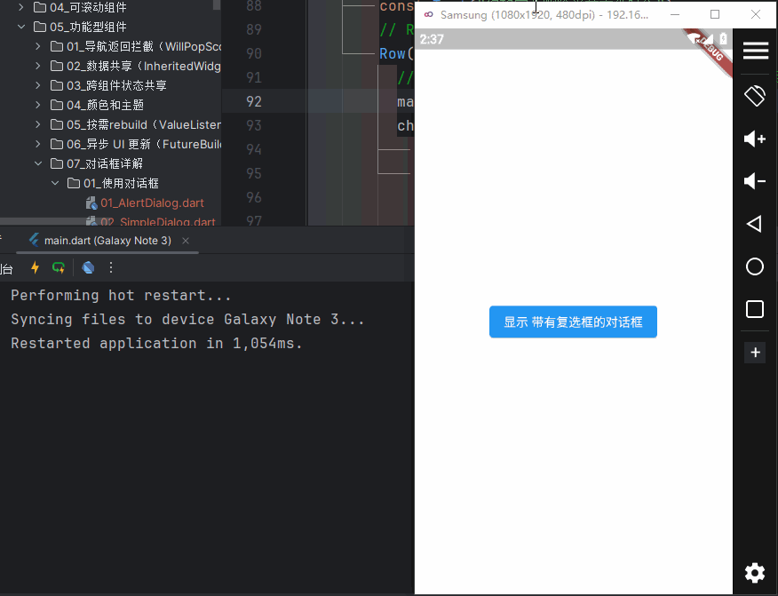

#### Ⅲ、使用 StatefulBuilder 方法

1. 上面的方法虽然能解决对话框状态更新的问题，但是有一个明显的缺点：对话框上所有可能会改变状态的组件都得单独封装在一个在内部管理状态的 `StatefulWidget` 中，这样不仅麻烦，而且复用性不大。因此，我们来想想能不能找到一种更简单的方法？
2. 上面的方法本质上就是将对话框的状态置于一个 `StatefulWidget` 的上下文中，由 `StatefulWidget` 在内部管理，那么我们有没有办法在不需要单独抽离组件的情况下创建一个 `StatefulWidget` 的上下文呢？想到这里，我们可以从 Builder 组件的实现获得灵感。在前面介绍过 Builder 组件可以获得组件所在位置的真正的 `Context`，那它是怎么实现的呢，我们看看它的源码：

```dart
class Builder extends StatelessWidget {
  const Builder({
    Key? key,
    required this.builder,
  }) : assert(builder != null),
       super(key: key);
  final WidgetBuilder builder;

  @override
  Widget build(BuildContext context) => builder(context);
}
```

3. 可以看到，Builder 实际上只是继承了 `StatelessWidget`，然后在 build 方法中获取当前 `context` 后将构建方法代理到了 builder 回调，可见，Builder 实际上是获取了 `StatelessWidget` 的上下文（context）。
4. 那么我们能否用相同的方法获取 `StatefulWidget` 的上下文，并代理其 `build` 方法呢？下面我们照猫画虎，来封装一个 `StatefulBuilder` 方法 `02_1_StatefulBuilder.dart`：

```dart
import 'package:flutter/cupertino.dart';

class StatefulBuilder extends StatefulWidget {
  const StatefulBuilder({Key? key, required this.builder}) : super(key: key);

  final StatefulWidgetBuilder builder;

  @override
  _StatefulBuilderState createState() => _StatefulBuilderState();
}

class _StatefulBuilderState extends State<StatefulBuilder> {
  @override
  Widget build(BuildContext context) => widget.builder(context, setState);
}
```

5. 代码很简单，`StatefulBuilder` 获取了 `StatefulWidget` 的上下文，并代理了其构建过程。下面我们就可以通过 `StatefulBuilder` 来重构上面的代码了（变动只在 `DialogCheckbox` 部分） `02_2_AlertDialogCheckbox.dart` ：

```dart
import 'package:flutter/material.dart';

import '01_1_DialogCheckbox.dart';

class AlertDialogCheckboxComponent extends StatefulWidget {
  const AlertDialogCheckboxComponent({Key? key}) : super(key: key);

  @override
  _AlertDialogCheckboxComponentState createState() => _AlertDialogCheckboxComponentState();
}

class _AlertDialogCheckboxComponentState extends State<AlertDialogCheckboxComponent> {
  // 记录复选框是否选中
  bool _withTree = false;

  // 构建 UI, context：构建上下文，即当前 Widget 的位置
  @override
  Widget build(BuildContext context) {
    // Center 是一个用于将其子部件树对齐到屏幕中心的小部件
    return Center(
      // Column 是一个用于在垂直方向上排列其子部件的小部件
      child: Column(
        // mainAxisAlignment: MainAxisAlignment.center：将子部件树在垂直方向上对齐到屏幕中心
        mainAxisAlignment: MainAxisAlignment.center,
        children: [
          // 调用方法，构建 ElevatedButton；dialog：弹出对话框的方法
          buildElevatedButton(showConfirmDialog),
        ],
      ),
    );
  }

  // 构建 ElevatedButton；dialog：弹出对话框的方法
  Widget buildElevatedButton(Future<bool?> Function() dialog){
    return ElevatedButton(
      child: const Text("显示 带有复选框的对话框"),
      onPressed: () async {
        // 弹出对话框并等待其关闭，接收对话框关闭时的返回数据
        bool? result = await dialog();
        if (result == null) {
          print("点击了取消");
        } else {
          print("点击了确定");
        }
      },
    );
  }

  // 弹出对话框
  Future<bool?> showConfirmDialog() {
    // showDialog 是一个用于显示对话框的方法
    return showDialog<bool>(
      // context：构建上下文，即当前 Widget 的位置
      context: context,
      // builder 是一个回调函数，返回一个 Widget
      builder: (context) {
        // AlertDialog 是一个用于显示对话框的小部件
        return AlertDialog(
          title: const Text("提示"),
          // content 通常显示对话框的主要内容；Column 是一个用于在垂直方向上排列其子部件的小部件
          content: buildConfirmDialogContent(),
          // actions 是一个 Widget 列表，用于显示对话框的按钮；通常用于放置“取消”和“确认”按钮
          actions: <Widget>[
            TextButton(
              child: const Text("取消"),
              // 关闭对话框并返回 null
              onPressed: () => Navigator.of(context).pop(),
            ),
            TextButton(
              child: const Text("确认"),
              // 关闭对话框并返回 true
              onPressed: () => Navigator.of(context).pop(true)
            ),
          ],
        );
      },
    );
  }

  Widget buildConfirmDialogContent() {
    // Column 是一个用于在垂直方向上排列其子部件的小部件
    return Column(
      // mainAxisSize：主轴尺寸；MainAxisSize.min：尽可能小，即尽可能缩小垂直方向上的高度
      mainAxisSize: MainAxisSize.min,
      // 表示子部件在水平方向上如何排列；CrossAxisAlignment.start：子部件在水平方向上从左到右排列
      crossAxisAlignment:  CrossAxisAlignment.start,
      children: [
        const Text("您确定要删除当前文件吗？"),
        // Row 是一个用于在水平方向上排列其子部件的小部件
        Row(
          // mainAxisSize：主轴尺寸；MainAxisSize.min：尽可能小，即尽可能缩小水平方向上的宽度
          mainAxisSize: MainAxisSize.min,
          children: [
            const Text("是否确认："),
            StatefulBuilder(
              builder: (context, _setState){
                return Checkbox(
                  // value：是否选中；_withTree：记录复选框是否选中
                  value: _withTree,
                  // onChanged：复选框的值发生改变时的回调函数
                  onChanged: (bool? value) {
                    // 调用 setState() 更新复选框的选中状态
                    _setState(() {
                      // 更新复选框的选中状态
                      _withTree = !_withTree;
                      print('复选框选中状态：$value');
                    });
                  },
                );
              }
            )
          ],
        )
      ],
    );
  }

}
```

6. 实际上，这种方法本质上就是子组件通知父组件（StatefulWidget）重新 build 子组件本身来实现 UI 更新的
7. 实际上 `StatefulBuilder` 正是 Flutter SDK 中提供的一个类，它和 Builder 的原理是一样的，在此，提醒一定要将 `StatefulBuilder` 和 `Builder` 理解透彻，因为它们在 Flutter 中是非常实用的

#### Ⅳ、使用 element.markNeedsBuild()

1. 是否还有更简单的解决方案呢？要确认这个问题，我们就得先搞清楚 UI 是怎么更新的，我们知道在调用 `setState` 方法后 `StatefulWidget` 就会重新 build，那 `setState` 方法做了什么呢？我们能不能从中找到方法？顺着这个思路，我们就得看一下 `setState` 的核心源码：

```dart
void setState(VoidCallback fn) {
  ... //省略无关代码
  _element.markNeedsBuild();
}
```

2. 可以发现，`setState` 中调用了 Element 的 `markNeedsBuild()` 方法，我们前面说过，Flutter 是一个响应式框架，要更新 UI 只需改变状态后通知框架页面需要重构即可，而 Element 的 `markNeedsBuild()` 方法正是来实现这个功能的！
3. `markNeedsBuild()` 方法会将当前的 Element 对象标记为 “dirty”（脏的），在每一个 Frame，Flutter 都会重新构建被标记为 “dirty” 的 Element 对象。
4. 既然如此，我们有没有办法获取到对话框内部 UI 的 Element 对象，然后将其标示为为 “dirty” 呢？答案是肯定的！我们可以通过 Context 来得到 Element 对象，至于 Element 与 Context 的关系我们将会在后面 “Flutter核心原理” 一章中再深入介绍，现在只需要简单的认为：在组件树中，`context` 实际上就是 Element 对象的引用。
5. 知道这个后，那么解决的方案就呼之欲出了，我们可以通过如下方式来让复选框可以更新：

```dart
import 'package:flutter/material.dart';

import '01_1_DialogCheckbox.dart';

class AlertDialogCheckboxComponent extends StatefulWidget {
  const AlertDialogCheckboxComponent({Key? key}) : super(key: key);

  @override
  _AlertDialogCheckboxComponentState createState() => _AlertDialogCheckboxComponentState();
}

class _AlertDialogCheckboxComponentState extends State<AlertDialogCheckboxComponent> {
  // 记录复选框是否选中
  bool _withTree = false;

  // 构建 UI, context：构建上下文，即当前 Widget 的位置
  @override
  Widget build(BuildContext context) {
    // Center 是一个用于将其子部件树对齐到屏幕中心的小部件
    return Center(
      // Column 是一个用于在垂直方向上排列其子部件的小部件
      child: Column(
        // mainAxisAlignment: MainAxisAlignment.center：将子部件树在垂直方向上对齐到屏幕中心
        mainAxisAlignment: MainAxisAlignment.center,
        children: [
          // 调用方法，构建 ElevatedButton；dialog：弹出对话框的方法
          buildElevatedButton(showConfirmDialog),
        ],
      ),
    );
  }

  // 构建 ElevatedButton；dialog：弹出对话框的方法
  Widget buildElevatedButton(Future<bool?> Function() dialog){
    return ElevatedButton(
      child: const Text("显示 带有复选框的对话框"),
      onPressed: () async {
        // 弹出对话框并等待其关闭，接收对话框关闭时的返回数据
        bool? result = await dialog();
        if (result == null) {
          print("点击了取消");
        } else {
          print("点击了确定");
        }
      },
    );
  }

  // 弹出对话框
  Future<bool?> showConfirmDialog() {
    // showDialog 是一个用于显示对话框的方法
    return showDialog<bool>(
      // context：构建上下文，即当前 Widget 的位置
      context: context,
      // builder 是一个回调函数，返回一个 Widget
      builder: (context) {
        // AlertDialog 是一个用于显示对话框的小部件
        return AlertDialog(
          title: const Text("提示"),
          // content 通常显示对话框的主要内容；Column 是一个用于在垂直方向上排列其子部件的小部件
          content: buildConfirmDialogContent(context),
          // actions 是一个 Widget 列表，用于显示对话框的按钮；通常用于放置“取消”和“确认”按钮
          actions: <Widget>[
            TextButton(
              child: const Text("取消"),
              // 关闭对话框并返回 null
              onPressed: () => Navigator.of(context).pop(),
            ),
            TextButton(
              child: const Text("确认"),
              // 关闭对话框并返回 true
              onPressed: () => Navigator.of(context).pop(true)
            ),
          ],
        );
      },
    );
  }

  Widget buildConfirmDialogContent(BuildContext context) {
    // Column 是一个用于在垂直方向上排列其子部件的小部件
    return Column(
      // mainAxisSize：主轴尺寸；MainAxisSize.min：尽可能小，即尽可能缩小垂直方向上的高度
      mainAxisSize: MainAxisSize.min,
      // 表示子部件在水平方向上如何排列；CrossAxisAlignment.start：子部件在水平方向上从左到右排列
      crossAxisAlignment:  CrossAxisAlignment.start,
      children: [
        const Text("您确定要删除当前文件吗？"),
        // Row 是一个用于在水平方向上排列其子部件的小部件
        Row(
          // mainAxisSize：主轴尺寸；MainAxisSize.min：尽可能小，即尽可能缩小水平方向上的宽度
          mainAxisSize: MainAxisSize.min,
          children: [
            const Text("是否确认："),
            Checkbox(
              // value：是否选中；_withTree：记录复选框是否选中
              value: _withTree,
              // onChanged：复选框的值发生改变时的回调函数
              onChanged: (bool? value) {
                // 更新复选框的选中状态
                _withTree = !_withTree;
                /**
                 * 此时 context 为对话框 UI 的根 Element，
                 * 我们直接将对话框 UI 对应的 Element 标记为 dirty 即可
                 * 之后框架会调用对话框 UI 的 build 方法来根据新状态重新构建对话框 UI
                 */
                (context as Element).markNeedsBuild();
                print('复选框选中状态：$value');
              },
            )
          ],
        )
      ],
    );
  }

}
```

6. 上面的代码运行后复选框也可以正常选中。可以看到，我们只用了一行代码便解决了这个问题！当然上面的代码并不是最优，因为我们只需要更新复选框的状态，而此时的 context 我们用的是对话框的根 `context`，所以会导致整个对话框 UI 组件全部 rebuild，因此最好的做法是将 context 的“范围”缩小，也就是说只将 `Checkbox` 的 `Element` 标记为 dirty，优化后的代码为：
7. `main` 主方法

```dart
import 'package:flutter/material.dart';

import '05_功能型组件/07_对话框详解/04_对话框状态管理/03_AlertDialogCheckbox.dart';


// 入口方法
void main() => runApp(const MyApp());

class MyApp extends StatelessWidget {
  const MyApp({Key? key}) : super(key: key);

  @override
  Widget build(BuildContext context) {
    /**
     * MaterialApp 是 Flutter 提供的一个小部件，用于创建一个包含 Material Design 样式和功能的应用程序。
     * 它是一个顶层小部件，用于为整个应用程序提供一致的主题和样式。
     * 在 MaterialApp 中，你可以设置应用程序的标题、主题、路由和其他全局属性
     */
    return const MaterialApp(
      /**
       * home 是 MaterialApp 的一个属性，用于指定应用程序的主页。它接受一个 Widget 作为参数，用于定义主页的内容
       * Scaffold 是一个用于创建基本页面布局的小部件。
       * Scaffold 小部件提供了一个应用程序的基本布局结构，包括顶部的应用栏、底部的导航栏、抽屉菜单等。
       * 它是一个非常常用的小部件，常用于创建具有标准 Material Design 布局的页面
       */
      home: Scaffold(
        // 设置背景颜色为白色
        backgroundColor: Colors.white,
        /**
         * body: 用于定义页面的主要内容区域
         * SafeArea 是一个小部件，作用是为其子部件提供一个安全的区域，来避免遮挡了屏幕的物理部件（如刘海屏或下方的 Home 键）
         */
        body: SafeArea(
          child: AlertDialogCheckboxComponent()
        )
      )
    );
  }
}
```

8. `03_AlertDialogCheckbox.dart` 弹窗方法

```dart
import 'package:flutter/material.dart';

import '01_1_DialogCheckbox.dart';

class AlertDialogCheckboxComponent extends StatefulWidget {
  const AlertDialogCheckboxComponent({Key? key}) : super(key: key);

  @override
  _AlertDialogCheckboxComponentState createState() => _AlertDialogCheckboxComponentState();
}

class _AlertDialogCheckboxComponentState extends State<AlertDialogCheckboxComponent> {
  /// 记录复选框是否选中
  bool _withTree = false;

  /// 构建 UI, context：构建上下文，即当前 Widget 的位置
  @override
  Widget build(BuildContext context) {
    // Center 是一个用于将其子部件树对齐到屏幕中心的小部件
    return Center(
      // Column 是一个用于在垂直方向上排列其子部件的小部件
      child: Column(
        // mainAxisAlignment: MainAxisAlignment.center：将子部件树在垂直方向上对齐到屏幕中心
        mainAxisAlignment: MainAxisAlignment.center,
        children: [
          // 调用方法，构建 ElevatedButton；dialog：弹出对话框的方法
          buildElevatedButton(showConfirmDialog),
        ],
      ),
    );
  }

  /// 构建 ElevatedButton；dialog：弹出对话框的方法
  Widget buildElevatedButton(Future<bool?> Function() dialog){
    return ElevatedButton(
      child: const Text("显示 带有复选框的对话框"),
      onPressed: () async {
        // 弹出对话框并等待其关闭，接收对话框关闭时的返回数据
        bool? result = await dialog();
        if (result == null) {
          print("点击了取消");
        } else {
          print("点击了确定");
        }
      },
    );
  }

  /// 弹出对话框
  Future<bool?> showConfirmDialog() {
    // showDialog 是一个用于显示对话框的方法
    return showDialog<bool>(
      // context：构建上下文，即当前 Widget 的位置
      context: context,
      // builder 是一个回调函数，返回一个 Widget
      builder: (context) {
        // AlertDialog 是一个用于显示对话框的小部件
        return AlertDialog(
          title: const Text("提示"),
          // content 通常显示对话框的主要内容；Column 是一个用于在垂直方向上排列其子部件的小部件
          content: buildConfirmDialogContent(),
          // actions 是一个 Widget 列表，用于显示对话框的按钮；通常用于放置“取消”和“确认”按钮
          actions: <Widget>[
            TextButton(
              child: const Text("取消"),
              // 关闭对话框并返回 null
              onPressed: () => Navigator.of(context).pop(),
            ),
            TextButton(
              child: const Text("确认"),
              // 关闭对话框并返回 true
              onPressed: () => Navigator.of(context).pop(true)
            ),
          ],
        );
      },
    );
  }

  Widget buildConfirmDialogContent() {
    // Column 是一个用于在垂直方向上排列其子部件的小部件
    return Column(
      // mainAxisSize：主轴尺寸；MainAxisSize.min：尽可能小，即尽可能缩小垂直方向上的高度
      mainAxisSize: MainAxisSize.min,
      // 表示子部件在水平方向上如何排列；CrossAxisAlignment.start：子部件在水平方向上从左到右排列
      crossAxisAlignment:  CrossAxisAlignment.start,
      children: [
        const Text("您确定要删除当前文件吗？"),
        // Row 是一个用于在水平方向上排列其子部件的小部件
        Row(
          // mainAxisSize：主轴尺寸；MainAxisSize.min：尽可能小，即尽可能缩小水平方向上的宽度
          mainAxisSize: MainAxisSize.min,
          children: [
            const Text("同时删除子目录？"),
            buildDeleteSubdirectoryCheckbox()
          ],
        )
      ],
    );
  }

  /// 构建 是否同时删除子目录复选框
  Widget buildDeleteSubdirectoryCheckbox(){
    /**
     * 此处 Builder 的作用是为了通过 context 获取 Element，
     * 使其可以通过 markNeedsBuild 方法来间接实现局部刷新
     * 而不是重新构建整个对话框 UI
     */
    return Builder(
      builder: (BuildContext context){
        return Checkbox(
          // value：是否选中；_withTree：记录复选框是否选中
          value: _withTree,
          // onChanged：复选框的值发生改变时的回调函数
          onChanged: (bool? value) {
            // 更新复选框的选中状态
            _withTree = !_withTree;
            /**
             * 此时 context 为对话框 UI 的根 Element，
             * 我们直接将对话框 UI 对应的 Element 标记为 dirty 即可
             * 之后框架会调用对话框 UI 的 build 方法来根据新状态重新构建对话框 UI
             */
            (context as Element).markNeedsBuild();
            print('复选框选中状态：$value');
          },
        );
      }
    );
  }

}
```

### ⑤、其他类型的对话框

#### Ⅰ、底部菜单列表

1. `showModalBottomSheet` 方法可以弹出一个 Material 风格的底部菜单列表模态对话框，示例如下：
2. `main` 主方法

```dart
import 'package:flutter/material.dart';

import '05_功能型组件/07_对话框详解/05_其他类型的对话框/01_底部菜单列表.dart';


// 入口方法
void main() => runApp(const MyApp());

class MyApp extends StatelessWidget {
  const MyApp({Key? key}) : super(key: key);

  @override
  Widget build(BuildContext context) {
    /**
     * MaterialApp 是 Flutter 提供的一个小部件，用于创建一个包含 Material Design 样式和功能的应用程序。
     * 它是一个顶层小部件，用于为整个应用程序提供一致的主题和样式。
     * 在 MaterialApp 中，你可以设置应用程序的标题、主题、路由和其他全局属性
     */
    return const MaterialApp(
      /**
       * home 是 MaterialApp 的一个属性，用于指定应用程序的主页。它接受一个 Widget 作为参数，用于定义主页的内容
       * Scaffold 是一个用于创建基本页面布局的小部件。
       * Scaffold 小部件提供了一个应用程序的基本布局结构，包括顶部的应用栏、底部的导航栏、抽屉菜单等。
       * 它是一个非常常用的小部件，常用于创建具有标准 Material Design 布局的页面
       */
        home: Scaffold(
          // 设置背景颜色为白色
            backgroundColor: Colors.white,
            /**
             * body: 用于定义页面的主要内容区域
             * SafeArea 是一个小部件，作用是为其子部件提供一个安全的区域，来避免遮挡了屏幕的物理部件（如刘海屏或下方的 Home 键）
             */
            body: SafeArea(
                child: ShowModalBottomSheetComponent()
            )
        )
    );
  }
}
```

3. `01_底部菜单列表.dart` 弹窗方法

```dart
import 'package:flutter/material.dart';


class ShowModalBottomSheetComponent extends StatefulWidget {
  const ShowModalBottomSheetComponent({Key? key}) : super(key: key);

  @override
  _ShowModalBottomSheetComponentState createState() => _ShowModalBottomSheetComponentState();
}

class _ShowModalBottomSheetComponentState extends State<ShowModalBottomSheetComponent> {
  /// 构建 UI, context：构建上下文，即当前 Widget 的位置
  @override
  Widget build(BuildContext context) {
    // Center 是一个用于将其子部件树对齐到屏幕中心的小部件
    return Center(
      // Column 是一个用于在垂直方向上排列其子部件的小部件
      child: Column(
        // mainAxisAlignment: MainAxisAlignment.center：将子部件树在垂直方向上对齐到屏幕中心
        mainAxisAlignment: MainAxisAlignment.center,
        children: [
          // 调用方法，构建 ElevatedButton；dialog：弹出对话框的方法
          buildElevatedButton(showConfirmDialog),
        ],
      ),
    );
  }

  /// 构建 ElevatedButton；dialog：弹出对话框的方法
  Widget buildElevatedButton(Future<int?> Function() dialog){
    return ElevatedButton(
      child: const Text("显示 底部菜单列表"),
      onPressed: () async {
        // 弹出对话框并等待其关闭，接收对话框关闭时的返回数据
        int? result = await dialog();
        if (result == null) {
          print("点击了取消");
        } else {
          print("点击了第 $result 个条目");
        }
      },
    );
  }

  /// 弹出对话框
  Future<int?> showConfirmDialog() {
    // showModalBottomSheet 是一个用于显示底部菜单列表的方法
    return showModalBottomSheet<int>(
      // context：构建上下文，即当前 Widget 的位置
      context: context,
      // builder 是一个回调函数，返回一个 Widget
      builder: (context) {
        return buildListViewDialog();
      },
    );
  }

  /// 构建 ListView 对话框
  Widget buildListViewDialog() {
    // ListView.builder 是一个用于构建列表的构造方法
    return ListView.builder(
      // itemCount：列表项的数量
      itemCount: 30,
      itemBuilder: (BuildContext context, int index) {
        return ListTile(
          title: Text("$index"),
          onTap: () => Navigator.of(context).pop(index),
        );
      },
    );
  }

}
```

4. 效果：

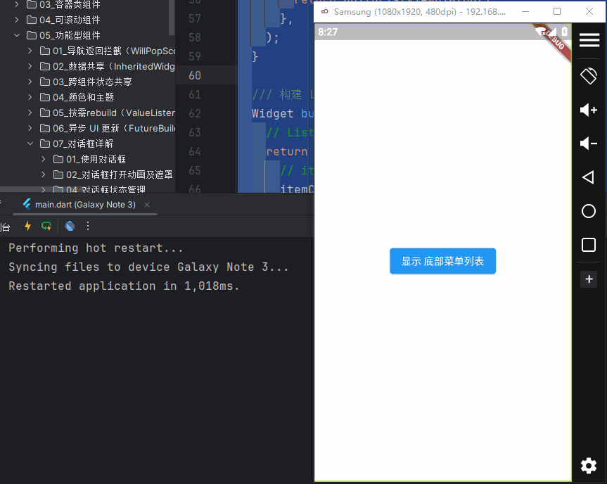

#### Ⅱ、Loading 框

1. 其实 Loading 框可以直接通过 `showDialog` + `AlertDialog` 来自定义：
2. `main` 主方法

```dart
import 'package:flutter/material.dart';

import '05_功能型组件/07_对话框详解/05_其他类型的对话框/02_Loading 框.dart';


// 入口方法
void main() => runApp(const MyApp());

class MyApp extends StatelessWidget {
  const MyApp({Key? key}) : super(key: key);

  @override
  Widget build(BuildContext context) {
    /**
     * MaterialApp 是 Flutter 提供的一个小部件，用于创建一个包含 Material Design 样式和功能的应用程序。
     * 它是一个顶层小部件，用于为整个应用程序提供一致的主题和样式。
     * 在 MaterialApp 中，你可以设置应用程序的标题、主题、路由和其他全局属性
     */
    return const MaterialApp(
      /**
       * home 是 MaterialApp 的一个属性，用于指定应用程序的主页。它接受一个 Widget 作为参数，用于定义主页的内容
       * Scaffold 是一个用于创建基本页面布局的小部件。
       * Scaffold 小部件提供了一个应用程序的基本布局结构，包括顶部的应用栏、底部的导航栏、抽屉菜单等。
       * 它是一个非常常用的小部件，常用于创建具有标准 Material Design 布局的页面
       */
        home: Scaffold(
          // 设置背景颜色为白色
            backgroundColor: Colors.white,
            /**
             * body: 用于定义页面的主要内容区域
             * SafeArea 是一个小部件，作用是为其子部件提供一个安全的区域，来避免遮挡了屏幕的物理部件（如刘海屏或下方的 Home 键）
             */
            body: SafeArea(
                child: LoadingDialogComponent()
            )
        )
    );
  }
}
```

3. `02_Loading 框.dart` 弹窗方法

```dart
import 'package:flutter/material.dart';


class LoadingDialogComponent extends StatefulWidget {
  const LoadingDialogComponent({Key? key}) : super(key: key);

  @override
  _LoadingDialogComponentState createState() => _LoadingDialogComponentState();
}

class _LoadingDialogComponentState extends State<LoadingDialogComponent> {
  /// 构建 UI, context：构建上下文，即当前 Widget 的位置
  @override
  Widget build(BuildContext context) {
    // Center 是一个用于将其子部件树对齐到屏幕中心的小部件
    return Center(
      // Column 是一个用于在垂直方向上排列其子部件的小部件
      child: Column(
        // mainAxisAlignment: MainAxisAlignment.center：将子部件树在垂直方向上对齐到屏幕中心
        mainAxisAlignment: MainAxisAlignment.center,
        children: [
          // 调用方法，构建 ElevatedButton；dialog：弹出对话框的方法
          buildElevatedButton(showConfirmDialog),
        ],
      ),
    );
  }

  /// 构建 ElevatedButton；dialog：弹出对话框的方法
  Widget buildElevatedButton(Future<int?> Function() dialog){
    return ElevatedButton(
      child: const Text("显示 Loading 加载框"),
      onPressed: () async {
        // 弹出对话框并等待其关闭，接收对话框关闭时的返回数据
        int? result = await dialog();
        if (result == null) {
          print("点击了取消");
        } else {
          print("点击了第 $result 个条目");
        }
      },
    );
  }

  /// 弹出对话框
  Future<int?> showConfirmDialog() {
    // showDialog 是一个用于显示对话框的方法
    return showDialog<int>(
      // context：构建上下文，即当前 Widget 的位置
      context: context,
      // builder 是一个回调函数，返回一个 Widget
      builder: (context) {
        return buildLoadingDialog();
      },
    );
  }

  /// 构建 ListView 对话框
  Widget buildLoadingDialog() {
    // AlertDialog 是一个用于显示对话框的小部件
    return const AlertDialog(
      // content 是 AlertDialog 的一个属性，用于设置对话框的内容； Column 是一个用于在垂直方向上排列其子部件的小部件
      content: Column(
        mainAxisSize: MainAxisSize.min,
        children: <Widget>[
          // CircularProgressIndicator 是一个圆形的进度条
          CircularProgressIndicator(),
          Padding(
            padding: EdgeInsets.only(top: 26.0),
            child: Text("正在加载，请稍后..."),
          )
        ],
      ),
    );
  }

}
```

4. 效果：

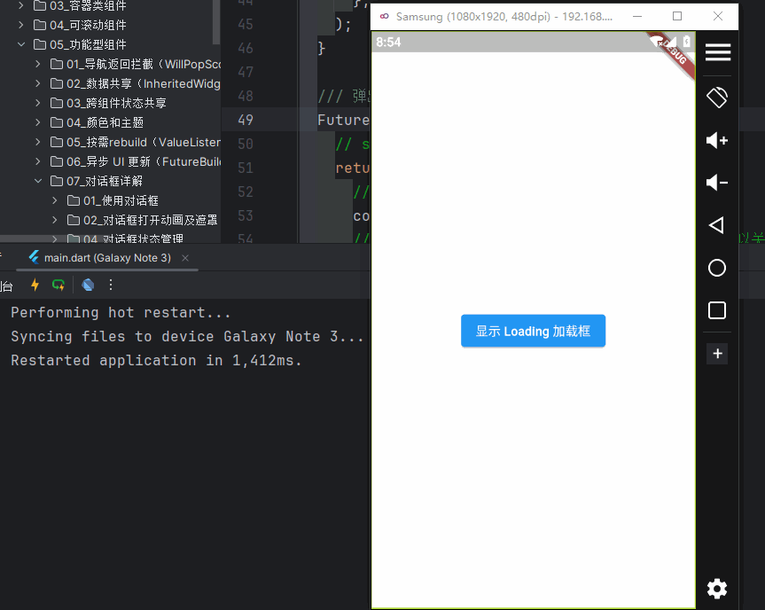

#### Ⅲ、日历选择器 Material 风格

1. 显示日历选择器要使用 `showDatePicker` 方法
2. `main` 主方法

```dart
import 'package:flutter/material.dart';

import '05_功能型组件/07_对话框详解/05_其他类型的对话框/03_日历选择器 Material 风格.dart';


// 入口方法
void main() => runApp(const MyApp());

class MyApp extends StatelessWidget {
  const MyApp({Key? key}) : super(key: key);

  @override
  Widget build(BuildContext context) {
    /**
     * MaterialApp 是 Flutter 提供的一个小部件，用于创建一个包含 Material Design 样式和功能的应用程序。
     * 它是一个顶层小部件，用于为整个应用程序提供一致的主题和样式。
     * 在 MaterialApp 中，你可以设置应用程序的标题、主题、路由和其他全局属性
     */
    return const MaterialApp(
      /**
       * home 是 MaterialApp 的一个属性，用于指定应用程序的主页。它接受一个 Widget 作为参数，用于定义主页的内容
       * Scaffold 是一个用于创建基本页面布局的小部件。
       * Scaffold 小部件提供了一个应用程序的基本布局结构，包括顶部的应用栏、底部的导航栏、抽屉菜单等。
       * 它是一个非常常用的小部件，常用于创建具有标准 Material Design 布局的页面
       */
        home: Scaffold(
          // 设置背景颜色为白色
            backgroundColor: Colors.white,
            /**
             * body: 用于定义页面的主要内容区域
             * SafeArea 是一个小部件，作用是为其子部件提供一个安全的区域，来避免遮挡了屏幕的物理部件（如刘海屏或下方的 Home 键）
             */
            body: SafeArea(
                child: ShowDatePickerComponent()
            )
        )
    );
  }
}
```

3. `03_日历选择器 Material 风格.dart` 弹窗方法

```dart
import 'package:flutter/material.dart';


class ShowDatePickerComponent extends StatefulWidget {
  const ShowDatePickerComponent({Key? key}) : super(key: key);

  @override
  _ShowDatePickerComponentState createState() => _ShowDatePickerComponentState();
}

class _ShowDatePickerComponentState extends State<ShowDatePickerComponent> {
  /// 构建 UI, context：构建上下文，即当前 Widget 的位置
  @override
  Widget build(BuildContext context) {
    // Center 是一个用于将其子部件树对齐到屏幕中心的小部件
    return Center(
      // Column 是一个用于在垂直方向上排列其子部件的小部件
      child: Column(
        // mainAxisAlignment: MainAxisAlignment.center：将子部件树在垂直方向上对齐到屏幕中心
        mainAxisAlignment: MainAxisAlignment.center,
        children: [
          // 调用方法，构建 ElevatedButton；dialog：弹出对话框的方法
          buildElevatedButton(showConfirmDialog),
        ],
      ),
    );
  }

  /// 构建 ElevatedButton；dialog：弹出对话框的方法
  Widget buildElevatedButton(Future<DateTime?> Function() dialog){
    return ElevatedButton(
      child: const Text("显示 日历选择器"),
      onPressed: () async {
        // 弹出对话框并等待其关闭，接收对话框关闭时的返回数据
        var dateTime = await dialog();
        if (dateTime == null) {
          print("点击了取消");
        } else {
          print("选择了日期：${dateTime.year}/${dateTime.month}/${dateTime.day}");
        }
      },
    );
  }

  /// 弹出对话框
  Future<DateTime?> showConfirmDialog() {
    var date = DateTime.now();
    // showDialog 是一个用于显示对话框的方法
    return showDatePicker(
      // context：构建上下文，即当前 Widget 的位置
      context: context,
      // initialDate：初始日期，即弹出日历选择器时默认选中的日期
      initialDate: date,
      // firstDate：起始日期，即弹出日历选择器时最早可选的日期
      firstDate: date,
      // lastDate：结束日期，即弹出日历选择器时最晚可选的日期
      lastDate: date.add(const Duration(days: 30))
    );
  }

}
```

4. 效果：

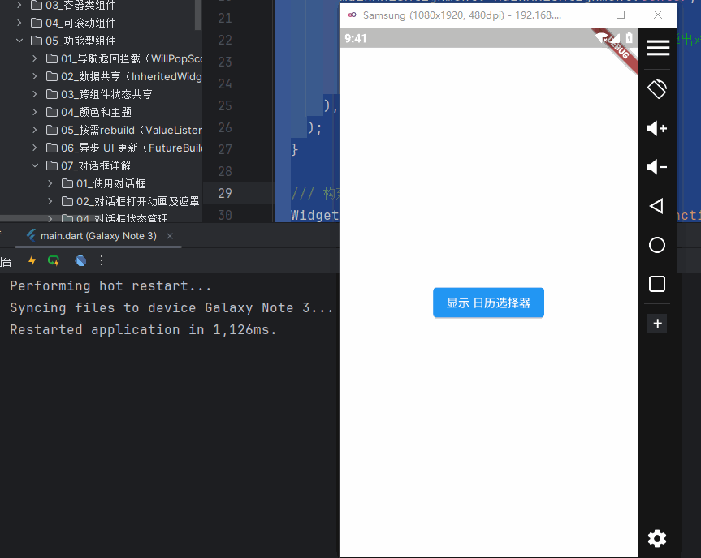

#### Ⅳ、日历选择器 iOS 风格

1. iOS 风格的日历选择器需要使用 `showCupertinoModalPopup` 方法和 `CupertinoDatePicker` 组件来实现
2. `main` 主方法

```dart
import 'package:flutter/material.dart';

import '05_功能型组件/07_对话框详解/05_其他类型的对话框/04_日历选择器 IOS 风格.dart';


// 入口方法
void main() => runApp(const MyApp());

class MyApp extends StatelessWidget {
  const MyApp({Key? key}) : super(key: key);

  @override
  Widget build(BuildContext context) {
    /**
     * MaterialApp 是 Flutter 提供的一个小部件，用于创建一个包含 Material Design 样式和功能的应用程序。
     * 它是一个顶层小部件，用于为整个应用程序提供一致的主题和样式。
     * 在 MaterialApp 中，你可以设置应用程序的标题、主题、路由和其他全局属性
     */
    return const MaterialApp(
      /**
       * home 是 MaterialApp 的一个属性，用于指定应用程序的主页。它接受一个 Widget 作为参数，用于定义主页的内容
       * Scaffold 是一个用于创建基本页面布局的小部件。
       * Scaffold 小部件提供了一个应用程序的基本布局结构，包括顶部的应用栏、底部的导航栏、抽屉菜单等。
       * 它是一个非常常用的小部件，常用于创建具有标准 Material Design 布局的页面
       */
        home: Scaffold(
          // 设置背景颜色为白色
            backgroundColor: Colors.white,
            /**
             * body: 用于定义页面的主要内容区域
             * SafeArea 是一个小部件，作用是为其子部件提供一个安全的区域，来避免遮挡了屏幕的物理部件（如刘海屏或下方的 Home 键）
             */
            body: SafeArea(
                child: ShowCupertinoModalPopupComponent()
            )
        )
    );
  }
}
```

3. `04_日历选择器 IOS 风格.dart` 弹窗方法

```dart
import 'package:flutter/cupertino.dart';
import 'package:flutter/material.dart';


class ShowCupertinoModalPopupComponent extends StatefulWidget {
  const ShowCupertinoModalPopupComponent({Key? key}) : super(key: key);

  @override
  _ShowCupertinoModalPopupComponentState createState() => _ShowCupertinoModalPopupComponentState();
}

class _ShowCupertinoModalPopupComponentState extends State<ShowCupertinoModalPopupComponent> {
  DateTime date = DateTime.now();

  /// 构建 UI, context：构建上下文，即当前 Widget 的位置
  @override
  Widget build(BuildContext context) {
    // Center 是一个用于将其子部件树对齐到屏幕中心的小部件
    return Center(
      // Column 是一个用于在垂直方向上排列其子部件的小部件
      child: Column(
        // mainAxisAlignment: MainAxisAlignment.center：将子部件树在垂直方向上对齐到屏幕中心
        mainAxisAlignment: MainAxisAlignment.center,
        children: [
          // 调用方法，构建 ElevatedButton；dialog：弹出对话框的方法
          buildElevatedButton(showConfirmDialog),
        ],
      ),
    );
  }

  /// 构建 ElevatedButton；dialog：弹出对话框的方法
  Widget buildElevatedButton(Future<DateTime?> Function() dialog){
    return ElevatedButton(
      child: const Text("显示 日历选择器"),
      onPressed: () async {
        // 弹出对话框并等待其关闭，接收对话框关闭时的返回数据
        var dateTime = await dialog();
        if (dateTime == null) {
          print("点击了取消");
        } else {
          print("选择了日期：${dateTime.year}/${dateTime.month}/${dateTime.day}");
        }
      },
    );
  }

  /// 弹出对话框
  Future<DateTime?> showConfirmDialog() {
    // showCupertinoModalPopup 是 IOS 风格的弹出对话框
    return showCupertinoModalPopup(
      // context：构建上下文，即当前 Widget 的位置
      context: context,
      builder: (ctx) {
        // CupertinoAlertDialog 是 IOS 风格的对话框
        return CupertinoAlertDialog(
          title: const Text("请选择日期"),
          // content 属性用于设置对话框的内容区域；buildCupertinoDatePicker()：构建日期选择器
          content: buildCupertinoDatePicker(),
          // actions 属性用于设置对话框的按钮区域
          actions: [
            CupertinoDialogAction(
              child: const Text('取消'),
              // 在取消按钮点击时，返回 null
              onPressed: () => Navigator.of(context).pop(null)
            ),
            CupertinoDialogAction(
              child: const Text('确定'),
              // 在确定按钮点击时，返回选中的日期
              onPressed: () => Navigator.of(context).pop(date)
            ),
          ],
        );
      },
    );
  }

  /// 构建日期选择器
  Widget buildCupertinoDatePicker() {
    // SizedBox 是一个用于指定固定尺寸的小部件
    return SizedBox(
      height: 200,
      // CupertinoDatePicker 是 IOS 风格的日历选择器
      child: CupertinoDatePicker(
        // mode 属性用于设置日历选择器的模式；CupertinoDatePickerMode.date：仅显示日期
        mode: CupertinoDatePickerMode.date,
        // minimumYear 属性用于设置日历选择器可选的最早年份，即日历选择器中可选的最早年份
        minimumYear: date.year - 50,
        // maximumYear 属性用于设置日历选择器可选的最晚年份，即日历选择器中可选的最晚年份
        maximumYear: date.year + 50,
        // onDateTimeChanged 属性用于设置日历选择器选中日期发生变化时的回调函数
        onDateTimeChanged: (DateTime dateTime) {
          date = dateTime;
          print(dateTime);
        },
      ),
    );
  }

}
```

4. 效果：

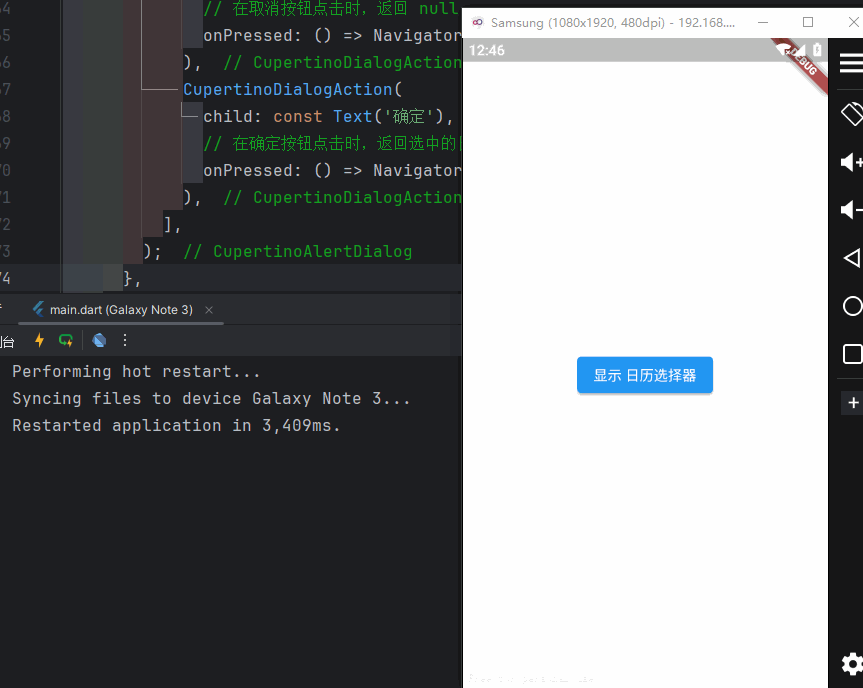

# 八、事件处理与通知

1. Flutter 中的手势系统有两个独立的层。
2. 第一层为原始指针(pointer)事件，它描述了屏幕上指针（例如，触摸、鼠标和触控笔）的位置和移动。 
3. 第二层为手势，描述由一个或多个指针移动组成的语义动作，如拖动、缩放、双击等。

## 1、原始指针事件处理

### ①、命中测试简介

1. 在移动端，各个平台或 UI 系统的原始指针事件模型基本都是一致，即：一次完整的事件分为三个阶段：手指按下、手指移动、和手指抬起，而更高级别的手势（如点击、双击、拖动等）都是基于这些原始事件的。
2. 当指针按下时，Flutter 会对应用程序执行命中测试(Hit Test)，以确定指针与屏幕接触的位置存在哪些组件（widget）， 指针按下事件（以及该指针的后续事件）然后被分发到由命中测试发现的最内部的组件，然后从那里开始，事件会在组件树中向上冒泡，这些事件会从最内部的组件被分发到组件树根的路径上的所有组件，这和 Web 开发中浏览器的事件冒泡机制相似， 但是 Flutter 中没有机制取消或停止“冒泡”过程，而浏览器的冒泡是可以停止的。
3. 注意，只有通过命中测试的组件才能触发事件，我们会在下一节中深入介绍命中测试过程。
4. 注意：术语 “Hit Test” 的中文翻译比较多，如 “命中测试”、“点击测试” ，对于名字我们不用较真，知道它们代表的是 “Hit Test ” 即可。

### ②、Listener 组件

1. Flutter 中可以使用 `Listener` 来监听原始触摸事件，下面是Listener的构造函数定义：

```dart
Listener({
  Key key,
  this.onPointerDown, //手指按下回调
  this.onPointerMove, //手指移动回调
  this.onPointerUp,//手指抬起回调
  this.onPointerCancel,//触摸事件取消回调
  this.behavior = HitTestBehavior.deferToChild, // 先忽略此参数，后面小节会专门介绍
  Widget child
})
```

2. 我们先看一个示例，下面代码功能是： 手指在一个容器上移动时查看手指相对于容器的位置。
3. `main` 主方法

```dart
import 'package:flutter/material.dart';

import '08_事件处理与通知/01_原始指针事件处理/01_Listener 组件.dart';


// 入口方法
void main() => runApp(const MyApp());

class MyApp extends StatelessWidget {
  const MyApp({Key? key}) : super(key: key);

  @override
  Widget build(BuildContext context) {
    /**
     * MaterialApp 是 Flutter 提供的一个小部件，用于创建一个包含 Material Design 样式和功能的应用程序。
     * 它是一个顶层小部件，用于为整个应用程序提供一致的主题和样式。
     * 在 MaterialApp 中，你可以设置应用程序的标题、主题、路由和其他全局属性
     */
    return const MaterialApp(
      /**
       * home 是 MaterialApp 的一个属性，用于指定应用程序的主页。它接受一个 Widget 作为参数，用于定义主页的内容
       * Scaffold 是一个用于创建基本页面布局的小部件。
       * Scaffold 小部件提供了一个应用程序的基本布局结构，包括顶部的应用栏、底部的导航栏、抽屉菜单等。
       * 它是一个非常常用的小部件，常用于创建具有标准 Material Design 布局的页面
       */
        home: Scaffold(
          // 设置背景颜色为白色
            backgroundColor: Colors.white,
            /**
             * body: 用于定义页面的主要内容区域
             * SafeArea 是一个小部件，作用是为其子部件提供一个安全的区域，来避免遮挡了屏幕的物理部件（如刘海屏或下方的 Home 键）
             */
            body: SafeArea(
                child: ListenerComponent()
            )
        )
    );
  }
}
```

4. `01_Listener 组件.dart` Listener 组件

```dart
import 'package:flutter/material.dart';

class ListenerComponent extends StatefulWidget {
  const ListenerComponent({Key? key}) : super(key: key);

  @override
  _ListenerComponentState createState() => _ListenerComponentState();
}

class _ListenerComponentState extends State<ListenerComponent> {
  // PointerEvent 是一个抽象类，它定义了指针事件的基本信息，如位置、时间戳等
  PointerEvent? _event;
  // 当事件发生时，更新本文本框中的内容
  String eventText = "";

  @override
  Widget build(BuildContext context) {
    // Listener 是一个用于监听触摸事件的小部件
    return Listener(
      // Container 是一个用于构建容器的小部件
      child: Container(
        alignment: Alignment.center,
        color: Colors.blue,
        width: 300.0,
        height: 300.0,
        // Text 是一个用于构建文本的小部件；_event?.localPosition ?? ''：获取触摸点的位置
        child: Text(
          eventText,
          style: const TextStyle(color: Colors.white),
        ),
      ),
      // onPointerDown：按下时触发
      onPointerDown: (PointerDownEvent event) => updateText("按下", event),
      // onPointerMove：移动时触发
      onPointerMove: (PointerMoveEvent event) => updateText("移动", event),
      // onPointerUp：抬起时触发
      onPointerUp: (PointerUpEvent event) => updateText("抬起", event),
    );
  }

  void updateText(String text, PointerEvent? event) {
    setState(() {
      // 更新触摸事件和本文本框中的内容
      _event = event;
      eventText = "当前操作：$text\n点击坐标：${_event?.localPosition ?? ''}";
    });
  }
  
}
```

5. 效果：

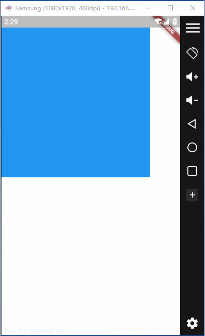

6. 指在蓝色矩形区域内移动即可看到当前指针偏移，当触发指针事件时，参数 `PointerDownEvent`、 `PointerMoveEvent`、 `PointerUpEvent` 都是 `PointerEvent` 的子类，`PointerEvent` 类中包括当前指针的一些信息，注意 Pointer，即“指针”， 指事件的触发者，可以是鼠标、触摸板、手指。
7. 如：
	1. `position`：它是指针相对于当对于全局坐标的偏移。
	2. `localPosition`：它是指针相对于当对于本身布局坐标的偏移。
	3. `delta`：两次指针移动事件（PointerMoveEvent）的距离。
	4. `pressure`：按压力度，如果手机屏幕支持压力传感器(如iPhone的3D Touch)，此属性会更有意义，如果手机不支持，则始终为 1。
	5. `orientation`：指针移动方向，是一个角度值。
8. 还有一个 `behavior` 属性，它决定子组件如何响应命中测试，关于该属性我们将在之后详细介绍。

### ③、忽略指针事件

1. 假如我们不想让某个子树响应 `PointerEvent` 的话，我们可以使用 `IgnorePointer` 和 `AbsorbPointer`，这两个组件都能阻止子树接收指针事件
2. 不同之处在于 `AbsorbPointer` 本身会参与命中测试，而 `IgnorePointer` 本身不会参与，这就意味着 `AbsorbPointer` 本身是可以接收指针事件的(但其子树不行)，而 `IgnorePointer` 不可以。一个简单的例子如下：

```dart
Listener(
  child: AbsorbPointer(
    child: Listener(
      child: Container(
        color: Colors.red,
        width: 200.0,
        height: 100.0,
      ),
      onPointerDown: (event)=>print("in"),
    ),
  ),
  onPointerDown: (event)=>print("up"),
)
```

3. 点击 `Container` 时，由于它在 `AbsorbPointer` 的子树上，所以不会响应指针事件，所以日志不会输出"in"，但 `AbsorbPointer` 本身是可以接收指针事件的，所以会输出 "up"。
4. 如果将 `AbsorbPointer` 换成 `IgnorePointer`，那么两个都不会输出。

## 2、手势识别

### ①、GestureDetector 手势识别

1. `GestureDetector` 是一个用于手势识别的功能性组件，我们通过它可以来识别各种手势。
2. `GestureDetector` 内部封装了 `Listener`，用以识别语义化的手势，接下来我们详细介绍一下各种手势的识别

#### Ⅰ、点击、双击、长按

1. 我们通过 `GestureDetector` 对 `Container` 进行手势识别，触发相应事件后，在 `Container` 上显示事件名：
2. `main` 主方法

```dart
import 'package:flutter/material.dart';

import '08_事件处理与通知/02_手势识别/01_GestureDetector_点击、双击、长按.dart';


// 入口方法
void main() => runApp(const MyApp());

class MyApp extends StatelessWidget {
  const MyApp({Key? key}) : super(key: key);

  @override
  Widget build(BuildContext context) {
    /**
     * MaterialApp 是 Flutter 提供的一个小部件，用于创建一个包含 Material Design 样式和功能的应用程序。
     * 它是一个顶层小部件，用于为整个应用程序提供一致的主题和样式。
     * 在 MaterialApp 中，你可以设置应用程序的标题、主题、路由和其他全局属性
     */
    return const MaterialApp(
      /**
       * home 是 MaterialApp 的一个属性，用于指定应用程序的主页。它接受一个 Widget 作为参数，用于定义主页的内容
       * Scaffold 是一个用于创建基本页面布局的小部件。
       * Scaffold 小部件提供了一个应用程序的基本布局结构，包括顶部的应用栏、底部的导航栏、抽屉菜单等。
       * 它是一个非常常用的小部件，常用于创建具有标准 Material Design 布局的页面
       */
        home: Scaffold(
          // 设置背景颜色为白色
            backgroundColor: Colors.white,
            /**
             * body: 用于定义页面的主要内容区域
             * SafeArea 是一个小部件，作用是为其子部件提供一个安全的区域，来避免遮挡了屏幕的物理部件（如刘海屏或下方的 Home 键）
             */
            body: SafeArea(
                child: GestureDetector1Component()
            )
        )
    );
  }
}
```

3. `01_GestureDetector_点击、双击、长按.dart` 点击、双击、长按方法

```dart
import 'package:flutter/material.dart';

class GestureDetector1Component extends StatefulWidget {
  const GestureDetector1Component({Key? key}) : super(key: key);

  @override
  _GestureDetector1ComponentState createState() => _GestureDetector1ComponentState();
}

class _GestureDetector1ComponentState extends State<GestureDetector1Component> {
  // 保存事件名
  String _operation = "未检测到手势";

  @override
  Widget build(BuildContext context) {
    // Listener 是一个用于监听触摸事件的小部件
    return Center(
      child: GestureDetector(
        child: Container(
          alignment: Alignment.center,
          color: Colors.blue,
          width: 300.0,
          height: 300.0,
          child: Text(
            _operation,
            style: const TextStyle(color: Colors.white),
          ),
        ),
        onTap: () => updateText("点击"),
        onDoubleTap: () => updateText("双击"),
        onLongPress: () => updateText("长按"),
      ),
    );
  }

  void updateText(String text) {
    // 更新显示的事件名
    setState(() {
      _operation = "当前操作为：$text";
    });
  }

}
```

4. 效果：

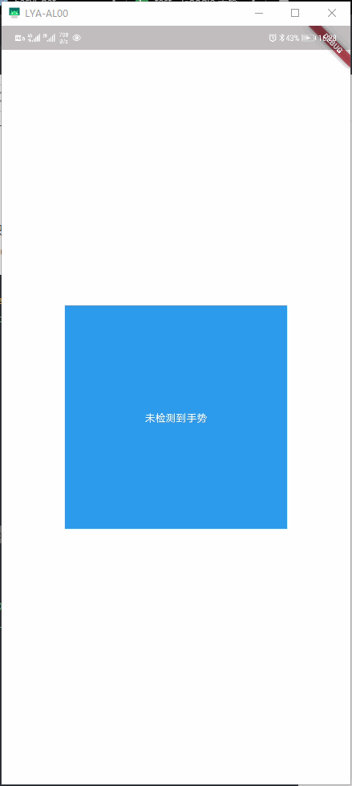

5. 在模拟器上检测不到双击双击事件，上面的效果图是我连接手机测试的
6. 注意： 当同时监听 `onTap` 和 `onDoubleTap` 事件时，当用户触发 `tap` 事件时，会有 200 毫秒左右的延时，这是因为当用户点击完之后很可能会再次点击以触发双击事件，所以 `GestureDetector` 会等一段时间来确定是否为双击事件。如果用户只监听了 `onTap`（没有监听 `onDoubleTap`）事件时，则没有延时

#### Ⅱ、拖动、滑动

1. 一次完整的手势过程是指用户手指按下到抬起的整个过程，期间，用户按下手指后可能会移动，也可能不会移动。
2. `GestureDetector` 对于拖动和滑动事件是没有区分的，他们本质上是一样的。
3. `GestureDetector` 会将要监听的组件的原点（左上角）作为本次手势的原点，当用户在监听的组件上按下手指时，手势识别就会开始。下面我们看一个拖动圆形字母 A 的示例：
4. `main` 主启动方法

```dart
import 'package:flutter/material.dart';

import '08_事件处理与通知/02_手势识别/01_GestureDetector_点击、双击、长按.dart';
import '08_事件处理与通知/02_手势识别/02_GestureDetector_拖动、滑动.dart';


// 入口方法
void main() => runApp(const MyApp());

class MyApp extends StatelessWidget {
  const MyApp({Key? key}) : super(key: key);

  @override
  Widget build(BuildContext context) {
    /**
     * MaterialApp 是 Flutter 提供的一个小部件，用于创建一个包含 Material Design 样式和功能的应用程序。
     * 它是一个顶层小部件，用于为整个应用程序提供一致的主题和样式。
     * 在 MaterialApp 中，你可以设置应用程序的标题、主题、路由和其他全局属性
     */
    return const MaterialApp(
      /**
       * home 是 MaterialApp 的一个属性，用于指定应用程序的主页。它接受一个 Widget 作为参数，用于定义主页的内容
       * Scaffold 是一个用于创建基本页面布局的小部件。
       * Scaffold 小部件提供了一个应用程序的基本布局结构，包括顶部的应用栏、底部的导航栏、抽屉菜单等。
       * 它是一个非常常用的小部件，常用于创建具有标准 Material Design 布局的页面
       */
        home: Scaffold(
          // 设置背景颜色为白色
            backgroundColor: Colors.white,
            /**
             * body: 用于定义页面的主要内容区域
             * SafeArea 是一个小部件，作用是为其子部件提供一个安全的区域，来避免遮挡了屏幕的物理部件（如刘海屏或下方的 Home 键）
             */
            body: SafeArea(
                child: GestureDetector2Component()
            )
        )
    );
  }
}
```

5. `02_GestureDetector_拖动、滑动.dart` 拖动、滑动方法

```dart
import 'package:flutter/material.dart';

class GestureDetector2Component extends StatefulWidget {
  const GestureDetector2Component({Key? key}) : super(key: key);

  @override
  _GestureDetector2ComponentState createState() => _GestureDetector2ComponentState();
}

class _GestureDetector2ComponentState extends State<GestureDetector2Component> {
  // 距顶部的偏移
  double _top = 0.0;
  // 距左边的偏移
  double _left = 0.0;

  @override
  Widget build(BuildContext context) {
    // Stack 允许子部件堆叠，可使用 Positioned 根据 Stack 的四个角来定位子部件。
    return Stack(
      children: [
        // Positioned 是一个小部件，它可以控制子部件的位置
        Positioned(
          top: _top,
          left: _left,
          // GestureDetector 是一个小部件，用于手势识别
          child: GestureDetector(
            // CircleAvatar 是一个小部件，用于绘制圆形头像
            child: const CircleAvatar(child: Text("A")),
            // 手指按下时会触发此回调
            onPanDown: (DragDownDetails e) {
              /**
               * 打印手指按下的位置(相对于屏幕)
               * globalPosition 属性是一个 Offset 对象，它表示全局坐标，即相对于屏幕左上角的坐标。
               */
              print("用户手指按下：${e.globalPosition}");
            },
            // 手指滑动时会触发此回调
            onPanUpdate: (DragUpdateDetails e) {
              // 用户手指滑动时，更新偏移，重新构建
              setState(() {
                /**
                 * 当用户在屏幕上滑动时，会触发多次Update事件
                 * delta 属性是一个 Offset 对象，它表示相对于上一个事件的偏移量。
                 */
                _left += e.delta.dx;
                _top += e.delta.dy;
              });
            },
            onPanEnd: (DragEndDetails e){
              /**
               * 打印滑动结束时在 x、y 轴上的速度
               * velocity 属性是一个 Offset 对象，它表示在滑动结束时的速度。
               * velocity.pixelsPerSecond.dx 表示水平方向的速度，velocity.pixelsPerSecond.dy 表示垂直方向的速度。
               * 注意：velocity 是一个速度，它是有方向的，所以它是一个 Offset 对象。
               */
              print("用户手指抬起：${e.velocity}");
            },
          )
        )
      ],
    );
  }

}
```

6. 效果：

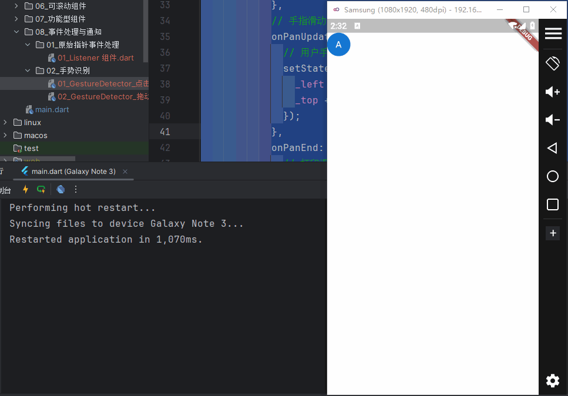

#### Ⅲ、缩放

1. GestureDetector 可以监听缩放事件，下面示例演示了一个简单的图片缩放效果：
2. `main` 主方法

```dart
import 'package:flutter/material.dart';

import '08_事件处理与通知/02_手势识别/01_GestureDetector_点击、双击、长按.dart';
import '08_事件处理与通知/02_手势识别/02_GestureDetector_拖动、滑动.dart';
import '08_事件处理与通知/02_手势识别/03_GestureDetector_缩放.dart';


// 入口方法
void main() => runApp(const MyApp());

class MyApp extends StatelessWidget {
  const MyApp({Key? key}) : super(key: key);

  @override
  Widget build(BuildContext context) {
    /**
     * MaterialApp 是 Flutter 提供的一个小部件，用于创建一个包含 Material Design 样式和功能的应用程序。
     * 它是一个顶层小部件，用于为整个应用程序提供一致的主题和样式。
     * 在 MaterialApp 中，你可以设置应用程序的标题、主题、路由和其他全局属性
     */
    return const MaterialApp(
      /**
       * home 是 MaterialApp 的一个属性，用于指定应用程序的主页。它接受一个 Widget 作为参数，用于定义主页的内容
       * Scaffold 是一个用于创建基本页面布局的小部件。
       * Scaffold 小部件提供了一个应用程序的基本布局结构，包括顶部的应用栏、底部的导航栏、抽屉菜单等。
       * 它是一个非常常用的小部件，常用于创建具有标准 Material Design 布局的页面
       */
        home: Scaffold(
          // 设置背景颜色为白色
            backgroundColor: Colors.white,
            /**
             * body: 用于定义页面的主要内容区域
             * SafeArea 是一个小部件，作用是为其子部件提供一个安全的区域，来避免遮挡了屏幕的物理部件（如刘海屏或下方的 Home 键）
             */
            body: SafeArea(
                child: GestureDetector3Component()
            )
        )
    );
  }
}
```

3. `03_GestureDetector_缩放.dart`缩放方法

```dart
import 'package:flutter/material.dart';

class GestureDetector3Component extends StatefulWidget {
  const GestureDetector3Component({Key? key}) : super(key: key);

  @override
  _GestureDetector3ComponentState createState() => _GestureDetector3ComponentState();
}

class _GestureDetector3ComponentState extends State<GestureDetector3Component> {
  // 通过修改图片宽度来达到缩放效果
  double _width = 200.0;

  @override
  Widget build(BuildContext context) {
    // Center 居中布局
    return Center(
      // GestureDetector 手势识别
      child: GestureDetector(
        // 指定宽度，高度自适应
        child: Image.asset("asset/images/QQ图片20220920105928.jpg", width: _width),
        // 缩放事件
        onScaleUpdate: (ScaleUpdateDetails details) {
          setState(() {
            //缩放倍数在0.8到10倍之间
            _width = 200 * details.scale.clamp(.8, 10.0);
          });
        },
      ),
    );
  }

}
```

4. 效果：


### ②、GestureRecognizer 针事件转换

1. `GestureDetector` 内部是使用一个或多个 `GestureRecognizer` 来识别各种手势的，而 `GestureRecognizer` 的作用就是通过 `Listener` 来将原始指针事件转换为语义手势，`GestureDetector` 直接可以接收一个子 `widget`。
2. `GestureRecognizer` 是一个抽象类，一种手势的识别器对应一个 `GestureRecognizer` 的子类，Flutter 实现了丰富的手势识别器，我们可以直接使用。
3. 假设我们要给一段富文本（RichText）的不同部分分别添加点击事件处理器，但是 `TextSpan` 并不是一个 widget，这时我们不能用 `GestureDetector`，但 `TextSpan` 有一个 `recognizer` 属性，它可以接收一个 `GestureRecognizer`。假设我们需要在点击时给文本变色：
4. `main` 主方法

```dart
import 'package:flutter/material.dart';

import '08_事件处理与通知/02_手势识别/04_GestureRecognizer.dart';


// 入口方法
void main() => runApp(const MyApp());

class MyApp extends StatelessWidget {
  const MyApp({Key? key}) : super(key: key);

  @override
  Widget build(BuildContext context) {
    /**
     * MaterialApp 是 Flutter 提供的一个小部件，用于创建一个包含 Material Design 样式和功能的应用程序。
     * 它是一个顶层小部件，用于为整个应用程序提供一致的主题和样式。
     * 在 MaterialApp 中，你可以设置应用程序的标题、主题、路由和其他全局属性
     */
    return const MaterialApp(
      /**
       * home 是 MaterialApp 的一个属性，用于指定应用程序的主页。它接受一个 Widget 作为参数，用于定义主页的内容
       * Scaffold 是一个用于创建基本页面布局的小部件。
       * Scaffold 小部件提供了一个应用程序的基本布局结构，包括顶部的应用栏、底部的导航栏、抽屉菜单等。
       * 它是一个非常常用的小部件，常用于创建具有标准 Material Design 布局的页面
       */
        home: Scaffold(
          // 设置背景颜色为白色
            backgroundColor: Colors.white,
            /**
             * body: 用于定义页面的主要内容区域
             * SafeArea 是一个小部件，作用是为其子部件提供一个安全的区域，来避免遮挡了屏幕的物理部件（如刘海屏或下方的 Home 键）
             */
            body: SafeArea(
                child: GestureRecognizerComponent()
            )
        )
    );
  }
}
```

5. `01_底部菜单列表.dart` 弹窗方法

```dart
import 'package:flutter/gestures.dart';
import 'package:flutter/material.dart';

class GestureRecognizerComponent extends StatefulWidget {
  const GestureRecognizerComponent({Key? key}) : super(key: key);

  @override
  _GestureRecognizerComponentState createState() => _GestureRecognizerComponentState();
}

class _GestureRecognizerComponentState extends State<GestureRecognizerComponent> {
  // TapGestureRecognizer 是一个手势识别器，它可以识别各种点击手势，包括点击、双击、长按等。
  final TapGestureRecognizer _tapGestureRecognizer = TapGestureRecognizer();
  // 变色开关
  bool _toggle = false;

  @override
  void dispose() {
    // 用到 GestureRecognizer 的话一定要调用其 dispose 方法释放资源
    _tapGestureRecognizer.dispose();
    super.dispose();
  }

  @override
  Widget build(BuildContext context) {
    // Center 居中布局
    return Center(
      // Text.rich() 可以显示多种样式的文本
      child: Text.rich(
        // TextSpan 可以设置文本的样式
        TextSpan(
          children: [
            const TextSpan(text: '你好世界'),
            TextSpan(
              text: '点我变色',
              style: TextStyle(
                fontSize: 30.0,
                color: _toggle ? Colors.blue : Colors.red
              ),
              // recognizer: 为 TextSpan 添加点击事件
              recognizer: _tapGestureRecognizer
                // ..onTap = () {} 语法是 Dart 中的级联操作，允许对同一个对象进行一系列的操作
                ..onTap = () {
                  setState(() {
                    _toggle = !_toggle;
                  });
                }
            ),
            const TextSpan(text: '你好世界')
          ]
        )
      )
    );
  }

}
```

6. 效果：

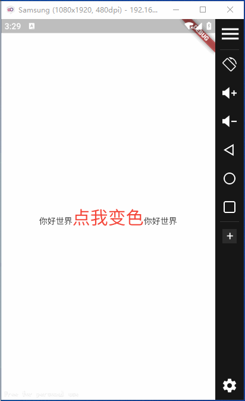

7. 注意：使用 `GestureRecognizer` 后一定要调用其 `dispose()` 方法来释放资源（主要是取消内部的计时器）。

## 3、Flutter 事件机制

### ①、Flutter 事件处理流程

1. Flutter 事件处理流程主要分两步，为了聚焦核心流程，我们以用户触摸事件为例来说明：
	1. 命中测试：当手指按下时，触发 `PointerDownEvent` 事件，按照深度优先遍历当前渲染（render object）树，对每一个渲染对象进行“命中测试”（hit test），如果命中测试通过，则该渲染对象会被添加到一个 `HitTestResult` 列表当中。
	2. 事件分发：命中测试完毕后，会遍历 `HitTestResult` 列表，调用每一个渲染对象的事件处理方法（`handleEvent`）来处理 `PointerDownEvent` 事件，该过程称为“事件分发”（event dispatch）。随后当手指移动时，便会分发 `PointerMoveEvent` 事件。
	3. 事件清理：当手指抬（ `PointerUpEvent` ）起或事件取消时（`PointerCancelEvent`），会先对相应的事件进行分发，分发完毕后会清空 `HitTestResult` 列表。
2. 需要注意：
	1. 命中测试是在 `PointerDownEvent` 事件触发时进行的，一个完成的事件流是 `down > move > up (cancle)`。
	2. 如果父子组件都监听了同一个事件，则子组件会比父组件先响应事件。这是因为命中测试过程是按照深度优先规则遍历的，所以子渲染对象会比父渲染对象先加入 `HitTestResult` 列表，又因为在事件分发时是从前到后遍历 `HitTestResult` 列表的，所以子组件比父组件会更先被调用 `handleEvent` 。
3. 下面我们从代码层面看一些整个事件处理流程：

```dart
// 触发新事件时，flutter 会调用此方法
void _handlePointerEventImmediately(PointerEvent event) {
  HitTestResult? hitTestResult;
  if (event is PointerDownEvent ) {
    hitTestResult = HitTestResult();
    // 发起命中测试
    hitTest(hitTestResult, event.position);
    if (event is PointerDownEvent) {
      _hitTests[event.pointer] = hitTestResult;
    }
  } else if (event is PointerUpEvent || event is PointerCancelEvent) {
    //获取命中测试的结果，然后移除它
    hitTestResult = _hitTests.remove(event.pointer);
  } else if (event.down) { // PointerMoveEvent
    //直接获取命中测试的结果
    hitTestResult = _hitTests[event.pointer];
  }
  // 事件分发
  if (hitTestResult != null) {
    dispatchEvent(event, hitTestResult);
  }
}
```

4. 上面代码只是核心代码，完整的代码位于 `GestureBinding` 实现中。下面我们分别来介绍一些命中测试和事件分发过程

### ②、命中测试详解

#### Ⅰ、命中测试的起点

1. 一个对象是否可以响应事件，取决于在其对命中测试过程中是否被添加到了 `HitTestResult` 列表 ，如果没有被添加进去，则后续的事件分发将不会分发给自己。下面我们看一下命中测试的过程：当发生用户事件时，Flutter  会从根节点（RenderView）开始调用它 `hitTest()` 。

```dart
@override
void hitTest(HitTestResult result, Offset position) {
  //从根节点开始进行命中测试
  renderView.hitTest(result, position: position); 
  // 会调用 GestureBinding 中的 hitTest()方法，我们将在下一节中介绍。
  super.hitTest(result, position); 
}
```

2. 上面代码位于 `RenderBinding` 中，核心代码只有两行，整体是命中测试分两步，我们来解释一下：
3. 第一步： `renderView` 是 `RenderView` 对应的 `RenderObject` 对象， `RenderObject` 对象的 `hitTest` 方法主要功能是：从该节点出发，按照深度优先的顺序递归遍历子树（渲染树）上的每一个节点并对它们进行命中测试。这个过程称为“渲染树命中测试”。注意，为了表述方便，“渲染树命中测试”，也可以表述为组件树或节点树命中测试，只是我们需要知道，命中测试的逻辑都在 `RenderObject` 中，而并非在 `Widget` 或 `Element` 中。
4. 第二步：渲染树命中测试完毕后，会调用 `GestureBinding` 的 `hitTest` 方法，该方法主要用于处理手势，我们会在后面介绍。

#### Ⅱ、渲染树命中测试过程

1. 渲染树的命中测试流程就是父节点 `hitTest` 方法中不断调用子节点 `hitTest` 方法的递归过程。下面是 `RenderView` 的 `hitTest()` 源码：

```dart
// 发起命中测试，position 为事件触发的坐标（如果有的话）。
bool hitTest(HitTestResult result, { Offset position }) {
  if (child != null)
    child.hitTest(result, position: position); //递归对子树进行命中测试
  //根节点会始终被添加到HitTestResult列表中
  result.add(HitTestEntry(this)); 
  return true;
}
```

2. 因为 `RenderView` 只有一个孩子，所以直接调用 `child.hitTest` 即可。如果一个渲染对象有多个子节点，则命中测试逻辑为：如果任意一个子节点通过了命中测试或者当前节点“强行声明”自己通过了命中测试，则当前节点会通过命中测试。我们以 `RenderBox` 为例，看看它的 `hitTest()` 实现：

```dart
bool hitTest(HitTestResult result, { @required Offset position }) {
  ...  
  if (_size.contains(position)) { // 判断事件的触发位置是否位于组件范围内
    if (hitTestChildren(result, position: position) || hitTestSelf(position)) {
      result.add(BoxHitTestEntry(this, position));
      return true;
    }
  }
  return false;
}
```

3. 上面代码中：
	1. `hitTestChildren()` 功能是判断是否有子节点通过了命中测试，如果有，则会将子组件添加到 `HitTestResult` 中同时返回 `true`；如果没有则直接返回 `false`。该方法中会递归调用子组件的 `hitTest` 方法。
	2. `hitTestSelf()` 决定自身是否通过命中测试，如果节点需要确保自身一定能响应事件可以重写此函数并返回true ，相当于“强行声明”自己通过了命中测试。
4. 需要注意，节点通过命中测试的标志是它被添加到 `HitTestResult` 列表中，而不是它 `hitTest` 的返回值，虽然大所数情况下节点通过命中测试就会返回 `true`，但是由于开发者在自定义组件时是可以重写 `hitTest` 的，所以有可能会在在通过命中测试时返回 `false`，或者未通过命中测试时返回 `true`，当然这样做并不好，我们在自定义组件时应该尽可能避免，但是在有些需要自定义命中测试流程的场景下可能就需要打破这种默契，比如我们将在本节后面实现的 `HitTestBlocker` 组件。
5. 所以整体逻辑就是：
	1. 先判断事件的触发位置是否位于组件范围内，如果不是则不会通过命中测试，此时 `hitTest` 返回 `false`，如果是则到第二步。
	2. 会先调用 `hitTestChildren()` 判断是否有子节点通过命中测试，如果是，则将当前节点添加到 `HitTestResult` 列表，此时 `hitTest` 返回 `true`。即只要有子节点通过了命中测试，那么它的父节点（当前节点）也会通过命中测试。
	3. 如果没有子节点通过命中测试，则会取 `hitTestSelf` 方法的返回值，如果返回值为 `true`，则当前节点通过命中测试，反之则否。
6. 如果当前节点有子节点通过了命中测试或者当前节点自己通过了命中测试，则将当前节点添加到 `HitTestResult` 中。又因为 `hitTestChildren()` 中会递归调用子组件的 `hitTest` 方法，所以组件树的命中测试顺序深度优先的，即如果通过命中测试，子组件会比父组件会先被加入 `HitTestResult` 中。
7. 我们看看这两个方法默认实现如下：

```dart
@protected
bool hitTestChildren(HitTestResult result, { Offset position }) => false;

@protected
bool hitTestSelf(Offset position) => false;
```

8. 如果组件包含多个子组件，就必须重写 `hitTestChildren()` 方法，该方法中应该调用每一个子组件的 `hitTest` 方法，比如我们看看 `RenderBoxContainerDefaultsMixin` 中的实现：

```dart
// 子类的 hitTestChildren() 中会直接调用此方法
bool defaultHitTestChildren(BoxHitTestResult result, { required Offset position }) {
   // 遍历所有子组件(子节点从后向前遍历)
  ChildType? child = lastChild;
  while (child != null) {
    final ParentDataType childParentData = child.parentData! as ParentDataType;
    // isHit 为当前子节点调用hitTest() 的返回值
    final bool isHit = result.addWithPaintOffset(
      offset: childParentData.offset,
      position: position,
      //调用子组件的 hitTest方法，
      hitTest: (BoxHitTestResult result, Offset? transformed) {
        return child!.hitTest(result, position: transformed!);
      },
    );
    // 一旦有一个子节点的 hitTest() 方法返回 true，则终止遍历，直接返回true
    if (isHit) return true;
    child = childParentData.previousSibling;
  }
  return false;
}

  bool addWithPaintOffset({
    required Offset? offset,
    required Offset position,
    required BoxHitTest hitTest,
  }) {
    ...// 省略无关代码
    final bool isHit = hitTest(this, transformedPosition);
    return isHit; // 返回 hitTest 的执行结果
  }
```

9. 我们可以看到上面代码的主要逻辑是遍历调用子组件的 `hitTest()` 方法，同时提供了一种中断机制：即遍历过程中只要有子节点的 `hitTest()` 返回了 `true` 时：
	1. 会终止子节点遍历，这意味着该子节点前面的兄弟节点将没有机会通过命中测试。注意，兄弟节点的遍历倒序的。
	2. 父节点也会通过命中测试。因为子节点 `hitTest()` 返回了 `true` 导父节点 `hitTestChildren` 也会返回 `true`，最终会导致 父节点的 `hitTest` 返回 `true`，父节点被添加到 `HitTestResult` 中。
10. 当子节点的 `hitTest()` 返回了 `false` 时，继续遍历该子节点前面的兄弟节点，对它们进行命中测试，如果所有子节点都返回 `false` 时，则父节点会调用自身的 `hitTestSelf` 方法，如果该方法也返回 `false`，则父节点就会被认为没有通过命中测试。
11. 下面思考两个问题：
	1. 为什么要制定这个中断呢？因为一般情况下兄弟节点占用的布局空间是不重合的，因此当用户点击的坐标位置只会有一个节点，所以一旦找到它后（通过了命中测试，`hitTest` 返回 `true`），就没有必要再判断其他兄弟节点了。但是也有例外情况，比如在 `Stack` 布局中，兄弟组件的布局空间会重叠，如果我们想让位于底部的组件也能响应事件，就得有一种机制，能让我们确保：即使找到了一个节点，也不应该终止遍历，也就是说所有的子组件的 `hitTest` 方法都必须返回 `false`！为此，Flutter 中通过 `HitTestBehavior` 来定制这个过程，这个我们会在本节后面介绍。
	2. 为什么兄弟节点的遍历要倒序？同 1 中所述，兄弟节点一般不会重叠，而一旦发生重叠的话，往往是后面的组件会在前面组件之上，点击时应该是后面的组件会响应事件，而前面被遮住的组件不能响应，所以命中测试应该优先对后面的节点进行测试，因为一旦通过测试，就不会再继续遍历了。如果我们按照正向遍历，则会出现被遮住的组件能响应事件，而位于上面的组件反而不能，这明显不符合预期。
12. 我们回到 `hitTestChildren` 上，如果不重写 `hitTestChildren`，则默认直接返回 `false`，这也就意味着后代节点将无法参与命中测试，相当于事件被拦截了，这也正是 `IgnorePointer` 和 `AbsorbPointer` 可以拦截事件下发的原理。
13. 如果 `hitTestSelf` 返回 `true`，则无论子节点中是否有通过命中测试的节点，当前节点自身都会被添加到 `HitTestResult` 中。而 `IgnorePointer` 和 `AbsorbPointer` 的区别就是，前者的 `hitTestSelf` 返回了 `false`，而后者返回了 `true`。
14. 命中测试完成后，所有通过命中测试的节点都被添加到了 `HitTestResult` 中。

### ③、事件分发

1. 事件分发过程很简单，即遍历 `HitTestResult`，调用每一个节点的 `handleEvent` 方法：

```dart
// 事件分发
void dispatchEvent(PointerEvent event, HitTestResult? hitTestResult) {
  ... 
  for (final HitTestEntry entry in hitTestResult.path) {
    entry.target.handleEvent(event.transformed(entry.transform), entry);
  }
}
```

2. 所以组件只需要重写 `handleEvent` 方法就可以处理事件了

### ④、HitTestBehavior

1. 我们先来实现一个能够监听 `PointerDownEvent` 的组件：
2. `main` 主启动类

```dart
import 'package:flutter/material.dart';

import '08_事件处理与通知/03_Flutter事件机制/05_HitTestBehavior/02_PointerDownListenerRoute.dart';


// 入口方法
void main() => runApp(const MyApp());

class MyApp extends StatelessWidget {
  const MyApp({Key? key}) : super(key: key);

  @override
  Widget build(BuildContext context) {
    /**
     * MaterialApp 是 Flutter 提供的一个小部件，用于创建一个包含 Material Design 样式和功能的应用程序。
     * 它是一个顶层小部件，用于为整个应用程序提供一致的主题和样式。
     * 在 MaterialApp 中，你可以设置应用程序的标题、主题、路由和其他全局属性
     */
    return const MaterialApp(
      /**
       * home 是 MaterialApp 的一个属性，用于指定应用程序的主页。它接受一个 Widget 作为参数，用于定义主页的内容
       * Scaffold 是一个用于创建基本页面布局的小部件。
       * Scaffold 小部件提供了一个应用程序的基本布局结构，包括顶部的应用栏、底部的导航栏、抽屉菜单等。
       * 它是一个非常常用的小部件，常用于创建具有标准 Material Design 布局的页面
       */
        home: Scaffold(
          // 设置背景颜色为白色
            backgroundColor: Colors.white,
            /**
             * body: 用于定义页面的主要内容区域
             * SafeArea 是一个小部件，作用是为其子部件提供一个安全的区域，来避免遮挡了屏幕的物理部件（如刘海屏或下方的 Home 键）
             */
            body: SafeArea(
                child: PointerDownListenerRoute()
            )
        )
    );
  }
}
```

3. `01_PointerDownListener.dart` 监听 `PointerDownEvent` 的组件

```dart
import 'package:flutter/cupertino.dart';
import 'package:flutter/rendering.dart';

class PointerDownListener extends SingleChildRenderObjectWidget {
  const PointerDownListener({Key? key, this.onPointerDown, Widget? child}) : super(key: key, child: child);

  /// 定义一个回调函数，用于接收 PointerDownEvent 事件
  final PointerDownEventListener? onPointerDown;

  /// createRenderObject 方法用于创建 RenderObject
  /// RenderObject 是一个抽象类，它定义了一个小部件的渲染逻辑和布局逻辑
  @override
  RenderObject createRenderObject(BuildContext context) => RenderPointerDownListener()..onPointerDown = onPointerDown;

  /// updateRenderObject 方法用于更新 RenderObject；
  @override
  void updateRenderObject(BuildContext context, RenderPointerDownListener renderObject) {
    renderObject.onPointerDown = onPointerDown;
  }
}

/// 定义一个回调函数类型，用于接收 PointerDownEvent 事件
class RenderPointerDownListener extends RenderProxyBox {
  /// 定义一个回调函数，用于接收 PointerDownEvent 事件
  PointerDownEventListener? onPointerDown;

  /// hitTestSelf 方法用于命中测试，返回 true 时表示命中了当前小部件
  @override
  bool hitTestSelf(Offset position) => true; // 始终通过命中测试

  /// handleEvent 方法用于处理事件，它接收两个参数，第一个参数是事件对象，第二个参数是命中测试的结果
  @override
  void handleEvent(PointerEvent event, covariant HitTestEntry entry) {
    // 事件分发时处理事件；如果 onPointerDown 不为空，则调用它
    if (event is PointerDownEvent) onPointerDown?.call(event);
  }
}
```

4. `02_PointerDownListenerRoute.dart` 测试组件

```dart
import 'package:flutter/cupertino.dart';
import 'package:flutter/material.dart';

import '01_PointerDownListener.dart';

class PointerDownListenerRoute extends StatelessWidget {
  const PointerDownListenerRoute({Key? key}) : super(key: key);

  @override
  Widget build(BuildContext context) {
    // PointerDownListener 是一个自定义的小部件，它继承自 SingleChildRenderObjectWidget
    return PointerDownListener(
      // Container 是一个常用的 UI 小部件，它可以用来创建一个矩形视觉元素
      child: Container(
        alignment: Alignment.center,
        color: Colors.blue,
        width: 200,
        height: 100,
        child: const Text(
          '点击此处',
          style: TextStyle(color: Colors.white),
        ),

      ),
      onPointerDown: (e) => print('按下'),
    );
  }
}
```

5. 点击文本后控制台就会打印 'down'。
6. `Listener` 的实现和 `PointerDownListener` 的实现原理差不多，有两点不同：
	1. `Listener` 监听的事件类型更多一些。
	2. `Listener` 的 `hitTestSelf` 并不是一直返回 `true`。
7. 这里需要重点说一下第二点。 `Listener` 组件有一个 `behavior` 参数，我们之前并没有介绍，下面我们仔细介绍一下。通过查看 `Listener` 源码，发现它的渲染对象 `RenderPointerListener` 继承了 `RenderProxyBoxWithHitTestBehavior` 类：

```dart
abstract class RenderProxyBoxWithHitTestBehavior extends RenderProxyBox {
  //[behavior] 的默认值为 [HitTestBehavior.deferToChild].
  RenderProxyBoxWithHitTestBehavior({
    this.behavior = HitTestBehavior.deferToChild,
    RenderBox? child,
  }) : super(child);

  HitTestBehavior behavior;

  @override
  bool hitTest(BoxHitTestResult result, { required Offset position }) {
    bool hitTarget = false;
    if (size.contains(position)) {
      hitTarget = hitTestChildren(result, position: position) || hitTestSelf(position);
      if (hitTarget || behavior == HitTestBehavior.translucent) //1
        result.add(BoxHitTestEntry(this, position)); // 通过命中测试
    }
    return hitTarget;
  }

  @override
  bool hitTestSelf(Offset position) => behavior == HitTestBehavior.opaque; //2

}
```

8. 我们看到 `behavior` 在 `hitTest` 和 `hitTestSelf` 中会使用，它的取值会影响 `Listener` 的命中测试结果。我们先看看 `behavior` 都有哪些取值：

```dart
//在命中测试过程中 Listener 组件如何表现。
enum HitTestBehavior {
  // 组件是否通过命中测试取决于子组件是否通过命中测试
  deferToChild,
  // 组件必然会通过命中测试，同时其 hitTest 返回值始终为 true
  opaque,
  // 组件必然会通过命中测试，但其 hitTest 返回值可能为 true 也可能为 false
  translucent,
}
```

9. 它有三个取值，我们结合 `hitTest` 实现来分析一下不同取值的作用：
	1. `behavior` 为 `deferToChild` 时，`hitTestSelf` 返回 `false`，当前组件是否能通过命中测试完全取决于 `hitTestChildren` 的返回值。也就是说只要有一个子节点通过命中测试，则当前组件便会通过命中测试。
	2. `behavior` 为 `opaque` 时，`hitTestSelf` 返回 `true`，`hitTarget` 值始终为 `true`，当前组件通过命中测试。
	3. `behavior` 为 `translucent` 时，`hitTestSelf` 返回 `false`，`hitTarget` 值此时取决于 `hitTestChildren` 的返回值，但是无论 `hitTarget` 值是什么，当前节点都会被添加到 `HitTestResult` 中。
10. 注意，`behavior` 为 `opaque` 和 `translucent` 时当前组件都会通过命中测试，它们的区别是 `hitTest()` 的返回值（hitTarget ）可能不同，所以它们的区别就看 `hitTest()` 的返回值会影响什么，这个我们已经在上面详细介绍过了，下面我们通过一个实例来理解一下

## 4、手势原理与手势冲突

### ①、手势识别原理

1. 手势的识别和处理都是在事件分发阶段的，`GestureDetector` 是一个 `StatelessWidget`， 包含了 `RawGestureDetector`，我们看一下它的 `build` 方法实现：

```dart
@override
Widget build(BuildContext context) {
  final  gestures = <Type, GestureRecognizerFactory>{};
  // 构建 TapGestureRecognizer 
  if (onTapDown != null ||
      onTapUp != null ||
      onTap != null ||
      ... //省略
  ) {
    gestures[TapGestureRecognizer] = GestureRecognizerFactoryWithHandlers<TapGestureRecognizer>(
      () => TapGestureRecognizer(debugOwner: this),
      (TapGestureRecognizer instance) {
        instance
          ..onTapDown = onTapDown
          ..onTapUp = onTapUp
          ..onTap = onTap
          //省略
      },
    );
  }

  
  return RawGestureDetector(
    gestures: gestures, // 传入手势识别器
    behavior: behavior, // 同 Listener 中的 HitTestBehavior
    child: child,
  );
}
```

2. 注意，上面我们删除了很多代码，只保留了 `TapGestureRecognizer`（点击手势识别器） 相关代码，我们以点击手势识别为例讲一下整个过程。`RawGestureDetector` 中会通过 `Listener` 组件监听 `PointerDownEvent` 事件，相关源码如下：

```dart
@override
Widget build(BuildContext context) {
  ... // 省略无关代码
  Widget result = Listener(
    onPointerDown: _handlePointerDown,
    behavior: widget.behavior ?? _defaultBehavior,
    child: widget.child,
  );
}  
 
void _handlePointerDown(PointerDownEvent event) {
  for (final GestureRecognizer recognizer in _recognizers!.values)
    recognizer.addPointer(event);
}  
```

3. 下面我们看一下 `TapGestureRecognizer` 的几个相关方法，由于 `TapGestureRecognizer` 有多层继承关系，合并了一个简化版：

```dart
class CustomTapGestureRecognizer1 extends TapGestureRecognizer {

  void addPointer(PointerDownEvent event) {
    //会将 handleEvent 回调添加到 pointerRouter 中
    GestureBinding.instance!.pointerRouter.addRoute(event.pointer, handleEvent);
  }
  
  @override
  void handleEvent(PointerEvent event) {
    //会进行手势识别，并决定是是调用 acceptGesture 还是 rejectGesture，
  }
  
  @override
  void acceptGesture(int pointer) {
    // 竞争胜出会调用
  }

  @override
  void rejectGesture(int pointer) {
    // 竞争失败会调用
  }
}
```

4. 可以看到当 `PointerDownEvent` 事件触发时，会调用 `TapGestureRecognizer` 的 `addPointer`，在 `addPointer` 中会将 `handleEvent` 方法添加到 `pointerRouter` 中保存起来。这样一来当手势发生变化时只需要在 `pointerRouter` 中取出 `GestureRecognizer` 的 `handleEvent` 方法进行手势识别即可。
5. 正常情况下应该是手势直接作用的对象应该来处理手势，所以一个简单的原则就是同一个手势应该只有一个手势识别器生效，为此，手势识别才映入了手势竞技场（Arena）的概念，简单来讲：
	1. 每一个手势识别器（GestureRecognizer）都是一个“竞争者”（GestureArenaMember），当发生指针事件时，他们都要在“竞技场”去竞争本次事件的处理权，默认情况最终只有一个“竞争者”会胜出(win)。
	2. `GestureRecognizer` 的 `handleEvent` 中会识别手势，如果手势发生了某个手势，竞争者可以宣布自己是否胜出，一旦有一个竞争者胜出，竞技场管理者（GestureArenaManager）就会通知其他竞争者失败。
	3. 胜出者的 `acceptGesture` 会被调用，其余的 `rejectGesture` 将会被调用。
6. 上一节我们说过命中测试是从 `RenderBinding` 的 `hitTest` 开始的：

```dart
@override
void hitTest(HitTestResult result, Offset position) {
  // 从根节点开始进行命中测试
  renderView.hitTest(result, position: position); 
  // 会调用 GestureBinding 中的 hitTest()方法，我们将在下一节中介绍。
  super.hitTest(result, position); 
}
```

7. 渲染树命中测试完成后会调用 `GestureBinding` 中的 `hitTest()` 方法：

```dart
@override // from HitTestable
void hitTest(HitTestResult result, Offset position) {
  result.add(HitTestEntry(this));
}
```

8. 很简单， `GestureBinding` 也通过命中测试了，这样的话在事件分发阶段，`GestureBinding` 的 `handleEvent` 便也会被调用，由于它是最后被添加到 `HitTestResult` 中的，所以在事件分发阶段 `GestureBinding` 的 `handleEvent` 会在最后被调用：

```dart
@override 
void handleEvent(PointerEvent event, HitTestEntry entry) {
  // 会调用在 pointerRouter 中添加的 GestureRecognizer 的 handleEvent
  pointerRouter.route(event);
  if (event is PointerDownEvent) {
    // 分发完毕后，关闭竞技场
    gestureArena.close(event.pointer);
  } else if (event is PointerUpEvent) {
    gestureArena.sweep(event.pointer);
  } else if (event is PointerSignalEvent) {
    pointerSignalResolver.resolve(event);
  }
}
```

9. `gestureArena` 是 `GestureArenaManager` 类实例，负责管理竞技场。
10. 上面关键的代码就是第一行，功能是会调用之前在 `pointerRouter` 中添加的 `GestureRecognizer` 的 `handleEvent`，不同 `GestureRecognizer` 的 `handleEvent` 会识别不同的手势，然后它会和 `gestureArena` 交互（如果当前的 `GestureRecognizer` 胜出，需要 `gestureArena` 去通知其他竞争者它们失败了），最终，如果当前 `GestureRecognizer` 胜出，则最终它的 `acceptGesture` 会被调用，如果失败则其 `rejectGesture` 将会被调用，因为这部分代码不同的 `GestureRecognizer` 会不同，知道做了什么就行，有兴趣可以自行查看源码。

### ②、手势竞争

1. 如果对一个组件同时监听水平和垂直方向的拖动手势，当我们斜着拖动时哪个方向的拖动手势回调会被触发？实际上取决于第一次移动时两个轴上的位移分量，哪个轴的大，哪个轴在本次滑动事件竞争中就胜出。
2. 上面已经说过，每一个手势识别器（GestureRecognizer）都是一个“竞争者”（GestureArenaMember），当发生指针事件时，他们都要在“竞技场”去竞争本次事件的处理权，默认情况最终只有一个“竞争者”会胜出(win)。
3. 例如，假设有一个 ListView，它的第一个子组件也是 ListView，如果现在滑动这个子 ListView，父 ListView 会动吗？答案是否定的，这时只有子 ListView 会动，因为这时子 ListView 会胜出而获得滑动事件的处理权。
4. 下面我们看一个简单的例子：

```dart
GestureDetector( //GestureDetector2
  onTapUp: (x)=>print("2"), // 监听父组件 tapUp 手势
  child: Container(
    width:200,
    height: 200,
    color: Colors.red,
    alignment: Alignment.center,
    child: GestureDetector( //GestureDetector1
      onTapUp: (x)=>print("1"), // 监听子组件 tapUp 手势
      child: Container(
        width: 50,
        height: 50,
        color: Colors.grey,
      ),
    ),
  ),
);
```

5. 当我们点击子组件（灰色区域）时，控制台只会打印 “1”, 并不会打印 “2”，这是因为手指抬起后，`GestureDetector1` 和 `GestureDetector` 2 会发生竞争，判定获胜的规则是“子组件优先”，所以 `GestureDetector1` 获胜，因为只能有一个“竞争者”胜出，所以 `GestureDetector` 2 将被忽略。这个例子中想要解决冲突的方法很简单，将 `GestureDetector` 换为 `Listener` 即可，具体原因我们在后面解释。
6. 我们再看一个例子，我们以拖动手势为例，同时识别水平和垂直方向的拖动手势，当用户按下手指时就会触发竞争（水平方向和垂直方向），一旦某个方向“获胜”，则直到当次拖动手势结束都会沿着该方向移动。代码如下：

```dart
class _BothDirectionTest extends StatefulWidget {
  @override
  _BothDirectionTestState createState() => _BothDirectionTestState();
}

class _BothDirectionTestState extends State<_BothDirectionTest> {
  double _top = 0.0;
  double _left = 0.0;

  @override
  Widget build(BuildContext context) {
    return Stack(
      children: <Widget>[
        Positioned(
          top: _top,
          left: _left,
          child: GestureDetector(
            child: CircleAvatar(child: Text("A")),
            //垂直方向拖动事件
            onVerticalDragUpdate: (DragUpdateDetails details) {
              setState(() {
                _top += details.delta.dy;
              });
            },
            onHorizontalDragUpdate: (DragUpdateDetails details) {
              setState(() {
                _left += details.delta.dx;
              });
            },
          ),
        )
      ],
    );
  }
}
```

7. 示例运行后，每次拖动只会沿一个方向移动（水平或垂直），而竞争发生在手指按下后首次移动（move）时，此例中具体的“获胜”条件是：首次移动时的位移在水平和垂直方向上的分量大的一个获胜。

### ③、多手势冲突

1. 由于手势竞争最终只有一个胜出者，所以，当我们通过一个 `GestureDetector` 监听多种手势时，也可能会产生冲突。假设有一个 widget，它可以左右拖动，现在我们也想检测在它上面手指按下和抬起的事件，代码如下：

```dart
class GestureConflictTestRouteState extends State<GestureConflictTestRoute> {
  double _left = 0.0;
  @override
  Widget build(BuildContext context) {
    return Stack(
      children: <Widget>[
        Positioned(
          left: _left,
          child: GestureDetector(
              child: CircleAvatar(child: Text("A")), //要拖动和点击的widget
              onHorizontalDragUpdate: (DragUpdateDetails details) {
                setState(() {
                  _left += details.delta.dx;
                });
              },
              onHorizontalDragEnd: (details){
                print("onHorizontalDragEnd");
              },
              onTapDown: (details){
                print("down");
              },
              onTapUp: (details){
                print("up");
              },
          ),
        )
      ],
    );
  }
}
```

2. 现在我们按住圆形“A”拖动然后抬起手指，控制台日志如下:

```dart
I/flutter (17539): down
I/flutter (17539): onHorizontalDragEnd
```

3. 我们发现没有打印"up"，这是因为在拖动时，刚开始按下手指且没有移动时，拖动手势还没有完整的语义，此时 `TapDown` 手势胜出(win)，此时打印"down"，而拖动时，拖动手势会胜出，当手指抬起时，`onHorizontalDragEnd` 和 `onTapUp` 发生了冲突，但是因为是在拖动的语义中，所以 `onHorizontalDragEnd` 胜出，所以就会打印 “onHorizontalDragEnd”。
4. 如果我们的代码逻辑中，对于手指按下和抬起是强依赖的，比如在一个轮播图组件中，我们希望手指按下时，暂停轮播，而抬起时恢复轮播，但是由于轮播图组件中本身可能已经处理了拖动手势（支持手动滑动切换），甚至可能也支持了缩放手势，这时我们如果在外部再用 `onTapDown`、`onTapUp` 来监听的话是不行的。这时我们应该怎么做？其实很简单，通过 `Listener` 监听原始指针事件就行：

```dart
Positioned(
  top:80.0,
  left: _leftB,
  child: Listener(
    onPointerDown: (details) {
      print("down");
    },
    onPointerUp: (details) {
      //会触发
      print("up");
    },
    child: GestureDetector(
      child: CircleAvatar(child: Text("B")),
      onHorizontalDragUpdate: (DragUpdateDetails details) {
        setState(() {
          _leftB += details.delta.dx;
        });
      },
      onHorizontalDragEnd: (details) {
        print("onHorizontalDragEnd");
      },
    ),
  ),
)
```

### ④、解决手势冲突

1. 手势是对原始指针的语义化的识别，手势冲突只是手势级别的，也就是说只会在组件树中的多个  `GestureDetector` 之间才有冲突的场景，如果压根就没有使用 `GestureDetector` 则不存在所谓的冲突，因为每一个节点都能收到事件，只是在 `GestureDetector` 中为了识别语义，它会去决定哪些子节点应该忽略事件，哪些节点应该生效。
2. 解决手势冲突的方法有两种：
	1. 使用 `Listener`。这相当于跳出了手势识别那套规则。
	2. 自定义手势手势识别器（ Recognizer）。

#### Ⅰ、通过 Listener 解决手势冲突

1. 通过 `Listener` 解决手势冲突的原因是竞争只是针对手势的，而 `Listener` 是监听原始指针事件，原始指针事件并非语义话的手势，所以根本不会走手势竞争的逻辑，所以也就不会相互影响。拿上面两个 `Container` 嵌套的例子来说，通过 `Listener` 的解决方式为：

```dart
Listener(  // 将 GestureDetector 换为 Listener 即可
  onPointerUp: (x) => print("2"),
  child: Container(
    width: 200,
    height: 200,
    color: Colors.red,
    alignment: Alignment.center,
    child: GestureDetector(
      onTap: () => print("1"),
      child: Container(
        width: 50,
        height: 50,
        color: Colors.grey,
      ),
    ),
  ),
);
```

2. 代码很简单，只需将 `GestureDetector` 换为 `Listener` 即可，可以两个都换，也可以只换一个。
3. 可以看见，通过 `Listener` 直接识别原始指针事件来解决冲突的方法很简单，因此，当遇到手势冲突时，我们应该优先考虑 `Listener` 。

#### Ⅱ、通过自定义 Recognizer 解决手势冲突

1. 自定义手势识别器的方式比较麻烦，原理是当确定手势竞争胜出者时，会调用胜出者的 `acceptGesture` 方法，表示“宣布成功”，然后会调用其他手势识别其的 `rejectGesture` 方法，表示“宣布失败”。
2. 既然如此，我们可以自定义手势识别器（Recognizer），然后去重写它的 `rejectGesture` 方法：在里面调用 `acceptGesture` 方法，这就相当于它失败是强制将它也变成竞争的成功者了，这样它的回调也就会执行。
3. 我们先自定义tap手势识别器（Recognizer）：

```dart
class CustomTapGestureRecognizer extends TapGestureRecognizer {
  @override
  void rejectGesture(int pointer) {
    //不，我不要失败，我要成功
    //super.rejectGesture(pointer);
    //宣布成功
    super.acceptGesture(pointer);
  }
}

//创建一个新的GestureDetector，用我们自定义的 CustomTapGestureRecognizer 替换默认的
RawGestureDetector customGestureDetector({
  GestureTapCallback? onTap,
  GestureTapDownCallback? onTapDown,
  Widget? child,
}) {
  return RawGestureDetector(
    child: child,
    gestures: {
      CustomTapGestureRecognizer:
          GestureRecognizerFactoryWithHandlers<CustomTapGestureRecognizer>(
        () => CustomTapGestureRecognizer(),
        (detector) {
          detector.onTap = onTap;
        },
      )
    },
  );
}
```

4. 通过 `RawGestureDetector` 来自定义 `customGestureDetector`，`GestureDetector` 中也是通过  `RawGestureDetector` 来包装各种 `Recognizer` 来实现的，我们需要自定义哪个 `Recognizer`，就添加哪个即可。
5. 现在我们看看修改调用代码：

```dart
customGestureDetector( // 替换 GestureDetector
  onTap: () => print("2"),
  child: Container(
    width: 200,
    height: 200,
    color: Colors.red,
    alignment: Alignment.center,
    child: GestureDetector(
      onTap: () => print("1"),
      child: Container(
        width: 50,
        height: 50,
        color: Colors.grey,
      ),
    ),
  ),
);
```

6. 这样就 OK 了，需要注意，这个例子同时说明了一次手势处理过程也是可以有多个胜出者的

## 5、事件总线

1. 在 App 中，我们经常会需要一个广播机制，用以跨页面事件通知，比如一个需要登录的 App 中，页面会关注用户登录或注销事件，来进行一些状态更新。
2. 这时候，一个事件总线便会非常有用，事件总线通常实现了订阅者模式，订阅者模式包含发布者和订阅者两种角色，可以通过事件总线来触发事件和监听事件，本节我们实现一个简单的全局事件总线，我们使用单例模式，代码如下：
3. `01_EventCallback.dart` 事件总线

```dart
/// 订阅者回调签名；函数签名指的是函数的类型和结构，包括函数的参数类型、返回值类型以及函数名。
/// typedef 是 Dart 的关键字，意思是定义一个函数类型。
/// 定义了这个函数类型以后，可以使用 EventCallback 定义变量，这样就可以复用这个函数签名。
typedef void EventCallback(arg);

class EventBus {
  // 私有构造函数
  EventBus._internal();

  // 保存单例
  static final EventBus _singleton = EventBus._internal();

  // 工厂构造函数
  factory EventBus()=> _singleton;

  // 保存事件订阅者队列，key:事件名(id)，value: 对应事件的订阅者队列
  final _emap = <Object, List<EventCallback>?>{};

  // 添加订阅者
  void on(eventName, EventCallback f) {
    // 如果 _emap[eventName] 为空，则赋值为一个空数组
    _emap[eventName] ??=  <EventCallback>[];
    // 将该事件的订阅者 f 添加到队列中
    _emap[eventName]!.add(f);
  }

  // 移除订阅者
  void off(eventName, [EventCallback? f]) {
    var list = _emap[eventName];
    if (eventName == null || list == null) return;
    if (f == null) {
      _emap[eventName] = null;
    } else {
      list.remove(f);
    }
  }

  // 触发事件，事件触发后该事件所有订阅者会被调用
  void emit(eventName, [arg]) {
    var list = _emap[eventName];
    if (list == null) return;
    int len = list.length - 1;
    // 反向遍历，防止订阅者在回调中移除自身带来的下标错位
    for (var i = len; i > -1; --i) {
      list[i](arg);
    }
  }
}

// 定义一个 top-level（全局）变量，页面引入该文件后可以直接使用 bus
var bus = EventBus();
```

4. `main` 主启动类

```dart
import 'package:flutter/material.dart';

import '08_事件处理与通知/05_事件总线/03_Login.dart';
import '08_事件处理与通知/05_事件总线/02_LoginMonitor.dart';


// 入口方法
void main() => runApp(const MyApp());

class MyApp extends StatelessWidget {
  const MyApp({Key? key}) : super(key: key);

  @override
  Widget build(BuildContext context) {
    /**
     * MaterialApp 是 Flutter 提供的一个小部件，用于创建一个包含 Material Design 样式和功能的应用程序。
     * 它是一个顶层小部件，用于为整个应用程序提供一致的主题和样式。
     * 在 MaterialApp 中，你可以设置应用程序的标题、主题、路由和其他全局属性
     */
    return MaterialApp(
      /**
       * home 是 MaterialApp 的一个属性，用于指定应用程序的主页。它接受一个 Widget 作为参数，用于定义主页的内容
       * Scaffold 是一个用于创建基本页面布局的小部件。
       * Scaffold 小部件提供了一个应用程序的基本布局结构，包括顶部的应用栏、底部的导航栏、抽屉菜单等。
       * 它是一个非常常用的小部件，常用于创建具有标准 Material Design 布局的页面
       */
        home: const Scaffold(
          // 设置背景颜色为白色
          backgroundColor: Colors.white,
          /**
           * body: 用于定义页面的主要内容区域
           * SafeArea 是一个小部件，作用是为其子部件提供一个安全的区域，来避免遮挡了屏幕的物理部件（如刘海屏或下方的 Home 键）
           */
          body: SafeArea(
            child: LoginMonitorComponent()
          )
        ),
      routes: {
        '/login': (context) => const LoginComponent(),
        '/loginMonitor': (context) => const LoginMonitorComponent(),
      },
    );
  }
}
```

5. `02_LoginMonitor.dart` 登录监听页面

```dart
import 'package:flutter/cupertino.dart';
import 'package:flutter/material.dart';

import '01_EventCallback.dart';

class LoginMonitorComponent extends StatefulWidget {
  const LoginMonitorComponent({Key? key}) : super(key: key);

  @override
  _LoginMonitorComponentState createState() => _LoginMonitorComponentState();
}

class _LoginMonitorComponentState extends State<LoginMonitorComponent> {
  var loginMonitor = '未登录';

  @override
  void initState() {
    super.initState();
    // 订阅登录事件
    bus.on('login', (arg) {
      // 更新 Text 的显示
      setState(() {
        loginMonitor = arg; // 假设 loginMonitor 是您用于显示登录信息的变量
      });
      // 打印信息
      print('登录信息: $arg');
    });
  }

  @override
  Widget build(BuildContext context) {
    // Center 是一个小部件，它可以将其子部件树对齐到屏幕中心
    return Center(
      // Column 是一个小部件，它可以在垂直方向排列其子部件
      child: Column(
        // 垂直居中
        mainAxisAlignment: MainAxisAlignment.center,
        children: [
          Text(
            loginMonitor,
            style: const TextStyle(fontSize: 20, color: CupertinoColors.destructiveRed),
          ),
          ElevatedButton(
            child: const Text('跳转至 LoginComponent'),
            onPressed: () { Navigator.pushNamed(context, '/login'); },
          ),
        ],
      )
    );
  }
}
```

6. `03_Login.dart` 登录页面

```dart
import 'package:flutter/cupertino.dart';
import 'package:flutter/material.dart';

import '01_EventCallback.dart';

class LoginComponent extends StatelessWidget {
  const LoginComponent({Key? key}) : super(key: key);

  @override
  Widget build(BuildContext context) {
    // Center 是一个小部件，它可以将其子部件树对齐到屏幕中心
    return Center(
      // Column 是一个小部件，它可以在垂直方向排列其子部件
      child: Column(
        // 垂直居中
        mainAxisAlignment: MainAxisAlignment.center,
        children: [
          ElevatedButton(
            child: const Text('登录'),
            onPressed: () {
              // 发送登录事件
              bus.emit('login', '登录成功');
            },
          ),
          ElevatedButton(
            child: const Text('跳转至 LoginMonitorComponent'),
            onPressed: () { Navigator.pop(context); },
          ),
        ],
      )
    );
  }
}
```

7. 效果：

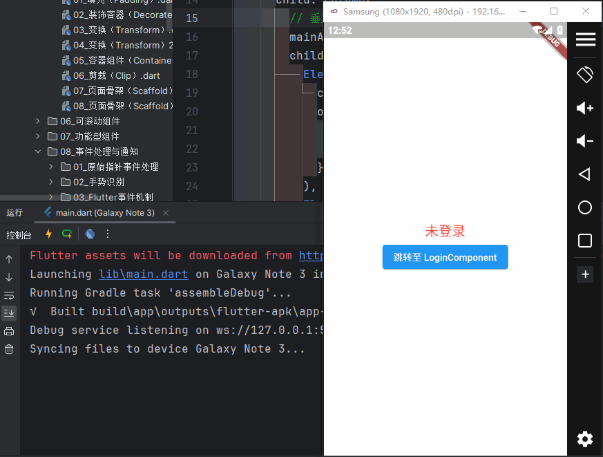

## 6、通知 Notification

1. 通知（Notification）是 Flutter 中一个重要的机制，在 widget 树中，每一个节点都可以分发通知，通知会沿着当前节点向上传递，所有父节点都可以通过 NotificationListener 来监听通知。
2. Flutter 中将这种由子向父的传递通知的机制称为通知冒泡（Notification Bubbling）。通知冒泡和用户触摸事件冒泡是相似的，但有一点不同：通知冒泡可以中止，但用户触摸事件不行。
3. 注意：通知冒泡和 Web 开发中浏览器事件冒泡原理是相似的，都是事件从出发源逐层向上传递，我们可以在上层节点任意位置来监听通知/事件，也可以终止冒泡过程，终止冒泡后，通知将不会再向上传递。

### ①、监听通知

1. Flutter 中很多地方使用了通知，如前面介绍的 `Scrollable` 组件，它在滑动时就会分发滚动通知（ScrollNotification），而 `Scrollbar` 正是通过监听 `ScrollNotification` 来确定滚动条位置的。
2. 下面是一个监听可滚动组件滚动通知的例子：

```dart
NotificationListener(
  onNotification: (notification){
    switch (notification.runtimeType){
      case ScrollStartNotification: print("开始滚动"); break;
      case ScrollUpdateNotification: print("正在滚动"); break;
      case ScrollEndNotification: print("滚动停止"); break;
      case OverscrollNotification: print("滚动到边界"); break;
    }
  },
  child: ListView.builder(
    itemCount: 100,
    itemBuilder: (context, index) {
      return ListTile(title: Text("$index"),);
    }
  ),
);
```

3. 上例中的滚动通知如 `ScrollStartNotification`、`ScrollUpdateNotification` 等都是继承自 `ScrollNotification` 类，不同类型的通知子类会包含不同的信息，比如 `ScrollUpdateNotification` 有一个 `scrollDelta` 属性，它记录了移动的位移，其他通知属性可以自己查看 SDK 文档。
4. 上例中，我们通过 `NotificationListener` 来监听子 `ListView` 的滚动通知的，`NotificationListener` 定义如下：

```dart
class NotificationListener<T extends Notification> extends StatelessWidget {
  const NotificationListener({
    Key key,
    required this.child,
    this.onNotification,
  }) : super(key: key);
 ...//省略无关代码 
}  
```

5. 我们可以看到：
6. `NotificationListener` 继承自 `StatelessWidget` 类，所以它可以直接嵌套到 Widget 树中。
7. `NotificationListener` 可以指定一个模板参数，该模板参数类型必须是继承自 `Notification`；当显式指定模板参数时，`NotificationListener` 便只会接收该参数类型的通知。举个例子，如果我们将上例子代码改为：

```dart
//指定监听通知的类型为滚动结束通知(ScrollEndNotification)
NotificationListener<ScrollEndNotification>(
  onNotification: (notification){
    //只会在滚动结束时才会触发此回调
    print(notification);
  },
  child: ListView.builder(
    itemCount: 100,
    itemBuilder: (context, index) {
      return ListTile(title: Text("$index"),);
    }
  ),
);
```

8. 上面代码运行后便只会在滚动结束时在控制台打印出通知的信息。
9. `onNotification` 回调为通知处理回调，其函数签名如下：

```dart
// 函数签名指的是函数的类型和结构，包括函数的参数类型、返回值类型以及函数名。
typedef NotificationListenerCallback<T extends Notification> = bool Function(T notification);
```

10. 它的返回值类型为布尔值，当返回值为 true 时，阻止冒泡，其父级 Widget 将再也收不到该通知；当返回值为 false 时继续向上冒泡通知。
11. Flutter 的 UI 框架实现中，除了在可滚动组件在滚动过程中会发出 `ScrollNotification` 之外，还有一些其他的通知，如 `SizeChangedLayoutNotification`、`KeepAliveNotification` 、`LayoutChangedNotification` 等，Flutter 正是通过这种通知机制来使父元素可以在一些特定时机来做一些事情

### ②、自定义通知

1. 除了 Flutter 内部通知，我们也可以自定义通知，下面我们看看如何实现自定义通知：
2. 定义一个通知类，要继承自Notification类；

```dart
class MyNotification extends Notification {
  MyNotification(this.msg);
  final String msg;
}
```

2. 分发通知：`Notification` 有一个 `dispatch(context)` 方法，它是用于分发通知的，我们说过 `context` 实际上就是操作 `Element` 的一个接口，它与 `Element` 树上的节点是对应的，通知会从 `context` 对应的 `Element` 节点向上冒泡。
3. 下面我们看一个完整的例子：

```dart
class NotificationRoute extends StatefulWidget {
  @override
  NotificationRouteState createState() {
    return NotificationRouteState();
  }
}

class NotificationRouteState extends State<NotificationRoute> {
  String _msg="";
  @override
  Widget build(BuildContext context) {
    //监听通知  
    return NotificationListener<MyNotification>(
      onNotification: (notification) {
        setState(() {
          _msg+=notification.msg+"  ";
        });
       return true;
      },
      child: Center(
        child: Column(
          mainAxisSize: MainAxisSize.min,
          children: <Widget>[
//           ElevatedButton(
//           onPressed: () => MyNotification("Hi").dispatch(context),
//           child: Text("Send Notification"),
//          ),  
            Builder(
              builder: (context) {
                return ElevatedButton(
                  //按钮点击时分发通知  
                  onPressed: () => MyNotification("Hi").dispatch(context),
                  child: Text("Send Notification"),
                );
              },
            ),
            Text(_msg)
          ],
        ),
      ),
    );
  }
}

class MyNotification extends Notification {
  MyNotification(this.msg);
  final String msg;
}
```

4. 上面代码中，我们每点一次按钮就会分发一个 `MyNotification` 类型的通知，我们在 Widget 根上监听通知，收到通知后我们将通知通过 `Text` 显示在屏幕上。
5. 注意：代码中注释的部分是不能正常工作的，因为这个 `context` 是根 Context，而 `NotificationListener` 是监听的子树，所以我们通过 Builder 来构建 `ElevatedButton`，来获得按钮位置的 `context`。
6. 运行效果如图所示：


### ③、阻止通知冒泡

1. 我们将上面的例子改为：

```dart
class NotificationRouteState extends State<NotificationRoute> {
  String _msg="";
  @override
  Widget build(BuildContext context) {
    //监听通知
    return NotificationListener<MyNotification>(
      onNotification: (notification){
        print(notification.msg); //打印通知
        return false;
      },
      child: NotificationListener<MyNotification>(
        onNotification: (notification) {
          setState(() {
            _msg+=notification.msg+"  ";
          });
          return false; 
        },
        child: ...//省略重复代码
      ),
    );
  }
}
```

2. 上列中两个 `NotificationListener` 进行了嵌套，子 `NotificationListener` 的 `onNotification` 回调返回 `false`，表示不阻止冒泡，所以父 `NotificationListener` 仍然会受到通知，所以控制台会打印出通知信息；
3. 如果将子 `NotificationListener` 的 `onNotification` 回调的返回值改为 `true`，则父 `NotificationListener` 便不会再打印通知了，因为子 `NotificationListener` 已经终止通知冒泡了。

### ④、冒泡原理

1. 我们在上面介绍了通知冒泡的现象及使用，现在我们更深入一些，介绍一下 Flutter 框架中是如何实现通知冒泡的。为了搞清楚这个问题，就必须看一下源码，我们从通知分发的源头出发，然后再顺藤摸瓜。由于通知是通过 `Notification` 的 `dispatch(context)` 方法发出的，那我们先看看 `dispatch(context)` 方法中做了什么，下面是相关源码：

```dart
void dispatch(BuildContext target) {
  target?.visitAncestorElements(visitAncestor);
}
```

2. `dispatch(context)` 中调用了当前 `context` 的 `visitAncestorElements` 方法，该方法会从当前 Element 开始向上遍历父级元素；`visitAncestorElements` 有一个遍历回调参数，在遍历过程中对遍历到的父级元素都会执行该回调。遍历的终止条件是：已经遍历到根 Element 或某个遍历回调返回 `false`。源码中传给 `visitAncestorElements` 方法的遍历回调为 `visitAncestor` 方法，我们看看 `visitAncestor` 方法的实现：

```dart
//遍历回调，会对每一个父级Element执行此回调
bool visitAncestor(Element element) {
  //判断当前element对应的Widget是否是NotificationListener。
  
  //由于NotificationListener是继承自StatelessWidget，
  //故先判断是否是StatelessElement
  if (element is StatelessElement) {
    //是StatelessElement，则获取element对应的Widget，判断
    //是否是NotificationListener 。
    final StatelessWidget widget = element.widget;
    if (widget is NotificationListener<Notification>) {
      //是NotificationListener，则调用该NotificationListener的_dispatch方法
      if (widget._dispatch(this, element)) 
        return false;
    }
  }
  return true;
}
```

3. `visitAncestor` 会判断每一个遍历到的父级 Widget 是否是 `NotificationListener`，如果不是，则返回 `true` 继续向上遍历，如果是，则调用 `NotificationListener` 的 `_dispatch` 方法，我们看看 `_dispatch` 方法的源码：

```dart
  bool _dispatch(Notification notification, Element element) {
    // 如果通知监听器不为空，并且当前通知类型是该NotificationListener
    // 监听的通知类型，则调用当前NotificationListener的onNotification
    if (onNotification != null && notification is T) {
      final bool result = onNotification(notification);
      // 返回值决定是否继续向上遍历
      return result == true; 
    }
    return false;
  }
```

4. 我们可以看到 `NotificationListener` 的 `onNotification` 回调最终是在 `_dispatch` 方法中执行的，然后会根据返回值来确定是否继续向上冒泡。上面的源码实现其实并不复杂，通过阅读这些源码，一些额外的点可以注意一下：
	1. Context 上也提供了遍历 Element 树的方法。
	2. 我们可以通过 `Element.widget` 得到 element 节点对应的 widget

# 九、文件操作与网络请求

## 1、文件操作

### ①、简介

1. Dart 的 IO 库包含了文件读写的相关类，它属于 Dart 语法标准的一部分，所以通过 Dart IO 库，无论是 Dart VM 下的脚本还是 Flutter，都是通过 Dart IO 库来操作文件的
2. 不过和 Dart VM 相比，Flutter 有一个重要差异是文件系统路径不同，这是因为 Dart VM 是运行在 PC 或服务器操作系统下，而 Flutter 是运行在移动操作系统中，他们的文件系统会有一些差异。
3. Android 和 iOS 的应用存储目录不同，`PathProvider` 插件提供了一种平台透明的方式来访问设备文件系统上的常用位置。该类当前支持访问两个文件系统位置：
	1. 临时目录：可以使用 `getTemporaryDirectory()` 来获取临时目录； 系统可随时清除临时目录的文件。
		1. 在 iOS 上，这对应于 `NSTemporaryDirectory()` 返回的值。
		2. 在 Android 上，这是 `getCacheDir()`返回的值。
	2. 文档目录：可以使用 `getApplicationDocumentsDirectory()` 来获取应用程序的文档目录，该目录用于存储只有自己可以访问的文件。只有当应用程序被卸载时，系统才会清除该目录。
		1. 在 iOS 上，这对应于 `NSDocumentDirectory`。
		2. 在 Android 上，这是 AppData 目录。
	3. 外部存储目录：可以使用 `getExternalStorageDirectory()` 来获取外部存储目录，如 SD 卡；
		1. 由于 iOS 不支持外部目录，所以在 iOS 下调用该方法会抛出 `UnsupportedError` 异常
		2. 在 Android 下结果是 Android SDK 中 `getExternalStorageDirectory` 的返回值。
4. 一旦 Flutter 应用程序有一个文件位置的引用，可以使用 dart io API 来执行对文件系统的读/写操作。
5. 有关使用 Dart 处理文件和目录的详细内容可以参考 Dart 语言文档

### ②、示例

- 我们还是以计数器为例，实现在应用退出重启后可以恢复点击次数。 这里，我们使用文件来保存数据：

1. 引入 `PathProvider` 插件；在 `pubspec.yaml` 文件中添加如下声明：
2. 添加后，执行 `flutter packages get` 获取一下, 版本号可能随着时间推移会发生变化，可以使用最新版。

```yaml
path_provider: ^2.0.2
```

```dart
dependencies:
  flutter:
    sdk: flutter

  # path_provider 插件用于查找常用位置的路径，例如临时目录
  path_provider: ^2.0.2
```

3. `main` 主启动类

```dart
import 'package:flutter/material.dart';

import '09_文件操作与网络请求/01_文件操作/01_FileOperationComponent.dart';


// 入口方法
void main() => runApp(const MyApp());

class MyApp extends StatelessWidget {
  const MyApp({Key? key}) : super(key: key);

  @override
  Widget build(BuildContext context) {
    /**
     * MaterialApp 是 Flutter 提供的一个小部件，用于创建一个包含 Material Design 样式和功能的应用程序。
     * 它是一个顶层小部件，用于为整个应用程序提供一致的主题和样式。
     * 在 MaterialApp 中，你可以设置应用程序的标题、主题、路由和其他全局属性
     */
    return const MaterialApp(
      /**
       * home 是 MaterialApp 的一个属性，用于指定应用程序的主页。它接受一个 Widget 作为参数，用于定义主页的内容
       * Scaffold 是一个用于创建基本页面布局的小部件。
       * Scaffold 小部件提供了一个应用程序的基本布局结构，包括顶部的应用栏、底部的导航栏、抽屉菜单等。
       * 它是一个非常常用的小部件，常用于创建具有标准 Material Design 布局的页面
       */
        home: Scaffold(
          // 设置背景颜色为白色
          backgroundColor: Colors.white,
          /**
           * body: 用于定义页面的主要内容区域
           * SafeArea 是一个小部件，作用是为其子部件提供一个安全的区域，来避免遮挡了屏幕的物理部件（如刘海屏或下方的 Home 键）
           */
          body: SafeArea(
            child: FileOperationComponent()
          )
        )
    );
  }
}
```

4. `01_FileOperationComponent.dart` 文件操作类

```dart
import 'dart:io';

import 'package:flutter/material.dart';
import 'package:path_provider/path_provider.dart';


class FileOperationComponent extends StatefulWidget {
  const FileOperationComponent({Key? key}) : super(key: key);

  @override
  _FileOperationComponentState createState() => _FileOperationComponentState();
}

class _FileOperationComponentState extends State<FileOperationComponent> {
  // 点击次数
  int _counter = 0;

  @override
  void initState() {
    super.initState();
    // 从文件读取点击次数；读取后，调用 setState() 更新 UI
    _readCounter().then((int value) {
      setState(() {
        _counter = value;
      });
    });
  }

  /// 构建 UI, context：构建上下文，即当前 Widget 的位置
  @override
  Widget build(BuildContext context) {
    // Center 是一个用于将其子部件树对齐到屏幕中心的小部件
    return Center(
      // Column 是一个小部件，用于在垂直方向上排列其子部件
      child: Column(
        children: [
          Text('点击了 $_counter 次'),
          ElevatedButton(
            onPressed: () { _incrementCounter(); },
            child: const Icon(Icons.add)
          ),
        ],
      ),
    );
  }

  /// 点击按钮后，将点击次数自增并写入文件
  _incrementCounter() async {
    setState(() {
      _counter++;
    });
    // 将点击次数以字符串类型写到文件中
    await (await _getLocalFile()).writeAsString('$_counter');
  }

  /// 获取本地文件目录中的文件 count.txt
  Future<File> _getLocalFile() async {
    // 获取应用目录
    String dir = (await getApplicationDocumentsDirectory()).path;
    print(dir);
    // 返回应用目录中的文件
    return File('$dir/counter.txt');
  }

  /// 从文件中读取点击次数，以字符串类型返回
  Future<int> _readCounter() async {
    try {
      File file = await _getLocalFile();
      // 读取点击次数（以字符串）
      String contents = await file.readAsString();
      return int.parse(contents);
    } on FileSystemException {
      return 0;
    }
  }

}
```

5. 效果：


6. 上面代码比较简单，不再赘述，需要说明的是，本示例只是为了演示文件读写，而在实际开发中，如果要存储一些简单的数据，使用 `shared_preferences` 插件会比较简单。

### ③、

### ④、

### ⑤、

## 2、

## 3、

## 4、

## 5、

## 6、

## 7、

# 十、动画

# 十一、自定义组件

# 十二、Flutter 扩展

# 十三、国际化

# 十四、Flutter 核心原理

# 十五、一个完整的 Flutter 应用

2. `main` 主方法
3. `01_底部菜单列表.dart` 弹窗方法
4. 效果：

# 十六、问题整理

## 1、flutter daemon terminated 守护进程被终止
### ①、问题：

- 问题：提示守护进程被终止，同时左上角选择设备的下拉框消失


### ②、解决：

1. 在工具栏上添加一个功能控件：


2. 添加方法为：
3. 右键工具栏，选择自定义工具栏


4. 选择一个控件，新添加的控件会出现在他的后面


5. 点击上方的 `+` 号，然后选择添加操作


6. 搜索 `Refresh`，或者选择：`插件 -> Flutter -> Refresh`，选择后，点击确定


7. 此时就会多出来选择的 `Refresh`


8. 点击确定关闭弹窗，工具栏就会多出一个 `Refresh`


9. 点击 `Refresh`，等待一会，设备列表就会被刷新

## 2、拉取的 flutter 项目只有 lib 目录

### ①、只有 lib 目录没有安卓 ios 等目录

1. 示例：


2. 产生的问题：连接安卓等设备调试会报错


### ②、解决

1. 首先确认 flutter 项目所在的目录：
	1. 不能以数字开头
	2. 不能存在大写字母
	3. 需要以小写字母和下划线组成
2. 在命令行窗口中执行：`flutter create -i swift .`
	1. 执行完上面的命令，就会出现 `android、ios、macos、linux、web、windows` 等目录
	2. 但是为什么是 `swift` 我不太清楚
	3. 我试了 `kotlin` 不行
3. 结果：


## 3、

## 4、

## 5、

# 十七、

## 1、

## 2、

## 3、

## 4、

## 5、

## 6、

## 7、

## 8、

## 9、

---

### ①、

### ②、

### ③、

### ④、

### ⑤、

### ⑥、

### ⑦、

### ⑧、

### ⑨、

### ⑩、

### ⑪、⑫、⑬、⑭、⑮、⑯、⑰、⑱、⑲、⑳

### ㉑、㉒、㉓、㉔、㉕、㉖、㉗、㉘、㉙、㉚

### ㉛、㉜、㉝、㉞、㉟、㊱、㊲、㊳、㊴、㊵

### ㊶、㊷、㊸、㊹、㊺、㊻、㊼、㊽、㊾、㊿

#### Ⅰ、

#### Ⅱ、

#### Ⅲ、

#### Ⅳ、

#### Ⅴ、

#### Ⅵ、

#### Ⅶ、

#### Ⅷ、

#### Ⅸ、

#### Ⅹ、


