> [https://developer.aliyun.com/course/23](https://developer.aliyun.com/course/23) ，很差

# 一、Bootstrap 简介

## 1、Bootstrap 介绍

1. 官网：[getbootstrap.com](https://getbootstrap.com)
2. 中文网址：[www.bootcss.com](https://www.bootcss.com)

## 2、Bootstrap 下载


- 或者通过网络引入：

```html
<!-- 最新版本的 Bootstrap 核心 CSS 文件 -->
<link rel="stylesheet" href="https://stackpath.bootstrapcdn.com/bootstrap/3.4.1/css/bootstrap.min.css" integrity="sha384-HSMxcRTRxnN+Bdg0JdbxYKrThecOKuH5zCYotlSAcp1+c8xmyTe9GYg1l9a69psu" crossorigin="anonymous">

<!-- 可选的 Bootstrap 主题文件（一般不用引入） -->
<link rel="stylesheet" href="https://stackpath.bootstrapcdn.com/bootstrap/3.4.1/css/bootstrap-theme.min.css" integrity="sha384-6pzBo3FDv/PJ8r2KRkGHifhEocL+1X2rVCTTkUfGk7/0pbek5mMa1upzvWbrUbOZ" crossorigin="anonymous">

<!-- 最新的 Bootstrap 核心 JavaScript 文件 -->
<script src="https://stackpath.bootstrapcdn.com/bootstrap/3.4.1/js/bootstrap.min.js" integrity="sha384-aJ21OjlMXNL5UyIl/XNwTMqvzeRMZH2w8c5cRVpzpU8Y5bApTppSuUkhZXN0VxHd" crossorigin="anonymous"></script>
```

## 3、Bootstrap 基本模板

```html
<!DOCTYPE html>
<html lang="en">
<head>
    <meta charset="UTF-8">
    <meta http-equiv="X-UA-Compatible" content="IE=edge">
    <meta name="viewport" content="width=device-width, initial-scale=1.0">
    <title>Document</title>
    
    <!-- jQuery (Bootstrap 的所有 JavaScript 插件都依赖 jQuery，所以必须放在前边) -->
    <script src="https://code.jquery.com/jquery-3.6.0.min.js" integrity="sha256-/xUj+3OJU5yExlq6GSYGSHk7tPXikynS7ogEvDej/m4=" crossorigin="anonymous"></script>
    <!-- 最新版本的 Bootstrap 核心 CSS 文件 -->
    <link rel="stylesheet" href="https://stackpath.bootstrapcdn.com/bootstrap/3.4.1/css/bootstrap.min.css" integrity="sha384-HSMxcRTRxnN+Bdg0JdbxYKrThecOKuH5zCYotlSAcp1+c8xmyTe9GYg1l9a69psu" crossorigin="anonymous">
    <!-- 最新的 Bootstrap 核心 JavaScript 文件 -->
    <script src="https://stackpath.bootstrapcdn.com/bootstrap/3.4.1/js/bootstrap.min.js" integrity="sha384-aJ21OjlMXNL5UyIl/XNwTMqvzeRMZH2w8c5cRVpzpU8Y5bApTppSuUkhZXN0VxHd" crossorigin="anonymous"></script>

</head>
<body>
    <h1>你好，世界！</h1>
</body>
</html>
```

# 二、Bootstrap 全局 css 样式

> [https://v3.bootcss.com/css/](https://v3.bootcss.com/css/)

## 1、排版与链接

Bootstrap 排版、链接样式设置了基本的全局样式。分别是：

1. 为 body 元素设置 `background-color: #fff`
2. 使用 `@font-family-base`、`@font-size-base` 和 `@line-height-base` 变量作为排版的基本参数
3. 为所有链接设置了基本颜色 `@link-color`，并且当链接处于 `:hover` 状态时才添加下划线

## 2、布局容器

Bootstrap 需要为页面内容和栅格系统包裹一个 .container 容器。我们提供了两个作此用处的类。注意，由于 padding 等属性的原因，这两种 容器类不能互相嵌套。
`.container` 类用于固定宽度并支持响应式布局的容器

```html
<div class="container">
  ...
</div>
```
`.container-fluid` 类用于 100% 宽度，占据全部视口（viewport）的容器。
```html
<div class="container-fluid">
  ...
</div>
```

## 3、更改样式

- Bootstrap 中可通过这种方式来更改样式


## 4、栅格系统

### ①、简介

栅格系统用于通过一系列的行（row）与列（column）的组合来创建页面布局，你的内容就可以放入这些创建好的布局中。下面就介绍一下 Bootstrap 栅格系统的工作原理：

- “行（row）”必须包含在 .container （固定宽度）或 .container-fluid （100% 宽度）中，以便为其赋予合适的排列（aligment）和内补（padding）。
- 通过“行（row）”在水平方向创建一组“列（column）”。
- 你的内容应当放置于“列（column）”内，并且，只有“列（column）”可以作为行（row）”的直接子元素。
- 类似 .row 和 .col-xs-4 这种预定义的类，可以用来快速创建栅格布局。Bootstrap 源码中定义的 mixin 也可以用来创建语义化的布局。
- 通过为“列（column）”设置 padding 属性，从而创建列与列之间的间隔（gutter）。通过为 .row 元素设置负值 margin 从而抵消掉为 .container 元素设置的 padding，也就间接为“行（row）”所包含的“列（column）”抵消掉了padding。
- 负值的 margin就是下面的示例为什么是向外突出的原因。在栅格列中的内容排成一行。
- 栅格系统中的列是通过指定1到12的值来表示其跨越的范围。例如，三个等宽的列可以使用三个 .col-xs-4 来创建。
- 如果一“行（row）”中包含了的“列（column）”大于 12，多余的“列（column）”所在的元素将被作为一个整体另起一行排列。
- 栅格类适用于与屏幕宽度大于或等于分界点大小的设备 ， 并且针对小屏幕设备覆盖栅格类。 因此，在元素上应用任何 .col-md-* 栅格类适用于与屏幕宽度大于或等于分界点大小的设备 ， 并且针对小屏幕设备覆盖栅格类。 因此，在元素上应用任何 .col-lg-* 不存在， 也影响大屏幕设备。
- 通过研究后面的实例，可以将这些原理应用到你的代码中。

### ②、栅格参数

最大 12 列， .col-lg- 后加的数字即为站几列
通过下表可以详细查看 Bootstrap 的栅格系统是如何在多种屏幕设备上工作的

|  | 超小屏幕 手机 (<768px) | 小屏幕 平板 (≥768px) | 中等屏幕 桌面显示器 (≥992px) | 大屏幕 大桌面显示器 (≥1200px) |
| --- | --- | --- | --- | --- |
| 栅格系统行为 | 总是水平排列 | 开始是堆叠在一起的，当大于这些阈值时将变为水平排列C |  |  |
| .container 最大宽度 | None （自动） | 750px | 970px | 1170px |
| 类前缀 | .col-xs- | .col-sm- | .col-md- | .col-lg- |
| 列（column）数 | 12 |  |  |  |
| 最大列（column）宽 | 自动 | ~62px | ~81px | ~97px |
| 槽（gutter）宽 | 30px （每列左右均有 15px） |  |  |  |
| 可嵌套 | 是 |  |  |  |
| 偏移（Offsets） | 是 |  |  |  |
| 列排序 | 是 |  |  |  |

### ③、移动设备和桌面屏幕

是否不希望在小屏幕设备上所有列都堆叠在一起？那就使用针对超小屏幕和中等屏幕设备所定义的类吧，即 .col-xs-* 和 .col-md-*

```html
<!-- Stack the columns on mobile by making one full-width and the other half-width -->
<div class="row">
  <div class="col-xs-12 col-md-8">.col-xs-12 .col-md-8</div>
  <div class="col-xs-6 col-md-4">.col-xs-6 .col-md-4</div>
</div>

<!-- Columns start at 50% wide on mobile and bump up to 33.3% wide on desktop -->
<div class="row">
  <div class="col-xs-6 col-md-4">.col-xs-6 .col-md-4</div>
  <div class="col-xs-6 col-md-4">.col-xs-6 .col-md-4</div>
  <div class="col-xs-6 col-md-4">.col-xs-6 .col-md-4</div>
</div>

<!-- Columns are always 50% wide, on mobile and desktop -->
<div class="row">
  <div class="col-xs-6">.col-xs-6</div>
  <div class="col-xs-6">.col-xs-6</div>
</div>
```

### ④、列偏移

使用 .col-md-offset-* 类可以将列向右侧偏移。这些类实际是通过使用 * 选择器为当前元素增加了左侧的边距（margin）。例如，.col-md-offset-4 类将 .col-md-4 元素向右侧偏移了4个列（column）的宽度

```html
<div class="row">
  <div class="col-md-4">.col-md-4</div>
  <div class="col-md-4 col-md-offset-4">.col-md-4 .col-md-offset-4</div>
</div>
<div class="row">
  <div class="col-md-3 col-md-offset-3">.col-md-3 .col-md-offset-3</div>
  <div class="col-md-3 col-md-offset-3">.col-md-3 .col-md-offset-3</div>
</div>
<div class="row">
  <div class="col-md-6 col-md-offset-3">.col-md-6 .col-md-offset-3</div>
</div>
```

### ⑤、嵌套列

为了使用内置的栅格系统将内容再次嵌套，可以通过添加一个新的 .row 元素和一系列 .col-sm-* 元素到已经存在的 .col-sm-* 元素内。被嵌套的行（row）所包含的列（column）的个数不能超过12（其实，没有要求你必须占满12列）。

```html
<div class="row">
  <div class="col-sm-9">
    Level 1: .col-sm-9
    <div class="row">
      <div class="col-xs-8 col-sm-6">
        Level 2: .col-xs-8 .col-sm-6
      </div>
      <div class="col-xs-4 col-sm-6">
        Level 2: .col-xs-4 .col-sm-6
      </div>
    </div>
  </div>
</div>
```

### ⑥、列排序

```html
<div class="row">
  <div class="col-md-9 col-md-push-3">.col-md-9 .col-md-push-3</div>
  <div class="col-md-3 col-md-pull-9">.col-md-3 .col-md-pull-9</div>
</div>
```

## 5、排版

### ①、标题

HTML 中的所有标题标签，`<h1>` 到 `<h6>` 均可使用。另外，还提供了 .h1 到 .h6 类，为的是给内联（inline）属性的文本赋予标题的样式。


```html
<h1>h1. Bootstrap heading</h1>
<h2>h2. Bootstrap heading</h2>
<h3>h3. Bootstrap heading</h3>
<h4>h4. Bootstrap heading</h4>
<h5>h5. Bootstrap heading</h5>
<h6>h6. Bootstrap heading</h6>
```

---

在标题内还可以包含 `<small>` 标签或赋予 .small 类的元素，可以用来标记副标题。


```html
<h1>h1. Bootstrap heading <small>Secondary text</small></h1>
<h2>h2. Bootstrap heading <small>Secondary text</small></h2>
<h3>h3. Bootstrap heading <small>Secondary text</small></h3>
<h4>h4. Bootstrap heading <small>Secondary text</small></h4>
<h5>h5. Bootstrap heading <small>Secondary text</small></h5>
<h6>h6. Bootstrap heading <small>Secondary text</small></h6>
```

### ②、页面主体

#### Ⅰ、页面主体

Bootstrap 将全局 font-size 设置为 **14px**，line-height 设置为 **1.428**。这些属性直接赋予 `<body>` 元素和所有段落元素。另外，`<p>` （段落）元素还被设置了等于 1/2 行高（即 10px）的底部外边距（margin）。


#### Ⅱ、中心内容

通过添加 .lead 类可以让段落突出显示。


#### Ⅲ、使用 Less 工具构建

1. **variables.less** 文件中定义的两个 Less 变量决定了排版尺寸：@font-size-base 和 @line-height-base。
2. 第一个变量定义了全局 font-size 基准，第二个变量是 line-height 基准。
3. 我们使用这些变量和一些简单的公式计算出其它所有页面元素的 margin、 padding 和 line-height。
4. 自定义这些变量即可改变 Bootstrap 的默认样式

### ③、内联文本元素

#### Ⅰ、标记的文本

由于文本在另一个上下文中的相关性，要突出显示一系列文本，请使用标记 `<mark>`

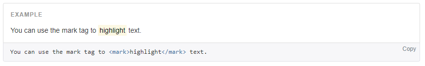

```html
You can use the mark tag to <mark>highlight</mark> text.
```

#### Ⅱ、被删除的文本

对于被删除的文本使用 `<del>` 标签


```html
<del>This line of text is meant to be treated as deleted text.</del>
```

#### Ⅲ、无用文本

对于没用的文本使用 `<s>` 标签


```html
<s>This line of text is meant to be treated as no longer accurate.</s>
```

#### Ⅳ、插入文本

额外插入的文本使用 `<ins>` 标签。


```html
<ins>This line of text is meant to be treated as an addition to the document.</ins>
```

#### Ⅴ、带下划线的文本

为文本添加下划线，使用 `<u>` 标签
利用 HTML 自带的表示强调意味的标签来为文本增添少量样式


```html
<u>This line of text will render as underlined</u>
```

#### Ⅵ、小号文本

对于不需要强调的inline或block类型的文本，使用 `<small>` 标签包裹，其内的文本将被设置为父容器字体大小的 85%。标题元素中嵌套的 `<small>` 元素被设置不同的 font-size 。
你还可以为行内元素赋予 .small 类以代替任何 `<small>` 元素


```html
<small>This line of text is meant to be treated as fine print.</small>
```

#### Ⅶ、着重

通过增加 font-weight 值强调一段文本


```html
<strong>rendered as bold text</strong>
```

#### Ⅷ、斜体

用斜体强调一段文本


```html
<em>rendered as italicized text</em>
```

#### Ⅸ、注意

在 HTML5 中可以放心使用 `<b>` 和 `<i>` 标签。`<b>` 用于高亮单词或短语，不带有任何着重的意味；而 `<i>` 标签主要用于发言、技术词汇等

### ④、对齐

通过文本对齐类，可以简单方便的将文字重新对齐


```html
<p class="text-left">Left aligned text.</p>
<p class="text-center">Center aligned text.</p>
<p class="text-right">Right aligned text.</p>
<p class="text-justify">Justified text.</p>
<p class="text-nowrap">No wrap text.</p>
```

### ⑤、改变大小写

通过这几个类可以改变文本的大小写

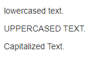

```html
<p class="text-lowercase">Lowercased text.</p>
<p class="text-uppercase">Uppercased text.</p>
<p class="text-capitalize">Capitalized text.</p>
```

### ⑥、缩略语

当鼠标悬停在缩写和缩写词上时就会显示完整内容，Bootstrap 实现了对 HTML 的 `<abbr>` 元素的增强样式。缩略语元素带有 title 属性，外观表现为带有较浅的虚线框，鼠标移至上面时会变成带有“问号”的指针。如想看完整的内容可把鼠标悬停在缩略语上（对使用辅助技术的用户也可见）, 但需要包含 title 属性

#### Ⅰ、基本缩略语


```html
<abbr title="attribute">attr</abbr>
```

#### Ⅱ、首字母缩略语


```html
<abbr title="HyperText Markup Language" class="initialism">HTML</abbr>
```

### ⑦、地址

让联系信息以最接近日常使用的格式呈现。在每行结尾添加 `<br>` 可以保留需要的样式


```html
<address>
  <strong>Twitter, Inc.</strong><br>
  1355 Market Street, Suite 900<br>
  San Francisco, CA 94103<br>
  <abbr title="Phone">P:</abbr> (123) 456-7890
</address>

<address>
  <strong>Full Name</strong><br>
  <a href="mailto:#">first.last@example.com</a>
</address>
```

### ⑧、引用

在你的文档中引用其他来源的内容

#### Ⅰ、默认样式的引用

将任何 HTML 元素包裹在 `<blockquote>` 中即可表现为引用样式。对于直接引用，我们建议用 `<p>` 标签


```html
<blockquote>
  <p>Lorem ipsum dolor sit amet, consectetur adipiscing elit. Integer posuere erat a ante.</p>
</blockquote>
```

#### Ⅱ、多种引用样式

对于标准样式的 `<blockquote>`，可以通过几个简单的变体就能改变风格和内容

##### （1）、命名来源

添加 `<footer>` 用于标明引用来源。来源的名称可以包裹进 `<cite>` 标签中


```html
<blockquote>
  <p>Lorem ipsum dolor sit amet, consectetur adipiscing elit. Integer posuere erat a ante.</p>
  <footer>Someone famous in <cite title="Source Title">Source Title</cite></footer>
</blockquote>
```

##### （2）、另一种展示风格

通过赋予 .blockquote-reverse 类可以让引用呈现内容右对齐的效果

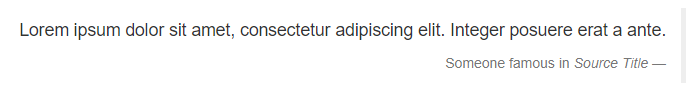

```html
<blockquote class="blockquote-reverse">
  ...
</blockquote>
```

### ⑨、列表

#### Ⅰ、无序列表

排列顺序_无关紧要_的一列元素


```html
<ul>
  <li>...</li>
</ul>
```

#### Ⅱ、有序列表

顺序_至关重要_的一组元素

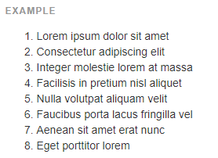

```html
<ol>
  <li>...</li>
</ol>
```

#### Ⅲ、无样式列表

移除了默认的 list-style 样式和左侧外边距的一组元素（只针对直接子元素）。**这是针对直接子元素的**，也就是说，你需要对所有嵌套的列表都添加这个类才能具有同样的样式


```html
<ul class="list-unstyled">
  <li>...</li>
</ul>
```

#### Ⅳ、内联列表

通过设置 display: inline-block; 并添加少量的内补（padding），将所有元素放置于同一行

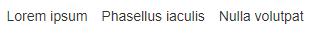

```html
<ul class="list-inline">
  <li>...</li>
</ul>
```

#### Ⅴ、描述

带有描述的短语列表


```html
<dl>
  <dt>...</dt>
  <dd>...</dd>
</dl>
```

#### Ⅵ、水平排列的描述

.dl-horizontal 可以让 `<dl>` 内的短语及其描述排在一行。开始是像 `<dl>` 的默认样式堆叠在一起，随着导航条逐渐展开而排列在一行

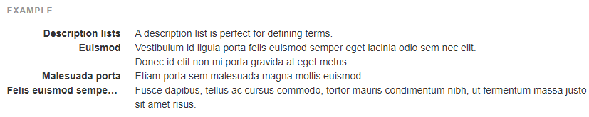

```html
<dl class="dl-horizontal">
  <dt>...</dt>
  <dd>...</dd>
</dl>
```

#### Ⅶ、自动截断

通过 text-overflow 属性，水平排列的描述列表将会截断左侧太长的短语。在较窄的视口（viewport）内，列表将变为默认堆叠排列的布局方式

## 6、代码

### ①、内联代码

通过 `<code>` 标签包裹内联样式的代码片段


```html
For example, <code>&lt;section&gt;</code> should be wrapped as inline.
```

### ②、用户输入

通过 `<kbd>` 标签标记用户通过键盘输入的内容


```html
To switch directories, type <kbd>cd</kbd> followed by the name of the directory.<br>
To edit settings, press <kbd><kbd>ctrl</kbd> + <kbd>,</kbd></kbd>
```

### ③、代码块

多行代码可以使用 `<pre>` 标签。为了正确的展示代码，注意将尖括号做转义处理


```html
<pre>&lt;p&gt;Sample text here...&lt;/p&gt;</pre>
```

### ④、变量

通过 `<var>` 标签标记变量


```html
<var>y</var> = <var>m</var><var>x</var> + <var>b</var>
```

### ⑤、程序输出

通过 `<samp>` 标签来标记程序输出的内容


```html
<samp>This text is meant to be treated as sample output from a computer program.</samp>
```

## 7、表格

### ①、基本实例

为任意 `<table>` 标签添加 `.table` 类可以为其赋予基本的样式 — 少量的内补（padding）和水平方向的分隔线。这种方式看起来很多余！？但是我们觉得，表格元素使用的很广泛，如果我们为其赋予默认样式可能会影响例如日历和日期选择之类的插件，所以我们选择将此样式独立出来


```html
<table class="table">
  ...
</table>
```

### ②、条纹状表格

通过 .table-striped 类可以给 `<tbody>` 之内的每一行增加斑马条纹样式
跨浏览器兼容性：条纹状表格是依赖 :nth-child CSS 选择器实现的，而这一功能不被 Internet Explorer 8 支持

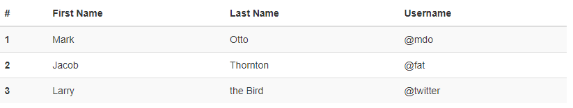

```html
<table class="table table-striped">
  ...
</table>
```

### ③、带边框的表格

添加 .table-bordered 类为表格和其中的每个单元格增加边框

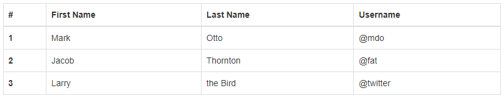

```html
<table class="table table-bordered">
  ...
</table>
```

### ④、鼠标悬停

通过添加 .table-hover 类可以让 `<tbody>` 中的每一行对鼠标悬停状态作出响应

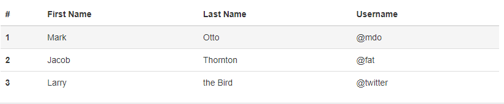

```html
<table class="table table-hover">
  ...
</table>
```

### ⑤、紧缩表格

通过添加 .table-condensed 类可以让表格更加紧凑，单元格中的内补（padding）均会减半


```html
<table class="table table-condensed">
  ...
</table>
```

### ⑥、状态类

通过这些状态类可以为行或单元格设置颜色
向使用辅助技术的用户传达用意：通过为表格中的一行或一个单元格添加颜色而赋予不同的意义只是提供了一种视觉上的表现，并不能为使用辅助技术 -- 例如屏幕阅读器 -- 浏览网页的用户提供更多信息。因此，请确保通过颜色而赋予的不同意义可以通过内容本身来表达（即在相应行或单元格中的可见的文本内容）；或者通过包含额外的方式 -- 例如应用了 .sr-only 类而隐藏的文本 -- 来表达出来

| Class | 描述 |
| --- | --- |
| .active | 鼠标悬停在行或单元格上时所设置的颜色 |
| .success | 标识成功或积极的动作 |
| .info | 标识普通的提示信息或动作 |
| .warning | 标识警告或需要用户注意 |
| .danger | 标识危险或潜在的带来负面影响的动作 |


```html
<!-- On rows -->
<tr class="active">...</tr>
<tr class="success">...</tr>
<tr class="warning">...</tr>
<tr class="danger">...</tr>
<tr class="info">...</tr>

<!-- On cells (`td` or `th`) -->
<tr>
  <td class="active">...</td>
  <td class="success">...</td>
  <td class="warning">...</td>
  <td class="danger">...</td>
  <td class="info">...</td>
</tr>
```

### ⑦、响应式表格

将任何 .table 元素包裹在 .table-responsive 元素内，即可创建响应式表格，其会在小屏幕设备上（小于768px）水平滚动。当屏幕大于 768px 宽度时，水平滚动条消失
垂直方向的内容截断：响应式表格使用了 overflow-y: hidden 属性，这样就能将超出表格底部和顶部的内容截断。特别是，也可以截断下拉菜单和其他第三方组件
Firefox 和 fieldset 元素：Firefox 浏览器对 fieldset 元素设置了一些影响 width 属性的样式，导致响应式表格出现问题。可以使用下面提供的针对 Firefox 的 hack 代码解决，但是以下代码并未集成在 Bootstrap 中：@-moz-document url-prefix() {   fieldset { display: table-cell; } }

- 小于 768px 宽度


- 大于 768px 宽度

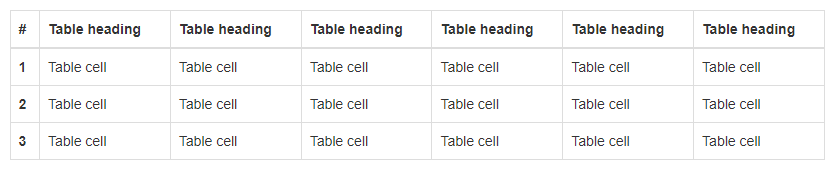

```html
<div class="table-responsive">
  <table class="table">
    ...
  </table>
</div>
```

## 8、表单

### ①、基本实例

单独的表单控件会被自动赋予一些全局样式。所有设置了 .form-control 类的 `<input>`、`<textarea>` 和 `<select>` 元素都将被默认设置宽度属性为 width: 100%;。 将 label 元素和前面提到的控件包裹在 .form-group 中可以获得最好的排列
不要将表单组和输入框组混合使用：不要将表单组直接和[输入框组](https://v3.bootcss.com/components/#input-groups)混合使用。建议将输入框组嵌套到表单组中使用


```html
<form>
  <div class="form-group">
    <label for="exampleInputEmail1">Email address</label>
    <input type="email" class="form-control" id="exampleInputEmail1" placeholder="Email">
  </div>
  <div class="form-group">
    <label for="exampleInputPassword1">Password</label>
    <input type="password" class="form-control" id="exampleInputPassword1" placeholder="Password">
  </div>
  <div class="form-group">
    <label for="exampleInputFile">File input</label>
    <input type="file" id="exampleInputFile">
    <p class="help-block">Example block-level help text here.</p>
  </div>
  <div class="checkbox">
    <label>
      <input type="checkbox"> Check me out
    </label>
  </div>
  <button type="submit" class="btn btn-default">Submit</button>
</form>
```

### ②、内联表单

为 `<form>` 元素添加 `.form-inline` 类可使其内容左对齐并且表现为 `inline-block` 级别的控件。**只适用于视口（viewport）至少在 768px 宽度时（视口宽度再小的话就会使表单折叠）**

> 可能需要手动设置宽度：在 Bootstrap 中，输入框和单选/多选框控件默认被设置为 width: 100%; 宽度。在内联表单，我们将这些元素的宽度设置为 width: auto;，因此，多个控件可以排列在同一行。根据你的布局需求，可能需要一些额外的定制化组件.

> 一定要添加 label 标签：如果你没有为每个输入控件设置 label 标签，屏幕阅读器将无法正确识别。对于这些内联表单，你可以通过为 label 设置 .sr-only 类将其隐藏。还有一些辅助技术提供label标签的替代方案，比如 aria-label、aria-labelledby 或 title 属性。如果这些都不存在，屏幕阅读器可能会采取使用 placeholder 属性，如果存在的话，使用占位符来替代其他的标记，但要注意，这种方法是不妥当的


```html
<form class="form-inline">
  <div class="form-group">
    <label for="exampleInputName2">Name</label>
    <input type="text" class="form-control" id="exampleInputName2" placeholder="Jane Doe">
  </div>
  <div class="form-group">
    <label for="exampleInputEmail2">Email</label>
    <input type="email" class="form-control" id="exampleInputEmail2" placeholder="jane.doe@example.com">
  </div>
  <button type="submit" class="btn btn-default">Send invitation</button>
</form>
```


```html
<form class="form-inline">
  <div class="form-group">
    <label class="sr-only" for="exampleInputEmail3">Email address</label>
    <input type="email" class="form-control" id="exampleInputEmail3" placeholder="Email">
  </div>
  <div class="form-group">
    <label class="sr-only" for="exampleInputPassword3">Password</label>
    <input type="password" class="form-control" id="exampleInputPassword3" placeholder="Password">
  </div>
  <div class="checkbox">
    <label>
      <input type="checkbox"> Remember me
    </label>
  </div>
  <button type="submit" class="btn btn-default">Sign in</button>
</form>
```


```html
<form class="form-inline">
  <div class="form-group">
    <label class="sr-only" for="exampleInputAmount">Amount (in dollars)</label>
    <div class="input-group">
      <div class="input-group-addon">$</div>
      <input type="text" class="form-control" id="exampleInputAmount" placeholder="Amount">
      <div class="input-group-addon">.00</div>
    </div>
  </div>
  <button type="submit" class="btn btn-primary">Transfer cash</button>
</form>
```

### ③、水平排列的表单

通过为表单添加 .form-horizontal 类，并联合使用 Bootstrap 预置的栅格类，可以将 label 标签和控件组水平并排布局。这样做将改变 .form-group 的行为，使其表现为栅格系统中的行（row），因此就无需再额外添加 .row 了


```html
<form class="form-horizontal">
  <div class="form-group">
    <label for="inputEmail3" class="col-sm-2 control-label">Email</label>
    <div class="col-sm-10">
      <input type="email" class="form-control" id="inputEmail3" placeholder="Email">
    </div>
  </div>
  <div class="form-group">
    <label for="inputPassword3" class="col-sm-2 control-label">Password</label>
    <div class="col-sm-10">
      <input type="password" class="form-control" id="inputPassword3" placeholder="Password">
    </div>
  </div>
  <div class="form-group">
    <div class="col-sm-offset-2 col-sm-10">
      <div class="checkbox">
        <label>
          <input type="checkbox"> Remember me
        </label>
      </div>
    </div>
  </div>
  <div class="form-group">
    <div class="col-sm-offset-2 col-sm-10">
      <button type="submit" class="btn btn-default">Sign in</button>
    </div>
  </div>
</form>
```

### ④、被支持的控件

表单布局实例中展示了其所支持的标准表单控件

#### Ⅰ、输入框

包括大部分表单控件、文本输入域控件，还支持所有 HTML5 类型的输入控件： text、password、datetime、datetime-local、date、month、time、week、number、email、url、search、tel 和 color

> 必须添加类型声明：只有正确设置了 type 属性的输入控件才能被赋予正确的样式

> 输入控件组：如需在文本输入域 `<input>` 前面或后面添加文本内容或按钮控件，请参考[输入控件组](https://v3.bootcss.com/components/#input-groups)


```html
<input type="text" class="form-control" placeholder="Text input">
```

#### Ⅱ、文本域

支持多行文本的表单控件。可根据需要改变 rows 属性


```html
<textarea class="form-control" rows="3"></textarea>
```

#### Ⅲ、多选和单选框

多选框（checkbox）用于选择列表中的一个或多个选项，而单选框（radio）用于从多个选项中只选择一个。
Disabled checkboxes and radios are supported, but to provide a "not-allowed" cursor on hover of the parent `<label>`, you'll need to add the .disabled class to the parent .radio, .radio-inline, .checkbox, or .checkbox-inline

##### （1）、默认外观（堆叠在一起）


```html
<div class="checkbox">
  <label>
    <input type="checkbox" value="">
    Option one is this and that&mdash;be sure to include why it's great
  </label>
</div>
<div class="checkbox disabled">
  <label>
    <input type="checkbox" value="" disabled>
    Option two is disabled
  </label>
</div>

<div class="radio">
  <label>
    <input type="radio" name="optionsRadios" id="optionsRadios1" value="option1" checked>
    Option one is this and that&mdash;be sure to include why it's great
  </label>
</div>
<div class="radio">
  <label>
    <input type="radio" name="optionsRadios" id="optionsRadios2" value="option2">
    Option two can be something else and selecting it will deselect option one
  </label>
</div>
<div class="radio disabled">
  <label>
    <input type="radio" name="optionsRadios" id="optionsRadios3" value="option3" disabled>
    Option three is disabled
  </label>
</div>
```

##### （2）、内联单选和多选框

通过将 .checkbox-inline 或 .radio-inline 类应用到一系列的多选框（checkbox）或单选框（radio）控件上，可以使这些控件排列在一行

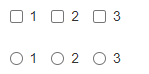

```html
<label class="checkbox-inline">
  <input type="checkbox" id="inlineCheckbox1" value="option1"> 1
</label>
<label class="checkbox-inline">
  <input type="checkbox" id="inlineCheckbox2" value="option2"> 2
</label>
<label class="checkbox-inline">
  <input type="checkbox" id="inlineCheckbox3" value="option3"> 3
</label>

<label class="radio-inline">
  <input type="radio" name="inlineRadioOptions" id="inlineRadio1" value="option1"> 1
</label>
<label class="radio-inline">
  <input type="radio" name="inlineRadioOptions" id="inlineRadio2" value="option2"> 2
</label>
<label class="radio-inline">
  <input type="radio" name="inlineRadioOptions" id="inlineRadio3" value="option3"> 3
</label>
```

##### （3）、不带 label 文本的 Checkbox 和 radio

如果需要 `<label>` 内没有文字，输入框（input）正是你所期望的。 **目前只适用于非内联的 checkbox 和 radio。** 请记住，仍然需要为使用辅助技术的用户提供某种形式的 label（例如，使用 aria-label）

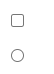

```html
<div class="checkbox">
  <label>
    <input type="checkbox" id="blankCheckbox" value="option1" aria-label="...">
  </label>
</div>
<div class="radio">
  <label>
    <input type="radio" name="blankRadio" id="blankRadio1" value="option1" aria-label="...">
  </label>
</div>
```

#### Ⅳ、下拉列表（select）
注意，很多原生选择菜单 - 即在 Safari 和 Chrome 中 - 的圆角是无法通过修改 border-radius 属性来改变的

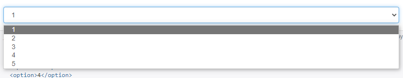

```html
<select class="form-control">
  <option>1</option>
  <option>2</option>
  <option>3</option>
  <option>4</option>
  <option>5</option>
</select>
```

---

对于标记了 multiple 属性的 `<select>` 控件来说，默认显示多选项

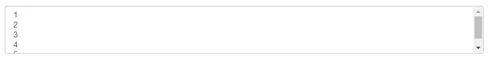

```html
<select multiple class="form-control">
  <option>1</option>
  <option>2</option>
  <option>3</option>
  <option>4</option>
  <option>5</option>
</select>
```

### ⑤、静态控件

如果需要在表单中将一行纯文本和 label 元素放置于同一行，为 `<p>` 元素添加 .form-control-static 类即可

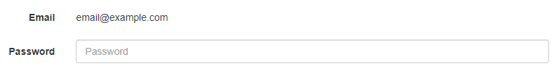

```html
<form class="form-horizontal">
  <div class="form-group">
    <label class="col-sm-2 control-label">Email</label>
    <div class="col-sm-10">
      <p class="form-control-static">email@example.com</p>
    </div>
  </div>
  <div class="form-group">
    <label for="inputPassword" class="col-sm-2 control-label">Password</label>
    <div class="col-sm-10">
      <input type="password" class="form-control" id="inputPassword" placeholder="Password">
    </div>
  </div>
</form>
```

---


```html
<form class="form-inline">
  <div class="form-group">
    <label class="sr-only">Email</label>
    <p class="form-control-static">email@example.com</p>
  </div>
  <div class="form-group">
    <label for="inputPassword2" class="sr-only">Password</label>
    <input type="password" class="form-control" id="inputPassword2" placeholder="Password">
  </div>
  <button type="submit" class="btn btn-default">Confirm identity</button>
</form>
```

### ⑥、焦点状态

我们将某些表单控件的默认 outline 样式移除，然后对 :focus 状态赋予 box-shadow 属性


> 演示:focus 状态：在本文档中，我们为上面实例中的输入框赋予了自定义的样式，用于演示 .form-control 元素的 :focus 状态

### ⑦、禁用状态

为输入框设置 disabled 属性可以禁止其与用户有任何交互（焦点、输入等）。被禁用的输入框颜色更浅，并且还添加了 not-allowed 鼠标状态


```html
<input class="form-control" id="disabledInput" type="text" placeholder="Disabled input here..." disabled>
```

### ⑧、被禁用的 fieldset

为`<fieldset>` 设置 disabled 属性，可以禁用 `<fieldset>` 中包含的所有控件

> `<a>` 标签的链接功能不受影响：默认情况下，浏览器会将 `<fieldset disabled>` 内所有的原生的表单控件（`<input>`、`<select>` 和 `<button>` 元素）设置为禁用状态，防止键盘和鼠标与他们交互。然而，如果表单中还包含 `<a ... class="btn btn-*">` 元素，这些元素将只被赋予 pointer-events: none 属性。正如在关于 [禁用状态的按钮](https://v3.bootcss.com/css/#buttons-disabled) 章节中（尤其是关于锚点元素的子章节中）所描述的那样，该 CSS 属性尚不规范，并且在 Opera 18 及更低版本的浏览器或 Internet Explorer 11 总没有得到全面支持，并且不会阻止键盘用户能够获取焦点或激活这些链接。所以为了安全起见，建议使用自定义 JavaScript 来禁用这些链接

> 跨浏览器兼容性：虽然 Bootstrap 会将这些样式应用到所有浏览器上，Internet Explorer 11 及以下浏览器中的 `<fieldset>` 元素并不完全支持 disabled 属性。因此建议在这些浏览器上通过 JavaScript 代码来禁用 `<fieldset>`


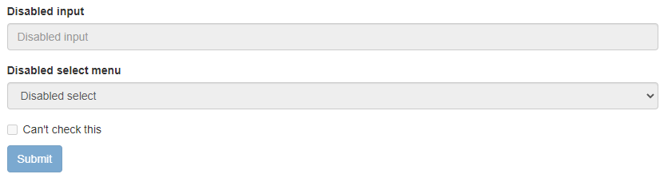

```html
<form>
  <fieldset disabled>
    <div class="form-group">
      <label for="disabledTextInput">Disabled input</label>
      <input type="text" id="disabledTextInput" class="form-control" placeholder="Disabled input">
    </div>
    <div class="form-group">
      <label for="disabledSelect">Disabled select menu</label>
      <select id="disabledSelect" class="form-control">
        <option>Disabled select</option>
      </select>
    </div>
    <div class="checkbox">
      <label>
        <input type="checkbox"> Can't check this
      </label>
    </div>
    <button type="submit" class="btn btn-primary">Submit</button>
  </fieldset>
</form>
```

### ⑨、只读状态

为输入框设置 readonly 属性可以禁止用户修改输入框中的内容。处于只读状态的输入框颜色更浅（就像被禁用的输入框一样），但是仍然保留标准的鼠标状态

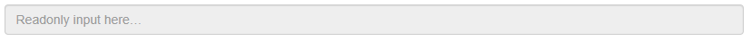

```html
<input class="form-control" type="text" placeholder="Readonly input here…" readonly>
```

### ⑩、帮助文本

表单控件的块级帮助文本。

> 将帮助文本与表单控件关联：帮助文本应该使用 aria describedby 属性与表单控件显式关联。这将确保辅助技术（如屏幕阅读器）在用户聚焦或进入控件时会宣布此帮助文本


```html
<label for="inputHelpBlock">Input with help text</label>
<input type="text" id="inputHelpBlock" class="form-control" aria-describedby="helpBlock">
...
<span id="helpBlock" class="help-block">A block of help text that breaks onto a new line and may extend beyond one line.</span>
```

### ⑪、校验状态

Bootstrap 对表单控件的校验状态，如 error、warning 和 success 状态，都定义了样式。使用时，添加 .has-warning、.has-error 或 .has-success 类到这些控件的父元素即可。任何包含在此元素之内的 .control-label、.form-control 和 .help-block 元素都将接受这些校验状态的样式

> 向辅助设备和色盲用户传达验证状态：使用这些校验样式只是为表单控件提供一个可视的、基于色彩的提示，但是并不能将这种提示信息传达给使用辅助设备的用户 - 例如屏幕阅读器 - 或者色盲用户。
> 为了确保所有用户都能获取正确信息，Bootstrap 还提供了另一种提示方式。例如，你可以在表单控件的 `<label>` 标签上以文本的形式显示提示信息（就像下面代码中所展示的）；包含一个 [Glyphicon 字体图标](https://v3.bootcss.com/components/#glyphicons) （还有赋予 .sr-only 类的文本信息 - 参考[Glyphicon 字体图标实例](https://v3.bootcss.com/components/#glyphicons-examples)）；或者提供一个额外的 [辅助信息](https://v3.bootcss.com/css/#forms-help-text) 块。另外，对于使用辅助设备的用户，无效的表单控件还可以赋予一个 aria-invalid="true" 属性


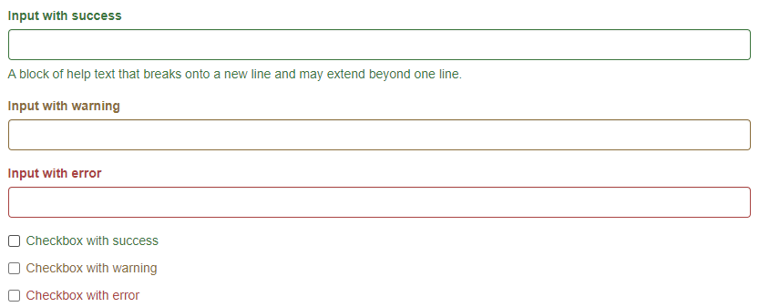

```html
<div class="form-group has-success">
  <label class="control-label" for="inputSuccess1">Input with success</label>
  <input type="text" class="form-control" id="inputSuccess1" aria-describedby="helpBlock2">
  <span id="helpBlock2" class="help-block">A block of help text that breaks onto a new line and may extend beyond one line.</span>
</div>
<div class="form-group has-warning">
  <label class="control-label" for="inputWarning1">Input with warning</label>
  <input type="text" class="form-control" id="inputWarning1">
</div>
<div class="form-group has-error">
  <label class="control-label" for="inputError1">Input with error</label>
  <input type="text" class="form-control" id="inputError1">
</div>
<div class="has-success">
  <div class="checkbox">
    <label>
      <input type="checkbox" id="checkboxSuccess" value="option1">
      Checkbox with success
    </label>
  </div>
</div>
<div class="has-warning">
  <div class="checkbox">
    <label>
      <input type="checkbox" id="checkboxWarning" value="option1">
      Checkbox with warning
    </label>
  </div>
</div>
<div class="has-error">
  <div class="checkbox">
    <label>
      <input type="checkbox" id="checkboxError" value="option1">
      Checkbox with error
    </label>
  </div>
</div>
```

#### Ⅰ、添加额外的图标

你还可以针对校验状态为输入框添加额外的图标。只需设置相应的 .has-feedback 类并添加正确的图标即可。
**反馈图标（feedback icon）只能使用在文本输入框 `<input class="form-control">` 元素上**

> 图标、label 和输入控件组：对于不带有 label 标签的输入框以及右侧带有附加组件的[输入框组](https://v3.bootcss.com/components/#input-groups)，需要手动为其放置反馈图标。为了让所有用户都能访问你的网站，我们强烈建议为所有输入框添加 label 标签。如果你不希望将 label 标签展示出来，可以通过添加 .sr-only 类将其隐藏。如果的确不能添加 label 标签，请调整反馈图标的 top 值。对于输入框组，请根据附加组件的实际情况调整 right 值

> 向辅助技术设备传递图标的含义：为了确保辅助技术- 如屏幕阅读器 - 正确传达一个图标的含义，额外的隐藏的文本应包含在 .sr-only 类中，并明确关联使用了 aria-describedby 的表单控件。或者，以某些其他形式（例如，文本输入字段有一个特定的警告信息）传达含义，例如改变与表单控件实际相关联的 `<label>` 的文本。
> 虽然下面的例子已经提到各自表单控件本身的 `<label>` 文本的验证状态，上述技术（使用 .sr-only 文本 和 aria-describedby) ）已经包括了需要说明的目的


```html
<div class="form-group has-success has-feedback">
  <label class="control-label" for="inputSuccess2">Input with success</label>
  <input type="text" class="form-control" id="inputSuccess2" aria-describedby="inputSuccess2Status">
  <span class="glyphicon glyphicon-ok form-control-feedback" aria-hidden="true"></span>
  <span id="inputSuccess2Status" class="sr-only">(success)</span>
</div>
<div class="form-group has-warning has-feedback">
  <label class="control-label" for="inputWarning2">Input with warning</label>
  <input type="text" class="form-control" id="inputWarning2" aria-describedby="inputWarning2Status">
  <span class="glyphicon glyphicon-warning-sign form-control-feedback" aria-hidden="true"></span>
  <span id="inputWarning2Status" class="sr-only">(warning)</span>
</div>
<div class="form-group has-error has-feedback">
  <label class="control-label" for="inputError2">Input with error</label>
  <input type="text" class="form-control" id="inputError2" aria-describedby="inputError2Status">
  <span class="glyphicon glyphicon-remove form-control-feedback" aria-hidden="true"></span>
  <span id="inputError2Status" class="sr-only">(error)</span>
</div>
<div class="form-group has-success has-feedback">
  <label class="control-label" for="inputGroupSuccess1">Input group with success</label>
  <div class="input-group">
    <span class="input-group-addon">@</span>
    <input type="text" class="form-control" id="inputGroupSuccess1" aria-describedby="inputGroupSuccess1Status">
  </div>
  <span class="glyphicon glyphicon-ok form-control-feedback" aria-hidden="true"></span>
  <span id="inputGroupSuccess1Status" class="sr-only">(success)</span>
</div>
```

#### Ⅱ、为水平排列的表单和内联表单设置可选的图标

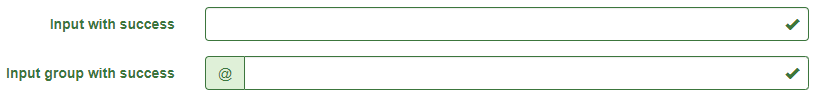

```html
<form class="form-horizontal">
  <div class="form-group has-success has-feedback">
    <label class="control-label col-sm-3" for="inputSuccess3">Input with success</label>
    <div class="col-sm-9">
      <input type="text" class="form-control" id="inputSuccess3" aria-describedby="inputSuccess3Status">
      <span class="glyphicon glyphicon-ok form-control-feedback" aria-hidden="true"></span>
      <span id="inputSuccess3Status" class="sr-only">(success)</span>
    </div>
  </div>
  <div class="form-group has-success has-feedback">
    <label class="control-label col-sm-3" for="inputGroupSuccess2">Input group with success</label>
    <div class="col-sm-9">
      <div class="input-group">
        <span class="input-group-addon">@</span>
        <input type="text" class="form-control" id="inputGroupSuccess2" aria-describedby="inputGroupSuccess2Status">
      </div>
      <span class="glyphicon glyphicon-ok form-control-feedback" aria-hidden="true"></span>
      <span id="inputGroupSuccess2Status" class="sr-only">(success)</span>
    </div>
  </div>
</form>
```

---


```html
<form class="form-inline">
  <div class="form-group has-success has-feedback">
    <label class="control-label" for="inputSuccess4">Input with success</label>
    <input type="text" class="form-control" id="inputSuccess4" aria-describedby="inputSuccess4Status">
    <span class="glyphicon glyphicon-ok form-control-feedback" aria-hidden="true"></span>
    <span id="inputSuccess4Status" class="sr-only">(success)</span>
  </div>
</form>
<form class="form-inline">
  <div class="form-group has-success has-feedback">
    <label class="control-label" for="inputGroupSuccess3">Input group with success</label>
    <div class="input-group">
      <span class="input-group-addon">@</span>
      <input type="text" class="form-control" id="inputGroupSuccess3" aria-describedby="inputGroupSuccess3Status">
    </div>
    <span class="glyphicon glyphicon-ok form-control-feedback" aria-hidden="true"></span>
    <span id="inputGroupSuccess3Status" class="sr-only">(success)</span>
  </div>
</form>
```

#### Ⅲ、可选的图标与设置 .sr-only 类的 label

如果你使用 .sr-only 类来隐藏表单控件的 `<label>` （而不是使用其它标签选项，如 aria-label 属性）， 一旦它被添加，Bootstrap 会自动调整图标的位置

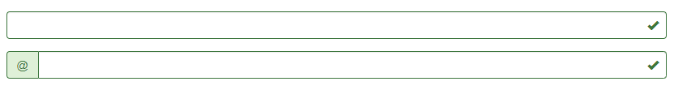

```html
<div class="form-group has-success has-feedback">
  <label class="control-label sr-only" for="inputSuccess5">Hidden label</label>
  <input type="text" class="form-control" id="inputSuccess5" aria-describedby="inputSuccess5Status">
  <span class="glyphicon glyphicon-ok form-control-feedback" aria-hidden="true"></span>
  <span id="inputSuccess5Status" class="sr-only">(success)</span>
</div>
<div class="form-group has-success has-feedback">
  <label class="control-label sr-only" for="inputGroupSuccess4">Input group with success</label>
  <div class="input-group">
    <span class="input-group-addon">@</span>
    <input type="text" class="form-control" id="inputGroupSuccess4" aria-describedby="inputGroupSuccess4Status">
  </div>
  <span class="glyphicon glyphicon-ok form-control-feedback" aria-hidden="true"></span>
  <span id="inputGroupSuccess4Status" class="sr-only">(success)</span>
</div>
```

### ⑫、控件尺寸

通过 .input-lg 类似的类可以为控件设置高度，通过 .col-lg-* 类似的类可以为控件设置宽度

#### Ⅰ、高度尺寸

创建大一些或小一些的表单控件以匹配按钮尺寸

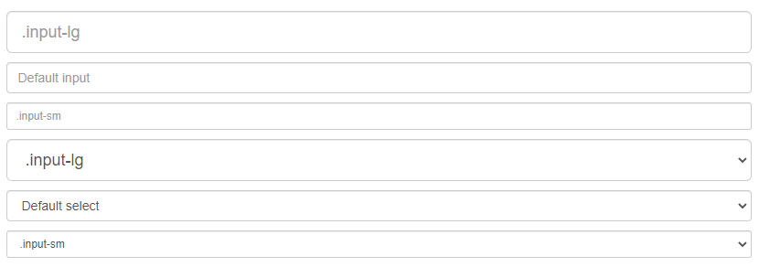

```html
<input class="form-control input-lg" type="text" placeholder=".input-lg">
<input class="form-control" type="text" placeholder="Default input">
<input class="form-control input-sm" type="text" placeholder=".input-sm">

<select class="form-control input-lg">...</select>
<select class="form-control">...</select>
<select class="form-control input-sm">...</select>
```

#### Ⅱ、水平排列的表单组的尺寸

通过添加 .form-group-lg 或 .form-group-sm 类，为 .form-horizontal 包裹的 label 元素和表单控件快速设置尺寸


```html
<form class="form-horizontal">
  <div class="form-group form-group-lg">
    <label class="col-sm-2 control-label" for="formGroupInputLarge">Large label</label>
    <div class="col-sm-10">
      <input class="form-control" type="text" id="formGroupInputLarge" placeholder="Large input">
    </div>
  </div>
  <div class="form-group form-group-sm">
    <label class="col-sm-2 control-label" for="formGroupInputSmall">Small label</label>
    <div class="col-sm-10">
      <input class="form-control" type="text" id="formGroupInputSmall" placeholder="Small input">
    </div>
  </div>
</form>
```

#### Ⅲ、调整列（column）尺寸

用栅格系统中的列（column）包裹输入框或其任何父元素，都可很容易的为其设置宽度


```html
<div class="row">
  <div class="col-xs-2">
    <input type="text" class="form-control" placeholder=".col-xs-2">
  </div>
  <div class="col-xs-3">
    <input type="text" class="form-control" placeholder=".col-xs-3">
  </div>
  <div class="col-xs-4">
    <input type="text" class="form-control" placeholder=".col-xs-4">
  </div>
</div>
```

## 9、按钮

### ①、可作为按钮使用的标签或元素

为 `<a>`、`<button>` 或 `<input>` 元素添加按钮类（button class）即可使用 Bootstrap 提供的样式

> 针对组件的注意事项：虽然按钮类可以应用到 `<a>` 和 `<button>` 元素上，但是，导航和导航条组件只支持 `<button>` 元素

> 链接被作为按钮使用时的注意事项：如果 `<a>` 元素被作为按钮使用 -- 并用于在当前页面触发某些功能 -- 而不是用于链接其他页面或链接当前页面中的其他部分，那么，务必为其设置 role="button" 属性

> 跨浏览器展现：我们总结的最佳实践是：**强烈建议尽可能使用 `<button>` 元素**来获得在各个浏览器上获得相匹配的绘制效果。
> 
> 另外，我们还发现了 [Firefox <30 版本的浏览器上出现的一个 bug](https://bugzilla.mozilla.org/show_bug.cgi?id=697451)，其表现是：阻止我们为基于 <input> 元素所创建的按钮设置 line-height 属性，这就导致在 Firefox 浏览器上不能完全和其他按钮保持一致的高度


```html
<a class="btn btn-default" href="#" role="button">Link</a>
<button class="btn btn-default" type="submit">Button</button>
<input class="btn btn-default" type="button" value="Input">
<input class="btn btn-default" type="submit" value="Submit">
```

### ②、预定义样式

使用下面列出的类可以快速创建一个带有预定义样式的按钮

> 向辅助技术传达意义：为按钮添加不同的颜色只是一种视觉上的信息表达方式，但是，对于使用辅助技术 -- 例如屏幕阅读器 -- 的用户来说，颜色是不可见的。建议，确保通过颜色表达的信息或者通过内容自身表达出来（按钮上的文字），或者通过其他方式 -- 例如通过 .sr-only 类隐藏的额外文本 -- 表达出来

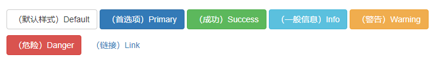

```html
<!-- Standard button -->
<button type="button" class="btn btn-default">（默认样式）Default</button>

<!-- Provides extra visual weight and identifies the primary action in a set of buttons -->
<button type="button" class="btn btn-primary">（首选项）Primary</button>

<!-- Indicates a successful or positive action -->
<button type="button" class="btn btn-success">（成功）Success</button>

<!-- Contextual button for informational alert messages -->
<button type="button" class="btn btn-info">（一般信息）Info</button>

<!-- Indicates caution should be taken with this action -->
<button type="button" class="btn btn-warning">（警告）Warning</button>

<!-- Indicates a dangerous or potentially negative action -->
<button type="button" class="btn btn-danger">（危险）Danger</button>

<!-- Deemphasize a button by making it look like a link while maintaining button behavior -->
<button type="button" class="btn btn-link">（链接）Link</button>
```

### ③、尺寸

需要让按钮具有不同尺寸吗？使用 .btn-lg、.btn-sm 或 .btn-xs 就可以获得不同尺寸的按钮


```html
<p>
  <button type="button" class="btn btn-primary btn-lg">（大按钮）Large button</button>
  <button type="button" class="btn btn-default btn-lg">（大按钮）Large button</button>
</p>
<p>
  <button type="button" class="btn btn-primary">（默认尺寸）Default button</button>
  <button type="button" class="btn btn-default">（默认尺寸）Default button</button>
</p>
<p>
  <button type="button" class="btn btn-primary btn-sm">（小按钮）Small button</button>
  <button type="button" class="btn btn-default btn-sm">（小按钮）Small button</button>
</p>
<p>
  <button type="button" class="btn btn-primary btn-xs">（超小尺寸）Extra small button</button>
  <button type="button" class="btn btn-default btn-xs">（超小尺寸）Extra small button</button>
</p>
```

---

通过给按钮添加 .btn-block 类可以将其拉伸至父元素100%的宽度，而且按钮也变为了块级（block）元素

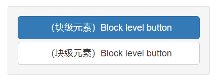

```html
<button type="button" class="btn btn-primary btn-lg btn-block">（块级元素）Block level button</button>
<button type="button" class="btn btn-default btn-lg btn-block">（块级元素）Block level button</button>
```

### ④、激活状态

当按钮处于激活状态时，其表现为被按压下去（底色更深、边框夜色更深、向内投射阴影）。对于 `<button>` 元素，是通过 :active 状态实现的。对于 `<a>` 元素，是通过 .active 类实现的。然而，你还可以将 .active 应用到 `<button>` 上（包含 aria-pressed="true" 属性)），并通过编程的方式使其处于激活状态

#### Ⅰ、button 元素

由于 :active 是伪状态，因此无需额外添加，但是在需要让其表现出同样外观的时候可以添加 .active 类


```html
<button type="button" class="btn btn-primary btn-lg active">Primary button</button>
<button type="button" class="btn btn-default btn-lg active">Button</button>
```

#### Ⅱ、链接（`<a>`）元素

可以为基于 `<a>` 元素创建的按钮添加 .active 类


```html
<a href="#" class="btn btn-primary btn-lg active" role="button">Primary link</a>
<a href="#" class="btn btn-default btn-lg active" role="button">Link</a>
```

### ⑤、禁用状态

通过为按钮的背景设置 opacity 属性就可以呈现出无法点击的效果

#### Ⅰ、button 元素

为 `<button>` 元素添加 disabled 属性，使其表现出禁用状态

> 跨浏览器兼容性：如果为 `<button>` 元素添加 disabled 属性，Internet Explorer 9 及更低版本的浏览器将会把按钮中的文本绘制为灰色，并带有恶心的阴影，目前我们还没有解决办法


```html
<button type="button" class="btn btn-lg btn-primary" disabled="disabled">Primary button</button>
<button type="button" class="btn btn-default btn-lg" disabled="disabled">Button</button>
```

#### Ⅱ、链接（`<a>`）元素

为基于 `<a>` 元素创建的按钮添加 .disabled 类
我们把 .disabled 作为工具类使用，就像 .active 类一样，因此不需要增加前缀

> 链接的原始功能不受影响：上面提到的类只是通过设置 pointer-events: none 来禁止 `<a>` 元素作为链接的原始功能，但是，这一 CSS 属性并没有被标准化，并且 Opera 18 及更低版本的浏览器并没有完全支持这一属性，同样，Internet Explorer 11 也不支持。此外，即使在支持指针事件的浏览器中：无，键盘导航仍然不受影响，这意味着有视力的键盘用户和辅助技术用户仍然能够激活这些链接。 因此，为了安全起见，建议通过 JavaScript 代码来禁止链接的原始功能

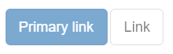

```html
<a href="#" class="btn btn-primary btn-lg disabled" role="button">Primary link</a>
<a href="#" class="btn btn-default btn-lg disabled" role="button">Link</a>
```

## 10、图片

## ①、响应式图片

在 Bootstrap 版本 3 中，通过为图片添加 .img-responsive 类可以让图片支持响应式布局。其实质是为图片设置了 max-width: 100%;、 height: auto; 和 display: block; 属性，从而让图片在其父元素中更好的缩放。
如果需要让使用了 .img-responsive 类的图片水平居中，请使用 .center-block 类，不要用 .text-center。 [请参考助手类章节](https://v3.bootcss.com/css/#helper-classes-center) 了解更多关于 .center-block 的用法

> SVG 图像和 IE 8-10：在 Internet Explorer 8-10 中，设置为 .img-responsive 的 SVG 图像显示出的尺寸不匀称。为了解决这个问题，在出问题的地方添加 width: 100% \9; 即可。Bootstrap 并没有自动为所有图像元素设置这一属性，因为这会导致其他图像格式出现错乱

```html

```

## ②、图片形状

通过为  元素添加以下相应的类，可以让图片呈现不同的形状

> 跨浏览器兼容性：请时刻牢记：Internet Explorer 8 不支持 CSS3 中的圆角属性

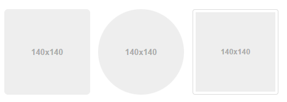

```html


```

## 11、辅助类

> [https://v3.bootcss.com/css/#helper-classes](https://v3.bootcss.com/css/#helper-classes)

## 12、响应式工具

> [https://v3.bootcss.com/css/#helper-classes](https://v3.bootcss.com/css/#helper-classes)

为了加快对移动设备友好的页面开发工作，利用媒体查询功能并使用这些工具类可以方便的针对不同设备展示或隐藏页面内容。另外还包含了针对打印机显示或隐藏内容的工具类。
有针对性的使用这类工具类，从而避免为同一个网站创建完全不同的版本。相反，通过使用这些工具类可以在不同设备上提供不同的展现形式。

## 13、使用 Less

> [https://v3.bootcss.com/css/#helper-classes](https://v3.bootcss.com/css/#helper-classes)

Bootstrap 的 CSS 文件是通过 Less 源码编译而来的。Less 是一门预处理语言，支持变量、mixin、函数等额外功能。对于希望使用 Less 源码而非编译而来的 CSS 文件的用户，Bootstrap 框架中包含的大量变量、mixin 将非常有价值。
针对栅格系统的变量和 mixin 包含在[栅格系统](https://v3.bootcss.com/css/#grid-less)章节

## 14、使用 Sass

虽然 Bootstrap 是基于 Less 构建的，我们还提供了一套[官方支持的 Sass 移植版](https://github.com/twbs/bootstrap-sass)代码。我们将这个版本放在单独的 GitHub 仓库中进行维护，并通过脚本处理源码更新
由于 Sass 移植版存放于单独的仓库，并针对不同的使用群体，这个项目中的内容与 Bootstrap 主项目有很大不同。这也是为了保证 Sass 移植版与更多基于 Sass 的系统相兼容

| 路径 | 描述 |
| --- | --- |
| lib/ | Ruby gem code (Sass configuration, Rails and Compass integrations) |
| tasks/ | Converter scripts (turning upstream Less to Sass) |
| test/ | Compilation tests |
| templates/ | Compass package manifest |
| vendor/assets/ | Sass, JavaScript, and font files |
| Rakefile | Internal tasks, such as rake and convert |

请访问 [Sass 移植版在 GitHub 上的仓库](https://github.com/twbs/bootstrap-sass) 来了解这些文件

# 三、
# 四、
# 五、
# 六、
# 七、
# 八、
# 九、
# 十、
# 十一、
# 十二、
# 十三、
# 十四、
# 十五、
# 十六、
# 十七、
# 十八、
# 十九、
# 二十、
