> [MyBatisPlus 官网](https://baomidou.com/pages/779a6e/#%E5%BF%AB%E9%80%9F%E5%85%A5%E9%97%A8)
> 
> <a href="attachments/MyBatisPlus（SpringBoot版）.pdf" alt="文档">MyBatisPlus（SpringBoot版）.pdf</a>

# 一、MyBatis-Plus简介

## 1、简介

- MyBatis-Plus（简称 MP）是一个 MyBatis的增强工具，在 MyBatis 的基础上只做增强不做改变，为简化开发、提高效率而生  

## 2、特性

1. **无侵入**：只做增强不做改变，引入它不会对现有工程产生影响，如丝般顺滑
2. **损耗小**：启动即会自动注入基本 CURD，性能基本无损耗，直接面向对象操作
3. **强大的 CRUD 操作**：内置通用 Mapper、通用 Service，仅仅通过少量配置即可实现单表大部分CRUD 操作，更有强大的条件构造器，满足各类使用需求
4. **支持 Lambda 形式调用**：通过 Lambda 表达式，方便的编写各类查询条件，无需再担心字段写错支持主键自动生成：支持多达 4 种主键策略（内含分布式唯一 ID 生成器 - Sequence），可自由配置，完美解决主键问题
5. **支持 ActiveRecord 模式**：支持 ActiveRecord 形式调用，实体类只需继承 Model 类即可进行强大的 CRUD 操作
6. **支持自定义全局通用操作**：支持全局通用方法注入（ Write once, use anywhere ）
7. **内置代码生成器**：采用代码或者 Maven 插件可快速生成 Mapper 、 Model 、 Service 、Controller 层代码，支持模板引擎，更有超多自定义配置等您来使用
8. **内置分页插件**：基于 MyBatis 物理分页，开发者无需关心具体操作，配置好插件之后，写分页等同于普通 List 查询
9. **分页插件支持多种数据库**：支持 MySQL、MariaDB、Oracle、DB2、H2、HSQL、SQLite、Postgre、SQLServer 等多种数据库
10. **内置性能分析插件**：可输出 SQL 语句以及其执行时间，建议开发测试时启用该功能，能快速揪出慢查询
11. **内置全局拦截插件**：提供全表 delete 、 update 操作智能分析阻断，也可自定义拦截规则，预防误操作

## 3、支持数据库

- 任何能使用MyBatis进行 CRUD, 并且支持标准 SQL 的数据库，具体支持情况如下


1. MySQL，Oracle，DB2，H2，HSQL，SQLite，PostgreSQL，SQLServer，Phoenix，Gauss ，ClickHouse，Sybase，OceanBase，Firebird，Cubrid，Goldilocks，csiidb
2. 达梦数据库，虚谷数据库，人大金仓数据库，南大通用(华库)数据库，南大通用数据库，神通数据库，瀚高数据库

## 4、框架结构

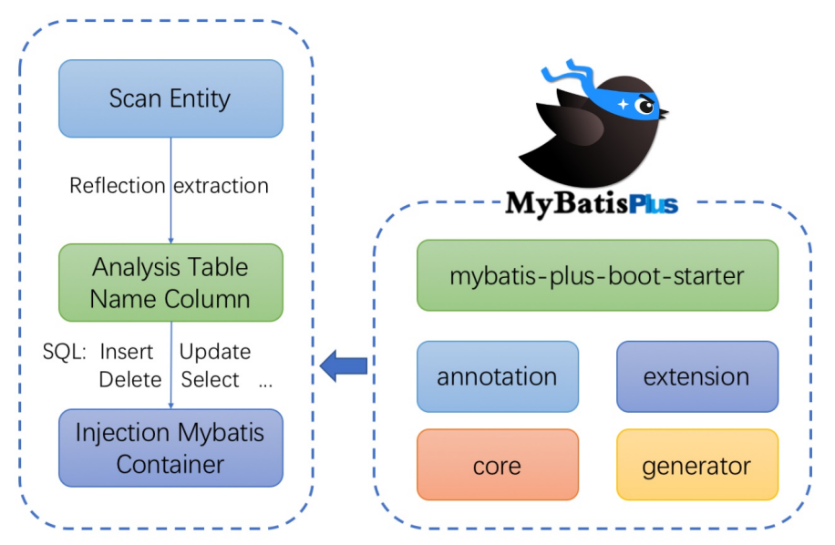

## 5、代码及文档地址

> 官方地址: [http://mp.baomidou.com](http://mp.baomidou.com)
> 代码发布地址:
> Github: [https://github.com/baomidou/mybatis-plus](https://github.com/baomidou/mybatis-plus)
> Gitee: [https://gitee.com/baomidou/mybatis-plus](https://gitee.com/baomidou/mybatis-plus)
> 文档发布地址: [https://baomidou.com/pages/24112f](https://baomidou.com/pages/24112f)

# 二、入门案例

## 1、创建表

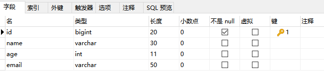

## 2、添加数据

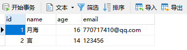

## 3、创建Spring Boot工程

### ①、Spring Boot 项目设置

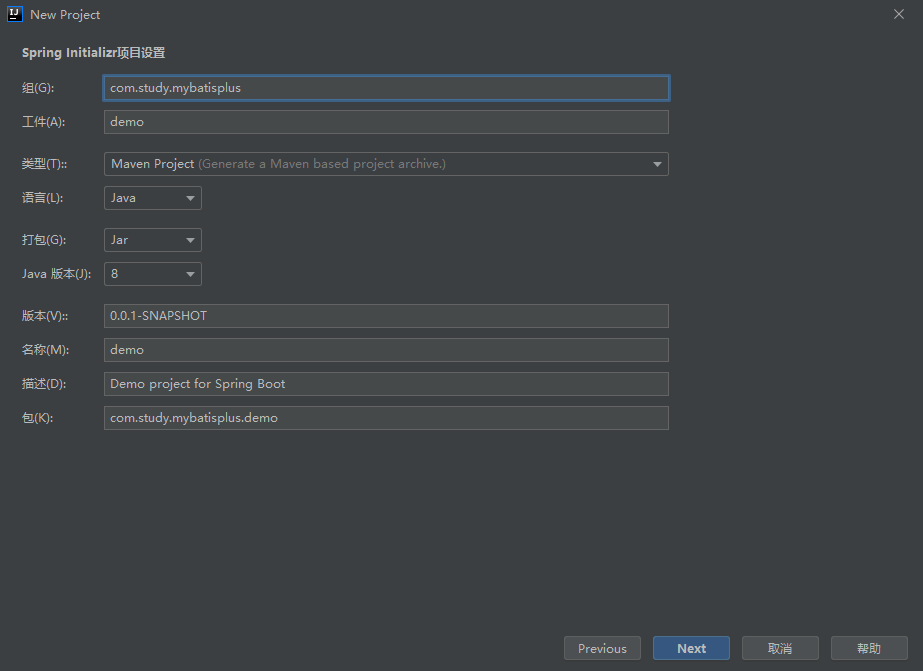

### ②、引入依赖

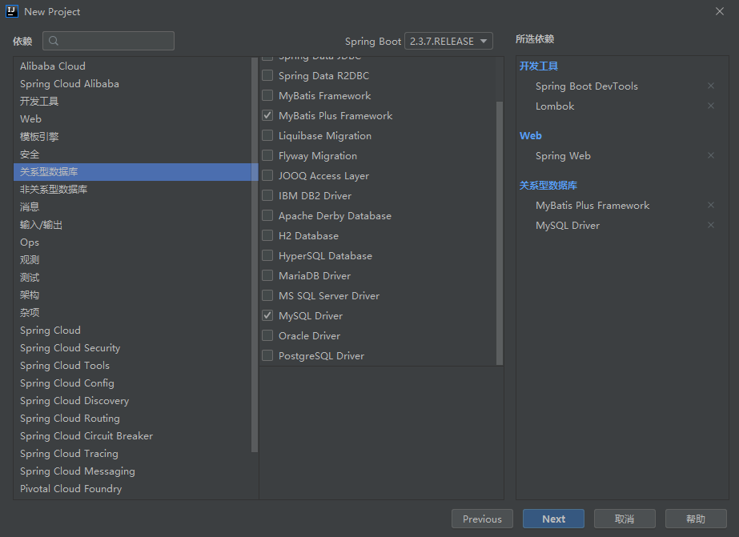

### ③、项目结构

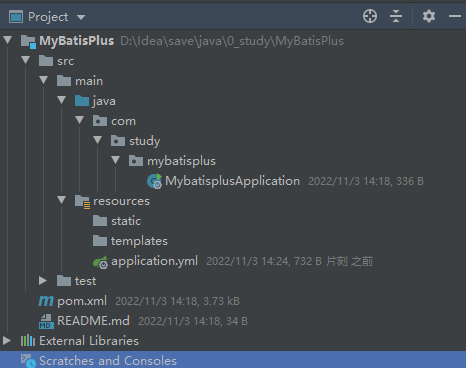

### ④、配置文件

```yaml
# 配置端口号
server:
  port: 8080

# yaml 配置文件
spring:
  # 配置数据源信息
  datasource:
    # 连接信息一定要用双引号引起来
    # characterEncoding=UTF-8：指定所处理字符的解码和编码的格式
    # useSSL=false：不进行 SSL 连接
    # allowPublicKeyRetrieval=true：允许恶意代理执行MITM攻击以获取明文密码，因此它在默认情况下为False，必须显式启用
    # serverTimezone=GMT：格林尼治标准时间
    url: "jdbc:mysql://172.20.2.55:3335/edu-trhpir-c?characterEncoding=UTF-8&useSSL=false&allowPublicKeyRetrieval=true&serverTimezone=GMT"
    username: "root"
    password: "123456"
    # 数据库驱动名
    driver-class-name: com.mysql.cj.jdbc.Driver

# 配置 MyBatis-Plus 规则
mybatis-plus:
  configuration:
    # 是否开启自动驼峰命名规则映射
    map-underscore-to-camel-case: true
    # 开启 mybatis 的 sql 执行日志打印，可以在控制台打印输出 sql 语句
    log-impl: org.apache.ibatis.logging.stdout.StdOutImpl

```

### ⑤、创建实体类

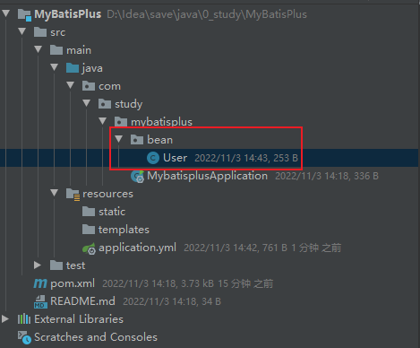

```java
package com.study.mybatisplus.bean;

import lombok.Data;

/**
 * @author 月海
 * @create 2022/11/3 14:42
 */

@Data
public class User {
    private Long id;
    private String name;
    private Integer age;
    private String email;
}

```

### ⑥、创建 mapper 接口

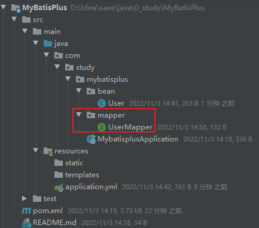

```java
package com.study.mybatisplus.mapper;

import com.baomidou.mybatisplus.core.mapper.BaseMapper;
import com.study.mybatisplus.bean.User;

/**
 * @author 月海
 * @create 2022/11/3 14:49
 * 继承 MtBatisPlus 的 BaseMapper 类，支持泛型
 */
public interface UserMapper extends BaseMapper<User> {
}

```

### ⑦、在启动类中设置 mapper接口所在的包

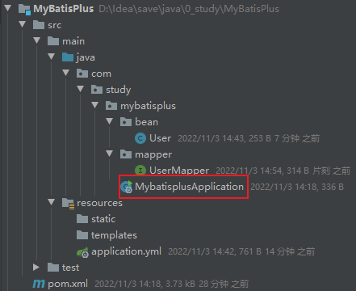

```java
package com.study.mybatisplus;

import org.mybatis.spring.annotation.MapperScan;
import org.springframework.boot.SpringApplication;
import org.springframework.boot.autoconfigure.SpringBootApplication;

/**
 * @MapperScan：扫描指定包下面的 mapper 接口
 */
@SpringBootApplication
@MapperScan("com.study.mybatisplus.mapper")
public class MybatisplusApplication {

    public static void main(String[] args) {
        SpringApplication.run(MybatisplusApplication.class, args);
    }

}

```

### ⑧、编写测试类

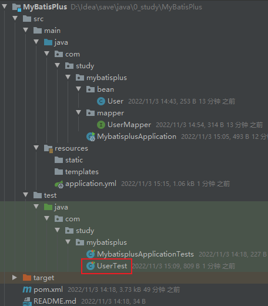

```java
package com.study.mybatisplus;

import com.study.mybatisplus.bean.User;
import com.study.mybatisplus.mapper.UserMapper;
import org.junit.jupiter.api.Test;
import org.springframework.beans.factory.annotation.Autowired;
import org.springframework.boot.test.context.SpringBootTest;

import java.util.List;

/**
 * @author 月海
 * @create 2022/11/3 14:59
 */

@SpringBootTest
public class UserTest {

    @Autowired
    private UserMapper userMapper;

    @Test
    public void userSelectList(){
        // selectList()：根据 MP 内置的条件构造器查询一个 list 集合，null 表示没有条件，即查询所有
        List<User> userList = userMapper.selectList(null);

        for (User user : userList) {
            System.out.println(user);
        }
    }

}

```

# 三、基本CRUD

## 0、BaseMapper

- MyBatis-Plus 中的基本 CRUD 在内置的 BaseMapper 中都已得到了实现，我们可以直接使用

```java
public interface BaseMapper<T> extends Mapper<T> {
    /**
     * 插入一条记录
     *
     * @param entity 实体对象
     */
    int insert(T entity);

    /**
     * 根据 ID 删除
     *
     * @param id 主键ID
     */
    int deleteById(Serializable id);

    /**
     * 根据实体(ID)删除
     *
     * @param entity 实体对象
     * @since 3.4.4
     */
    int deleteById(T entity);

    /**
     * 根据 columnMap 条件，删除记录
     *
     * @param columnMap 表字段 map 对象
     */
    int deleteByMap(@Param(Constants.COLUMN_MAP) Map<String, Object> columnMap);

    /**
     * 根据 entity 条件，删除记录
     *
     * @param queryWrapper 实体对象封装操作类（可以为 null,里面的 entity 用于生成 where
     *                     语句）
     */
    int delete(@Param(Constants.WRAPPER) Wrapper<T> queryWrapper);

    /**
     * 删除（根据ID 批量删除）
     *
     * @param idList 主键ID列表(不能为 null 以及 empty)
     */
    int deleteBatchIds(@Param(Constants.COLLECTION) Collection<? extends
            Serializable> idList);

    /**
     * 根据 ID 修改
     *
     * @param entity 实体对象
     */
    int updateById(@Param(Constants.ENTITY) T entity);

    /**
     * 根据 whereEntity 条件，更新记录
     *
     * @param entity        实体对象 (set 条件值,可以为 null)
     * @param updateWrapper 实体对象封装操作类（可以为 null,里面的 entity 用于生成
     *                      where 语句）
     */
    int update(@Param(Constants.ENTITY) T entity, @Param(Constants.WRAPPER)
            Wrapper<T> updateWrapper);

    /**
     * 根据 ID 查询
     *
     * @param id 主键ID
     */
    T selectById(Serializable id);

    /**
     * 查询（根据ID 批量查询）
     *
     * @param idList 主键ID列表(不能为 null 以及 empty)
     */
    List<T> selectBatchIds(@Param(Constants.COLLECTION) Collection<? extends
            Serializable> idList);

    /**
     * 查询（根据 columnMap 条件）
     *
     * @param columnMap 表字段 map 对象
     */
    List<T> selectByMap(@Param(Constants.COLUMN_MAP) Map<String, Object>
                                columnMap);

    /**
     * 根据 entity 条件，查询一条记录
     * <p>查询一条记录，例如 qw.last("limit 1") 限制取一条记录, 注意：多条数据会报异常
     * </p>
     *
     * @param queryWrapper 实体对象封装操作类（可以为 null）
     */
    default T selectOne(@Param(Constants.WRAPPER) Wrapper<T> queryWrapper) {
        List<T> ts = this.selectList(queryWrapper);
        if (CollectionUtils.isNotEmpty(ts)) {
            if (ts.size() != 1) {
                throw ExceptionUtils.mpe("One record is expected, but the query
                        result is multiple records");
            }
            return ts.get(0);
        }
        return null;
    }

    /**
     * 根据 Wrapper 条件，查询总记录数
     *
     * @param queryWrapper 实体对象封装操作类（可以为 null）
     */
    Long selectCount(@Param(Constants.WRAPPER) Wrapper<T> queryWrapper);

    /**
     * 根据 entity 条件，查询全部记录
     *
     * @param queryWrapper 实体对象封装操作类（可以为 null）
     */
    List<T> selectList(@Param(Constants.WRAPPER) Wrapper<T> queryWrapper);

    /**
     * 根据 Wrapper 条件，查询全部记录
     *
     * @param queryWrapper 实体对象封装操作类（可以为 null）
     */
    List<Map<String, Object>> selectMaps(@Param(Constants.WRAPPER) Wrapper<T>
                                                 queryWrapper);

    /**
     * 根据 Wrapper 条件，查询全部记录
     * <p>注意： 只返回第一个字段的值</p>
     *
     * @param queryWrapper 实体对象封装操作类（可以为 null）
     */
    List<Object> selectObjs(@Param(Constants.WRAPPER) Wrapper<T> queryWrapper);

    /**
     * 根据 entity 条件，查询全部记录（并翻页）
     *
     * @param page         分页查询条件（可以为 RowBounds.DEFAULT）
     * @param queryWrapper 实体对象封装操作类（可以为 null）
     */
    <P extends IPage<T>> P selectPage(P page, @Param(Constants.WRAPPER)
            Wrapper<T> queryWrapper);

    /**
     * 根据 Wrapper 条件，查询全部记录（并翻页）
     *
     * @param page         分页查询条件
     * @param queryWrapper 实体对象封装操作类
     */
    <P extends IPage<Map<String, Object>>> P selectMapsPage(P page,@Param(Constants.WRAPPER) Wrapper<T> queryWrapper);
}

```

## 1、插入 `insert`

1. 返回受影响的行数
2. 可通过 id 属性获得自增 id 的值

```java
@Test
public void testInsert(){
	User user = new User(null, "1", 1, "1");
	// insert：插入数据；返回受影响的行数
	int insert = userMapper.insert(user);
	System.out.println("受影响的行数：" + insert);
	
	// 可通过 id 属性获得自增 id 的值
	System.out.println("获得自增 id 的值：" + user.getId());
}
```

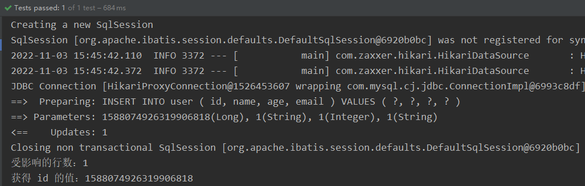

## 2、删除 `deleteById、deleteBatchIds、`

1. 返回受影响的行数
2. `deleteById`：通过单个 id 删除单个数据
3. `deleteBatchIds`：通过多个 id 删除多个数据
4. `deleteByMap`：个人那句 map 中的条件删除

```java
/**
 * 删除；通过 id 删除
 */
@Test
public void testDeleteById(){
	// deleteById：通过 id 删除数据；返回受影响的行数
	int delete = userMapper.deleteById(1588074926319906818L);
	System.out.println("受影响的行数：" + delete);
}

/**
 * 删除；通过 id 批量删除
 */
@Test
public void testDeleteChIds(){
	// 创建数组，放入 id
	List<Long> list = Arrays.asList(1588075115277451266L, 1588075151612755969L, 1588075191349600257L);
	// deleteBatchIds：通过 id 批量删除数据；返回受影响的行数
	int delete = userMapper.deleteBatchIds(list);
	System.out.println("受影响的行数：" + delete);
}

/**
 * 删除；条件删除
 */
@Test
public void testDeleteByMap(){
	// 创建 map 集合
	Map<String, Object> map = new HashMap<>();
	map.put("name",3);
	map.put("age",3);

	// deleteByMap：条件删除；返回受影响的行数
	int delete = userMapper.deleteByMap(map);
	System.out.println("受影响的行数：" + delete);
}
```

## 3、修改 `updateById`

1. 返回受影响的行数

```java
/**
 * 修改
 */
@Test
public void testUpdateById(){
	User user = new User(1588075115277451266L, "修改", 12, "修改");
	// updateById：根据 id 修改数据；返回受影响的行数
	int update = userMapper.updateById(user);
	System.out.println("受影响的行数：" + update);
}
```

## 4、查询  `selectById`、`selectBatchIds`、`selectByMap`、`selectList`

1. `selectById`：根据 id 查询
2. `selectBatchIds`：根据多个 id 查询
3. `selectByMap`：根据条件查询数据
4. `selectList`：传入空，查询所有数据

```java
/**
 * 查询；根据 id 查询
 */
@Test
public void testSelectById(){
	// selectById：根据 id 查询
	User user = userMapper.selectById(1);
	System.out.println("查询到的数据：" + user);
}

/**
 * 查询；根据多个 id 查询
 */
@Test
public void testSelectBatchIds(){
	// 创建数组，放入 id
	List<Long> list = Arrays.asList(1L, 2L, 1588075191349600257L);
	// selectBatchIds：根据多个 id 查询
	List<User> users = userMapper.selectBatchIds(list);

	for (User user : users) {
		System.out.println("查询到的数据：" + user);
	}
}

/**
 * 查询；根据条件查询数据
 */
@Test
public void testSelectByMap(){
	// 创建 map 集合，条件查询
	Map<String, Object> map = new HashMap<>();
	map.put("name",1);
	map.put("age",1);

	// selectByMap：根据条件查询数据
	List<User> users = userMapper.selectByMap(map);

	for (User user : users) {
		System.out.println("查询到的数据：" + user);
	}
}

/**
 * 查询；查询所有数据
 */
@Test
public void testSelectList(){
	// selectList：传入空，查询所有数据
	List<User> users = userMapper.selectList(null);

	for (User user : users) {
		System.out.println("查询到的数据：" + user);
	}
}
```

## 5、自定义功能

1. MyBatisPlus 默认 mapper 映射文件在类路径的 mapper 目录下
2. 也可以通过 `mybatis-plus.mapper-locations` 配置自定义路径


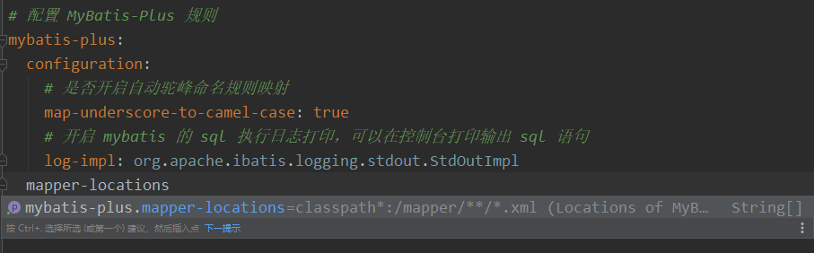

### ①、在 mapper 接口中创建方法
```java
package com.study.mybatisplus.mapper;

import com.baomidou.mybatisplus.core.mapper.BaseMapper;
import com.study.mybatisplus.bean.User;
import org.springframework.stereotype.Repository;

import java.util.Map;

/**
 * @author 月海
 * @create 2022/11/3 14:49
 * 继承 MtBatisPlus 的 BaseMapper 类，支持泛型
 */

@Repository
public interface UserMapper extends BaseMapper<User> {
    /**
     * 自定义功能；根据 id 查询，返回 map 集合
     * @param id
     * @return
     */
    Map<String, Object> selectMapById(Long id);
}

```

### ②、在类路径的 mapper 目录下创建映射文件

```xml
<?xml version="1.0" encoding="UTF-8" ?>
<!DOCTYPE mapper
        PUBLIC "-//mybatis.org//DTD Mapper 3.0//EN"
        "http://mybatis.org/dtd/mybatis-3-mapper.dtd">

<!-- MyBatis sql 映射文件 -->
<mapper namespace="com.study.mybatisplus.mapper.UserMapper">

    <!-- 自定义功能；根据 id 查询，返回 map 集合 -->
    <select id="selectMapById" resultType="map">
        select id,name,age,email from user where id=#{id}
    </select>

</mapper>
```

### ③、测试

```java
/**
 * 自定义功能；根据 id 查询
 */
@Test
public void testSelectMapById(){
	// selectMapById：自定义功能；根据 id 查询，返回 map 集合
	Map<String, Object> users = userMapper.selectMapById(1L);

	System.out.println(users);
}
```

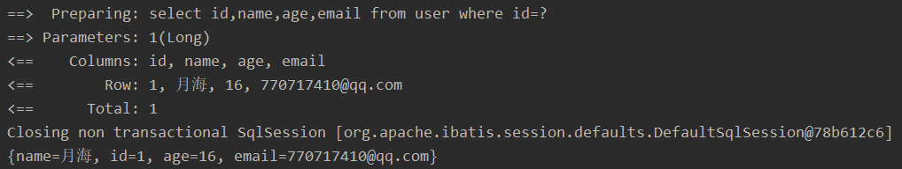

## 6、通用 Service

> 通用 Service CRUD 封装 IService 接口，进一步封装 CRUD 采用：`get 查询单行`、 `remove 删除`、`list 查询集合`、`page 分页`前缀命名方式区分 Mapper 层避免混淆
> 泛型 T 为任意实体对象
> 建议如果存在自定义通用 Service 方法的可能，请创建自己的 IBaseService 继承Mybatis-Plus 提供的基类
> 官网地址：[https://baomidou.com/pages/49cc81/#service-crud-%E6%8E%A5%E5%8F%A3](https://baomidou.com/pages/49cc81/#service-crud-%E6%8E%A5%E5%8F%A3)

### ①、IService

- MyBatis-Plus 中有一个接口 IService 和其实现类 ServiceImpl，封装了常见的业务层逻辑

### ②、创建 Service 接口和实现类

```java
package com.study.mybatisplus.service;

import com.baomidou.mybatisplus.extension.service.IService;
import com.study.mybatisplus.bean.User;

/**
 * 继承 MtBatisPlus 的 IService 类，支持泛型
 * @author 月海
 * @create 2022/11/4 9:13
 */
public interface UserService extends IService<User> {
}
```
```java
package com.study.mybatisplus.service.impl;

import com.baomidou.mybatisplus.extension.service.impl.ServiceImpl;
import com.study.mybatisplus.mapper.UserMapper;
import com.study.mybatisplus.bean.User;
import com.study.mybatisplus.service.UserService;
import org.springframework.stereotype.Service;

/**
 * 实现 UserService 接口
 * 继承 MtBatisPlus 的 ServiceImpl 类，泛型 1 为 mapper 接口，泛型 2 为对应的实体类
 * @author 月海
 * @create 2022/11/4 9:15
 */

@Service
public class UserServiceImpl extends ServiceImpl<UserMapper, User> implements UserService {
}

```

### ③、测试查询总记录数

```java
package com.study.mybatisplus;

import com.study.mybatisplus.bean.User;
import com.study.mybatisplus.service.UserService;
import org.junit.jupiter.api.Test;
import org.springframework.beans.factory.annotation.Autowired;
import org.springframework.boot.test.context.SpringBootTest;

import java.util.ArrayList;
import java.util.List;

/**
 * @author 月海
 * @create 2022/11/4 9:46
 */

@SpringBootTest
public class UserServiceTest {

    @Autowired
    private UserService userService;

    @Test
    public void testGetCount(){
        // 查询总记录数
        long count = userService.count();
        System.out.println("总记录数：" + count);
    }

}

```

### ④、测试批量插入

```java
package com.study.mybatisplus;

import com.study.mybatisplus.bean.User;
import com.study.mybatisplus.service.UserService;
import org.junit.jupiter.api.Test;
import org.springframework.beans.factory.annotation.Autowired;
import org.springframework.boot.test.context.SpringBootTest;

import java.util.ArrayList;
import java.util.List;

/**
 * @author 月海
 * @create 2022/11/4 9:46
 */

@SpringBootTest
public class UserServiceTest {

    @Autowired
    private UserService userService;

    @Test
    public void testSaveBatch(){
        // SQL 长度有限制，海量数据插入单条 SQL 无法实行，
        // 因此 MP 将批量插入放在了通用 Service 中实现，而不是通用 Mapper
        List<User> userList = new ArrayList<>();
        for (int i = 0; i < 10; i++) {
            User user = new User();
            user.setName("100" + i);
            user.setAge(100 + i);
            user.setEmail("100@" + i);

			userList.add(user);
        }

        boolean saveBatch = userService.saveBatch(userList);
        System.out.println("是否成功插入：" + saveBatch);
    }
}

```

# 四、常用注解

## 1、@TableName

> 经过以上的测试，在使用 MyBatis-Plus 实现基本的 CRUD 时，我们并没有指定要操作的表，只是在 Mappe r接口继承 BaseMapper 时，设置了泛型 User ，而操作的表为 user 表
> 由此得出结论，MyBatis-Plus 在确定操作的表时，由 BaseMapper 的泛型决定，即实体类型决定，且默认操作的表名和实体类型的类名一致
> 故若是实体类类型的类名和要操作的表的表名不一致，则会报错： Table 'mybatis_plus.user' doesn't exist

### ①、通过@TableName解决问题

> 在实体类类型上添加 @TableName("user")，标识实体类对应的表，即可成功执行 SQL 语句

```java
package com.study.mybatisplus.bean;

import com.baomidou.mybatisplus.annotation.TableName;
import lombok.AllArgsConstructor;
import lombok.Data;
import lombok.NoArgsConstructor;

/**
 * @author 月海
 * @create 2022/11/3 14:42
 *
 * @TableName("user")：标明此实体类对应的数据表为 user
 */

@Data
@AllArgsConstructor
@NoArgsConstructor
@TableName("user")
public class User {
    private Long id;
    private String name;
    private Integer age;
    private String email;
}

```

### ②、通过全局配置解决问题

```yaml
# 配置 MyBatis-Plus 规则
mybatis-plus:
  configuration:
    # 是否开启自动驼峰命名规则映射
    map-underscore-to-camel-case: true
    # 开启 mybatis 的 sql 执行日志打印，可以在控制台打印输出 sql 语句
    log-impl: org.apache.ibatis.logging.stdout.StdOutImpl
  global-config:
    db-config:
      # 配置 置MyBatis-Plus 操作表的默认前缀，即若实体类为 user，则操作的表为：t_user
      table-prefix: t_
```

## 2、@TableId

- MyBatis-Plus 在实现 CRUD 时，会默认将 id 作为主键列，并在插入数据时，默认基于雪花算法的策略生成 id

### ①、问题

1. 若实体类和表中表示主键的不是 id，而是其他字段，例如 uid，MyBatis-Plus 会自动识别 uid 为主键列吗？
2. 将实体类中的属性 id 改为 uid，将表中的字段 id 也改为 uid，测试添加功能
3. 程序抛出异常，Field 'uid' doesn't have a default value，说明 MyBatis-Plus 没有将 uid 作为主键赋值

- 我试的时候没报错😓

```java
package com.study.mybatisplus.bean;

import com.baomidou.mybatisplus.annotation.TableName;
import lombok.AllArgsConstructor;
import lombok.Data;
import lombok.NoArgsConstructor;

/**
 * @author 月海
 * @create 2022/11/3 14:42
 *
 * @TableName("user")：标明此实体类对应的数据表为 user
 */

@Data
@AllArgsConstructor
@NoArgsConstructor
@TableName("user")
public class User {
    private Long uid;
    private String name;
    private Integer age;
    private String email;
}

```

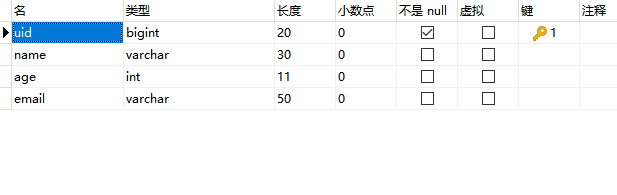

```java
/**
 * 插入
 */
@Test
public void testInsert(){
	User user = new User(4L, "1", 1, "1");
	// insert：插入数据；返回受影响的行数
	int insert = userMapper.insert(user);
	System.out.println("受影响的行数：" + insert);

	// 可通过 id 属性获得 id 的值
	System.out.println("获得 id 的值：" + user.getUid());
}
```

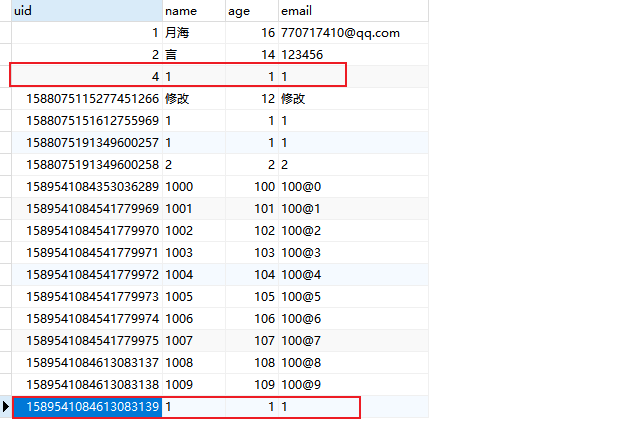

### ②、通过 @TableId 解决问题

- 在实体类中 uid 属性上通过 @TableId 将其标识为主键，即可成功执行 SQL 语句

```java
package com.study.mybatisplus.bean;

import com.baomidou.mybatisplus.annotation.TableId;
import com.baomidou.mybatisplus.annotation.TableName;
import lombok.AllArgsConstructor;
import lombok.Data;
import lombok.NoArgsConstructor;

/**
 * @author 月海
 * @create 2022/11/3 14:42
 *
 * @TableName("user")：标明此实体类对应的数据表为 user
 */

@Data
@AllArgsConstructor
@NoArgsConstructor
@TableName("user")
public class User {
    @TableId
    private Long uid;
    private String name;
    private Integer age;
    private String email;
}

```

### ③、@TableId 的 value 属性

1. 若实体类中主键对应的属性为 id，而表中表示主键的字段为 uid
2. 此时若只在实体类属性 id 上添加注解 `@TableId`，则会抛出异常 Unknown column 'id' in 'field list'，即 MyBatis-Plus 仍然会将 id 作为表的主键
3. 而表中表示主键的是字段 uid 此时需要通过 `@TableId` 注解的 value 属性，指定表中的主键字段，`@TableId("uid")` 或 `@TableId(value="uid")`

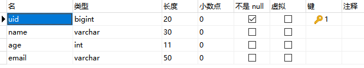

```java
package com.study.mybatisplus.bean;

import com.baomidou.mybatisplus.annotation.TableId;
import com.baomidou.mybatisplus.annotation.TableName;
import lombok.AllArgsConstructor;
import lombok.Data;
import lombok.NoArgsConstructor;

/**
 * @author 月海
 * @create 2022/11/3 14:42
 *
 * @TableName("user")：标明此实体类对应的数据表为 user
 */

@Data
@AllArgsConstructor
@NoArgsConstructor
@TableName("user")
public class User {
    @TableId("uid")
    private Long id;
    private String name;
    private Integer age;
    private String email;
}

```

### ④、@TableId 的 type 属性

- type 属性用来定义主键策略，常用的主键策略：

| 值 | 描述 |
| --- | --- |
| assign_id（默认） | 基于雪花算法的策略生成数据id；与数据库id是否设置自增无关 |
| assign_uuid | 全局唯一的 uuid；与数据库id是否设置自增无关 |
| auto | 使用数据库的自增策略；注意，该类型请确保数据库设置了id自增，否则无效 |
| input | 手动输入 |
| none | 未设置主键 |

```yaml
# 配置 MyBatis-Plus 规则
mybatis-plus:
  configuration:
    # 是否开启自动驼峰命名规则映射
    map-underscore-to-camel-case: true
    # 开启 mybatis 的 sql 执行日志打印，可以在控制台打印输出 sql 语句
    log-impl: org.apache.ibatis.logging.stdout.StdOutImpl
  global-config:
    db-config:
      # 配置 置MyBatis-Plus 操作表的默认前缀，即若实体类为 user，则操作的表为：t_user
      table-prefix: t_
      id-type: auto

```

## 3、@TableField

### ①、驼峰自动转化

1. 若实体类中的属性使用的是驼峰命名风格，而表中的字段使用的是下划线命名风格；例如实体类属性 userName，表中字段 user_name
2. 此时 MyBatis-Plus 会自动将下划线命名风格转化为驼峰命名风格

相当于在MyBatis中配置：map-underscore-to-camel-case

```yaml
# 配置 MyBatis-Plus 规则
mybatis-plus:
  configuration:
    # 是否开启自动驼峰命名规则映射
    map-underscore-to-camel-case: true
```

### ②、属性与字段不同

1. 若实体类中的属性和表中的字段不满足情况 1；例如实体类属性 name，表中字段 username
2. 此时需要在实体类属性上使用 `@TableField("username")` 设置属性所对应的字段名


```java
package com.study.mybatisplus.bean;

import com.baomidou.mybatisplus.annotation.TableField;
import com.baomidou.mybatisplus.annotation.TableId;
import com.baomidou.mybatisplus.annotation.TableName;
import lombok.AllArgsConstructor;
import lombok.Data;
import lombok.NoArgsConstructor;

/**
 * @author 月海
 * @create 2022/11/3 14:42
 *
 * @TableName("user")：标明此实体类对应的数据表为 user
 */

@Data
@AllArgsConstructor
@NoArgsConstructor
@TableName("user")
public class User {
    @TableId("uid")
    private Long id;
    @TableField("username")
    private String name;
    private Integer age;
    private String email;
}

```

## 4、@TableLogic

### ①、逻辑删除

1. 物理删除：真实删除，将对应数据从数据库中删除，之后查询不到此条被删除的数据
2. 逻辑删除：假删除，将对应数据中代表是否被删除字段的状态修改为“被删除状态”，之后在数据库中仍旧能看到此条数据记录
3. 使用场景：可以进行数据恢复

### ②、实现逻辑删除

1. 在表中新建字段，并使其默认值为 0

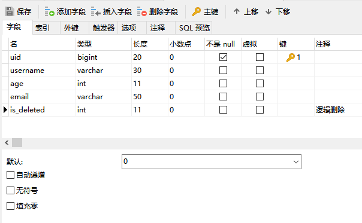

2. 实体类中新建属性，增加注解，添加构造函数

```java
package com.study.mybatisplus.bean;

import com.baomidou.mybatisplus.annotation.TableField;
import com.baomidou.mybatisplus.annotation.TableId;
import com.baomidou.mybatisplus.annotation.TableLogic;
import com.baomidou.mybatisplus.annotation.TableName;
import lombok.AllArgsConstructor;
import lombok.Data;
import lombok.NoArgsConstructor;

/**
 * @author 月海
 * @create 2022/11/3 14:42
 *
 * @TableName("user")：标明此实体类对应的数据表为 user
 */

@Data
@AllArgsConstructor
@NoArgsConstructor
@TableName("user")
public class User {
    @TableId("uid")
    private Long id;
    @TableField("username")
    private String name;
    private Integer age;
    private String email;
    @TableLogic
    private Integer isDeleted;

    public User(Long id, String name, Integer age, String email) {
        this.id = id;
        this.name = name;
        this.age = age;
        this.email = email;
    }
}

```

3. 测试插入；插入时的默认值为 0

```java
/**
 * 插入
 */
@Test
public void testInsert(){
	User user = new User(null, "1", 1, "1");
	// insert：插入数据；返回受影响的行数
	int insert = userMapper.insert(user);
	System.out.println("受影响的行数：" + insert);

	// 可通过 id 属性获得 id 的值
	System.out.println("获得 id 的值：" + user.getId());
}
```

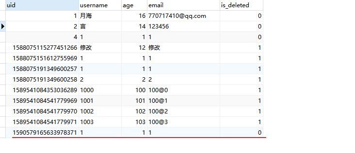


4. 测试查询；只能查到逻辑删除字段为 0 的值
```java
@Test
public void userSelectList(){
	// selectList()：根据 MP 内置的条件构造器查询一个 list 集合，null 表示没有条件，即查询所有
	List<User> userList = userMapper.selectList(null);

	for (User user : userList) {
		System.out.println(user);
	}
}
```

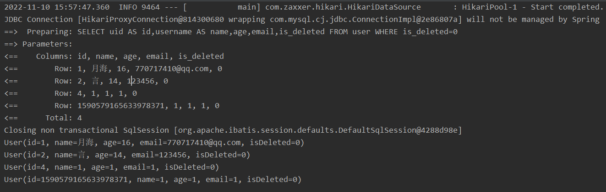

5. 测试删除

```java
/**
 * 删除；通过 id 删除
 */
@Test
public void testDeleteById(){
	// deleteById：通过 id 删除数据；返回受影响的行数
	int delete = userMapper.deleteById(1L);
	System.out.println("受影响的行数：" + delete);
}
```

6. 查看日志，虽然调用的是删除方法，但 sql 语句是修改

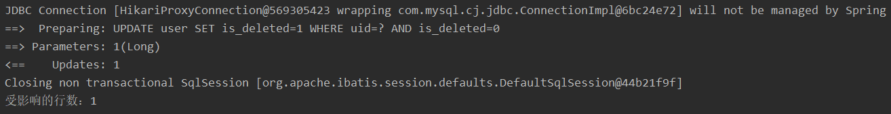

7. 数据库中对应数据的逻辑删除字段变为 1

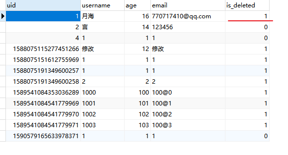

8. 再次查询，查不到被逻辑删除的字段

```java
@Test
public void userSelectList(){
	// selectList()：根据 MP 内置的条件构造器查询一个 list 集合，null 表示没有条件，即查询所有
	List<User> userList = userMapper.selectList(null);

	for (User user : userList) {
		System.out.println(user);
	}
}
```

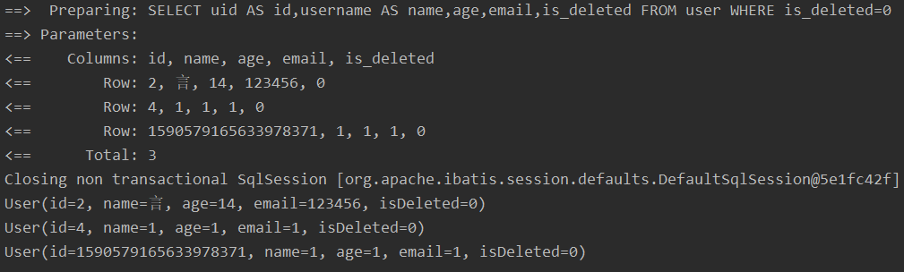

# 五、条件构造器 `wapper` 和常用接口

## 1、wapper 介绍

- Wrapper ： 条件构造抽象类，最顶端父类
   - AbstractWrapper ： 用于查询条件封装，生成 sql 的 where 条件
      - QueryWrapper ： 查询、删除条件封装
      - UpdateWrapper ： 修改条件封装
      - AbstractLambdaWrapper ： 使用 Lambda 语法
         - LambdaQueryWrapper ：用于 Lambda 语法使用的查询、删除 Wrapper
         - LambdaUpdateWrapper ： 用于 Lambda 语法使用的修改 Wrapper

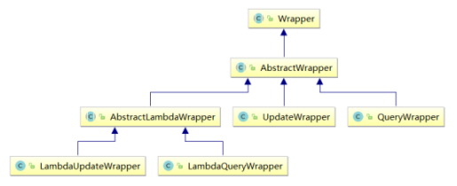

| 链式方法 | 作用 |
| --- | --- |
| gt | 大于 |
| ge | 大于等于 |
| lt | 小于 |
| le | 小于等于 |
| eq | 等于 |
| ne | 不等于 |
| allEq | 所有非空属性等于 |
| like | 模糊查询 |
| between | 区间（闭区间） |
| isNull | 为空 |
| isNotNull | 非空 |
|  |  |
| orderByAsc | 升序排序 |
| orderByDesc | 降序排序 |
| and | 且；连接前后的两个条件 |
| or | 或；连接上面的两个条件 |
|  |  |
| select | 指定查询的字段 |

## 2、QueryWrapper： 查询、删除条件封装

### ①、组装查询条件

```java
@Test
public void selectListTest(){
	
	QueryWrapper<User> queryWrapper = new QueryWrapper<>();
	
	// 查询用户名包含 1，年龄在 10 到 100 之间，并且邮箱不为 null 的用户信息
	// 链式调用默认以 and 连接；输入的字段名为数据库字段名，而不是实体类的属性名
	// SELECT uid AS id,username AS name,age,email,is_deleted FROM user WHERE is_deleted=0 AND (username LIKE ? AND age BETWEEN ? AND ? AND email IS NOT NULL)
			// like：模糊查询；查询用户名包含 1
	queryWrapper.like("username","1")
			// between：区间（闭区间）；年龄在 10 到 100 之间
			.between("age",10,100)
			// isNotNull：非空；邮箱不为 null
			.isNotNull("email");

	// 同样不能查询出逻辑删除的数据
	List<User> userList = userMapper.selectList(queryWrapper);
	System.out.println(userList);
}
```

- 查询结果

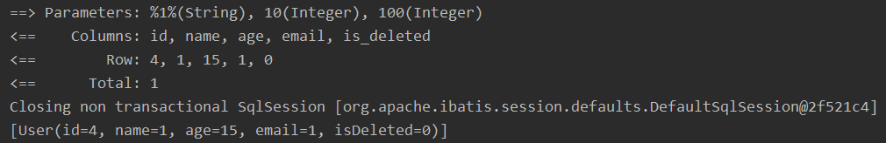


- 数据库数据

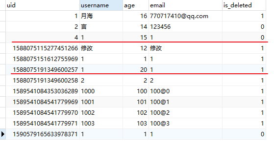

### ②、组装排序条件

```java
@Test
public void selectListTest02(){

	QueryWrapper<User> queryWrapper = new QueryWrapper<>();

	// 按年龄降序查询用户，如果年龄相同则按 id 升序排列
	// SELECT uid AS id,username AS name,age,email,is_deleted FROM user WHERE is_deleted=0 ORDER BY age DESC,id ASC
			// orderByDesc：降序排序；按年龄降序查询用户
	queryWrapper.orderByDesc("age")
			// orderByAsc：升序排序； 如果年龄相同则按 id 升序排列
			.orderByAsc("id");

	List<User> userList = userMapper.selectList(queryWrapper);
	// userList.forEach(user -> System.out.println(user));
	// 进一步简化
	userList.forEach(System.out::println);
}
```

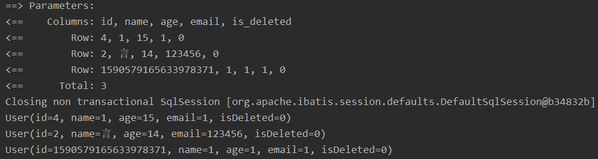

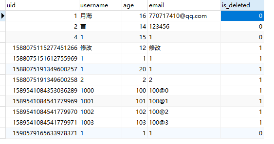

### ③、组装删除条件

```java
@Test
public void selectListTest03(){

	QueryWrapper<User> queryWrapper = new QueryWrapper<>();

	// 删除 email 为空的用户；逻辑删除
	// UPDATE user SET is_deleted=1 WHERE is_deleted=0 AND (email IS NULL)
				// isNull：为空
	queryWrapper.isNull("email");

	int delete = userMapper.delete(queryWrapper);
	System.out.println("受影响的行数：" + delete);
}
```

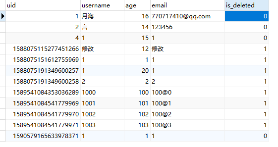

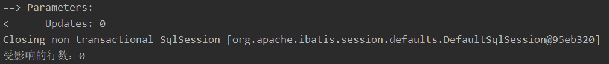

### ④、组装修改条件

```java
@Test
public void selectListTest04(){

	QueryWrapper<User> queryWrapper = new QueryWrapper<>();

	// 将（年龄大于 20 并且 uid 中包含有 1）或 （邮箱不为 null 的 并且 年龄小于 101 并且 年龄大于 20 ）的用户信息修改
	// UPDATE user SET username=? WHERE is_deleted=0 AND (age > ? AND uid LIKE ? OR email IS NOT NULL AND age < ? AND age > ?)
			// gt：大于
			// ge：大于等于
			// lt：小于
			// le：小于等于
			// eq：等于
			// ne：不等于
			// allEq：所有非空属性等于
	queryWrapper.gt("age",20)
			.like("uid","5")
			// or：或；连接上下的所有条件；or 的级别比 and 低，所以不用括号，也先执行 and
			.or()
			.isNotNull("email")
			.lt("age",101)
			.gt("age",20);

	// 修改为的数据
	User user = new User(null,"queryWrapper 修改测试",null,null,null);
	// update：修改
		// 参数 1 ：修改为的数据
		// 参数 2 ：组装的修改条件
	int update = userMapper.update(user, queryWrapper);
	System.out.println("受影响的行数：" + update);
}
```

- 修改前

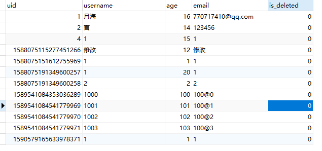

- 修改后

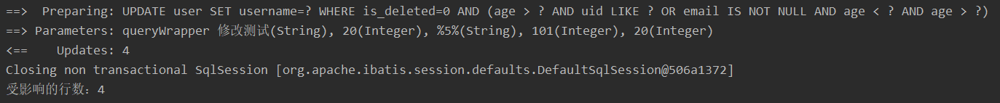

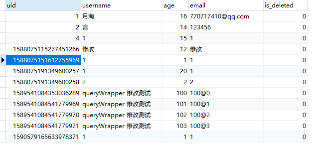

### ⑤、 条件的优先级

```java
@Test
public void selectListTest05(){

	QueryWrapper<User> queryWrapper = new QueryWrapper<>();

	// 将（年龄大于 20 并且 uid 中包含有 1）并且（邮箱不为 null 并且 年龄大于 50 或 uid 中包含有 5）的用户信息修改
	// UPDATE user SET username=? WHERE is_deleted=0 AND (age > ? AND uid LIKE ? AND (email IS NOT NULL AND age > ? OR uid LIKE ?))
	// gt：大于
	// ge：大于等于
	// lt：小于
	// le：小于等于
	// eq：等于
	// ne：不等于
	// allEq：所有非空属性等于
	// lambda 表达式内的逻辑优先运算
	queryWrapper.gt("age",20)
			.like("uid","1")
			// or：或；连接上下的所有条件；or 的级别比 and 低，所以不用括号，也先执行 and
			.and(
					i->i.isNotNull("email")
					.gt("age",50)
					.or()
					.like("uid","5")
			);


	// 修改为的数据
	User user = new User(null,"queryWrapper 修改测试2",null,null,null);
	// update：修改
	// 参数 1 ：修改为的数据
	// 参数 2 ：组装的修改条件
	int update = userMapper.update(user, queryWrapper);
	System.out.println("受影响的行数：" + update);
}
```

- 修改前

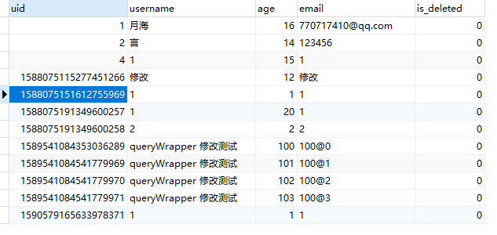

- 修改后

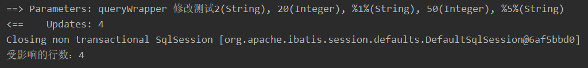

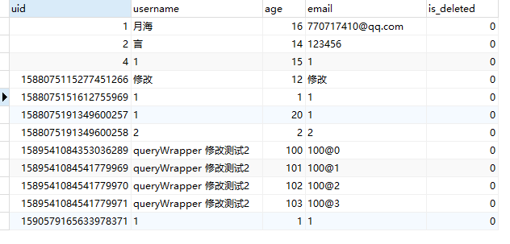

### ⑥、查询指定字段

```java
@Test
public void selectListTest06(){

	QueryWrapper<User> queryWrapper = new QueryWrapper();
	
	// 只查询 username 和 age 字段
	// SELECT username,age FROM user WHERE is_deleted=0
	queryWrapper.select("username","age");
	// 返回的数据时泛型为 map 的 list 集合
	List selectMaps = userMapper.selectMaps(queryWrapper);
	selectMaps.forEach(System.out::println);
}
```

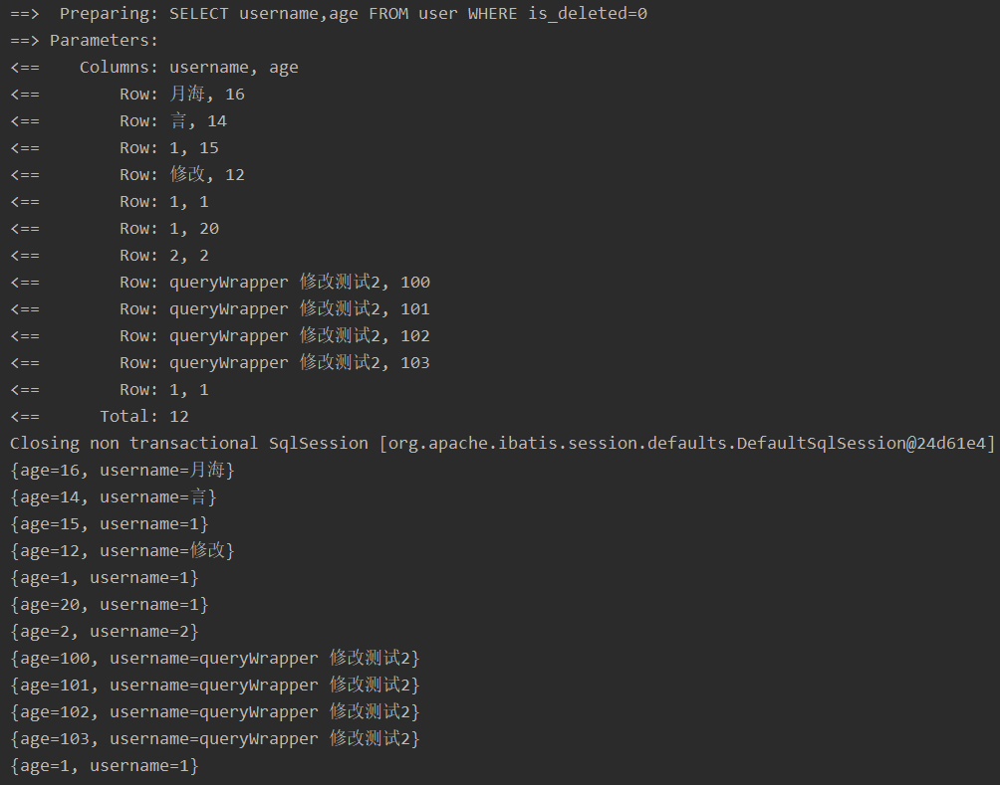

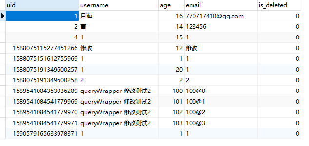

### ⑦、实现子查询

```java
@Test
public void selectListTest07(){

	QueryWrapper<User> queryWrapper = new QueryWrapper();

	// 查询 uid 小于等于 3 的用户信息
	// SELECT uid AS id,username AS name,age,email,is_deleted FROM user WHERE is_deleted=0 AND (uid IN (select uid from user where uid <= 3))
	queryWrapper.inSql("uid","select uid from user where uid <= 3");
	// 返回的数据时泛型为 map 的 list 集合
	List<User> userList = userMapper.selectList(queryWrapper);
	userList.forEach(System.out::println);
}
```

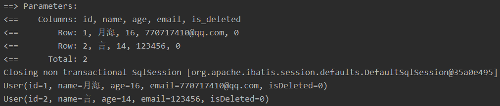

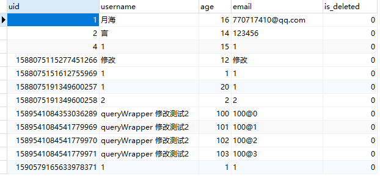

## 3、UpdateWrapper ： 修改条件封装

```java
@Test
public void test01(){

	UpdateWrapper<User> updateWrapper = new UpdateWrapper();

	// 修改 uid 包含 8 并且（年龄等于 100 或者 年龄等于 101 ）的数据
	// 将 username 改为 updateWrapper 修改，email 改为 updateWrapper@email
	// UPDATE user SET username=?,email=? WHERE is_deleted=0 AND (uid LIKE ? AND (age = ? OR age = ?))
			// set：封装修改内容
	updateWrapper.set("username","updateWrapper 修改")
			.set("email","updateWrapper@email")
			.like("uid","8")
			.and(
					i -> i.eq("age","100")
					.or()
					.eq("age","101")
			);

	// 这里必须要创建 User 对象，否则无法应用自动填充。如果没有自动填充，可以设置为 null
	int update = userMapper.update(null, updateWrapper);
	System.out.println("受影响的行数：" + update);
}
```

- 修改前

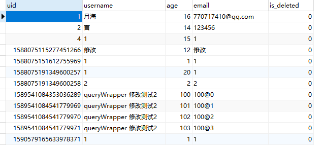

- 修改后

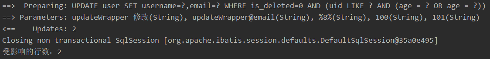

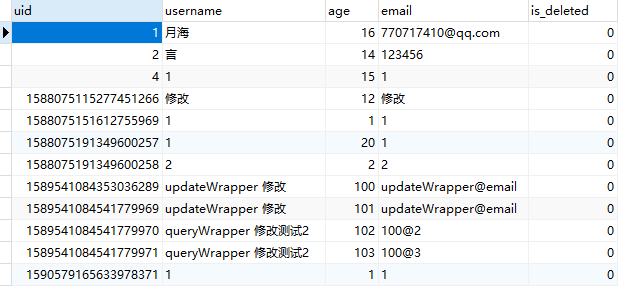

## 4、condition

> 在真正开发的过程中，组装条件是常见的功能，而这些条件数据来源于用户输入，是可选的，因此我们在组装这些条件时，必须先判断用户是否选择了这些条件，若选择则需要组装该条件，若没有选择则一定不能组装，以免影响 SQL 执行的结果
> 我们可以使用带 condition 参数的重载方法构建查询条件；当条件不满足时，不会组装该条件；这里只判断了 username，没有判断 ageBegin 和 ageEnd

> 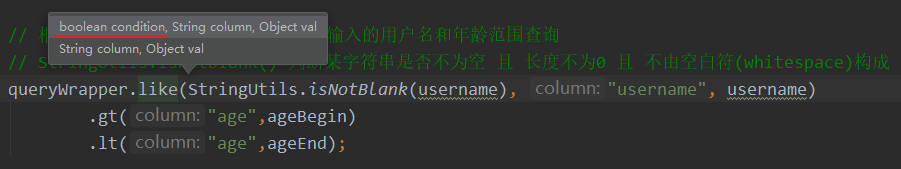

```java
@Test
public void test01(){

	// 模拟用户输入；定义查询条件，有可能为 null（用户未输入或未选择）
	String username = null;
	Integer ageBegin = 10;
	Integer ageEnd = 24;

	QueryWrapper<User> queryWrapper = new QueryWrapper();

	// 根据用户的输入进行查询：根据用户输入的用户名和年龄范围查询
	// StringUtils.isNotBlank() 判断某字符串是否不为空 且 长度不为0 且 不由空白符(whitespace)构成
	// SELECT uid AS id,username AS name,age,email,is_deleted FROM user WHERE is_deleted=0 AND (age > ? AND age < ?)
	queryWrapper.like(StringUtils.isNotBlank(username), "username", username)
			.gt("age",ageBegin)
			.lt("age",ageEnd);

	List<User> userList = userMapper.selectList(queryWrapper);
	userList.forEach(System.out::println);
}
```

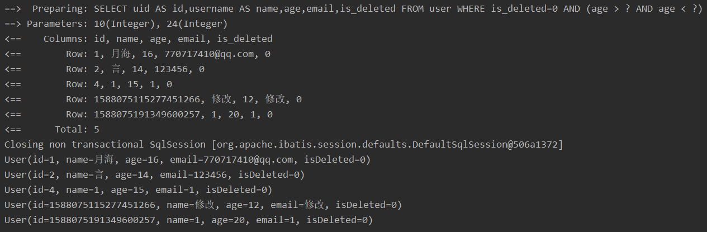

## 5、LambdaQueryWrapper ：用于 Lambda 语法使用的查询 Wrapper

- 以方法引用的方式调用实体类中的属性，决解了 QueryWrapper 硬编码写死数据库字段名的问题

```java
@Test
public void LambdaQueryWrapperTest(){
	// 模拟用户输入；定义查询条件，有可能为 null（用户未输入或未选择）
	String username = "1";
	Integer ageBegin = 10;
	Integer ageEnd = 24;

	LambdaQueryWrapper<User> queryWrapper = new LambdaQueryWrapper();

	// 根据用户的输入进行查询：根据用户输入的用户名和年龄范围查询
	// StringUtils.isNotBlank() 判断某字符串是否不为空 且 长度不为0 且 不由空白符(whitespace)构成
	// SELECT uid AS id,username AS name,age,email,is_deleted FROM user WHERE is_deleted=0 AND (username LIKE ? AND age > ? AND age < ?)
	queryWrapper.like(StringUtils.isNotBlank(username), User::getName, username)
			.gt(ageBegin != null, User::getAge, ageBegin)
			.lt(ageEnd != null, User::getAge,ageEnd);

	List<User> userList = userMapper.selectList(queryWrapper);
	userList.forEach(System.out::println);
}
```

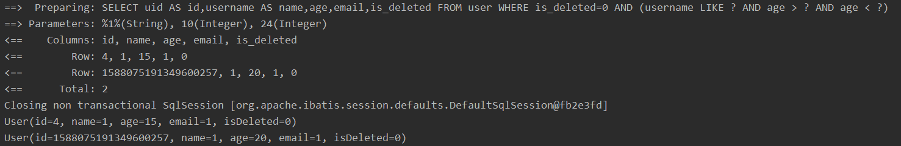

## 6、LambdaUpdateWrapper ： 用于 Lambda 语法使用的修改 Wrapper

- 以方法引用的方式调用实体类中的属性，决解了 UpdateWrapper 硬编码写死数据库字段名的问题

```java
@Test
public void LambdaUpdateWrapper(){

	LambdaUpdateWrapper<User> updateWrapper = new LambdaUpdateWrapper();

	// 查询 uid 包含 8 并且（年龄等于 100 或者 年龄等于 101 ）的数据
	// 将 username 改为 updateWrapper 修改，email 改为 updateWrapper@email
	// UPDATE user SET username=?,email=? WHERE is_deleted=0 AND (uid LIKE ? AND (age = ? OR age = ?))
	// set：封装修改内容
	updateWrapper.set(User::getName,"updateWrapper 修改2222222222")
			.set(User::getEmail,"updateWrapper222222222222222@email")
			.like(User::getId,"8")
			.and(
					i -> i.eq(User::getAge,"100")
							.or()
							.eq(User::getAge,"101")
			);

	// 这里必须要创建 User 对象，否则无法应用自动填充。如果没有自动填充，可以设置为 null
	int update = userMapper.update(null, updateWrapper);
	System.out.println("受影响的行数：" + update);
}
```

- 修改前

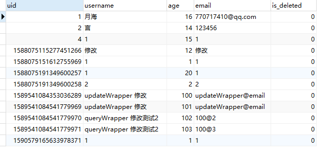

- 修改后

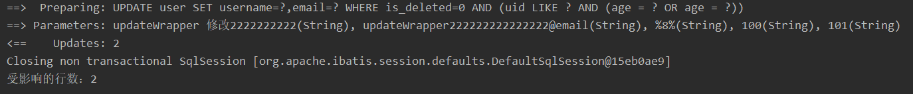

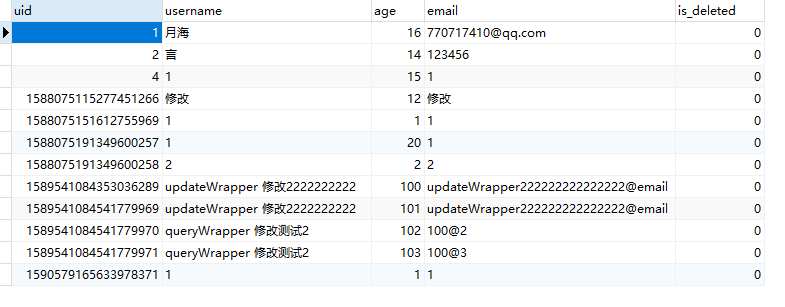

# 六、插件

## 1、分页插件

### ①、添加配置类

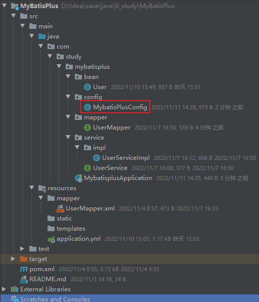

```java
package com.study.mybatisplus.config;

import com.baomidou.mybatisplus.annotation.DbType;
import com.baomidou.mybatisplus.extension.plugins.MybatisPlusInterceptor;
import com.baomidou.mybatisplus.extension.plugins.inner.PaginationInnerInterceptor;
import org.mybatis.spring.annotation.MapperScan;
import org.springframework.context.annotation.Configuration;

/**
 * @author 月海
 * @create 2022/11/11 14:19
 *
 * 可以将启动类中的 @MapperScan 注解移到此处
 */

@Configuration
@MapperScan("com.study.mybatisplus.mapper")
public class MybatisPlusConfig {

	@Bean
    public MybatisPlusInterceptor mybatisPlusInterceptor(){
        MybatisPlusInterceptor interceptor = new MybatisPlusInterceptor();
        // 添加分页插件；参数：数据库类型
        interceptor.addInnerInterceptor(new PaginationInnerInterceptor(DbType.MYSQL));

        return interceptor;
    }

}

```

### ②、测试

```java
@Test
public void test01(){
	// 设置分页参数；参数 1：当前页数；参数 2：每页的数据数
	Page<User> page = new Page<>(1, 5);
	userMapper.selectPage(page, null);

	// 获取分页数据
	// SELECT uid AS id,username AS name,age,email,is_deleted FROM user WHERE is_deleted=0
	List<User> list = page.getRecords();
	list.forEach(System.out::println);
	
	System.out.println("当前页："+page.getCurrent());
	System.out.println("每页显示的条数："+page.getSize());
	System.out.println("总记录数："+page.getTotal());
	System.out.println("总页数："+page.getPages());
	System.out.println("是否有上一页："+page.hasPrevious());
	System.out.println("是否有下一页："+page.hasNext());
}
```

### ③、测试结果

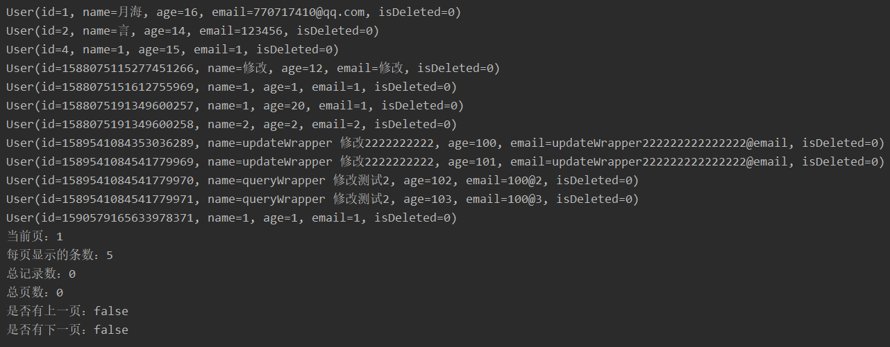

## 2、xml 自定义分页

- 在自定义的 sql 语句中使用分页插件

### ①、UserMapper 中定义接口方法

```java
/**
 * 根据用户名模糊查询，使用分页插件
 * @param page 分页对象，xml 中可以从里面进行取值,传递参数 Page 即自动分页，必须放在第一位
 * @param username
 * @return
 */
Page<User> selectByUsernamePage(@Param("page") Page<User> page, @Param("username") String username);
```

### ②、UserMapper.xml 中编写 SQL

```xml
<!-- 根据用户名模糊查询，使用分页插件 -->
<select id="selectByUsernamePage" resultType="com.study.mybatisplus.bean.User">
		SELECT uid AS id,username AS name,age,email,is_deleted FROM user WHERE username LIKE #{username}
</select>
```

### ③、测试

```java
@Test
public void test02(){
	// 设置分页参数；参数 1：当前页数；参数 2：每页的数据数
	Page<User> page = new Page<>(1, 2);
	userMapper.selectByUsernamePage(page, "1");

	// 获取分页数据
	// SELECT uid AS id,username AS name,age,email,is_deleted FROM user WHERE username LIKE ?
	List<User> list = page.getRecords();
	list.forEach(System.out::println);

	System.out.println("当前页："+page.getCurrent());
	System.out.println("每页显示的条数："+page.getSize());
	System.out.println("总记录数："+page.getTotal());
	System.out.println("总页数："+page.getPages());
	System.out.println("是否有上一页："+page.hasPrevious());
	System.out.println("是否有下一页："+page.hasNext());
}
```

### ④、测试结果

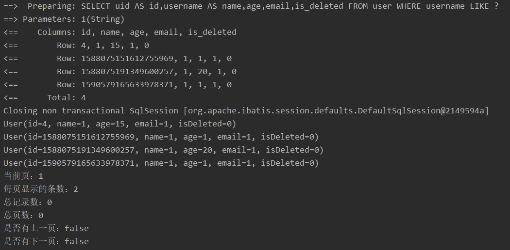

## 3、乐观锁

### ①、场景

> 一件商品，成本价是80元，售价是100元。老板先是通知小李，说你去把商品价格增加50元。小李正在玩游戏，耽搁了一个小时。正好一个小时后，老板觉得商品价格增加到150元，价格太高，可能会影响销量。又通知小王，你把商品价格降低30元。
> 此时，小李和小王同时操作商品后台系统。小李操作的时候，系统先取出商品价格100元；小王也在操作，取出的商品价格也是100元。小李将价格加了50元，并将100+50=150元存入了数据库；小王将商品减了30元，并将100-30=70元存入了数据库。是的，如果没有锁，小李的操作就完全被小王的覆盖了。
> 现在商品价格是70元，比成本价低10元。几分钟后，这个商品很快出售了1千多件商品，老板亏1万多。

### ②、乐观锁与悲观锁

> 上面的故事，如果是乐观锁，小王保存价格前，会检查下价格是否被人修改过了。如果被修改过了，则重新取出的被修改后的价格，150元，这样他会将120元存入数据库。
> 如果是悲观锁，小李取出数据后，小王只能等小李操作完之后，才能对价格进行操作，也会保证最终的价格是120元。

### ③、实现原理

- 在数据库表中添加一个字段，用来记录版本号，每次修改操作会使版本号增加版本号低者的操作将会被驳回

### ④、模拟修改冲突

#### Ⅰ、数据库中增加商品表

```sql
CREATE TABLE t_product (
	id BIGINT ( 20 ) NOT NULL COMMENT '主键ID',
	NAME VARCHAR ( 30 ) NULL DEFAULT NULL COMMENT '商品名称',
	price INT ( 11 ) DEFAULT 0 COMMENT '价格',
	VERSION INT ( 11 ) DEFAULT 0 COMMENT '乐观锁版本号',
	PRIMARY KEY ( id ) 
);
```

#### Ⅱ、添加数据

```sql
INSERT INTO t_product (id, NAME, price) VALUES (1, '外星人笔记本', 100);
```

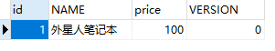

#### Ⅲ、添加实体类

```java
package com.study.mybatisplus.bean;

import lombok.Data;

/**
 * @author 10222148
 * @create 2022/11/11 15:21
 */

@Data
public class Product {
    private Long id;
    private String name;
    private Integer price;
    private Integer version;
}

```

#### Ⅳ、添加 mapper 接口

```java
package com.study.mybatisplus.mapper;

import com.baomidou.mybatisplus.core.mapper.BaseMapper;
import com.study.mybatisplus.bean.Product;

/**
 * @author 10222148
 * @create 2022/11/11 15:22
 */
public interface ProductMapper extends BaseMapper<Product> {
}

```

#### Ⅴ、测试

```java
package com.study.mybatisplus;

import com.study.mybatisplus.bean.Product;
import com.study.mybatisplus.mapper.ProductMapper;
import org.junit.jupiter.api.Test;
import org.springframework.beans.factory.annotation.Autowired;
import org.springframework.boot.test.context.SpringBootTest;

/**
 * @author 10222148
 * @create 2022/11/11 15:23
 */

@SpringBootTest
public class testConcurrentUpdate {

    @Autowired
    private ProductMapper productMapper;

    @Test
    public void testConcurrentUpdate() {
        //1、小李
        Product p1 = productMapper.selectById(1L);
        System.out.println("小李取出的价格：" + p1.getPrice());
        //2、小王
        Product p2 = productMapper.selectById(1L);
        System.out.println("小王取出的价格：" + p2.getPrice());

        //3、小李将价格加了50元，存入了数据库
        p1.setPrice(p1.getPrice() + 50);
        int result1 = productMapper.updateById(p1);
        System.out.println("小李修改结果：" + result1);
        //4、小王将商品减了30元，存入了数据库
        p2.setPrice(p2.getPrice() - 30);
        int result2 = productMapper.updateById(p2);
        System.out.println("小王修改结果：" + result2);

        //最后的结果
        Product p3 = productMapper.selectById(1L);
        //价格覆盖，最后的结果：70
        System.out.println("最后的结果：" + p3.getPrice());
    }

}

```

#### Ⅵ、测试结果

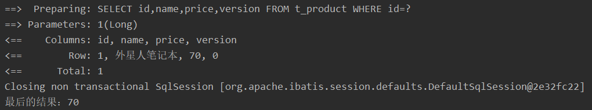

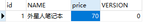

### ⑤、乐观锁实现流程

1. 数据库中添加 version 字段
2. 取出记录时，获取当前 version

```java
SELECT id,`name`,price,`version` FROM product WHERE id=1
```

3. 更新时，version + 1，如果where语句中的 version 版本不对，则更新失败

```java
UPDATE product SET price=price+50, `version`=`version` + 1 WHERE id=1 AND `version`=1
```

### ⑥、Mybatis-Plus 实现乐观锁

#### Ⅰ、修改实体类

- 添加注解

```java
package com.study.mybatisplus.bean;

import com.baomidou.mybatisplus.annotation.Version;
import lombok.Data;

/**
 * @author 10222148
 * @create 2022/11/11 15:21
 */

@Data
public class Product {
    private Long id;
    private String name;
    private Integer price;
    @Version
    private Integer version;
}

```

#### Ⅱ、添加乐观锁插件配置

```java
package com.study.mybatisplus.config;

import com.baomidou.mybatisplus.annotation.DbType;
import com.baomidou.mybatisplus.extension.plugins.MybatisPlusInterceptor;
import com.baomidou.mybatisplus.extension.plugins.inner.OptimisticLockerInnerInterceptor;
import com.baomidou.mybatisplus.extension.plugins.inner.PaginationInnerInterceptor;
import org.mybatis.spring.annotation.MapperScan;
import org.springframework.context.annotation.Configuration;

/**
 * @author 月海
 * @create 2022/11/11 14:19
 *
 * 可以将启动类中的 @MapperScan 注解移到此处
 */

@Configuration
@MapperScan("com.study.mybatisplus.mapper")
public class MybatisPlusConfig {

	@Bean
    public MybatisPlusInterceptor mybatisPlusInterceptor(){
        MybatisPlusInterceptor interceptor = new MybatisPlusInterceptor();
        // 添加分页插件；参数：数据库类型
        interceptor.addInnerInterceptor(new PaginationInnerInterceptor(DbType.MYSQL));
        // 添加乐观锁插件
        interceptor.addInnerInterceptor(new OptimisticLockerInnerInterceptor());

        return interceptor;
    }

}

```

#### Ⅲ、mapper 接口不变

```java
package com.study.mybatisplus.mapper;

import com.baomidou.mybatisplus.core.mapper.BaseMapper;
import com.study.mybatisplus.bean.Product;

/**
 * @author 10222148
 * @create 2022/11/11 15:22
 */
public interface ProductMapper extends BaseMapper<Product> {
}

```

#### Ⅳ、测试修改冲突

```java
package com.study.mybatisplus;

import com.study.mybatisplus.bean.Product;
import com.study.mybatisplus.mapper.ProductMapper;
import org.junit.jupiter.api.Test;
import org.springframework.beans.factory.annotation.Autowired;
import org.springframework.boot.test.context.SpringBootTest;

/**
 * @author 10222148
 * @create 2022/11/11 15:23
 */

@SpringBootTest
public class testConcurrentUpdate {

    @Autowired
    private ProductMapper productMapper;

    @Test
    public void testConcurrentUpdate() {
        //1、小李
        Product p1 = productMapper.selectById(1L);
        System.out.println("小李取出的价格：" + p1.getPrice());
        //2、小王
        Product p2 = productMapper.selectById(1L);
        System.out.println("小王取出的价格：" + p2.getPrice());

        //3、小李将价格加了50元，存入了数据库
        p1.setPrice(p1.getPrice() + 50);
        int result1 = productMapper.updateById(p1);
        System.out.println("小李修改结果：" + result1);
        //4、小王将商品减了30元，存入了数据库
        p2.setPrice(p2.getPrice() - 30);
        int result2 = productMapper.updateById(p2);
        System.out.println("小王修改结果：" + result2);

        //最后的结果
        Product p3 = productMapper.selectById(1L);
        //价格覆盖，最后的结果：150
        System.out.println("最后的结果：" + p3.getPrice());
    }

}

```

#### Ⅴ、测试结果

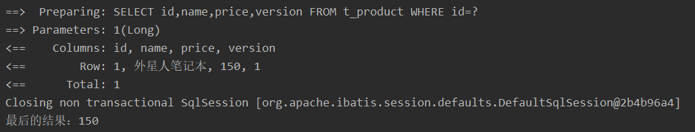

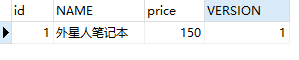

#### Ⅵ、优化流程

```java
@Test
public void testConcurrentUpdate02() {
	//1、小李
	Product p1 = productMapper.selectById(1L);
	//2、小王
	Product p2 = productMapper.selectById(1L);

	//3、小李将价格加了50元，存入了数据库
	p1.setPrice(p1.getPrice() + 50);
	int result1 = productMapper.updateById(p1);
	System.out.println("小李修改结果：" + result1);
	//4、小王将商品减了30元，存入了数据库
	p2.setPrice(p2.getPrice() - 30);
	int result2 = productMapper.updateById(p2);
	System.out.println("小王修改结果：" + result2);
	if (result2 == 0){
		//失败重试，重新获取version并更新
		p2 = productMapper.selectById(1L);
		p2.setPrice(p2.getPrice() - 30);
		result2 = productMapper.updateById(p2);
	}
	System.out.println("小王修改重试的结果：" + result2);

	//最后的结果
	Product p3 = productMapper.selectById(1L);
	//价格覆盖，最后的结果：120
	System.out.println("最后的结果：" + p3.getPrice());
}
```

- 结果

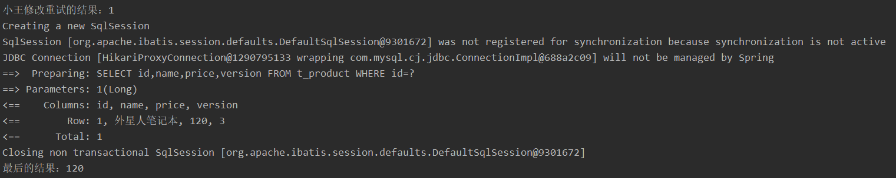

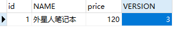

# 七、通用枚举

> 表中的有些字段值是固定的，例如性别（男或女），此时我们可以使用MyBatis-Plus的通用枚举来实现

## 1、数据库表添加字段 sex

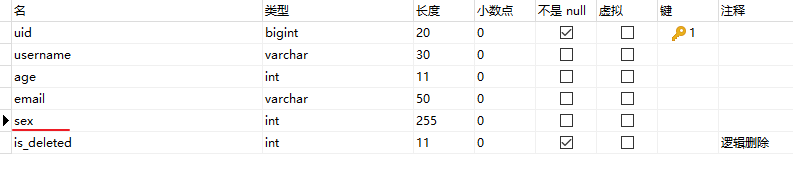

## 2、创建通用枚举类型

```java
package com.study.mybatisplus.enums;

import com.baomidou.mybatisplus.annotation.EnumValue;
import lombok.AllArgsConstructor;
import lombok.Getter;

/**
 * @author 10222148
 * @create 2022/11/11 16:32
 */

@Getter
@AllArgsConstructor
public enum  SexEnums {
    //男
    MALE(1, "男"),
    // 女
    FEMALE(0, "女");

    @EnumValue
    private final Integer sex;
    private final String sexName;
}

```

## 3、修改实体类

```java
package com.study.mybatisplus.bean;

import com.baomidou.mybatisplus.annotation.TableField;
import com.baomidou.mybatisplus.annotation.TableId;
import com.baomidou.mybatisplus.annotation.TableLogic;
import com.baomidou.mybatisplus.annotation.TableName;
import com.study.mybatisplus.enums.SexEnums;
import lombok.AllArgsConstructor;
import lombok.Data;
import lombok.NoArgsConstructor;

/**
 * @author 月海
 * @create 2022/11/3 14:42
 *
 * @TableName("user")：标明此实体类对应的数据表为 user
 */

@Data
@AllArgsConstructor
@NoArgsConstructor
@TableName("user")
public class User {
    @TableId("uid")
    private Long id;
    @TableField("username")
    private String name;
    private Integer age;
    private String email;
    private SexEnums sex;
    @TableLogic
    private Integer isDeleted;

    public User(Long id, String name, Integer age, String email) {
        this.id = id;
        this.name = name;
        this.age = age;
        this.email = email;
    }
}

```

## 4、配置扫描通用枚举

```yaml
# 配置 MyBatis-Plus 规则
mybatis-plus:
  configuration:
    # 开启 mybatis 的 sql 执行日志打印，可以在控制台打印输出 sql 语句
    log-impl: org.apache.ibatis.logging.stdout.StdOutImpl
  global-config:
    db-config:
      # 配置 置MyBatis-Plus 操作表的默认前缀，即若实体类为 user，则操作的表为：t_user
      table-prefix: t_
      id-type: auto
  # 配置扫描通用枚举
  type-enums-package: com.study.mybatisplus.enums
```

## 5、测试

```java
@Test
public void test01(){
	// 设置性别信息为枚举项，会将 @EnumValue 注解所标识的属性值存储到数据库
	User user = new User(null,"枚举类测试01",null,null, SexEnums.MALE,null);

	userMapper.insert(user);
}
```

## 6、测试结果

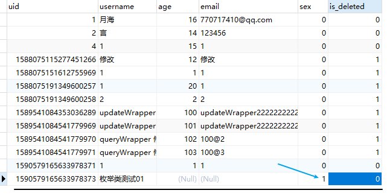

# 八、代码生成器

## 1、 引入依赖

```xml
<!-- MyBatisPlus 逆向工程依赖 -->
<dependency>
		<groupId>com.baomidou</groupId>
		<artifactId>mybatis-plus-generator</artifactId>
		<version>3.5.3</version>
</dependency>
<!-- 使用 Freemarker 引擎模板 -->
<dependency>
		<groupId>org.springframework.boot</groupId>
		<artifactId>spring-boot-starter-freemarker</artifactId>
</dependency>
```

## 2、快速生成

```java
package com.mybatisplus;

import com.baomidou.mybatisplus.generator.FastAutoGenerator;
import com.baomidou.mybatisplus.generator.config.OutputFile;
import com.baomidou.mybatisplus.generator.engine.FreemarkerTemplateEngine;

import java.util.Collections;

/**
 * @author 10222148
 * @create 2022/11/14 10:00
 */
public class generatorTest {
    public static void main(String[] args) {

        FastAutoGenerator.create("jdbc:mysql://172.20.2.55:3335/edu-trhpir-c?characterEncoding=UTF-8&useSSL=false&allowPublicKeyRetrieval=true&serverTimezone=GMT", "root", "123456")
                .globalConfig(builder -> {
                    builder.author("月海") // 设置作者
                            // .enableSwagger() // 开启 swagger 模式
                            .fileOverride() // 覆盖已生成文件
                            .outputDir("D://Idea//save//java//0_study//MybatisPlusGenerator//src//main//java"); // 指定输出目录
                })
                .packageConfig(builder -> {
                    builder.parent("com.mybatisplus") // 设置父包名
                            .moduleName("generator") // 设置父包模块名
                            .pathInfo(Collections.singletonMap(OutputFile.xml, "D://Idea//save//java//0_study//MybatisPlusGenerator//src//main//resources//mapper")); // 设置mapperXml生成路径
                })
                .strategyConfig(builder -> {
                    builder.addInclude("t_product"); // 设置需要生成的表名
                            // .addTablePrefix("t_", "c_"); // 设置过滤表前缀
                })
                .templateEngine(new FreemarkerTemplateEngine()) // 使用Freemarker引擎模板，默认的是Velocity引擎模板
                .execute();

    }
}

```

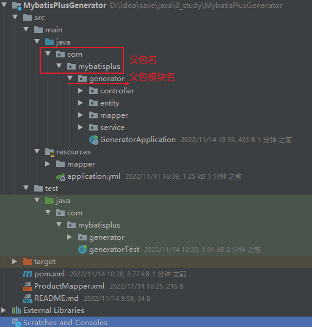

## 3、生成成功

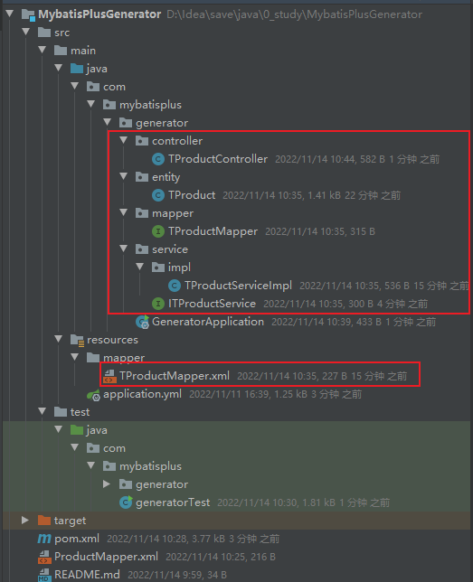

## 4、添加配置文件

```yaml
# 配置端口号
server:
  port: 8080

# yaml 配置文件
spring:
  # 配置数据源信息
  datasource:
    # 连接信息一定要用双引号引起来
    # characterEncoding=UTF-8：指定所处理字符的解码和编码的格式
    # useSSL=false：不进行 SSL 连接
    # allowPublicKeyRetrieval=true：允许恶意代理执行MITM攻击以获取明文密码，因此它在默认情况下为False，必须显式启用
    # serverTimezone=GMT：格林尼治标准时间
    url: "jdbc:mysql://172.20.2.55:3335/edu-trhpir-c?characterEncoding=UTF-8&useSSL=false&allowPublicKeyRetrieval=true&serverTimezone=GMT"
    username: "root"
    password: "123456"
    # 数据库驱动名
    driver-class-name: com.mysql.cj.jdbc.Driver

# 配置 MyBatis-Plus 规则
mybatis-plus:
  configuration:
    # 开启 mybatis 的 sql 执行日志打印，可以在控制台打印输出 sql 语句
    log-impl: org.apache.ibatis.logging.stdout.StdOutImpl
  global-config:
    db-config:
      # 配置 置MyBatis-Plus 操作表的默认前缀，即若实体类为 user，则操作的表为：t_user
      table-prefix: t_
      id-type: auto
  # 配置扫描通用枚举
  type-enums-package: com.study.mybatisplus.enums

```

## 5、在 controller 类中添加方法

```java
package com.mybatisplus.generator.controller;

import com.mybatisplus.generator.entity.TProduct;
import com.mybatisplus.generator.service.ITProductService;
import org.springframework.beans.factory.annotation.Autowired;
import org.springframework.web.bind.annotation.GetMapping;
import org.springframework.web.bind.annotation.RequestMapping;
import org.springframework.stereotype.Controller;
import org.springframework.web.bind.annotation.ResponseBody;

/**
 * <p>
 *  前端控制器
 * </p>
 *
 * @author 月海
 * @since 2022-11-14
 */
@Controller
@RequestMapping("/generator/tProduct")
public class TProductController {

    @Autowired
    private ITProductService productService;

    @ResponseBody
    @GetMapping("/hello")
    public TProduct hello(){
        TProduct byId = productService.getById("1");

        System.out.println(byId);
        return byId;
    }

}

```

## 6、在启动类上添加 `@MapperScan` 注解

```java
package com.mybatisplus.generator;

import org.mybatis.spring.annotation.MapperScan;
import org.springframework.boot.SpringApplication;
import org.springframework.boot.autoconfigure.SpringBootApplication;

@SpringBootApplication
@MapperScan("com.mybatisplus.generator.mapper")
public class GeneratorApplication {

    public static void main(String[] args) {
        SpringApplication.run(GeneratorApplication.class, args);
    }

}

```

## 7、启动项目

> [http://127.0.0.1:8080/generator/tProduct/hello](http://127.0.0.1:8080/generator/tProduct/hello)

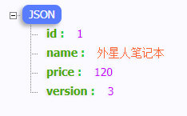

# 九、多数据源

> 适用于多种场景：纯粹多库、 读写分离、 一主多从、 混合模式等
> [https://baomidou.com/pages/a61e1b/#%E6%96%87%E6%A1%A3-documentation](https://baomidou.com/pages/a61e1b/#%E6%96%87%E6%A1%A3-documentation)

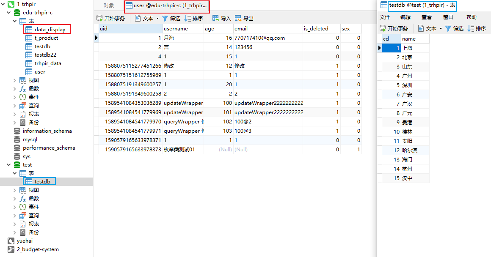

## 1、引入依赖

```xml
<!-- 多数据源 -->
<dependency>
		<groupId>com.baomidou</groupId>
		<artifactId>dynamic-datasource-spring-boot-starter</artifactId>
		<version>3.5.2</version>
</dependency>
```

## 2、配置多数据源

```yaml
# 配置端口号
server:
  port: 8080

# yaml 配置文件
spring:
  # 配置数据源信息
  datasource:
    dynamic:
      # 设置默认的数据源或者数据源组，默认值即为 master
      primary: master
      datasource:
        # 配置 master 数据源
        master:
          # 连接信息一定要用双引号引起来
          # characterEncoding=UTF-8：指定所处理字符的解码和编码的格式
          # useSSL=false：不进行 SSL 连接
          # allowPublicKeyRetrieval=true：允许恶意代理执行MITM攻击以获取明文密码，因此它在默认情况下为False，必须显式启用
          # serverTimezone=GMT：格林尼治标准时间
          url: "jdbc:mysql://172.20.2.55:3335/edu-trhpir-c?characterEncoding=UTF-8&useSSL=false&allowPublicKeyRetrieval=true&serverTimezone=GMT"
          username: "root"
          password: "123456"
          # 数据库驱动名；3.2.0开始支持SPI可省略此配置
          driver-class-name: com.mysql.cj.jdbc.Driver
        # 配置 test 数据源
        test:
          url: "jdbc:mysql://172.20.2.55:3335/test?characterEncoding=UTF-8&useSSL=false&allowPublicKeyRetrieval=true&serverTimezone=GMT"
          username: "root"
          password: "123456"
          # 数据库驱动名
          driver-class-name: com.mysql.cj.jdbc.Driver


# 配置 MyBatis-Plus 规则
mybatis-plus:
  configuration:
    # 开启 mybatis 的 sql 执行日志打印，可以在控制台打印输出 sql 语句
    log-impl: org.apache.ibatis.logging.stdout.StdOutImpl
  global-config:
    db-config:
      # 配置 置MyBatis-Plus 操作表的默认前缀，即若实体类为 user，则操作的表为：t_user
#      table-prefix: t_
      id-type: auto
  # 配置扫描通用枚举
  type-enums-package: com.study.mybatisplus.enums

```

## 3、使用逆向工程生成代码

1. edu-trhpir-c

```java
package com.mybatisplus;

import com.baomidou.mybatisplus.generator.FastAutoGenerator;
import com.baomidou.mybatisplus.generator.config.OutputFile;
import com.baomidou.mybatisplus.generator.engine.FreemarkerTemplateEngine;

import java.util.Collections;

/**
 * @author 10222148
 * @create 2022/11/14 10:00
 */
public class generatorTest {
    public static void main(String[] args) {

        FastAutoGenerator.create("jdbc:mysql://172.20.2.55:3335/edu-trhpir-c?characterEncoding=UTF-8&useSSL=false&allowPublicKeyRetrieval=true&serverTimezone=GMT", "root", "123456")
                .globalConfig(builder -> {
                    builder.author("月海") // 设置作者
                            // .enableSwagger() // 开启 swagger 模式
                            // .fileOverride() // 覆盖已生成文件
                            .outputDir("D://Idea//save//java//0_study//MybatisPlusGenerator//src//main//java"); // 指定输出目录
                })
                .packageConfig(builder -> {
                    builder.parent("com.mybatisplus") // 设置父包名
                            .moduleName("generator") // 设置父包模块名
                            .pathInfo(Collections.singletonMap(OutputFile.xml, "D://Idea//save//java//0_study//MybatisPlusGenerator//src//main//resources//mapper")); // 设置mapperXml生成路径
                })
                .strategyConfig(builder -> {
                    builder.addInclude("t_product"); // 设置需要生成的表名
                            // .addTablePrefix("t_", "c_"); // 设置过滤表前缀
                })
                .templateEngine(new FreemarkerTemplateEngine()) // 使用Freemarker引擎模板，默认的是Velocity引擎模板
                .execute();

    }
}

```

2. testdb

```java
package com.mybatisplus;

import com.baomidou.mybatisplus.generator.FastAutoGenerator;
import com.baomidou.mybatisplus.generator.config.OutputFile;
import com.baomidou.mybatisplus.generator.engine.FreemarkerTemplateEngine;

import java.util.Collections;

/**
 * @author 10222148
 * @create 2022/11/14 12:47
 */
public class generatorTest02 {
    public static void main(String[] args) {

        FastAutoGenerator.create("jdbc:mysql://172.20.2.55:3335/test?characterEncoding=UTF-8&useSSL=false&allowPublicKeyRetrieval=true&serverTimezone=GMT", "root", "123456")
                .globalConfig(builder -> {
                    builder.author("月海") // 设置作者
                            // .enableSwagger() // 开启 swagger 模式
                            // .fileOverride() // 覆盖已生成文件
                            .outputDir("D://Idea//save//java//0_study//MybatisPlusGenerator//src//main//java"); // 指定输出目录
                })
                .packageConfig(builder -> {
                    builder.parent("com.mybatisplus") // 设置父包名
                            .moduleName("generator") // 设置父包模块名
                            .pathInfo(Collections.singletonMap(OutputFile.xml, "D://Idea//save//java//0_study//MybatisPlusGenerator//src//main//resources//mapper")); // 设置mapperXml生成路径
                })
                .strategyConfig(builder -> {
                    builder.addInclude("testdb"); // 设置需要生成的表名
                    // .addTablePrefix("t_", "c_"); // 设置过滤表前缀
                })
                .templateEngine(new FreemarkerTemplateEngine()) // 使用Freemarker引擎模板，默认的是Velocity引擎模板
                .execute();

    }
}

```

## 4、添加 `@DS("")` 注解

- `@DS("")`：选择配置的数据源，可以添加到类或方法上
   - 添加在类上：指定这个类中的所有方法的数据源
   - 添加在方法上：指定这个方法的数据源
- 不添加此注解默认使用默认数据源

1. edu-trhpir-c

```java
package com.mybatisplus.generator.mapper;

import com.baomidou.dynamic.datasource.annotation.DS;
import com.mybatisplus.generator.entity.TProduct;
import com.baomidou.mybatisplus.core.mapper.BaseMapper;

/**
 * <p>
 *  Mapper 接口
 * </p>
 *
 * @author 月海
 * @since 2022-11-14
 */

/**
 * @ DS("master")：选择配置的 master 数据源
 */
@DS("master")
public interface TProductMapper extends BaseMapper<TProduct> {

}

```

2. testdb

```java
package com.mybatisplus.generator.mapper;

import com.baomidou.dynamic.datasource.annotation.DS;
import com.mybatisplus.generator.entity.Testdb;
import com.baomidou.mybatisplus.core.mapper.BaseMapper;

/**
 * <p>
 *  Mapper 接口
 * </p>
 *
 * @author 月海
 * @since 2022-11-14
 */

/**
 * @ DS("test")：选择配置的 test 数据源
 */
@DS("test")
public interface TestdbMapper extends BaseMapper<Testdb> {

}

```

## 5、测试

### ①、edu-trhpir-c

```java
@Test
void testTestdb() {
	List<Testdb> testdbList = testdbService.list();
	System.out.println(testdbService);
}
```

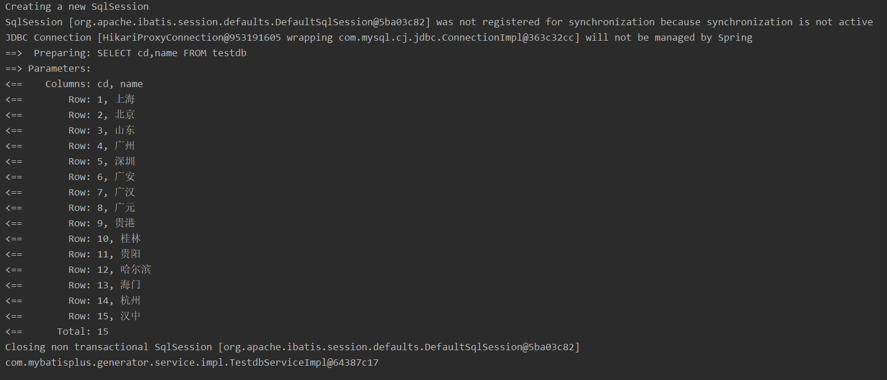

### ②、testdb

```java
@Test
void testProductService() {
	List<TProduct> productList = productService.list();
	System.out.println(productList);
}
```

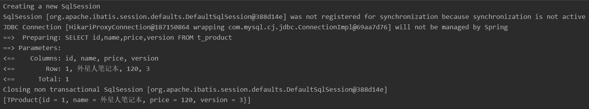

# 十、MyBatisX 插件

> [https://baomidou.com/pages/ba5b24/#%E5%8A%9F%E8%83%BD](https://baomidou.com/pages/ba5b24/#%E5%8A%9F%E8%83%BD)

## 1、安装插件

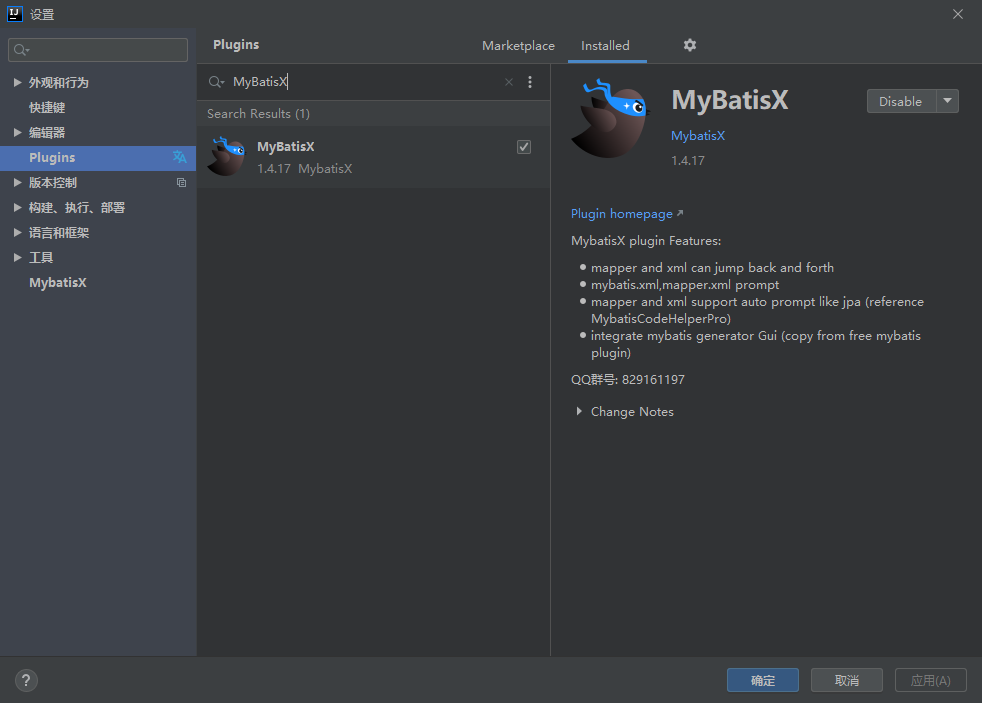

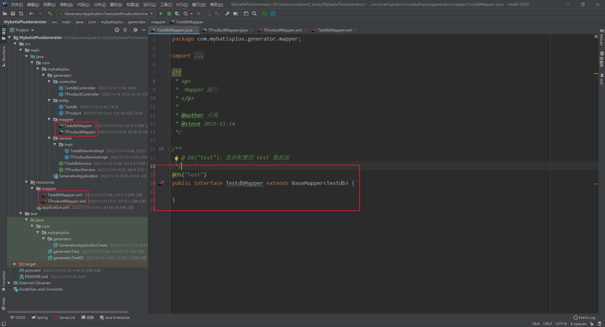

## 2、代码快速生成

1. 使用 idea Datebase 模块连接数据库

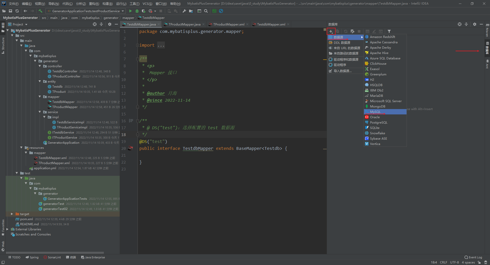

2. 连接

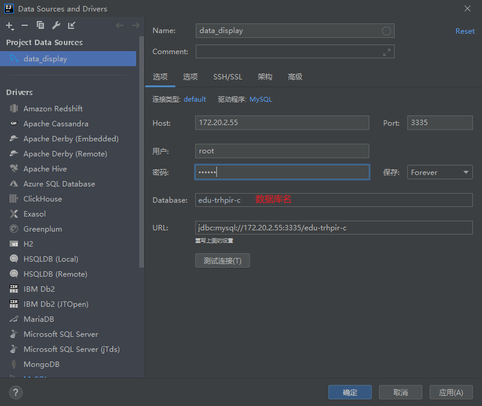

3. 连接成功

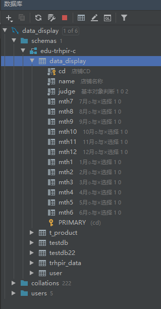

4. 右键点击数据库表，选择 MybatisX-Generator

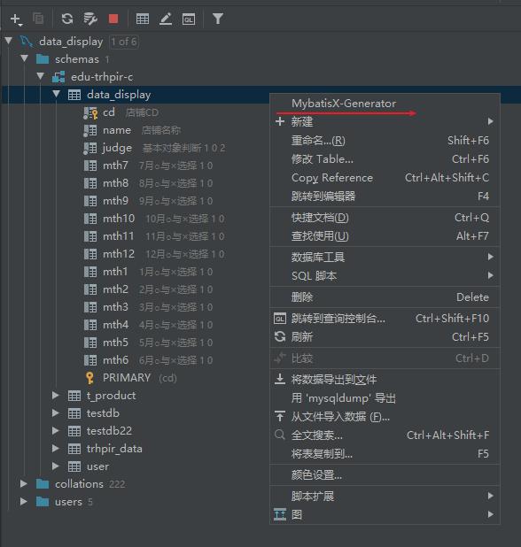

5. 设置表

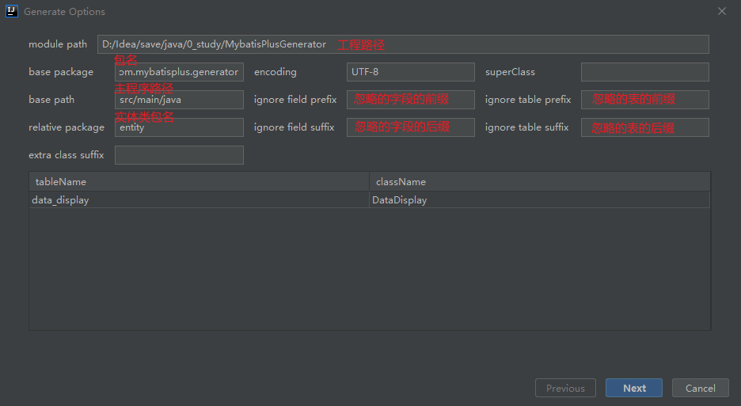

6. 代码生成器配置

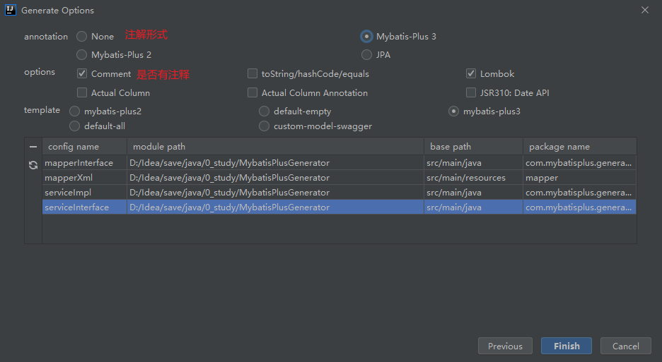

7. 点击生成

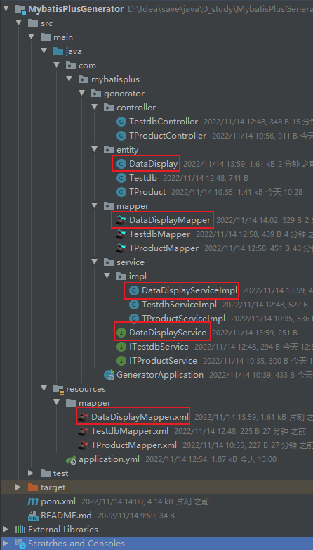

## 3、方法生成

1. 在 mapper 类中以指定开头进行输入：
   1. 新增：insert
   2. 修改：update
   3. 删除：delete
   4. 查询：select

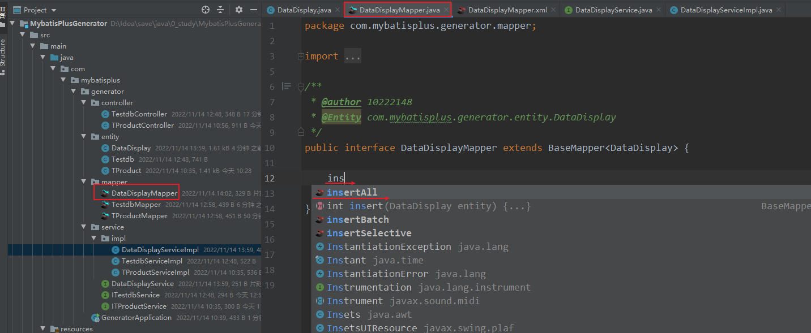

2. 选择该提示，按快捷键 `alt + enter` ，点击弹出的 `[MybatisX] Generate Mybatis Sql`

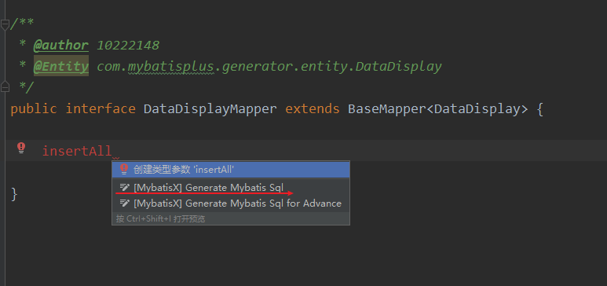

3. 此时 MybatisX 则会自动在接口与映射文件中生成代码

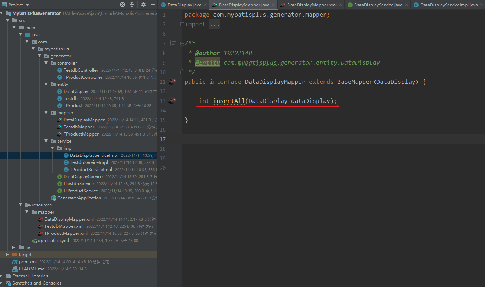

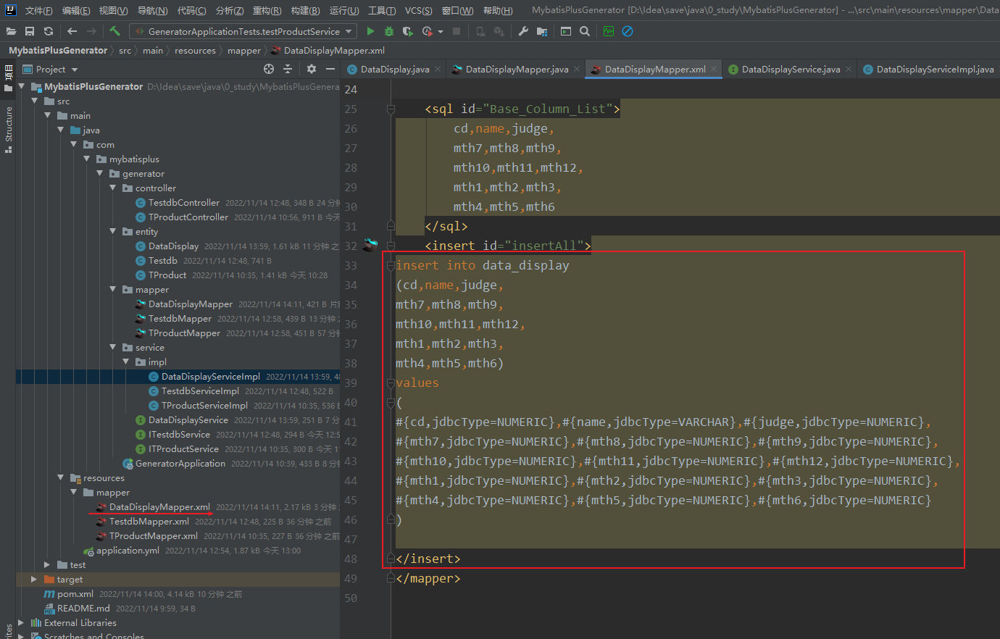

## 4、方法生成-组合条件
### ①、查询全部：直接写条件

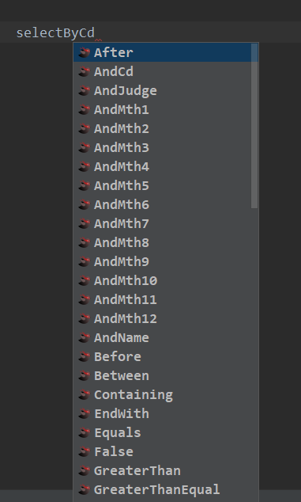

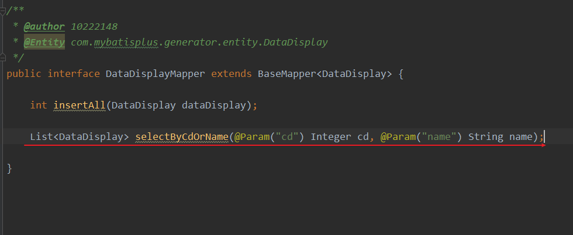

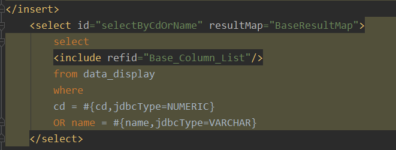

### ②、查询部分

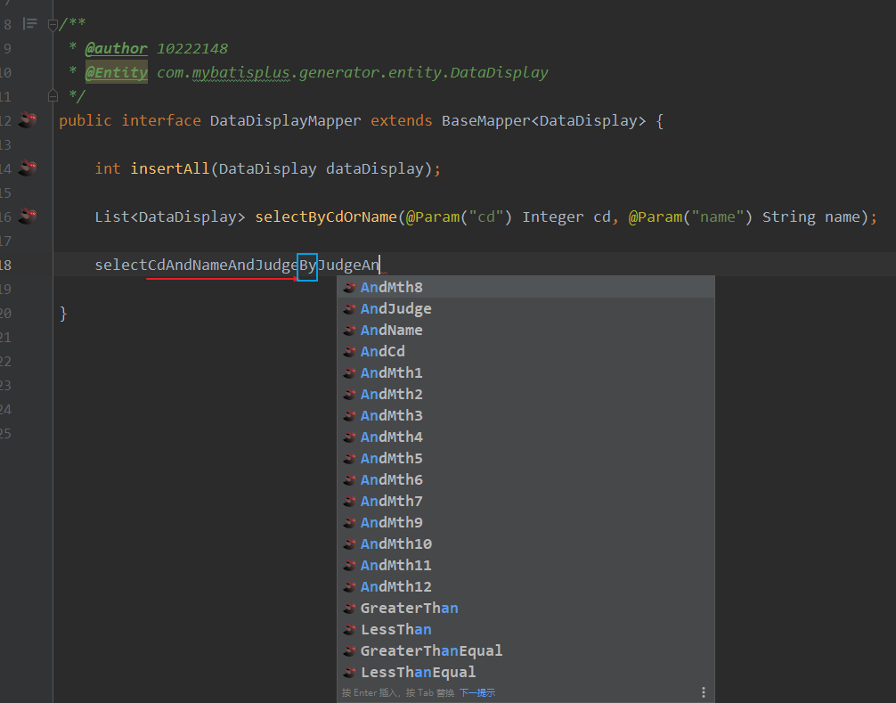

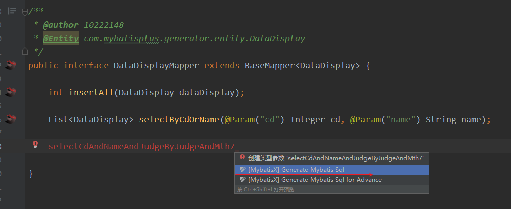

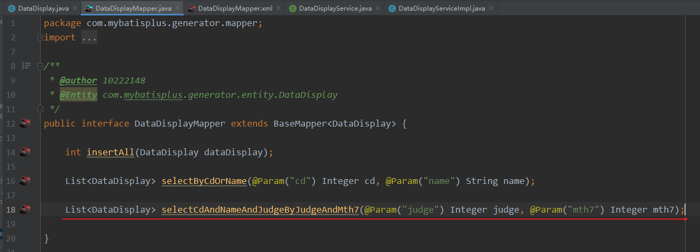

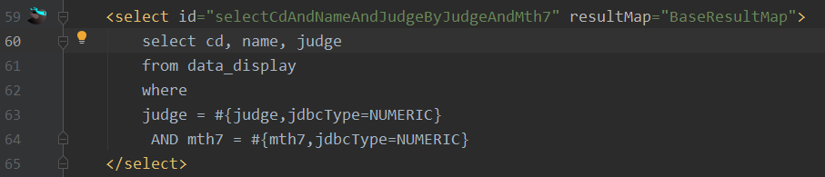
