> 尚硅谷 2020 SpringCloud 框架开发教程：[https://www.bilibili.com/video/BV18E411x7eT/](https://www.bilibili.com/video/BV18E411x7eT/)


# 一、SpringCloud 简介

> 1. Spring Cloud 官方文档：[https://cloud.spring.io/spring-cloud-static/Hoxton.SR1/reference/htmlsingle/](https://cloud.spring.io/spring-cloud-static/Hoxton.SR1/reference/htmlsingle/)
> 2. Spring Cloud 中文文档：[https://www.bookstack.cn/read/spring-cloud-docs/docs-index.md](https://www.bookstack.cn/read/spring-cloud-docs/docs-index.md)

## 1、优质集成项目

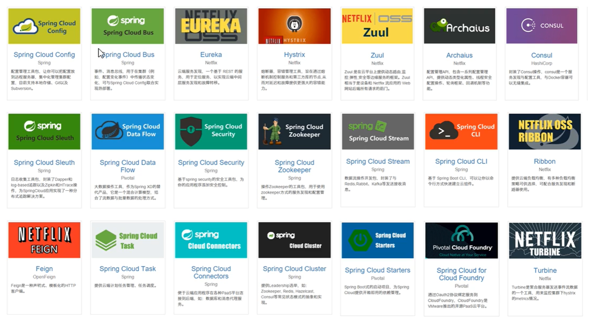

## 2、技术栈

- 里面的是官方的，外面的是第三方的

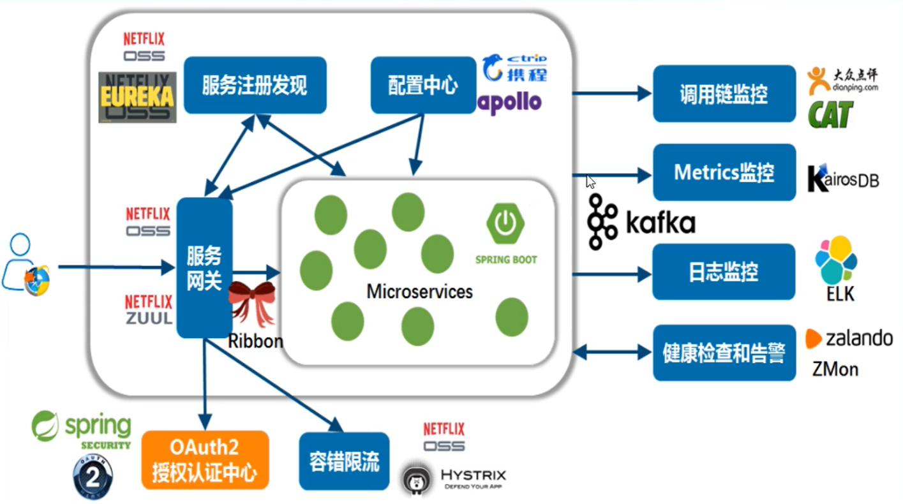

## 3、核心技术栈

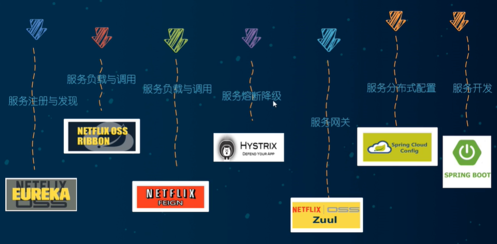

## 4、Springcloud 和 Springboot 之间的依赖关系如何看

1. 版本依赖关系：[https://spring.io/projects/spring-cloud#overview](https://spring.io/projects/spring-cloud#overview)


2. 详细的版本对应查看方法：[https://start.spring.io/actuator/info](https://start.spring.io/actuator/info)

```json
{
    "git": {
        "branch": "62b85c970273a427d709d044edacec0ea8c6917a",
        "commit": {
            "id": "62b85c9",
            "time": "2023-02-14T16:04:15Z"
        }
    },
    "build": {
        "version": "0.0.1-SNAPSHOT",
        "artifact": "start-site",
        "versions": {
            "spring-boot": "3.0.2",
            "initializr": "0.20.0-SNAPSHOT"
        },
        "name": "start.spring.io website",
        "time": "2023-02-14T16:49:14.707Z",
        "group": "io.spring.start"
    },
    "bom-ranges": {
        "codecentric-spring-boot-admin": {
            "2.4.3": "Spring Boot >=2.3.0.M1 and <2.5.0-M1",
            "2.5.6": "Spring Boot >=2.5.0.M1 and <2.6.0-M1",
            "2.6.8": "Spring Boot >=2.6.0.M1 and <2.7.0-M1",
            "2.7.4": "Spring Boot >=2.7.0.M1 and <3.0.0-M1",
            "3.0.0-M4": "Spring Boot >=3.0.0-M1 and <3.1.0-M1"
        },
        "solace-spring-boot": {
            "1.1.0": "Spring Boot >=2.3.0.M1 and <2.6.0-M1",
            "1.2.2": "Spring Boot >=2.6.0.M1 and <3.0.0-M1"
        },
        "solace-spring-cloud": {
            "1.1.1": "Spring Boot >=2.3.0.M1 and <2.4.0-M1",
            "2.1.0": "Spring Boot >=2.4.0.M1 and <2.6.0-M1",
            "2.3.2": "Spring Boot >=2.6.0.M1 and <3.0.0-M1"
        },
        "spring-cloud": {
            "Hoxton.SR12": "Spring Boot >=2.2.0.RELEASE and <2.4.0.M1",
            "2020.0.6": "Spring Boot >=2.4.0.M1 and <2.6.0-M1",
            "2021.0.0-M1": "Spring Boot >=2.6.0-M1 and <2.6.0-M3",
            "2021.0.0-M3": "Spring Boot >=2.6.0-M3 and <2.6.0-RC1",
            "2021.0.0-RC1": "Spring Boot >=2.6.0-RC1 and <2.6.1",
            "2021.0.5": "Spring Boot >=2.6.1 and <3.0.0-M1",
            "2022.0.0-M1": "Spring Boot >=3.0.0-M1 and <3.0.0-M2",
            "2022.0.0-M2": "Spring Boot >=3.0.0-M2 and <3.0.0-M3",
            "2022.0.0-M3": "Spring Boot >=3.0.0-M3 and <3.0.0-M4",
            "2022.0.0-M4": "Spring Boot >=3.0.0-M4 and <3.0.0-M5",
            "2022.0.0-M5": "Spring Boot >=3.0.0-M5 and <3.0.0-RC1",
            "2022.0.0-RC1": "Spring Boot >=3.0.0-RC1 and <3.0.0-RC2",
            "2022.0.0-RC2": "Spring Boot >=3.0.0-RC2 and <3.0.0",
            "2022.0.1": "Spring Boot >=3.0.0 and <3.1.0-M1"
        },
        "spring-cloud-azure": {
            "4.6.0": "Spring Boot >=2.5.0.M1 and <3.0.0-M1",
            "5.0.0": "Spring Boot >=3.0.0-M1 and <3.1.0-M1"
        },
        "spring-cloud-gcp": {
            "2.0.11": "Spring Boot >=2.4.0-M1 and <2.6.0-M1",
            "3.4.4": "Spring Boot >=2.6.0-M1 and <3.0.0-M1",
            "4.1.0": "Spring Boot >=3.0.0-M1 and <3.1.0-M1"
        },
        "spring-cloud-services": {
            "2.3.0.RELEASE": "Spring Boot >=2.3.0.RELEASE and <2.4.0-M1",
            "2.4.1": "Spring Boot >=2.4.0-M1 and <2.5.0-M1",
            "3.3.0": "Spring Boot >=2.5.0-M1 and <2.6.0-M1",
            "3.4.0": "Spring Boot >=2.6.0-M1 and <2.7.0-M1",
            "3.5.0": "Spring Boot >=2.7.0-M1 and <3.0.0-M1",
            "4.0.0": "Spring Boot >=3.0.0 and <3.1.0-M1"
        },
        "spring-shell": {
            "2.1.6": "Spring Boot >=2.7.0 and <3.0.0-M1",
            "3.0.0": "Spring Boot >=3.0.0 and <3.1.0-M1"
        },
        "vaadin": {
            "14.9.6": "Spring Boot >=2.1.0.RELEASE and <2.6.0-M1",
            "23.2.15": "Spring Boot >=2.6.0-M1 and <2.7.0-M1",
            "23.3.5": "Spring Boot >=2.7.0-M1 and <2.8.0-M1"
        },
        "wavefront": {
            "2.0.2": "Spring Boot >=2.1.0.RELEASE and <2.4.0-M1",
            "2.1.1": "Spring Boot >=2.4.0-M1 and <2.5.0-M1",
            "2.2.2": "Spring Boot >=2.5.0-M1 and <2.7.0-M1",
            "2.3.4": "Spring Boot >=2.7.0-M1 and <3.0.0-M1",
            "3.0.1": "Spring Boot >=3.0.0-M1 and <3.1.0-M1"
        }
    },
    "dependency-ranges": {
        "okta": {
            "1.4.0": "Spring Boot >=2.2.0.RELEASE and <2.4.0-M1",
            "1.5.1": "Spring Boot >=2.4.0-M1 and <2.4.1",
            "2.0.1": "Spring Boot >=2.4.1 and <2.5.0-M1",
            "2.1.6": "Spring Boot >=2.5.0-M1 and <3.0.0-M1",
            "3.0.2": "Spring Boot >=3.0.0-M1 and <3.1.0-M1",
            "managed": "Spring Boot >=3.1.0-M1"
        },
        "mybatis": {
            "2.1.4": "Spring Boot >=2.1.0.RELEASE and <2.5.0-M1",
            "2.2.2": "Spring Boot >=2.5.0-M1 and <2.7.0-M1",
            "2.3.0": "Spring Boot >=2.7.0-M1 and <3.0.0-M1",
            "3.0.0": "Spring Boot >=3.0.0-M1"
        },
        "camel": {
            "3.5.0": "Spring Boot >=2.3.0.M1 and <2.4.0-M1",
            "3.10.0": "Spring Boot >=2.4.0.M1 and <2.5.0-M1",
            "3.13.0": "Spring Boot >=2.5.0.M1 and <2.6.0-M1",
            "3.17.0": "Spring Boot >=2.6.0.M1 and <2.7.0-M1",
            "3.20.2": "Spring Boot >=2.7.0.M1 and <3.0.0-M1",
            "4.0.0-M1": "Spring Boot >=3.0.0-M1 and <3.1.0-M1"
        },
        "picocli": {
            "4.7.0": "Spring Boot >=2.5.0.RELEASE and <3.1.0-M1"
        },
        "open-service-broker": {
            "3.2.0": "Spring Boot >=2.3.0.M1 and <2.4.0-M1",
            "3.3.1": "Spring Boot >=2.4.0-M1 and <2.5.0-M1",
            "3.4.1": "Spring Boot >=2.5.0-M1 and <2.6.0-M1",
            "3.5.0": "Spring Boot >=2.6.0-M1 and <2.7.0-M1"
        }
    }
}
```

3. 本次使用的版本


4. 同时用 boot 和 cloud，需要照顾 cloud，由 cloud 决定 boot 版本
5. 2.X 版本常用的组件 pom

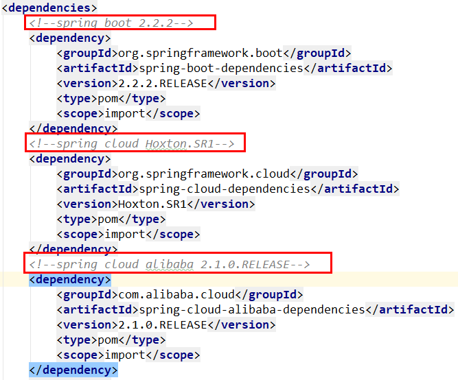

## 5、关于 Cloud 各种组件的停更/升级/替换

- 停更不停用
1. 以前


2. 2020年


# 二、微服务架构编码构建

> 约定 > 配置 > 编码

## 1、创建父项目

1. 创建父项目 SpringCloud

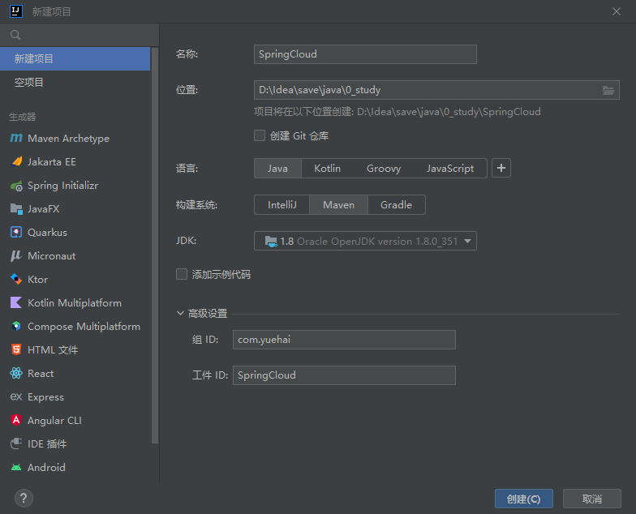

2. 字符编码

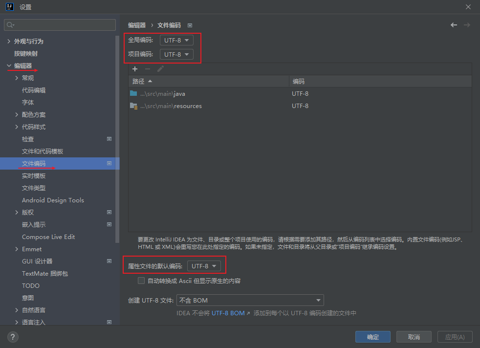

3. 注解生效激活

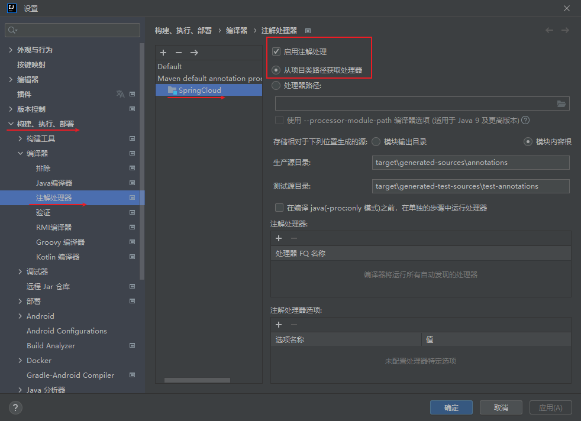

4. 修改 jdk 版本为 8

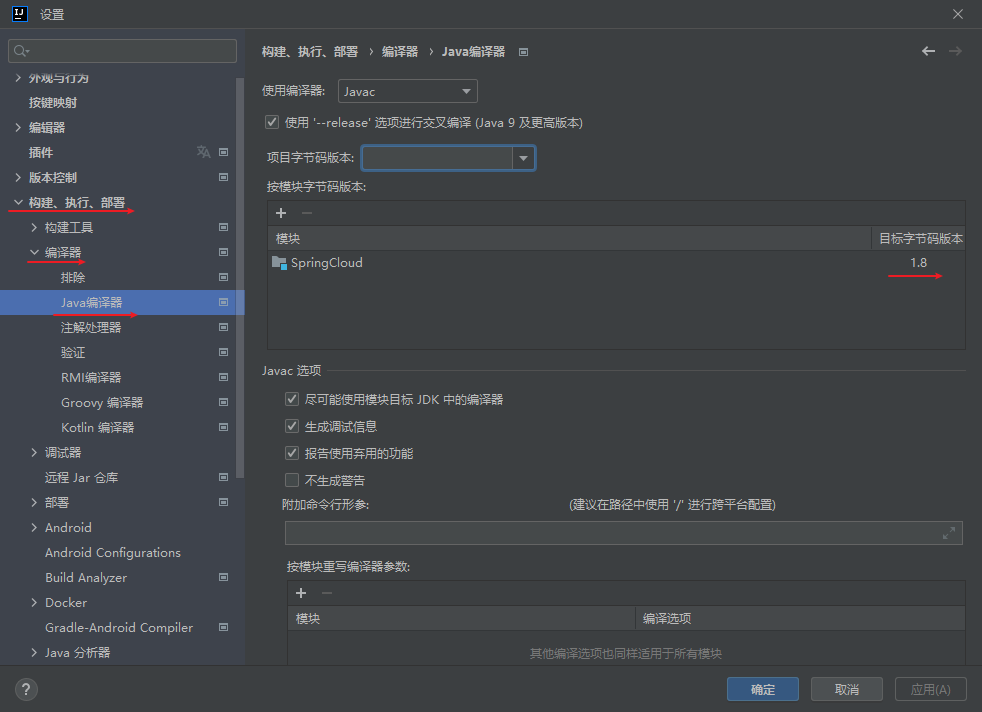

5. 删除 src 目录

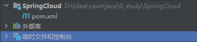

6. 修改 pom 文件

```xml
<?xml version="1.0" encoding="UTF-8"?>
<project xmlns="http://maven.apache.org/POM/4.0.0"
         xmlns:xsi="http://www.w3.org/2001/XMLSchema-instance"
         xsi:schemaLocation="http://maven.apache.org/POM/4.0.0 http://maven.apache.org/xsd/maven-4.0.0.xsd">
    <modelVersion>4.0.0</modelVersion>
    
    <groupId>com.yuehai</groupId>
    <artifactId>SpringCloud</artifactId>
    <version>1.0-SNAPSHOT</version>
    <packaging>pom</packaging>
    <!-- 子项目 -->
    <modules>
        <module>cloud-provider-payment8001</module>
        <module>cloud-consumer-order80</module>
        <module>cloud-api-commons</module>
    </modules>
    
    <!-- 统一管理 jar 包版本 -->
    <properties>
        <maven.compiler.source>8</maven.compiler.source>
        <maven.compiler.target>8</maven.compiler.target>
        <project.build.sourceEncoding>UTF-8</project.build.sourceEncoding>
    
        <junit.version>4.12</junit.version>
        <log4j.version>1.2.17</log4j.version>
        <lombok.version>1.16.18</lombok.version>
        <mysql.version>5.1.47</mysql.version>
        <druid.version>1.1.16</druid.version>
        <mybatis-plus.spring.boot.version>3.5.1</mybatis-plus.spring.boot.version>
    
        <hutool-all>5.8.11</hutool-all>
    </properties>
    
    <!-- 子模块继承之后，提供作用：锁定版本 + 子 modlue 不用写 groupId 和 version  -->
    <dependencyManagement>
        <dependencies>
            <!--spring boot 2.2.2-->
            <dependency>
                <groupId>org.springframework.boot</groupId>
                <artifactId>spring-boot-dependencies</artifactId>
                <version>2.2.2.RELEASE</version>
                <type>pom</type>
                <scope>import</scope>
            </dependency>
            <!--spring cloud Hoxton.SR1-->
            <dependency>
                <groupId>org.springframework.cloud</groupId>
                <artifactId>spring-cloud-dependencies</artifactId>
                <version>Hoxton.SR1</version>
                <type>pom</type>
                <scope>import</scope>
            </dependency>
            <!--spring cloud alibaba 2.1.0.RELEASE-->
            <dependency>
                <groupId>com.alibaba.cloud</groupId>
                <artifactId>spring-cloud-alibaba-dependencies</artifactId>
                <version>2.1.0.RELEASE</version>
                <type>pom</type>
                <scope>import</scope>
            </dependency>
            
            <!-- mysql -->
            <dependency>
                <groupId>mysql</groupId>
                <artifactId>mysql-connector-java</artifactId>
                <version>${mysql.version}</version>
            </dependency>
            <!-- mybatis-plus -->
            <dependency>
                <groupId>com.baomidou</groupId>
                <artifactId>mybatis-plus-boot-starter</artifactId>
                <version>${mybatis-plus.spring.boot.version}</version>
            </dependency>
    
            <!-- hutool 工具包 -->
            <dependency>
                <groupId>cn.hutool</groupId>
                <artifactId>hutool-all</artifactId>
                <version>${hutool-all}</version>
            </dependency>
            
            <!-- junit Test -->
            <dependency>
                <groupId>junit</groupId>
                <artifactId>junit</artifactId>
                <version>${junit.version}</version>
            </dependency>
            <!-- log4j -->
            <dependency>
                <groupId>log4j</groupId>
                <artifactId>log4j</artifactId>
                <version>${log4j.version}</version>
            </dependency>
            <!-- lombok -->
            <dependency>
                <groupId>org.projectlombok</groupId>
                <artifactId>lombok</artifactId>
                <version>${lombok.version}</version>
                <optional>true</optional>
            </dependency>
        </dependencies>
    </dependencyManagement>
    
</project>
```

7. 执行 mvn:install 将父工程发布到仓库方便子工程继承


## 2、创建微服务提供者支付模块 cloud-provider-payment8001

1. 创建子模块 cloud-provider-payment8001


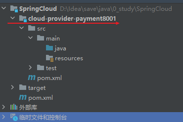

   1. 子项目 pom 文件

```xml
<?xml version="1.0" encoding="UTF-8"?>
<project xmlns="http://maven.apache.org/POM/4.0.0"
         xmlns:xsi="http://www.w3.org/2001/XMLSchema-instance"
         xsi:schemaLocation="http://maven.apache.org/POM/4.0.0 http://maven.apache.org/xsd/maven-4.0.0.xsd">
    <modelVersion>4.0.0</modelVersion>
    <!-- 父项目 -->
    <parent>
        <groupId>com.yuehai</groupId>
        <artifactId>SpringCloud</artifactId>
        <version>1.0-SNAPSHOT</version>
    </parent>
    
    <artifactId>cloud-provider-payment8001</artifactId>
    
    <properties>
        <maven.compiler.source>8</maven.compiler.source>
        <maven.compiler.target>8</maven.compiler.target>
        <project.build.sourceEncoding>UTF-8</project.build.sourceEncoding>
    </properties>

</project>
```

   2. 父项目 pom 文件

```xml
<?xml version="1.0" encoding="UTF-8"?>
<project xmlns="http://maven.apache.org/POM/4.0.0"
         xmlns:xsi="http://www.w3.org/2001/XMLSchema-instance"
         xsi:schemaLocation="http://maven.apache.org/POM/4.0.0 http://maven.apache.org/xsd/maven-4.0.0.xsd">
    <modelVersion>4.0.0</modelVersion>
    
    <groupId>com.yuehai</groupId>
    <artifactId>SpringCloud</artifactId>
    <version>1.0-SNAPSHOT</version>
    <packaging>pom</packaging>
    <!-- 子项目 -->
    <modules>
        <module>cloud-provider-payment8001</module>
    </modules>
    
    <!-- 统一管理 jar 包版本 -->
    <properties>
        <maven.compiler.source>8</maven.compiler.source>
        <maven.compiler.target>8</maven.compiler.target>
        <project.build.sourceEncoding>UTF-8</project.build.sourceEncoding>
    
        <junit.version>4.12</junit.version>
        <log4j.version>1.2.17</log4j.version>
        <lombok.version>1.16.18</lombok.version>
        <mysql.version>5.1.47</mysql.version>
        <druid.version>1.1.16</druid.version>
        <mybatis-plus.spring.boot.version>3.5.1</mybatis-plus.spring.boot.version>
    </properties>
    
    <!-- 子模块继承之后，提供作用：锁定版本 + 子 modlue 不用写 groupId 和 version  -->
    <dependencyManagement>
        <dependencies>
            <!--spring boot 2.2.2-->
            <dependency>
                <groupId>org.springframework.boot</groupId>
                <artifactId>spring-boot-dependencies</artifactId>
                <version>2.2.2.RELEASE</version>
                <type>pom</type>
                <scope>import</scope>
            </dependency>
            <!--spring cloud Hoxton.SR1-->
            <dependency>
                <groupId>org.springframework.cloud</groupId>
                <artifactId>spring-cloud-dependencies</artifactId>
                <version>Hoxton.SR1</version>
                <type>pom</type>
                <scope>import</scope>
            </dependency>
            <!--spring cloud alibaba 2.1.0.RELEASE-->
            <dependency>
                <groupId>com.alibaba.cloud</groupId>
                <artifactId>spring-cloud-alibaba-dependencies</artifactId>
                <version>2.1.0.RELEASE</version>
                <type>pom</type>
                <scope>import</scope>
            </dependency>
            
            <!-- mysql -->
            <dependency>
                <groupId>mysql</groupId>
                <artifactId>mysql-connector-java</artifactId>
                <version>${mysql.version}</version>
            </dependency>
            <!-- druid 数据连接池 -->
            <dependency>
                <groupId>com.alibaba</groupId>
                <artifactId>druid</artifactId>
                <version>${druid.version}</version>
            </dependency>
            <!-- mybatis-plus -->
            <dependency>
                <groupId>com.baomidou</groupId>
                <artifactId>mybatis-plus-boot-starter</artifactId>
                <version>${mybatis-plus.spring.boot.version}</version>
            </dependency>
            
            <!-- junit Test -->
            <dependency>
                <groupId>junit</groupId>
                <artifactId>junit</artifactId>
                <version>${junit.version}</version>
            </dependency>
            <!-- log4j -->
            <dependency>
                <groupId>log4j</groupId>
                <artifactId>log4j</artifactId>
                <version>${log4j.version}</version>
            </dependency>
            <!-- lombok -->
            <dependency>
                <groupId>org.projectlombok</groupId>
                <artifactId>lombok</artifactId>
                <version>${lombok.version}</version>
                <optional>true</optional>
            </dependency>
        </dependencies>
    </dependencyManagement>
    
</project>
```

2. 修改子项目 POM 文件

```xml
<?xml version="1.0" encoding="UTF-8"?>
<project xmlns="http://maven.apache.org/POM/4.0.0"
         xmlns:xsi="http://www.w3.org/2001/XMLSchema-instance"
         xsi:schemaLocation="http://maven.apache.org/POM/4.0.0 http://maven.apache.org/xsd/maven-4.0.0.xsd">
    <modelVersion>4.0.0</modelVersion>
    <!-- 父项目 -->
    <parent>
        <groupId>com.yuehai</groupId>
        <artifactId>SpringCloud</artifactId>
        <version>1.0-SNAPSHOT</version>
    </parent>
    
    <artifactId>cloud-provider-payment8001</artifactId>
    
    <dependencies>
        <!-- web 场景 -->
        <dependency>
            <groupId>org.springframework.boot</groupId>
            <artifactId>spring-boot-starter-web</artifactId>
        </dependency>
        <!-- springboot 的监控 -->
        <dependency>
            <groupId>org.springframework.boot</groupId>
            <artifactId>spring-boot-starter-actuator</artifactId>
        </dependency>
        <!--jdbc-->
        <dependency>
            <groupId>org.springframework.boot</groupId>
            <artifactId>spring-boot-starter-jdbc</artifactId>
        </dependency>
        <!--mysql-connector-java-->
        <dependency>
            <groupId>mysql</groupId>
            <artifactId>mysql-connector-java</artifactId>
        </dependency>
        <!-- mybatis-plus -->
        <dependency>
            <groupId>com.baomidou</groupId>
            <artifactId>mybatis-plus-boot-starter</artifactId>
        </dependency>
        <!-- druid 数据连接池 -->
        <dependency>
            <groupId>com.alibaba</groupId>
            <artifactId>druid-spring-boot-starter</artifactId>
            <version>1.1.10</version>
        </dependency>
        
        <dependency>
            <groupId>org.springframework.boot</groupId>
            <artifactId>spring-boot-devtools</artifactId>
            <scope>runtime</scope>
            <optional>true</optional>
        </dependency>
        <dependency>
            <groupId>org.projectlombok</groupId>
            <artifactId>lombok</artifactId>
            <optional>true</optional>
        </dependency>
        <dependency>
            <groupId>org.springframework.boot</groupId>
            <artifactId>spring-boot-starter-test</artifactId>
            <scope>test</scope>
        </dependency>
    </dependencies>

</project>
```

3. 写 YML

```yaml
# 服务端口号
server:
    port: 8001

# spring 配置
spring:
    application:
        # 服务名称
        name: cloud-payment-service
    datasource:
        # mysql驱动包 com.mysql.jdbc.Driver
        driver-class-name: com.mysql.jdbc.Driver
        # 连接信息
        # characterEncoding=UTF-8：指定所处理字符的解码和编码的格式
        # useSSL=false：不进行 SSL 连接
        # allowPublicKeyRetrieval=true：允许恶意代理执行MITM攻击以获取明文密码，因此它在默认情况下为False，必须显式启用
        # serverTimezone=GMT：格林尼治标准时间
        url: jdbc:mysql://43.138.106.181:3306/SpringCloud??characterEncoding=UTF-8&useSSL=false&allowPublicKeyRetrieval=true&serverTimezone=GMT
        # 用户名
        username: root
        # 密码（以 0 开头要加引号）
        password: "000123"

# 配置 MyBatis-Plus 规则
mybatis-plus:
    configuration:
        # 是否开启自动驼峰命名规则映射
        map-underscore-to-camel-case: true
        # 开启 mybatis 的 sql 执行日志打印，可以在控制台打印输出 sql 语句
        log-impl: org.apache.ibatis.logging.stdout.StdOutImpl

```

4. 创建数据库、数据表（payment）、插入数据；这里 id 的类型要设置为 `bigint(20)`


5. 创建实体类

```java
package com.yuehai.entities;

import lombok.*;

/**
 * @author 月海
 * @create 2023/2/20 15:31
 */

// lombok，编译时可生成 无参构造器 方法
@NoArgsConstructor
// lombok，编译时可生成 有参构造器（有所有参数） 方法
@AllArgsConstructor
// lombok，编译时可生成 get/set 方法
@Data
// lombok，编译时可生成 toString 方法
@ToString
// lombok，编译时可生成 重写HashCode 方法
@EqualsAndHashCode
public class Payment {
    private Long id;
    private String serial;
}

```


6. 创建 mapper 接口

```java
package com.yuehai.mapper;

import com.baomidou.mybatisplus.core.mapper.BaseMapper;
import com.yuehai.entities.Payment;

/**
 * @author 月海
 * @create 2023/2/20 15:37
 */
public interface PaymentMapper extends BaseMapper<Payment> {
}

```

7. 在启动类中设置 mapper 接口所在的包

```java
package com.yuehai;

import org.mybatis.spring.annotation.MapperScan;
import org.springframework.boot.SpringApplication;
import org.springframework.boot.autoconfigure.SpringBootApplication;

@SpringBootApplication
/**
 * @MapperScan：扫描指定包下面的 mapper 接口
 */
@MapperScan("com.yuehai.mapper")
public class Application {

    public static void main(String[] args) {
        SpringApplication.run(Application.class, args);
    }

}

```

8. 创建 service 接口与 serviceImpl 实现类


```java
package com.yuehai.service;

import com.yuehai.entities.Payment;

import java.util.List;

/**
 * @author 月海
 * @create 2023/2/20 15:51
 */
public interface PaymentService {
    List<Payment> getPayment();
}

```
```java
package com.yuehai.service.impl;

import com.yuehai.entities.Payment;
import com.yuehai.mapper.PaymentMapper;
import com.yuehai.service.PaymentService;
import org.springframework.stereotype.Service;

import javax.annotation.Resource;
import java.util.List;

/**
 * @author 月海
 * @create 2023/2/20 15:52
 */

@Service
public class PaymentServiceImpl implements PaymentService {

    @Resource
    private PaymentMapper paymentMapper;

    @Override
    public List<Payment> getPayment() {
        return paymentMapper.selectList(null);
    }
}

```

9. 业务类

```java
package com.yuehai.controller;

import com.yuehai.entities.Payment;
import com.yuehai.mapper.PaymentMapper;
import com.yuehai.service.PaymentService;
import com.yuehai.utils.JsonResult;
import org.springframework.web.bind.annotation.GetMapping;
import org.springframework.web.bind.annotation.RestController;

import javax.annotation.Resource;
import java.util.List;

/**
 * @author 月海
 * @create 2023/2/20 14:35
 */

@RestController
public class _01_TestController {

    @Resource
    private PaymentService paymentService;

    @GetMapping("/getTest")
    public JsonResult getTest(){
        return JsonResult.success(paymentService.getPayment());
    }

}

```

10. 测试：[http://localhost:8001/getTest](http://localhost:8001/getTest)

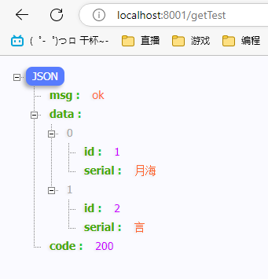

## 3、使用 spring-boot-devtools 进行热部署

1. 开启自动构建项目


2. 间隔 1 秒保存文件


3. 添加依赖

```xml
<dependency>
    <groupId>org.springframework.boot</groupId>
    <artifactId>spring-boot-devtools</artifactId>
    <scope>runtime</scope>
    <optional>true</optional>
</dependency>
```

4. 完成

## 4、创建公共通用模块 cloud-api-commons

> 问题：接下来会创建新模块，也会用到 entities、pom.xml 等，导致重复
> 这个模块解决的就是这种重复的问题

### ①、创建公共通用模块 cloud-api-commons

1. 创建模块


2. 修改 pom.xml 文件

```xml
<?xml version="1.0" encoding="UTF-8"?>
<project xmlns="http://maven.apache.org/POM/4.0.0"
         xmlns:xsi="http://www.w3.org/2001/XMLSchema-instance"
         xsi:schemaLocation="http://maven.apache.org/POM/4.0.0 http://maven.apache.org/xsd/maven-4.0.0.xsd">
    <modelVersion>4.0.0</modelVersion>
    <!-- 父项目 -->
    <parent>
        <groupId>com.yuehai</groupId>
        <artifactId>SpringCloud</artifactId>
        <version>1.0-SNAPSHOT</version>
    </parent>
    
    <artifactId>cloud-api-commons</artifactId>
    
    <dependencies>
        <!-- web 场景 -->
        <dependency>
            <groupId>org.springframework.boot</groupId>
            <artifactId>spring-boot-starter-web</artifactId>
        </dependency>
        <!-- springboot 的监控 -->
        <dependency>
            <groupId>org.springframework.boot</groupId>
            <artifactId>spring-boot-starter-actuator</artifactId>
        </dependency>
    
        <!-- hutool 工具包 -->
        <dependency>
            <groupId>cn.hutool</groupId>
            <artifactId>hutool-all</artifactId>
        </dependency>
        
        <dependency>
            <groupId>org.springframework.boot</groupId>
            <artifactId>spring-boot-devtools</artifactId>
            <scope>runtime</scope>
            <optional>true</optional>
        </dependency>
        <dependency>
            <groupId>org.projectlombok</groupId>
            <artifactId>lombok</artifactId>
            <optional>true</optional>
        </dependency>
    </dependencies>

</project>
```

3. 将 entities 和 utils 包与其中的内容复制到此项目中

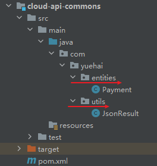

### ②、修改微服务提供者支付模块 cloud-provider-payment8001

1. 修改 pom.xml 文件，删除通用模块中有的依赖，并将通用包作为依赖引入其中

```xml
<?xml version="1.0" encoding="UTF-8"?>
<project xmlns="http://maven.apache.org/POM/4.0.0"
         xmlns:xsi="http://www.w3.org/2001/XMLSchema-instance"
         xsi:schemaLocation="http://maven.apache.org/POM/4.0.0 http://maven.apache.org/xsd/maven-4.0.0.xsd">
    <modelVersion>4.0.0</modelVersion>
    <!-- 父项目 -->
    <parent>
        <groupId>com.yuehai</groupId>
        <artifactId>SpringCloud</artifactId>
        <version>1.0-SNAPSHOT</version>
    </parent>
    
    <artifactId>cloud-provider-payment8001</artifactId>
    
    <dependencies>
        <!-- 引入自己定义的 api 通用包，可以使用 Payment 支付 Entity -->
        <dependency>
            <groupId>com.yuehai</groupId>
            <artifactId>cloud-api-commons</artifactId>
            <version>1.0-SNAPSHOT</version>
        </dependency>
        
        <!--jdbc-->
        <dependency>
            <groupId>org.springframework.boot</groupId>
            <artifactId>spring-boot-starter-jdbc</artifactId>
        </dependency>
        <!--mysql-connector-java-->
        <dependency>
            <groupId>mysql</groupId>
            <artifactId>mysql-connector-java</artifactId>
        </dependency>
        <!-- mybatis-plus -->
        <dependency>
            <groupId>com.baomidou</groupId>
            <artifactId>mybatis-plus-boot-starter</artifactId>
        </dependency>
        <!-- druid 数据连接池 -->
        <dependency>
            <groupId>com.alibaba</groupId>
            <artifactId>druid-spring-boot-starter</artifactId>
            <version>1.1.10</version>
        </dependency>
        <dependency>
            <groupId>junit</groupId>
            <artifactId>junit</artifactId>
            <scope>test</scope>
        </dependency>
    </dependencies>
    
</project>
```

2. 删除 entities 和 utils 包与其中的内容

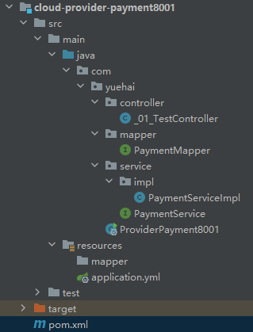

3. 启动 8001 模块，测试

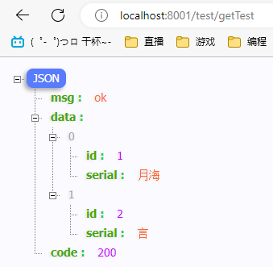

## 5、创建微服务消费者订单模块 cloud-consumer-order80

> **RestTemplate：**
> 
> 1. 官网地址：[https://docs.spring.io/spring-framework/docs/5.2.2.RELEASE/javadoc-api/org/springframework/web/client/RestTemplate.html](https://docs.spring.io/spring-framework/docs/5.2.2.RELEASE/javadoc-api/org/springframework/web/client/RestTemplate.html)
> 2. 使用 restTemplate 访问 restful get 接口：`url, responseType, uriVariables` 这三个参数分别代表：请求地址、HTTP 响应转换被转换成的对象类型、url占位参数

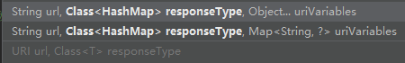

> 3. 使用 restTemplate 访问 restful post 接口：`url , request, responseType, uriVariables` 这四个参数分别代表：请求地址、请求参数（放到请求体中）、HTTP 响应转换被转换成的对象类型、url占位参数
> 

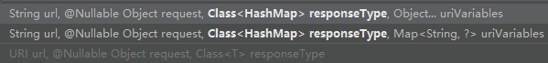

> 4. 此处 HTTP 响应转换被转换成的对象类型是 `HashMap.class` 的原因是 `JsonResult` 类继承了 `HashMap<String, Object>`

1. 创建模块

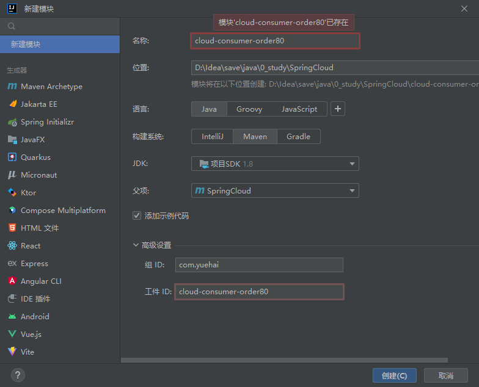

2. 修改 pom 文件，并将通用包作为依赖引入其中

```xml
<?xml version="1.0" encoding="UTF-8"?>
<project xmlns="http://maven.apache.org/POM/4.0.0"
         xmlns:xsi="http://www.w3.org/2001/XMLSchema-instance"
         xsi:schemaLocation="http://maven.apache.org/POM/4.0.0 http://maven.apache.org/xsd/maven-4.0.0.xsd">
    <modelVersion>4.0.0</modelVersion>
    <parent>
        <groupId>com.yuehai</groupId>
        <artifactId>SpringCloud</artifactId>
        <version>1.0-SNAPSHOT</version>
    </parent>
    
    <artifactId>cloud-consumer-order80</artifactId>
    
    <dependencies>
        <!-- 引入自己定义的 api 通用包，可以使用 Payment 支付 Entity -->
        <dependency>
            <groupId>com.yuehai</groupId>
            <artifactId>cloud-api-commons</artifactId>
            <version>1.0-SNAPSHOT</version>
        </dependency>
    </dependencies>

</project>
```

3. 修改 yml 文件

```yaml
# 服务端口号
server:
    port: 80

# spring 配置
spring:
    application:
        # 服务名称  微服务消费者订单模块 cloud-consumer-order80
        name: cloud-consumer-order
```

4. 修改主启动类

```java
package com.yuehai;

import org.springframework.boot.SpringApplication;
import org.springframework.boot.autoconfigure.SpringBootApplication;

/**
 * 微服务消费者订单模块 cloud-consumer-order80
 * @author 月海
 * @create ${DATE} ${TIME}
 */

@SpringBootApplication
public class ConsumerOrder80 {
    public static void main(String[] args) {
        SpringApplication.run(ConsumerOrder80.class, args);
    }

}
```

5. 创建 config 配置类

```java
package com.yuehai.config;

import org.springframework.context.annotation.Bean;
import org.springframework.context.annotation.Configuration;
import org.springframework.web.client.RestTemplate;

/**
 * @author 月海
 * @create 2023/2/21 8:48
 */

@Configuration
public class ApplicationContextConfig {

    @Bean
    public RestTemplate restTemplate(){
        return new RestTemplate();
    }

}
```

6. 创建 controller ，通过该类从 80 调用 8001

```java
package com.yuehai.controller;

import com.yuehai.utils.JsonResult;
import org.springframework.web.bind.annotation.GetMapping;
import org.springframework.web.bind.annotation.RestController;
import org.springframework.web.client.RestTemplate;

import javax.annotation.Resource;
import java.util.HashMap;

/**
 * @author 月海
 * @create 2023/2/21 8:40
 */

@RestController
public class OrderController {

    public static final String PaymentSrv_URL = "http://localhost:8001";

    @Resource
    private RestTemplate restTemplate;

    /**
     * 客户端用浏览器是 get 请求，底层实质也是发送 get 调用服务端 8001
     */
    @GetMapping("/getOrder/payment/get")
    public JsonResult getOrder(){
        /**
         * 使用 restTemplate 访问 restful get 接口：
         *      url, responseType, uriVariables) 这三个参数分别代表：
		 *		请求地址、HTTP 响应转换被转换成的对象类型、url占位参数
         */
        return JsonResult.success(restTemplate.getForObject(PaymentSrv_URL + "/test/getTest", HashMap.class));
    }

}
```

7. 在 8001 模块中创建新 post 方法

```java
/**
 * 测试 post，新增
 */
@PostMapping("/postTest")
public JsonResult postTest(@RequestBody String serial){
    return JsonResult.success(paymentService.addPayment(serial));
}
```
```java
// 新增
int addPayment(String serial);
```
```java
// 新增
@Override
public int addPayment(String serial) {
    return paymentMapper.insert(new Payment(null, serial));
}
```

8. 从 80 调用 8001 的 post 接口

```java
/**
 * 客户端用浏览器是 get 请求，但是底层实质发送 post 调用服务端8001
 */
@GetMapping("/postOrder/payment/post")
public JsonResult postOrder(String serial){
    /**
     * 使用 restTemplate 访问 restful post 接口：
     *      url , request, responseType, uriVariables) 这四个参数分别代表：
     *      请求地址、请求参数（放到请求体中）、HTTP 响应转换被转换成的对象类型、url占位参数
     */
    return JsonResult.success(restTemplate.postForEntity(PaymentSrv_URL + "/test/postTest", serial, HashMap.class));
}
```

9. 测试 getOrder：[http://localhost/getOrder/payment/get](http://localhost/getOrder/payment/get)

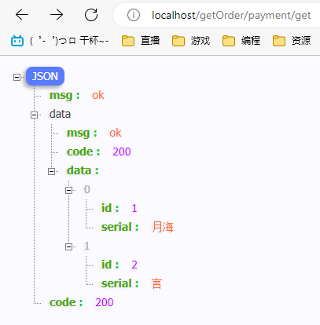

10. 测试 postOrder：[http://localhost/postOrder/payment/post?serial=2](http://localhost/postOrder/payment/post?serial=2)

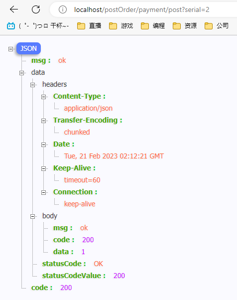


## 6、目前工程样图

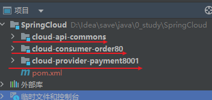

# 三、服务注册与发现 Eureka、Zookeeper、Consul

## 1、Eureka

### ①、Eureka 基础知识

#### Ⅰ、什么是服务治理

1. Spring Cloud 封装了 Netflix 公司开发的 Eureka 模块来实现服务治理
2. 在传统的 rpc 远程调用框架中，管理每个服务与服务之间依赖关系比较复杂，管理比较复杂，所以需要使用服务治理，管理服务于服务之间依赖关系，可以实现服务调用、负载均衡、容错等，实现服务发现与注册。

#### Ⅱ、什么是服务注册与发现

1. Eureka 采用了 CS 的设计架构，Eureka Server 作为服务注册功能的服务器，它是服务注册中心。而系统中的其他微服务，使用 Eureka的客户端连接到 Eureka Server 并维持心跳连接。这样系统的维护人员就可以通过 Eureka Server 来监控系统中各个微服务是否正常运行。
2. 在服务注册与发现中，有一个注册中心。
   1. 当服务器启动的时候，会把当前自己服务器的信息比如服务地址通讯地址等以别名方式注册到注册中心上。
   2. 另一方（消费者|服务提供者），以该别名的方式去注册中心上获取到实际的服务通讯地址，然后再实现本地 RPC 调用 RPC 远程调用框架核心设计思想：在于注册中心，因为使用注册中心管理每个服务与服务之间的一个依赖关系(服务治理概念)。
   3. 在任何 rpc 远程框架中，都会有一个注册中心(存放服务地址相关信息(接口地址))
3. 下左图是 Eureka 系统架构，右图是 Dubbo 的架构，请对比


#### Ⅲ、Eureka 两组件

1. Eureka Server 提供服务注册服务：各个微服务节点通过配置启动后，会在 EurekaServer 中进行注册，这样 EurekaServer 中的服务注册表中将会存储所有可用服务节点的信息，服务节点的信息可以在界面中直观看到。
2. EurekaClient 通过注册中心进行访问：是一个 Java 客户端，用于简化 Eureka Server 的交互，客户端同时也具备一个内置的、使用轮询(round-robin)负载算法的负载均衡器。在应用启动后，将会向 Eureka Server 发送心跳(默认周期为30秒)。如果 Eureka Server 在多个心跳周期内没有接收到某个节点的心跳，EurekaServer 将会从服务注册表中把这个服务节点移除（默认90秒）

### ②、单机 Eureka 构建步骤

#### Ⅰ、创建服务注册中心 cloud-eureka-server7001

1. 建 Module

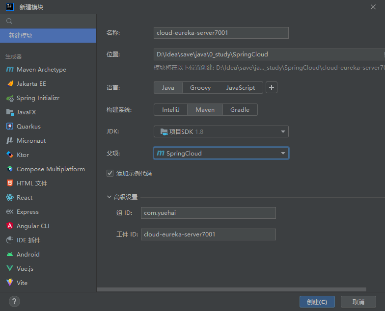


2. 改 POM

```xml
<?xml version="1.0" encoding="UTF-8"?>
<project xmlns="http://maven.apache.org/POM/4.0.0"
         xmlns:xsi="http://www.w3.org/2001/XMLSchema-instance"
         xsi:schemaLocation="http://maven.apache.org/POM/4.0.0 http://maven.apache.org/xsd/maven-4.0.0.xsd">
    <modelVersion>4.0.0</modelVersion>
    <!-- 父项目 -->
    <parent>
        <groupId>com.yuehai</groupId>
        <artifactId>SpringCloud</artifactId>
        <version>1.0-SNAPSHOT</version>
    </parent>
    
    <artifactId>cloud-eureka-server7001</artifactId>
    
    <dependencies>
        <!-- 引入自己定义的 api 通用包，可以使用 Payment 支付 Entity -->
        <dependency>
            <groupId>com.yuehai</groupId>
            <artifactId>cloud-api-commons</artifactId>
            <version>1.0-SNAPSHOT</version>
        </dependency>
    
        <!-- eureka-server 服务发现 -->
        <dependency>
            <groupId>org.springframework.cloud</groupId>
            <artifactId>spring-cloud-starter-netflix-eureka-server</artifactId>
        </dependency>
    </dependencies>

</project>
```

3. 写 YML
```yaml
# 服务端口号
server:
    port: 7001
eureka:
    instance:
        # eureka 服务端的实例名称
        hostname: localhost
    client:
        # false 表示不向注册中心注册自己。
        register-with-eureka: false
        # false 表示自己端就是注册中心，我的职责就是维护服务实例，并不需要去检索服务
        fetch-registry: false
        service-url:
            # 设置与 Eureka Server 交互的地址查询服务和注册服务都需要依赖这个地址。
            defaultZone: http://${eureka.instance.hostname}:${server.port}/eureka/

```

4. 主启动类，添加 `@EnableEurekaServer` 注解

```java
package com.yuehai;

import org.springframework.boot.SpringApplication;
import org.springframework.boot.autoconfigure.SpringBootApplication;
import org.springframework.cloud.netflix.eureka.server.EnableEurekaServer;

/**
 * 服务注册中心 cloud-eureka-server7001
 * @author 月海
 * @create ${DATE} ${TIME}
 */

@SpringBootApplication
// 将项目作为 SpringCloud 中的注册中心
@EnableEurekaServer
public class EurekaServer7001 {
    public static void main(String[] args) {
        SpringApplication.run(EurekaServer7001.class, args);
    }

}
```

5. 启动所有模块

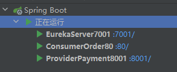

6. 访问 7001 端口（此时还没有实例显示）

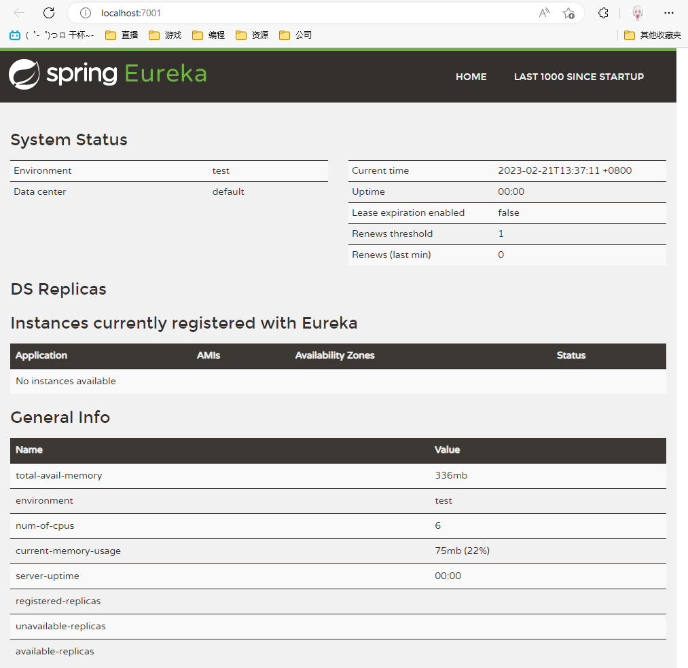

#### Ⅱ、将 cloud-provider-payment8001 注册进 EurekaServer 成为服务提供者

1. 修改模块 cloud-provider-payment8001 的 pom，引入：`spring-cloud-starter-netflix-eureka-client`

```java
<?xml version="1.0" encoding="UTF-8"?>
<project xmlns="http://maven.apache.org/POM/4.0.0"
         xmlns:xsi="http://www.w3.org/2001/XMLSchema-instance"
         xsi:schemaLocation="http://maven.apache.org/POM/4.0.0 http://maven.apache.org/xsd/maven-4.0.0.xsd">
    <modelVersion>4.0.0</modelVersion>
    <!-- 父项目 -->
    <parent>
        <groupId>com.yuehai</groupId>
        <artifactId>SpringCloud</artifactId>
        <version>1.0-SNAPSHOT</version>
    </parent>
    
    <artifactId>cloud-provider-payment8001</artifactId>
    
    <dependencies>
        <!-- 引入自己定义的 api 通用包，可以使用 Payment 支付 Entity -->
        <dependency>
            <groupId>com.yuehai</groupId>
            <artifactId>cloud-api-commons</artifactId>
            <version>1.0-SNAPSHOT</version>
        </dependency>
    
        <!-- eureka-client 服务注册 -->
        <dependency>
            <groupId>org.springframework.cloud</groupId>
            <artifactId>spring-cloud-starter-netflix-eureka-client</artifactId>
        </dependency>
        
        <!--jdbc-->
        <dependency>
            <groupId>org.springframework.boot</groupId>
            <artifactId>spring-boot-starter-jdbc</artifactId>
        </dependency>
        <!--mysql-connector-java-->
        <dependency>
            <groupId>mysql</groupId>
            <artifactId>mysql-connector-java</artifactId>
        </dependency>
        <!-- mybatis-plus -->
        <dependency>
            <groupId>com.baomidou</groupId>
            <artifactId>mybatis-plus-boot-starter</artifactId>
        </dependency>
        <!-- druid 数据连接池 -->
        <dependency>
            <groupId>com.alibaba</groupId>
            <artifactId>druid-spring-boot-starter</artifactId>
            <version>1.1.10</version>
        </dependency>
        <dependency>
            <groupId>junit</groupId>
            <artifactId>junit</artifactId>
            <scope>test</scope>
        </dependency>
    </dependencies>
    
</project>
```

2. 修改 yml 文件

```java
# 服务端口号
server:
    port: 8001

# spring 配置
spring:
    application:
        # 服务名称 微服务提供者支付模块 cloud-provider-payment8001
        name: cloud-payment-service
    datasource:
        # mysql驱动包 com.mysql.jdbc.Driver
        driver-class-name: com.mysql.jdbc.Driver
        # 连接信息
        # characterEncoding=UTF-8：指定所处理字符的解码和编码的格式
        # useSSL=false：不进行 SSL 连接
        # allowPublicKeyRetrieval=true：允许恶意代理执行MITM攻击以获取明文密码，因此它在默认情况下为False，必须显式启用
        # serverTimezone=GMT：格林尼治标准时间
        url: jdbc:mysql://43.138.106.181:3306/SpringCloud??characterEncoding=UTF-8&useSSL=false&allowPublicKeyRetrieval=true&serverTimezone=GMT
        # 用户名
        username: root
        # 密码（以 0 开头要加引号）
        password: "000123"

# 配置 MyBatis-Plus 规则
mybatis-plus:
    configuration:
        # 是否开启自动驼峰命名规则映射
        map-underscore-to-camel-case: true
        # 开启 mybatis 的 sql 执行日志打印，可以在控制台打印输出 sql 语句
        log-impl: org.apache.ibatis.logging.stdout.StdOutImpl

eureka:
    client:
        # 表示是否将自己注册进 EurekaServer 默认为 true。
        register-with-eureka: true
        # 是否从 EurekaServer 抓取已有的注册信息，默认为 true。单节点无所谓，集群必须设置为 true 才能配合 ribbon使 用负载均衡
        fetchRegistry: true
        # 指定 eureka 服务端的注册地址 (Eureka Server 的分区地址)
        service-url:
            defaultZone: http://localhost:7001/eureka

```

3. 修改主启动类，添加注解： `@EnableEurekaClient`

```java
package com.yuehai;

import org.mybatis.spring.annotation.MapperScan;
import org.springframework.boot.SpringApplication;
import org.springframework.boot.autoconfigure.SpringBootApplication;
import org.springframework.cloud.netflix.eureka.EnableEurekaClient;

/**
 * 微服务提供者支付模块 cloud-provider-payment8001
 * @author 月海
 * @create ${DATE} ${TIME}
 */

@SpringBootApplication
// 扫描指定包下面的 mapper 接口
@MapperScan("com.yuehai.mapper")
// 作为微服务的服务提供者
@EnableEurekaClient
public class ProviderPayment8001 {

    public static void main(String[] args) {
        SpringApplication.run(ProviderPayment8001.class, args);
    }

}

```

4. 重启 8001 与 7001 模块，测试，已发现 8001 实例


5. 微服务注册名配置说明

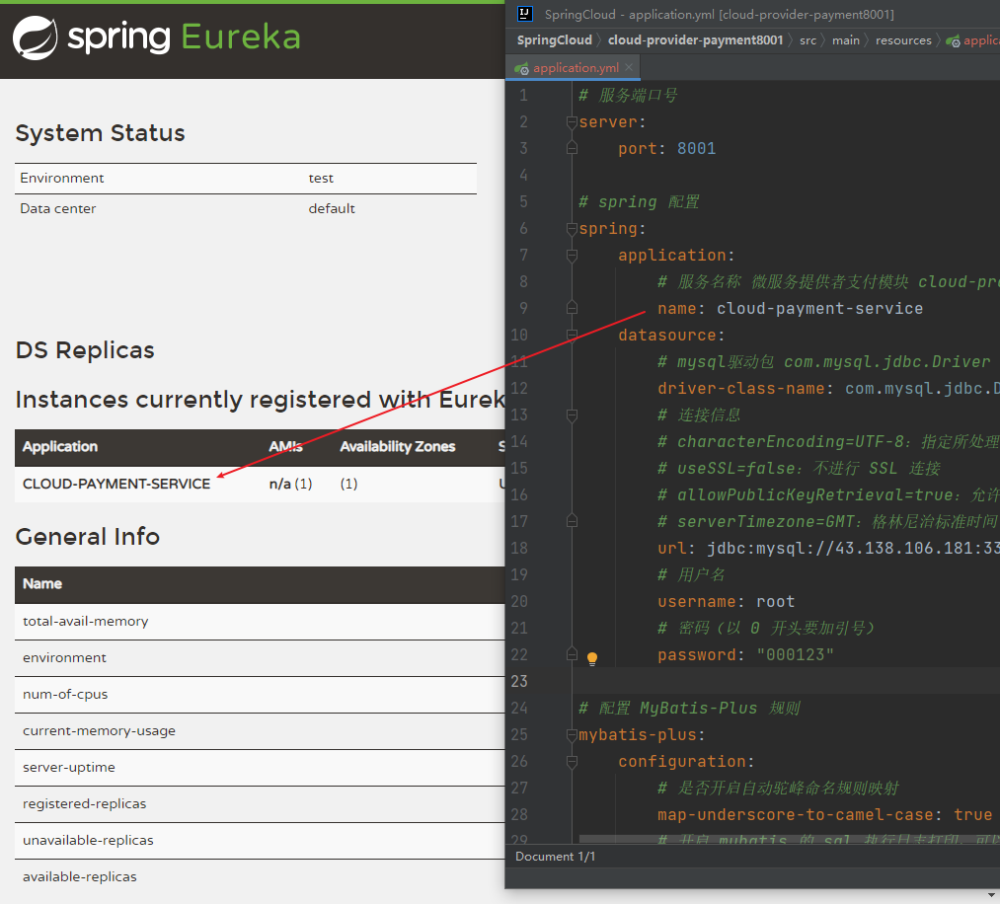

6. 自我保护机制

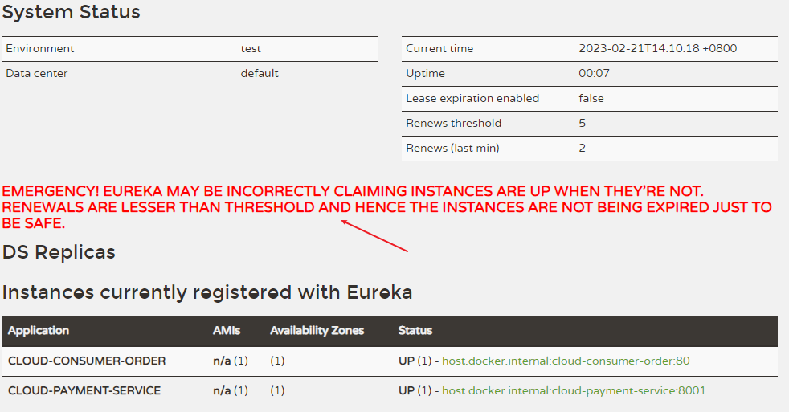

#### Ⅲ、将 cloud-consumer-order80 注册进 EurekaServer 成为服务消费

> 与上面相同

1. 修改模块 cloud-consumer-order80 的 pom，引入：`spring-cloud-starter-netflix-eureka-client`

```java
<?xml version="1.0" encoding="UTF-8"?>
<project xmlns="http://maven.apache.org/POM/4.0.0"
         xmlns:xsi="http://www.w3.org/2001/XMLSchema-instance"
         xsi:schemaLocation="http://maven.apache.org/POM/4.0.0 http://maven.apache.org/xsd/maven-4.0.0.xsd">
    <modelVersion>4.0.0</modelVersion>
    <parent>
        <groupId>com.yuehai</groupId>
        <artifactId>SpringCloud</artifactId>
        <version>1.0-SNAPSHOT</version>
    </parent>
    
    <artifactId>cloud-consumer-order80</artifactId>
    
    <dependencies>
        <!-- 引入自己定义的 api 通用包，可以使用 Payment 支付 Entity -->
        <dependency>
            <groupId>com.yuehai</groupId>
            <artifactId>cloud-api-commons</artifactId>
            <version>1.0-SNAPSHOT</version>
        </dependency>
    
        <!-- eureka-client 服务注册 -->
        <dependency>
            <groupId>org.springframework.cloud</groupId>
            <artifactId>spring-cloud-starter-netflix-eureka-client</artifactId>
        </dependency>
    </dependencies>
    
</project>
```

2. 修改 yml 文件

```java
# 服务端口号
server:
    port: 80

# spring 配置
spring:
    application:
        # 服务名称  微服务消费者订单模块 cloud-consumer-order80
        name: cloud-consumer-order
        
eureka:
    client:
        # 表示是否将自己注册进 EurekaServer 默认为 true。
        register-with-eureka: true
        # 是否从 EurekaServer 抓取已有的注册信息，默认为 true。单节点无所谓，集群必须设置为 true 才能配合 ribbon使 用负载均衡
        fetchRegistry: true
        # 指定 eureka 服务端的注册地址 (Eureka Server 的分区地址)
        service-url:
            defaultZone: http://localhost:7001/eureka
```

3. 修改主启动类，添加注解： `@EnableEurekaClient`

```java
package com.yuehai;

import org.springframework.boot.SpringApplication;
import org.springframework.boot.autoconfigure.SpringBootApplication;
import org.springframework.cloud.netflix.eureka.EnableEurekaClient;

/**
 * 微服务消费者订单模块 cloud-consumer-order80
 * @author 月海
 * @create ${DATE} ${TIME}
 */

@SpringBootApplication
// 作为微服务的服务提供者
@EnableEurekaClient
public class ConsumerOrder80 {
    public static void main(String[] args) {
        SpringApplication.run(ConsumerOrder80.class, args);
    }

}
```

4. 重启 80 与 7001 模块，测试，已发现 80 实例

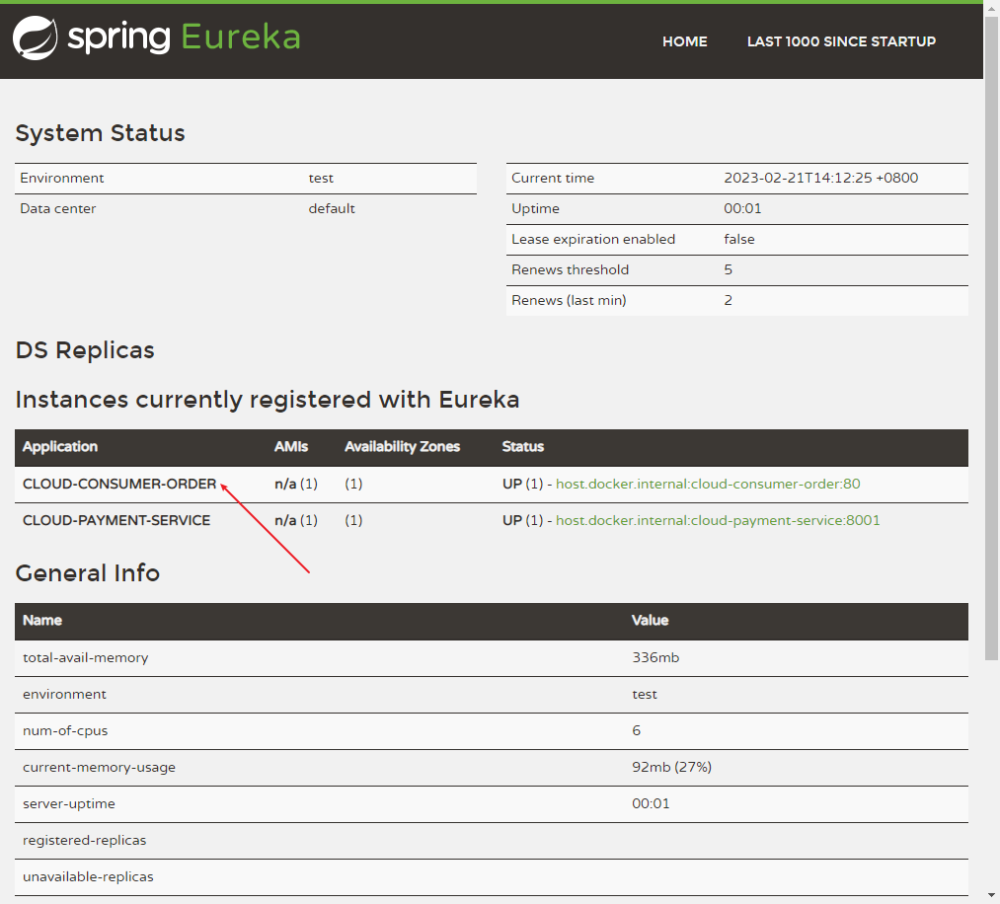

### ③、集群 Eureka 构建步骤

#### Ⅰ、Eureka 集群原理说明

- 问题：微服务RPC远程服务调用最核心的是什么
1. 高可用
2. 试想你的注册中心只有一个 only one， 它出故障了那就呵呵(￣▽￣)"了，会导致整个为服务环境不可用，所以：
3. 解决办法：搭建 Eureka 注册中心集群 ，实现负载均衡+故障容错


#### Ⅱ、EurekaServer 集群环境构建步骤

1. 修改映射配置：找到 `C:\Windows\System32\drivers\etc` 路径下的 hosts 文件，修改映射配置添加进 hosts 文件；因为要将一台机器当作两台机器用


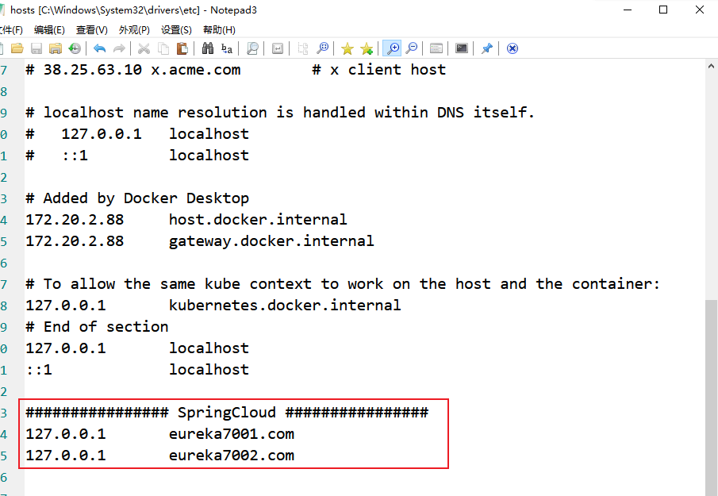

```java
127.0.0.1		eureka7001.com
127.0.0.1		eureka7002.com 
```

2. 参考 cloud-eureka-server7001 新建 cloud-eureka-server7002


3. 修改 7002 的 pom 文件

```xml
<?xml version="1.0" encoding="UTF-8"?>
<project xmlns="http://maven.apache.org/POM/4.0.0"
         xmlns:xsi="http://www.w3.org/2001/XMLSchema-instance"
         xsi:schemaLocation="http://maven.apache.org/POM/4.0.0 http://maven.apache.org/xsd/maven-4.0.0.xsd">
    <modelVersion>4.0.0</modelVersion>
    <!-- 父项目 -->
    <parent>
        <groupId>com.yuehai</groupId>
        <artifactId>SpringCloud</artifactId>
        <version>1.0-SNAPSHOT</version>
    </parent>
    
    <artifactId>cloud-eureka-server7002</artifactId>
    
    <dependencies>
        <!-- 引入自己定义的 api 通用包，可以使用 Payment 支付 Entity -->
        <dependency>
            <groupId>com.yuehai</groupId>
            <artifactId>cloud-api-commons</artifactId>
            <version>1.0-SNAPSHOT</version>
        </dependency>
    
        <!-- eureka-server 服务发现 -->
        <dependency>
            <groupId>org.springframework.cloud</groupId>
            <artifactId>spring-cloud-starter-netflix-eureka-server</artifactId>
        </dependency>
    </dependencies>

</project>
```

4. 修改 7001 与 7002 的 yml 文件

```yaml
# 服务端口号
server:
    port: 7001

eureka:
    instance:
        # eureka 服务端的实例名称
        hostname: eureka7001.com
    client:
        # false 表示不向注册中心注册自己。
        register-with-eureka: false
        # false 表示自己端就是注册中心，我的职责就是维护服务实例，并不需要去检索服务
        fetch-registry: false
        # 指定 eureka 服务端的注册地址
        service-url:
            # eureka 服务相互注册，在其中注册除自己以外的其他 eureka 服务
            defaultZone: http://eureka7002.com:7002/eureka/

```
```yaml
# 服务端口号
server:
    port: 7002

eureka:
    instance:
        # eureka 服务端的实例名称
        hostname: eureka7002.com
    client:
        # false 表示不向注册中心注册自己。
        register-with-eureka: false
        # false 表示自己端就是注册中心，我的职责就是维护服务实例，并不需要去检索服务
        fetch-registry: false
        # 指定 eureka 服务端的注册地址
        service-url:
            # eureka 服务相互注册，在其中注册除自己以外的其他 eureka 服务
            defaultZone: http://eureka7001.com:7001/eureka/

```

5. 修改 7002 的主启动类

```java
package com.yuehai;

import org.springframework.boot.SpringApplication;
import org.springframework.boot.autoconfigure.SpringBootApplication;
import org.springframework.cloud.netflix.eureka.server.EnableEurekaServer;

/**
 * 服务注册中心 cloud-eureka-server7001
 * @author 月海
 * @create ${DATE} ${TIME}
 */

@SpringBootApplication
// 将项目作为 SpringCloud 中的注册中心
@EnableEurekaServer
public class EurekaServer7002 {
    public static void main(String[] args) {
        SpringApplication.run(EurekaServer7002.class, args);
    }

}
```

#### Ⅲ、将支付服务 8001 微服务发布到上面 2 台 Eureka 集群配置中

- 修改 `defaultZone` 属性，添加新增的 Eureka

```yaml
# 服务端口号
server:
    port: 8001

# spring 配置
spring:
    application:
        # 服务名称 微服务提供者支付模块 cloud-provider-payment8001
        name: cloud-payment-service
    datasource:
        # mysql驱动包 com.mysql.jdbc.Driver
        driver-class-name: com.mysql.jdbc.Driver
        # 连接信息
        # characterEncoding=UTF-8：指定所处理字符的解码和编码的格式
        # useSSL=false：不进行 SSL 连接
        # allowPublicKeyRetrieval=true：允许恶意代理执行MITM攻击以获取明文密码，因此它在默认情况下为False，必须显式启用
        # serverTimezone=GMT：格林尼治标准时间
        url: jdbc:mysql://43.138.106.181:3306/SpringCloud??characterEncoding=UTF-8&useSSL=false&allowPublicKeyRetrieval=true&serverTimezone=GMT
        # 用户名
        username: root
        # 密码（以 0 开头要加引号）
        password: "000123"

# 配置 MyBatis-Plus 规则
mybatis-plus:
    configuration:
        # 是否开启自动驼峰命名规则映射
        map-underscore-to-camel-case: true
        # 开启 mybatis 的 sql 执行日志打印，可以在控制台打印输出 sql 语句
        log-impl: org.apache.ibatis.logging.stdout.StdOutImpl

eureka:
    client:
        # 表示是否将自己注册进 EurekaServer 默认为 true。
        register-with-eureka: true
        # 是否从 EurekaServer 抓取已有的注册信息，默认为 true。单节点无所谓，集群必须设置为 true 才能配合 ribbon使 用负载均衡
        fetchRegistry: true
        # 指定 eureka 服务端的注册地址 (Eureka Server 的分区地址)
        service-url:
            # 集群 eureka 间使用 , 分隔
            defaultZone: http://eureka7001.com:7001/eureka, http://eureka7002.com:7002/eureka

```

#### Ⅳ、将订单服务 80 微服务发布到上面 2 台 Eureka 集群配置中

- 修改 `defaultZone` 属性，添加新增的 Eureka

```yaml
# 服务端口号
server:
    port: 80

# spring 配置
spring:
    application:
        # 服务名称  微服务消费者订单模块 cloud-consumer-order80
        name: cloud-consumer-order

eureka:
    client:
        # 表示是否将自己注册进 EurekaServer 默认为 true。
        register-with-eureka: true
        # 是否从 EurekaServer 抓取已有的注册信息，默认为 true。单节点无所谓，集群必须设置为 true 才能配合 ribbon使 用负载均衡
        fetchRegistry: true
        # 指定 eureka 服务端的注册地址 (Eureka Server 的分区地址)
        service-url:
            # 集群 eureka 间使用 , 分隔
            defaultZone: http://eureka7001.com:7001/eureka, http://eureka7002.com:7002/eureka
```

#### Ⅴ、测试 Eureka 集群 1

1. 先启动 EurekaServer，7001/7002 服务
2. 再启动服务提供者 provider，8001 服务
3. 最后启动消费者，80 服务
4.  EurekaServer，7001：[http://eureka7001.com:7001/](http://eureka7001.com:7001/)

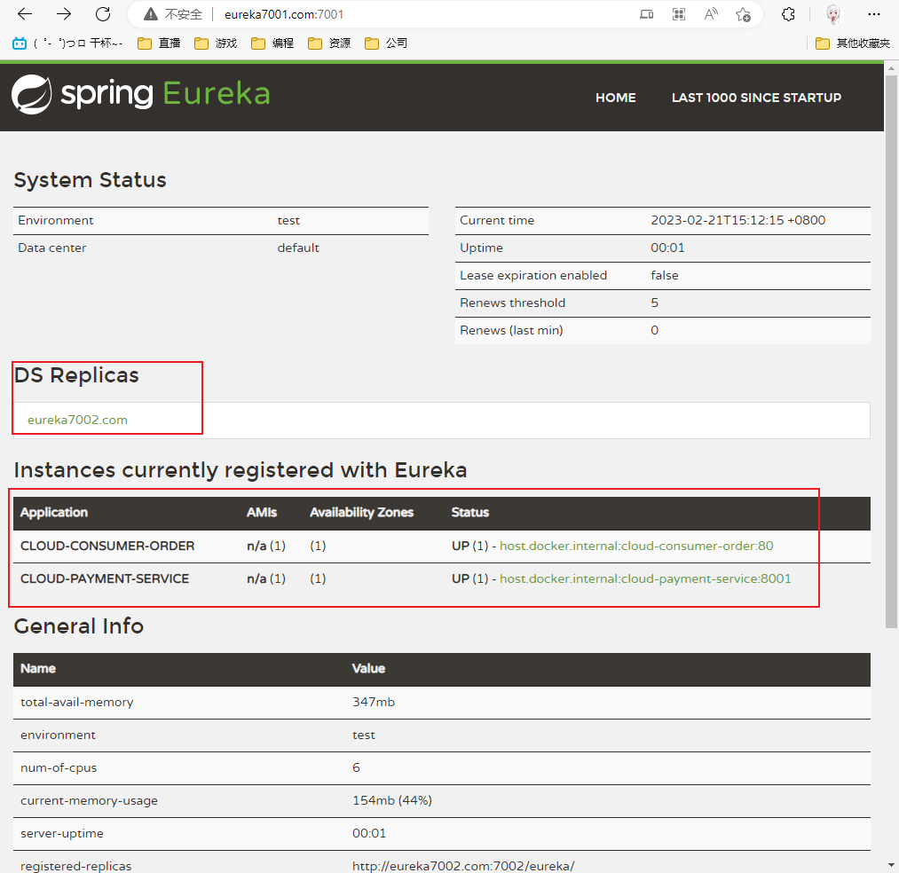

5.  EurekaServer，7002：[http://eureka7002.com:7002/](http://eureka7002.com:7002/)


#### Ⅵ、支付服务提供者集群环境构建 cloud-provider-payment8002

1. 参考 cloud-provider-payment8001 新建 cloud-provider-payment8002


2. 改 POM

```xml
<?xml version="1.0" encoding="UTF-8"?>
<project xmlns="http://maven.apache.org/POM/4.0.0"
         xmlns:xsi="http://www.w3.org/2001/XMLSchema-instance"
         xsi:schemaLocation="http://maven.apache.org/POM/4.0.0 http://maven.apache.org/xsd/maven-4.0.0.xsd">
    <modelVersion>4.0.0</modelVersion>
    <!-- 父项目 -->
    <parent>
        <groupId>com.yuehai</groupId>
        <artifactId>SpringCloud</artifactId>
        <version>1.0-SNAPSHOT</version>
    </parent>
    
    <artifactId>cloud-provider-payment8002</artifactId>
    
    <dependencies>
        <!-- 引入自己定义的 api 通用包，可以使用 Payment 支付 Entity -->
        <dependency>
            <groupId>com.yuehai</groupId>
            <artifactId>cloud-api-commons</artifactId>
            <version>1.0-SNAPSHOT</version>
        </dependency>
        
        <!-- eureka-client 服务注册 -->
        <dependency>
            <groupId>org.springframework.cloud</groupId>
            <artifactId>spring-cloud-starter-netflix-eureka-client</artifactId>
        </dependency>
        
        <!--jdbc-->
        <dependency>
            <groupId>org.springframework.boot</groupId>
            <artifactId>spring-boot-starter-jdbc</artifactId>
        </dependency>
        <!--mysql-connector-java-->
        <dependency>
            <groupId>mysql</groupId>
            <artifactId>mysql-connector-java</artifactId>
        </dependency>
        <!-- mybatis-plus -->
        <dependency>
            <groupId>com.baomidou</groupId>
            <artifactId>mybatis-plus-boot-starter</artifactId>
        </dependency>
        <!-- druid 数据连接池 -->
        <dependency>
            <groupId>com.alibaba</groupId>
            <artifactId>druid-spring-boot-starter</artifactId>
            <version>1.1.10</version>
        </dependency>
    </dependencies>

</project>
```

3. 写 YML

```yaml
# 服务端口号
server:
    port: 8002

# spring 配置
spring:
    application:
        # 服务名称 微服务提供者支付模块 cloud-provider-payment8001
        name: cloud-payment-service
    datasource:
        # mysql驱动包 com.mysql.jdbc.Driver
        driver-class-name: com.mysql.jdbc.Driver
        # 连接信息
        # characterEncoding=UTF-8：指定所处理字符的解码和编码的格式
        # useSSL=false：不进行 SSL 连接
        # allowPublicKeyRetrieval=true：允许恶意代理执行MITM攻击以获取明文密码，因此它在默认情况下为False，必须显式启用
        # serverTimezone=GMT：格林尼治标准时间
        url: jdbc:mysql://43.138.106.181:3306/SpringCloud??characterEncoding=UTF-8&useSSL=false&allowPublicKeyRetrieval=true&serverTimezone=GMT
        # 用户名
        username: root
        # 密码（以 0 开头要加引号）
        password: "000123"

# 配置 MyBatis-Plus 规则
mybatis-plus:
    configuration:
        # 是否开启自动驼峰命名规则映射
        map-underscore-to-camel-case: true
        # 开启 mybatis 的 sql 执行日志打印，可以在控制台打印输出 sql 语句
        log-impl: org.apache.ibatis.logging.stdout.StdOutImpl

eureka:
    client:
        # 表示是否将自己注册进 EurekaServer 默认为 true。
        register-with-eureka: true
        # 是否从 EurekaServer 抓取已有的注册信息，默认为 true。单节点无所谓，集群必须设置为 true 才能配合 ribbon使 用负载均衡
        fetchRegistry: true
        # 指定 eureka 服务端的注册地址 (Eureka Server 的分区地址)
        service-url:
            # 集群 eureka 间使用 , 分隔
            defaultZone: http://eureka7001.com:7001/eureka, http://eureka7002.com:7002/eureka

```

4. 主启动

```java
package com.yuehai;

import org.mybatis.spring.annotation.MapperScan;
import org.springframework.boot.SpringApplication;
import org.springframework.boot.autoconfigure.SpringBootApplication;
import org.springframework.cloud.netflix.eureka.EnableEurekaClient;

/**
 * 微服务提供者支付模块 cloud-provider-payment8001
 * @author 月海
 * @create ${DATE} ${TIME}
 */

@SpringBootApplication
// 扫描指定包下面的 mapper 接口
@MapperScan("com.yuehai.mapper")
// 作为微服务的服务提供者
@EnableEurekaClient
public class ProviderPayment8002 {

    public static void main(String[] args) {
        SpringApplication.run(ProviderPayment8002.class, args);
    }

}

```

5. 业务类
- 从 8001 复制的一样的
6. 修改 8001 与 8002 的 Controller

```java
package com.yuehai.controller;

import com.yuehai.service.PaymentService;
import com.yuehai.utils.JsonResult;
import org.springframework.beans.factory.annotation.Value;
import org.springframework.web.bind.annotation.*;

import javax.annotation.Resource;

/**
 * @author 月海
 * @create 2023/2/20 14:35
 */

@RestController
@RequestMapping("/test")
public class PaymentController {

    @Value("${server.port}")
    private String serverPort;

    @Resource
    private PaymentService paymentService;

    /**
     * 测试 get，查询全部
     */
    @GetMapping("/getTest")
    public JsonResult getTest(){
        return JsonResult.success(paymentService.getPayment()).put("服务端口为：", serverPort);
    }

    /**
     * 测试 post，新增
     */
    @PostMapping("/postTest")
    public JsonResult postTest(@RequestBody String serial){
        return JsonResult.success(paymentService.addPayment(serial)).put("服务端口为：", serverPort);
    }

}

```
```java
package com.yuehai.controller;

import com.yuehai.service.PaymentService;
import com.yuehai.utils.JsonResult;
import org.springframework.beans.factory.annotation.Value;
import org.springframework.web.bind.annotation.*;

import javax.annotation.Resource;

/**
 * @author 月海
 * @create 2023/2/20 14:35
 */

@RestController
@RequestMapping("/test")
public class PaymentController {

    @Value("${server.port}")
    private String serverPort;

    @Resource
    private PaymentService paymentService;

    /**
     * 测试 get，查询全部
     */
    @GetMapping("/getTest")
    public JsonResult getTest(){
        return JsonResult.success(paymentService.getPayment()).put("服务端口为：", serverPort);
    }

    /**
     * 测试 post，新增
     */
    @PostMapping("/postTest")
    public JsonResult postTest(@RequestBody String serial){
        return JsonResult.success(paymentService.addPayment(serial)).put("服务端口为：", serverPort);
    }


}

```

7. 重新启动 5 个微服务

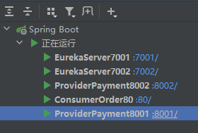

8. 测试 7001：[http://eureka7001.com:7001/](http://eureka7001.com:7001/)


9. 测试 7002：[http://eureka7002.com:7002/](http://eureka7002.com:7002/)

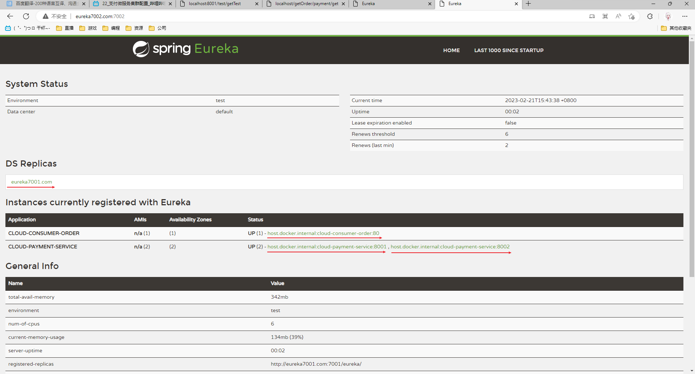

10. 测试 8001：[http://localhost:8001/test/getTest](http://localhost:8001/test/getTest)


11. 测试 8002：[http://localhost:8002/test/getTest](http://localhost:8002/test/getTest)

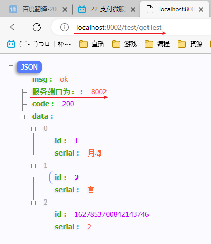

12. 测试 80：[http://localhost/getOrder/payment/get](http://localhost/getOrder/payment/get)


13. 问题：不论怎么刷新 80 端口，他调用的支付端口都是 8001，因为在 controller 调用时被写死 8001 了
14. 解决：在下面解决

#### Ⅶ、负载均衡

1. 解决上面的问题：修改 80 端口的 controller 类，将端口号更改为服务名

```java
package com.yuehai.controller;

import com.yuehai.utils.JsonResult;
import org.springframework.web.bind.annotation.GetMapping;
import org.springframework.web.bind.annotation.RestController;
import org.springframework.web.client.RestTemplate;

import javax.annotation.Resource;
import java.util.HashMap;

/**
 * @author 月海
 * @create 2023/2/21 8:40
 */

@RestController
public class OrderController {

    /**
     * 调用微服务中名为 CLOUD-PAYMENT-SERVICE 的服务
     */
    public static final String PAYMENT_SRV_URL = "http://CLOUD-PAYMENT-SERVICE";

    @Resource
    private RestTemplate restTemplate;

    /**
     * 客户端用浏览器是 get 请求，底层实质也是发送 get 调用服务端 8001
     */
    @GetMapping("/getOrder/payment/get")
    public JsonResult getOrder(){
        /**
         * 使用 restTemplate 访问 restful get 接口：
         *      url, responseType, uriVariables) 这三个参数分别代表：
         *      请求地址、HTTP 响应转换被转换成的对象类型、url占位参数
         */
        return JsonResult.success(restTemplate.getForObject(PAYMENT_SRV_URL + "/test/getTest", HashMap.class));
    }

    /**
     * 客户端用浏览器是 get 请求，但是底层实质发送 post 调用服务端8001
     */
    @GetMapping("/postOrder/payment/post")
    public JsonResult postOrder(String serial){
        /**
         * 使用 restTemplate 访问 restful post 接口：
         *      url , request, responseType, uriVariables) 这四个参数分别代表：
         *      请求地址、请求参数（放到请求体中）、HTTP 响应转换被转换成的对象类型、url占位参数
         */
        return JsonResult.success(restTemplate.postForEntity(PAYMENT_SRV_URL + "/test/postTest", serial, HashMap.class));
    }

}
```

2. 在 80 端口的 ApplicationContextConfig 类中的 RestTemplate 方法上添加 `@LoadBalanced` 注解，赋予 RestTemplate 负载均衡的能力；提前说一下 Ribbon 的负载均衡功能

```java
package com.yuehai.config;

import org.springframework.cloud.client.loadbalancer.LoadBalanced;
import org.springframework.context.annotation.Bean;
import org.springframework.context.annotation.Configuration;
import org.springframework.web.client.RestTemplate;

/**
 * @author 月海
 * @create 2023/2/21 8:48
 */

@Configuration
public class ApplicationContextConfig {

    @Bean
    /**
     * 使用 @LoadBalanced 注解赋予 RestTemplate 负载均衡的能力
     */
    @LoadBalanced
    public RestTemplate restTemplate(){
        return new RestTemplate();
    }

}

```

#### Ⅷ、测试 Eureka 集群 2

1. 先启动 EurekaServer，7001/7002 服务
2. 再启动服务提供者 provider，8001/8002 服务
3. 最后启动消费者，80 服务


4.  测试 7001：[http://eureka7001.com:7001/](http://eureka7001.com:7001/)

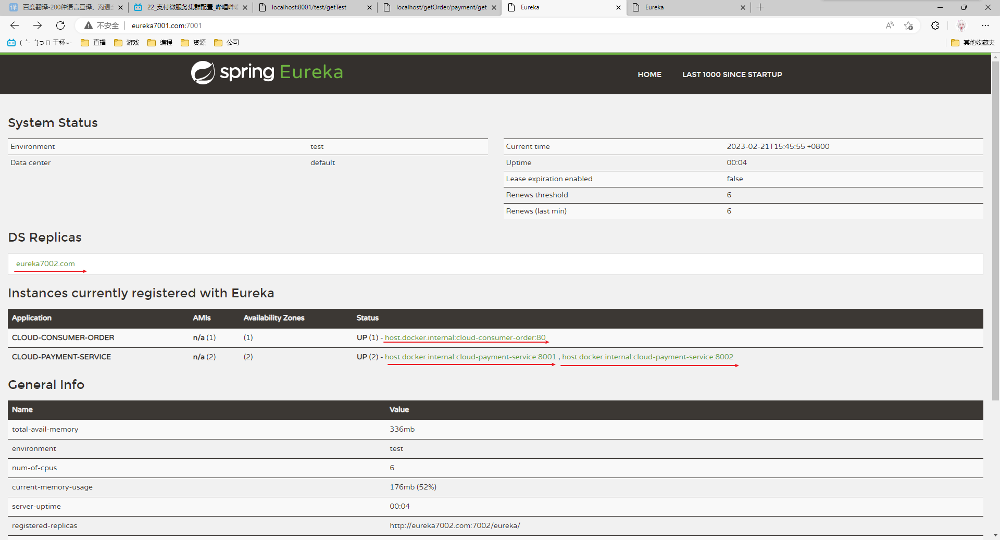

5. 测试 7002：[http://eureka7002.com:7002/](http://eureka7002.com:7002/)


6. 测试 8001：[http://localhost:8001/test/getTest](http://localhost:8001/test/getTest)

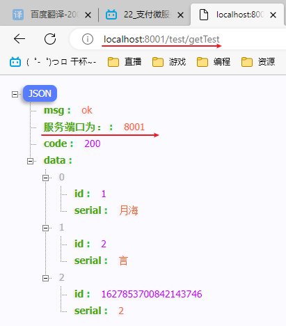

7. 测试 8002：[http://localhost:8002/test/getTest](http://localhost:8002/test/getTest)


8. 测试 80：[http://localhost/getOrder/payment/get](http://localhost/getOrder/payment/get)


9. 测试 80，多刷新几次：[http://localhost/getOrder/payment/get](http://localhost/getOrder/payment/get)，8001/8002 端口交替出现，负载均衡效果达到

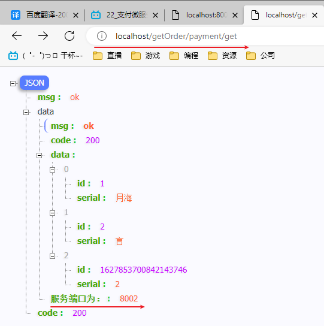

10. Ribbon 和 Eureka 整合后 Consumer 可以直接调用服务而不用再关心地址和端口号，且该服务还有负载功能了。O(∩_∩)O

### ④、actuator 微服务信息完善

#### Ⅰ、主机名称：服务名称修改

1. 当前问题：状态指示会带着主机名

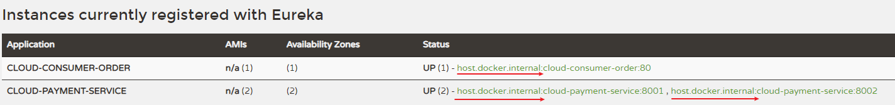

2. 修改 yml 文件，添加 `instance-id` 属性

```yaml
# 服务端口号
server:
    port: 80

# spring 配置
spring:
    application:
        # 服务名称  微服务消费者订单模块 cloud-consumer-order80
        name: cloud-consumer-order

eureka:
    client:
        # 表示是否将自己注册进 EurekaServer 默认为 true。
        register-with-eureka: true
        # 是否从 EurekaServer 抓取已有的注册信息，默认为 true。单节点无所谓，集群必须设置为 true 才能配合 ribbon使 用负载均衡
        fetchRegistry: true
        # 指定 eureka 服务端的注册地址
        service-url:
            # 集群 eureka 间使用 , 分隔
            defaultZone: http://eureka7001.com:7001/eureka, http://eureka7002.com:7002/eureka
    instance:
        # 指定状态名
        instance-id: order80
```
```yaml
# 服务端口号
server:
    port: 8001

# spring 配置
spring:
    application:
        # 服务名称 微服务提供者支付模块 cloud-provider-payment8001
        name: cloud-payment-service
    datasource:
        # mysql驱动包 com.mysql.jdbc.Driver
        driver-class-name: com.mysql.jdbc.Driver
        # 连接信息
        # characterEncoding=UTF-8：指定所处理字符的解码和编码的格式
        # useSSL=false：不进行 SSL 连接
        # allowPublicKeyRetrieval=true：允许恶意代理执行MITM攻击以获取明文密码，因此它在默认情况下为False，必须显式启用
        # serverTimezone=GMT：格林尼治标准时间
        url: jdbc:mysql://43.138.106.181:3306/SpringCloud??characterEncoding=UTF-8&useSSL=false&allowPublicKeyRetrieval=true&serverTimezone=GMT
        # 用户名
        username: root
        # 密码（以 0 开头要加引号）
        password: "000123"

# 配置 MyBatis-Plus 规则
mybatis-plus:
    configuration:
        # 是否开启自动驼峰命名规则映射
        map-underscore-to-camel-case: true
        # 开启 mybatis 的 sql 执行日志打印，可以在控制台打印输出 sql 语句
        log-impl: org.apache.ibatis.logging.stdout.StdOutImpl

eureka:
    client:
        # 表示是否将自己注册进 EurekaServer 默认为 true。
        register-with-eureka: true
        # 是否从 EurekaServer 抓取已有的注册信息，默认为 true。单节点无所谓，集群必须设置为 true 才能配合 ribbon使 用负载均衡
        fetchRegistry: true
        # 指定 eureka 服务端的注册地址 (Eureka Server 的分区地址)
        service-url:
            # 集群 eureka 间使用 , 分隔
            defaultZone: http://eureka7001.com:7001/eureka, http://eureka7002.com:7002/eureka
    instance:
        # 指定状态名
        instance-id: payment8001

```
```yaml
# 服务端口号
server:
    port: 8002

# spring 配置
spring:
    application:
        # 服务名称 微服务提供者支付模块 cloud-provider-payment8001
        name: cloud-payment-service
    datasource:
        # mysql驱动包 com.mysql.jdbc.Driver
        driver-class-name: com.mysql.jdbc.Driver
        # 连接信息
        # characterEncoding=UTF-8：指定所处理字符的解码和编码的格式
        # useSSL=false：不进行 SSL 连接
        # allowPublicKeyRetrieval=true：允许恶意代理执行MITM攻击以获取明文密码，因此它在默认情况下为False，必须显式启用
        # serverTimezone=GMT：格林尼治标准时间
        url: jdbc:mysql://43.138.106.181:3306/SpringCloud??characterEncoding=UTF-8&useSSL=false&allowPublicKeyRetrieval=true&serverTimezone=GMT
        # 用户名
        username: root
        # 密码（以 0 开头要加引号）
        password: "000123"

# 配置 MyBatis-Plus 规则
mybatis-plus:
    configuration:
        # 是否开启自动驼峰命名规则映射
        map-underscore-to-camel-case: true
        # 开启 mybatis 的 sql 执行日志打印，可以在控制台打印输出 sql 语句
        log-impl: org.apache.ibatis.logging.stdout.StdOutImpl

eureka:
    client:
        # 表示是否将自己注册进 EurekaServer 默认为 true。
        register-with-eureka: true
        # 是否从 EurekaServer 抓取已有的注册信息，默认为 true。单节点无所谓，集群必须设置为 true 才能配合 ribbon使 用负载均衡
        fetchRegistry: true
        # 指定 eureka 服务端的注册地址 (Eureka Server 的分区地址)
        service-url:
            # 集群 eureka 间使用 , 分隔
            defaultZone: http://eureka7001.com:7001/eureka, http://eureka7002.com:7002/eureka
    instance:
        # 指定状态名
        instance-id: payment8002

```

3. 修改之后：

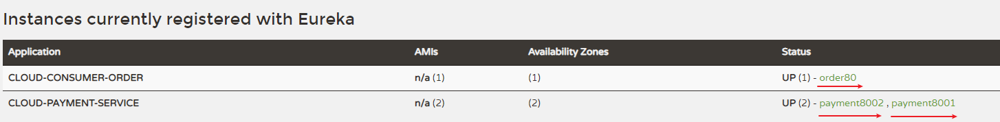

#### Ⅱ、访问信息有 IP 信息提示

1. 当前问题：访问路径不会显示 IP 地址
2. 修改 yml 文件，添加 `instance-id` 属性

```yaml
# 服务端口号
server:
    port: 80

# spring 配置
spring:
    application:
        # 服务名称  微服务消费者订单模块 cloud-consumer-order80
        name: cloud-consumer-order

eureka:
    client:
        # 表示是否将自己注册进 EurekaServer 默认为 true。
        register-with-eureka: true
        # 是否从 EurekaServer 抓取已有的注册信息，默认为 true。单节点无所谓，集群必须设置为 true 才能配合 ribbon使 用负载均衡
        fetchRegistry: true
        # 指定 eureka 服务端的注册地址
        service-url:
            # 集群 eureka 间使用 , 分隔
            defaultZone: http://eureka7001.com:7001/eureka, http://eureka7002.com:7002/eureka
    instance:
        # 指定状态名
        instance-id: order80
        # 访问路径可以显示 IP 地址
        prefer-ip-address: true
```
```yaml
# 服务端口号
server:
    port: 8001

# spring 配置
spring:
    application:
        # 服务名称 微服务提供者支付模块 cloud-provider-payment8001
        name: cloud-payment-service
    datasource:
        # mysql驱动包 com.mysql.jdbc.Driver
        driver-class-name: com.mysql.jdbc.Driver
        # 连接信息
        # characterEncoding=UTF-8：指定所处理字符的解码和编码的格式
        # useSSL=false：不进行 SSL 连接
        # allowPublicKeyRetrieval=true：允许恶意代理执行MITM攻击以获取明文密码，因此它在默认情况下为False，必须显式启用
        # serverTimezone=GMT：格林尼治标准时间
        url: jdbc:mysql://43.138.106.181:3306/SpringCloud??characterEncoding=UTF-8&useSSL=false&allowPublicKeyRetrieval=true&serverTimezone=GMT
        # 用户名
        username: root
        # 密码（以 0 开头要加引号）
        password: "000123"

# 配置 MyBatis-Plus 规则
mybatis-plus:
    configuration:
        # 是否开启自动驼峰命名规则映射
        map-underscore-to-camel-case: true
        # 开启 mybatis 的 sql 执行日志打印，可以在控制台打印输出 sql 语句
        log-impl: org.apache.ibatis.logging.stdout.StdOutImpl

eureka:
    client:
        # 表示是否将自己注册进 EurekaServer 默认为 true。
        register-with-eureka: true
        # 是否从 EurekaServer 抓取已有的注册信息，默认为 true。单节点无所谓，集群必须设置为 true 才能配合 ribbon使 用负载均衡
        fetchRegistry: true
        # 指定 eureka 服务端的注册地址 (Eureka Server 的分区地址)
        service-url:
            # 集群 eureka 间使用 , 分隔
            defaultZone: http://eureka7001.com:7001/eureka, http://eureka7002.com:7002/eureka
    instance:
        # 指定状态名
        instance-id: payment8001
        # 访问路径可以显示 IP 地址
        prefer-ip-address: true

```
```yaml
# 服务端口号
server:
    port: 8002

# spring 配置
spring:
    application:
        # 服务名称 微服务提供者支付模块 cloud-provider-payment8001
        name: cloud-payment-service
    datasource:
        # mysql驱动包 com.mysql.jdbc.Driver
        driver-class-name: com.mysql.jdbc.Driver
        # 连接信息
        # characterEncoding=UTF-8：指定所处理字符的解码和编码的格式
        # useSSL=false：不进行 SSL 连接
        # allowPublicKeyRetrieval=true：允许恶意代理执行MITM攻击以获取明文密码，因此它在默认情况下为False，必须显式启用
        # serverTimezone=GMT：格林尼治标准时间
        url: jdbc:mysql://43.138.106.181:3306/SpringCloud??characterEncoding=UTF-8&useSSL=false&allowPublicKeyRetrieval=true&serverTimezone=GMT
        # 用户名
        username: root
        # 密码（以 0 开头要加引号）
        password: "000123"

# 配置 MyBatis-Plus 规则
mybatis-plus:
    configuration:
        # 是否开启自动驼峰命名规则映射
        map-underscore-to-camel-case: true
        # 开启 mybatis 的 sql 执行日志打印，可以在控制台打印输出 sql 语句
        log-impl: org.apache.ibatis.logging.stdout.StdOutImpl

eureka:
    client:
        # 表示是否将自己注册进 EurekaServer 默认为 true。
        register-with-eureka: true
        # 是否从 EurekaServer 抓取已有的注册信息，默认为 true。单节点无所谓，集群必须设置为 true 才能配合 ribbon使 用负载均衡
        fetchRegistry: true
        # 指定 eureka 服务端的注册地址 (Eureka Server 的分区地址)
        service-url:
            # 集群 eureka 间使用 , 分隔
            defaultZone: http://eureka7001.com:7001/eureka, http://eureka7002.com:7002/eureka
    instance:
        # 指定状态名
        instance-id: payment8002
        # 访问路径可以显示 IP 地址
        prefer-ip-address: true

```

3. 修改之后：

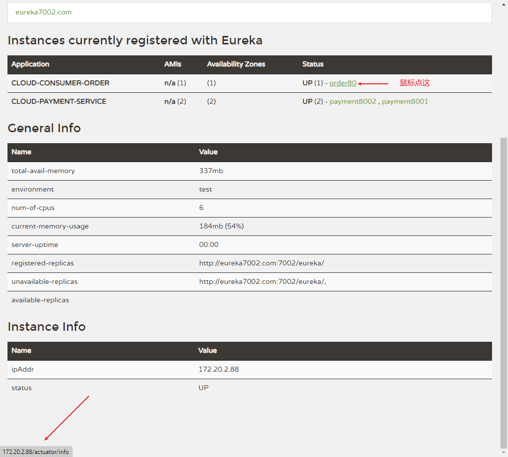

### ⑤、服务发现 Discovery

> 对于注册进 eureka 里面的微服务，可以通过服务发现来获得该服务的信息

1. 修改 cloud-provider-payment8001 的 Controller，注入 DiscoveryClient，并新增 discovery 方法

```java
package com.yuehai.controller;

import com.yuehai.service.PaymentService;
import com.yuehai.utils.JsonResult;
import org.springframework.beans.factory.annotation.Value;
import org.springframework.cloud.client.ServiceInstance;
import org.springframework.cloud.client.discovery.DiscoveryClient;
import org.springframework.web.bind.annotation.*;

import javax.annotation.Resource;
import java.util.List;

/**
 * @author 月海
 * @create 2023/2/20 14:35
 */

@RestController
@RequestMapping("/test")
public class PaymentController {

    @Value("${server.port}")
    private String serverPort;
    /**
     * DiscoveryClient：服务发现
     */
    @Resource
    private DiscoveryClient discoveryClient;

    @Resource
    private PaymentService paymentService;

    /**
     * 测试 get，查询全部
     */
    @GetMapping("/getTest")
    public JsonResult getTest(){
        return JsonResult.success(paymentService.getPayment()).put("服务端口为：", serverPort);
    }

    /**
     * 测试 post，新增
     */
    @PostMapping("/postTest")
    public JsonResult postTest(@RequestBody String serial){
        return JsonResult.success(paymentService.addPayment(serial)).put("服务端口为：", serverPort);
    }

    /**
     * DiscoveryClient：服务发现测试
     */
    @GetMapping(value = "/DCTest")
    public JsonResult discovery(){
        // 获取所有在 Eureka 中注册的服务，返回集合，其中保存的是服务名
        List<String> services = discoveryClient.getServices();

        // 获取指定服务名的微服务详细信息
        List<ServiceInstance> instances = discoveryClient.getInstances("cloud-payment-service");

        return JsonResult.success("OK").put("services：", services).put("instances：", instances);
    }
}

```

2. 返回内容：[http://localhost:8001/test/DCTest](http://localhost:8001/test/DCTest)

```json
{
    "msg": "ok",
    "instances：": [
        {
            "host": "172.20.2.88",
            "port": 8001,
            "metadata": {
                "management.port": "8001"
            },
            "secure": false,
            "uri": "http://172.20.2.88:8001",
            "serviceId": "CLOUD-PAYMENT-SERVICE",
            "instanceId": "payment8001",
            "instanceInfo": {
                "instanceId": "payment8001",
                "app": "CLOUD-PAYMENT-SERVICE",
                "appGroupName": null,
                "ipAddr": "172.20.2.88",
                "sid": "na",
                "homePageUrl": "http://172.20.2.88:8001/",
                "statusPageUrl": "http://172.20.2.88:8001/actuator/info",
                "healthCheckUrl": "http://172.20.2.88:8001/actuator/health",
                "secureHealthCheckUrl": null,
                "vipAddress": "cloud-payment-service",
                "secureVipAddress": "cloud-payment-service",
                "countryId": 1,
                "dataCenterInfo": {
                    "@class": "com.netflix.appinfo.InstanceInfo$DefaultDataCenterInfo",
                    "name": "MyOwn"
                },
                "hostName": "172.20.2.88",
                "status": "UP",
                "overriddenStatus": "UNKNOWN",
                "leaseInfo": {
                    "renewalIntervalInSecs": 30,
                    "durationInSecs": 90,
                    "registrationTimestamp": 1677024411541,
                    "lastRenewalTimestamp": 1677024531484,
                    "evictionTimestamp": 0,
                    "serviceUpTimestamp": 1677024411541
                },
                "isCoordinatingDiscoveryServer": false,
                "metadata": {
                    "management.port": "8001"
                },
                "lastUpdatedTimestamp": 1677024411541,
                "lastDirtyTimestamp": 1677024411451,
                "actionType": "ADDED",
                "asgName": null
            },
            "scheme": null
        },
        {
            "host": "172.20.2.88",
            "port": 8002,
            "metadata": {
                "management.port": "8002"
            },
            "secure": false,
            "uri": "http://172.20.2.88:8002",
            "serviceId": "CLOUD-PAYMENT-SERVICE",
            "instanceId": "payment8002",
            "instanceInfo": {
                "instanceId": "payment8002",
                "app": "CLOUD-PAYMENT-SERVICE",
                "appGroupName": null,
                "ipAddr": "172.20.2.88",
                "sid": "na",
                "homePageUrl": "http://172.20.2.88:8002/",
                "statusPageUrl": "http://172.20.2.88:8002/actuator/info",
                "healthCheckUrl": "http://172.20.2.88:8002/actuator/health",
                "secureHealthCheckUrl": null,
                "vipAddress": "cloud-payment-service",
                "secureVipAddress": "cloud-payment-service",
                "countryId": 1,
                "dataCenterInfo": {
                    "@class": "com.netflix.appinfo.InstanceInfo$DefaultDataCenterInfo",
                    "name": "MyOwn"
                },
                "hostName": "172.20.2.88",
                "status": "UP",
                "overriddenStatus": "UNKNOWN",
                "leaseInfo": {
                    "renewalIntervalInSecs": 30,
                    "durationInSecs": 90,
                    "registrationTimestamp": 1677024399834,
                    "lastRenewalTimestamp": 1677024549693,
                    "evictionTimestamp": 0,
                    "serviceUpTimestamp": 1677024399836
                },
                "isCoordinatingDiscoveryServer": false,
                "metadata": {
                    "management.port": "8002"
                },
                "lastUpdatedTimestamp": 1677024399836,
                "lastDirtyTimestamp": 1677024399545,
                "actionType": "ADDED",
                "asgName": null
            },
            "scheme": null
        }
    ],
    "services：": [
        "cloud-consumer-order",
        "cloud-payment-service"
    ],
    "code": 200,
    "data": "OK"
}
```

### ⑥、Eureka 自我保护

#### Ⅰ、概述

1. 保护模式主要用于一组客户端和 Eureka Server 之间存在网络分区场景下的保护。
2. 一旦进入保护模式，Eureka Server 将会尝试保护其服务注册表中的信息，不再删除服务注册表中的数据，也就是不会注销任何微服务。
3. 如果在 Eureka Server 的首页看到以下这段提示，则说明 Eureka 进入了保护模式：


4. 为什么会产生 Eureka 自我保护机制：防止了虽然 EurekaClient 在正常运行，但是其与 EurekaServer 网络不通的情况下，EurekaServer 会立刻将 EurekaClient 服务剔除

#### Ⅱ、什么是自我保护模式

1. 默认情况下，如果 EurekaServer 在一定时间内没有接收到某个微服务实例的心跳，EurekaServer 将会注销该实例（默认90秒）。但是当网络分区故障发生(延时、卡顿、拥挤)时，微服务与 EurekaServer 之间无法正常通信，以上行为可能变得非常危险了：因为微服务本身其实是健康的，此时本不应该注销这个微服务
2. Eureka 通过“自我保护模式”来解决这个问题：当 EurekaServer 节点在短时间内丢失过多客户端时（可能发生了网络分区故障），那么这个节点就会进入自我保护模式。
3. 在自我保护模式中，Eureka Server 会保护服务注册表中的信息，不再注销任何服务实例。
4. 它的设计哲学就是宁可保留错误的服务注册信息，也不盲目注销任何可能健康的服务实例。一句话讲解：好死不如赖活着
5. 综上，自我保护模式是一种应对网络异常的安全保护措施。它的架构哲学是宁可同时保留所有微服务（健康的微服务和不健康的微服务都会保留）也不盲目注销任何健康的微服务。使用自我保护模式，可以让 Eureka 集群更加的健壮、稳定。
6. 一句话：某时刻某一个微服务不可用了，Eureka 不会立刻清理，依旧会对该微服务的信息进行保存
7. 属于 CAP 里面的 AP 分支


#### Ⅲ、怎么禁止自我保护

1. 在服务注册中心的配置文件 application.yml 中新增配置：`eureka.server.enable-self-preservation=true`

```yaml
# 服务端口号
server:
    port: 7001

eureka:
    instance:
        # eureka 服务端的实例名称
        hostname: eureka7001.com
    client:
        # false 表示不向注册中心注册自己。
        register-with-eureka: false
        # false 表示自己端就是注册中心，我的职责就是维护服务实例，并不需要去检索服务
        fetch-registry: false
        # 指定 eureka 服务端的注册地址
        service-url:
            # eureka 服务相互注册，在其中注册除自己以外的其他 eureka 服务
            defaultZone: http://eureka7002.com:7002/eureka/
    server:
        # 关闭自我保护机制，保证不可用服务被及时踢除（默认开启）
        enable-self-preservation: false
```

2. 关闭之后的效果：

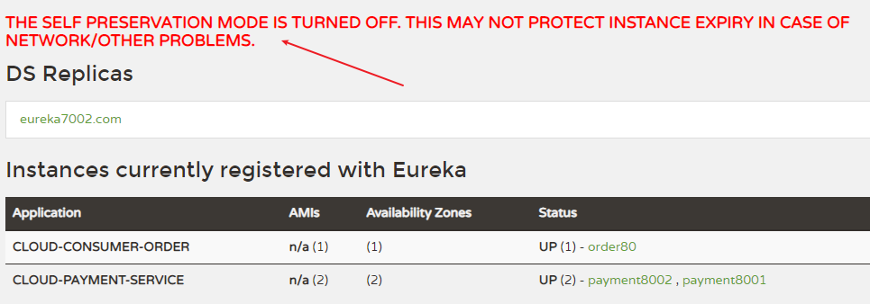

3. 微服务提供者可以修改配置文件，新增以下属性：
   1. `eureka.instance.lease-renewal-interval-in-seconds=30`：Eureka 客户端向服务端发送心跳的时间间隔，单位为秒(默认是30秒)
   2. `eureka.instance.lease-expiration-duration-in-seconds=90`：Eureka 客户端向服务端发送心跳的时间间隔，单位为秒(默认是30秒)

## 2、Zookeeper

> Eureka停止更新了你怎么办：[https://github.com/Netflix/eureka/wiki](https://github.com/Netflix/eureka/wiki)
> SpringCloud 整合 Zookeeper 代替 Eureka

### ①、Zookeeper 简介

1. zookeeper 是一个分布式协调工具，可以实现注册中心功能
2. 关闭 Linux 服务器防火墙后启动 zookeeper 服务器
3. zookeeper 服务器取代 Eureka 服务器，zookeeper 作为服务注册中心

### ②、安装 zookeeper

> 本次使用的是 docker

1. 下载 zookeeper 镜像 3.5.3 版，版本的对应关系在 maven 依赖中查看；当然也可以自己指定 maven 依赖中的 zookeeper 版本

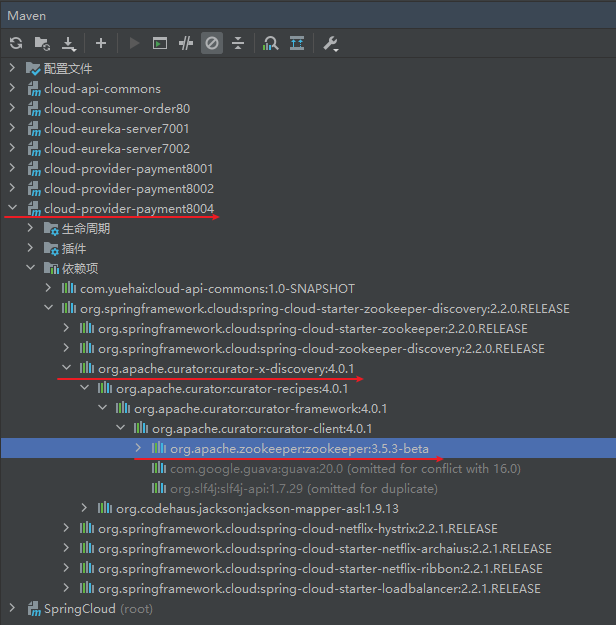

```bash
docker@VM-8-15-ubuntu:~$ docker images
REPOSITORY                    TAG       IMAGE ID       CREATED         SIZE
docker-compose_nginx          latest    524bf968c7e3   2 weeks ago     142MB
docker-compose_java-service   latest    4bd1f84ef9cc   2 weeks ago     453MB
nginx                         latest    605c77e624dd   13 months ago   141MB
mysql                         5.7       c20987f18b13   14 months ago   448MB
ubuntu                        latest    ba6acccedd29   16 months ago   72.8MB
redis                         6.2.1     de974760ddb2   22 months ago   105MB
portainer/portainer           1.20.2    19d07168491a   3 years ago     74.1MB

docker@VM-8-15-ubuntu:~$ docker ps
CONTAINER ID   IMAGE                         COMMAND                  CREATED       STATUS       PORTS                                                  NAMES
890052e7a032   mysql:5.7                     "docker-entrypoint.s…"   7 days ago    Up 7 days    0.0.0.0:3306->3306/tcp, :::3306->3306/tcp, 33060/tcp   sharp_kare
d2cca7634535   docker-compose_nginx          "/docker-entrypoint.…"   2 weeks ago   Up 12 days   0.0.0.0:80->80/tcp, :::80->80/tcp                      nginx
7ed99735286d   docker-compose_java-service   "java -jar /applicat…"   2 weeks ago   Up 12 days   0.0.0.0:9000->9000/tcp, :::9000->9000/tcp              java-service
9c710fd9a47a   portainer/portainer:1.20.2    "/portainer"             2 weeks ago   Up 2 weeks   0.0.0.0:9443->9000/tcp, :::9443->9000/tcp              naughty_kowalevski

docker@VM-8-15-ubuntu:~$ docker search zookeeper
NAME                             DESCRIPTION                                     STARS     OFFICIAL   AUTOMATED
zookeeper                        Apache ZooKeeper is an open-source server wh…   1323      [OK]       
wurstmeister/zookeeper                                                           178                  [OK]
jplock/zookeeper                 Builds a docker image for Zookeeper version …   165                  [OK]
bitnami/zookeeper                ZooKeeper is a centralized service for distr…   89                   [OK]
mesoscloud/zookeeper             ZooKeeper                                       73                   [OK]
digitalwonderland/zookeeper      Latest Zookeeper - clusterable                  23                   [OK]
debezium/zookeeper               Zookeeper image required when running the De…   17                   [OK]
thefactory/zookeeper-exhibitor   Exhibitor-managed ZooKeeper with S3 backups …   6                    [OK]
ubuntu/zookeeper                 ZooKeeper maintains configuration informatio…   5                    
emccorp/zookeeper                Zookeeper                                       2                    
dabealu/zookeeper-exporter       zookeeper exporter for prometheus               2                    [OK]
rancher/zookeeper                                                                1                    
bitnami/zookeeper-exporter                                                       1                    
objectscale/zookeeper-operator                                                   0                    
kope/zookeeper                                                                   0                    
semoss/zookeeper                                                                 0                    
rancher/zookeeper-config                                                         0                    
objectscale/zookeeper                                                            0                    
rapidfort/zookeeper-official     RapidFort optimized, hardened image for Zook…   0                    
pravega/zookeeper                                                                0                    
ibmcom/zookeeper-ppc64le         Apache ZooKeeper is an open-source server wh…   0                    
rapidfort/zookeeper              RapidFort optimized, hardened image for Zook…   0                    
phenompeople/zookeeper           Apache ZooKeeper is an open-source server wh…   0                    [OK]
rapidfort/zookeeper-ib           RapidFort optimized, hardened image for Zook…   0                    
pravega/zookeeper-operator       Kubernetes operator for Zookeeper               0                    

docker@VM-8-15-ubuntu:~$ docker pull zookeeper:3.6
3.6: Pulling from library/zookeeper
a2abf6c4d29d: Already exists 
2bbde5250315: Pull complete 
202a34e7968e: Pull complete 
4e4231e30efc: Pull complete 
707593b95343: Pull complete 
b070e6dedb4b: Pull complete 
d48cebe29194: Pull complete 
50c693a72fee: Pull complete 
Digest: sha256:f3d4d6e63f221599408fda5a99c8e05132e15b865b25fb18b5e5ef43158a6df5
Status: Downloaded newer image for zookeeper:3.6
docker.io/library/zookeeper:3.6

docker@VM-8-15-ubuntu:~$ docker images
REPOSITORY                    TAG       IMAGE ID       CREATED         SIZE
docker-compose_nginx          latest    524bf968c7e3   2 weeks ago     142MB
docker-compose_java-service   latest    4bd1f84ef9cc   2 weeks ago     453MB
nginx                         latest    605c77e624dd   13 months ago   141MB
zookeeper                     3.6       3e9dd32cd767   14 months ago   277MB
mysql                         5.7       c20987f18b13   14 months ago   448MB
ubuntu                        latest    ba6acccedd29   16 months ago   72.8MB
redis                         6.2.1     de974760ddb2   22 months ago   105MB
portainer/portainer           1.20.2    19d07168491a   3 years ago     74.1MB
docker@VM-8-15-ubuntu:~$ 
```

2. 新建目录：`/home/docker/docker/VOLUME/zookeeper/`
3. 启动容器：`docker run -d -e TZ="Asia/Shanghai" -p 7777:2181 -v /home/docker/docker/VOLUME/zookeeper:/data --name zookeeper zookeeper:3.6`
   1. `-d`：表示在一直在后台运行容器 
   2. `-e TZ="Asia/Shanghai"`：指定上海时区 
   3. `-p 7777:2181`：对端口进行映射，将本地 7777 端口映射到容器内部的 2181 端口
   4. `-v`：将本地目录(文件)挂载到容器指定目录；
   5. `--name`：设置创建的容器名称

```bash
docker@VM-8-15-ubuntu:~$ docker run -d -e TZ="Asia/Shanghai" -p 7777:2181 -v /home/docker/docker/VOLUME/zookeeper:/data --name zookeeper zookeeper:3.6
e04b697ebd06f9111342abaa8b00fae09452fb2e39e4b879b5668c0f7466d850

docker@VM-8-15-ubuntu:~$ docker ps
CONTAINER ID   IMAGE                         COMMAND                  CREATED         STATUS         PORTS                                                                     NAMES
e04b697ebd06   zookeeper:3.6                 "/docker-entrypoint.…"   4 seconds ago   Up 2 seconds   2888/tcp, 3888/tcp, 8080/tcp, 0.0.0.0:7777->2181/tcp, :::7777->2181/tcp   zookeeper
890052e7a032   mysql:5.7                     "docker-entrypoint.s…"   7 days ago      Up 7 days      0.0.0.0:3306->3306/tcp, :::3306->3306/tcp, 33060/tcp                      sharp_kare
d2cca7634535   docker-compose_nginx          "/docker-entrypoint.…"   2 weeks ago     Up 13 days     0.0.0.0:80->80/tcp, :::80->80/tcp                                         nginx
7ed99735286d   docker-compose_java-service   "java -jar /applicat…"   2 weeks ago     Up 13 days     0.0.0.0:9000->9000/tcp, :::9000->9000/tcp                                 java-service
9c710fd9a47a   portainer/portainer:1.20.2    "/portainer"             2 weeks ago     Up 2 weeks     0.0.0.0:9443->9000/tcp, :::9443->9000/tcp                                 naughty_kowalevski

docker@VM-8-15-ubuntu:~$ 
```

4. 查看运行日志

```bash
docker@VM-8-15-ubuntu:~$ docker logs e04b697ebd06
ZooKeeper JMX enabled by default
Using config: /conf/zoo.cfg
2023-02-22 10:17:06,830 [myid:] - INFO  [main:QuorumPeerConfig@174] - Reading configuration from: /conf/zoo.cfg
2023-02-22 10:17:06,835 [myid:] - INFO  [main:QuorumPeerConfig@451] - clientPort is not set
2023-02-22 10:17:06,836 [myid:] - INFO  [main:QuorumPeerConfig@464] - secureClientPort is not set
2023-02-22 10:17:06,836 [myid:] - INFO  [main:QuorumPeerConfig@480] - observerMasterPort is not set
2023-02-22 10:17:06,838 [myid:] - INFO  [main:QuorumPeerConfig@497] - metricsProvider.className is org.apache.zookeeper.metrics.impl.DefaultMetricsProvider
2023-02-22 10:17:06,844 [myid:] - ERROR [main:QuorumPeerConfig@722] - Invalid configuration, only one server specified (ignoring)
2023-02-22 10:17:06,848 [myid:1] - INFO  [main:DatadirCleanupManager@78] - autopurge.snapRetainCount set to 3
2023-02-22 10:17:06,848 [myid:1] - INFO  [main:DatadirCleanupManager@79] - autopurge.purgeInterval set to 0
2023-02-22 10:17:06,849 [myid:1] - INFO  [main:DatadirCleanupManager@101] - Purge task is not scheduled.
2023-02-22 10:17:06,849 [myid:1] - WARN  [main:QuorumPeerMain@138] - Either no config or no quorum defined in config, running in standalone mode
2023-02-22 10:17:06,854 [myid:1] - INFO  [main:ManagedUtil@44] - Log4j 1.2 jmx support found and enabled.
2023-02-22 10:17:06,863 [myid:1] - INFO  [main:QuorumPeerConfig@174] - Reading configuration from: /conf/zoo.cfg
2023-02-22 10:17:06,864 [myid:1] - INFO  [main:QuorumPeerConfig@451] - clientPort is not set
2023-02-22 10:17:06,864 [myid:1] - INFO  [main:QuorumPeerConfig@464] - secureClientPort is not set
2023-02-22 10:17:06,864 [myid:1] - INFO  [main:QuorumPeerConfig@480] - observerMasterPort is not set
2023-02-22 10:17:06,865 [myid:1] - INFO  [main:QuorumPeerConfig@497] - metricsProvider.className is org.apache.zookeeper.metrics.impl.DefaultMetricsProvider
2023-02-22 10:17:06,870 [myid:1] - ERROR [main:QuorumPeerConfig@722] - Invalid configuration, only one server specified (ignoring)
2023-02-22 10:17:06,872 [myid:1] - INFO  [main:ZooKeeperServerMain@122] - Starting server
2023-02-22 10:17:06,893 [myid:1] - INFO  [main:ServerMetrics@62] - ServerMetrics initialized with provider org.apache.zookeeper.metrics.impl.DefaultMetricsProvider@5ea434c8
2023-02-22 10:17:06,897 [myid:1] - INFO  [main:FileTxnSnapLog@124] - zookeeper.snapshot.trust.empty : false
2023-02-22 10:17:06,911 [myid:1] - INFO  [main:ZookeeperBanner@42] - 
2023-02-22 10:17:06,912 [myid:1] - INFO  [main:ZookeeperBanner@42] -   ______                  _                                          
2023-02-22 10:17:06,912 [myid:1] - INFO  [main:ZookeeperBanner@42] -  |___  /                 | |                                         
2023-02-22 10:17:06,912 [myid:1] - INFO  [main:ZookeeperBanner@42] -     / /    ___     ___   | | __   ___    ___   _ __     ___   _ __   
2023-02-22 10:17:06,912 [myid:1] - INFO  [main:ZookeeperBanner@42] -    / /    / _ \   / _ \  | |/ /  / _ \  / _ \ | '_ \   / _ \ | '__|
2023-02-22 10:17:06,912 [myid:1] - INFO  [main:ZookeeperBanner@42] -   / /__  | (_) | | (_) | |   <  |  __/ |  __/ | |_) | |  __/ | |    
2023-02-22 10:17:06,913 [myid:1] - INFO  [main:ZookeeperBanner@42] -  /_____|  \___/   \___/  |_|\_\  \___|  \___| | .__/   \___| |_|
2023-02-22 10:17:06,913 [myid:1] - INFO  [main:ZookeeperBanner@42] -                                               | |                     
2023-02-22 10:17:06,913 [myid:1] - INFO  [main:ZookeeperBanner@42] -                                               |_|                     
2023-02-22 10:17:06,913 [myid:1] - INFO  [main:ZookeeperBanner@42] - 
2023-02-22 10:17:06,915 [myid:1] - INFO  [main:Environment@98] - Server environment:zookeeper.version=3.6.3--6401e4ad2087061bc6b9f80dec2d69f2e3c8660a, built on 04/08/2021 16:35 GMT
2023-02-22 10:17:06,915 [myid:1] - INFO  [main:Environment@98] - Server environment:host.name=e04b697ebd06
2023-02-22 10:17:06,915 [myid:1] - INFO  [main:Environment@98] - Server environment:java.version=11.0.13
2023-02-22 10:17:06,916 [myid:1] - INFO  [main:Environment@98] - Server environment:java.vendor=Oracle Corporation
2023-02-22 10:17:06,916 [myid:1] - INFO  [main:Environment@98] - Server environment:java.home=/usr/local/openjdk-11
2023-02-22 10:17:06,916 [myid:1] - INFO  [main:Environment@98] - Server environment:java.class.path=/apache-zookeeper-3.6.3-bin/bin/../zookeeper-server/target/classes:/apache-zookeeper-3.6.3-bin/bin/../build/classes:/apache-zookeeper-3.6.3-bin/bin/../zookeeper-server/target/lib/*.jar:/apache-zookeeper-3.6.3-bin/bin/../build/lib/*.jar:/apache-zookeeper-3.6.3-bin/bin/../lib/zookeeper-prometheus-metrics-3.6.3.jar:/apache-zookeeper-3.6.3-bin/bin/../lib/zookeeper-jute-3.6.3.jar:/apache-zookeeper-3.6.3-bin/bin/../lib/zookeeper-3.6.3.jar:/apache-zookeeper-3.6.3-bin/bin/../lib/snappy-java-1.1.7.jar:/apache-zookeeper-3.6.3-bin/bin/../lib/slf4j-log4j12-1.7.25.jar:/apache-zookeeper-3.6.3-bin/bin/../lib/slf4j-api-1.7.25.jar:/apache-zookeeper-3.6.3-bin/bin/../lib/simpleclient_servlet-0.6.0.jar:/apache-zookeeper-3.6.3-bin/bin/../lib/simpleclient_hotspot-0.6.0.jar:/apache-zookeeper-3.6.3-bin/bin/../lib/simpleclient_common-0.6.0.jar:/apache-zookeeper-3.6.3-bin/bin/../lib/simpleclient-0.6.0.jar:/apache-zookeeper-3.6.3-bin/bin/../lib/netty-transport-native-unix-common-4.1.63.Final.jar:/apache-zookeeper-3.6.3-bin/bin/../lib/netty-transport-native-epoll-4.1.63.Final.jar:/apache-zookeeper-3.6.3-bin/bin/../lib/netty-transport-4.1.63.Final.jar:/apache-zookeeper-3.6.3-bin/bin/../lib/netty-resolver-4.1.63.Final.jar:/apache-zookeeper-3.6.3-bin/bin/../lib/netty-handler-4.1.63.Final.jar:/apache-zookeeper-3.6.3-bin/bin/../lib/netty-common-4.1.63.Final.jar:/apache-zookeeper-3.6.3-bin/bin/../lib/netty-codec-4.1.63.Final.jar:/apache-zookeeper-3.6.3-bin/bin/../lib/netty-buffer-4.1.63.Final.jar:/apache-zookeeper-3.6.3-bin/bin/../lib/metrics-core-3.2.5.jar:/apache-zookeeper-3.6.3-bin/bin/../lib/log4j-1.2.17.jar:/apache-zookeeper-3.6.3-bin/bin/../lib/json-simple-1.1.1.jar:/apache-zookeeper-3.6.3-bin/bin/../lib/jline-2.14.6.jar:/apache-zookeeper-3.6.3-bin/bin/../lib/jetty-util-ajax-9.4.39.v20210325.jar:/apache-zookeeper-3.6.3-bin/bin/../lib/jetty-util-9.4.39.v20210325.jar:/apache-zookeeper-3.6.3-bin/bin/../lib/jetty-servlet-9.4.39.v20210325.jar:/apache-zookeeper-3.6.3-bin/bin/../lib/jetty-server-9.4.39.v20210325.jar:/apache-zookeeper-3.6.3-bin/bin/../lib/jetty-security-9.4.39.v20210325.jar:/apache-zookeeper-3.6.3-bin/bin/../lib/jetty-io-9.4.39.v20210325.jar:/apache-zookeeper-3.6.3-bin/bin/../lib/jetty-http-9.4.39.v20210325.jar:/apache-zookeeper-3.6.3-bin/bin/../lib/javax.servlet-api-3.1.0.jar:/apache-zookeeper-3.6.3-bin/bin/../lib/jackson-databind-2.10.5.1.jar:/apache-zookeeper-3.6.3-bin/bin/../lib/jackson-core-2.10.5.jar:/apache-zookeeper-3.6.3-bin/bin/../lib/jackson-annotations-2.10.5.jar:/apache-zookeeper-3.6.3-bin/bin/../lib/commons-cli-1.2.jar:/apache-zookeeper-3.6.3-bin/bin/../lib/audience-annotations-0.5.0.jar:/apache-zookeeper-3.6.3-bin/bin/../zookeeper-*.jar:/apache-zookeeper-3.6.3-bin/bin/../zookeeper-server/src/main/resources/lib/*.jar:/conf:
2023-02-22 10:17:06,916 [myid:1] - INFO  [main:Environment@98] - Server environment:java.library.path=/usr/java/packages/lib:/usr/lib64:/lib64:/lib:/usr/lib
2023-02-22 10:17:06,916 [myid:1] - INFO  [main:Environment@98] - Server environment:java.io.tmpdir=/tmp
2023-02-22 10:17:06,917 [myid:1] - INFO  [main:Environment@98] - Server environment:java.compiler=<NA>
2023-02-22 10:17:06,917 [myid:1] - INFO  [main:Environment@98] - Server environment:os.name=Linux
2023-02-22 10:17:06,917 [myid:1] - INFO  [main:Environment@98] - Server environment:os.arch=amd64
2023-02-22 10:17:06,917 [myid:1] - INFO  [main:Environment@98] - Server environment:os.version=5.4.0-126-generic
2023-02-22 10:17:06,917 [myid:1] - INFO  [main:Environment@98] - Server environment:user.name=zookeeper
2023-02-22 10:17:06,918 [myid:1] - INFO  [main:Environment@98] - Server environment:user.home=/home/zookeeper
2023-02-22 10:17:06,918 [myid:1] - INFO  [main:Environment@98] - Server environment:user.dir=/apache-zookeeper-3.6.3-bin
2023-02-22 10:17:06,918 [myid:1] - INFO  [main:Environment@98] - Server environment:os.memory.free=46MB
2023-02-22 10:17:06,918 [myid:1] - INFO  [main:Environment@98] - Server environment:os.memory.max=1000MB
2023-02-22 10:17:06,918 [myid:1] - INFO  [main:Environment@98] - Server environment:os.memory.total=56MB
2023-02-22 10:17:06,918 [myid:1] - INFO  [main:ZooKeeperServer@129] - zookeeper.enableEagerACLCheck = false
2023-02-22 10:17:06,919 [myid:1] - INFO  [main:ZooKeeperServer@137] - zookeeper.digest.enabled = true
2023-02-22 10:17:06,919 [myid:1] - INFO  [main:ZooKeeperServer@141] - zookeeper.closeSessionTxn.enabled = true
2023-02-22 10:17:06,919 [myid:1] - INFO  [main:ZooKeeperServer@1461] - zookeeper.flushDelay=0
2023-02-22 10:17:06,919 [myid:1] - INFO  [main:ZooKeeperServer@1470] - zookeeper.maxWriteQueuePollTime=0
2023-02-22 10:17:06,920 [myid:1] - INFO  [main:ZooKeeperServer@1479] - zookeeper.maxBatchSize=1000
2023-02-22 10:17:06,920 [myid:1] - INFO  [main:ZooKeeperServer@243] - zookeeper.intBufferStartingSizeBytes = 1024
2023-02-22 10:17:06,921 [myid:1] - INFO  [main:BlueThrottle@141] - Weighed connection throttling is disabled
2023-02-22 10:17:06,923 [myid:1] - INFO  [main:ZooKeeperServer@1273] - minSessionTimeout set to 4000
2023-02-22 10:17:06,923 [myid:1] - INFO  [main:ZooKeeperServer@1282] - maxSessionTimeout set to 40000
2023-02-22 10:17:06,924 [myid:1] - INFO  [main:ResponseCache@45] - Response cache size is initialized with value 400.
2023-02-22 10:17:06,924 [myid:1] - INFO  [main:ResponseCache@45] - Response cache size is initialized with value 400.
2023-02-22 10:17:06,925 [myid:1] - INFO  [main:RequestPathMetricsCollector@109] - zookeeper.pathStats.slotCapacity = 60
2023-02-22 10:17:06,926 [myid:1] - INFO  [main:RequestPathMetricsCollector@110] - zookeeper.pathStats.slotDuration = 15
2023-02-22 10:17:06,926 [myid:1] - INFO  [main:RequestPathMetricsCollector@111] - zookeeper.pathStats.maxDepth = 6
2023-02-22 10:17:06,926 [myid:1] - INFO  [main:RequestPathMetricsCollector@112] - zookeeper.pathStats.initialDelay = 5
2023-02-22 10:17:06,926 [myid:1] - INFO  [main:RequestPathMetricsCollector@113] - zookeeper.pathStats.delay = 5
2023-02-22 10:17:06,926 [myid:1] - INFO  [main:RequestPathMetricsCollector@114] - zookeeper.pathStats.enabled = false
2023-02-22 10:17:06,945 [myid:1] - INFO  [main:ZooKeeperServer@1498] - The max bytes for all large requests are set to 104857600
2023-02-22 10:17:06,945 [myid:1] - INFO  [main:ZooKeeperServer@1512] - The large request threshold is set to -1
2023-02-22 10:17:06,946 [myid:1] - INFO  [main:ZooKeeperServer@339] - Created server with tickTime 2000 minSessionTimeout 4000 maxSessionTimeout 40000 clientPortListenBacklog -1 datadir /datalog/version-2 snapdir /data/version-2
2023-02-22 10:17:06,988 [myid:1] - INFO  [main:Log@169] - Logging initialized @699ms to org.eclipse.jetty.util.log.Slf4jLog
2023-02-22 10:17:07,072 [myid:1] - WARN  [main:ContextHandler@1660] - o.e.j.s.ServletContextHandler@3c41ed1d{/,null,STOPPED} contextPath ends with /*
2023-02-22 10:17:07,073 [myid:1] - WARN  [main:ContextHandler@1671] - Empty contextPath
2023-02-22 10:17:07,096 [myid:1] - INFO  [main:Server@375] - jetty-9.4.39.v20210325; built: 2021-03-25T14:42:11.471Z; git: 9fc7ca5a922f2a37b84ec9dbc26a5168cee7e667; jvm 11.0.13+8
2023-02-22 10:17:07,156 [myid:1] - INFO  [main:DefaultSessionIdManager@334] - DefaultSessionIdManager workerName=node0
2023-02-22 10:17:07,156 [myid:1] - INFO  [main:DefaultSessionIdManager@339] - No SessionScavenger set, using defaults
2023-02-22 10:17:07,158 [myid:1] - INFO  [main:HouseKeeper@132] - node0 Scavenging every 600000ms
2023-02-22 10:17:07,163 [myid:1] - WARN  [main:ConstraintSecurityHandler@759] - ServletContext@o.e.j.s.ServletContextHandler@3c41ed1d{/,null,STARTING} has uncovered http methods for path: /*
2023-02-22 10:17:07,182 [myid:1] - INFO  [main:ContextHandler@916] - Started o.e.j.s.ServletContextHandler@3c41ed1d{/,null,AVAILABLE}
2023-02-22 10:17:07,201 [myid:1] - INFO  [main:AbstractConnector@331] - Started ServerConnector@5b239d7d{HTTP/1.1, (http/1.1)}{0.0.0.0:8080}
2023-02-22 10:17:07,202 [myid:1] - INFO  [main:Server@415] - Started @918ms
2023-02-22 10:17:07,202 [myid:1] - INFO  [main:JettyAdminServer@191] - Started AdminServer on address 0.0.0.0, port 8080 and command URL /commands
2023-02-22 10:17:07,207 [myid:1] - INFO  [main:ServerCnxnFactory@169] - Using org.apache.zookeeper.server.NIOServerCnxnFactory as server connection factory
2023-02-22 10:17:07,208 [myid:1] - WARN  [main:ServerCnxnFactory@309] - maxCnxns is not configured, using default value 0.
2023-02-22 10:17:07,209 [myid:1] - INFO  [main:NIOServerCnxnFactory@666] - Configuring NIO connection handler with 10s sessionless connection timeout, 1 selector thread(s), 4 worker threads, and 64 kB direct buffers.
2023-02-22 10:17:07,211 [myid:1] - INFO  [main:NIOServerCnxnFactory@674] - binding to port /0.0.0.0:2181
2023-02-22 10:17:07,232 [myid:1] - INFO  [main:WatchManagerFactory@42] - Using org.apache.zookeeper.server.watch.WatchManager as watch manager
2023-02-22 10:17:07,232 [myid:1] - INFO  [main:WatchManagerFactory@42] - Using org.apache.zookeeper.server.watch.WatchManager as watch manager
2023-02-22 10:17:07,233 [myid:1] - INFO  [main:ZKDatabase@132] - zookeeper.snapshotSizeFactor = 0.33
2023-02-22 10:17:07,234 [myid:1] - INFO  [main:ZKDatabase@152] - zookeeper.commitLogCount=500
2023-02-22 10:17:07,236 [myid:1] - INFO  [main:SnapStream@61] - zookeeper.snapshot.compression.method = CHECKED
2023-02-22 10:17:07,237 [myid:1] - INFO  [main:FileSnap@85] - Reading snapshot /data/version-2/snapshot.0
2023-02-22 10:17:07,240 [myid:1] - WARN  [main:DataTree@1767] - Got EOF exception while reading the digest, likely due to the reading an older snapshot.
2023-02-22 10:17:07,243 [myid:1] - INFO  [main:ZKDatabase@289] - Snapshot loaded in 9 ms, highest zxid is 0x0, digest is 1371985504
2023-02-22 10:17:07,243 [myid:1] - INFO  [main:FileTxnSnapLog@470] - Snapshotting: 0x0 to /data/version-2/snapshot.0
2023-02-22 10:17:07,244 [myid:1] - INFO  [main:ZooKeeperServer@529] - Snapshot taken in 1 ms
2023-02-22 10:17:07,258 [myid:1] - INFO  [main:RequestThrottler@74] - zookeeper.request_throttler.shutdownTimeout = 10000
2023-02-22 10:17:07,258 [myid:1] - INFO  [ProcessThread(sid:0 cport:2181)::PrepRequestProcessor@136] - PrepRequestProcessor (sid:0) started, reconfigEnabled=false
2023-02-22 10:17:07,297 [myid:1] - INFO  [main:ContainerManager@83] - Using checkIntervalMs=60000 maxPerMinute=10000 maxNeverUsedIntervalMs=0
2023-02-22 10:17:07,298 [myid:1] - INFO  [main:ZKAuditProvider@42] - ZooKeeper audit is disabled.
2023-02-22 10:17:07,392 [myid:1] - INFO  [SyncThread:0:FileTxnLog@284] - Creating new log file: log.1
```

### ③、服务提供者 cloud-provider-payment8004

> zookeeper 节点是临时节点，即一段时间获取不到心跳就会移除节点，相当于关闭了保护模式的 Eureka

1. 新建模块 cloud-provider-payment8004

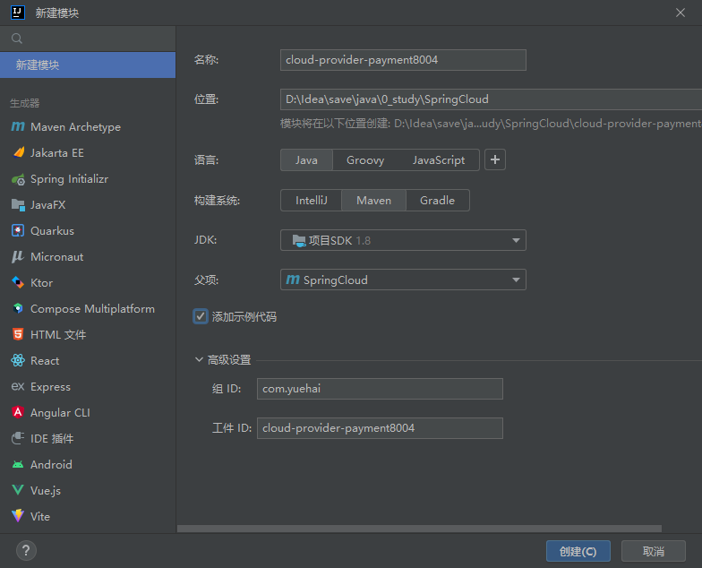

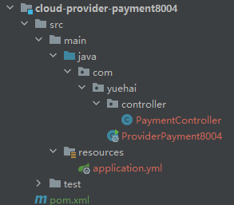

2. 修改 pom.xml，删除：`spring-cloud-starter-netflix-eureka-client`，新增：`spring-cloud-starter-zookeeper-discovery`，另数据操作的包暂时不需要

```xml
<?xml version="1.0" encoding="UTF-8"?>
<project xmlns="http://maven.apache.org/POM/4.0.0"
         xmlns:xsi="http://www.w3.org/2001/XMLSchema-instance"
         xsi:schemaLocation="http://maven.apache.org/POM/4.0.0 http://maven.apache.org/xsd/maven-4.0.0.xsd">
    <modelVersion>4.0.0</modelVersion>
    <!-- 父项目 -->
    <parent>
        <groupId>com.yuehai</groupId>
        <artifactId>SpringCloud</artifactId>
        <version>1.0-SNAPSHOT</version>
    </parent>
    
    <artifactId>cloud-provider-payment8004</artifactId>
    
    <dependencies>
        <!-- 引入自己定义的 api 通用包，可以使用 Payment 支付 Entity -->
        <dependency>
            <groupId>com.yuehai</groupId>
            <artifactId>cloud-api-commons</artifactId>
            <version>1.0-SNAPSHOT</version>
        </dependency>
    
        <!-- SpringBoot整合zookeeper客户端 -->
        <dependency>
            <groupId>org.springframework.cloud</groupId>
            <artifactId>spring-cloud-starter-zookeeper-discovery</artifactId>
        </dependency>

    </dependencies>

</project>
```

3. 修改 application.yml 配置文件，新增属性：`spring.cloud.zookeeper`

```yaml
# 服务端口号
server:
    port: 8004

# spring 配置
spring:
    application:
        # 服务名称 微服务提供者支付模块 cloud-provider-payment8004
        name: cloud-payment-service
    cloud:
        # 指定 zookeeper 服务端的注册地址
        zookeeper:
            # 集群 zookeeper 间使用 , 分隔
            connect-string: 43.138.106.181:7777
```

4. 修改主启动类，新增注解：`@EnableDiscoveryClient`，用于向使用 consul 或者 zookeeper 作为注册中心时注册服务

```java
package com.yuehai;

import org.springframework.boot.SpringApplication;
import org.springframework.boot.autoconfigure.SpringBootApplication;
import org.springframework.cloud.client.discovery.EnableDiscoveryClient;

/**
 * 微服务提供者支付模块 cloud-provider-payment8004
 * @author 月海
 * @create ${DATE} ${TIME}
 *
 * @EnableDiscoveryClient：该注解用于向使用 consul 或者 zookeeper 作为注册中心时注册服务
 */
@SpringBootApplication
@EnableDiscoveryClient
public class ProviderPayment8004 {

    public static void main(String[] args) {
        SpringApplication.run(ProviderPayment8004.class, args);
    }

}

```

5. 编写业务类 controller

```java
package com.yuehai.controller;

import com.yuehai.utils.JsonResult;
import org.springframework.beans.factory.annotation.Value;
import org.springframework.web.bind.annotation.*;

import java.util.UUID;

/**
 * @author 月海
 * @create 2023/2/20 14:35
 */

@RestController
@RequestMapping("/test")
public class PaymentController {

    @Value("${server.port}")
    private String serverPort;

    /**
     * 测试 get，查询全部
     */
    @GetMapping("/getTest")
    public JsonResult getTest(){
        return JsonResult.success("OK SpringCloud with zookeeper").put("服务端口为：", serverPort).put("生成随机数：", UUID.randomUUID().toString());
    }

}

```

6. 访问测试：[http://localhost:8004/test/getTest](http://localhost:8004/test/getTest)

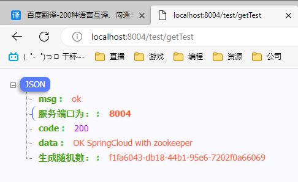

7. 查看 zookeeper：
8. 进入容器：

```bash
docker@VM-8-15-ubuntu:~$ docker ps
CONTAINER ID   IMAGE                         COMMAND                  CREATED          STATUS          PORTS                                                                     NAMES
e04b697ebd06   zookeeper:3.6                 "/docker-entrypoint.…"   14 minutes ago   Up 14 minutes   2888/tcp, 3888/tcp, 8080/tcp, 0.0.0.0:7777->2181/tcp, :::7777->2181/tcp   zookeeper
890052e7a032   mysql:5.7                     "docker-entrypoint.s…"   7 days ago       Up 7 days       0.0.0.0:3306->3306/tcp, :::3306->3306/tcp, 33060/tcp                      sharp_kare
d2cca7634535   docker-compose_nginx          "/docker-entrypoint.…"   2 weeks ago      Up 13 days      0.0.0.0:80->80/tcp, :::80->80/tcp                                         nginx
7ed99735286d   docker-compose_java-service   "java -jar /applicat…"   2 weeks ago      Up 13 days      0.0.0.0:9000->9000/tcp, :::9000->9000/tcp                                 java-service
9c710fd9a47a   portainer/portainer:1.20.2    "/portainer"             2 weeks ago      Up 2 weeks      0.0.0.0:9443->9000/tcp, :::9443->9000/tcp                                 naughty_kowalevski

docker@VM-8-15-ubuntu:~$ docker exec -it e04b697ebd06 bash

root@e04b697ebd06:/apache-zookeeper-3.6.3-bin#
```

9. 进入 zookeeper 命令行界面 Cli

```bash
oot@e04b697ebd06:/apache-zookeeper-3.6.3-bin# pwd
/apache-zookeeper-3.6.3-bin
root@e04b697ebd06:/apache-zookeeper-3.6.3-bin# ls -l
total 40
-rw-r--r-- 1 zookeeper zookeeper 11358 Apr  9  2021 LICENSE.txt
-rw-r--r-- 1 zookeeper zookeeper   432 Apr  9  2021 NOTICE.txt
-rw-r--r-- 1 zookeeper zookeeper  1963 Apr  9  2021 README.md
-rw-r--r-- 1 zookeeper zookeeper  3166 Apr  9  2021 README_packaging.md
drwxr-xr-x 2 zookeeper zookeeper  4096 Apr  9  2021 bin
drwxr-xr-x 2 zookeeper zookeeper  4096 Dec 23  2021 conf
drwxr-xr-x 5 zookeeper zookeeper  4096 Apr  9  2021 docs
drwxr-xr-x 2 zookeeper zookeeper  4096 Dec 23  2021 lib
root@e04b697ebd06:/apache-zookeeper-3.6.3-bin# cd bin
root@e04b697ebd06:/apache-zookeeper-3.6.3-bin/bin# ls -l
total 64
-rwxr-xr-x 1 zookeeper zookeeper   232 Apr  9  2021 README.txt
-rwxr-xr-x 1 zookeeper zookeeper  2066 Apr  9  2021 zkCleanup.sh
-rwxr-xr-x 1 zookeeper zookeeper  1158 Apr  9  2021 zkCli.cmd
-rwxr-xr-x 1 zookeeper zookeeper  1620 Apr  9  2021 zkCli.sh
-rwxr-xr-x 1 zookeeper zookeeper  1843 Apr  9  2021 zkEnv.cmd
-rwxr-xr-x 1 zookeeper zookeeper  3690 Apr  9  2021 zkEnv.sh
-rwxr-xr-x 1 zookeeper zookeeper  4559 Apr  9  2021 zkServer-initialize.sh
-rwxr-xr-x 1 zookeeper zookeeper  1286 Apr  9  2021 zkServer.cmd
-rwxr-xr-x 1 zookeeper zookeeper 11332 Apr  9  2021 zkServer.sh
-rwxr-xr-x 1 zookeeper zookeeper   988 Apr  9  2021 zkSnapShotToolkit.cmd
-rwxr-xr-x 1 zookeeper zookeeper  1377 Apr  9  2021 zkSnapShotToolkit.sh
-rwxr-xr-x 1 zookeeper zookeeper   996 Apr  9  2021 zkTxnLogToolkit.cmd
-rwxr-xr-x 1 zookeeper zookeeper  1385 Apr  9  2021 zkTxnLogToolkit.sh
root@e04b697ebd06:/apache-zookeeper-3.6.3-bin/bin# ./zkCli.sh
Connecting to localhost:2181
2023-02-22 10:32:15,986 [myid:] - INFO  [main:Environment@98] - Client environment:zookeeper.version=3.6.3--6401e4ad2087061bc6b9f80dec2d69f2e3c8660a, built on 04/08/2021 16:35 GMT
2023-02-22 10:32:15,991 [myid:] - INFO  [main:Environment@98] - Client environment:host.name=e04b697ebd06
2023-02-22 10:32:15,992 [myid:] - INFO  [main:Environment@98] - Client environment:java.version=11.0.13
2023-02-22 10:32:16,007 [myid:] - INFO  [main:Environment@98] - Client environment:java.vendor=Oracle Corporation
2023-02-22 10:32:16,007 [myid:] - INFO  [main:Environment@98] - Client environment:java.home=/usr/local/openjdk-11
2023-02-22 10:32:16,008 [myid:] - INFO  [main:Environment@98] - Client environment:java.class.path=/apache-zookeeper-3.6.3-bin/bin/../zookeeper-server/target/classes:/apache-zookeeper-3.6.3-bin/bin/../build/classes:/apache-zookeeper-3.6.3-bin/bin/../zookeeper-server/target/lib/*.jar:/apache-zookeeper-3.6.3-bin/bin/../build/lib/*.jar:/apache-zookeeper-3.6.3-bin/bin/../lib/zookeeper-prometheus-metrics-3.6.3.jar:/apache-zookeeper-3.6.3-bin/bin/../lib/zookeeper-jute-3.6.3.jar:/apache-zookeeper-3.6.3-bin/bin/../lib/zookeeper-3.6.3.jar:/apache-zookeeper-3.6.3-bin/bin/../lib/snappy-java-1.1.7.jar:/apache-zookeeper-3.6.3-bin/bin/../lib/slf4j-log4j12-1.7.25.jar:/apache-zookeeper-3.6.3-bin/bin/../lib/slf4j-api-1.7.25.jar:/apache-zookeeper-3.6.3-bin/bin/../lib/simpleclient_servlet-0.6.0.jar:/apache-zookeeper-3.6.3-bin/bin/../lib/simpleclient_hotspot-0.6.0.jar:/apache-zookeeper-3.6.3-bin/bin/../lib/simpleclient_common-0.6.0.jar:/apache-zookeeper-3.6.3-bin/bin/../lib/simpleclient-0.6.0.jar:/apache-zookeeper-3.6.3-bin/bin/../lib/netty-transport-native-unix-common-4.1.63.Final.jar:/apache-zookeeper-3.6.3-bin/bin/../lib/netty-transport-native-epoll-4.1.63.Final.jar:/apache-zookeeper-3.6.3-bin/bin/../lib/netty-transport-4.1.63.Final.jar:/apache-zookeeper-3.6.3-bin/bin/../lib/netty-resolver-4.1.63.Final.jar:/apache-zookeeper-3.6.3-bin/bin/../lib/netty-handler-4.1.63.Final.jar:/apache-zookeeper-3.6.3-bin/bin/../lib/netty-common-4.1.63.Final.jar:/apache-zookeeper-3.6.3-bin/bin/../lib/netty-codec-4.1.63.Final.jar:/apache-zookeeper-3.6.3-bin/bin/../lib/netty-buffer-4.1.63.Final.jar:/apache-zookeeper-3.6.3-bin/bin/../lib/metrics-core-3.2.5.jar:/apache-zookeeper-3.6.3-bin/bin/../lib/log4j-1.2.17.jar:/apache-zookeeper-3.6.3-bin/bin/../lib/json-simple-1.1.1.jar:/apache-zookeeper-3.6.3-bin/bin/../lib/jline-2.14.6.jar:/apache-zookeeper-3.6.3-bin/bin/../lib/jetty-util-ajax-9.4.39.v20210325.jar:/apache-zookeeper-3.6.3-bin/bin/../lib/jetty-util-9.4.39.v20210325.jar:/apache-zookeeper-3.6.3-bin/bin/../lib/jetty-servlet-9.4.39.v20210325.jar:/apache-zookeeper-3.6.3-bin/bin/../lib/jetty-server-9.4.39.v20210325.jar:/apache-zookeeper-3.6.3-bin/bin/../lib/jetty-security-9.4.39.v20210325.jar:/apache-zookeeper-3.6.3-bin/bin/../lib/jetty-io-9.4.39.v20210325.jar:/apache-zookeeper-3.6.3-bin/bin/../lib/jetty-http-9.4.39.v20210325.jar:/apache-zookeeper-3.6.3-bin/bin/../lib/javax.servlet-api-3.1.0.jar:/apache-zookeeper-3.6.3-bin/bin/../lib/jackson-databind-2.10.5.1.jar:/apache-zookeeper-3.6.3-bin/bin/../lib/jackson-core-2.10.5.jar:/apache-zookeeper-3.6.3-bin/bin/../lib/jackson-annotations-2.10.5.jar:/apache-zookeeper-3.6.3-bin/bin/../lib/commons-cli-1.2.jar:/apache-zookeeper-3.6.3-bin/bin/../lib/audience-annotations-0.5.0.jar:/apache-zookeeper-3.6.3-bin/bin/../zookeeper-*.jar:/apache-zookeeper-3.6.3-bin/bin/../zookeeper-server/src/main/resources/lib/*.jar:/conf:
2023-02-22 10:32:16,009 [myid:] - INFO  [main:Environment@98] - Client environment:java.library.path=/usr/java/packages/lib:/usr/lib64:/lib64:/lib:/usr/lib
2023-02-22 10:32:16,010 [myid:] - INFO  [main:Environment@98] - Client environment:java.io.tmpdir=/tmp
2023-02-22 10:32:16,010 [myid:] - INFO  [main:Environment@98] - Client environment:java.compiler=<NA>
2023-02-22 10:32:16,010 [myid:] - INFO  [main:Environment@98] - Client environment:os.name=Linux
2023-02-22 10:32:16,011 [myid:] - INFO  [main:Environment@98] - Client environment:os.arch=amd64
2023-02-22 10:32:16,011 [myid:] - INFO  [main:Environment@98] - Client environment:os.version=5.4.0-126-generic
2023-02-22 10:32:16,012 [myid:] - INFO  [main:Environment@98] - Client environment:user.name=root
2023-02-22 10:32:16,013 [myid:] - INFO  [main:Environment@98] - Client environment:user.home=/root
2023-02-22 10:32:16,013 [myid:] - INFO  [main:Environment@98] - Client environment:user.dir=/apache-zookeeper-3.6.3-bin/bin
2023-02-22 10:32:16,014 [myid:] - INFO  [main:Environment@98] - Client environment:os.memory.free=48MB
2023-02-22 10:32:16,018 [myid:] - INFO  [main:Environment@98] - Client environment:os.memory.max=256MB
2023-02-22 10:32:16,019 [myid:] - INFO  [main:Environment@98] - Client environment:os.memory.total=56MB
2023-02-22 10:32:16,023 [myid:] - INFO  [main:ZooKeeper@1006] - Initiating client connection, connectString=localhost:2181 sessionTimeout=30000 watcher=org.apache.zookeeper.ZooKeeperMain$MyWatcher@735b478
2023-02-22 10:32:16,028 [myid:] - INFO  [main:X509Util@77] - Setting -D jdk.tls.rejectClientInitiatedRenegotiation=true to disable client-initiated TLS renegotiation
2023-02-22 10:32:16,036 [myid:] - INFO  [main:ClientCnxnSocket@239] - jute.maxbuffer value is 1048575 Bytes
2023-02-22 10:32:16,044 [myid:] - INFO  [main:ClientCnxn@1736] - zookeeper.request.timeout value is 0. feature enabled=false
Welcome to ZooKeeper!
JLine support is enabled
2023-02-22 10:32:16,077 [myid:localhost:2181] - INFO  [main-SendThread(localhost:2181):ClientCnxn$SendThread@1181] - Opening socket connection to server localhost/127.0.0.1:2181.
2023-02-22 10:32:16,081 [myid:localhost:2181] - INFO  [main-SendThread(localhost:2181):ClientCnxn$SendThread@1183] - SASL config status: Will not attempt to authenticate using SASL (unknown error)
2023-02-22 10:32:16,108 [myid:localhost:2181] - INFO  [main-SendThread(localhost:2181):ClientCnxn$SendThread@1013] - Socket connection established, initiating session, client: /127.0.0.1:60482, server: localhost/127.0.0.1:2181
2023-02-22 10:32:16,125 [myid:localhost:2181] - INFO  [main-SendThread(localhost:2181):ClientCnxn$SendThread@1448] - Session establishment complete on server localhost/127.0.0.1:2181, session id = 0x1007b0e7d0a0004, negotiated timeout = 30000

WATCHER::

WatchedEvent state:SyncConnected type:None path:null

[zk: localhost:2181(CONNECTED) 0]
```

10. 查看节点、获得基本信息 json

```bash
[zk: localhost:2181(CONNECTED) 0] ls /services 
[cloud-payment-service]
[zk: localhost:2181(CONNECTED) 1] get /services 

[zk: localhost:2181(CONNECTED) 2] ls /
services    zookeeper   
[zk: localhost:2181(CONNECTED) 2] ls /services/cloud-payment-service
[356dc6a2-d686-4f92-be62-40de373b02de]
[zk: localhost:2181(CONNECTED) 3] ls /services/cloud-payment-service/356dc6a2-d686-4f92-be62-40de373b02de 
[]
[zk: localhost:2181(CONNECTED) 4] get /services/cloud-payment-service/356dc6a2-d686-4f92-be62-40de373b02de 
{"name":"cloud-payment-service","id":"356dc6a2-d686-4f92-be62-40de373b02de","address":"host.docker.internal","port":8004,"sslPort":null,"payload":{"@class":"org.springframework.cloud.zookeeper.discovery.ZookeeperInstance","id":"application-1","name":"cloud-payment-service","metadata":{}},"registrationTimeUTC":1677032412134,"serviceType":"DYNAMIC","uriSpec":{"parts":[{"value":"scheme","variable":true},{"value":"://","variable":false},{"value":"address","variable":true},{"value":":","variable":false},{"value":"port","variable":true}]}}
[zk: localhost:2181(CONNECTED) 5] 
[zk: localhost:2181(CONNECTED) 5] 
[zk: localhost:2181(CONNECTED) 5] 
```

11. json 格式化：

```json
{
    "name": "cloud-payment-service",
    "id": "356dc6a2-d686-4f92-be62-40de373b02de",
    "address": "host.docker.internal",
    "port": 8004,
    "sslPort": null,
    "payload": {
        "@class": "org.springframework.cloud.zookeeper.discovery.ZookeeperInstance",
        "id": "application-1",
        "name": "cloud-payment-service",
        "metadata": {}
    },
    "registrationTimeUTC": 1677032412134,
    "serviceType": "DYNAMIC",
    "uriSpec": {
        "parts": [
            {
                "value": "scheme",
                "variable": true
            },
            {
                "value": "://",
                "variable": false
            },
            {
                "value": "address",
                "variable": true
            },
            {
                "value": ":",
                "variable": false
            },
            {
                "value": "port",
                "variable": true
            }
        ]
    }
}
```

### ④、服务消费者 cloud-consumerzk-order80

1. 新建模块 cloud-consumerzk-order80

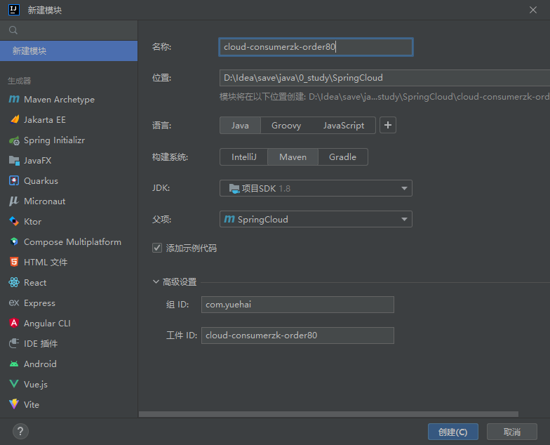


2. 修改 pom.xml

```xml
<?xml version="1.0" encoding="UTF-8"?>
<project xmlns="http://maven.apache.org/POM/4.0.0"
         xmlns:xsi="http://www.w3.org/2001/XMLSchema-instance"
         xsi:schemaLocation="http://maven.apache.org/POM/4.0.0 http://maven.apache.org/xsd/maven-4.0.0.xsd">
    <modelVersion>4.0.0</modelVersion>
    <parent>
        <groupId>com.yuehai</groupId>
        <artifactId>SpringCloud</artifactId>
        <version>1.0-SNAPSHOT</version>
    </parent>
    
    <artifactId>cloud-consumerzk-order80</artifactId>
    
    <dependencies>
        <!-- 引入自己定义的 api 通用包，可以使用 Payment 支付 Entity -->
        <dependency>
            <groupId>com.yuehai</groupId>
            <artifactId>cloud-api-commons</artifactId>
            <version>1.0-SNAPSHOT</version>
        </dependency>
    
        <!-- SpringBoot 整合 zookeeper 客户端 -->
        <dependency>
            <groupId>org.springframework.cloud</groupId>
            <artifactId>spring-cloud-starter-zookeeper-discovery</artifactId>
        </dependency>
    </dependencies>

</project>
```

3. 修改 application.yml 配置文件

```yaml
# 服务端口号
server:
    port: 80

# spring 配置
spring:
    application:
        # 服务名称  微服务消费者订单模块 cloud-consumerzk-order80
        name: cloud-consumer-order
    cloud:
        # 指定 zookeeper 服务端的注册地址
        zookeeper:
            # 集群 zookeeper 间使用 , 分隔
            connect-string: 43.138.106.181:7777
```

4. 修改主启动类

```java
package com.yuehai;

import org.springframework.boot.SpringApplication;
import org.springframework.boot.autoconfigure.SpringBootApplication;
import org.springframework.cloud.client.discovery.EnableDiscoveryClient;

/**
 * 微服务消费者订单模块 cloud-consumzk-order80
 * @author 月海
 * @create ${DATE} ${TIME}
 *
 * @EnableDiscoveryClient：该注解用于向使用 consul 或者 zookeeper 作为注册中心时注册服务
 */

@SpringBootApplication
@EnableDiscoveryClient
public class ConsumzkOrder80 {
    public static void main(String[] args) {
        SpringApplication.run(ConsumzkOrder80.class, args);
    }

}
```

5. 复制之前模块 cloud-consumer-order80 的配置类

```java
package com.yuehai.config;

import org.springframework.cloud.client.loadbalancer.LoadBalanced;
import org.springframework.context.annotation.Bean;
import org.springframework.context.annotation.Configuration;
import org.springframework.web.client.RestTemplate;

/**
 * @author 月海
 * @create 2023/2/21 8:48
 */

@Configuration
public class ApplicationContextConfig {

    @Bean
    /**
     * 使用 @LoadBalanced 注解赋予 RestTemplate 负载均衡的能力
     */
    @LoadBalanced
    public RestTemplate restTemplate(){
        return new RestTemplate();
    }

}

```

6. 编写业务类 controller

```java
package com.yuehai.controller;

import com.yuehai.utils.JsonResult;
import org.springframework.web.bind.annotation.GetMapping;
import org.springframework.web.bind.annotation.RestController;
import org.springframework.web.client.RestTemplate;

import javax.annotation.Resource;
import java.util.HashMap;

/**
 * @author 月海
 * @create 2023/2/21 8:40
 */

@RestController
public class OrderController {

    /**
     * 调用微服务中名为 CLOUD-PAYMENT-SERVICE 的服务
     */
    public static final String PAYMENT_SRV_URL = "http://cloud-payment-service";

    @Resource
    private RestTemplate restTemplate;

    /**
     * 客户端用浏览器是 get 请求，底层实质也是发送 get 调用服务端 8001
     */
    @GetMapping("/getOrder/payment/get")
    public JsonResult getOrder(){
        /**
         * 使用 restTemplate 访问 restful get 接口：
         *      url, responseType, uriVariables) 这三个参数分别代表：
         *      请求地址、HTTP 响应转换被转换成的对象类型、url占位参数
         */
        return JsonResult.success(restTemplate.getForObject(PAYMENT_SRV_URL + "/test/getTest", HashMap.class));
    }


}
```

7. 访问测试：[http://localhost/getOrder/payment/get](http://localhost/getOrder/payment/get)


## 3、Consul

### ①、Consul 简介

#### Ⅰ、是什么

> [https://www.consul.io/intro/index.html](https://www.consul.io/intro/index.html)

1. Consul 是一套开源的分布式服务发现和配置管理系统，由 HashiCorp 公司用 Go 语言开发。
2. 提供了微服务系统中的服务治理、配置中心、控制总线等功能。
3. 这些功能中的每一个都可以根据需要单独使用，也可以一起使用以构建全方位的服务网格，总之 Consul 提供了一种完整的服务网格解决方案。
4. 它具有很多优点。包括： 
   1. 基于 raft 协议，比较简洁；
   2. 支持健康检查
   3. 支持 HTTP 和 DNS 协议
   4. 支持跨数据中心的 WAN 集群
   5. 提供图形界面
   6. 跨平台，支持 Linux、Mac、Windows

#### Ⅱ、能干嘛

1. 服务发现
2. 健康监测
3. KV 存储
4. 多数据中心
5. 可视化 Web 界面


#### Ⅲ、去哪下

> [https://www.consul.io/downloads.html](https://www.consul.io/downloads.html)

#### Ⅳ、怎么玩

> [https://www.springcloud.cc/spring-cloud-consul.html](https://www.springcloud.cc/spring-cloud-consul.html)

### ②、

## 4、三个注册中心异同点

### ①、CAP 是什么

1. C：Consistency（强一致性）
2. A：Availability（可用性）
3. P：Partition tolerance（分区容错性）
4. CAP 理论关注粒度是数据，而不是整体系统设计的策略

### ②、经典 CAP 图

1. 最多只能同时较好的满足两个。
2.  CAP 理论的核心是：一个分布式系统不可能同时很好的满足一致性，可用性和分区容错性这三个需求，因此，根据 CAP 原理将 NoSQL 数据库分成了三大类：
   1. 满足 CA 原则：单点集群，满足一致性，可用性的系统，通常在可扩展性上不太强大。
   2. 满足 CP 原则：满足一致性，分区容错性的系统，通常性能不是特别高。
   3. 满足 AP 原则：满足可用性，分区容错性的系统，通常可能对一致性要求低一些。


### ③、AP 架构：Eureka

1. 当网络分区出现后，为了保证可用性，系统 B 可以返回旧值，保证系统的可用性。
2. 结论：违背了一致性C的要求，只满足可用性和分区容错，即AP


### ④、CP 架构：Zookeeper/Consul

1. 当网络分区出现后，为了保证一致性，就必须拒接请求，否则无法保证一致性
2. 结论：违背了可用性 A 的要求，只满足一致性和分区容错，即 CP


# 四、负载均衡服务调用 Ribbon

> 官网：[https://github.com/Netflix/ribbon/wiki/Getting-Started](https://github.com/Netflix/ribbon/wiki/Getting-Started)
> Ribbon 目前也进入维护模式，未来替换方案：LoadBalancer

## 1、Ribbon

### ①、简介

#### Ⅰ、Ribbon 是什么

1. Spring Cloud Ribbon 是基于 Netflix Ribbon 实现的一套客户端负载均衡的工具。
2. 简单的说，Ribbon 是 Netflix 发布的开源项目，主要功能是提供客户端的软件负载均衡算法和服务调用。Ribbon 客户端组件提供一系列完善的配置项如连接超时，重试等。
3. 简单的说，就是在配置文件中列出 Load Balancer（简称LB）后面所有的机器，Ribbon 会自动的帮助你基于某种规则（如简单轮询，随机连接等）去连接这些机器。
4. 我们很容易使用 Ribbon 实现自定义的负载均衡算法。

#### Ⅱ、能干嘛

> 负载均衡 + RestTemplate 调用

##### （1）、LB（负载均衡）

1. LB负载均衡(Load Balance)是什么：简单的说就是将用户的请求平摊的分配到多个服务上，从而达到系统的 HA（高可用）。常见的负载均衡有软件 Nginx，LVS，硬件 F5 等。
2. Ribbon 本地负载均衡客户端 VS Nginx 服务端负载均衡区别：
   1. Nginx 是服务器负载均衡，客户端所有请求都会交给 nginx，然后由 nginx 实现转发请求。即负载均衡是由服务端实现的。
   2. Ribbon 本地负载均衡，在调用微服务接口时候，会在注册中心上获取注册信息服务列表之后缓存到 JVM 本地，从而在本地实现 RPC 远程服务调用技术。
3. 集中式 LB：即在服务的消费方和提供方之间使用独立的 LB 设施(可以是硬件，如 F5, 也可以是软件，如 nginx)，由该设施负责把访问请求通过某种策略转发至服务的提供方；
4. 进程内 LB：将 LB 逻辑集成到消费方，消费方从服务注册中心获知有哪些地址可用，然后自己再从这些地址中选择出一个合适的服务器。
5. Ribbon 就属于进程内 LB，它只是一个类库，集成于消费方进程，消费方通过它来获取到服务提供方的地址。

##### （2）、轮询负载访问

1. 轮询算法是最简单的一种负载均衡算法。它的原理是把来自用户的请求轮流分配给内部的服务器：从服务器 1 开始，直到服务器 N，然后重新开始循环。
2. 算法的优点是其简洁性，它无需记录当前所有连接的状态，所以它是一种无状态调度。

### ②、Ribbon 负载均衡演示

#### Ⅰ、架构说明

1. Ribbon 在工作时分成两步：
2. 第一步先选择 EurekaServer，它优先选择在同一个区域内负载较少的 server
3. 第二步再根据用户指定的策略，在从 server 取到的服务注册列表中选择一个地址。
4. 其中 Ribbon 提供了多种策略：比如轮询、随机和根据响应时间加权。
5. 总结：Ribbon 其实就是一个软负载均衡的客户端组件， 他可以和其他所需请求的客户端结合使用，和 eureka 结合只是其中的一个实例。


#### Ⅱ、为什么之前并没有引入 Ribbon 依赖也可以使用负载均衡

- 原因：`spring-cloud-starter-netflix-eureka-client` 自带了 `spring-cloud-starter-ribbon` 引用

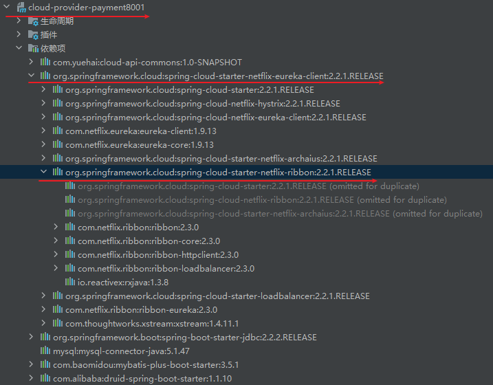

#### Ⅲ、二说 RestTemplate 的使用

##### （1）、官网

> [https://docs.spring.io/spring-framework/docs/5.2.2.RELEASE/javadoc-api/org/springframework/web/client/RestTemplate.html](https://docs.spring.io/spring-framework/docs/5.2.2.RELEASE/javadoc-api/org/springframework/web/client/RestTemplate.html)


##### （2）、`getForObjec`、`getForEntity` 方法 

1. `getForObjec`：返回对象为响应体中数据转化成的对象，基本上可以理解为Json

```java
/**
 * 客户端用浏览器是 get 请求，底层实质也是发送 get 调用服务端 8001
 */
@GetMapping("/getOrder/payment/getForObject")
public JsonResult getForObject(){
    /**
     * 使用 restTemplate 访问 restful get 接口：
     *      url, responseType, uriVariables) 这三个参数分别代表：
     *      请求地址、HTTP 响应转换被转换成的对象类型、url占位参数
     */
    return JsonResult.success(restTemplate.getForObject(PAYMENT_SRV_URL + "/test/getTest", HashMap.class));
}
```
```json
{
    "msg": "ok",
    "data": {
        "msg": "ok",
        "code": 200,
        "data": [
            {
                "id": 1,
                "serial": "月海"
            },
            {
                "id": 2,
                "serial": "言"
            },
            {
                "id": 1627853700842143746,
                "serial": "2"
            }
        ],
        "服务端口为：": "8002"
    },
    "code": 200
}
```

2. `getForEntity`：返回对象为 ResponseEntity 对象，包含了响应中的一些详细的重要信息，比如响应头、响应状态码、响应体等

```java
/**
 * 客户端用浏览器是 get 请求，底层实质也是发送 get 调用服务端 8001
 */
@GetMapping("/getOrder/payment/getForEntity")
public JsonResult getForEntity(){
    /**
     * 使用 restTemplate 访问 restful get 接口：
     *      url, responseType, uriVariables) 这三个参数分别代表：
     *      请求地址、HTTP 响应转换被转换成的对象类型、url占位参数
     */
    return JsonResult.success(restTemplate.getForEntity(PAYMENT_SRV_URL + "/test/getTest", HashMap.class));
}
```
```json
{
    "msg": "ok",
    "data": {
        "headers": {
            "Content-Type": [
                "application/json"
            ],
            "Transfer-Encoding": [
                "chunked"
            ],
            "Date": [
                "Wed, 22 Feb 2023 07:11:04 GMT"
            ],
            "Keep-Alive": [
                "timeout=60"
            ],
            "Connection": [
                "keep-alive"
            ]
        },
        "body": {
            "msg": "ok",
            "code": 200,
            "data": [
                {
                    "id": 1,
                    "serial": "月海"
                },
                {
                    "id": 2,
                    "serial": "言"
                },
                {
                    "id": 1627853700842143746,
                    "serial": "2"
                }
            ],
            "服务端口为：": "8001"
        },
        "statusCodeValue": 200,
        "statusCode": "OK"
    },
    "code": 200
}
```

##### （3）、`postForObject`、`postForEntity` 方法

1. `postForObject`：与 `getForObjec` 类似，返回对象为响应体中数据转化成的对象，基本上可以理解为Json

```java
/**
 * 客户端用浏览器是 get 请求，但是底层实质发送 post 调用服务端8001
 */
@GetMapping("/postOrder/payment/postForObject")
public JsonResult postForObject(String serial){
    /**
     * 使用 restTemplate 访问 restful post 接口：
     *      url , request, responseType, uriVariables) 这四个参数分别代表：
     *      请求地址、请求参数（放到请求体中）、HTTP 响应转换被转换成的对象类型、url占位参数
     */
    return JsonResult.success(restTemplate.postForObject(PAYMENT_SRV_URL + "/test/postTest", serial, HashMap.class));
}
```
```json
{
    "msg": "ok",
    "data": {
        "msg": "ok",
        "code": 200,
        "data": 1,
        "服务端口为：": "8002"
    },
    "code": 200
}
```

2. `postForEntity`：与 `postForEntity` 类似，返回对象为 ResponseEntity 对象，包含了响应中的一些详细的重要信息，比如响应头、响应状态码、响应体等

```java
/**
 * 客户端用浏览器是 get 请求，但是底层实质发送 post 调用服务端8001
 */
@GetMapping("/postOrder/payment/postForEntity")
public JsonResult postForEntity(String serial){
    /**
     * 使用 restTemplate 访问 restful post 接口：
     *      url , request, responseType, uriVariables) 这四个参数分别代表：
     *      请求地址、请求参数（放到请求体中）、HTTP 响应转换被转换成的对象类型、url占位参数
     */
    return JsonResult.success(restTemplate.postForEntity(PAYMENT_SRV_URL + "/test/postTest", serial, HashMap.class));
}
```
```json
{
    "msg": "ok",
    "data": {
        "headers": {
            "Content-Type": [
                "application/json"
            ],
            "Transfer-Encoding": [
                "chunked"
            ],
            "Date": [
                "Wed, 22 Feb 2023 07:21:07 GMT"
            ],
            "Keep-Alive": [
                "timeout=60"
            ],
            "Connection": [
                "keep-alive"
            ]
        },
        "body": {
            "msg": "ok",
            "code": 200,
            "data": 1,
            "服务端口为：": "8001"
        },
        "statusCodeValue": 200,
        "statusCode": "OK"
    },
    "code": 200
}
```

### ③、Ribbon 核心组件 IRule

> IRule：根据特定算法中从服务列表中选取一个要访问的服务

#### Ⅰ、IRule 具体算法

1. `com.netflix.loadbalancer.RoundRobinRule`：轮询
2. `com.netflix.loadbalancer.RandomRule`：随机
3. `com.netflix.loadbalancer.RetryRule`：先按照 RoundRobinRule 的策略获取服务，如果获取服务失败则在指定时间内会进行重试，获取可用的服务
4. `WeightedResponseTimeRule`：对 RoundRobinRule 的扩展，响应速度越快的实例选择权重越大，越容易被选择
5. `BestAvailableRule`：会先过滤掉由于多次访问故障而处于断路器跳闸状态的服务，然后选择一个并发量最小的服务
6. `AvailabilityFilteringRule`：先过滤掉故障实例，再选择并发较小的实例
7. `ZoneAvoidanceRule`：默认规则，复合判断 server 所在区域的性能和 server 的可用性选择服务器

#### Ⅱ、如何替换算法

> 修改 cloud-consumer-order80

##### （1）、注意配置细节

官方文档明确给出了警告：这个自定义配置类不能放在 `@ComponentScan` 所扫描的当前包下以及子包下，否则我们自定义的这个配置类就会被所有的 Ribbon 客户端所共享，达不到特殊化定制的目的了。


##### （2）、创建新包与配置类

1. 创建新包与配置类

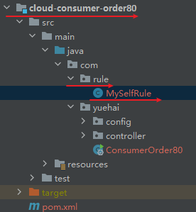


2. 编写配置类

```java
package com.rule;

import com.netflix.loadbalancer.IRule;
import com.netflix.loadbalancer.RandomRule;
import org.springframework.context.annotation.Bean;
import org.springframework.context.annotation.Configuration;

/**
 * @author 月海
 * @create 2023/2/22 15:54
 *
 * 修改 IRule 算法
 */
@Configuration
public class MySelfRule {
    @Bean
    public IRule myRule(){
        // 定义为使用随机算法
        return new RandomRule();
    }
}

```

3. 主启动类添加 `@RibbonClient`

```java
package com.yuehai;

import com.rule.MySelfRule;
import org.springframework.boot.SpringApplication;
import org.springframework.boot.autoconfigure.SpringBootApplication;
import org.springframework.cloud.netflix.eureka.EnableEurekaClient;
import org.springframework.cloud.netflix.ribbon.RibbonClient;

/**
 * 微服务消费者订单模块 cloud-consumer-order80
 * @author 月海
 * @create ${DATE} ${TIME}
 *
 * @EnableEurekaClient：作为微服务的服务提供者
 * @RibbonClient：修改 IRule 算法；参数 1：指定要修改的服务提供者，参数 2：指定修改配置类
 */
@SpringBootApplication
@EnableEurekaClient
@RibbonClient(name = "cloud-payment-service", configuration = MySelfRule.class)
public class ConsumerOrder80 {
    public static void main(String[] args) {
        SpringApplication.run(ConsumerOrder80.class, args);
    }

}
```

4. 启动 7001、80、8001、8002


5. 测试，发现  8001 和 8002 是随机出现，不再是交替出现

### ④、Ribbon 负载均衡算法原理

1. 轮询负载均衡算法：rest 接口第几次请求数 % 服务器集群总数量 = 实际调用服务器位置下标，每次服务重启动后 rest 接口计数从 1 开始。

```java
// 获取全部的集群服务
List<ServiceInstance> instances = discoveryClient.getInstances("CLOUD-PAYMENT-SERVICE");

// 如：
List [0] instances = 127.0.0.1:8002
List [1] instances = 127.0.0.1:8001
```

2. 8001+ 8002 组合成为集群，它们共计 2 台机器，集群总数为 2， 按照轮询算法原理：
   1. 当总请求数为 1 时： 1 % 2 =1 对应下标位置为1 ，则获得服务地址为 127.0.0.1:8001
   2. 当总请求数位 2 时： 2 % 2 =0 对应下标位置为0 ，则获得服务地址为 127.0.0.1:8002
   3. 当总请求数位 3 时： 3 % 2 =1 对应下标位置为1 ，则获得服务地址为 127.0.0.1:8001
   4. 当总请求数位 4 时： 4 % 2 =0 对应下标位置为0 ，则获得服务地址为 127.0.0.1:8002
   5. 如此类推......

# 五、服务接口调用 OpenFeign

## 1、OpenFeign

### ①、简介

#### Ⅰ、OpenFeign 是什么

> 官网解释：[https://cloud.spring.io/spring-cloud-static/Hoxton.SR1/reference/htmlsingle/#spring-cloud-openfeign](https://cloud.spring.io/spring-cloud-static/Hoxton.SR1/reference/htmlsingle/#spring-cloud-openfeign)
> GitHub：[https://github.com/spring-cloud/spring-cloud-openfeign](https://github.com/spring-cloud/spring-cloud-openfeign)

1. Feign 是一个声明式 WebService 客户端。使用 Feign 能让编写 Web Service 客户端更加简单。
2. 它的使用方法是定义一个服务接口然后在上面添加注解。
3. Feign 也支持可拔插式的编码器和解码器。Spring Cloud 对 Feign 进行了封装，使其支持了 Spring MVC 标准注解和 HttpMessageConverters。
4. Feign 可以与 Eureka 和 Ribbon 组合使用以支持负载均衡

#### Ⅱ、能干嘛

1.  Feign 旨在使编写 Java Http 客户端变得更容易。
2. 前面在使用 Ribbon + RestTemplate 时，利用 RestTemplate 对 http 请求的封装处理，形成了一套模版化的调用方法。
3. 但是在实际开发中，由于对服务依赖的调用可能不止一处，往往一个接口会被多处调用，所以通常都会针对每个微服务自行封装一些客户端类来包装这些依赖服务的调用。所以，Feign 在此基础上做了进一步封装，由他来帮助我们定义和实现依赖服务接口的定义。
4. 在 Feign 的实现下，我们只需创建一个接口并使用注解的方式来配置它(以前是 Dao 接口上面标注 Mapper 注解，现在是一个微服务接口上面标注一个 Feign 注解即可)，即可完成对服务提供方的接口绑定，简化了使用 Spring cloud Ribbon 时，自动封装服务调用客户端的开发量。
5. Feign 集成了 Ribbon：利用 Ribbon 维护了 Payment 的服务列表信息，并且通过轮询实现了客户端的负载均衡。而与 Ribbon 不同的是，通过 feign 只需要定义服务绑定接口且以声明式的方法，优雅而简单的实现了服务调用

#### Ⅲ、Feign 和 OpenFeign 两者区别

### ①、Feign

1. Feign 是 Spring Cloud 组件中的一个轻量级 RESTful 的 HTTP 服务客户端
2. Feign 内置了 Ribbon，用来做客户端负载均衡，去调用服务注册中心的服务。
3. Feign 的使用方式是：使用 Feign 的注解定义接口，调用这个接口，就可以调用服务注册中心的服务

 ```xml
<dependency>
    <groupId>org.springframework.cloud</groupId>
    <artifactId>spring-cloud-starter-feign</artifactId>
</dependency>
```

### ②、OpenFeign

1. OpenFeign 是 Spring Cloud 在 Feign 的基础上支持了 SpringMVC 的注解，如 @RequesMapping 等等。
2. penFeign 的 @FeignClient 可以解析 SpringMVC 的 @RequestMapping 注解下的接口，并通过动态代理的方式产生实现类，实现类中做负载均衡并调用其他服务。

 ```xml
<dependency>
    <groupId>org.springframework.cloud</groupId>
    <artifactId>spring-cloud-starter-openfeign</artifactId>
</dependency>
```

### ②、OpenFeign 使用步骤

1. 新建模块 cloud-consumer-feign-order80

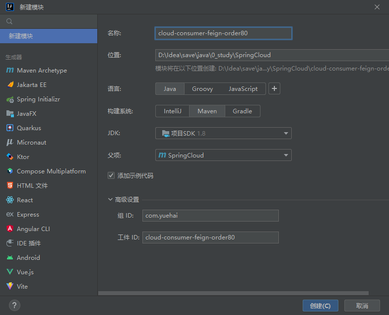

2. 修改 pom.xml，引入 openfeign 依赖：`spring-cloud-starter-openfeign`

```xml
<?xml version="1.0" encoding="UTF-8"?>
<project xmlns="http://maven.apache.org/POM/4.0.0"
         xmlns:xsi="http://www.w3.org/2001/XMLSchema-instance"
         xsi:schemaLocation="http://maven.apache.org/POM/4.0.0 http://maven.apache.org/xsd/maven-4.0.0.xsd">
    <modelVersion>4.0.0</modelVersion>
    <parent>
        <groupId>com.yuehai</groupId>
        <artifactId>SpringCloud</artifactId>
        <version>1.0-SNAPSHOT</version>
    </parent>
    
    <artifactId>cloud-consumer-feign-order80</artifactId>
    
    <dependencies>
        <!-- 引入自己定义的 api 通用包，可以使用 Payment 支付 Entity -->
        <dependency>
            <groupId>com.yuehai</groupId>
            <artifactId>cloud-api-commons</artifactId>
            <version>1.0-SNAPSHOT</version>
        </dependency>
    
        <!-- eureka-client 服务注册 -->
        <dependency>
            <groupId>org.springframework.cloud</groupId>
            <artifactId>spring-cloud-starter-netflix-eureka-client</artifactId>
        </dependency>
        <!--openfeign-->
        <dependency>
            <groupId>org.springframework.cloud</groupId>
            <artifactId>spring-cloud-starter-openfeign</artifactId>
        </dependency>
    </dependencies>

</project>
```

3. 修改 yml 配置文件

```yaml
# 服务端口号
server:
    port: 80

# spring 配置
spring:
    application:
        # 服务名称  微服务消费者订单模块 cloud-consumer-feign-order80
        name: cloud-consumer-feign-order

eureka:
    client:
        # 表示是否将自己注册进 EurekaServer 默认为 true。
        register-with-eureka: false
        # 指定 eureka 服务端的注册地址
        service-url:
            # 集群 eureka 间使用 , 分隔
            defaultZone: http://eureka7001.com:7001/eureka, http://eureka7002.com:7002/eureka
```

4. 修改主启动类

```java
package com.yuehai;

import org.springframework.boot.SpringApplication;
import org.springframework.boot.autoconfigure.SpringBootApplication;
import org.springframework.cloud.openfeign.EnableFeignClients;

/**
 * 微服务消费者订单模块 cloud-consumer-order80
 * @author 月海
 * @create ${DATE} ${TIME}
 *
 * @EnableFeignClients：告诉框架扫描所有使用注解 @FeignClient 定义的 feign 客户端，并把 feign 客户端注册到 IOC 容器中
 */
@SpringBootApplication
@EnableFeignClients
public class ConsumerFeignOrder80 {
    public static void main(String[] args) {
        SpringApplication.run(ConsumerFeignOrder80.class, args);
    }

}
```

5. 编写 service，添加 `@FeignClient(value = "cloud-payment-service")` 注解，表示调用 `cloud-payment-service` 服务，并在其中调用 `cloud-payment-service` 服务的接口

```java
package com.yuehai.service;

import com.yuehai.utils.JsonResult;
import org.springframework.cloud.openfeign.FeignClient;
import org.springframework.web.bind.annotation.GetMapping;

/**
 * @author 月海
 * @create 2023/2/23 10:49
 *
 * {@code @FeignClient：主要用于客户端服务发现，实际就是调用其他的服务}
 */

@FeignClient(value = "cloud-payment-service")
public interface PaymentFeignService {

    /**
     * 测试 get，查询全部；调用 cloud-payment-service 的接口
     */
    @GetMapping("/test/getTest")
    JsonResult getTest();

}

```

6. 编写业务类 controller，调用 service

```java
package com.yuehai.controller;

import com.yuehai.service.PaymentFeignService;
import com.yuehai.utils.JsonResult;
import org.springframework.web.bind.annotation.GetMapping;
import org.springframework.web.bind.annotation.RestController;

import javax.annotation.Resource;

/**
 * @author 月海
 * @create 2023/2/23 11:09
 */

@RestController
public class PaymentFeignController {

    @Resource
    private PaymentFeignService paymentFeignService;

    @GetMapping("/getTest")
    public JsonResult getTest(){
        return paymentFeignService.getTest();
    }

}

```

7. 启动集群，先启动 2 个 eureka 集群 7001/7002，再启动 2 个微服务 8001/8002，最后启动 OpenFeign

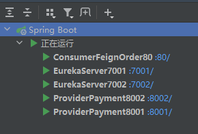

8. 测试：[http://localhost/getTest](http://localhost/getTest)

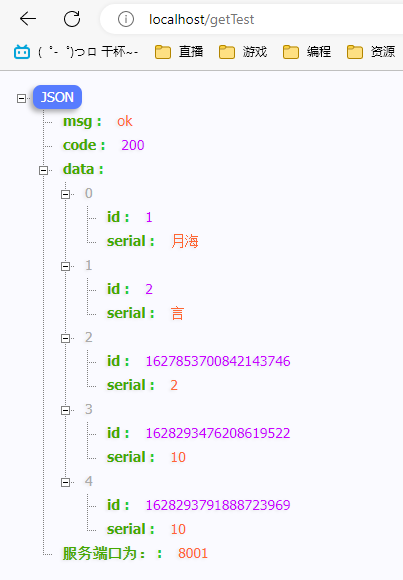

### ③、OpenFeign 超时控制

> OpenFeign 默认等待 1 秒钟，超过后报错 

#### Ⅰ、超时设置，故意设置超时演示出错情况

1. 服务提供方 8001 故意写暂停程序

```java
/**
 * 暂停 5 秒
 */
@GetMapping("/timeout5s")
public JsonResult timeout5s(){
    // 睡 5 秒
    try {
        System.out.println("开始睡，端口为：" + serverPort);
        TimeUnit.SECONDS.sleep(5);
    } catch (InterruptedException e) {
        throw new RuntimeException(e);
    }
    System.out.println("睡醒了");

    return JsonResult.success("睡醒了");
}
```

2. 服务消费方 80 添加超时方法

```java
package com.yuehai.service;

import com.yuehai.utils.JsonResult;
import org.springframework.cloud.openfeign.FeignClient;
import org.springframework.web.bind.annotation.GetMapping;

/**
 * @author 月海
 * @create 2023/2/23 10:49
 *
 * { @code @FeignClient：主要用于客户端服务发现，实际就是调用其他的服务 }
 * { @code @FeignClient(value = "cloud-payment-service")：调用 cloud-payment-service 的接口 }
 */

@FeignClient(value = "cloud-payment-service")
public interface PaymentFeignService {

    /**
     * 测试 get，查询全部
     */
    @GetMapping("/test/getTest")
    JsonResult getTest();

    /**
     * 暂停 5 秒
     */
    @GetMapping("/test/timeout5s")
    JsonResult timeout5s();

}

```

3. 服务消费方 80 添加超时方法

```java
package com.yuehai.controller;

import com.yuehai.service.PaymentFeignService;
import com.yuehai.utils.JsonResult;
import org.springframework.web.bind.annotation.GetMapping;
import org.springframework.web.bind.annotation.RestController;

import javax.annotation.Resource;

/**
 * @author 月海
 * @create 2023/2/23 11:09
 */

@RestController
public class PaymentFeignController {

    @Resource
    private PaymentFeignService paymentFeignService;

    @GetMapping("/getTest")
    public JsonResult getTest(){
        return paymentFeignService.getTest();
    }

    @GetMapping("/timeout5s")
    public JsonResult timeout5s(){
        return paymentFeignService.timeout5s();
    }

}

```

4. 停止 8002 端口，访问测试：[http://localhost/timeout5s](http://localhost/timeout5s)，报错

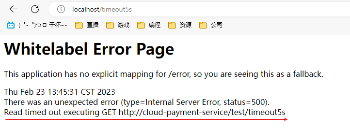

5. 查看 8001 端口输出，看到被正常调用了


#### Ⅱ、设置超时时间

1. 默认 Feign 客户端只等待一秒钟，但是服务端处理需要超过 1 秒钟，导致 Feign 客户端不想等待了，直接返回报错。
2. 为了避免这样的情况，有时候我们需要设置 Feign 客户端的超时控制。
3. OpenFeign 默认支持 Ribbon，所以修改 Ribbon 配置即可

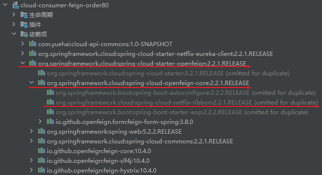

4. 修改 cloud-consumer-feign-order80 的 application.yml 配置文件

```yaml
# 服务端口号
server:
    port: 80

# spring 配置
spring:
    application:
        # 服务名称  微服务消费者订单模块 cloud-consumer-feign-order80
        name: cloud-consumer-feign-order

# eureka 配置
eureka:
    client:
        # 表示是否将自己注册进 EurekaServer 默认为 true。
        register-with-eureka: false
        # 指定 eureka 服务端的注册地址
        service-url:
            # 集群 eureka 间使用 , 分隔
            defaultZone: http://eureka7001.com:7001/eureka, http://eureka7002.com:7002/eureka

# ribbon 配置
feign:
    client:
        config:
            default:
                # 指的是建立连接所用的时间，适用于网络状况正常的情况下，两端连接所用的时间
                connect-timeout: 1000
                # 指的是建立连接后从服务器读取到可用资源所用的时间
                read-timeout: 10000

```

5. 测试：[http://localhost/timeout5s](http://localhost/timeout5s)

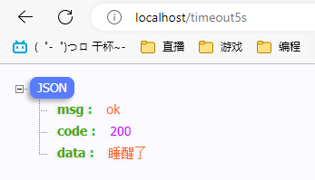

### ④、OpenFeign 日志打印功能

1. Feign 提供了日志打印功能，我们可以通过配置来调整日志级别，从而了解 Feign 中 Http 请求的细节。说白了就是对 Feign 接口的调用情况进行监控和输出
2. 日志级别：
   1. NONE：默认的，不显示任何日志；
   2. BASIC：仅记录请求方法、URL、响应状态码及执行时间；
   3. HEADERS：除了 BASIC 中定义的信息之外，还有请求和响应的头信息；
   4. FULL：除了 HEADERS 中定义的信息之外，还有请求和响应的正文及元数据。
3. 创建 config 包，编写 FeignConfig 类：

```java
package com.yuehai.config;

import feign.Logger;
import org.springframework.context.annotation.Bean;
import org.springframework.context.annotation.Configuration;


/**
 * @author 月海
 * @create 2023/2/23 14:21
 *
 * Openfeign 配置类
 */

@Configuration
public class FeignConfig {

    /**
     * 配置 OpenFeign 日志
     */
    @Bean
    public Logger.Level feignLoggerLevel(){
        /*
          日志级别：
                NONE：默认的，不显示任何日志；
                BASIC：仅记录请求方法、URL、响应状态码及执行时间；
                HEADERS：除了 BASIC 中定义的信息之外，还有请求和响应的头信息；
                FULL：除了 HEADERS 中定义的信息之外，还有请求和响应的正文及元数据。
         */
        return Logger.Level.FULL;
    }

}

```

4. 修改 application.yml 配置文件，开启日志的 Feign 客户端

```yaml
# 服务端口号
server:
    port: 80

# spring 配置
spring:
    application:
        # 服务名称  微服务消费者订单模块 cloud-consumer-feign-order80
        name: cloud-consumer-feign-order

# eureka 配置
eureka:
    client:
        # 表示是否将自己注册进 EurekaServer 默认为 true。
        register-with-eureka: false
        # 指定 eureka 服务端的注册地址
        service-url:
            # 集群 eureka 间使用 , 分隔
            defaultZone: http://eureka7001.com:7001/eureka, http://eureka7002.com:7002/eureka

# ribbon 配置
feign:
    client:
        config:
            default:
                # 指的是建立连接所用的时间，适用于网络状况正常的情况下，两端连接所用的时间
                connect-timeout: 1000
                # 指的是建立连接后从服务器读取到可用资源所用的时间
                read-timeout: 10000

# feign 日志客户端配置
logging:
    level:
        # feign 日志以什么级别监控哪个接口
        com.yuehai.service.PaymentFeignService: debug
```

5. 重新启动，访问测试：[http://localhost/getTest](http://localhost/getTest)


6. 查看日志输出：

```bash
2023-02-23 14:32:18.288 DEBUG 10776 --- [p-nio-80-exec-3] com.yuehai.service.PaymentFeignService   : [PaymentFeignService#getTest] ---> GET http://cloud-payment-service/test/getTest HTTP/1.1
2023-02-23 14:32:18.288 DEBUG 10776 --- [p-nio-80-exec-3] com.yuehai.service.PaymentFeignService   : [PaymentFeignService#getTest] ---> END HTTP (0-byte body)
2023-02-23 14:32:18.733 DEBUG 10776 --- [p-nio-80-exec-3] com.yuehai.service.PaymentFeignService   : [PaymentFeignService#getTest] <--- HTTP/1.1 200 (445ms)
2023-02-23 14:32:18.733 DEBUG 10776 --- [p-nio-80-exec-3] com.yuehai.service.PaymentFeignService   : [PaymentFeignService#getTest] connection: keep-alive
2023-02-23 14:32:18.733 DEBUG 10776 --- [p-nio-80-exec-3] com.yuehai.service.PaymentFeignService   : [PaymentFeignService#getTest] content-type: application/json
2023-02-23 14:32:18.733 DEBUG 10776 --- [p-nio-80-exec-3] com.yuehai.service.PaymentFeignService   : [PaymentFeignService#getTest] date: Thu, 23 Feb 2023 06:32:18 GMT
2023-02-23 14:32:18.733 DEBUG 10776 --- [p-nio-80-exec-3] com.yuehai.service.PaymentFeignService   : [PaymentFeignService#getTest] keep-alive: timeout=60
2023-02-23 14:32:18.733 DEBUG 10776 --- [p-nio-80-exec-3] com.yuehai.service.PaymentFeignService   : [PaymentFeignService#getTest] transfer-encoding: chunked
2023-02-23 14:32:18.733 DEBUG 10776 --- [p-nio-80-exec-3] com.yuehai.service.PaymentFeignService   : [PaymentFeignService#getTest] 
2023-02-23 14:32:18.734 DEBUG 10776 --- [p-nio-80-exec-3] com.yuehai.service.PaymentFeignService   : [PaymentFeignService#getTest] {"msg":"ok","服务端口为：":"8002","code":200,"data":[{"id":1,"serial":"月海"},{"id":2,"serial":"言"},{"id":1627853700842143746,"serial":"2"},{"id":1628293476208619522,"serial":"10"},{"id":1628293791888723969,"serial":"10"}]}
2023-02-23 14:32:18.734 DEBUG 10776 --- [p-nio-80-exec-3] com.yuehai.service.PaymentFeignService   : [PaymentFeignService#getTest] <--- END HTTP (233-byte body)

```

## 2、

# 六、服务降级断路器 Hystrix

## 1、Hystrix

> 官网：[https://github.com/Netflix/Hystrix/wiki/How-To-Use](https://github.com/Netflix/Hystrix/wiki/How-To-Use)
> 
> Hystrix官宣，停更进维；被动修复bugs；不再接受合并请求；不再发布新版本
> 熔断是机制，降级是手段


### ①、简介

#### Ⅰ、分布式系统面临的问题

1. 复杂分布式体系结构中的应用程序有数十个依赖关系，每个依赖关系在某些时候将不可避免地失败。
2. 服务雪崩：多个微服务之间调用的时候，假设微服务 A 调用微服务 B 和微服务 C，微服务 B 和微服务 C 又调用其它的微服务，这就是所谓的“扇出”。
3. 如果扇出的链路上某个微服务的调用响应时间过长或者不可用，对微服务 A 的调用就会占用越来越多的系统资源，进而引起系统崩溃，所谓的“雪崩效应”
4. 对于高流量的应用来说，单一的后端依赖可能会导致所有服务器上的所有资源都在几秒钟内饱和。比失败更糟糕的是，这些应用程序还可能导致服务之间的延迟增加，备份队列，线程和其他系统资源紧张，导致整个系统发生更多的级联故障。这些都表示需要对故障和延迟进行隔离和管理，以便单个依赖关系的失败，不能取消整个应用程序或系统。
5. 所以，通常当你发现一个模块下的某个实例失败后，这时候这个模块依然还会接收流量，然后这个有问题的模块还调用了其他的模块，这样就会发生级联故障，或者叫雪崩。


#### Ⅱ、是什么

1. Hystrix 是一个用于处理分布式系统的延迟和容错的开源库，在分布式系统里，许多依赖不可避免的会调用失败，比如超时、异常等，Hystrix 能够保证在一个依赖出问题的情况下，不会导致整体服务失败，避免级联故障，以提高分布式系统的弹性。
2. “断路器”本身是一种开关装置，当某个服务单元发生故障之后，通过断路器的故障监控（类似熔断保险丝），向调用方返回一个符合预期的、可处理的备选响应（FallBack），而不是长时间的等待或者抛出调用方无法处理的异常，这样就保证了服务调用方的线程不会被长时间、不必要地占用，从而避免了故障在分布式系统中的蔓延，乃至雪崩。

#### Ⅲ、能干嘛

1. 服务降级
2. 服务熔断
3. 接近实时的监控
4. 。。。。。。

### ②、Hystrix 的重要概念

#### Ⅰ、服务降级

1. 服务器忙，请稍后再试，不让客户端等待并立刻返回一个友好提示，fallback
2. 哪些情况会出发降级：
   1. 程序运行异常
   2. 超时
   3. 服务熔断触发服务降级
   4. 线程池/信号量打满也会导致服务降级

#### Ⅱ、服务限流

1. 类比保险丝达到最大服务访问后，直接拒绝访问，拉闸限电，然后调用服务降级的方法并返回友好提示
2. 就是保险丝：服务的降级->进而熔断->恢复调用链路

#### Ⅲ、服务熔断

- 秒杀高并发等操作，严禁一窝蜂的过来拥挤，大家排队，一秒钟 N 个，有序进行

### ③、hystrix 构建

1. 新建模块 cloud-provider-hystrix-payment8007

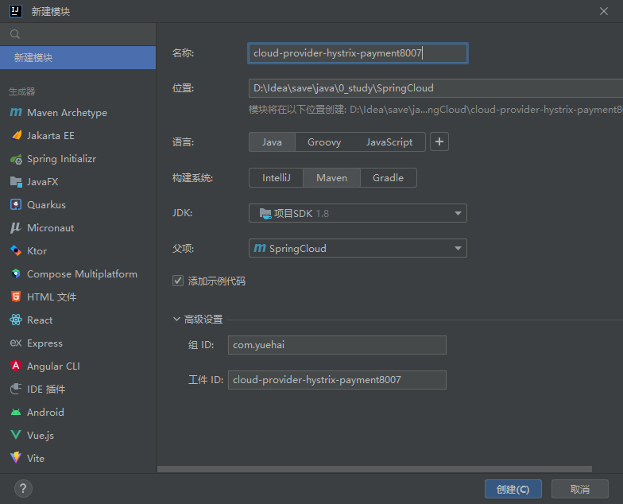

2. 修改 pom.xml，引入依赖：`spring-cloud-starter-netflix-hystrix`

```xml
<?xml version="1.0" encoding="UTF-8"?>
<project xmlns="http://maven.apache.org/POM/4.0.0"
         xmlns:xsi="http://www.w3.org/2001/XMLSchema-instance"
         xsi:schemaLocation="http://maven.apache.org/POM/4.0.0 http://maven.apache.org/xsd/maven-4.0.0.xsd">
    <modelVersion>4.0.0</modelVersion>
    <parent>
        <groupId>com.yuehai</groupId>
        <artifactId>SpringCloud</artifactId>
        <version>1.0-SNAPSHOT</version>
    </parent>
    
    <artifactId>cloud-provider-hystrix-payment8007</artifactId>
    
    <dependencies>
        <!-- 引入自己定义的 api 通用包，可以使用 Payment 支付 Entity -->
        <dependency>
            <groupId>com.yuehai</groupId>
            <artifactId>cloud-api-commons</artifactId>
            <version>1.0-SNAPSHOT</version>
        </dependency>
    
        <!-- eureka-client 服务注册 -->
        <dependency>
            <groupId>org.springframework.cloud</groupId>
            <artifactId>spring-cloud-starter-netflix-eureka-client</artifactId>
        </dependency>
    
        <!--hystrix-->
        <dependency>
            <groupId>org.springframework.cloud</groupId>
            <artifactId>spring-cloud-starter-netflix-hystrix</artifactId>
        </dependency>
    </dependencies>

</project>
```

3. 修改 yml 配置文件

```yaml
# 服务端口号
server:
    port: 8007

# spring 配置
spring:
    application:
        # 服务名称 微服务提供者支付模块 cloud-provider-hystrix-payment8007
        name: cloud-provider-hystrix-payment

eureka:
    client:
        # 表示是否将自己注册进 EurekaServer 默认为 true。
        register-with-eureka: true
        # 是否从 EurekaServer 抓取已有的注册信息，默认为 true。单节点无所谓，集群必须设置为 true 才能配合 ribbon使 用负载均衡
        fetchRegistry: true
        # 指定 eureka 服务端的注册地址 (Eureka Server 的分区地址)
        service-url:
            # 集群 eureka 间使用 , 分隔
            defaultZone: http://eureka7001.com:7001/eureka, http://eureka7002.com:7002/eureka
    instance:
        # 指定状态名
        instance-id: payment8007
        # 访问路径可以显示 IP 地址
        prefer-ip-address: true

```

4. 修改主启动类

```java
package com.yuehai;

import org.springframework.boot.SpringApplication;
import org.springframework.boot.autoconfigure.SpringBootApplication;
import org.springframework.cloud.client.discovery.EnableDiscoveryClient;
import org.springframework.cloud.netflix.eureka.EnableEurekaClient;

/**
 * 微服务提供者支付模块 cloud-provider-hystrix-payment8007
 * @author 月海
 * @create ${DATE} ${TIME}
 *
 * @EnableEurekaClient：作为微服务的服务提供者
 */
@SpringBootApplication
@EnableEurekaClient
public class ProviderHystrixPayment8007 {

    public static void main(String[] args) {
        SpringApplication.run(ProviderHystrixPayment8007.class, args);
    }

}

```

5. 编写业务类 controller

```java
package com.yuehai.controller;

import com.yuehai.utils.JsonResult;
import org.springframework.web.bind.annotation.GetMapping;
import org.springframework.web.bind.annotation.RestController;

import java.util.concurrent.TimeUnit;

/**
 * @author 月海
 * @create 2023/2/23 16:14
 */

@RestController
public class PaymentController {

    /**
     * 正常接口
     */
    @GetMapping("/hystrixOK")
    public JsonResult hystrixOK(){
        String name = Thread.currentThread().getName();

        System.out.println("正常接口，线程池：" + name);

        return JsonResult.success("正常接口，线程池：" + name);
    }

    /**
     * 超时访问，演示降级
     */
    @GetMapping("/hystrixTimeOut")
    public JsonResult hystrixTimeOut(){
        String name = Thread.currentThread().getName();
        
        System.out.println("开始睡，线程池：" + name);
        // 睡 3 秒
        try {
            TimeUnit.SECONDS.sleep(3);
        } catch (InterruptedException e) {
            throw new RuntimeException(e);
        }

        System.out.println("睡醒了，线程池：" + name);
        return JsonResult.success("睡 3 秒，线程池：" + name);
    }

}

```

6. 重启服务

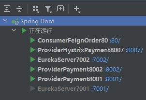

7. 进入 Eureka 查看：[http://localhost:7001/](http://localhost:7001/) 

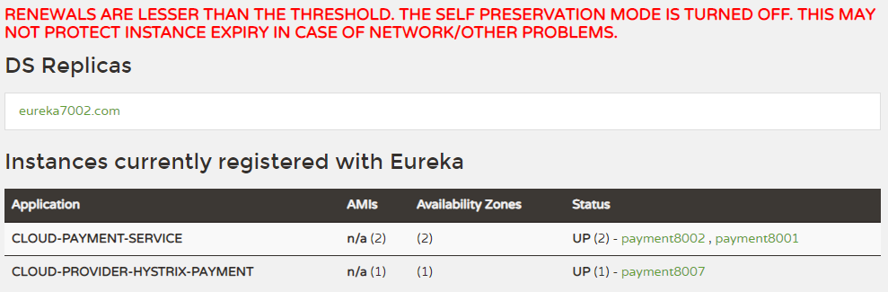

8. 访问测试正常接口

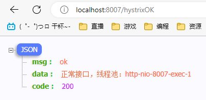

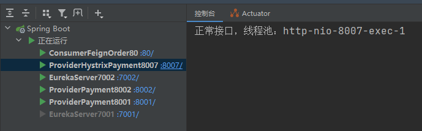

9. 访问测试超时接口

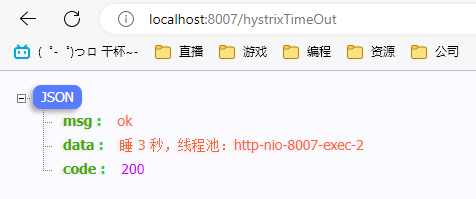

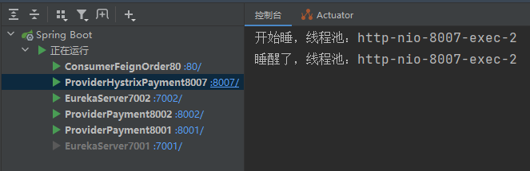

10. 目前都是正常访问的

### ④、高并发压力测试

1. 不测了，直接说结果：
   1. 新建一个 cloud-consumer-feign-hystrix-order80 模块，引入 `spring-cloud-starter-netflix-hystrix` 依赖，调用 8007
   2. 压测 8007，8007 要么转圈圈等待，要么 80 消费端报超时错误
2. 故障现象和导致原因：
   1. 8007 同一层次的其它接口服务被困死，因为 tomcat 线程池里面的工作线程已经被挤占完毕
   2. 80 此时调用 8007，客户端访问响应缓慢，转圈圈
3. 上诉结论：正因为有上述故障或不佳表现，才有我们的降级/容错/限流等技术诞生
4. 如何解决？解决的要求
   1. 超时导致服务器变慢(转圈)：超时不再等待
   2. 出错(宕机或程序运行出错)：出错要有兜底
5. 解决：
   1.  对方服务 8007 超时了，调用者 80 不能一直卡死等待，必须有服务降级
   2. 对方服务 8007 down机了，调用者 80 不能一直卡死等待，必须有服务降级
   3. 对方服务 8001 OK，调用者 80 自己出故障或有自我要求（自己的等待时间小于服务提供者），自己处理降级

---

1. 新建模块 cloud-consumer-feign-hystrix-order80
2. 修改 pom.xml

```xml
<?xml version="1.0" encoding="UTF-8"?>
<project xmlns="http://maven.apache.org/POM/4.0.0"
         xmlns:xsi="http://www.w3.org/2001/XMLSchema-instance"
         xsi:schemaLocation="http://maven.apache.org/POM/4.0.0 http://maven.apache.org/xsd/maven-4.0.0.xsd">
    <modelVersion>4.0.0</modelVersion>
    <parent>
        <groupId>com.yuehai</groupId>
        <artifactId>SpringCloud</artifactId>
        <version>1.0-SNAPSHOT</version>
    </parent>
    
    <artifactId>cloud-consumer-feign-hystrix-order80</artifactId>
    
    <dependencies>
        <!-- 引入自己定义的 api 通用包，可以使用 Payment 支付 Entity -->
        <dependency>
            <groupId>com.yuehai</groupId>
            <artifactId>cloud-api-commons</artifactId>
            <version>1.0-SNAPSHOT</version>
        </dependency>
        
        <!-- eureka-client 服务注册 -->
        <dependency>
            <groupId>org.springframework.cloud</groupId>
            <artifactId>spring-cloud-starter-netflix-eureka-client</artifactId>
        </dependency>
        <!-- openfeign -->
        <dependency>
            <groupId>org.springframework.cloud</groupId>
            <artifactId>spring-cloud-starter-openfeign</artifactId>
        </dependency>
        <!-- hystrix -->
        <dependency>
            <groupId>org.springframework.cloud</groupId>
            <artifactId>spring-cloud-starter-netflix-hystrix</artifactId>
        </dependency>
    </dependencies>

</project>
```

3. 修改 yml 配置文件

```yaml
# 服务端口号
server:
    port: 80

# spring 配置
spring:
    application:
        # 服务名称  微服务消费者订单模块 cloud-consumer-feign-hystrix-order80
        name: cloud-consumer-feign-hystrix-order

# eureka 配置
eureka:
    client:
        # 表示是否将自己注册进 EurekaServer 默认为 true。
        register-with-eureka: false
        # 指定 eureka 服务端的注册地址
        service-url:
            # 集群 eureka 间使用 , 分隔
            defaultZone: http://eureka7001.com:7001/eureka, http://eureka7002.com:7002/eureka
```

4. 修改主启动类

```java
package com.yuehai;

import org.springframework.boot.SpringApplication;
import org.springframework.boot.autoconfigure.SpringBootApplication;
import org.springframework.cloud.openfeign.EnableFeignClients;

/**
 * 微服务消费者订单模块 cloud-consumer-feign-hystrix-order80
 * @author 月海
 * @create ${DATE} ${TIME}
 *
 * {@code @EnableFeignClients：告诉框架扫描所有使用注解} @FeignClient 定义的 feign 客户端，并把 feign 客户端注册到 IOC 容器中
 */
@SpringBootApplication
@EnableFeignClients
public class ConsumerFeignHystrixOrder80 {
    public static void main(String[] args) {
        SpringApplication.run(ConsumerFeignHystrixOrder80.class, args);
    }

}
```

5. 编写业务接口 service 

```java
package com.yuehai.service;

import com.yuehai.utils.JsonResult;
import org.springframework.cloud.openfeign.FeignClient;
import org.springframework.web.bind.annotation.GetMapping;

/**
 * @author 月海
 * @create 2023/2/23 10:49
 *
 * { @code @FeignClient：主要用于客户端服务发现，实际就是调用其他的服务 }
 * { @code @FeignClient(value = "cloud-provider-hystrix-paymen")：调用 cloud-provider-hystrix-paymen 的接口 }
 */

@FeignClient(value = "cloud-provider-hystrix-payment")
public interface OrderFeignService {

    /**
     * 测试 get，查询全部
     */
    @GetMapping("/hystrixOK")
    JsonResult hystrixOK();

    /**
     * 暂停 5 秒
     */
    @GetMapping("/hystrixTimeOut")
    JsonResult hystrixTimeOut();

}

```

6. 编写业务类 controller

```java
package com.yuehai.controller;

import com.yuehai.service.OrderFeignService;
import com.yuehai.utils.JsonResult;
import org.springframework.web.bind.annotation.GetMapping;
import org.springframework.web.bind.annotation.RestController;

import javax.annotation.Resource;

/**
 * @author 月海
 * @create 2023/2/23 11:09
 */

@RestController
public class OrderFeignController {

    @Resource
    private OrderFeignService orderFeignService;

    @GetMapping("/hystrixOK")
    public JsonResult hystrixOK(){
        return orderFeignService.hystrixOK();
    }

    @GetMapping("/hystrixTimeOut")
    public JsonResult hystrixTimeOut(){
        return orderFeignService.hystrixTimeOut();
    }

}

```

7. 访问测试：[http://localhost/hystrixOK](http://localhost/hystrixOK)

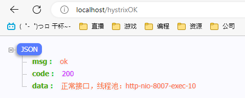


### ⑤、Hystrix 服务降级配置

**降级配置注解：**`@HystrixCommand`
**设置自身调用超时时间的峰值，峰值内可以正常运行，超过了需要有兜底容错的方法处理，fallback**

#### Ⅰ、提供者 8007 fallback 容错机制

1. 修改 8007 的启动类，添加注解：`@EnableCircuitBreaker`：开启 Hystrix 熔断器

```java
package com.yuehai;

import org.springframework.boot.SpringApplication;
import org.springframework.boot.autoconfigure.SpringBootApplication;
import org.springframework.cloud.client.circuitbreaker.EnableCircuitBreaker;
import org.springframework.cloud.netflix.eureka.EnableEurekaClient;

/**
 * 微服务提供者支付模块 cloud-provider-payment8004
 * @author 月海
 * @create ${DATE} ${TIME}
 *
 * { @EnableEurekaClient：作为微服务的服务提供者 }
 * { @EnableCircuitBreaker：开启 Hystrix 熔断器 }
 */
@SpringBootApplication
@EnableEurekaClient
@EnableCircuitBreaker
public class ProviderHystrixPayment8007 {

    public static void main(String[] args) {
        SpringApplication.run(ProviderHystrixPayment8007.class, args);
    }

}

```

2. 修改 8007 的 controller 类，添加注解：`@HystrixCommand` 与 hystrix 的 fallback 兜底方法

```java
/**
     * 超时访问，演示降级
     * { @HystrixCommand()： }
     *      fallbackMethod = "paymentInfo_TimeOutHandler"：
     *          当该接口发生故障之后，通过断路器的故障监控（类似熔断保险丝），向调用方返回 fallbackMethod 指定的接口
     *      { @HystrixProperty(name = "execution.isolation.thread.timeoutInMilliseconds", value = "500") }
     *          当 name 指定的线程运行时间超过 value 指定的是时间后，会执行服务降级
     */
    @HystrixCommand(fallbackMethod = "paymentInfo_TimeOutHandler", commandProperties = {
            @HystrixProperty(name = "execution.isolation.thread.timeoutInMilliseconds", value = "2000")
    })
    @GetMapping("/hystrixTimeOut")
    public JsonResult hystrixTimeOut(){
        String name = Thread.currentThread().getName();

        System.out.println("开始睡，线程池：" + name);
        // 睡 3 秒
        try {
            TimeUnit.SECONDS.sleep(3);
        } catch (InterruptedException e) {
            throw new RuntimeException(e);
        }

        System.out.println("睡醒了，线程池：" + name);
        return JsonResult.success("睡 3 秒，线程池：" + name);
    }
    /**
     * hystrix 的 fallback 兜底容错方法
     */
    public JsonResult paymentInfo_TimeOutHandler(){
        return JsonResult.success("/(ㄒoㄒ)/调用支付接口超时或异常；当前线程池：" + Thread.currentThread().getName());
    }
```

3. 访问测试 8007 端口：[http://localhost:8007/hystrixTimeOut](http://localhost:8007/hystrixTimeOut)，成功


4. 访问测试 80 端口：[http://localhost/hystrixTimeOut](http://localhost/hystrixTimeOut)，依然是报超时错误


#### Ⅱ、消费者 80 fallback 容错机制（一般都放在消费端）

1. 修改 80 的 application.yml 配置文件，因为客户端引入了 feign，服务端不用配置

```yaml
# 服务端口号
server:
    port: 80

# spring 配置
spring:
    application:
        # 服务名称  微服务消费者订单模块 cloud-consumer-feign-hystrix-order80
        name: cloud-consumer-feign-hystrix-order

# eureka 配置
eureka:
    client:
        # 表示是否将自己注册进 EurekaServer 默认为 true。
        register-with-eureka: false
        # 指定 eureka 服务端的注册地址
        service-url:
            # 集群 eureka 间使用 , 分隔
            defaultZone: http://eureka7001.com:7001/eureka, http://eureka7002.com:7002/eureka

# openFeign 配置
feign:
    hystrix:
        # 开启 hystrix 熔断功能
        enabled: true
```

2. 修改 80 的主启动类

```java
package com.yuehai;

import org.springframework.boot.SpringApplication;
import org.springframework.boot.autoconfigure.SpringBootApplication;
import org.springframework.cloud.netflix.hystrix.EnableHystrix;
import org.springframework.cloud.openfeign.EnableFeignClients;

/**
 * 微服务消费者订单模块 cloud-consumer-feign-hystrix-order80
 * @author 月海
 * @create ${DATE} ${TIME}
 *
 * { @code @EnableFeignClients：告诉框架扫描所有使用注解 @FeignClient 定义的 feign 客户端，并把 feign 客户端注册到 IOC 容器中 }
 * { @EnableHystrix：使客户端启用 Hystrix 断路器，并让自动配置找到可用的 Hystrix 类（需要 Hystrix 类库已经在类路径上） }
 */
@SpringBootApplication
@EnableFeignClients
@EnableHystrix
public class ConsumerFeignHystrixOrder80 {
    public static void main(String[] args) {
        SpringApplication.run(ConsumerFeignHystrixOrder80.class, args);
    }

}
```

3. 修改 80 的 controller 类

```java
package com.yuehai.controller;

import com.netflix.hystrix.contrib.javanica.annotation.HystrixCommand;
import com.netflix.hystrix.contrib.javanica.annotation.HystrixProperty;
import com.yuehai.service.OrderFeignService;
import com.yuehai.utils.JsonResult;
import org.springframework.web.bind.annotation.GetMapping;
import org.springframework.web.bind.annotation.RestController;

import javax.annotation.Resource;

/**
 * @author 月海
 * @create 2023/2/23 11:09
 */

@RestController
public class OrderFeignController {

    @Resource
    private OrderFeignService orderFeignService;

    @GetMapping("/hystrixOK")
    public JsonResult hystrixOK(){
        return orderFeignService.hystrixOK();
    }

    /**
     * 超时访问，演示降级
     * { @HystrixCommand()： }
     *      fallbackMethod = "paymentTimeOutFallbackMethod"：
     *          当该接口发生故障之后，通过断路器的故障监控（类似熔断保险丝），向调用方返回 fallbackMethod 指定的接口
     *      { @HystrixProperty(name = "execution.isolation.thread.timeoutInMilliseconds", value = "2000") }
     *          当 name 指定的线程运行时间超过 value 指定的是时间后，会执行服务降级
     */
    @HystrixCommand(fallbackMethod = "payment_TimeOut_Fallback_Method",commandProperties = {
            @HystrixProperty(name="execution.isolation.thread.timeoutInMilliseconds",value="2000")
    })
    @GetMapping("/hystrixTimeOut")
    public JsonResult hystrixTimeOut(){
        return orderFeignService.hystrixTimeOut();
    }
    /**
     * hystrix 的 fallback 兜底容错方法
     */
    public JsonResult payment_TimeOut_Fallback_Method(){
        return JsonResult.success("/(ㄒoㄒ)/ 消费者调用支付接口超时或异常；当前线程池：" + Thread.currentThread().getName());
    }

}

```

4. 测试：[http://localhost/hystrixTimeOut](http://localhost/hystrixTimeOut)

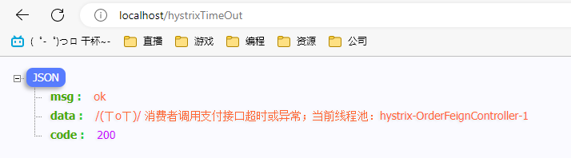


#### Ⅲ、通用 fallback 容错

> **独有的 fallback 容错方法 > 通用的 fallback 容错方法**
> **所以可以除了个别重要核心业务有专属 fallback 容错方法，其它普通的可以使用通用 fallback 容错方法统一跳转到统一处理结果页面**

1. 修改 80 的 controller类，类上面添加注解：`@DefaultProperties(defaultFallback = "payment_Global_Fallback")`
2. 添加新接口 `hystrixTimeOut2`，添加 `@HystrixCommand` 注解：该注解不加参数，表示出错后调用类上的 `@DefaultProperties` 注解的 `defaultFallback` 指定的 fallback 容错方法

```java
package com.yuehai.controller;

import com.netflix.hystrix.contrib.javanica.annotation.DefaultProperties;
import com.netflix.hystrix.contrib.javanica.annotation.HystrixCommand;
import com.netflix.hystrix.contrib.javanica.annotation.HystrixProperty;
import com.yuehai.service.OrderFeignService;
import com.yuehai.utils.JsonResult;
import org.springframework.web.bind.annotation.GetMapping;
import org.springframework.web.bind.annotation.RestController;

import javax.annotation.Resource;

/**
 * @author 月海
 * @create 2023/2/23 11:09
 */

@RestController
@DefaultProperties(defaultFallback = "payment_Global_Fallback")
public class OrderFeignController {

    @Resource
    private OrderFeignService orderFeignService;


    @GetMapping("/hystrixOK")
    public JsonResult hystrixOK(){
        return orderFeignService.hystrixOK();
    }

    /**
     * 超时访问，演示降级
     * { @HystrixCommand()： }
     *      fallbackMethod = "paymentTimeOutFallbackMethod"：
     *          当该接口发生故障之后，通过断路器的故障监控（类似熔断保险丝），向调用方返回 fallbackMethod 指定的接口
     *      { @HystrixProperty(name = "execution.isolation.thread.timeoutInMilliseconds", value = "2000") }
     *          当 name 指定的线程运行时间超过 value 指定的是时间后，会执行服务降级
     */
    @HystrixCommand(fallbackMethod = "payment_TimeOut_Fallback_Method",commandProperties = {
            @HystrixProperty(name="execution.isolation.thread.timeoutInMilliseconds",value="2000")
    })
    @GetMapping("/hystrixTimeOut")
    public JsonResult hystrixTimeOut(){
        return orderFeignService.hystrixTimeOut();
    }
    /**
     * hystrix 的 fallback 兜底容错方法
     */
    public JsonResult payment_TimeOut_Fallback_Method(){
        return JsonResult.success("/(ㄒoㄒ)/ 消费者调用支付接口超时或异常；当前线程池：" + Thread.currentThread().getName());
    }

    /**
     * { @HystrixCommand：该注解不加参数，表示出错后调用类上的 @DefaultProperties 注解的 defaultFallback 指定的 fallback 容错方法 }
     */
    @HystrixCommand
    @GetMapping("/hystrixTimeOut2")
    public JsonResult hystrixTimeOut2(){
        return orderFeignService.hystrixTimeOut();
    }

    /**
     * 通用的 fallback 容错方法
     */
    public JsonResult payment_Global_Fallback(){
        return JsonResult.success("通用的 fallback 容错方法；当前线程池：" + Thread.currentThread().getName());
    }

}

```

3. 访问测试：[http://localhost/hystrixTimeOut2](http://localhost/hystrixTimeOut2)


#### Ⅳ、将 fallback 容错方法放到 service

> **将 fallback 容错方法和 controller 业务逻辑放在一起太混乱了**
> 本次案例服务降级处理是在客户端 80 实现完成的，与服务端 8001 没有关系
> 只需要为 Feign 客户端定义的接口添加一个服务降级处理的实现类即可实现解耦
> 但是这种方法只能处理提供者 8007 服务的异常，无法处理消费者 80 的异常，而且也只能每个接口都要实现一遍
> 常见的异常：运行、超时、宕机

1. 创建接口 OrderFeignService 的实现类 OrderFeignServiceFallback，编写 Fallback 容错方法；添加注解：`@Component`

```java
package com.yuehai.service.impl;

import com.yuehai.service.OrderFeignService;
import com.yuehai.utils.JsonResult;
import org.springframework.stereotype.Component;

/**
 * @author 月海
 * @create 2023/2/24 16:08
 *
 * { @Component：注解表明一个类会作为组件类，并告知 Spring 要为这个类创建 bean }
 */
@Component
public class OrderFeignServiceFallback implements OrderFeignService {
    @Override
    public JsonResult hystrixOK() {
        return JsonResult.success("服务端 hystrixOK 接口调用失败");
    }

    @Override
    public JsonResult hystrixTimeOut() {
        return JsonResult.success("服务端 hystrixTimeOut 接口调用失败");
    }
}

```

2. 修改接口 OrderFeignService 的 `@FeignClient` 注解，添加 `fallback` 属性，指定 Fallback 容错方法实现类 OrderFeignServiceFallback

```java
package com.yuehai.service;

import com.yuehai.service.impl.OrderFeignServiceFallback;
import com.yuehai.utils.JsonResult;
import org.springframework.cloud.openfeign.FeignClient;
import org.springframework.web.bind.annotation.GetMapping;

/**
 * @author 月海
 * @create 2023/2/23 10:49
 *
 * { @code @FeignClient：主要用于客户端服务发现，实际就是调用其他的服务 }
 * { @code @FeignClient()： }
 *      value = "cloud-provider-hystrix-payment"：调用 cloud-provider-hystrix-payment 的接口
 *      fallback = OrderFeignServiceFallback.class：使用 OrderFeignServiceFallback 类中的方法作为 fallback 容错方法
 */

@FeignClient(value = "cloud-provider-hystrix-payment", fallback = OrderFeignServiceFallback.class)
public interface OrderFeignService {

    /**
     * 测试 get，查询全部
     */
    @GetMapping("/hystrixOK")
    JsonResult hystrixOK();

    /**
     * 暂停 5 秒
     */
    @GetMapping("/hystrixTimeOut")
    JsonResult hystrixTimeOut();

}

```

3. 创建 controller 类 OrderFeignFallbackController

```java
package com.yuehai.controller;

import com.yuehai.service.OrderFeignService;
import com.yuehai.utils.JsonResult;
import org.springframework.web.bind.annotation.GetMapping;
import org.springframework.web.bind.annotation.RequestMapping;
import org.springframework.web.bind.annotation.RestController;

import javax.annotation.Resource;

/**
 * @author 月海
 * @create 2023/2/24 16:23
 */

@RestController
@RequestMapping("/fallBack")
public class OrderFeignFallbackController {

    @Resource
    private OrderFeignService orderFeignService;

    @GetMapping("/hystrixOK")
    public JsonResult hystrixOK(){
        return orderFeignService.hystrixOK();
    }

    @GetMapping("/hystrixTimeOut")
    public JsonResult hystrixTimeOut(){
        return orderFeignService.hystrixTimeOut();
    }
}

```

4. 访问测试：[http://localhost/fallBack/hystrixOK](http://localhost/fallBack/hystrixOK)

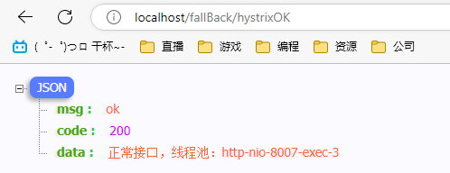

5. 访问测试：[http://localhost/fallBack/hystrixTimeOut](http://localhost/fallBack/hystrixTimeOut)


### ⑥、服务熔断

> 断路器：一句话就是家里的保险丝
> 
> [https://martinfowler.com/bliki/CircuitBreaker.html](https://martinfowler.com/bliki/CircuitBreaker.html)


#### Ⅰ、熔断是什么

1.  熔断机制概述：熔断机制是应对雪崩效应的一种微服务链路保护机制。当扇出链路的某个微服务出错不可用或者响应时间太长时，会进行服务的降级，进而熔断该节点微服务的调用，快速返回错误的响应信息。当检测到该节点微服务调用响应正常后，恢复调用链路。
2. 在 Spring Cloud 框架里，熔断机制通过 Hystrix 实现。Hystrix 会监控微服务间调用的状况，当失败的调用到一定阈值，缺省是 5 秒内 20 次调用失败，就会启动熔断机制。熔断机制的注解是 `@HystrixCommand`

#### Ⅱ、熔断案例

1. 新建模块 cloud-provider-hystrix-payment8008


2. 修改 pom.xml

```xml
<?xml version="1.0" encoding="UTF-8"?>
<project xmlns="http://maven.apache.org/POM/4.0.0"
         xmlns:xsi="http://www.w3.org/2001/XMLSchema-instance"
         xsi:schemaLocation="http://maven.apache.org/POM/4.0.0 http://maven.apache.org/xsd/maven-4.0.0.xsd">
    <modelVersion>4.0.0</modelVersion>
    <parent>
        <groupId>com.yuehai</groupId>
        <artifactId>SpringCloud</artifactId>
        <version>1.0-SNAPSHOT</version>
    </parent>
    
    <artifactId>cloud-provider-hystrix-payment8008</artifactId>
    
    <dependencies>
        <!-- 引入自己定义的 api 通用包，可以使用 Payment 支付 Entity -->
        <dependency>
            <groupId>com.yuehai</groupId>
            <artifactId>cloud-api-commons</artifactId>
            <version>1.0-SNAPSHOT</version>
        </dependency>
        
        <!-- eureka-client 服务注册 -->
        <dependency>
            <groupId>org.springframework.cloud</groupId>
            <artifactId>spring-cloud-starter-netflix-eureka-client</artifactId>
        </dependency>
        
        <!--hystrix-->
        <dependency>
            <groupId>org.springframework.cloud</groupId>
            <artifactId>spring-cloud-starter-netflix-hystrix</artifactId>
        </dependency>
    </dependencies>

</project>
```

3. 修改 yml 配置文件

```yaml
# 服务端口号
server:
    port: 8008

# spring 配置
spring:
    application:
        # 服务名称 微服务提供者支付模块 cloud-provider-hystrix-payment8008
        name: cloud-provider-hystrix-payment

eureka:
    client:
        # 表示是否将自己注册进 EurekaServer 默认为 true。
        register-with-eureka: true
        # 是否从 EurekaServer 抓取已有的注册信息，默认为 true。单节点无所谓，集群必须设置为 true 才能配合 ribbon使 用负载均衡
        fetchRegistry: true
        # 指定 eureka 服务端的注册地址 (Eureka Server 的分区地址)
        service-url:
            # 集群 eureka 间使用 , 分隔
            defaultZone: http://eureka7001.com:7001/eureka, http://eureka7002.com:7002/eureka
    instance:
        # 指定状态名
        instance-id: payment8008
        # 访问路径可以显示 IP 地址
        prefer-ip-address: true

```

4. 修改主启动类

```java
package com.yuehai;

import org.springframework.boot.SpringApplication;
import org.springframework.boot.autoconfigure.SpringBootApplication;
import org.springframework.cloud.client.circuitbreaker.EnableCircuitBreaker;
import org.springframework.cloud.netflix.eureka.EnableEurekaClient;

/**
 * 微服务提供者支付模块 cloud-provider-hystrix-payment8008
 * @author 月海
 * @create ${DATE} ${TIME}
 *
 * { @EnableEurekaClient：作为微服务的服务提供者 }
 * { @EnableCircuitBreaker：开启 Hystrix 熔断器 }
 */
@SpringBootApplication
@EnableEurekaClient
@EnableCircuitBreaker
public class ProviderHystrixPayment8008 {

    public static void main(String[] args) {
        SpringApplication.run(ProviderHystrixPayment8008.class, args);
    }

}

```

5. 编写接口 service

```java
package com.yuehai.service;

import cn.hutool.core.util.IdUtil;
import com.netflix.hystrix.contrib.javanica.annotation.HystrixCommand;
import com.netflix.hystrix.contrib.javanica.annotation.HystrixProperty;
import com.yuehai.utils.JsonResult;
import org.springframework.web.bind.annotation.PathVariable;

/**
 * @author 月海
 * @create 2023/2/27 8:25
 *
 * 服务熔断
 */
public interface ProviderHystrixPaymentService {

    /**
     * 正常被调用的方法
     */
    JsonResult paymentCircuitBreaker(Integer id);
    /**
     * hystrix 的 fallback 兜底容错方法
     */
    JsonResult paymentCircuitBreaker_fallback(Integer id);

}

```

6. 编写接口实现类 serviceImpl

```java
package com.yuehai.service.impl;

import cn.hutool.core.util.IdUtil;
import com.netflix.hystrix.contrib.javanica.annotation.HystrixCommand;
import com.netflix.hystrix.contrib.javanica.annotation.HystrixProperty;
import com.yuehai.service.ProviderHystrixPaymentService;
import com.yuehai.utils.JsonResult;
import org.springframework.stereotype.Service;

/**
 * @author 月海
 * @create 2023/2/27 8:38
 */

@Service
public class ProviderHystrixPaymentServiceImpl implements ProviderHystrixPaymentService {

    /**
     * 正常被调用的方法；内部出错，演示熔断
     */
    // fallbackMethod = "paymentCircuitBreaker_fallback"：当该接口发生故障之后，通过断路器的故障监控（类似熔断保险丝），向调用方返回 fallbackMethod 指定的接口
    @HystrixCommand(fallbackMethod = "paymentCircuitBreaker_fallback",commandProperties = {
            // 是否开启断路器
            @HystrixProperty(name = "circuitBreaker.enabled",value = "true"),
            // 请求次数
            @HystrixProperty(name = "circuitBreaker.requestVolumeThreshold",value = "10"),
            // 时间窗口期
            @HystrixProperty(name = "circuitBreaker.sleepWindowInMilliseconds",value = "10000"),
            // 失败率达到多少后跳闸；即 10 秒请求 10 次，失败 6 次或以上则开启断路器
            @HystrixProperty(name = "circuitBreaker.errorThresholdPercentage",value = "60"),
    })
    @Override
    public JsonResult paymentCircuitBreaker(Integer id) {
        if(id < 0){
            throw new RuntimeException("******id 不能负数");
        }

        String serialNumber = IdUtil.simpleUUID();

        return JsonResult.success(Thread.currentThread().getName()+"\t"+"调用成功，流水号: " + serialNumber);
    }
    /**
     * hystrix 的 fallback 兜底容错方法
     */
    @Override
    public JsonResult paymentCircuitBreaker_fallback(Integer id) {
        return JsonResult.success("id 不能负数，请稍后再试，/(ㄒoㄒ)/~~   id: " +id);
    }
}

```

7. 编写业务类 controller

```java
package com.yuehai.controller;

import com.netflix.hystrix.contrib.javanica.annotation.HystrixCommand;
import com.netflix.hystrix.contrib.javanica.annotation.HystrixProperty;
import com.yuehai.service.ProviderHystrixPaymentService;
import com.yuehai.utils.JsonResult;
import org.springframework.web.bind.annotation.GetMapping;
import org.springframework.web.bind.annotation.RestController;

import javax.annotation.Resource;
import java.util.concurrent.TimeUnit;

/**
 * @author 月海
 * @create 2023/2/23 16:14
 */

@RestController
public class PaymentController {

    @Resource
    private ProviderHystrixPaymentService paymentService;

    /**
     * 断路器测试
     */
    @GetMapping("/hystrixFallback")
    public JsonResult hystrixFallback(Integer id){
        return paymentService.paymentCircuitBreaker(id);
    }


}

```

8. 测试正常访问：[http://localhost:8008/hystrixFallback?id=1](http://localhost:8008/hystrixFallback?id=1)

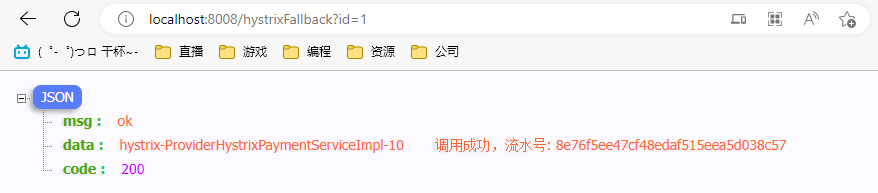

9. 测试错误访问：[http://localhost:8008/hystrixFallback?id=1](http://localhost:8008/hystrixFallback?id=1)

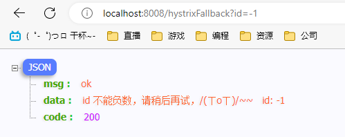

10. 重点：多测试几次错误的访问，再访问正确的地址，发现就算是正确的地址也会返回错误


#### Ⅲ、大神结论


#### Ⅳ、熔断类型

1. 熔断打开：请求不再进行调用当前服务，内部设置时钟一般为 MTTR（平均故障处理时间)，当打开时长达到所设时钟则进入半熔断状态
2. 熔断关闭：熔断关闭不会对服务进行熔断
3. 熔断半开：部分请求根据规则调用当前服务，如果请求成功且符合规则则认为当前服务恢复正常，关闭熔断

#### Ⅴ、官网断路器流程图

1. 流程图


2. 断路器在什么情况下开始起作用涉及到断路器的三个重要参数：快照时间窗、请求总数阀值、错误百分比阀值。
   1. 快照时间窗：断路器确定是否打开需要统计一些请求和错误数据，而统计的时间范围就是快照时间窗，默认为最近的 10 秒。
   2. 请求总数阀值：在快照时间窗内，必须满足请求总数阀值才有资格熔断。默认为 20，意味着在 10 秒内，如果该 hystrix 命令的调用次数不足 20 次，即使所有的请求都超时或其他原因失败，断路器都不会打开。
   3. 错误百分比阀值：当请求总数在快照时间窗内超过了阀值，比如发生了 30 次调用，如果在这 30 次调用中，有 15 次发生了超时异常，也就是超过 50% 的错误百分比，在默认设定 50% 阀值情况下，这时候就会将断路器打开。

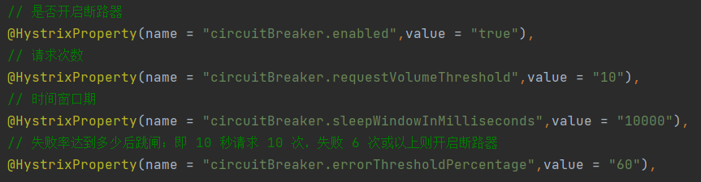

3. 断路器开启或者关闭的条件
   1.   当满足一定的阀值的时候（默认 10 秒内超过 20 个请求次数）
   2.   当失败率达到一定的时候（默认 10 秒内超过 50% 的请求失败）
   3.   到达以上阀值，断路器将会开启
   4.   当开启的时候，所有请求都不会进行转发
   5.   一段时间之后（默认是 5 秒），这个时候断路器是半开状态，会让其中一个请求进行转发。 如果成功，断路器会关闭，若失败，继续开启。重复 4 和 5
4. 断路器打开之后，再有请求调用的时候，将不会调用主逻辑，而是直接调用降级 fallback。通过断路器，实现了自动地发现错误并将降级逻辑切换为主逻辑，减少响应延迟的效果。
5. 原来的主逻辑要如何恢复呢？对于这一问题，hystrix 也为我们实现了自动恢复功能。当断路器打开，对主逻辑进行熔断之后，hystrix 会启动一个休眠时间窗，在这个时间窗内，降级逻辑是临时的成为主逻辑，当休眠时间窗到期，断路器将进入半开状态，释放一次请求到原来的主逻辑上，如果此次请求正常返回，那么断路器将继续闭合，主逻辑恢复，如果这次请求依然有问题，断路器继续进入打开状态，休眠时间窗重新计时。
6. All 配置：

```java
//========================All
    @HystrixCommand(fallbackMethod = "str_fallbackMethod",
            groupKey = "strGroupCommand",
            commandKey = "strCommand",
            threadPoolKey = "strThreadPool",

            commandProperties = {
                    // 设置隔离策略，THREAD 表示线程池 SEMAPHORE：信号池隔离
                    @HystrixProperty(name = "execution.isolation.strategy", value = "THREAD"),
                    // 当隔离策略选择信号池隔离的时候，用来设置信号池的大小（最大并发数）
                    @HystrixProperty(name = "execution.isolation.semaphore.maxConcurrentRequests", value = "10"),
                    // 配置命令执行的超时时间
                    @HystrixProperty(name = "execution.isolation.thread.timeoutinMilliseconds", value = "10"),
                    // 是否启用超时时间
                    @HystrixProperty(name = "execution.timeout.enabled", value = "true"),
                    // 执行超时的时候是否中断
                    @HystrixProperty(name = "execution.isolation.thread.interruptOnTimeout", value = "true"),
                    // 执行被取消的时候是否中断
                    @HystrixProperty(name = "execution.isolation.thread.interruptOnCancel", value = "true"),
                    // 允许回调方法执行的最大并发数
                    @HystrixProperty(name = "fallback.isolation.semaphore.maxConcurrentRequests", value = "10"),
                    // 服务降级是否启用，是否执行回调函数
                    @HystrixProperty(name = "fallback.enabled", value = "true"),
                    // 是否启用断路器
                    @HystrixProperty(name = "circuitBreaker.enabled", value = "true"),
                    // 该属性用来设置在滚动时间窗中，断路器熔断的最小请求数。例如，默认该值为 20 的时候，
                    // 如果滚动时间窗（默认10秒）内仅收到了19个请求， 即使这19个请求都失败了，断路器也不会打开。
                    @HystrixProperty(name = "circuitBreaker.requestVolumeThreshold", value = "20"),
                    // 该属性用来设置在滚动时间窗中，表示在滚动时间窗中，在请求数量超过
                    // circuitBreaker.requestVolumeThreshold 的情况下，如果错误请求数的百分比超过50,
                    // 就把断路器设置为 "打开" 状态，否则就设置为 "关闭" 状态。
                    @HystrixProperty(name = "circuitBreaker.errorThresholdPercentage", value = "50"),
                    // 该属性用来设置当断路器打开之后的休眠时间窗。 休眠时间窗结束之后，
                    // 会将断路器置为 "半开" 状态，尝试熔断的请求命令，如果依然失败就将断路器继续设置为 "打开" 状态，
                    // 如果成功就设置为 "关闭" 状态。
                    @HystrixProperty(name = "circuitBreaker.sleepWindowinMilliseconds", value = "5000"),
                    // 断路器强制打开
                    @HystrixProperty(name = "circuitBreaker.forceOpen", value = "false"),
                    // 断路器强制关闭
                    @HystrixProperty(name = "circuitBreaker.forceClosed", value = "false"),
                    // 滚动时间窗设置，该时间用于断路器判断健康度时需要收集信息的持续时间
                    @HystrixProperty(name = "metrics.rollingStats.timeinMilliseconds", value = "10000"),
                    // 该属性用来设置滚动时间窗统计指标信息时划分"桶"的数量，断路器在收集指标信息的时候会根据
                    // 设置的时间窗长度拆分成多个 "桶" 来累计各度量值，每个"桶"记录了一段时间内的采集指标。
                    // 比如 10 秒内拆分成 10 个"桶"收集这样，所以 timeinMilliseconds 必须能被 numBuckets 整除。否则会抛异常
                    @HystrixProperty(name = "metrics.rollingStats.numBuckets", value = "10"),
                    // 该属性用来设置对命令执行的延迟是否使用百分位数来跟踪和计算。如果设置为 false, 那么所有的概要统计都将返回 -1。
                    @HystrixProperty(name = "metrics.rollingPercentile.enabled", value = "false"),
                    // 该属性用来设置百分位统计的滚动窗口的持续时间，单位为毫秒。
                    @HystrixProperty(name = "metrics.rollingPercentile.timeInMilliseconds", value = "60000"),
                    // 该属性用来设置百分位统计滚动窗口中使用 “ 桶 ”的数量。
                    @HystrixProperty(name = "metrics.rollingPercentile.numBuckets", value = "60000"),
                    // 该属性用来设置在执行过程中每个 “桶” 中保留的最大执行次数。如果在滚动时间窗内发生超过该设定值的执行次数，
                    // 就从最初的位置开始重写。例如，将该值设置为100, 滚动窗口为10秒，若在10秒内一个 “桶 ”中发生了500次执行，
                    // 那么该 “桶” 中只保留 最后的100次执行的统计。另外，增加该值的大小将会增加内存量的消耗，并增加排序百分位数所需的计算时间。
                    @HystrixProperty(name = "metrics.rollingPercentile.bucketSize", value = "100"),
                    // 该属性用来设置采集影响断路器状态的健康快照（请求的成功、 错误百分比）的间隔等待时间。
                    @HystrixProperty(name = "metrics.healthSnapshot.intervalinMilliseconds", value = "500"),
                    // 是否开启请求缓存
                    @HystrixProperty(name = "requestCache.enabled", value = "true"),
                    // HystrixCommand的执行和事件是否打印日志到 HystrixRequestLog 中
                    @HystrixProperty(name = "requestLog.enabled", value = "true"),
            },
            threadPoolProperties = {
                    // 该参数用来设置执行命令线程池的核心线程数，该值也就是命令执行的最大并发量
                    @HystrixProperty(name = "coreSize", value = "10"),
                    // 该参数用来设置线程池的最大队列大小。当设置为 -1 时，线程池将使用 SynchronousQueue 实现的队列，
                    // 否则将使用 LinkedBlockingQueue 实现的队列。
                    @HystrixProperty(name = "maxQueueSize", value = "-1"),
                    // 该参数用来为队列设置拒绝阈值。 通过该参数， 即使队列没有达到最大值也能拒绝请求。
                    // 该参数主要是对 LinkedBlockingQueue 队列的补充,因为 LinkedBlockingQueue
                    // 队列不能动态修改它的对象大小，而通过该属性就可以调整拒绝请求的队列大小了。
                    @HystrixProperty(name = "queueSizeRejectionThreshold", value = "5"),
            }
    )
    public String strConsumer() {
        return "hello 2020";
    }
    public String str_fallbackMethod(){
        return "*****fall back str_fallbackMethod";
    }
```

### ⑦、服务限流

后面高级篇讲解 alibaba 的 Sentinel 说明

### ⑧、hystrix 工作流程

> [https://github.com/Netflix/Hystrix/wiki/How-it-Works](https://github.com/Netflix/Hystrix/wiki/How-it-Works)

#### Ⅰ、官网图例


#### Ⅱ、步骤说明

> 如果我们没有为命令实现降级逻辑或者在降级处理逻辑中抛出了异常， Hystrix 依然会返回一个 Observable 对象， 但是它不会发射任何结果数据， 而是通过 onError 方法通知命令立即中断请求，并通过 onError() 方法将引起命令失败的异常发送给调用者。

1. 创建 HystrixCommand（用在依赖的服务返回单个操作结果的时候） 或 HystrixObserableCommand（用在依赖的服务返回多个操作结果的时候） 对象。
2. 命令执行。其中 HystrixComand 实现了下面前两种执行方式；而 HystrixObservableCommand 实现了后两种执行方式：
   1. execute()：同步执行，从依赖的服务返回一个单一的结果对象， 或是在发生错误的时候抛出异常。
   2. queue()：异步执行， 直接返回 一个Future对象， 其中包含了服务执行结束时要返回的单一结果对象。
   3. observe()：返回 Observable 对象，它代表了操作的多个结果，它是一个 Hot Obserable（不论 "事件源" 是否有 "订阅者"，都会在创建后对事件进行发布，所以对于 Hot Observable 的每一个 "订阅者" 都有可能是从 "事件源" 的中途开始的，并可能只是看到了整个操作的局部过程）。
   4. toObservable()： 同样会返回 Observable 对象，也代表了操作的多个结果，但它返回的是一个Cold Observable（没有 "订阅者" 的时候并不会发布事件，而是进行等待，直到有 "订阅者" 之后才发布事件，所以对于 Cold Observable 的订阅者，它可以保证从一开始看到整个操作的全部过程）。
3. 若当前命令的请求缓存功能是被启用的， 并且该命令缓存命中， 那么缓存的结果会立即以 Observable 对象的形式 返回。
4. 检查断路器是否为打开状态。如果断路器是打开的，那么Hystrix不会执行命令，而是转接到 fallback 处理逻辑（第 8 步）；如果断路器是关闭的，检查是否有可用资源来执行命令（第 5 步）。
5. 线程池/请求队列/信号量是否占满。如果命令依赖服务的专有线程池和请求队列，或者信号量（不使用线程池的时候）已经被占满， 那么 Hystrix 也不会执行命令， 而是转接到 fallback 处理逻辑（第8步）。
6. Hystrix 会根据我们编写的方法来决定采取什么样的方式去请求依赖服务。HystrixCommand.run() ：返回一个单一的结果，或者抛出异常。HystrixObservableCommand.construct()： 返回一个Observable 对象来发射多个结果，或通过 onError 发送错误通知。
7. Hystrix会将 "成功"、"失败"、"拒绝"、"超时" 等信息报告给断路器， 而断路器会维护一组计数器来统计这些数据。断路器会使用这些统计数据来决定是否要将断路器打开，来对某个依赖服务的请求进行 "熔断/短路"。
8. 当命令执行失败的时候， Hystrix 会进入 fallback 尝试回退处理， 我们通常也称该操作为 "服务降级"。而能够引起服务降级处理的情况有下面几种：第4步： 当前命令处于"熔断/短路"状态，断路器是打开的时候。第5步： 当前命令的线程池、 请求队列或 者信号量被占满的时候。第6步：HystrixObservableCommand.construct() 或 HystrixCommand.run() 抛出异常的时候。
9. 当Hystrix命令执行成功之后， 它会将处理结果直接返回或是以Observable 的形式返回。

### ⑨、服务监控 hystrixDashboard

> 除了隔离依赖服务的调用以外，Hystrix 还提供了准实时的调用监控（Hystrix Dashboard），Hystrix 会持续地记录所有通过 Hystrix 发起的请求的执行信息，并以统计报表和图形的形式展示给用户，包括每秒执行多少请求多少成功，多少失败等。Netflix 通过 hystrix-metrics-event-stream 项目实现了对以上指标的监控。
> Spring Cloud 也提供 了Hystrix Dashboard 的整合，对监控内容转化成可视化界面。

#### Ⅰ、仪表盘 9001

1. 新建模块 cloud-consumer-hystrix-dashboard9001

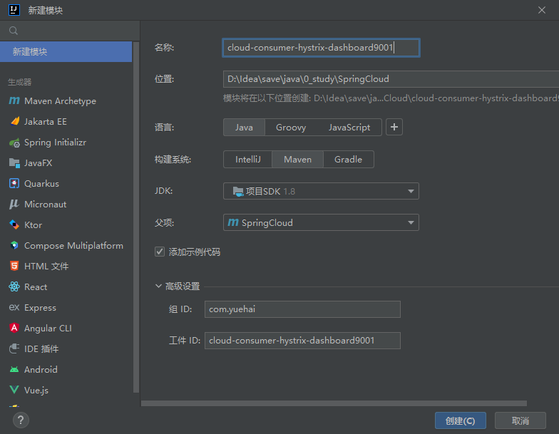

2. 修改 pom.xml

```xml
<?xml version="1.0" encoding="UTF-8"?>
<project xmlns="http://maven.apache.org/POM/4.0.0"
         xmlns:xsi="http://www.w3.org/2001/XMLSchema-instance"
         xsi:schemaLocation="http://maven.apache.org/POM/4.0.0 http://maven.apache.org/xsd/maven-4.0.0.xsd">
    <modelVersion>4.0.0</modelVersion>
    <parent>
        <groupId>com.yuehai</groupId>
        <artifactId>SpringCloud</artifactId>
        <version>1.0-SNAPSHOT</version>
    </parent>
    
    <artifactId>cloud-consumer-hystrix-dashboard9001</artifactId>
    
    <dependencies>
        <!-- 引入自己定义的 api 通用包，可以使用 Payment 支付 Entity -->
        <dependency>
            <groupId>com.yuehai</groupId>
            <artifactId>cloud-api-commons</artifactId>
            <version>1.0-SNAPSHOT</version>
        </dependency>
    
        <dependency>
            <groupId>org.springframework.cloud</groupId>
            <artifactId>spring-cloud-starter-netflix-hystrix-dashboard</artifactId>
        </dependency>
    </dependencies>

</project>
```

3. 修改 yml 配置文件

```yaml
# 服务端口号
server:
    port: 9001
```

4. 修改主启动类，添加注解：`@EnableHystrixDashboard`

```java
package com.yuehai;

import org.springframework.boot.SpringApplication;
import org.springframework.boot.autoconfigure.SpringBootApplication;
import org.springframework.cloud.netflix.hystrix.dashboard.EnableHystrixDashboard;

/**
 * consumer-hystrix-dashboard9001
 * @author 月海
 * @create ${DATE} ${TIME}
 *
 * { @EnableHystrixDashboard }：用来实时监控 Hystrix 的各项指标信息
 */
@SpringBootApplication
@EnableHystrixDashboard
public class ConsumerHystrixDashboard9001 {
    public static void main(String[] args) {
        SpringApplication.run(ConsumerHystrixDashboard9001.class, args);
    }

}
```

5. 修改被监控的微服务提供类 8008 的 pom.xml 文件，增加依赖

```xml
<!-- actuator监控信息完善 -->
<dependency>
    <groupId>org.springframework.boot</groupId>
    <artifactId>spring-boot-starter-actuator</artifactId>
</dependency>
```

6. 修改被监控的微服务提供类 8008 的主启动类

```java
package com.yuehai;

import com.netflix.hystrix.contrib.metrics.eventstream.HystrixMetricsStreamServlet;
import org.springframework.boot.SpringApplication;
import org.springframework.boot.autoconfigure.SpringBootApplication;
import org.springframework.boot.web.servlet.ServletRegistrationBean;
import org.springframework.cloud.client.circuitbreaker.EnableCircuitBreaker;
import org.springframework.cloud.netflix.eureka.EnableEurekaClient;
import org.springframework.context.annotation.Bean;

/**
 * 微服务提供者支付模块 cloud-provider-hystrix-payment8008
 * @author 月海
 * @create ${DATE} ${TIME}
 *
 * { @EnableEurekaClient：作为微服务的服务提供者 }
 * { @EnableCircuitBreaker：开启 Hystrix 熔断器 }
 */
@SpringBootApplication
@EnableEurekaClient
@EnableCircuitBreaker
public class ProviderHystrixPayment8008 {

    public static void main(String[] args) {
        SpringApplication.run(ProviderHystrixPayment8008.class, args);
    }

    /**
     * 此配置是为了服务监控而配置，与服务容错本身无关，springcloud 升级后的坑
     * ServletRegistrationBean 因为 springboot 的默认路径不是 "/hystrix.stream"，
     * 只要在自己的项目里配置上下面的 servlet 就可以了
     */
    @Bean
    public ServletRegistrationBean getServlet() {
        HystrixMetricsStreamServlet streamServlet = new HystrixMetricsStreamServlet();
        ServletRegistrationBean registrationBean = new ServletRegistrationBean(streamServlet);
        registrationBean.setLoadOnStartup(1);
        registrationBean.addUrlMappings("/hystrix.stream");
        registrationBean.setName("HystrixMetricsStreamServlet");
        return registrationBean;
    }

}

```

7. 启动项目，访问：[http://localhost:9001/hystrix](http://localhost:9001/hystrix)


#### Ⅱ、断路器演示(服务监控 hystrixDashboard)

1. 输入要监控的地址，如：[http://localhost:8008/hystrix.stream](http://localhost:8008/hystrix.stream)，点击 Monitor Stream


2. 进入监控页

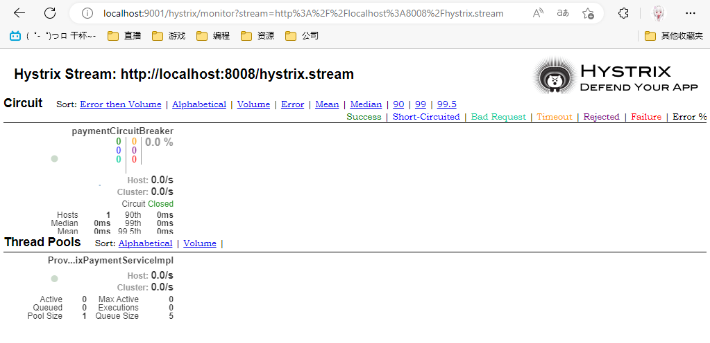

3. 如何看？
   1. 7色：状态

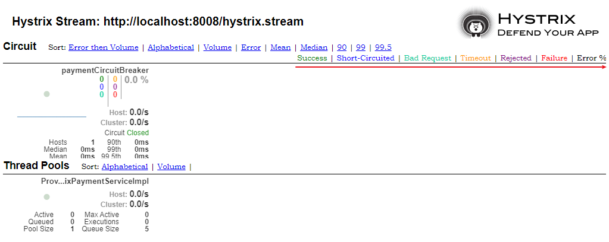

   2. 1 圈：实心圆：共有两种含义。它通过颜色的变化代表了实例的健康程度，它的健康度从绿色<黄色<橙色<红色递减。该实心圆除了颜色的变化之外，它的大小也会根据实例的请求流量发生变化，流量越大该实心圆就越大。所以通过该实心圆的展示，就可以在大量的实例中快速的发现故障实例和高压力实例。
   3. 1 线：曲线：用来记录2分钟内流量的相对变化，可以通过它来观察到流量的上升和下降趋势。
   4. 整图说明


   5. 整图说明2


4. 搞懂一个才能看懂复杂的


## 2、

# 七、路由网关 Gateway

## 1、Gateway

> 官网：
> 上一代 zuul 1.X：[https://github.com/Netflix/zuul/wiki](https://github.com/Netflix/zuul/wiki)
> 当前 gateway：[https://cloud.spring.io/spring-cloud-static/spring-cloud-gateway/2.2.1.RELEASE/reference/html/](https://cloud.spring.io/spring-cloud-static/spring-cloud-gateway/2.2.1.RELEASE/reference/html/)

### ①、简介

#### Ⅰ、是什么

1.  Cloud 全家桶中有个很重要的组件就是网关，在 1.x 版本中都是采用的 Zuul 网关；但在 2.x 版本中，zuul 的升级一直跳票，SpringCloud 最后自己研发了一个网关替代 Zuul，那就是 SpringCloud Gateway 一句话：gateway 是原 zuul 1.x 版的替代

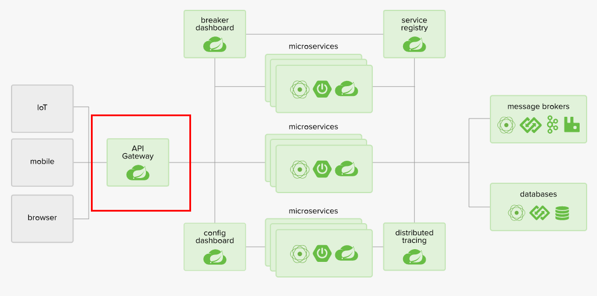

2. SpringCloud Gateway 是 Spring Cloud 的一个全新项目，基于 Spring 5.0+Spring Boot 2.0 和 Project Reactor 等技术开发的网关，它旨在为微服务架构提供一种简单有效的统一的 API 路由管理方式。
3. SpringCloud Gateway 作为 Spring Cloud 生态系统中的网关，目标是替代 Zuul，在 Spring Cloud 2.0 以上版本中，没有对新版本的 Zuul 2.0 以上最新高性能版本进行集成，仍然还是使用的 Zuul 1.x 非 Reactor 模式的老版本。而为了提升网关的性能，SpringCloud Gateway 是基于 WebFlux 框架实现的，而 WebFlux 框架底层则使用了高性能的 Reactor 模式通信框架 Netty。
4. Spring Cloud Gateway 的目标提供统一的路由方式且基于 Filter 链的方式提供了网关基本的功能，例如：安全，监控/指标，和限流。


5. 一句话：SpringCloud Gateway 使用的 Webflux 中的 reactor-netty 响应式编程组件，底层使用了 Netty 通讯框架。
6. 源码架构

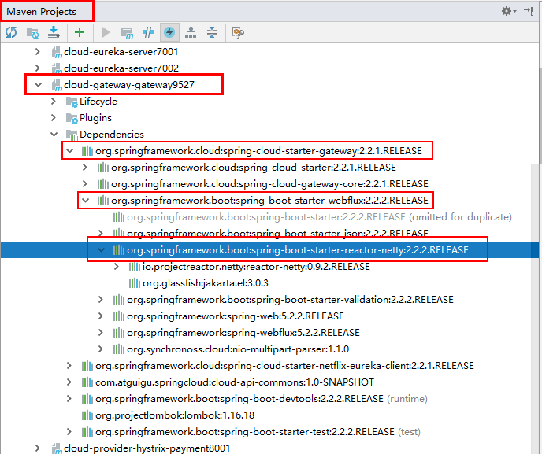

#### Ⅱ、能干嘛

1. 反向代理
2. 鉴权
3. 流量控制
4. 熔断
5. 日志监控
6. 。。。。。。

#### Ⅲ、微服务架构中网关在哪里


#### Ⅳ、SpringCloud Gateway 的特性

1. 基于 Spring Framework 5, Project Reactor 和 Spring Boot 2.0 进行构建；
2. 动态路由：能够匹配任何请求属性；
3. 可以对路由指定 Predicate（断言）和 Filter（过滤器）；
4. 集成 Hystrix 的断路器功能；
5. 集成 Spring Cloud 服务发现功能；
6. 易于编写的 Predicate（断言）和 Filter（过滤器）；
7. 请求限流功能；
8. 支持路径重写。

#### Ⅴ、SpringCloud Gateway 与 Zuul 的区别

- 在 SpringCloud Finchley 正式版之前，Spring Cloud 推荐的网关是 Netflix 提供的 Zuul：
1. Zuul 1.x，是一个基于阻塞 I/ O 的 API Gateway
2. Zuul 1.x 基于 Servlet 2. 5 使用阻塞架构它不支持任何长连接(如 WebSocket) Zuul 的设计模式和Nginx较像，每次 I/O 操作都是从工作线程中选择一个执行，请求线程被阻塞到工作线程完成，但是差别是 Nginx 用 C++ 实现，Zuul 用 Java 实现，而 JVM 本身会有第一次加载较慢的情况，使得 Zuul 的性能相对较差。
3. Zuul 2.x 理念更先进，想基于 Netty 非阻塞和支持长连接，但 SpringCloud 目前还没有整合。 Zuul 2.x 的性能较 Zuul 1.x 有较大提升。在性能方面，根据官方提供的基准测试， Spring Cloud Gateway 的 RPS（每秒请求数）是 Zuul 的 1. 6 倍。
4. Spring Cloud Gateway 建立 在 Spring Framework 5、 Project Reactor 和 Spring Boot 2 之上， 使用非阻塞 API。
5. Spring Cloud Gateway 还 支持 WebSocket， 并且与 Spring 紧密集成拥有更好的开发体验

#### Ⅵ、Zuul 1.x 模型

1. Springcloud 中所集成的 Zuul 版本，采用的是 Tomcat 容器，使用的是传统的 Servlet IO 处理模型。
2. servlet 由 servlet container 进行生命周期管理。
3. container 启动时构造 servlet 对象并调用 servlet init() 进行初始化；
4. container 运行时接受请求，并为每个请求分配一个线程（一般从线程池中获取空闲线程）然后调用 service()。
5. container 关闭时调用 servlet destory() 销毁 servlet；


上述模式的缺点：

1. servlet 是一个简单的网络 IO 模型，当请求进入 servlet container 时，servlet container 就会为其绑定一个线程，在并发不高的场景下这种模型是适用的。但是一旦高并发(比如抽风用 jemeter 压)，线程数量就会上涨，而线程资源代价是昂贵的（上线文切换，内存消耗大）严重影响请求的处理时间。在一些简单业务场景下，不希望为每个 request 分配一个线程，只需要 1 个或几个线程就能应对极大并发的请求，这种业务场景下 servlet 模型没有优势
2. 所以 Zuul 1.X 是基于 servlet 之上的一个阻塞式处理模型，即 spring 实现了处理所有 request 请求的一个 servlet（DispatcherServlet）并由该 servlet 阻塞式处理处理。所以 Springcloud Zuul 无法摆脱 servlet 模型的弊端

#### Ⅶ、GateWay 模型

> [https://docs.spring.io/spring/docs/current/spring-framework-reference/web-reactive.html#webflux-new-framework](https://docs.spring.io/spring/docs/current/spring-framework-reference/web-reactive.html#webflux-new-framework)

1. 传统的 Web 框架，比如说：struts2，springmvc 等都是基于 Servlet API 与 Servlet 容器基础之上运行的。
2. 但是，在 Servlet3.1 之后有了异步非阻塞的支持。而 WebFlux 是一个典型非阻塞异步的框架，它的核心是基于 Reactor 的相关 API 实现的。相对于传统的 web 框架来说，它可以运行在诸如 Netty，Undertow 及支持 Servlet3.1 的容器上。非阻塞式+函数式编程（Spring5 必须让你使用 java8） 
3. Spring WebFlux 是 Spring 5.0 引入的新的响应式框架，区别于 Spring MVC，它不需要依赖 Servlet API，它是完全异步非阻塞的，并且基于 Reactor 来实现响应式流规范。


### ②、三大核心概念

1. Route(路由)：路由是构建网关的基本模块，它由 ID，目标 URI，一系列的断言和过滤器组成，如果断言为 true 则匹配该路由
2. Predicate(断言)：参考的是 Java8 的 java.util.function.Predicate 开发人员可以匹配 HTTP 请求中的所有内容(例如请求头或请求参数)，如果请求与断言相匹配则进行路由
3. Filter(过滤)：指的是 Spring 框架中 GatewayFilter 的实例，使用过滤器，可以在请求被路由前或者之后对请求进行修改。
4. 总体：
   1. web 请求，通过一些匹配条件，定位到真正的服务节点。并在这个转发过程的前后，进行一些精细化控制。
   2. predicate 就是我们的匹配条件；
   3. 而 filter，就可以理解为一个无所不能的拦截器。有了这两个元素，再加上目标 uri，就可以实现一个具体的路由了


### ③、Gateway 工作流程

1. 核心逻辑：路由转发+执行过滤器链
2. 官网总结：
   1. 客户端向 Spring Cloud Gateway 发出请求。然后在 Gateway Handler Mapping 中找到与请求相匹配的路由，将其发送到 Gateway Web Handler。
   2. Handler 再通过指定的过滤器链来将请求发送到我们实际的服务执行业务逻辑，然后返回。
   3. 过滤器之间用虚线分开是因为过滤器可能会在发送代理请求之前（“pre”）或之后（“post”）执行业务逻辑。
   4. Filter在“pre”类型的过滤器可以做参数校验、权限校验、流量监控、日志输出、协议转换等，
   5. 在“post”类型的过滤器中可以做响应内容、响应头的修改，日志的输出，流量监控等有着非常重要的作用。


### ④、入门配置

1. 新建模块 cloud-gateway-gateway9527


2. 修改 pom.xml

```xml
<?xml version="1.0" encoding="UTF-8"?>
<project xmlns="http://maven.apache.org/POM/4.0.0"
         xmlns:xsi="http://www.w3.org/2001/XMLSchema-instance"
         xsi:schemaLocation="http://maven.apache.org/POM/4.0.0 http://maven.apache.org/xsd/maven-4.0.0.xsd">
    <modelVersion>4.0.0</modelVersion>
    <parent>
        <groupId>com.yuehai</groupId>
        <artifactId>SpringCloud</artifactId>
        <version>1.0-SNAPSHOT</version>
    </parent>
    
    <artifactId>cloud-gateway-gateway9527</artifactId>
    
    <dependencies>
        <!--eureka-client-->
        <dependency>
            <groupId>org.springframework.cloud</groupId>
            <artifactId>spring-cloud-starter-netflix-eureka-client</artifactId>
        </dependency>
        <!-- gateway 路由网关-->
        <dependency>
            <groupId>org.springframework.cloud</groupId>
            <artifactId>spring-cloud-starter-gateway</artifactId>
        </dependency>
    </dependencies>

</project>
```

3. 修改 yml 配置文件

```yaml
# 服务端口号
server:
    port: 9527

# spring 配置
spring:
    application:
        # 服务名称  路由网关模块 cloud-gateway-gateway9527
        name: cloud-gateway-gateway
    # cloud 网关配置
    cloud:
        gateway:
            routes:
                # 路由的 ID，没有固定规则但要求唯一，建议配合服务名
                -   id: payment_routh
                    # 匹配后提供服务的路由地址
                    uri: http://localhost:8008
                    # 断言，与 = 右边的路径匹配则进行路由转发
                    predicates:
                        - Path=/hystrixFallback

                # 路由的 ID，没有固定规则但要求唯一，建议配合服务名
                -   id: payment_routh8008
                    # 匹配后提供服务的路由地址
                    uri: http://localhost:8008
                    # 断言，与 = 右边的路径匹配则进行路由转发
                    predicates:
                        - Path=/test/**

# eureka 配置
eureka:
    client:
        # 表示是否将自己注册进 EurekaServer 默认为 true。
        register-with-eureka: true
        # 是否拉取注册信息
        fetch-registry: true
        # 指定 eureka 服务端的注册地址
        service-url:
            # 集群 eureka 间使用 , 分隔
            defaultZone: http://eureka7001.com:7001/eureka, http://eureka7002.com:7002/eureka
    instance:
        # 指定状态名
        instance-id: gateway9527
        # 访问路径可以显示 IP 地址
        prefer-ip-address: true
```

4. 修改主启动类

```java
package com.yuehai;

import org.springframework.boot.SpringApplication;
import org.springframework.boot.autoconfigure.SpringBootApplication;
import org.springframework.cloud.netflix.eureka.EnableEurekaClient;

/**
 * 微服务消费者订单模块 cloud-consumer-feign-hystrix-order80
 * @author 月海
 * @create ${DATE} ${TIME}
 *
 * @EnableEurekaClient：作为微服务的服务提供者
 */
@SpringBootApplication
@EnableEurekaClient
public class Gateway9527 {
    public static void main(String[] args) {
        SpringApplication.run(Gateway9527.class, args);
    }

}
```

5. 启动项目

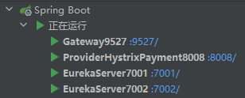

6. 访问 8008：[http://localhost:8008/hystrixFallback?id=1](http://localhost:8008/hystrixFallback?id=1)


7. 访问 8008：[http://localhost:8008/test/triangle](http://localhost:8008/test/triangle)

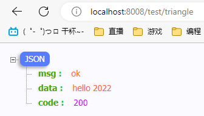

8. 访问 9527：[http://localhost:9527/hystrixFallback?id=1](http://localhost:9527/hystrixFallback?id=1)


9. 访问 9527：[http://localhost:9527/test/triangle](http://localhost:9527/test/triangle)


### ⑤、通过微服务名实现动态路由

> 默认情况下 Gateway 会根据注册中心注册的服务列表，以注册中心上微服务名为路径创建动态路由进行转发，从而实现动态路由的功能

1. 修改 9527 的 application.yml 配置文件；需要注意的是 uri 的协议为 lb，表示启用 Gateway 的负载均衡功能。lb://serviceName 是 spring cloud gateway 在微服务中自动为我们创建的负载均衡 uri

```yaml
# 服务端口号
server:
    port: 9527

# spring 配置
spring:
    application:
        # 服务名称  路由网关模块 cloud-gateway-gateway9527
        name: cloud-gateway-gateway
    # cloud 网关配置
    cloud:
        # gateway 路由网关配置
        gateway:
            # gateway 服务注册与发现配置
            discovery:
                locator:
                    # 开启从注册中心动态创建路由的功能，利用微服务名进行路由
                    enabled: true
            # gateway 路由配置
            routes:
                # 路由的 ID，没有固定规则但要求唯一，建议配合服务名
                -   id: payment_routh8001-2
                    # 匹配后提供服务的路由地址 http / 微服务名称 lb
                    uri: lb://cloud-payment-service
                    # 断言，与 = 右边的路径匹配则进行路由转发
                    predicates:
                        - Path=/test/**

                # 路由的 ID，没有固定规则但要求唯一，建议配合服务名
                -   id: payment_routh8008
                    # 匹配后提供服务的路由地址 http / 微服务名称 lb
                    uri: lb://cloud-provider-hystrix-payment
                    # 断言，与 = 右边的路径匹配则进行路由转发，多条数据以 , 分隔
                    predicates:
                        - Path=/hystrix/**, /hystrixFallback,

# eureka 配置
eureka:
    client:
        # 表示是否将自己注册进 EurekaServer 默认为 true。
        register-with-eureka: true
        # 是否拉取注册信息
        fetch-registry: true
        # 指定 eureka 服务端的注册地址
        service-url:
            # 集群 eureka 间使用 , 分隔
            defaultZone: http://eureka7001.com:7001/eureka, http://eureka7002.com:7002/eureka
    instance:
        # 指定状态名
        instance-id: gateway9527
        # 访问路径可以显示 IP 地址
        prefer-ip-address: true
```

2. 8008 controller 修改

```java
/**
 * 断路器测试
 */
@GetMapping("/hystrixFallback")
public JsonResult hystrixFallback(Integer id){
    return paymentService.paymentCircuitBreaker(id);
}

@GetMapping("/hystrix/triangle")
public JsonResult triangle() {
    return JsonResult.success("hello 2022");
}
```

3. 访问测试：[http://localhost:9527/test/getTest](http://localhost:9527/test/getTest)；会启动负载均衡

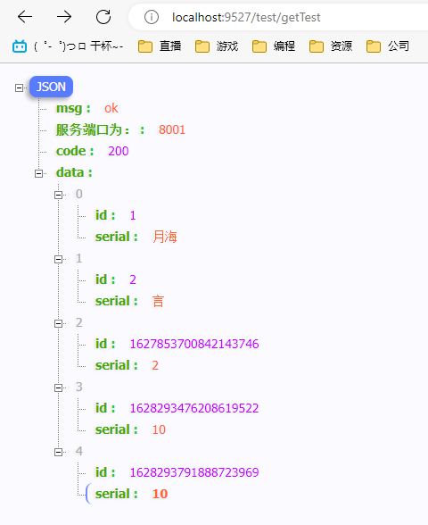

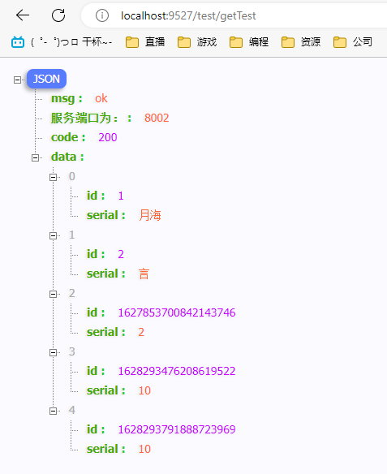

4. 访问测试：[http://localhost:9527/hystrixFallback?id=1](http://localhost:9527/hystrixFallback?id=1)

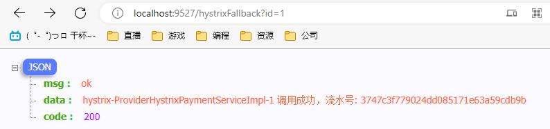

5. 访问测试：[http://localhost:9527/hystrix/triangle](http://localhost:9527/hystrix/triangle)

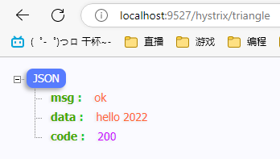

### ⑥、Predicate 的使用

> [https://cloud.spring.io/spring-cloud-static/spring-cloud-gateway/2.2.1.RELEASE/reference/html/#gateway-request-predicates-factories](https://cloud.spring.io/spring-cloud-static/spring-cloud-gateway/2.2.1.RELEASE/reference/html/#gateway-request-predicates-factories)

#### Ⅰ、Predicate 是什么

- 启动 gateway9527，启动日志的显示：

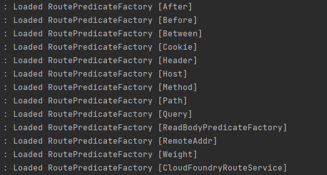

#### Ⅱ、Route Predicate Factories 是什么

1. Spring Cloud Gateway 将路由匹配作为 Spring WebFlux HandlerMapping 基础架构的一部分。
2. Spring Cloud Gateway 包括许多内置的 Route Predicate 工厂。所有这些 Predicate 都与 HTTP 请求的不同属性匹配。多个 Route Predicate 工厂可以进行组合
3. Spring Cloud Gateway 创建 Route 对象时， 使用 RoutePredicateFactory 创建 Predicate 对象，Predicate 对象可以赋值给 Route。 Spring Cloud Gateway 包含许多内置的Route Predicate Factories。
4. 所有这些谓词都匹配 HTTP 请求的不同属性。多种谓词工厂可以组合，并通过逻辑 and。


#### Ⅲ、常用的 Route Predicate

> 说白了，Predicate 就是为了实现一组匹配规则，让请求过来找到对应的 Route 进行处理。

1. After Route Predicate，指定时间 之后 访问才会进行路由转发
2. Before Route Predicate，指定时间 之前 访问才会进行路由转发
3. Between Route Predicate，指定时间 之间 访问才会进行路由转发
4. Cookie Route Predicate，存在指定 cookie 且符合正则才会进行路由转发
5. Header Route Predicate，存在指定请求且值符合正则才会进行路由转发
6. Host Route Predicate，以指定的 url 模板进行访问才会进行路由转发
7. Method Route Predicate，以指定的请求方式进行访问才会进行路由转发
8. Path Route Predicate，以指定的路径进行访问才会进行路由转发
9. Query Route Predicate，要有参数名并且值符合正则才会进行路由转发
10. RemoteAddr Route Predicate，以指定的 ip 与 子网掩码 进行访问才会进行路由转发
11. weight Route Predicate，权重

```java
# 服务端口号
server:
    port: 9527

# spring 配置
spring:
    application:
        # 服务名称  路由网关模块 cloud-gateway-gateway9527
        name: cloud-gateway-gateway
    # cloud 网关配置
    cloud:
        # gateway 路由网关配置
        gateway:
            # gateway 服务注册与发现配置
            discovery:
                locator:
                    # 开启从注册中心动态创建路由的功能，利用微服务名进行路由
                    enabled: true
            # gateway 路由配置
            routes:
                # 路由的 ID，没有固定规则但要求唯一，建议配合服务名
                -   id: payment_routh8001-2
                    # 匹配后提供服务的路由地址 http / 微服务名称 lb
                    uri: lb://cloud-payment-service
                    # 断言，与 = 右边的路径匹配则进行路由转发
                    predicates:
                        - Path=/test/**

                # 路由的 ID，没有固定规则但要求唯一，建议配合服务名
                -   id: payment_routh8008
                    # 匹配后提供服务的路由地址 http / 微服务名称 lb
                    uri: lb://cloud-provider-hystrix-payment
                    # 断言，与 = 右边的路径匹配则进行路由转发，多条数据以 , 分隔
                    predicates:
                        - Path=/hystrix/**, /hystrixFallback,

                # 路由的 ID，没有固定规则但要求唯一，建议配合服务名
                -   id: payment_routh8008-2
                    # 匹配后提供服务的路由地址 http / 微服务名称 lb
                    uri: lb://cloud-provider-hystrix-payment
                    # 断言，与 = 右边的路径匹配则进行路由转发，多条数据以 , 分隔
                    predicates:
                        # After Route Predicate，    指定时间 之后 访问才会进行路由转发
                        - After=2022-02-27T15:10:03.685+08:00[Asia/Shanghai]
                        # Before Route Predicate，   指定时间 之前 访问才会进行路由转发
                        - Before=2022-02-27T15:10:03.685+08:00[Asia/Shanghai]
                        # Between Route Predicate，  指定时间 之间 访问才会进行路由转发
                        - Between=2022-02-25T15:45:06.206+08:00[Asia/Shanghai],2022-03-25T18:59:06.206+08:00[Asia/Shanghai]
                        # Cookie Route Predicate，   存在指定 cookie username 且符合正则（=yuehai）才会进行路由转发
                        - Cookie=username, yuehai
                        # Header Route Predicate，   存在指定请求头 X-Request-Id 且值符合正则（正整数）才会进行路由转发
                        - Header=X-Request-Id, \d+
                        # Host Route Predicate，     以指定的 url 模板进行访问才会进行路由转发
                        - Host=**.yuehai.com
                        # Method Route Predicate，   以指定的请求方式进行访问才会进行路由转发
                        - Method=GET, POST
                        # Path Route Predicate，     以指定的路径进行访问才会进行路由转发
                        - Path=/hystrix/**, /hystrixFallback,
                        # Query Route Predicate，    要有参数名 username 并且值还要是整数才会进行路由转发
                        - Query=username, \d+
                        # RemoteAddr Route Predicate，以指定的 ip 与 子网掩码 进行访问才会进行路由转发
                        - RemoteAddr=192.168.1.1/24
                        # weight Route Predicate，   权重，2 表示权重为 20%，要配置 uri 相同的另一个路由才会起作用
                        - weight=group1, 2

# eureka 配置
eureka:
    client:
        # 表示是否将自己注册进 EurekaServer 默认为 true。
        register-with-eureka: true
        # 是否拉取注册信息
        fetch-registry: true
        # 指定 eureka 服务端的注册地址
        service-url:
            # 集群 eureka 间使用 , 分隔
            defaultZone: http://eureka7001.com:7001/eureka, http://eureka7002.com:7002/eureka
    instance:
        # 指定状态名
        instance-id: gateway9527
        # 访问路径可以显示 IP 地址
        prefer-ip-address: true
```

### ⑦、Filter 的使用

> [https://cloud.spring.io/spring-cloud-static/spring-cloud-gateway/2.2.1.RELEASE/reference/html/#gatewayfilter-factories](https://cloud.spring.io/spring-cloud-static/spring-cloud-gateway/2.2.1.RELEASE/reference/html/#gatewayfilter-factories)

#### Ⅰ、是什么

1. 路由过滤器可用于修改进入的 HTTP 请求和返回的 HTTP 响应，路由过滤器只能指定路由进行使用。
2. Spring Cloud Gateway 内置了多种路由过滤器，他们都由 GatewayFilter 的工厂类来产生

#### Ⅱ、Spring Cloud Gateway 的 Filter

1. 两个生命周期：pre、post
2. 两个种类：GatewayFilter 、GlobalFilter

#### Ⅲ、常用的 GatewayFilter

1. AddRequestParameter

```yaml
# gateway 路由配置
routes:
    # 路由的 ID，没有固定规则但要求唯一，建议配合服务名
    -   id: payment_routh8001-2
        # 匹配后提供服务的路由地址 http / 微服务名称 lb
        uri: lb://cloud-payment-service
        # 过滤器
        filters:
            # 过滤器工厂会在匹配的请求头加上一对请求头，名称为 X-Request-Id 值为 1024
            - AddRequestParameter=X-Request-Id, 1024
        # 断言，与 = 右边的路径匹配则进行路由转发
        predicates:
            - Path=/test/**
```

#### Ⅳ、自定义过滤器

1. 创建 `filter/MyLoginGateWayFilter` 实现类，实现 `GlobalFilter`、 `Ordered` 接口

```java
package com.yuehai.filter;

import org.springframework.cloud.gateway.filter.GatewayFilterChain;
import org.springframework.cloud.gateway.filter.GlobalFilter;
import org.springframework.core.Ordered;
import org.springframework.http.HttpStatus;
import org.springframework.stereotype.Component;
import org.springframework.web.server.ServerWebExchange;
import reactor.core.publisher.Mono;

/**
 * @author 月海
 * @create 2023/2/27 16:01
 *
 * { @Component：注解表明一个类会作为组件类，并告知 Spring 要为这个类创建 bean }
 */

@Component
public class MyLoginGateWayFilter implements GlobalFilter, Ordered {
    @Override
    public Mono<Void> filter(ServerWebExchange exchange, GatewayFilterChain chain) {
        System.out.println("过滤器开始工作");

        String username = exchange.getRequest().getQueryParams().getFirst("username");
        if (username == null){
            System.out.println("用户名为空，不可登录");
            // 返回状态码 406
            exchange.getResponse().setStatusCode(HttpStatus.NOT_ACCEPTABLE);
            return exchange.getResponse().setComplete();
        }

        // 放行
        return chain.filter(exchange);
    }

    @Override
    public int getOrder() {
        return 0;
    }
}

```

2. 访问测试，不加参数：[http://localhost:9527/test/getTest](http://localhost:9527/test/getTest)

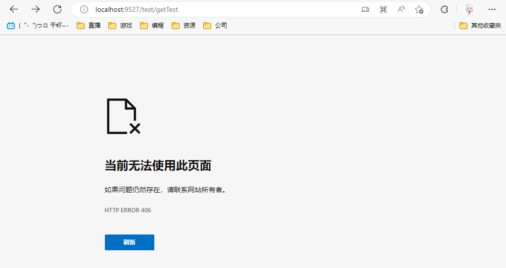

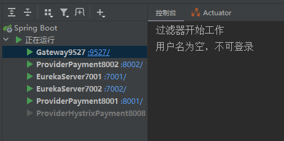

3. 访问测试，加参数：[http://localhost:9527/test/getTest?username=1](http://localhost:9527/test/getTest?username=1)

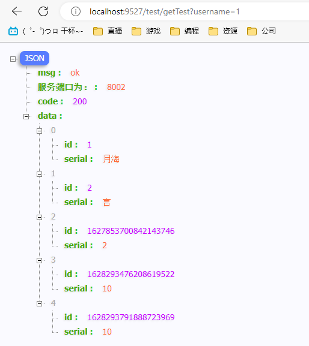


# 八、配置中心 Config

## 1、Config

> [https://cloud.spring.io/spring-cloud-static/spring-cloud-config/2.2.1.RELEASE/reference/html/](https://cloud.spring.io/spring-cloud-static/spring-cloud-config/2.2.1.RELEASE/reference/html/)

### ①、简介

#### Ⅰ、分布式系统面临的配置问题

1. 微服务意味着要将单体应用中的业务拆分成一个个子服务，每个服务的粒度相对较小，因此系统中会出现大量的服务。我们每一个微服务自己带着一个 application.yml，上百个配置文件的管理......
2. 由于每个服务都需要必要的配置信息才能运行，所以一套集中式的、动态的配置管理设施是必不可少的。
3. SpringCloud 提供了 ConfigServer 来解决这个问题。

#### Ⅱ、是什么

1. SpringCloud Config 为微服务架构中的微服务提供集中化的外部配置支持，配置服务器为各个不同微服务应用的所有环境提供了一个中心化的外部配置。
2. SpringCloud Config 分为服务端和客户端两部分。
3. 服务端也称为分布式配置中心，它是一个独立的微服务应用，用来连接配置服务器并为客户端提供获取配置信息，加密/解密信息等访问接口
4. 客户端则是通过指定的配置中心来管理应用资源，以及与业务相关的配置内容，并在启动的时候从配置中心获取和加载配置信息配置服务器默认采用 git 来存储配置信息，这样就有助于对环境配置进行版本管理，并且可以通过 git 客户端工具来方便的管理和访问配置内容。

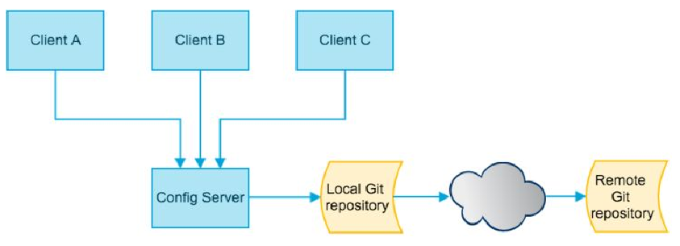

#### Ⅲ、能干嘛

1. 集中管理配置文件
2. 不同环境不同配置，动态化的配置更新，分环境部署比如 dev/test/prod/beta/release
3. 运行期间动态调整配置，不再需要在每个服务部署的机器上编写配置文件，服务会向配置中心统一拉取配置自己的信息
4. 当配置发生变动时，服务不需要重启即可感知到配置的变化并应用新的配置
5. 将配置信息以 REST 接口的形式暴露，post、curl 访问刷新均可

#### Ⅳ、与 GitHub 整合配置

- 由于 SpringCloud Config 默认使用 Git 来存储配置文件(也有其它方式，比如支持 SVN 和本地文件)， 但最推荐的还是 Git，而且使用的是 http/https 访问的形式

### ②、Config 服务端配置与测试

1. 在 gitee 上创建一个仓库 SpringCloud-config
2. 将仓库克隆到本地


3. 在 SpringCloud-config 中创建 config 目录，然后在其中创建 yml 文件 payment-8001-8002.yml

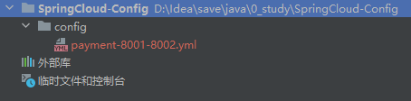

```yaml
# 服务端口号
server:
    port: 8001

# spring 配置
spring:
    application:
        # 服务名称 微服务提供者支付模块 cloud-provider-payment8001
        name: cloud-payment-service
    datasource:
        # mysql驱动包 com.mysql.jdbc.Driver
        driver-class-name: com.mysql.jdbc.Driver
        # 连接信息
        # characterEncoding=UTF-8：指定所处理字符的解码和编码的格式
        # useSSL=false：不进行 SSL 连接
        # allowPublicKeyRetrieval=true：允许恶意代理执行MITM攻击以获取明文密码，因此它在默认情况下为False，必须显式启用
        # serverTimezone=GMT：格林尼治标准时间
        url: jdbc:mysql://43.138.106.181:3306/SpringCloud??characterEncoding=UTF-8&useSSL=false&allowPublicKeyRetrieval=true&serverTimezone=GMT
        # 用户名
        username: root
        # 密码（以 0 开头要加引号）
        password: "000123"

# 配置 MyBatis-Plus 规则
mybatis-plus:
    configuration:
        # 是否开启自动驼峰命名规则映射
        map-underscore-to-camel-case: true
        # 开启 mybatis 的 sql 执行日志打印，可以在控制台打印输出 sql 语句
        log-impl: org.apache.ibatis.logging.stdout.StdOutImpl

eureka:
    client:
        # 表示是否将自己注册进 EurekaServer 默认为 true。
        register-with-eureka: true
        # 是否从 EurekaServer 抓取已有的注册信息，默认为 true。单节点无所谓，集群必须设置为 true 才能配合 ribbon使 用负载均衡
        fetchRegistry: true
        # 指定 eureka 服务端的注册地址 (Eureka Server 的分区地址)
        service-url:
            # 集群 eureka 间使用 , 分隔
            defaultZone: http://eureka7001.com:7001/eureka, http://eureka7002.com:7002/eureka
    instance:
        # 指定状态名
        instance-id: payment8001
        # 访问路径可以显示 IP 地址
        prefer-ip-address: true


```

4. 推送到仓库

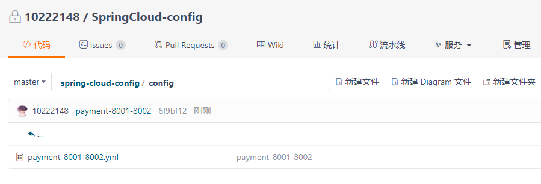

5. 新建 Module 模块 cloud-config-center3344，它即为 Cloud 的配置中心模块 cloudConfig Center

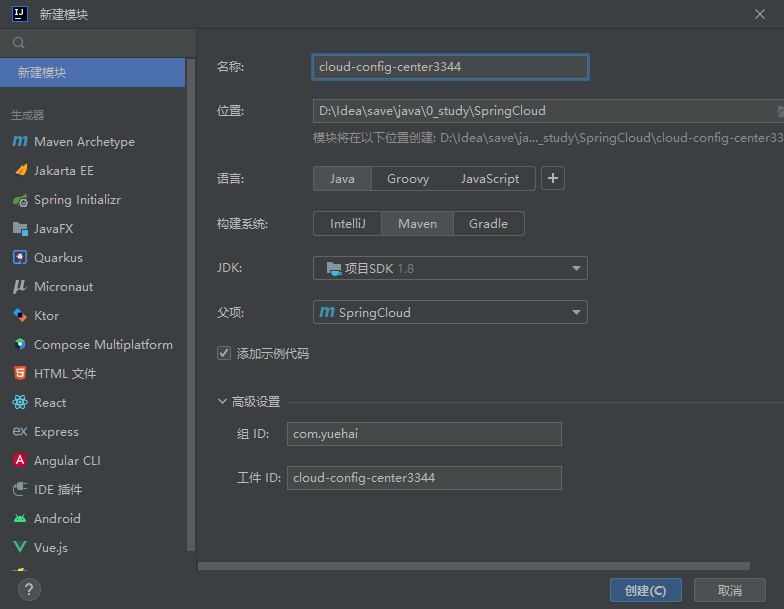

6. 修改 pom.xml

```xml
<?xml version="1.0" encoding="UTF-8"?>
<project xmlns="http://maven.apache.org/POM/4.0.0"
         xmlns:xsi="http://www.w3.org/2001/XMLSchema-instance"
         xsi:schemaLocation="http://maven.apache.org/POM/4.0.0 http://maven.apache.org/xsd/maven-4.0.0.xsd">
    <modelVersion>4.0.0</modelVersion>
    <parent>
        <groupId>com.yuehai</groupId>
        <artifactId>SpringCloud</artifactId>
        <version>1.0-SNAPSHOT</version>
    </parent>
    
    <artifactId>cloud-config-center3344</artifactId>
    
    <dependencies>
        <!-- 引入自己定义的 api 通用包，可以使用 Payment 支付 Entity -->
        <dependency>
            <groupId>com.yuehai</groupId>
            <artifactId>cloud-api-commons</artifactId>
            <version>1.0-SNAPSHOT</version>
        </dependency>
    
        <!-- eureka-client 服务注册 -->
        <dependency>
            <groupId>org.springframework.cloud</groupId>
            <artifactId>spring-cloud-starter-netflix-eureka-client</artifactId>
        </dependency>
        <!-- spring-cloud-config-server 分布式配置中心服务端 -->
        <dependency>
            <groupId>org.springframework.cloud</groupId>
            <artifactId>spring-cloud-config-server</artifactId>
        </dependency>
    </dependencies>

</project>
```

7. 修改 yml 配置文件

```yaml
# 服务端口号
server:
    port: 3344

# spring 配置
spring:
    application:
        # 服务名称，注册进 Eureka 服务器的微服务名，分布式配置中心模块 cloud-config-center3344
        name: cloud-config-center
    # 分布式微服务配置
    cloud:
        # 配置中心配置
        config:
            # 配置中心服务端配置
            server:
                # 配置中心服务端所在 git 配置
                git:
                    # git 上面的 git 仓库地址
                    uri: https://gitee.com/yuehaiyan/spring-cloud-config.git
                    # 搜索目录，根目录即为项目的根目录
                    search-paths:
                        - config
                    # 默认读取分支
                    default-label: master
                    # git 的账号
                    username: 15763736394
                    # git 的密码
                    password: ccj19960920

eureka:
    client:
        # 指定 eureka 服务端的注册地址 (Eureka Server 的分区地址)
        service-url:
            # 集群 eureka 间使用 , 分隔
            defaultZone: http://eureka7001.com:7001/eureka, http://eureka7002.com:7002/eureka
    instance:
        # 指定状态名
        instance-id: config-center3344
        # 访问路径可以显示 IP 地址
        prefer-ip-address: true


```

8. 修改主启动类

```java
package com.yuehai;

import org.springframework.boot.SpringApplication;
import org.springframework.boot.autoconfigure.SpringBootApplication;
import org.springframework.cloud.config.server.EnableConfigServer;

/**
 * 微服务提供者支付模块 cloud-provider-payment8001
 * @author 月海
 * @create ${DATE} ${TIME}
 *
 * { @EnableConfigServer }：作为配置中心的服务端
 */

@SpringBootApplication
@EnableConfigServer
public class ConfigCenter3344 {

    public static void main(String[] args) {
        SpringApplication.run(ConfigCenter3344.class, args);
    }

}

```

9. 修改 `C:\Windows\System32\drivers\etc\hosts` 文件，增加映射 `127.0.0.1  config-3344.com`

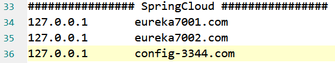

10. 先启动 eureka 7001、7002，再启动 cloud-config-center3344 模块
11. 访问测试：[http://config-3344.com:3344/master/payment-8001-8002.yml](http://config-3344.com:3344/master/payment-8001-8002.yml)，正序输入路径，返回的是文件

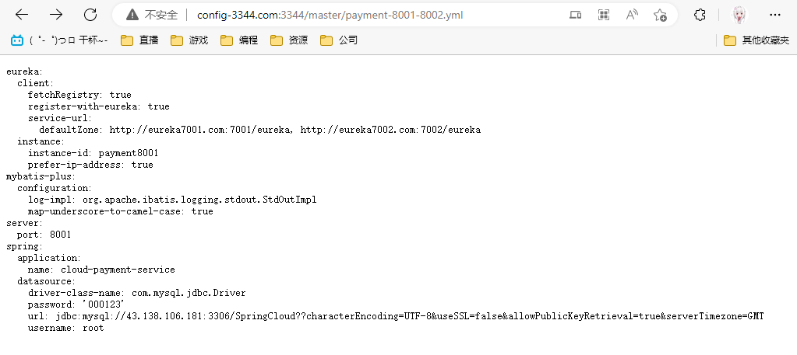

12. 访问测试：[http://config-3344.com:3344/payment-8001-8002/master](http://config-3344.com:3344/payment-8001-8002/master)，倒序输入路径且不输入文件后缀，返回的是 json

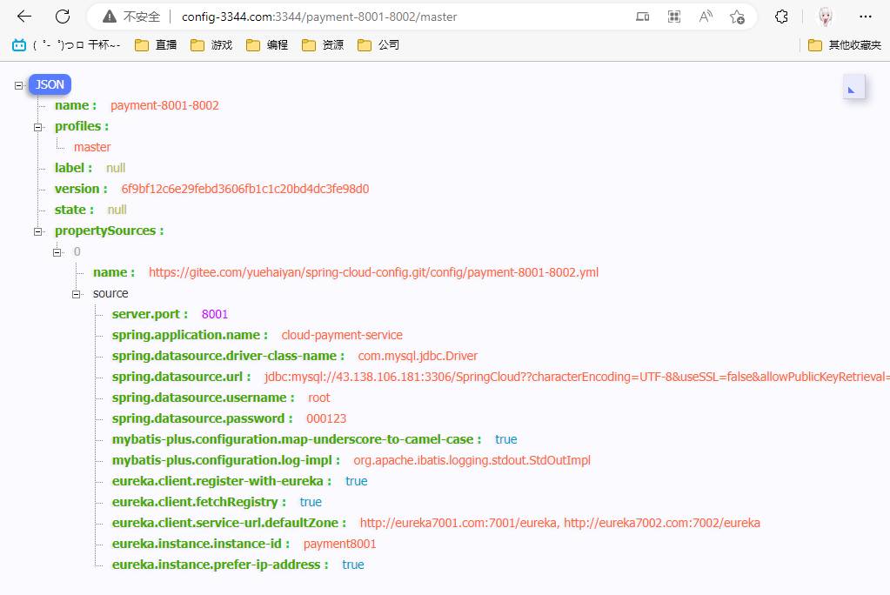

### ③、Config 客户端配置与测试

1. SpringCloud-config 项目中新增配置文件 cloud-config-client.yml，输入内容并提交到 git

```yaml
# spring 配置
spring:
    datasource:
        # mysql驱动包 com.mysql.jdbc.Driver
        driver-class-name: com.mysql.jdbc.Driver
        # 连接信息
        # characterEncoding=UTF-8：指定所处理字符的解码和编码的格式
        # useSSL=false：不进行 SSL 连接
        # allowPublicKeyRetrieval=true：允许恶意代理执行MITM攻击以获取明文密码，因此它在默认情况下为False，必须显式启用
        # serverTimezone=GMT：格林尼治标准时间
        url: jdbc:mysql://43.138.106.181:3306/SpringCloud??characterEncoding=UTF-8&useSSL=false&allowPublicKeyRetrieval=true&serverTimezone=GMT
        # 用户名
        username: root
        # 密码（以 0 开头要加引号）
        password: "000123"

# 配置 MyBatis-Plus 规则
mybatis-plus:
    configuration:
        # 是否开启自动驼峰命名规则映射
        map-underscore-to-camel-case: true
        # 开启 mybatis 的 sql 执行日志打印，可以在控制台打印输出 sql 语句
        log-impl: org.apache.ibatis.logging.stdout.StdOutImpl


```

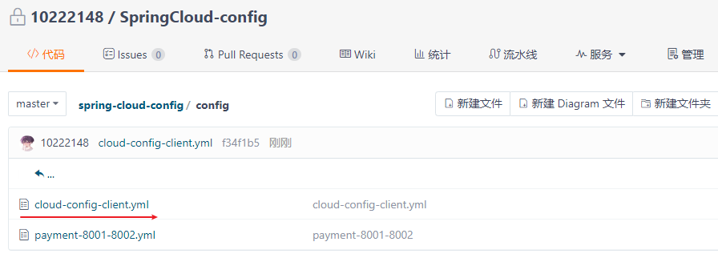

2. 新建模块 cloud-config-client3355


3. 修改 pom.xml

```xml
<?xml version="1.0" encoding="UTF-8"?>
<project xmlns="http://maven.apache.org/POM/4.0.0"
         xmlns:xsi="http://www.w3.org/2001/XMLSchema-instance"
         xsi:schemaLocation="http://maven.apache.org/POM/4.0.0 http://maven.apache.org/xsd/maven-4.0.0.xsd">
    <modelVersion>4.0.0</modelVersion>
    <parent>
        <groupId>com.yuehai</groupId>
        <artifactId>SpringCloud</artifactId>
        <version>1.0-SNAPSHOT</version>
    </parent>
    
    <artifactId>cloud-config-client3355</artifactId>
    
    <dependencies>
        <!-- 引入自己定义的 api 通用包，可以使用 Payment 支付 Entity -->
        <dependency>
            <groupId>com.yuehai</groupId>
            <artifactId>cloud-api-commons</artifactId>
            <version>1.0-SNAPSHOT</version>
        </dependency>
    
        <!-- eureka-client 服务注册 -->
        <dependency>
            <groupId>org.springframework.cloud</groupId>
            <artifactId>spring-cloud-starter-netflix-eureka-client</artifactId>
        </dependency>
        <!-- spring-cloud-config-server 分布式配置中心服务端 -->
        <dependency>
            <groupId>org.springframework.cloud</groupId>
            <artifactId>spring-cloud-starter-config</artifactId>
        </dependency>
    </dependencies>

</project>
```

4. 创建 bootstrap.yml 文件，bootstrap.yml 是什么：
   1. applicaiton.yml 是用户级的资源配置项，bootstrap.yml 是系统级的，优先级更加高
   2. Spring Cloud 会创建一个“Bootstrap Context”，作为 Spring 应用的 `Application Context`的父上下文。初始化的时候，`Bootstrap Context`负责从外部源加载配置属性并解析配置。这两个上下文共享一个从外部获取的 `Environment`
   3. `Bootstrap` 属性有高优先级，默认情况下，它们不会被本地配置覆盖。 `Bootstrap context` 和 `Application Context`有着不同的约定，所以新增了一个`bootstrap.yml`文件，保证 `Bootstrap Context` 和 `Application Context` 配置的分离。
   4. 要将 Client 模块下的 application.yml 文件改为 bootstrap.yml，这是很关键的，因为 bootstrap.yml 是比 application.yml 先加载的。bootstrap.yml 优先级高于application.yml

```yaml
# 服务端口号
server:
    port: 3355

# spring 配置
spring:
    application:
        # 服务名称，注册进 Eureka 服务器的微服务名，分布式配置中心客户端模块 cloud-config-client3355
        name: cloud-config-client
    # 分布式微服务配置
    cloud:
        # 配置中心客户端配置
        config:
            # 配置中心地址
            uri: http://config-3344.com:3344
            # 分支名称
            label: master
            # 配置文件名称
            name: cloud-config
            # 读取后缀名称；上面 4 个结合，最终读取的是：http://config-3344.com:3344/master/cloud-config-client.yml
            profile: client

eureka:
    client:
        # 指定 eureka 服务端的注册地址 (Eureka Server 的分区地址)
        service-url:
            # 集群 eureka 间使用 , 分隔
            defaultZone: http://eureka7001.com:7001/eureka, http://eureka7002.com:7002/eureka
    instance:
        # 指定状态名
        instance-id: config-client3355
        # 访问路径可以显示 IP 地址
        prefer-ip-address: true

```

5. 修改主启动类

```java
package com.yuehai;

import org.springframework.boot.SpringApplication;
import org.springframework.boot.autoconfigure.SpringBootApplication;
import org.springframework.cloud.netflix.eureka.EnableEurekaClient;

/**
 * 微服务提供者支付模块 cloud-provider-payment8001
 * @author 月海
 * @create ${DATE} ${TIME}
 *
 * @EnableEurekaClient：作为微服务的服务提供者
 */

@SpringBootApplication
@EnableEurekaClient
public class ConfigClient3355 {

    public static void main(String[] args) {
        SpringApplication.run(ConfigClient3355.class, args);
    }

}

```

6. 编写业务类 controller

```java
package com.yuehai.controller;

import com.yuehai.utils.JsonResult;
import org.springframework.beans.factory.annotation.Value;
import org.springframework.web.bind.annotation.GetMapping;
import org.springframework.web.bind.annotation.RestController;

/**
 * @author 月海
 * @create 2023/2/28 11:03
 */

@RestController
public class ConfigClientController {

    @Value("${spring.datasource.username}")
    private String datasourceUsername;

    @Value("${spring.datasource.password}")
    private String datasourcePassword;

    @Value("${spring.datasource.url}")
    private String datasourceUrl;


    @GetMapping("/getConfig")
    public JsonResult getConfig(){
        return JsonResult.success("账号："+ datasourceUsername +"，密码："+ datasourcePassword +"\r\n连接地址：" + datasourceUrl);
    }
}

```

7. 访问测试：[http://localhost:3355/getConfig](http://localhost:3355/getConfig)


8. 问题随时而来，分布式配置的动态刷新问题
   1. Linux 运维修改 GitHub 上的配置文件内容做调整
   2. 刷新 3344，发现 ConfigServer 配置中心立刻响应
   3. 刷新 3355，发现 ConfigClient 客户端没有任何响应
   4. 3355 没有变化除非自己重启或者重新加载
   5. 难到每次运维修改配置文件，客户端都需要重启？？噩梦

### ④、Config 客户端之动态刷新

> 避免每次更新配置都要重启客户端微服务 3355

1. 修改 3355 模块
2. POM 引入 actuator 监控（cloud-api-commons 公共模块本来就有这个依赖了，不用引入）
3. 修改 bootstrap.yml 配置文件，新增暴露监控端点

```yaml
# 服务端口号
server:
    port: 3355

# spring 配置
spring:
    application:
        # 服务名称，注册进 Eureka 服务器的微服务名，分布式配置中心客户端模块 cloud-config-client3355
        name: cloud-config-client
    # 分布式微服务配置
    cloud:
        # 配置中心客户端配置
        config:
            # 配置中心地址
            uri: http://config-3344.com:3344
            # 分支名称
            label: master
            # 配置文件名称
            name: cloud-config
            # 读取后缀名称；上面 4 个结合，最终读取的是：http://config-3344.com:3344/master/cloud-config-client.yml
            profile: client

eureka:
    client:
        # 指定 eureka 服务端的注册地址 (Eureka Server 的分区地址)
        service-url:
            # 集群 eureka 间使用 , 分隔
            defaultZone: http://eureka7001.com:7001/eureka, http://eureka7002.com:7002/eureka
    instance:
        # 指定状态名
        instance-id: config-client3355
        # 访问路径可以显示 IP 地址
        prefer-ip-address: true

# 暴露监控端点
management:
    endpoints:
        web:
            exposure:
                # 暴露所有端点 默认是 info, health
                include: "*"
```

4. 修改业务类 ConfigClientController，新增注解 `@RefreshScope`：动态刷新

```java
package com.yuehai.controller;

import com.yuehai.utils.JsonResult;
import org.springframework.beans.factory.annotation.Value;
import org.springframework.cloud.context.config.annotation.RefreshScope;
import org.springframework.web.bind.annotation.GetMapping;
import org.springframework.web.bind.annotation.RestController;

/**
 * @author 月海
 * @create 2023/2/28 11:03
 *
 * { @RefreshScope }：配置动态刷新
 */

@RestController
@RefreshScope
public class ConfigClientController {

    @Value("${spring.datasource.username}")
    private String datasourceUsername;

    @Value("${spring.datasource.password}")
    private String datasourcePassword;

    @Value("${spring.datasource.url}")
    private String datasourceUrl;

    @GetMapping("/getConfig")
    public JsonResult getConfig(){
        return JsonResult.success("账号："+ datasourceUsername +"，密码："+ datasourcePassword +"\r\n连接地址：" + datasourceUrl);
    }
}

```

5. 访问测试：[http://localhost:3355/getConfig](http://localhost:3355/getConfig)

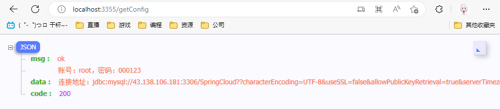

6. 修改 git 上的配置文件

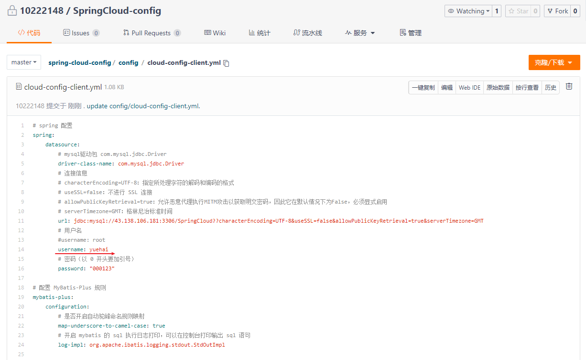

7. 第二次访问测试：[http://localhost:3355/getConfig](http://localhost:3355/getConfig)，没有发生变化

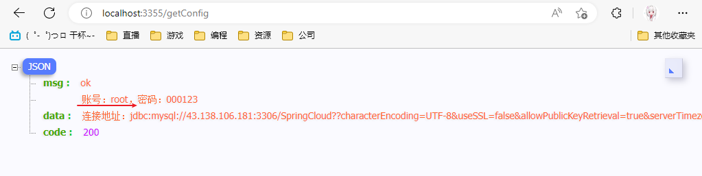

8. 发送 Post 请求刷新 3355：[http://localhost:3355/actuator/refresh](http://localhost:3355/actuator/refresh)


9. 第三次访问测试：[http://localhost:3355/getConfig](http://localhost:3355/getConfig)，发生了变化


### ⑤、想想还有什么问题？

1. 假如有多个微服务客户端 3355/3366/3377。。。。。。
2. 每个微服务都要执行一次 post 请求，手动刷新？
3. 可否广播，一次通知，处处生效？
4. 我们想大范围的自动刷新，求方法

## 2、

# 九、消息总线 Bus

## 1、Bus

### ①、简介

1. Spring Cloud Bus 配合 Spring Cloud Config 使用可以实现配置的动态刷新。
2. Spring Cloud Bus 是用来将分布式系统的节点与轻量级消息系统链接起来的框架，它整合了 Java 的事件处理机制和消息中间件的功能。Spring Clud Bus 目前支持 RabbitMQ 和 Kafka。


3. Spring Cloud Bus 能管理和传播分布式系统间的消息，就像一个分布式执行器，可用于广播状态更改、事件推送等，也可以当作微服务间的通信通道。

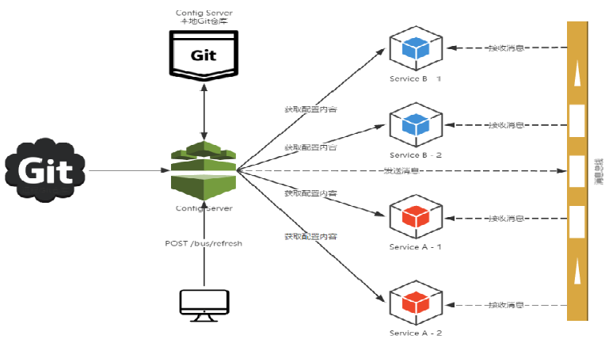

4. 什么是总线：在微服务架构的系统中，通常会使用轻量级的消息代理来构建一个共用的消息主题，并让系统中所有微服务实例都连接上来。由于该主题中产生的消息会被所有实例监听和消费，所以称它为消息总线。在总线上的各个实例，都可以方便地广播一些需要让其他连接在该主题上的实例都知道的消息。
5. 基本原理：ConfigClient 实例都监听 MQ 中同一个 topic(默认是 springCloudBus)。当一个服务刷新数据的时候，它会把这个信息放入到 Topic 中，这样其它监听同一 Topic 的服务就能得到通知，然后去更新自身的配置。

### ②、先不看

### ③、

### ④、

### ⑤、

### ⑥、

### ⑦、

## 2、

# 十、消息驱动 Stream

# 十一、分布式请求链路跟踪 Sleuth
