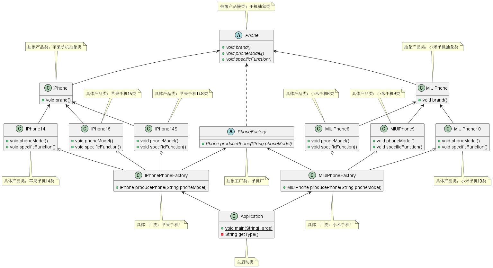

> 尚硅谷：https://www.bilibili.com/video/BV1G4411c7N4

# 一、设计模式七大原则

## 1、设计模式的重要性和目的

### ①、设计模式的重要性

1. 软件工程中，设计模式（design pattern）是对软件设计中普遍存在（反复出现）的各种问题，所提出的解决方案。这个术语是由埃里希·伽玛（Erich Gamma）等人在 1990 年代从建筑设计领域引入到计算机科学的
2. 大厦 VS 简易房


3. 拿实际工作经历来说, 当一个项目开发完后，如果客户提出增新功能，怎么办？
4. 如果项目开发完后，原来程序员离职，你接手维护该项目怎么办? (维护性、可读性、规范性)
5. 目前程序员门槛越来越高，一线 IT 公司(大厂)，都会问你在实际项目中使用过什么设计模式，怎样使用的，解决了什么问题。
6. 设计模式在软件中哪里？面向对象(oo) =>功能模块（设计模式 + 算法(数据结构)）=> 框架（使用到多种设计模式）=> 架构）服务器集群）
7. 如果想成为合格软件工程师，那就花时间来研究下设计模式是非常必要的

### ②、设计模式的目的

编写软件过程中，程序员面临着来自耦合性，内聚性以及可维护性，可扩展性，重用性，灵活性等多方面的挑战，设计模式是为了让程序(软件)，具有更好的：
1. 代码重用性 ：相同功能的代码，不用多次编写
2. 可读性 ：编程规范性, 便于其他程序员的阅读和理解
3. 可扩展性：当需要增加新的功能时，非常的方便，称为可维护
4. 可靠性 ：当我们增加新的功能后，对原来的功能没有影响
5. 使程序呈现高内聚，低耦合的特性
- 设计模式包含了面向对象的精髓，“懂了设计模式，你就懂了面向对象分析和设计（OOA/D）的精要”
- Scott Mayers 在其巨著《Effective C++》就曾经说过：C++ 老手和 C++ 新手的区别就是前者手背上有很多伤疤

## 2、设计模式七大原则

设计模式原则，其实就是程序员在编程时，应当遵守的原则，也是各种设计模式的基础(即：设计模式为什么这样设计的依据)，设计模式常用的七大原则有：
1. 单一职责原则
2. 接口隔离原则
3. 依赖倒转(倒置)原则
4. 里氏替换原则
5. 开闭原则
6. 迪米特法则
7. 合成复用原则

## 3、单一职责原则

### ①、基本介绍

1. 对类来说的，即一个类应该只负责一项职责。
2. 如类 A 负责两个不同职责：职责 1，职责 2，当职责 1 需求变更而改变 A 时，可能造成职责 2 执行错误，所以需要将类A的粒度分解为 A1，A2

### ②、注意事项和细节

单一职责原则注意事项和细节
1. 降低类的复杂度，一个类只负责一项职责。
2. 提高类的可读性，可维护性
3. 降低变更引起的风险
4. 通常情况下，我们应当遵守单一职责原则，只有逻辑足够简单，才可以在代码级违反单一职责原则；只有类中方法数量足够少，可以在方法级别保持单一职责原则

## 4、接口隔离原则

### ①、基本介绍

1. 客户端不应该依赖它不需要的接口，即一个类对另一个类的依赖应该建立在最小的接口上


2. 类A通过接口Interface1依赖类B，类C通过接口Interface1依赖类D，如果接口Interface1对于类A和类C来说不是最小接口，那么类B和类D必须去实现他们不需要的方法。
3. 按隔离原则应当这样处理：
	1. 将接口Interface1拆分为独立的几个接口，
	2. 类A和类C分别与他们需要的接口建立依赖
	3. 关系。也就是采用接口隔离原则

### ②、应传统方法的问题和使用接口隔离原则改进

1. 类 A 通过接口 Interface1 依赖类 B，类 C 通过接口 Interface1 依赖类 D，如果接口 Interface1 对于类 A 和类 C 来说不是最小接口，那么类 B 和类 D 必须去实现他们不需要的方法
2. 将接口 Interface1 拆分为独立的几个接口，类 A 和类 C 分别与他们需要的接口建立依赖关系。也就是采用接口隔离原则
3) 接口 Interface1 中出现的方法，根据实际情况拆分为三个接口

## 5、依赖倒转原则

### ①、基本介绍

1. 高层模块不应该依赖低层模块，二者都应该依赖其抽象
2. 抽象不应该依赖细节，细节应该依赖抽象
3. 依赖倒转(倒置)的中心思想是面向接口编程
4. 依赖倒转原则是基于这样的设计理念：
	1. 相对于细节的多变性，抽象的东西要稳定的多。
	2. 以抽象为基础搭建的架构比以细节为基础的架构要稳定的多。
	3. 在 java 中，抽象指的是接口或抽象类，细节就是具体的实现类
5. 使用接口或抽象类的目的是制定好规范，而不涉及任何具体的操作，把展现细节的任务交给他们的实现类去完成

### ②、注意事项和细节

1. 低层模块尽量都要有抽象类或接口，或者两者都有，程序稳定性更好
2. 变量的声明类型尽量是抽象类或接口, 这样我们的变量引用和实际对象间，就存在一个缓冲层，利于程序扩展和优化
3. 继承时遵循里氏替换原则

### ③、案例

#### Ⅰ、错误的例子

1. 编写学习方法

```java
public class StartLearning {
    /**
     * 学习 JAVA
     */
    public void studyJavaCourse() {
        System.out.println("月海 学习 JAVA");
    }

	/**
     * 学习 设计模式
     */
    public void studyDesignPatternCourse() {
        System.out.println("月海 学习 设计模式");
    }
}
```

2. 调用学习方法

```java
public class Application {
    public static void main(String[] args) {
        // 实例化 StartLearning 类
        StartLearning startLearning = new StartLearning();
        // 调用 StartLearning 类中的 study 方法
        startLearning.studyJavaCourse();
        startLearning.studyDesignPatternCourse();
    }
}

```

#### Ⅱ、上面代码的修改原因和问题

##### （1）、原因一：有效控制影响范围

1. 由于月海热爱学习，随着学习兴趣的 “暴增”，可能会继续学习 AI（人工智能）的课程
2. 这个时候，因为「业务的扩展」，要从底层实现到高层调用依次地修改代码。
3. 我们需要在 `StartLearning` 类中新增 `studyAICourse()` 方法，也需要在高层调用中增加调用，这样一来，系统发布后，其实是非常不稳定的。
4. 显然在这个简单的例子中，我们还可以自信地认为，我们能 Hold 住这一次的修改带来的影响，因为都是新增的代码，我们回归的时候也可以很好地 cover 住，但实际的情况和实际的软件环境要复杂得多。
5. 最理想的情况就是，我们已经编写好的代码可以 “万年不变”，这就意味着已经覆盖的单元测试可以不用修改，已经存在的行为可以保证保持不变，这就意味着「稳定」。任何代码上的修改带来的影响都是有未知风险的，不论看上去多么简单。

##### （2）、原因二：增强代码可读性和可维护性

1. 另外一点，你有没有发现其实加上新增的 AI 课程的学习，他们三节课本质上行为都是一样的
2. 如果我们任由这样行为近乎一样的代码在我们的类里面肆意扩展的话，很快我们的类就会变得臃肿不堪
3. 等到我们意识到不得不重构这个类以缓解这样的情况的时候，或许成本已经变得高得可怕了。

##### （3）、原因三：降低耦合

《资本论》中有这样一段描述：

> 在商品经济的萌芽时期，出现了物物交换。
> 假设你要买一个 iPhone，卖 iPhone 的老板让你拿一头猪跟他换，可是你并没有养猪，你只会编程。
> 所以你找到一位养猪户，说给他做一个养猪的 APP 来换他一头猪
> 他说换猪可以，但是得用一条金项链来换…

1. 所以这里就出现了一连串的对象依赖，从而造成了严重的耦合灾难。
2. 解决这个问题的最好的办法就是，买卖双方都依赖于抽象：也就是货币，来进行交换，这样一来耦合度就大为降低了

#### Ⅲ、上面问题的解决方法和修改后的代码

0. 我们现在的代码是上层直接依赖低层实现，现在我们需要定义一个抽象的 ICourse 接口，来对这种强依赖进行解耦（就像上面《资本论》中的例子那样）：


1. 先定一个课程的抽象接口 `Course`

```java
package com.yuehai._03_依赖倒转原则;

/**
 * @author 月海
 * @create 2023/7/21 9:54
 * 课程接口
 */
public interface Course {
    /**
     * 学习的课程
     */
    void study();
}
```

2. 然后编写分别为 `JavaCourse` 和 `DesignPatternCourse` 编写一个类，实现抽象接口 Course

```java
package com.yuehai._03_依赖倒转原则;

/**
 * @author 月海
 * @create 2023/7/21 9:55
 * 学习 java 课程
 */
public class JavaCourse implements Course{
    @Override
    public void study() {
        System.out.println("月海 学习 JAVA");
    }
}
```

```java
package com.yuehai._03_依赖倒转原则;

/**
 * @author 月海
 * @create 2023/7/21 9:57
 * 学习 设计模式 课程
 */
public class DesignPatternCourse implements Course{
    @Override
    public void study() {
        System.out.println("月海 学习 设计模式");
    }
}
```

3. 然后把 `StartLearning` 类改造成如下的样子：

```java
package com.yuehai._03_依赖倒转原则;

/**
 * @author 月海
 * @create 2023/7/21 9:58
 */
public class StartLearning {
    /**
     * 学习方法，根据传递进来的不同 Course 接口的实现类，进而调用不同的方法
     * @param course 课程接口
     */
    public void study(Course course){
        course.study();
    }
}

```

4. 最后是调用：

```java
package com.yuehai._03_依赖倒转原则;

/**
 * @author 月海
 * @create 2023/7/21 10:02
 * 主启动类
 */
public class Application {
    public static void main(String[] args) {
        // 实例化 StartLearning 类
        StartLearning startLearning = new StartLearning();
        // 调用 StartLearning 类中的 study 方法，根据传递的不同 Course 接口的实现类，进而调用不同的方法
        startLearning.study(new JavaCourse());
        startLearning.study(new DesignPatternCourse());
    }
}

```

#### Ⅳ、总结

1. 这时候我们再来看代码，无论兴趣怎么暴涨，对于新的课程，都只需要新建一个类，通过参数传递的方式告诉它，而不需要修改底层的代码。实际上这有点像大家熟悉的依赖注入的方式了。
2. 总之，切记：以抽象为基准比以细节为基准搭建起来的架构要稳定得多，因此在拿到需求后，要面相接口编程，先顶层设计再细节地设计代码结构。

## 6、里氏替换原则

### ①、OO 中的继承性的思考和说明

1. 继承包含这样一层含义：父类中凡是已经实现好的方法，实际上是在设定规范和契约，虽然它不强制要求所有的子类必须遵循这些契约，但是如果子类对这些已经实现的方法任意修改，就会对整个继承体系造成破坏。
2. 继承在给程序设计带来便利的同时，也带来了弊端。比如使用继承会给程序带来侵入性，程序的可移植性降低，增加对象间的耦合性，如果一个类被其他的类所继承，则当这个类需要修改时，必须考虑到所有的子类，并且父类修改后，所有涉及到子类的功能都有可能产生故障
3. 问题提出：在编程中，如何正确的使用继承? -> 里氏替换原则

### ②、基本介绍

1. 里氏替换原则(Liskov Substitution Principle)在 1988 年，由麻省理工学院的一位姓里的女士提出的。
2. 如果对每个类型为 T1 的对象 o1，都有类型为 T2 的对象 o2，使得以 T1 定义的所有程序 P 在所有的对象 o1 都代换成 o2 时，程序 P 的行为没有发生变化，那么类型 T2 是类型 T1 的子类型。换句话说，所有引用基类的地方必须能透明地使用其子类的对象。
3. 在使用继承时，遵循里氏替换原则，在子类中尽量不要重写父类的方法
4. 里氏替换原则告诉我们，继承实际上让两个类耦合性增强了，在适当的情况下，可以通过聚合，组合，依赖 来解决问题

### ③、案例

#### Ⅰ、代码

1. A 类

```java
class A {
	public int func1(int num1, int num2) {
		return num1 - num2;
	}
}
```

2. B 类，继承 A 类

```java
class B extends A {
	public int func1(int a, int b) {
		return a + b;
	}
	public int func2(int a, int b) {
		return func1(a, b) + 9;
	}
}
```

3. 启动类

```java
public static void main(String[] args) {
	A a = new A();
	System.out.println("11-3=" + a.func1(11, 3));
	System.out.println("1-8=" + a.func1(1, 8));
	
	System.out.println("-----------------------");
	
	B b = new B();
	System.out.println("11-3=" + b.func1(11, 3));
	System.out.println("1-8=" + b.func1(1, 8));
	System.out.println("11+3+9=" + b.func2(11, 3));
}
```

#### Ⅱ、解决方法

1. 我们发现原来运行正常的相减功能发生了错误。原因就是类 B 无意中重写了父类的方法，造成原有功能出现错误。
2. 在实际编程中，我们常常会通过重写父类的方法完成新的功能，这样写起来虽然简单，但整个继承体系的复用性会比较差。特别是运行多态比较频繁的时候
3. 通用的做法是：原来的父类和子类都继承一个更通俗的基类，原有的继承关系去掉，采用依赖，聚合，组合等关系代替

## 7、开闭原则

### ①、基本介绍

1. 开闭原则（Open Closed Principle）是编程中<font color="#ff0000">最基础</font>、<font color="#ff0000">最重要</font>的设计原则
2. 一个软件实体如类，模块和函数应该对扩展开放(对提供方)，对修改关闭(对使用方)。用抽象构建框架，用实现扩展细节。
3. 当软件需要变化时，尽量通过扩展软件实体的行为来实现变化，而不是通过修改已有的代码来实现变化。
4. 编程中遵循其它原则，以及使用设计模式的目的就是遵循开闭原则

### ②、针对多个领域类的抽象化

1. 如何在不修改模块源代码的情况下去修改它的行为呢？或者怎样才能在无需对模块进行改动的情况下就改变它的功能呢？
2. 实现开闭原则的关键在于抽象化。在 Java 中，抽象化的具体实现就是使用抽象类或接口。然而，到底该抽象化什么呢？到底该将什么东西抽象为抽象类或者接口呢？
3. 在实际面向对象设计阶段，抽象化可能出现在两种情况下。一种情况是针对多个领域类的抽象化，一种情况针对单个领域类的抽象化。
4. 在面向对象分析阶段，我们得到的领域模型中会存在多个具有相同行为的领域类。
	1. 在设计阶段，我们可以使用抽象类或者接口，将一组对象的共同行为抽象到抽象类或者接口中，而将不同行为的实现封装在子类或者实现类中。
	2. 接口或抽象类是不能实例化的，因此对修改就是关闭的；
	3. 而添加新功能只要实现接口或者继承抽象类，从而实现对扩展开放。
5. 使用抽象类：
	1. 在设计类时，对于拥有共同功能的相似类进行抽象化处理，将公用的功能部分放到抽象类中，而将不同的行为封装在子类中。
	2. 这样，在需要对系统进行功能扩展时，只需要依据抽象类实现新的子类即可。
	3. 在扩展子类时，不仅可以拥有抽象类的共有属性和共有方法，还可以拥有自定义的属性和方法。
6. 使用接口：
	1. 与抽象类不同，接口只定义实现类应该实现的接口方法，而不实现公有的功能。
	2. 在现在大多数的软件开发中，都会为实现类定义接口，这样在扩展子类时必须实现该接口。
	3. 如果要改换原有的实现，只需要改换一个实现类即可

### ③、针对多个领域类的抽象化应用实例

1. 比如开发一个发工资程序。老板要为公司中的年薪制员工（用 Salary 类表示）、按小时付费员工（用 Hourly 类表示）、合同工（用 Contractor 类表示）发工资，还要为他们邮寄支票。不同类型的员工薪酬计算的方法有所不同。通过面向对象分析技术，分析上面问题域中的名词，我们很容易得到 Boss、Salary、Hourly、Contractor 几个领域类。
2. 根据开闭原则，为了实现对修改关闭，对扩展开放，我们设计出一个抽象类 Employee，将 Salary 类、Hourly 类和 Contractor 类共有的行为（邮寄支票 mailCheck()）放在该抽象类中，将不同的行为（计算薪酬 computePay()）在 Employee 中用抽象方法定义，具体的实现放到 Employee 的子类 Salary、Hourly 和 Contractor 中，其设计类图下图所示。


3. 于是，Boss 类就依赖于抽象类 Employee，而不依赖于具体的实现类 Salary、Hourly、Contractor 等。当添加新的员工类型，出现新的子类时，或者薪酬计算方式变更时，Boss 类的代码就不会受到影响，从而实现对修改关闭。同时，具体的子类可以完全替换抽象父类 Employee 的行为，当新添加一个员工类型时，不会对 Boss 类的代码产生任何影响，从而实现了对扩展开放。

### ④、针对单个领域类的抽象化

1. 将单个领域类中可能会发生变化的行为进行封装，也就是找出类中可能需要变化之处，把它们封装成抽象类或者接口，从而将变化点与不需要变化的代码分离。
2. 如果每次新的需求一来，都会使一个领域类的某个行为的代码发生变化，那么我们就可以确定，这部分的代码需要被抽象出来，和其它稳定的代码有所区分。
3. 把会变化的部分取出并封装出抽象类或接口，以便以后可以轻易地改动或扩充此部分，而不会影响不需要变化的其它部分。
4. 封装变化点的好处在于，将类中经常变化的部分和稳定的部分隔离，有助于增加复用性，并降低系统耦合度。

### ⑤、针对单个领域类的抽象化应用实例

1. 假如我们从分析阶段得到一个领域类 Guitarist 代表吉他演奏家。
2. 吉他演奏家的行为包括可以挑选演奏的曲目（setupMusic），可以对吉他校音（tuneInstrument），可以演奏曲目（play），类图下图所示。


3. 对于 Guitarist 类来说，`setupMusic()` 和 `tuneInstrument()` 相当稳定，但是 `play()` 方法却并非稳定的。
4. 一首歌曲可以有几种不同的演奏风格：古典风格、民谣风格、佛拉明戈风格、摇滚风格等。这就意味着根据演奏风格的不同，`play()` 方法有所不同。
5. 因为根据演奏风格，类的行为会有所改变，我们就需要将这个行为抽象出来，将它封装到另一个类中。下图是封装并隔离变化点后的类图。


6. 这里，我们在 Guitarist 类和 GuitarStyle 抽象类之间使用了关联，这就允许 Guitarist 使用继承自抽象类 GuitarStyle 的具体类。
7. 我们已经将 `play()` 方法抽象出并封装到另一个类中，这样就将肯定会改变的演奏方式行为与 Guitarist 类的其它稳定行为隔离了。
8. 通过封装变化点，将肯定要发生变化的内容（演奏风格）抽象出来成为一个单独的类，从而实现了对修改关闭，对扩展开放。

### ⑥、总结

1. 开闭原则是面向对象设计的核心所在。
2. 遵循这个原则可以带来灵活性、可重用性和可维护性。
3. 其它设计原则（里氏替换原则、依赖倒转原则、组合/聚合复用原则、迪米特法则、接口隔离原则）是实现开闭原则的手段和工具

## 8、迪米特法则

### ①、基本介绍

1. 一个对象应该对其他对象保持最少的了解
2. 类与类关系越密切，耦合度越大
3. 迪米特法则(Demeter Principle)又叫<font color="#ff0000">最少知道原则</font>，即一个类对自己依赖的类知道的越少越好。也就是说，对于被依赖的类不管多么复杂，都尽量将逻辑封装在类的内部。对外除了提供的 public 方法，不对外泄露任何信息
4. 迪米特法则还有个更简单的定义：只与直接的朋友通信
5. 直接的朋友：每个对象都会与其他对象有耦合关系，只要两个对象之间有耦合关系，我们就说这两个对象之间是朋友关系。耦合的方式很多，依赖，关联，组合，聚合等。
7. 其中，我们称出现成员变量，方法参数，方法返回值中的类为直接的朋友，而出现在局部变量中的类不是直接的朋友。也就是说，陌生的类最好不要以局部变量的形式出现在类的内部。
8. 如何界定朋友圈和陌生人呢？迪米特法则指出，做为“朋友”的条件为：
	1. 当前对象本身（this）；
	2. 被当做当前对象的方法的参数传入进来的对象；
	3. 当前对象的方法所创建或者实例化的任何对象；
	4. 当前对象的任何组件（被当前对象的实例变量引用的任何对象）。
9. 任何一个对象，如果满足上面的条件之一，就是当前对象的“朋友”；否则就是“陌生人”。
10. 迪米特法则指出：就任何对象而言，在该对象的方法内，我们只应该调用属于上述“朋友圈”对象的方法。也就是说：如果两个类不必彼此直接通信，那么这两个类就不应当发生直接的相互作用。如果其中的一个类需要调用另一个类的某一个方法的话，可以通过第三者转发这个调用。不要同陌生人说话，也就是不要调用陌生人的方法。
11. 迪米特法则是一种面向对象系统设计风格的一种法则，尤其适合做大型复杂系统设计指导原则。
12. 但是也会造成系统的不同模块之间的通信效率降低，使系统的不同模块之间不容易协调等缺点。
13. 同时，因为迪米特法则要求类与类之间尽量不直接通信，如果类之间需要通信就通过第三方转发的方式，这就直接导致了系统中存在大量的中介类，这些类存在的唯一原因是为了传递类与类之间的相互调用关系，这就毫无疑问的增加了系统的复杂度。
14. 解决这个问题的方式是：使用依赖倒转原则，这要就可以是调用方和被调用方之间有了一个抽象层，被调用方在遵循抽象层的前提下就可以自由的变化，此时抽象层成了调用方的朋友。

### ②、注意事项和细节

1. 迪米特法则的核心是降低类之间的耦合
2. 但是注意：由于每个类都减少了不必要的依赖，因此迪米特法则只是要求降低类间(对象间)耦合关系， 并不是要求完全没有依赖关系

## 9、合成复用原则

### ①、基本介绍

1. 合成复用原则（Composite Reuse Principle，CRP）又叫组合/聚合复用原则（Composition/Aggregate Reuse Principle，CARP）。
2. 它要求在软件复用时，要尽量先使用组合或者聚合等关联关系来实现，其次才考虑使用继承关系来实现。
3. 如果要使用继承关系，则必须严格遵循里氏替换原则。合成复用原则同里氏替换原则相辅相成的，两者都是开闭原则的具体实现规范。
4. 我的理解是，将可以抽出来的属性单独抽出来，而不是一层一层的继承，继承很多次

### ②、合成复用原则的重要性

1. 通常类的复用分为继承复用和合成复用两种，继承复用虽然有简单和易实现的优点，但它也存在以下缺点：
	1. 继承复用破坏了类的封装性。因为继承会将父类的实现细节暴露给子类，父类对子类是透明的，所以这种复用又称为“白箱”复用。
	2. 子类与父类的耦合度高。父类的实现的任何改变都会导致子类的实现发生变化，这不利于类的扩展与维护。
	3. 它限制了复用的灵活性。从父类继承而来的实现是静态的，在编译时已经定义，所以在运行时不可能发生变化。
2. 采用组合或聚合复用时，可以将已有对象纳入新对象中，使之成为新对象的一部分，新对象可以调用已有对象的功能，它有以下优点。
	1. 它维持了类的封装性。因为成分对象的内部细节是新对象看不见的，所以这种复用又称为“黑箱”复用。
	2. 新旧类之间的耦合度低。这种复用所需的依赖较少，新对象存取成分对象的唯一方法是通过成分对象的接口。
	3. 复用的灵活性高。这种复用可以在运行时动态进行，新对象可以动态地引用与成分对象类型相同的对象。

### ③、案例

#### Ⅰ、问题由来：继承复用

1. 汽车按“动力源”划分可分为汽油汽车、电动汽车等；按“颜色”划分可分为白色汽车、黑色汽车和红色汽车等。
2. 如果同时考虑这两种分类，其组合就有6种。
3. 将上述业务用代码实现，如果只用继承复用，那么最后有6个子类：白色油车、黑色油车、红色油车、白色电动汽车、黑色电动汽车、红色电动汽车。
4. 这种情况实现方式，会导致子类过多的情况出现。 并且当增加新的“动力源”或者增加新的“颜色”都要修改源代码，这违背了开闭原则，显然不可取


#### Ⅱ、只用继承复用的代码

1. 汽车基类

```java
package com.yuehai._07_合成复用原则._01_继承复用;

/**
 * @author 月海
 * @create 2023/7/21 13:34
 * 只用继承复用
 * 汽车按 动力源 划分可分为汽油汽车、电动汽车
 * 按 颜色 划分可分为白色汽车、黑色汽车、红色汽车
 */
public abstract class Car {
    /**
     * 汽车动力类型
     */
    abstract void carType();
}
```

2. 电动汽车子类，实现汽车基类

```java
package com.yuehai._07_合成复用原则._01_继承复用;

/**
 * @author 月海
 * @create 2023/7/21 13:40
 * 电动汽车
 */
public class ElectricCar extends Car {
    @Override
    void carType() {
        System.out.println("电动汽车");
    }
}
```

3. 白色电动汽车孙子类，实现电动汽车基类

```java
package com.yuehai._07_合成复用原则._01_继承复用;

/**
 * @author 月海
 * @create 2023/7/21 13:44
 * 白色电动汽车
 */
public class WhiteElectricCar extends ElectricCar {
    public void appearance(){
        System.out.print("白色");
        super.carType();
    }
}
```

4. 黑色电动汽车孙子类，实现电动汽车基类

```java
package com.yuehai._07_合成复用原则._01_继承复用;

/**
 * @author 月海
 * @create 2023/7/21 13:42
 * 黑色电动汽车
 */
public class BlackElectricCar extends ElectricCar {
    public void appearance(){
        System.out.print("黑色");
        super.carType();
    }
}
```

5. 红色电动汽车孙子类，实现电动汽车基类

```java
package com.yuehai._07_合成复用原则._01_继承复用;

/**
 * @author 月海
 * @create 2023/7/21 13:44
 * 红色电动汽车
 */
public class RedElectricCar extends ElectricCar {
    public void appearance(){
        System.out.print("红色");
        super.carType();
    }
}
```

6. 汽油汽车子类，实现汽车基类

```java
package com.yuehai._07_合成复用原则._01_继承复用;

/**
 * @author 月海
 * @create 2023/7/21 13:40
 * 汽油汽车
 */
public class PetrolCar extends Car {
    @Override
    void carType() {
        System.out.println("汽油汽车");
    }
}
```

7. 白色汽油汽车孙子类，实现汽油汽车基类

```java
package com.yuehai._07_合成复用原则._01_继承复用;

/**
 * @author 月海
 * @create 2023/7/21 13:44
 * 白色汽油汽车
 */
public class WhitePetrolCar extends ElectricCar {
    public void appearance(){
        System.out.print("白色");
        super.carType();
    }
}
```

8. 黑色汽油汽车孙子类，实现汽油汽车基类

```java
package com.yuehai._07_合成复用原则._01_继承复用;

/**
 * @author 月海
 * @create 2023/7/21 13:42
 * 黑色汽油汽车
 */
public class BlackPetrolCar extends PetrolCar {
    public void appearance(){
        System.out.print("黑色");
        super.carType();
    }
}
```

9. 红色汽油汽车孙子类，实现汽油汽车基类

```java
package com.yuehai._07_合成复用原则._01_继承复用;

/**
 * @author 月海
 * @create 2023/7/21 13:44
 * 红色汽油汽车
 */
public class RedPetrolCar extends PetrolCar {
    public void appearance(){
        System.out.print("红色");
        super.carType();
    }
}
```

#### Ⅲ、解决思路

1. 采用组合或聚合复用方式，第一步先将将颜色 Color 抽象为接口，有白色，黑色，红色三个颜色实现类，
2. 第二步将 Color 对象组合在汽车Car类中，最终我们只需要生成 5 个类，就可以实现上诉功能。
3. 同时当增加新的“动力源”或者增加新的“颜色，都不要修改源代码，只要增加实现类就可以。


#### Ⅳ、聚合复用代码

1. 汽车基类

```java
package com.yuehai._07_合成复用原则._02_合成复用;

/**
 * @author 月海
 * @create 2023/7/21 13:49
 * 汽车基类
 */
public abstract class Car {

    /**
     * 颜色类型
     */
    private Color color;

    /**
     * 汽车动力类型
     */
    abstract void carType();

    /**
     * 获取颜色类型
     * @return 颜色类型
     */
    public Color getColor(){
        return color;
    }

    /**
     * 设置颜色类型
     * @param color 颜色类型
     */
    public void setColor(Color color){
        this.color = color;
    }
}
```

2. 颜色基类，实现汽车基类

```java
package com.yuehai._07_合成复用原则._02_合成复用;

/**
 * @author 月海
 * @create 2023/7/21 13:50
 * 颜色基类
 */
public interface Color {
    /**
     * 颜色种类
     */
    void colorKind();
}
```

3. 白色实现类

```java
package com.yuehai._07_合成复用原则._02_合成复用;

/**
 * @author 月海
 * @create 2023/7/21 13:56
 */
public class White implements Color {
    @Override
    public void colorKind() {
        System.out.println("白色");
    }
}
```

4. 黑色实现类

```java
package com.yuehai._07_合成复用原则._02_合成复用;

/**
 * @author 月海
 * @create 2023/7/21 13:56
 */
public class Black implements Color {
    @Override
    public void colorKind() {
        System.out.println("黑色");
    }
}
```

5. 红色实现类

```java
package com.yuehai._07_合成复用原则._02_合成复用;

/**
 * @author 月海
 * @create 2023/7/21 13:56
 */
public class Red implements Color {
    @Override
    public void colorKind() {
        System.out.println("红色");
    }
}
```

6. 电动汽车子类，实现汽车基类

```java
package com.yuehai._07_合成复用原则._02_合成复用;

/**
 * @author 月海
 * @create 2023/7/21 13:40
 * 电动汽车
 */
public class ElectricCar extends Car {
    @Override
    void carType() {
        System.out.println("电动汽车");
    }
}
```

7. 汽油汽车子类，实现汽车基类

```java
package com.yuehai._07_合成复用原则._02_合成复用;

/**
 * @author 月海
 * @create 2023/7/21 13:40
 * 汽油汽车
 */
public class PetrolCar extends Car {
    @Override
    void carType() {
        System.out.println("汽油汽车");
    }
}
```

8. 启动类

```java
package com.yuehai._07_合成复用原则._02_合成复用;

/**
 * @author 月海
 * @create 2023/7/21 13:58
 */
public class Application {
    public static void main(String[] args) {
        // 白色
        White color = new White();
        // 电动汽车
        ElectricCar electricCar = new ElectricCar();

        // 设置颜色
        electricCar.setColor(color);

        // 白色
        electricCar.getColor().colorKind();
        // 电动汽车
        electricCar.carType();

    }
}
```

## 10、设计原则核心思想

1. 找出应用中可能需要变化之处，把它们独立出来，不要和那些不需要变化的代码混在一起。
2. 针对接口编程，而不是针对实现编程。
3. 为了交互对象之间的松耦合设计而努力

# 二、UML 类图

## 1、UML 基本介绍

1. UML——Unified modeling language UML (统一建模语言)，是一种用于软件系统分析和设计的语言工具，它用于帮助软件开发人员进行思考和记录思路的结果
2. UML 本身是一套符号的规定，就像数学符号和化学符号一样，这些符号用于描述软件模型中的各个元素和他们之间的关系，比如类、接口、实现、泛化、依赖、组合、聚合等
3. 使用 UML 来建模，常用的工具有 Rational  Rose , 也可以使用一些插件来建模
4. 画 UML 图与写文章差不多，都是把自己的思想描述给别人看，关键在于思路和条理


## 2、UML 图分类：

1. 用例图(use case)
2. 静态结构图：类图、对象图、包图、组件图、部署图；类图是描述类与类之间的关系的，是 UML 图中最核心的部分
3. 动态行为图：交互图（时序图与协作图）、状态图、活动图

## 3、UML 类图

1. 用于描述系统中的类(对象)本身的组成和类(对象)之间的各种静态关系。
2. 类之间的关系：依赖、泛化（继承）、实现、关联、聚合、组合
3. 类的表示：
	1. 类图分三层，第一层显示类的名称，如果是抽象类，则就用斜体显示。
	2. 第二层是类的特性，通常就是字段和属性。
	3. 第三层是类的操作，通常是方法或行为。注意前面的符号，`+` 表示 `public`，`-` 表示 `private`，`#` 表示 `protected`


4. 接口的表示：
	1. 左侧的‘ 飞翔’，表示一个接口图，与类图的区别主要是顶端有 `interface` 显示。
	2. 第一行是接口名称，第二行是接口方法。
	3. 接口还有另种表示方法，右侧图，俗称棒棒糖表示法，也就是说 `唐老鸭` 这个类实现了 `讲人话` 这个接口，接口中的 `讲话()` 方法在唐老鸭这个实现类中得到实现


## 4、依赖关系（Dependence）

1. 介绍：
	1. 只要是在类中用到了对方，那么他们之间就存在依赖关系。如果没有对方，连编绎都通过不了
	2. 对于两个相对独立的对象，当一个对象负责构造另一个对象的实例，或者依赖另一个对象的服务时，这两个对象之间主要体现为依赖关系
2. 表示方法：依赖关系用<font color="#ff0000">虚线箭头</font>表示。
3. 示例：动物依赖氧气和水。调用新陈代谢方法需要氧气类与水类的实例作为参数


## 5、泛化（继承）关系(generalization）

1. 介绍：
	1. 泛化关系实际上就是继承关系，他是依赖关系的特例
	2. 继承表示是一个类（称为子类、子接口）继承另外的一个类（称为父类、父接口）的功能，并可以增加它自己的新功能的能力。
2. 表示方法：继承使用<font color="#ff0000">空心三角形 + 实线</font>表示。
3. 示例：鸟类继承抽象类动物


## 6、泛化（实现）关系（Implementation）

1. 介绍：实现表示一个 `class` 类实现 `interface` 接口（可以是多个）的功能，他也是依赖关系的特例
2. 表示方法：使用<font color="#ff0000">空心三角形 + 虚线</font>表示
3. 示例：大雁需要飞行，就要实现 `飞()` 接口


4. 棒棒糖表示法：使用<font color="#ff0000">实线</font>表示


## 7、关联关系（Association）

1. 介绍：
	1. 关联关系实际上就是类与类之间的联系，他也是依赖关系的特例
	2. 对于两个相对独立的对象，当一个对象的实例与另一个对象的一些特定实例存在固定的对应关系时，这两个对象之间为关联关系。
2. 表示方法：关联关系用<font color="#ff0000">实线箭头</font>表示。
3. 示例：企鹅需要“知道”气候的变化，需要“了解”气候规律。当一个类“知道”另一个类时，可以用关联。


4. 关联具有导航性：即双向关系或单向关系
5. 关系具有多重性：
	1. 如 1 （表示有且仅有一个），
	2.  0... （表示0个或者多个），
	3.  0,1 （表示0个或者一个），
	4.  n...m (表示n到 m个都可以),
	5.  m... （表示至少m个）。

## 8、聚合关系（Aggregation）

1. 介绍：
	1. 聚合关系表示的是整体和部分的关系，整体与部分可以分开。
	2. 聚合关系是关联关系的特例，所以他具有关联的导航性与多重性
	3. 表示一种弱的“拥有”关系，即 `has-a` 的关系，体现的是 A 对象可以包含 B 对象，但 B 对象不是 A 对象的一部分。 两个对象具有各自的生命周期
2. 表示方法：聚合关系用<font color="#ff0000">空心的菱形 + 实线箭头</font>表示
3. 示例：每一只大雁都属于一个大雁群，一个大雁群可以有多只大雁。当大雁死去后大雁群并不会消失，两个对象生命周期不同。
4. 这个例子中，如果我们认为大雁群和大雁是不可分离的，则升级为组合关系


## 9、组合关系（Composition）

1. 介绍：
	1. 组合关系也是整体与部分的关系，但是整体与部分不可以分开
	2. 组合是一种强的“拥有”关系，是一种 `contains-a` 的关系，体现了严格的部分和整体关系，部分和整体的生命周期一样
2. 表示方法：组合关系用实心的<font color="#ff0000">实心菱形 + 实线箭头</font>表示，还可以使用连线两端的数字表示某一端有几个实例
3. 示例：鸟和翅膀就是组合关系，因为它们是部分和整体的关系，并且翅膀和鸟的生命周期是相同的


# 三、设计模式概述

## 1、设计模式介绍

1. 设计模式是程序员在面对同类软件工程设计问题所总结出来的有用的经验，模式不是代码，而是某类问题的通用解决方案。
2. 设计模式（Design pattern）代表了最佳的实践。这些解决方案是众多软件开发人员经过相当长的一段时间的试验和错误总结出来的。
3. 设计模式的本质提高 软件的维护性，通用性和扩展性，并降低软件的复杂度。
4. 《设计模式》 是经典的书，作者是 Erich Gamma、Richard Helm、Ralph Johnson 和 John Vlissides Design（俗称 “四人组 GOF”）
5. 设计模式并不局限于某种语言，`java`，`php`，`c++` 都有设计模式

## 2、设计模式类型

- 设计模式分为三种类型，共 23 种

1. 创建型模式：单例模式、抽象工厂模式、原型模式、建造者模式、工厂模式。
2. 结构型模式：适配器模式、桥接模式、装饰模式、组合模式、外观模式、享元模式、代理模式。
3. 行为型模式：模版方法模式、命令模式、访问者模式、迭代器模式、观察者模式、中介者模式、备忘录模式、解释器模式（Interpreter 模式）、状态模式、策略模式、职责链模式(责任链模式)。

# 四、单例模式

## 0、介绍

1. 所谓类的单例设计模式，就是采取一定的方法保证在整个的软件系统中，对某个类<font color="#ff0000">只能存在一个对象实例</font>，并且该类只提供一个取得其对象实例的方法(静态方法)。
2. 比如 `Hibernate` 的 `SessionFactory`，它充当数据存储源的代理，并负责创建 `Session` 对象。`SessionFactory` 并不是轻量级的，一般情况下，一个项目通常只需要一个 `SessionFactory` 就够，这是就会使用到单例模式
3. 单例设计模式八种方式：
	1. <font color="#ff0000">饿汉式(静态常量)</font>
	2. <font color="#ff0000">饿汉式（静态代码块）</font>
	3. 懒汉式(线程不安全)
	4. 懒汉式(线程安全，同步方法)
	5. <font color="#ff0000">双重检查</font>
	6. <font color="#ff0000">静态内部类</font>
	7. <font color="#ff0000">枚举</font>
4. 推荐使用枚举的方式实现单例模式，其次是静态内部类

## 1、饿汉式（静态常量）

### ①、创建步骤

1. 类的内部创建对象
2. 构造器私有化（防止外部 new）
3. 向外暴露一个静态的公共方法。getInstance

```java
package com.yuehai._01_单例模式._01_饿汉式_静态常量;

/**
 * @author 月海
 * @create 2023/7/26 15:38
 */
public class Singleton {
    
    /**
     * 1. 类的内部创建对象，因为要在类装载的时候就完成实例化，所以要加 static 修饰
     */
    private static final Singleton instance = new Singleton();

    /**
     * 2. 构造器私有化（防止外部 new）
     */
    private Singleton(){

    }

    /**
     * 3. 向外暴露一个静态的公共方法。getInstance
     * @return 单例对象
     */
    public static Singleton getInstance() {
        return instance;
    }
}
```

### ②、优缺点说明

1. 优点：这种写法比较简单，就是在类装载的时候就完成实例化。避免了线程同步问题。
2. 缺点：在类装载的时候就完成实例化，没有达到延迟加载的效果。如果从始至终从未使用过这个实例，则会造成内存的浪费
3. 这种方式基于 classloder 机制避免了多线程的同步问题，不过，instance 在类装载时就实例化，在单例模式中大多数都是调用 getInstance 方法， 但是导致类装载的原因有很多种，因此不能确定有其他的方式（或者其他的静态方法）导致类装载，这时候初始化 instance 就没有达到延迟加载的效果
4. 结论：这种单例模式<font color="#ff0000">可用</font>，<font color="#ff0000">可能造成内存浪费</font>

## 2、饿汉式（静态代码块）

```java
package com.yuehai._01_单例模式._02_饿汉式_静态代码块;

/**
 * @author 月海
 * @create 2023/7/26 15:38
 */
public class Singleton {

    /**
     * 1. 定义类的单例对象
     */
    private static Singleton instance;

    /**
     * 2. 创建静态代码块，当静态代码块执行时，给类的单例对象赋值
     */
    static {
        instance = new Singleton();
    }

    /**
     * 3. 构造器私有化（防止外部 new）
     */
    private Singleton(){

    }

    /**
     * 4. 向外暴露一个静态的公共方法。getInstance
     * @return 单例对象
     */
    public static Singleton getInstance() {
        return instance;
    }
}
```

1. 这种方式和上面的方式其实类似，只不过将类实例化的过程放在了静态代码块中，也是在类装载的时候，就执行静态代码块中的代码，初始化类的实例。优缺点和上面是一样的。
2. 结论：这种单例模式可用，但是可能造成内存浪费

## 3、懒汉式（线程不安全）

### ①、创建步骤

```java
package com.yuehai._01_单例模式._03_懒汉式_线程不安全;

/**
 * @author 月海
 * @create 2023/7/26 15:38
 */
public class Singleton {

    /**
     * 1. 定义类的单例对象
     */
    private static Singleton singleton;

    /**
     * 2. 构造器私有化（防止外部 new）
     */
    private Singleton(){

    }

    /**
     * 3. 向外暴露一个静态的公共方法，当调用这个方法时才创建对象
     * @return 单例对象
     */
    public static Singleton getInstance() {
        if (singleton == null){
            singleton = new Singleton();
        }
        return singleton;
    }
}
```

### ②、优缺点说明

1. 起到了延迟加载的效果，但是只能在单线程下使用。
2. 如果在多线程下，一个线程进入了 `if (singleton == null)` 判断语句块，还未来得及往下执行，另一个线程也通过了这个判断语句，这时便会产生多个实例。所以在多线程环境下不可使用这种方式
3. 结论：<font color="#ff0000">在实际开发中，不要使用这种方式</font>.

## 4、懒汉式（线程安全，同步方法）

### ①、创建步骤

```java
package com.yuehai._01_单例模式._04_懒汉式_线程安全_同步方法;

/**
 * @author 月海
 * @create 2023/7/26 15:38
 */
public class Singleton {

    /**
     * 1. 定义类的单例对象
     */
    private static Singleton singleton;

    /**
     * 2. 构造器私有化（防止外部 new）
     */
    private Singleton(){

    }

    /**
     * 3. 向外暴露一个加入了同步代码的静态的公共方法，当调用这个方法时才创建对象
     * @return 单例对象
     */
    public static synchronized Singleton getInstance() {
        if (singleton == null){
            singleton = new Singleton();
        }
        return singleton;
    }
}
```

### ②、优缺点说明

1. 解决了线程不安全问题
2. 效率太低了，每个线程在想获得类的实例时候，执行 `getInstance()` 方法都要进行同步。而其实这个方法只执行一次实例化代码就够了，后面的想获得该类实例，直接 `return` 就行了。方法进行同步效率太低
3. 结论：在实际开发中，<font color="#ff0000">不推荐使用这种方式</font>

## 5、双重检查

### ①、创建步骤

```java
package com.yuehai._01_单例模式._04_双重检查;

/**
 * @author 月海
 * @create 2023/7/26 15:38
 */
public class Singleton {

    /**
     * 1. 定义类的单例对象
     */
    private static Singleton singleton;

    /**
     * 2. 构造器私有化（防止外部 new）
     */
    private Singleton(){

    }

    /**
     * 3. 向外暴露一个静态的公共方法，当调用这个方法时进行检查，同步代码，创建对象
     * @return 单例对象
     */
    public static Singleton getInstance() {
        if (singleton == null){
            synchronized (Singleton.class){
                if (singleton == null){
                    singleton = new Singleton();
                }
            }
        }
        return singleton;
    }
}
```

### ②、优缺点说明

1. Double-Check概念是多线程开发中常使用到的，如代码中所示，我们进行了两次 `if (singleton == null)` 检查，这样就可以保证线程安全了。
2. 这样，实例化代码只用执行一次，后面再次访问时，判断 `if (singleton == null)`，直接 `return` 实例化对象，也避免的反复进行方法同步
3. 线程安全；延迟加载；效率较高
4. 虽然双重检查锁定看起来是一种优雅且高效的实现方式，但它在多线程环境下存在一些潜在问题，导致不推荐使用：
5. 可能出现空指针异常：在某些情况下，由于指令重排序的原因，可能会导致在实例创建之前，获取到一个未完全初始化的对象，从而引发空指针异常。
6. 可能会出现失效的情况：在某些 Java 虚拟机中，双重检查锁定可能会失效，导致多个线程同时创建多个实例，从而违反了单例模式的初衷。
7. 由于上述问题，双重检查锁定并不是一个完全可靠的线程安全的单例模式实现方式。为了解决这些问题，更加推荐使用静态内部类的方式实现单例模式。
8. 静态内部类方式可以保证懒加载、线程安全，而且在静态内部类被加载时，才会初始化单例对象，从而避免了上述问题。

## 6、静态内部类

### ①、创建步骤

```java
package com.yuehai._01_单例模式._05_静态内部类;

/**
 * @author 月海
 * @create 2023/7/26 15:38
 */
public class Singleton {

    /**
     * 1. 构造器私有化（防止外部 new）
     */
    private Singleton(){

    }

    /**
     * 2. 创建静态内部类，在其中创建 Singleton 对象
     */
    private static class SingletonInstance{
        private static final Singleton INSTANCE = new Singleton();
    }

    /**
     * 3. 向外暴露一个静态的公共方法，当调用这个方法时返回对象
     * @return 单例对象
     */
    public static Singleton getInstance() {
        return SingletonInstance.INSTANCE;
    }
}
```

### ②、优缺点说明

1. 这种方式采用了类装载的机制来保证初始化实例时只有一个线程。
2. 静态内部类方式在 `Singleton` 类被装载时并不会立即实例化，而是在需要实例化时，调用 `getInstance` 方法，才会装载 `SingletonInstance` 类，从而完成 `Singleton` 的实例化。
3. 类的静态属性只会在第一次加载类的时候初始化，所以在这里，JVM 帮助我们保证了线程的安全性，在类进行初始化时，别的线程是无法进入的。
4. 优点：避免了线程不安全，利用静态内部类特点实现延迟加载，效率高
5. 结论：推荐使用.

## 7、枚举

### ①、创建步骤

```java
package com.yuehai._01_单例模式._07_枚举;

/**
 * @author 月海
 * @create 2023/7/26 15:38
 */
public enum Singleton {

    /**
     * 1. 在枚举类中定义属性，代表了 Singleton 类的唯一实例
     */
    INSTANCE;

    /**
     * 2. 在枚举类中定义方法
     */
    public static void play() {
        System.out.println("月海玩");
    }
}
```

### ②、优缺点说明

1. 枚举类的实例在 Java 中是线程安全的，不需要考虑多线程访问时的同步问题。
2. 枚举类的构造函数默认是私有的，并且枚举类型不支持通过反射来实例化。因此，使用枚举类可以防止反射攻击，保证单例的唯一性。
3. 使用枚举类实现单例模式可以减少代码量，使得单例模式更加简洁和易于理解。
4. 结论：推荐使用.

## 8、单例模式注意事项和细节说明

1. 单例模式保证了系统内存中该类只存在一个对象，节省了系统资源，对于一些需要频繁创建销毁的对象，使用单例模式可以提高系统性能
2. 当想实例化一个单例类的时候，必须要记住使用相应的获取对象的方法，而不是使用 `new`
3. 单例模式使用的场景：需要频繁的进行创建和销毁的对象、创建对象时耗时过多或耗费资源过多(即：重量级对象)，但又经常用到的对象、工具类对象、频繁访问数据库或文件的对象(比如数据源、session工厂等)

# 五、工厂模式

> 看一个披萨的项目：要便于披萨种类的扩展，要便于维护
> 
> 1. 披萨的种类很多(比如 GreekPizza、CheesePizza 等)
> 2. 披萨的制作流程有：prepare（准备原材料）、bake（烘烤）、cut（切割）、box（打包）
> 3. 完成披萨店订购功能。

## 0、使用传统的方式实现

### ①、创建步骤


1. 创建披萨基类

```java
package com.yuehai._02_工厂模式._00_使用传统的方式实现;

/**
 * @author 月海
 * @create 2023/7/27 9:03
 * 披萨基类
 */
public abstract class Pizza {

    /**
     * 披萨名
     */
    private String name;

    public String getName() {
        return name;
    }

    public void setName(String name) {
        this.name = name;
    }

    /**
     * 准备原材料，因为不同披萨需要准备的原材料不一样，所以定义为抽象方法
     */
    public abstract void prepare();

    /**
     * 烘烤
     */
    public void bake(){
        System.out.println(name + "：烘烤");
    }

    /**
     * 切割
     */
    public void cut(){
        System.out.println(name + "：切割");
    }

    /**
     * 打包
     */
    public void box(){
        System.out.println(name + "：切割");
    }
}
```

2. GreekPizza 希腊披萨，继承父类 Pizza

```java
package com.yuehai._02_工厂模式._00_使用传统的方式实现;

/**
 * @author 月海
 * @create 2023/7/27 9:19
 * GreekPizza 希腊披萨，继承父类 Pizza
 */
public class GreekPizza extends Pizza {
    @Override
    public void prepare() {
        System.out.println(super.getName() + "：准备 希腊披萨 原材料");
    }

}
```

3. CheesePizza 奶酪披萨，继承父类 Pizza

```java
package com.yuehai._02_工厂模式._00_使用传统的方式实现;

/**
 * @author 月海
 * @create 2023/7/27 9:22
 * CheesePizza 奶酪披萨，继承父类 Pizza
 */
public class CheesePizza extends Pizza {
    @Override
    public void prepare() {
        System.out.println(super.getName() + "：准备 奶酪披萨 原材料");
    }
}
```

4. 主启动类

```java
package com.yuehai._02_工厂模式._00_使用传统的方式实现;

import java.io.BufferedReader;
import java.io.IOException;
import java.io.InputStreamReader;

/**
 * @author 月海
 * @create 2023/7/26 15:57
 * 主启动类
 */
public class Application {
    public static void main(String[] args) throws IOException {
        Application application = new Application();

        // 定义披萨类，等待赋值
        Pizza pizza = null;

        // 判断顾客订购的披萨的种类
        switch (application.getType()){
            case "GreekPizza": {
                pizza = new GreekPizza();
                pizza.setName("希腊披萨 GreekPizza");
                break;
            }
            case "CheesePizza": {
                pizza = new CheesePizza();
                pizza.setName("奶酪披萨 CheesePizza");
                break;
            }
            default: {
                System.out.println("输入错误，请重新输入");
            }
        }

        if (pizza != null){
            pizza.prepare();
            pizza.bake();
            pizza.cut();
            pizza.box();
        }

    }

    /**
     * 获取要订购的披萨的种类
     * @return 披萨种类
     * @throws IOException io
     */
    private String getType() throws IOException {
        System.out.print("请输入要订购的披萨的种类：");

        BufferedReader bufferedReader = new BufferedReader(new InputStreamReader(System.in));

        return bufferedReader.readLine();
    }
}
```

### ②、优缺点说明

1. 优点是比较好理解，简单易操作。
2. 缺点是违反了设计模式的 ocp 原则，即对扩展开放，对修改关闭。即当我们给类增加新功能的时候，尽量不修改代码，或者尽可能少修改代码.
3. 比如我们这时要新增加一个 Pizza 的种类(Pepper 披萨)，我们需要做如下修改：
4. 新增 `PepperPizza` 类

```java
package com.yuehai._02_工厂模式._00_使用传统的方式实现;

/**
 * @author 月海
 * @create 2023/7/27 9:53
 * PepperPizza 胡椒披萨，继承父类 Pizza
 */
public class PepperPizza extends Pizza {
    @Override
    public void prepare() {
        System.out.println(super.getName() + "：准备 胡椒披萨 原材料");
    }
}
```

5. 在主启动类中增加 `case` 判断

```java
package com.yuehai._02_工厂模式._00_使用传统的方式实现;

import java.io.BufferedReader;
import java.io.IOException;
import java.io.InputStreamReader;

/**
 * @author 月海
 * @create 2023/7/26 15:57
 * 主启动类
 */
public class Application {
    public static void main(String[] args) throws IOException {
        Application application = new Application();

        // 定义披萨类，等待赋值
        Pizza pizza = null;

        // 判断顾客订购的披萨的种类
        switch (application.getType()){
            case "GreekPizza": {
                pizza = new GreekPizza();
                pizza.setName("希腊披萨 GreekPizza");
                break;
            }
            case "CheesePizza": {
                pizza = new CheesePizza();
                pizza.setName("奶酪披萨 CheesePizza");
                break;
            }
            case "PepperPizza": {
                pizza = new PepperPizza();
                pizza.setName("胡椒披萨 PepperPizza");
                break;
            }
            default: {
                System.out.println("输入错误，请重新输入");
            }
        }

        if (pizza != null){
            pizza.prepare();
            pizza.bake();
            pizza.cut();
            pizza.box();
        }

    }

    /**
     * 获取要订购的披萨的种类
     * @return 披萨种类
     * @throws IOException io
     */
    private String getType() throws IOException {
        System.out.print("请输入要订购的披萨的种类：");

        BufferedReader bufferedReader = new BufferedReader(new InputStreamReader(System.in));

        return bufferedReader.readLine();
    }
}
```

## 1、简单工厂模式

> 改进的思路分析：修改代码可以接受，但是如果我们在其它的地方也有创建 Pizza 的代码，就意味着，也需要修改，而创建 Pizza 的代码，往往有多处。
> 
> 思路：把创建 Pizza 对象封装到一个类中，这样我们有新的 Pizza 种类时，只需要修改该类就可，其它有创建到 Pizza 对象的代码就不需要修改了 -> 简单工厂模式

### ①、基本介绍

1. 简单工厂模式又叫静态方法模式（因为工厂类定义了一个静态方法）
2. 简单工厂模式是属于创建型模式，是工厂模式的一种。
3. 简单工厂模式是由一个工厂对象决定创建出哪一种产品类的实例。
4. 简单工厂模式：定义了一个创建对象的类，由这个类来封装实例化对象的行为(代码)
5. 现实生活中，工厂是负责生产产品的；同样在设计模式中，简单工厂模式我们可以理解为负责生产对象的一个类，称为“工厂类”
6. 解决的问题：将“类实例化的操作”与“使用对象的操作”分开，让使用者不用知道具体参数就可以实例化出所需要的“产品”类，从而避免了在客户端代码中显式指定，实现了解耦
7. 模式组成：

| 组成（角色）                 | 关系                               | 作用                                         |
| ---------------------------- | ---------------------------------- | -------------------------------------------- |
| 抽象产品（Product）          | 具体产品的父类                     | 描述产品的公共接口                           |
| 具体产品（Concrete Product） | 抽象产品的子类；工厂类创建的目标类 | 描述生产的具体产品                           |
| 工厂（Creator）              | 被外界调用                         | 根据传入不同参数从而创建不同具体产品类的实例 |

### ②、使用步骤

1. 创建抽象产品类 & 定义具体产品的公共接口；
2. 创建具体产品类（继承抽象产品类） & 定义生产的具体产品；
3. 创建工厂类，通过创建静态方法根据传入不同参数从而创建不同具体产品类的实例；
4. 外界通过调用工厂类的静态方法，传入不同参数从而创建不同具体产品类的实例

### ③、优点

1. 将创建实例的工作与使用实例的工作分开，使用者不必关心类对象如何创建，实现了解耦；
2. 把初始化实例时的工作放到工厂里进行，使代码更容易维护。 
3. 更符合面向对象的原则 & 面向接口编程，而不是面向实现编程。

### ④、缺点

1. 工厂类集中了所有实例（产品）的创建逻辑，一旦这个工厂不能正常工作，整个系统都会受到影响；
2. 违背“开放 - 关闭原则”，一旦添加新产品就不得不修改工厂类的逻辑，这样就会造成工厂逻辑过于复杂。
3. 简单工厂模式由于使用了静态工厂方法，静态方法不能被继承和重写，会造成工厂角色无法形成基于继承的等级结构。

### ⑤、应用场景

1. 客户如果只知道传入工厂类的参数，对于如何创建对象的逻辑不关心时；
2. 当工厂类负责创建的对象（具体产品）比较少时。

### ⑥、代码案例

1. 创建披萨基类

```java
package com.yuehai._02_工厂模式._01_简单工厂模式;

/**
 * @author 月海
 * @create 2023/7/27 9:03
 * 披萨基类
 */
public abstract class Pizza {

    /**
     * 披萨名
     */
    private String name;

    public String getName() {
        return name;
    }

    public void setName(String name) {
        this.name = name;
    }

    /**
     * 准备原材料，因为不同披萨需要准备的原材料不一样，所以定义为抽象方法
     */
    public abstract void prepare();

    /**
     * 烘烤
     */
    public void bake(){
        System.out.println(name + "：烘烤");
    }

    /**
     * 切割
     */
    public void cut(){
        System.out.println(name + "：切割");
    }

    /**
     * 打包
     */
    public void box(){
        System.out.println(name + "：切割");
    }
}
```

2. 创建 GreekPizza 希腊披萨，继承父类 Pizza

```java
package com.yuehai._02_工厂模式._01_简单工厂模式;

/**
 * @author 月海
 * @create 2023/7/27 9:19
 * GreekPizza 希腊披萨，继承父类 Pizza
 */
public class GreekPizza extends Pizza {
    @Override
    public void prepare() {
        System.out.println(super.getName() + "：准备 希腊披萨 原材料");
    }

}
```

3. 创建 CheesePizza 奶酪披萨，继承父类 Pizza

```java
package com.yuehai._02_工厂模式._01_简单工厂模式;

/**
 * @author 月海
 * @create 2023/7/27 9:22
 * CheesePizza 奶酪披萨，继承父类 Pizza
 */
public class CheesePizza extends Pizza {
    @Override
    public void prepare() {
        System.out.println(super.getName() + "：准备 奶酪披萨 原材料");
    }
}
```

4. 创建简单工厂，创建披萨实例

```java
package com.yuehai._02_工厂模式._01_简单工厂模式;


/**
 * @author 月海
 * @create 2023/7/27 10:16
 * 简单工厂，创建披萨实例
 */
public class PizzaFactory {

    public Pizza createPizza(String pizzaType){
        // 定义披萨类，等待赋值
        Pizza pizza = null;

        // 判断顾客订购的披萨的种类
        switch (pizzaType){
            case "GreekPizza": {
                pizza = new GreekPizza();
                pizza.setName("希腊披萨 GreekPizza");
                break;
            }
            case "CheesePizza": {
                pizza = new CheesePizza();
                pizza.setName("奶酪披萨 CheesePizza");
                break;
            }
            default: {
                System.out.println("输入错误，请重新输入");
            }
        }

        return pizza;
    }
}
```

5. 主启动类

```java
package com.yuehai._02_工厂模式._01_简单工厂模式;

import java.io.BufferedReader;
import java.io.IOException;
import java.io.InputStreamReader;

/**
 * @author 月海
 * @create 2023/7/26 15:57
 * 主启动类
 */
public class Application {
    public static void main(String[] args) throws IOException {
        Application application = new Application();

        PizzaFactory pizzaFactory = new PizzaFactory();
        Pizza pizza = pizzaFactory.createPizza(application.getType());

        if (pizza != null){
            pizza.prepare();
            pizza.bake();
            pizza.cut();
            pizza.box();
        }

    }

    /**
     * 获取要订购的披萨的种类
     * @return 披萨种类
     * @throws IOException io
     */
    private String getType() throws IOException {
        System.out.print("请输入要订购的披萨的种类：");

        BufferedReader bufferedReader = new BufferedReader(new InputStreamReader(System.in));

        return bufferedReader.readLine();
    }
}
```

### ⑦、UML 类图

> 使用的是 IDEA 的 PlantUML Integration 插件


```java
@startuml

abstract class Pizza{
    - String name
    + void getName()
    + String setName(String name)
    + {abstract} void prepare()
    + void bake()
    + void cut()
    + void box()
}
class GreekPizza{
    + void prepare()
}
class CheesePizza{
    + void prepare()
}
class PizzaFactory{
    + Pizza createPizza()
}
class Application{
    + {static} void main(String[] args)
    - String getType()
}

' 泛化 依赖：<..         、虚线箭头
' 泛化 继承：<|--        、空心三角形 + 实线
' 泛化 实现：<|...       、空心三角形 + 虚线
' 泛化 关联：<-- 、 -->   、实线箭头
' 泛化 聚合：o--         、空心的菱形 + 实线箭头
' 泛化 组合：*--         、实心菱形 + 实线箭头
Pizza <|-- GreekPizza
Pizza <|-- CheesePizza

GreekPizza <.. PizzaFactory
CheesePizza <.. PizzaFactory

PizzaFactory <.. Application

@enduml
```


## 2、工厂方法模式

> 看一个新的需求：
> 
> 客户在点披萨时，可以点不同口味的披萨，比如 北京的奶酪 pizza、北京的胡椒 pizza 或者是伦敦的奶酪 pizza、伦敦的胡椒 pizza。
> 
> 思路1：使用简单工厂模式，创建不同的简单工厂类，比如 BJPizzaSimpleFactory、LDPizzaSimpleFactory 等等.从当前这个案例来说，也是可以的，但是考虑到项目的规模，以及软件的可维护性、可扩展性并不是特别好
> 
> 思路2：使用工厂方法模式

### ①、基本介绍

1. 工厂方法模式，又称工厂模式、多态工厂模式和虚拟构造器模式，通过定义工厂父类负责定义创建对象的公共接口，而子类则负责生成具体的对象。
2. 工厂方法模式：定义了一个创建对象的抽象方法，由子类决定要实例化的类。
3. <font color="#ff0000">主要作用：将类的实例化（具体产品的创建）延迟到工厂类的子类（具体工厂）中完成，即由子类来决定应该实例化（创建）哪一个类</font>。
4.  解决的问题：工厂一旦需要生产新产品就需要修改工厂类的方法逻辑，违背了“开放 - 关闭原则；
	1. 即简单工厂模式的缺点
	2. 之所以可以解决简单工厂的问题，是因为工厂方法模式把具体产品的创建推迟到工厂类的子类（具体工厂）中，此时工厂类不再负责所有产品的创建，而只是给出具体工厂必须实现的接口，这样工厂方法模式在添加新产品的时候就不修改工厂类逻辑而是添加新的工厂子类，符合开放封闭原则，克服了简单工厂模式中缺点
5. 模式组成：

| 组成（角色） | 关系 | 作用 |
| ------------ | ---- | ---- |
|抽象产品（Product）|具体产品的父类|描述具体产品的公共接口|
|具体产品（Concrete Product）|抽象产品的子类；工厂类创建的目标类|描述生产的具体产品|
|抽象工厂（Creator）|具体工厂的父类|描述具体工厂的公共接口|
|具体工厂（Concrete Creator）|抽象工厂的子类；被外界调用|描述具体工厂；实现FactoryMethod工厂方法创建产品的实例|

### ②、使用步骤

1. 步骤1：创建抽象产品类 ，定义具体产品的公共接口；
2. 步骤2：创建具体产品类（继承抽象产品类） & 定义生产的具体产品；
3. 步骤3：创建抽象工厂类，定义具体工厂的公共接口；
4. 步骤4：创建具体工厂类（继承抽象工厂类），定义创建对应具体产品实例的方法；
5. 步骤5：外界通过调用具体工厂类的方法，从而创建不同具体产品类的实例

### ③、优点

1. 更符合开-闭原则：
	1. 新增一种产品时，只需要增加相应的具体产品类和相应的工厂子类即可
	2. 简单工厂模式需要修改工厂类的判断逻辑
2. 符合单一职责原则：
	1. 每个具体工厂类只负责创建对应的产品；
	2. 简单工厂中的工厂类存在复杂的switch逻辑判断
3. 不使用静态工厂方法，可以形成基于继承的等级结构；简单工厂模式的工厂类使用静态工厂方法
4. 总结：工厂模式可以说是简单工厂模式的进一步抽象和拓展，在保留了简单工厂的封装优点的同时，让扩展变得简单，让继承变得可行，增加了多态性的体现。

### ④、缺点

1. 添加新产品时，除了增加新产品类外，还要提供与之对应的具体工厂类，系统类的个数将成对增加，在一定程度上增加了系统的复杂度；同时，有更多的类需要编译和运行，会给系统带来一些额外的开销；
2. 由于考虑到系统的可扩展性，需要引入抽象层，在客户端代码中均使用抽象层进行定义，增加了系统的抽象性和理解难度，且在实现时可能需要用到 DOM、反射等技术，增加了系统的实现难度。
3. 虽然保证了工厂方法内的对修改关闭，但对于使用工厂方法的类，如果要更换另外一种产品，仍然需要修改实例化的具体工厂类；
4. 一个具体工厂只能创建一种具体产品

### ⑤、应用场景

1. 当一个类不知道它所需要的对象的类时；在工厂方法模式中，客户端不需要知道具体产品类的类名，只需要知道所对应的工厂即可；
2. 当一个类希望通过其子类来指定创建对象时；在工厂方法模式中，对于抽象工厂类只需要提供一个创建产品的接口，而由其子类来确定具体要创建的对象，利用面向对象的多态性和里氏代换原则，在程序运行时，子类对象将覆盖父类对象，从而使得系统更容易扩展。
3. 将创建对象的任务委托给多个工厂子类中的某一个，客户端在使用时可以无须关心是哪一个工厂子类创建产品子类，需要时再动态指定，可将具体工厂类的类名存储在配置文件或数据库中。

### ⑥、代码案例

1. 创建抽象产品类 ，定义具体产品的公共接口

```java
package com.yuehai._02_工厂模式._02_工厂方法模式;

/**
 * @author 月海
 * @create 2023/7/27 9:03
 * 抽象产品类 ，定义具体产品的公共接口
 */
public abstract class Pizza {

    /**
     * 披萨名
     */
    private String name;

    public String getName() {
        return name;
    }

    public void setName(String name) {
        this.name = name;
    }

    /**
     * 准备原材料，因为不同披萨需要准备的原材料不一样，所以定义为抽象方法
     */
    public abstract void prepare();

    /**
     * 烘烤
     */
    public void bake(){
        System.out.println(name + "：烘烤");
    }

    /**
     * 切割
     */
    public void cut(){
        System.out.println(name + "：切割");
    }

    /**
     * 打包
     */
    public void box(){
        System.out.println(name + "：切割");
    }
}
```

2. 创建具体产品类（继承抽象产品类）， 定义生产的具体产品；北京 GreekPizza 希腊披萨，继承父类 Pizza

```java
package com.yuehai._02_工厂模式._02_工厂方法模式;

/**
 * @author 月海
 * @create 2023/7/27 9:19
 * 具体产品类（继承抽象产品类）， 定义生产的具体产品
 * 北京 GreekPizza 希腊披萨，继承父类 Pizza
 */
public class BeiJingGreekPizza extends Pizza {
    @Override
    public void prepare() {
        super.setName("北京 希腊披萨 GreekPizza");
        System.out.println(super.getName() + "：准备 希腊披萨 原材料");
    }

}
```

3. 创建具体产品类（继承抽象产品类）， 定义生产的具体产品；北京 CheesePizza 奶酪披萨，继承父类 Pizza

```java
package com.yuehai._02_工厂模式._02_工厂方法模式;

/**
 * @author 月海
 * @create 2023/7/27 9:22
 * 具体产品类（继承抽象产品类）， 定义生产的具体产品
 * 北京 CheesePizza 奶酪披萨，继承父类 Pizza
 */
public class BeiJingCheesePizza extends Pizza {
    @Override
    public void prepare() {
        super.setName("北京 奶酪披萨 CheesePizza");
        System.out.println(super.getName() + "：准备 奶酪披萨 原材料");
    }
}
```

4. 创建具体产品类（继承抽象产品类）， 定义生产的具体产品；伦敦 GreekPizza 希腊披萨，继承父类 Pizza

```java
package com.yuehai._02_工厂模式._02_工厂方法模式;

/**
 * @author 月海
 * @create 2023/7/27 9:19
 * 具体产品类（继承抽象产品类）， 定义生产的具体产品
 * 伦敦 GreekPizza 希腊披萨，继承父类 Pizza
 */
public class LondonGreekPizza extends Pizza {
    @Override
    public void prepare() {
        super.setName("伦敦 希腊披萨 GreekPizza");
        System.out.println(super.getName() + "：准备 希腊披萨 原材料");
    }

}
```

5. 创建具体产品类（继承抽象产品类）， 定义生产的具体产品；伦敦 CheesePizza 奶酪披萨，继承父类 Pizza

```java
package com.yuehai._02_工厂模式._02_工厂方法模式;

/**
 * @author 月海
 * @create 2023/7/27 9:22
 * 具体产品类（继承抽象产品类）， 定义生产的具体产品
 * 伦敦 CheesePizza 奶酪披萨，继承父类 Pizza
 */
public class LondonCheesePizza extends Pizza {
    @Override
    public void prepare() {
        super.setName("伦敦 奶酪披萨 CheesePizza");
        System.out.println(super.getName() + "：准备 奶酪披萨 原材料");
    }
}
```

6. 创建抽象工厂类，定义具体工厂的公共接口

```java
package com.yuehai._02_工厂模式._02_工厂方法模式;


/**
 * @author 月海
 * @create 2023/7/27 10:16
 * 抽象工厂类，定义具体工厂的公共接口
 */
public abstract class PizzaFactory {

    /**
     * 定义一个抽象方法，让各个工厂的子类自己实现
     * @param pizzaType 披萨种类
     * @return 披萨种类实例
     */
    abstract Pizza createPizza(String pizzaType);
}
```

7. 创建具体工厂类（继承抽象工厂类），定义创建对应具体产品实例的方法；创建北京披萨实例

```java
package com.yuehai._02_工厂模式._02_工厂方法模式;

/**
 * @author 月海
 * @create 2023/7/27 13:51
 * 具体工厂类（继承抽象工厂类），定义创建对应具体产品实例的方法
 * 创建北京披萨实例，我感觉这个工厂可以继续往下拆分，这样有了新的种类就不用改代码，直接创建新的子类就可以了
 */
public class BeiJingPizzaFactory extends PizzaFactory {
    @Override
    Pizza createPizza(String pizzaType) {
        // 定义披萨类，等待赋值
        Pizza pizza = null;

        // 判断顾客订购的披萨的种类
        switch (pizzaType){
            case "GreekPizza": {
                pizza = new BeiJingGreekPizza();
                break;
            }
            case "CheesePizza": {
                pizza = new BeiJingCheesePizza();
                break;
            }
            default: {
                System.out.println("输入错误，请重新输入");
            }
        }

        return pizza;
    }
}
```

8. 创建具体工厂类（继承抽象工厂类），定义创建对应具体产品实例的方法；创建伦敦披萨实例

```java
package com.yuehai._02_工厂模式._02_工厂方法模式;

/**
 * @author 月海
 * @create 2023/7/27 13:59
 * 具体工厂类（继承抽象工厂类），定义创建对应具体产品实例的方法
 * 创建伦敦披萨实例，我感觉这个工厂可以继续往下拆分，这样有了新的种类就不用改代码，直接创建新的子类就可以了
 */
public class LondonPizzaFactory extends PizzaFactory {
    @Override
    Pizza createPizza(String pizzaType) {
        // 定义披萨类，等待赋值
        Pizza pizza = null;

        // 判断顾客订购的披萨的种类
        switch (pizzaType){
            case "GreekPizza": {
                pizza = new LondonGreekPizza();
                break;
            }
            case "CheesePizza": {
                pizza = new LondonCheesePizza();
                break;
            }
            default: {
                System.out.println("输入错误，请重新输入");
            }
        }

        return pizza;
    }
}
```

9. 主启动类，外界通过调用具体工厂类的方法，从而创建不同具体产品类的实例

```java
package com.yuehai._02_工厂模式._02_工厂方法模式;


import java.io.BufferedReader;
import java.io.IOException;
import java.io.InputStreamReader;

/**
 * @author 月海
 * @create 2023/7/26 15:57
 * 主启动类，外界通过调用具体工厂类的方法，从而创建不同具体产品类的实例
 */
public class Application {
    public static void main(String[] args) throws IOException {
        Application application = new Application();

        BeiJingPizzaFactory beiJingPizzaFactory = new BeiJingPizzaFactory();
        Pizza beiJingPizzaFactoryPizza = beiJingPizzaFactory.createPizza(application.getType());
        if (beiJingPizzaFactoryPizza != null){
            beiJingPizzaFactoryPizza.prepare();
            beiJingPizzaFactoryPizza.bake();
            beiJingPizzaFactoryPizza.cut();
            beiJingPizzaFactoryPizza.box();
        }

        LondonPizzaFactory londonPizzaFactory = new LondonPizzaFactory();
        Pizza londonPizzaFactoryPizza = londonPizzaFactory.createPizza(application.getType());
        if (londonPizzaFactoryPizza != null){
            londonPizzaFactoryPizza.prepare();
            londonPizzaFactoryPizza.bake();
            londonPizzaFactoryPizza.cut();
            londonPizzaFactoryPizza.box();
        }

    }

    /**
     * 获取要订购的披萨的种类
     * @return 披萨种类
     * @throws IOException io
     */
    private String getType() throws IOException {
        System.out.print("请输入要订购的披萨的种类：");

        BufferedReader bufferedReader = new BufferedReader(new InputStreamReader(System.in));

        return bufferedReader.readLine();
    }
}

```

### ⑦、UML 类图

> 使用的是 IDEA 的 PlantUML Integration 插件


```java
@startuml

abstract class Pizza{
    - String name
    + void getName()
    + String setName(String name)
    + {abstract} void prepare()
    + void bake()
    + void cut()
    + void box()
}
class BeiJingGreekPizza{
    + void prepare()
}
class BeiJingCheesePizza{
    + void prepare()
}
class LondonGreekPizza{
    + void prepare()
}
class LondonCheesePizza{
    + void prepare()
}

abstract class PizzaFactory{
    + {abstract} Pizza createPizza(String pizzaType)
}
class BeiJingPizzaFactory{
    + Pizza createPizza(String pizzaType)
}
class LondonPizzaFactory{
    + Pizza createPizza(String pizzaType)
}

class Application{
    + {static} void main(String[] args)
    - String getType()
}

' 泛化 依赖：<..         、虚线箭头
' 泛化 继承：<|--        、空心三角形 + 实线
' 泛化 实现：<|...       、空心三角形 + 虚线
' 泛化 关联：<-- 、 -->   、实线箭头
' 泛化 聚合：o--         、空心的菱形 + 实线箭头
' 泛化 组合：*--         、实心菱形 + 实线箭头
Pizza <|-- BeiJingGreekPizza
Pizza <|-- BeiJingCheesePizza
Pizza <|-- LondonGreekPizza
Pizza <|-- LondonCheesePizza

PizzaFactory <|-- BeiJingPizzaFactory
PizzaFactory <|-- LondonPizzaFactory

Pizza <.. PizzaFactory

BeiJingGreekPizza o-- BeiJingPizzaFactory
BeiJingCheesePizza o-- BeiJingPizzaFactory
LondonGreekPizza o-- LondonPizzaFactory
LondonCheesePizza o-- LondonPizzaFactory

BeiJingPizzaFactory <.. Application
LondonPizzaFactory <.. Application

@enduml
```

## 3、抽象工厂模式

> 在上文提到的工厂方法模式存在一个严重的问题：一个具体工厂只能创建一类产品。
> 
> 而在实际过程中，一个工厂往往需要生产多类产品。为了解决上述的问题，我们又使用了一种新的设计模式：抽象工厂模式

### ①、基本介绍

1. 抽象工厂模式，即Abstract Factory Pattern，提供一个创建一系列相关或相互依赖对象的接口，而无须指定它们具体的类；具体的工厂负责实现具体的产品实例。
2. 抽象工厂模式与工厂方法模式最大的区别：抽象工厂中每个工厂可以创建多种类的产品；而工厂方法每个工厂只能创建一类
3. 抽象工厂模式可以将简单工厂模式和工厂方法模式进行整合。
4. 从设计层面看，抽象工厂模式就是对简单工厂模式的改进(或者称为进一步的抽象)。
5. 将工厂抽象成两层，<font color="#ff0000">AbsFactory(抽象工厂) </font>和<font color="#ff0000">具体实现的工厂子类</font>。程序员可以根据创建对象类型使用对应的工厂子类。这样将单个的简单工厂类变成了工厂簇，更利于代码的维护和扩展。
6. 主要作用：允许使用抽象的接口来创建一组相关产品，而不需要知道或关心实际生产出的具体产品是什么，这样就可以从具体产品中被解耦
7. 解决的问题：每个工厂只能创建一类产品，即工厂方法模式的缺点
8. 模式组成：

| 组成（角色）                  | 关系                               | 作用                                                  |
| ----------------------------- | ---------------------------------- | ----------------------------------------------------- |
| 抽象产品族（AbstractProduct） | 抽象产品的父类                     | 描述抽象产品的公共接口                                |
| 抽象产品（Product）           | 具体产品的父类                     | 描述具体产品的公共接口                                |
| 具体产品（Concrete Product）  | 抽象产品的子类；工厂类创建的目标类 | 描述生产的具体产品                                    |
| 抽象工厂（Creator）           | 具体工厂的父类                     | 描述具体工厂的公共接口                                |
| 具体工厂（Concrete Creator）  | 抽象工厂的子类；被外界调用         | 描述具体工厂；实现FactoryMethod工厂方法创建产品的实例 |

9. 如何理解抽象产品族、抽象产品和具体产品的区别呢？请看下图


### ②、使用步骤

1. 步骤1：创建抽象产品族类 ，定义抽象产品的公共接口；
2. 步骤2：创建抽象产品类 （继承抽象产品族类），定义具体产品的公共接口；
3. 步骤3：创建具体产品类（继承抽象产品类） & 定义生产的具体产品；
4. 步骤4：创建抽象工厂类，定义具体工厂的公共接口；
5. 步骤5：创建具体工厂类（继承抽象工厂类），定义创建对应具体产品实例的方法；
6. 步骤6：客户端通过实例化具体的工厂类，并调用其创建不同目标产品的方法创建不同具体产品类的实例

### ③、优点

1. 降低耦合：抽象工厂模式将具体产品的创建延迟到具体工厂的子类中，这样将对象的创建封装起来，可以减少客户端与具体产品类之间的依赖，从而使系统耦合度低，这样更有利于后期的维护和扩展；
2. 更符合开-闭原则：
	1. 新增一种产品类时，只需要增加相应的具体产品类和相应的工厂子类即可；
	2. 简单工厂模式需要修改工厂类的判断逻辑
3. 符合单一职责原则：
	1. 每个具体工厂类只负责创建对应的产品；
	2. 简单工厂中的工厂类存在复杂的switch逻辑判断
4. 不使用静态工厂方法，可以形成基于继承的等级结构；简单工厂模式的工厂类使用静态工厂方法

### ④、缺点

1. 抽象工厂模式很难支持新种类产品的变化。
2. 这是因为抽象工厂接口中已经确定了可以被创建的产品集合，如果需要添加新产品，此时就必须去修改抽象工厂的接口，这样就涉及到抽象工厂类的以及所有子类的改变，这样也就违背了“开发——封闭”原则。
3. 对于新的产品族符合开-闭原则；对于新的产品种类不符合开-闭原则，这一特性称为开-闭原则的倾斜性。

### ⑤、应用场景

1. 一个系统不要求依赖产品类实例如何被创建、组合和表达的表达，这点也是所有工厂模式应用的前提。
2. 这个系统有多个系列产品，而系统中只消费其中某一系列产品
3. 系统要求提供一个产品类的库，所有产品以同样的接口出现，客户端不需要依赖具体实现。

### ⑥、代码案例

> 这次不用披萨的例子了，用上面那张工厂族的图

1. 创建抽象产品族类：手机抽象类

```java
package com.yuehai._02_工厂模式._03_抽象工厂模式;

/**
 * @author 月海
 * @create 2023/7/27 15:15
 * 抽象产品族类：手机抽象类
 */
public abstract class Phone {

    /**
     * 品牌
     */
    public abstract void brand();

    /**
     * 设备型号
     */
    public abstract void phoneModel();

    /**
     * 具体功能
     */
    public abstract void specificFunction();
}
```

2. 创建抽象产品类：苹果手机抽象类

```java
package com.yuehai._02_工厂模式._03_抽象工厂模式;

/**
 * @author 月海
 * @create 2023/7/27 16:35
 * 抽象产品类：苹果手机抽象类
 */
public abstract class IPhone extends Phone {
    @Override
    public void brand() {
        System.out.println("苹果手机");
    }
}
```

3. 创建抽象产品类：小米手机抽象类

```java
package com.yuehai._02_工厂模式._03_抽象工厂模式;

/**
 * @author 月海
 * @create 2023/7/27 16:37
 * 抽象产品类：小米手机抽象类
 */
public abstract class MIUIPhone extends Phone {
    @Override
    public void brand() {
        System.out.println("小米手机");
    }
}
```

4. 创建具体产品类：苹果手机 14 类

```java
package com.yuehai._02_工厂模式._03_抽象工厂模式;

/**
 * @author 月海
 * @create 2023/7/27 16:38
 * 具体产品类：苹果手机 14 类
 */
public class IPhone14 extends IPhone{
    @Override
    public void phoneModel() {
        System.out.println("IPhone 14");
    }

    @Override
    public void specificFunction() {
        System.out.println("使用 IPhone 14");
    }
}
```

5. 创建具体产品类：苹果手机 14S 类

```java
package com.yuehai._02_工厂模式._03_抽象工厂模式;

/**
 * @author 月海
 * @create 2023/7/27 16:38
 * 具体产品类：苹果手机 14S 类
 */
public class IPhone14S extends IPhone{
    @Override
    public void phoneModel() {
        System.out.println("IPhone 14S");
    }

    @Override
    public void specificFunction() {
        System.out.println("使用 IPhone 14S");
    }
}
```

6. 创建具体产品类：苹果手机 15 类

```java
package com.yuehai._02_工厂模式._03_抽象工厂模式;

/**
 * @author 月海
 * @create 2023/7/27 16:38
 * 具体产品类：苹果手机 15 类
 */
public class IPhone15 extends IPhone{
    @Override
    public void phoneModel() {
        System.out.println("IPhone 15");
    }

    @Override
    public void specificFunction() {
        System.out.println("使用 IPhone 15");
    }
}
```

7. 创建具体产品类：小米手机 6 类

```java
package com.yuehai._02_工厂模式._03_抽象工厂模式;

/**
 * @author 月海
 * @create 2023/7/27 16:39
 * 具体产品类：小米手机 6 类
 */
public class MIUIPhone6 extends MIUIPhone{
    @Override
    public void phoneModel() {
        System.out.println("小米 6");
    }

    @Override
    public void specificFunction() {
        System.out.println("使用 小米 6");
    }
}
```

8. 创建具体产品类：小米手机 9 类

```java
package com.yuehai._02_工厂模式._03_抽象工厂模式;

/**
 * @author 月海
 * @create 2023/7/27 16:39
 * 具体产品类：小米手机 9 类
 */
public class MIUIPhone9 extends MIUIPhone{
    @Override
    public void phoneModel() {
        System.out.println("小米 9");
    }

    @Override
    public void specificFunction() {
        System.out.println("使用 小米 9");
    }
}
```

9. 创建具体产品类：小米手机 10 类

```java
package com.yuehai._02_工厂模式._03_抽象工厂模式;

/**
 * @author 月海
 * @create 2023/7/27 16:39
 * 具体产品类：小米手机 10 类
 */
public class MIUIPhone10 extends MIUIPhone{
    @Override
    public void phoneModel() {
        System.out.println("小米 10");
    }

    @Override
    public void specificFunction() {
        System.out.println("使用 小米 10");
    }
}
```

10. 创建抽象工厂类：手机厂

```java
package com.yuehai._02_工厂模式._03_抽象工厂模式;

/**
 * @author 月海
 * @create 2023/7/27 16:41
 * 抽象工厂类：手机厂
 */
public abstract class PhoneFactory {
    /**
     * 生产手机
     * @return 手机实例
     */
    public abstract Phone producePhone(String phoneModel);
}
```

11. 创建具体工厂类：苹果手机厂

```java
package com.yuehai._02_工厂模式._03_抽象工厂模式;


import com.yuehai._02_工厂模式._02_工厂方法模式.LondonCheesePizza;
import com.yuehai._02_工厂模式._02_工厂方法模式.LondonGreekPizza;

/**
 * @author 月海
 * @create 2023/7/27 16:42
 * 具体工厂类：苹果手机厂
 */
public class IPhonePhoneFactory extends PhoneFactory {
    @Override
    public Phone producePhone(String phoneModel) {
        // 定义披萨类，等待赋值
        Phone phone = null;

        // 判断顾客订购的披萨的种类
        switch (phoneModel){
            case "IPhone14": {
                phone = new IPhone14();
                break;
            }
            case "IPhone14S": {
                phone = new IPhone14S();
                break;
            }
            case "IPhone15": {
                phone = new IPhone15();
                break;
            }
            default: {
                System.out.println("输入错误，请重新输入");
            }
        }

        return phone;
    }
}
```

12. 创建具体工厂类：小米手机厂

```java
package com.yuehai._02_工厂模式._03_抽象工厂模式;

/**
 * @author 月海
 * @create 2023/7/27 16:43
 * 具体工厂类：小米手机厂
 */
public class MIUIPhoneFactory extends PhoneFactory {
    @Override
    public Phone producePhone(String phoneModel) {
        // 定义披萨类，等待赋值
        Phone phone = null;

        // 判断顾客订购的披萨的种类
        switch (phoneModel){
            case "MIUIPhone6": {
                phone = new MIUIPhone6();
                break;
            }
            case "MIUIPhone9": {
                phone = new MIUIPhone9();
                break;
            }
            case "MIUIPhone10": {
                phone = new MIUIPhone10();
                break;
            }
            default: {
                System.out.println("输入错误，请重新输入");
            }
        }

        return phone;
    }
}
```

13. 创建主启动类，外界通过调用具体工厂类的方法，从而创建不同具体产品类的实例

```java
package com.yuehai._02_工厂模式._03_抽象工厂模式;


import java.io.BufferedReader;
import java.io.IOException;
import java.io.InputStreamReader;

/**
 * @author 月海
 * @create 2023/7/26 15:57
 * 主启动类，外界通过调用具体工厂类的方法，从而创建不同具体产品类的实例
 */
public class Application {
    public static void main(String[] args) throws IOException {
        Application application = new Application();

        IPhonePhoneFactory iPhonePhoneFactory = new IPhonePhoneFactory();
        Phone producePhone = iPhonePhoneFactory.producePhone(application.getType());
        if (producePhone != null){
            producePhone.brand();
            producePhone.phoneModel();
            producePhone.specificFunction();
        }

    }

    /**
     * 获取要生产的手机的型号
     * @return 手机型号
     * @throws IOException io
     */
    private String getType() throws IOException {
        System.out.print("请输入要购买的手机的型号：");

        BufferedReader bufferedReader = new BufferedReader(new InputStreamReader(System.in));

        return bufferedReader.readLine();
    }
}
```

### ⑦、UML 类图

> 使用的是 IDEA 的 PlantUML Integration 插件



```java
@startuml

abstract class Phone{
    '品牌
    + {abstract} void brand()
    '设备型号
    + {abstract} void phoneModel()
    '具体功能
    + {abstract} void specificFunction()
}
note top: 抽象产品族类：手机抽象类

class IPhone{
    + void brand()
}
note top: 抽象产品类：苹果手机抽象类
class MIUIPhone{
    + void brand()
}
note top: 抽象产品类：小米手机抽象类

class IPhone14{
    + void phoneModel()
    + void specificFunction()
}
note bottom: 具体产品类：苹果手机14类
class IPhone14S{
    + void phoneModel()
    + void specificFunction()
}
note top: 具体产品类：苹果手机14S类
class IPhone15{
    + void phoneModel()
    + void specificFunction()
}
note top: 具体产品类：苹果手机15类

class MIUIPhone6{
    + void phoneModel()
    + void specificFunction()
}
note top: 具体产品类：小米手机6类
class MIUIPhone9{
    + void phoneModel()
    + void specificFunction()
}
note top: 具体产品类：小米手机9类
class MIUIPhone10{
    + void phoneModel()
    + void specificFunction()
}
note bottom: 具体产品类：小米手机10类

abstract class PhoneFactory{
    '生产手机
    + {abstract} Phone producePhone(String phoneModel)
}
note bottom: 抽象工厂类：手机厂

class IPhonePhoneFactory{
    + IPhone producePhone(String phoneModel)
}
note bottom: 具体工厂类：苹果手机厂
class MIUIPhoneFactory{
    + MIUIPhone producePhone(String phoneModel)
}
note bottom: 具体工厂类：小米手机厂

class Application{
    + {static} void main(String[] args)
    - String getType()
}
note bottom: 主启动类

' 泛化 依赖：<..         、虚线箭头
' 泛化 继承：<|--        、空心三角形 + 实线
' 泛化 实现：<|...       、空心三角形 + 虚线
' 泛化 关联：<-- 、 -->   、实线箭头
' 泛化 聚合：o--         、空心的菱形 + 实线箭头
' 泛化 组合：*--         、实心菱形 + 实线箭头
Phone <-- IPhone
Phone <-- MIUIPhone

IPhone <-- IPhone14
IPhone <-- IPhone14S
IPhone <-- IPhone15

MIUIPhone <-- MIUIPhone6
MIUIPhone <-- MIUIPhone9
MIUIPhone <-- MIUIPhone10

Phone <.. PhoneFactory

PhoneFactory <-- IPhonePhoneFactory
PhoneFactory <-- MIUIPhoneFactory

IPhone14 o-- IPhonePhoneFactory
IPhone14S o-- IPhonePhoneFactory
IPhone15 o-- IPhonePhoneFactory

MIUIPhone6 o-- MIUIPhoneFactory
MIUIPhone9 o-- MIUIPhoneFactory
MIUIPhone10 o-- MIUIPhoneFactory

IPhonePhoneFactory <-- Application
MIUIPhoneFactory <-- Application

@enduml
```


## 4、工厂模式小结

# 六、原型模式

# 七、建造者模式

# 八、设配器模式

# 九、桥接模式

# 十、装饰者模式

# 十一、组合模式

# 十二、外观模式

# 十三、享元模式

# 十四、代理模式

# 十五、模板方法模式

# 十六、命令模式

# 十七、访问者模式

# 十八、迭代器模式

# 十九、观察者模式

# 二十、中介者模式

# 二十一、备忘录模式

# 二十二、解释器模式

# 二十三、状态模式

# 二十四、策略模式

# 二十五、职责链模式


## 1、

## 2、

## 3、

## 4、

## 5、

## 6、

## 7、

## 8、

## 9、

---

### ①、

### ②、

### ③、

### ④、

### ⑤、

### ⑥、

### ⑦、

### ⑧、

### ⑨、

### ⑩、

### ⑪、⑫、⑬、⑭、⑮、⑯、⑰、⑱、⑲、⑳

### ㉑、㉒、㉓、㉔、㉕、㉖、㉗、㉘、㉙、㉚

### ㉛、㉜、㉝、㉞、㉟、㊱、㊲、㊳、㊴、㊵

### ㊶、㊷、㊸、㊹、㊺、㊻、㊼、㊽、㊾、㊿

#### Ⅰ、

#### Ⅱ、

#### Ⅲ、

#### Ⅳ、

#### Ⅴ、

#### Ⅵ、

#### Ⅶ、

#### Ⅷ、

#### Ⅸ、

#### Ⅹ、