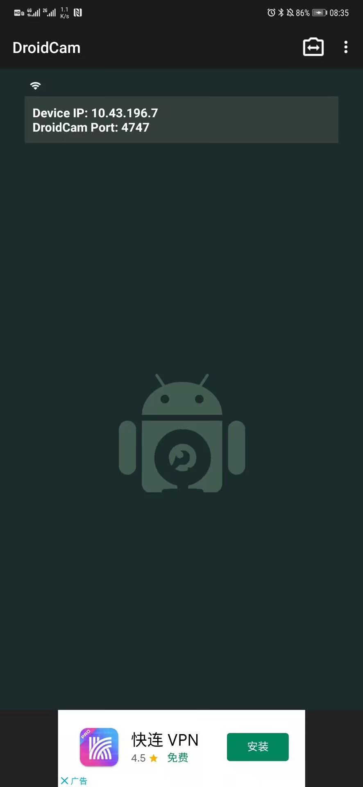

# 一、图种

1. 将图片和种子（或其他文件）放在同一个目录中
2. 图片重命名为：1.jpg
3. 种子重命名为：2.torrent
4. 将种子文件压缩，如：2.rar
5. 在同目录下创建文本文档，然后在其中输入：`copy/b 1.jpg+2.rar 3.jpg`
6. 将文本文档的后缀名改为：`.bat`
7. 双击 bat 文件。生成的 3.jpg 即为图种
8. 要解压图种只需更改后缀名为 `.rar`，然后解压即可

# 二、安卓手机当电脑摄像头 DroidCam

> 电脑软件：DroidCam.Setup
> 
> 网址：https://www.dev47apps.com/
> 
> 手机端软件：DroidCam 

1. 电脑与手机端分别安装软件
2. 手机端进入下方页面，记录端口号

3. 电脑端打开 DroidCamApp 软件，选择 USB 连接，选择自己的手机，填入端口号，点击 `Start` 进行连接

4. 连接成功后：

# 三、Win10 系统下任务栏图标显示白色方块变成空白的解决方法

1. 按快捷键 `Win+R` 打开 cmd 命令行，输入 `%localappdata%`，回车，进入 `C:\Users\10222148\AppData\Local` 目录
2. 在打开的文件夹中，找到 `Iconcache.db`，将其删除。（如果找不到 `Iconcache.db` 文件，说明被系统隐藏了，在文件夹选项中，查看的选项卡，点击“显示隐藏的文件、文件夹和驱动器”即可）
3. 打开 `任务管理器`，在任务管理器中找到 `Windows资源管理器`，右击鼠标，选择 `重新启动` 即可重建图标缓存。

# 四、

# 五、

# 六、

# 七、

# 八、

# 九、

# 十、

# 十一、

# 十二、

# 十三、

# 十四

# 十五、

# 十六、

# 十七、

# 十八、

# 十九、

# 二十、

## 1、

## 2、

## 3、

## 4、

## 5、

## 6、

## 7、

## 8、

## 9、

---

### ①、

### ②、

### ③、

### ④、

### ⑤、

### ⑥、

### ⑦、

### ⑧、

### ⑨、

### ⑩、

### ⑪、⑫、⑬、⑭、⑮、⑯、⑰、⑱、⑲、⑳

### ㉑、㉒、㉓、㉔、㉕、㉖、㉗、㉘、㉙、㉚

### ㉛、㉜、㉝、㉞、㉟、㊱、㊲、㊳、㊴、㊵

### ㊶、㊷、㊸、㊹、㊺、㊻、㊼、㊽、㊾、㊿

#### Ⅰ、

#### Ⅱ、

#### Ⅲ、

#### Ⅳ、

#### Ⅴ、

#### Ⅵ、

#### Ⅶ、

#### Ⅷ、

#### Ⅸ、

#### Ⅹ、

